# CoreAI Game-Creation Benchmark

Package graph: `com.neoxider.coreaibenchmark` 5.3.0 depends on `com.neoxider.coreai`,
`com.neoxider.coreaiunity`, and `com.neoxider.coreaimods` at the same version. The Mods dependency is
required because the scenarios instantiate and execute the real Lua tool/runtime.

The CoreAI Game-Creation Benchmark measures how well an LLM can build a game inside CoreAI, not how well it can describe one. Each scenario drives the real `execute_lua` and `world_command` tools, then grades the resulting world commands, Lua logic slots, simulated playthroughs, screenshots, and tool-call trace.

The benchmark answers the practical production question: is this model usable for my game, and for which role? A model can be fast and conversational but still fail as a scene builder, mechanic author, tool operator, programmer, orchestrator, or QA agent if it cannot call tools correctly, obey constraints, or reason through game rules.

## Scenario Groups

| Group | Difficulty | What it measures | Typical task |
|---|---:|---|---|
| G1 - Build world | 2-3/5 | World construction plus simple Lua rules | Spawn a player, coins, goal, and install score/win logic. |
| G2 - Mechanic Lua | 1-3/5 | Deterministic runtime mechanic authoring | Install `calculate_damage`, `win_condition`, or `craft_result` slots. |
| G3 - Reasoning/design | 4-5/5 | Derived game-rule reasoning, not code transcription | Work out tiered prices, Fibonacci rewards, clamps, boolean dungeon logic, or balanced enemy HP. |
| G4 - Playthrough | 5/5 | Multi-slot rule systems that survive simulation | Combat, shop, and crafting-chain playthroughs checked step by step. |
| G5 - Strict instruction-following | 3/5 | Subtractive compliance under explicit constraints | Never touch a protected object, use spawn only, obey exact counts/order, avoid forbidden tools, and stay within a tool budget. |
| G6 - Free-build castle hero | 5/5 | Open-ended visual building with real scene output | Build a castle scene from the model's own positions; graded leniently on scale (12+ objects) and variety (20+), kept as the report hero image. |
| G7 - Comprehensive integration | 5/5 (hardest) | World-building and Lua logic staying cross-consistent in one session | A key-and-gate puzzle: spawn Player/Gate/Key to an exact plan, install a `key_found` proximity slot, and keep the spawned world and the logic describing it in agreement end to end. |
| G8 - Described-state selection | 4/5 | Reasoning over a GIVEN textual world state, not live scene sensing | The prompt describes an already-populated scene; the model selects named objects, clears only junk, raises only undersized towers, and encodes the described wave-scaling rule as Lua. It is a single-turn conditional-selection test, not sustained multi-turn recovery. |

Groups are implemented as real PlayMode benchmark scenarios under `Assets/CoreAIBenchmark/Tests/PlayMode/Benchmarks`. G6 (hero image) and G7 capture scene screenshots because the built scene is part of the result; the other groups are primarily graded through logic execution and traces.

## Scoring

Each scenario is scored on a 0-100 base score. Checkpoints are weighted and normalized to 100, then penalties and hard caps are applied.

The six benchmark dimensions are:

| Dimension | Meaning |
|---|---|
| Tool correctness | Uses the expected tools, with valid arguments and no failed tool calls or invalid world commands. |
| Intent and sequence | Follows the requested order and uses the right action pattern. |
| Task completion | Actually achieves the requested game state or behavior. |
| Determinism | Produces identical outputs for identical inputs. |
| Reasoning | Solves derived mechanics and hidden samples that were not spoon-fed in the prompt. |
| Instruction adherence | Obeys explicit constraints, especially in subtractive G5 scenarios. |

Penalties subtract from the base score for failed tool calls, invalid world commands, over-building, disallowed actions, forbidden tools, repeated violations, and scenario-specific mistakes. Hard caps prevent misleading scores: an incomplete timeout/fault or final-state failure can cap at 60, and a prose-only run that never fires a tool can cap at 40.

Bonus is separate from the comparable base score. A scenario can earn up to 20 bonus points only when its base score is at least 90. The bonus rewards robustness/correctness plus efficiency: fewer tokens and less time than the scenario budget. Reports show `Total = Base + Bonus`, but suite rankings compare base score.

Verdicts:

| Verdict | Rule |
|---|---|
| PASS | Base score >= 90 and all mandatory checkpoints passed. |
| PARTIAL | Base score from 50 to 89. |
| FAIL | Base score below 50. |

When repetitions are enabled, each scenario is run multiple times and the suite score uses the per-scenario **mean (average)** base score over its repetitions. This makes rankings less sensitive to one noisy local-model run. A heavy one-off such as the G6 castle hero can set `RepsOverride = 1`, so it always runs exactly once even when the rest of the suite repeats.

## Game-Fitness Roles

The report converts dimension scores plus generation speed into a 0-10 fitness rating for each game-development role:

| Role | What it needs most |
|---|---|
| NPC / Dialogue | Basic tool use, task completion, speed, and lightweight instruction adherence. |
| Mechanic / GameMaster | Strict instructions, valid tools, task completion, speed, and sequencing. |
| Scene / Tool Operator | Reliable world/tool calls, ordering, instruction adherence, task completion, and determinism. |
| Programmer / Logic Author | Reasoning, valid Lua/tool use, task completion, instruction adherence, and determinism. |
| Orchestrator / Director | High reasoning, sequencing, instruction-following, task completion, and determinism. |
| QA / Regression Judge | Determinism, instruction adherence, reasoning, task completion, and tool correctness. |

Each role has gates. If a required dimension is below its minimum, the role is capped as not suitable even if other dimensions are high. Partial runs do not over-claim: if a run did not measure a dimension needed by a role, that role is marked not assessed. A tiny-model rule also caps agentic roles when tool correctness is below 40, because a model that cannot reliably call tools is not usable for agentic game work.

## Speed Metrics

The benchmark reports two speed numbers:

| Metric | Meaning |
|---|---|
| Provider-call tok/s | Completion tokens divided by time spent inside the LLM calls — this is **prefill + decode**, not decode-only. It excludes tool execution, grading and orchestration gaps. |
| Effective tok/s | Completion tokens divided by the whole agentic session time, including tool execution, grading, orchestration gaps, and other overhead. |

> **Why this is LOWER than LM Studio's tok/s.** LM Studio reports **decode-only** throughput (it excludes prompt prefill). CoreAI's provider-call tok/s includes prefill, and agentic prompts are large — tool schemas, role instructions, scenario goals, traces, grading context — commonly ~14x the generated output. With a big prompt, prefill dominates the call time, so CoreAI's number reads much lower than LM Studio's even on the same model. True decode-only timing requires measuring time-to-first-token, which is only available on the streaming path (see `TOKENS_PER_SEC_FIX_PLAN.md`). Effective tok/s is the honest end-to-end user experience; provider-call tok/s is the closest non-streaming comparison.

## How To Run

Open the UI Toolkit benchmark window from:

`CoreAI/Benchmarks/Benchmark Window (UITK)...`

The window has four tabs, plus toolbar **Open folder** / **Open report** shortcuts:

| Tab | Purpose |
|---|---|
| Run | Choose model/base URL overrides, scenario groups (G1-G8), repetitions, retries, timeout override, and start a run. |
| History | Browse past runs grouped by model, inspect dimension/role scores, open reports, and view captured scene thumbnails. |
| Models | A sortable leaderboard of the newest run per model, ranked by suite score, speed, pass-rate, or game-fit. |
| Compare | Select the newest JSON reports per model, optionally pin one model first, and build `COMPARISON.md` plus `COMPARISON.svg`. |

For a one-click run, use:

`CoreAI/Benchmarks/Run Game-Creation Benchmark`

The one-click menu reuses the last saved benchmark-window settings. Results are written to `TestResults/CoreAI/Benchmarks/BENCHMARK_<yyyyMMdd_HHmmss>_<model>.md` and `.json`.

For batchmode or automation, launch the explicit PlayMode suite through:

```powershell
Unity.exe -batchmode -projectPath C:\Git\CoreAI `
  -executeMethod CoreAI.Tests.EditMode.GameCreationBenchmarkLauncher.RunFromCli `
  -coreAiBenchmarkModel qwen3.5-4b-mtp `
  -coreAiBenchmarkGroups G1,G2,G3,G4,G5,G6,G7,G8 `
  -coreAiBenchmarkReps 3
```

Environment shaping is also supported:

| Variable | Purpose |
|---|---|
| `COREAI_TEST_BASE_URL` | OpenAI-compatible endpoint, for example LM Studio at `http://127.0.0.1:1234/v1`. |
| `COREAI_TEST_API_KEY` | API key when required; local LM Studio normally leaves this empty. |
| `COREAI_TEST_MODEL` | Model id to request. |
| `COREAI_BENCHMARK_GROUPS` | CSV group filter, such as `G1,G2,G6`; empty means all groups. |
| `COREAI_BENCHMARK_REPS` | Repetitions per scenario (averaged). Use 3-5 to smooth out a noisy local-model run. |

For an LM Studio multi-model sweep, load one model at a time, run the benchmark, unload it, and move to the next model. Example structure:

```powershell
$models = @(
  "qwen3.5-4b-mtp",
  "qwen3.6-27b-heretic-uncensored-finetune-neo-code-di-imatrix-max"
)

foreach ($model in $models) {
  lms unload --all
  lms load $model
  Unity.exe -batchmode -projectPath C:\Git\CoreAI `
    -executeMethod CoreAI.Tests.EditMode.GameCreationBenchmarkLauncher.RunFromCli `
    -coreAiBenchmarkModel $model `
    -coreAiBenchmarkGroups G1,G2,G3,G4,G5,G6,G7,G8 `
    -coreAiBenchmarkReps 3
  lms unload $model
}
```

After the sweep, build the comparison report from the Compare tab or the `CoreAI/Benchmarks/Build Model Comparison Report` menu.

## Comparison Report

The comparison report is built from the per-model JSON files. It emits:

- `COMPARISON.md` with a ranked table, dimension columns, efficiency/tool-error metrics, a Mermaid chart, and best-per-dimension highlights.
- `COMPARISON.svg` with a TerminalBench-style suite-score bar chart.

There are two ordering modes:

| Mode | Behavior |
|---|---|
| Ranked descending | Default. Models are sorted by suite base score. |
| Pinned first | One selected model is placed first, then the rest remain ranked. Useful for comparing a candidate against a baseline. |

### Custom comparisons from hand-picked reports

The Compare tab takes the *newest* JSON per model, but `GameCreationBenchmarkLauncher.ParseSummary`
and `WriteComparison` are public — so an editor script can compare exactly the runs you choose (e.g.
cloud models in one chart, local models in another, or an old run against a rerun of the same model):

```csharp
var picks = new[] {
    "BENCHMARK_20260703_024825_codex-GPT-5.5.json",
    "BENCHMARK_20260702_234351_glm-5.2.json",
};
var summaries = picks
    .Select(f => GameCreationBenchmarkLauncher.ParseSummary(Path.Combine(root, f)))
    .Where(s => s != null)
    .ToList();
GameCreationBenchmarkLauncher.WriteComparison(outputDir, summaries, pinnedModelId: null);
```

`WriteComparison` writes `COMPARISON.md` + `COMPARISON.svg` into `outputDir`, so different picks can
live side by side (the README's cloud and local charts are built exactly this way).

## Results Example


_Model card: suite score, dimension profile, and role fitness in one image._


_Scene capture example (a coin-collector build): the report marks expected/missing/extra objects visually. Current reports capture scenes for G6 (hero) and G7._


_G6 scene example: a free-form castle build preserving the model-authored layout._

> The free-build is resilient by design: when the model stops on its own (an empty response) or the
> per-scenario time budget elapses *after a scene already exists*, the harness grades and screenshots
> what was built instead of failing the run. This is why a long, unbounded build always yields a hero
> image even on small local models.

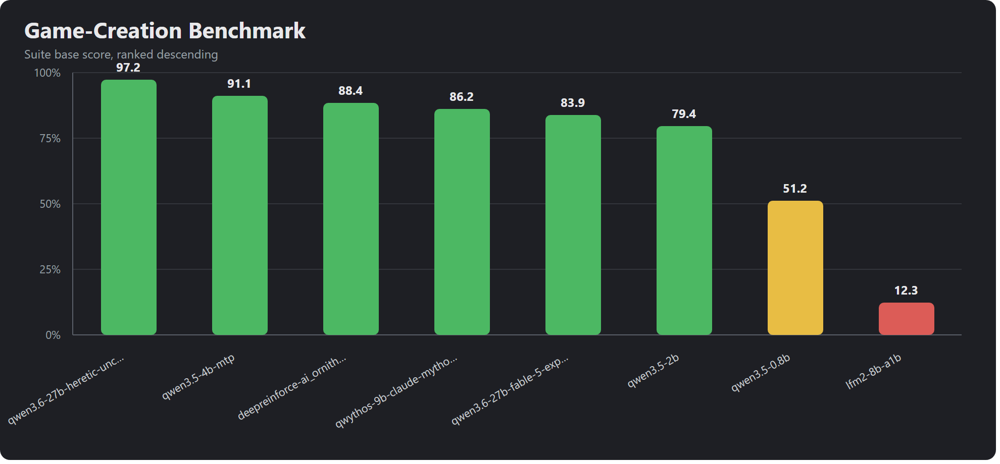

_Comparison chart: suite base scores across the newest JSON report for each selected model._

The repository's published cloud-model and local-model tables are historical suite v1.6 / G1-G7
baselines in the [README benchmark section](../../README.md#game-creation-benchmark). Current v1.7 / G1-G8
runs start a separate leaderboard and must not be mixed with those scores. Historical example (local models,
2026-07-02 sweep):

| # | Model | Suite | Pass-rate | P/PA/F | Tools | Intent | Task | Determ | Reason | Instr | Eff | Tool-err | Tokens | Run |
|---:|---|---:|---:|---|---:|---:|---:|---:|---:|---:|---:|---:|---:|---|
| 1 | `qwen3.6-27b-heretic-…-imatrix-max` | **93.1** | 87% | 20/1/2 | 98 | 96.1 | 96.8 | 100 | 100 | 88 | 1.3 | 9.7% | 52495 | `20260702_062928` |
| 2 | `deepreinforce-ai_ornith-1.0-9b` | **92.1** | 68.2% | 15/7/0 | 68.8 | 93.3 | 99.5 | 100 | 100 | 83.8 | 2.6 | 15.6% | 96801 | `20260702_093857` |
| 3 | `qwen3.5-4b-mtp` | **92** | 84% | 21/3/1 | 93 | 100 | 93.5 | 100 | 100 | 91.7 | 4.7 | 11.9% | 62773 | `20260702_205410` |
| 4 | `qwen3.6-27b-fable-5-experimental` | **87.3** | 73.7% | 14/3/2 | 85.9 | 83.3 | 88.9 | 100 | 80 | 83.8 | 1.9 | 32.2% | 58974 | `20260702_054314` |
| 5 | `qwen3.5-2b` | **84.8** | 75% | 18/2/4 | 92.6 | 100 | 83.3 | 100 | 66.7 | 91.2 | 4.4 | 8.5% | 57656 | `20260702_225056` |
| 6 | `deepreinforce-ai_ornith-1.0-35b` | **81.1** | 65.2% | 15/4/4 | 83.3 | 87.5 | 91.3 | 100 | 95.8 | 78.7 | 3.5 | 16.8% | 70744 | `20260702_101519` |
| 7 | `qwythos-9b-claude-mythos-5-1m` | **81** | 62.5% | 15/5/4 | 69.4 | 84.6 | 91.7 | 100 | 88.9 | 78.7 | 3.2 | 18.2% | 63570 | `20260702_052949` |
| 8 | `qwen3.5-0.8b` | **57.8** | 41.7% | 10/4/10 | 94.4 | 80.1 | 91.4 | 100 | 55.6 | 38 | 2.4 | 1% | 43383 | `20260702_222625` |
| 9 | `lfm2-8b-a1b` | **12.4** | 0% | 0/0/25 | 50.9 | 2.1 | 0 | 0 | 0 | 57.8 | 0 | 0% | 52430 | `20260702_051709` |

## Castle Gallery - G6 Free-Build Visual

The G6 scenario is a free-form visual build (default: castle). Each model authors the whole scene from scratch. Below are the available castle screenshots from `Docs/Images/castles/`, showing each model's spatial reasoning and tool-calling capability. Scores are the model's overall suite score from its ranked run; heroes from the 2026-07-02+ runs use the daytime gate-angle camera with close-up insets.

**Cloud models:**

| Model | Hero screenshot |
|-------|-----------------|
| **GPT-5.5** (97/100) | 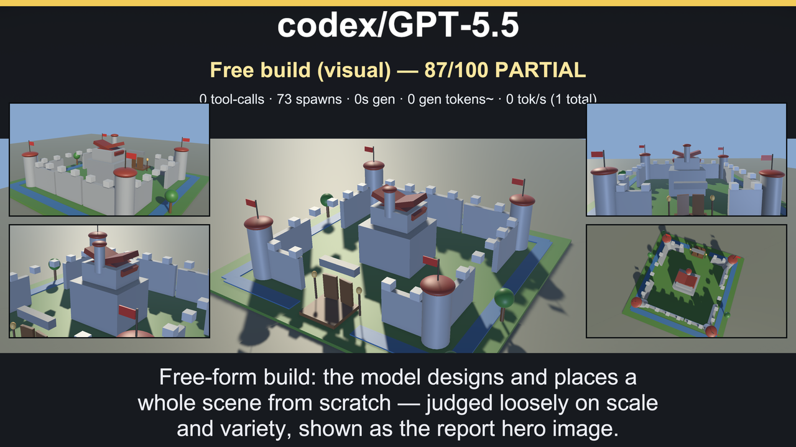 |
| **glm-5.2** (93.5/100) | 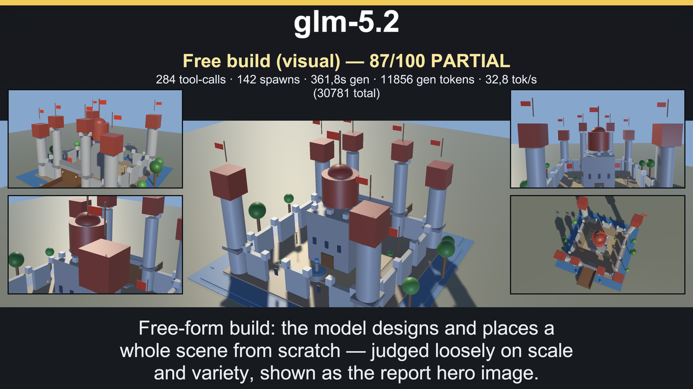 |
| **GPT-5.3 Codex Spark** (93.2/100) | 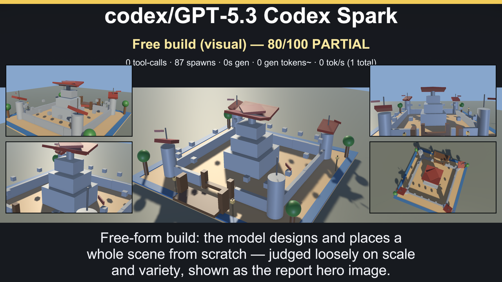 |
| **claude-opus-4.8** (92.9/100) | 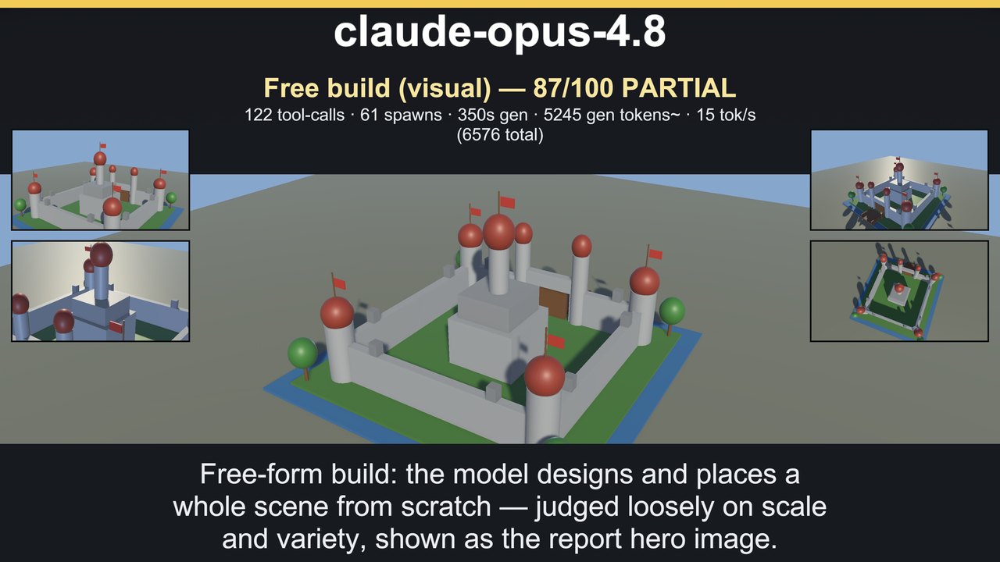 |
| **claude-haiku-4.5** (92.7/100) | 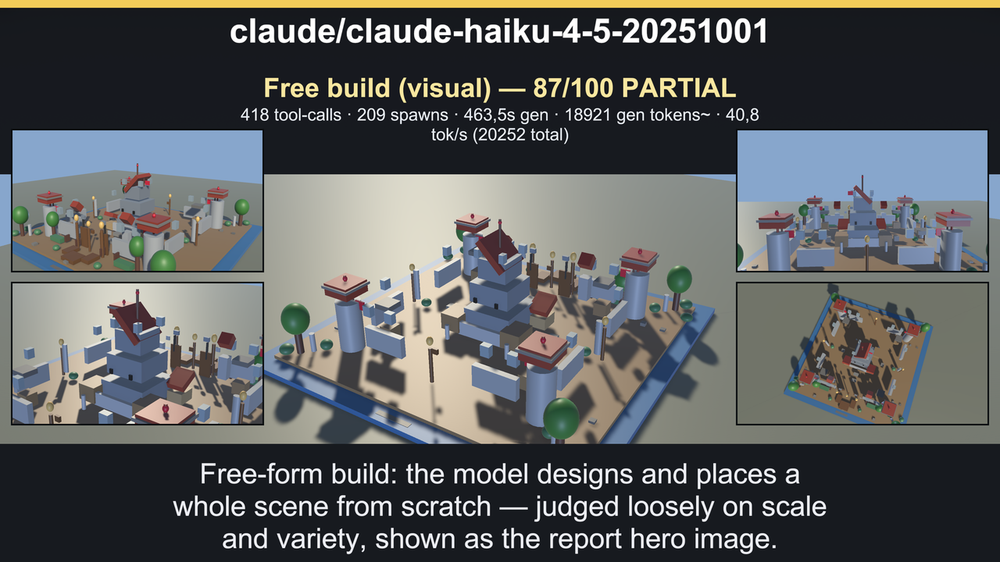 |
| **claude-fable-5** (89.5/100) | 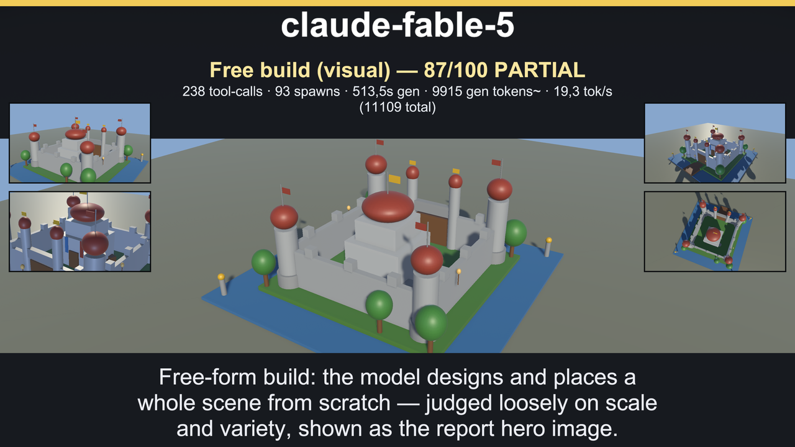 |
| **claude-sonnet-5** (88.2/100)¹ | 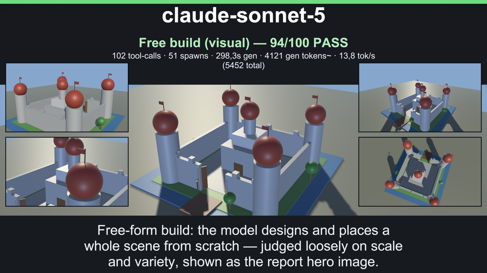 |

**Local models (LMStudio):**

| Model | Hero screenshot |
|-------|-----------------|
| **qwen3.6-27b-heretic-uncensored-finetune-neo-code-di-imatrix-max** (93.1/100) | 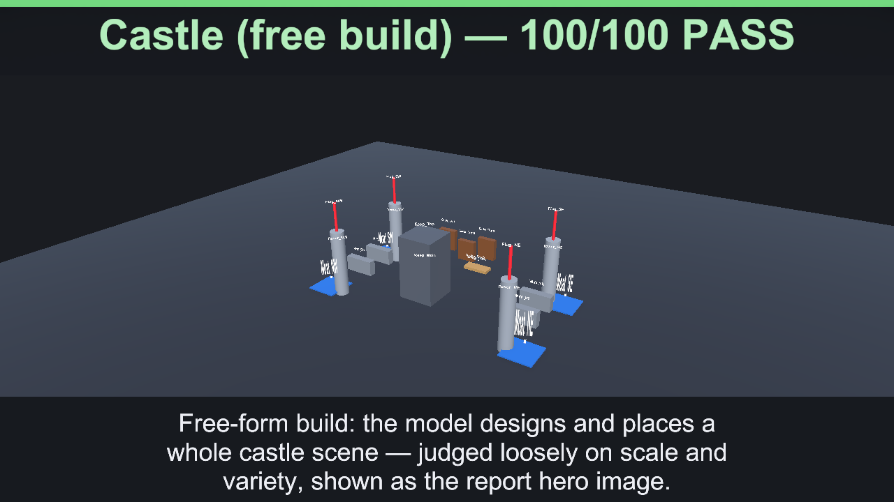 |
| **deepreinforce-ai_ornith-1.0-9b** (92.1/100) | 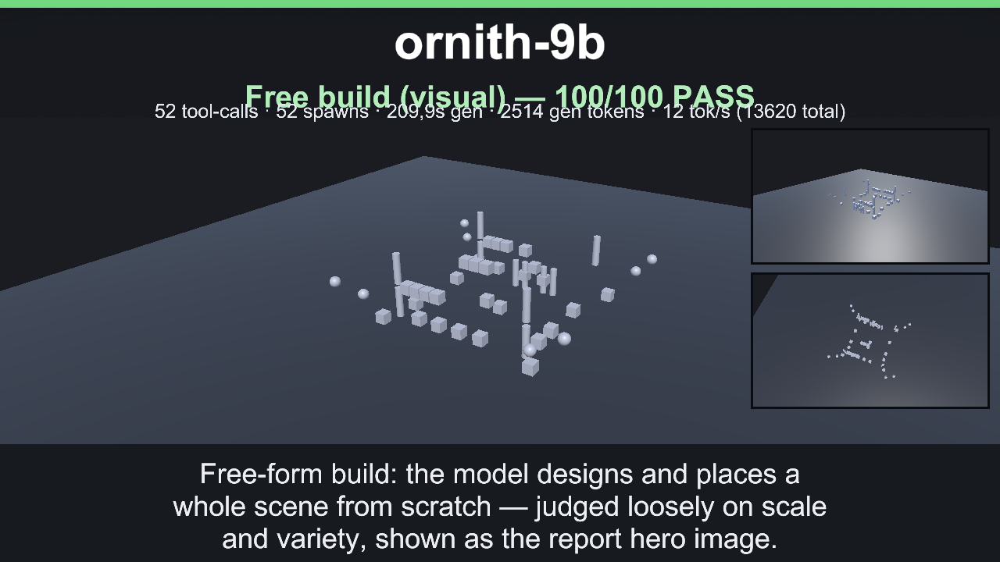 |
| **qwen3.5-4b-mtp** (92/100) | 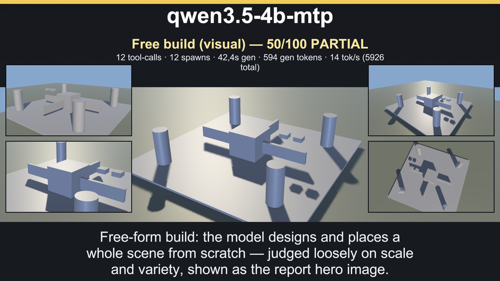 |
| **qwen3.6-27b-fable-5-experimental** (87.3/100) |  |
| **qwen3.5-2b** (84.8/100) | 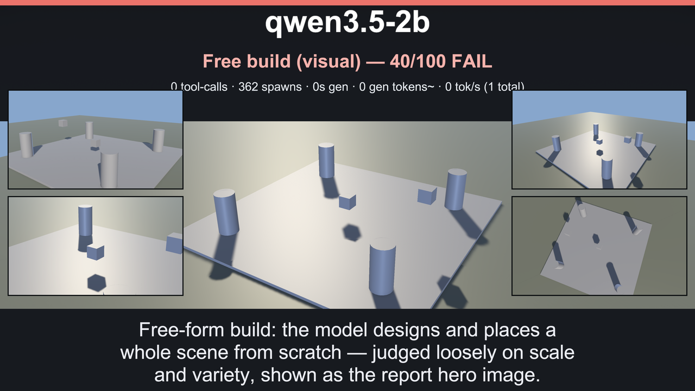 |
| **qwythos-9b-claude-mythos-5-1m** (81/100) | 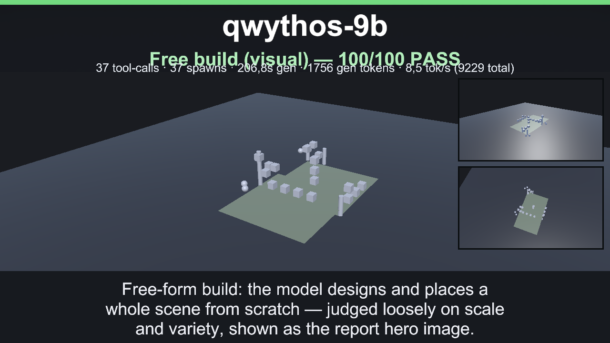 |
| **qwen3.5-0.8b** (57.8/100) | 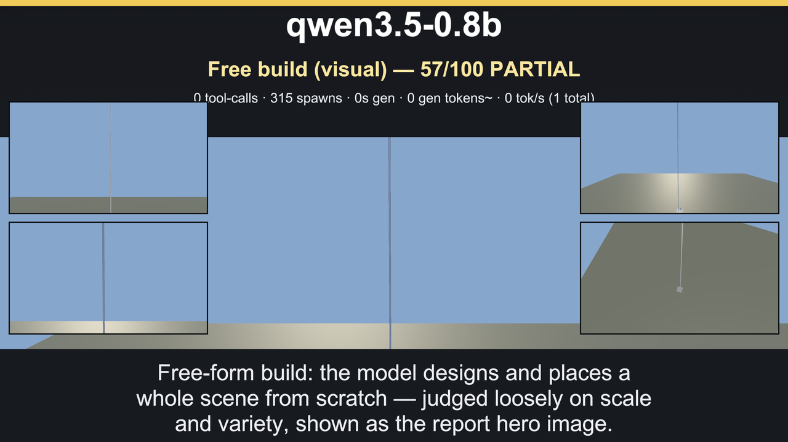 |

> **Override G6 subject:** the free-build visual is overridable from the benchmark window UI field, so the report hero can use a different subject without code changes. See [How To Run](#how-to-run) above for details.

¹ Sonnet's hero image is from its G6-only verification rerun (94.2 on that scenario) after a
chat-only bridge fix; its suite score in the table is from the historical full G1-G7 run.
See [the full example report](../../Docs/Images/example_report/example_report.md) for a complete
per-scenario breakdown and transcript example.

## Community Leaderboard

Ranked results with version-separated sections (current suite v1.7/G1-G8; historical v1.6/G1-G7)
and a public submission workflow live on the
[community leaderboard page](../../Docs/BENCHMARK_LEADERBOARD.md). Run the suite as described in
[How To Run](#how-to-run) above, then open a PR adding your row with the report JSON, run id,
model file/quantization, and hardware — the leaderboard page lists the exact requirements and
honesty rules.
