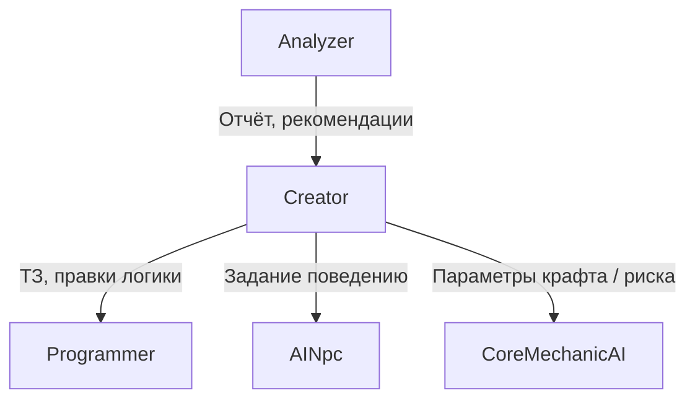

# Роли ИИ в шаблоне CoreAI — каталог для оркестрации

**Назначение:** единый словарь **типов агентов** (поведений ИИ), их целей, типичных входов/выходов и правил **размещения** (хост / локально / гибрид). Игра на шаблоне **включает только нужные роли**; оркестратор не обязан поднимать всех. Рекомендации по **размеру/типу модели** (локально vs API) — §6.

**Версия документа:** 1.5

**Связанные документы:** [QUICK_START.md](QUICK_START.md), [DGF_SPEC.md](DGF_SPEC.md) (сеть, авторитет, NGO по умолчанию), [DEVELOPER_GUIDE.md](DEVELOPER_GUIDE.md) (карта кода, Lua, тесты, **traceId** / лог **Llm**), [LLMUNITY_SETUP_AND_MODELS.md](LLMUNITY_SETUP_AND_MODELS.md) (LLMUnity, Qwen, OpenAI-compatible, таймаут запроса), [../../_exampleGame/Docs/UNITY_SETUP.md](../../_exampleGame/Docs/UNITY_SETUP.md) (настройка демо-сцены).

---

## 1. Принципы

### 1.1 Оркестрация и хост

- **По умолчанию** для мультиплеера: тяжёлые вызовы LLM и **глобальные** решения (правила сессии, мир, античит-чувствительные исходы) — на **хосте** (см. DGF_SPEC §5).
- **Игра определяет подмножество ролей:** например только **AINpc** в сингл-адвенче или только **CoreMechanicAI** в крафте без мира-«создателя».

### 1.2 Размещение (Placement)

| Тег | Смысл |
|-----|--------|
| **HostAuthoritative** | Решение одно на сессию; исполняется LLM **или заглушка** на хосте (см. **§1.4**); клиенты получают результат по сети. |
| **LocalPerClient** | Каждый клиент может вызывать LLM локально (косметика, реплики «в голове», оффлайн-помощник). **Не** меняет правила боя без отдельной синхронизации. |
| **Hybrid** | Часть стадий на хосте (валидация, seed), часть — локально (озвучка/текст); договор игры фиксирует, что реплицируется. |

Разработчик игры **явно** назначает placement для каждой включённой роли в конфиге (ScriptableObject / policy), чтобы не смешивать «случайно» авторитет мира и локальный флейвор.

### 1.3 Связь ролей (кто кого «заказывает»)



Это **логическая** схема: физически все задачи проходят через **оркестратор** (очередь, приоритет, бюджет).

### 1.4 Билды без моделей ИИ на хосте (roadmap ядра)

Если **весь** LLM сосредоточен на хосте (**HostAuthoritative** для всех ролей), шаблон в перспективе должен позволять **сборку без нейромоделей**: на хосте в DI — **`ILlmClient`-заглушка** (детерминированные или табличные ответы по роли), без Ollama и без весов в билде. **NGO** и репликация состояния работают как обычно; меняется только источник решений. Детали и цели: [DGF_SPEC.md §5.2](DGF_SPEC.md).

---

## 2. Пять базовых ролей шаблона

### 2.1 Creator — «Создатель»

| | |
|--|--|
| **ID** | `Creator` |
| **Цель** | Менять **намерение сессии**: правила, данные use case, модификаторы волн, мета-события, «что должно произойти дальше». |
| **Поведение** | На основе снимка мира и целей дизайна выдаёт **структурированные** пакеты (JSON): новые аффиксы, смена фазы, постановка задач другим агентам. |
| **Входы** | Session Snapshot, отчёты **Analyzer**, лимиты дизайна, ручные флаги геймдизайнера. |
| **Выходы** | Команды в MessagePipe; постановка задач **Programmer** (сгенерировать/поправить Lua); параметры для **AINpc** / **CoreMechanicAI**. |
| **Placement** | Обычно **HostAuthoritative** в мультиплеере. |
| **Примеры** | «Игрок слишком доминирует — усложнить волну 7»; «включить сюжетную ветку Б»; «выдать недельный модификатор». |
| **Риски** | Высокий приоритет в оркестраторе; обязателен **валидатор** схемы и лимиты на частоту смен правил. |
| **Формат** | JSON tool calls: `{"name": "memory", "arguments": {"action": "write", "content": "..."}}` для сохранения памяти. |

---

### 2.2 Analyzer — «Анализатор»

| | |
|--|--|
| **ID** | `Analyzer` |
| **Цель** | **Понимать**, что происходит: стиль игры, узкие места, скука, читерские паттерны, экономика. |
| **Поведение** | Агрегирует телеметрию → краткий отчёт (структура для LLM или эвристики) → рекомендации **Creator** или флаги «внимание». |
| **Входы** | **Готовые потоки из ядра:** события боя, DPS/смерти, время в зонах, инвентарь, выбор апгрейдов (см. §4 «Телеметрия в ядре»). |
| **Выходы** | `AnalyzerReport` (DTO), публикация в шину; не меняет мир напрямую. |
| **Placement** | **HostAuthoritative** (целостная картина партии). Локальный анализ допустим только для **неавторитетных** метрик (UX), без влияния на правила. |
| **Примеры** | «Агрессивный стиль, низкий риск смерти»; «игнорирует крафт»; «дисбаланс оружия X». |
| **Оркестрация** | Ниже **Creator** по приоритету при конфликте; может **батчиться** (раз в N минут). |

---

### 2.3 Programmer — «Программист» (Lua)

| | |
|--|--|
| **ID** | `Programmer` |
| **Цель** | По ТЗ от **Creator** (или редко от других ролей) **писать, чинить и сужать** фрагменты **Lua** под песочницу. |
| **Поведение** | Цикл: промпт с whitelist API → генерация → статическая проверка → dry-run → исполнение на хосте → при ошибке self-heal (ограниченно). |
| **Входы** | Спецификация от Creator, контекст ошибки MoonSharp, текущая версия APIRegistry. |
| **Выходы** | Подписанный **UseCaseScript** (строка/hash) + команда «подключить/заменить» через шину. Или JSON: `{"tool": "memory", "action": "write", "content": "..."}`. |
| **Placement** | Почти всегда **HostAuthoritative** (код влияет на симуляцию). |
| **Примеры** | «Скрипт спавна засады для леса»; «патч логики награды при смерти босса». |
| **Связи** | Подчинён **Creator**; не инициирует глобальные правила без запроса. |

**Дополнительно (рантайм‑инструменты):**
- Встроенная фича **World Commands** позволяет Programmer через Lua безопасно публиковать команды мира (спавн/перемещение/сцены) без прямого доступа к Unity API. См. **[WORLD_COMMANDS.md](WORLD_COMMANDS.md)**.
- Рекомендация: любые «изменения компонентов» делайте через **типизированные** команды или allowlist‑политику (не через произвольную рефлексию из Lua).
- **Формат Tool Calls**: Все агенты используют **единый JSON формат** для tool calls: `{"name": "tool_name", "arguments": {...}}`. Programmer вызывает `execute_lua` tool для Lua кода, Memory tool для сохранения памяти.

---

### 2.4 AINpc — «Умный NPC»

| | |
|--|--|
| **ID** | `AINpc` |
| **Цель** | Поведение **конкретных акторов**: босс, торговец, толпа, мелкий рабочий — диалог, тактика, реакции на игрока. |
| **Поведение** | Короткие запросы: реплика, выбор действия из **закрытого меню** (не произвольный код мира), иногда локальная «оценка намерения». |
| **Входы** | Контекст NPC (id, роль, память квеста), близость игрока, флаги сюжета. |
| **Выходы** | Текст/выбор действия / параметры анимационного дерева; команды только в разрешённый **NPC channel** MessagePipe. |
| **Placement** | **Часто HostAuthoritative** для боя и синхронных реакций; **LocalPerClient** возможен для **чисто визуального/текстового** флейва, если дизайн допускает рассинхрон реплик (редко для коопа). В коопе безопаснее хост или выделенный «дирижёр» сцен. |
| **Примеры** | Босс перефразирует угрозу под стиль партии; толпа рабочих получает коллективное «настроение»; продавец предлагает скидку после отчёта Analyzer. |
| **Оркестрация** | Высокая частота → **микро-бюджет**, приоритет ниже **CoreMechanicAI** в момент крафта/риска, если так решено игрой. |

---

### 2.5 CoreMechanicAI — «Кор-механика»

| | |
|--|--|
| **ID** | `CoreMechanicAI` |
| **Цель** | ИИ как **часть геймплейной системы**: крафт, удача, несовместимость, процедурные исходы с **ясными границами**. |
| **Поведение** | На входе — состав предметов/ингредиентов + таблицы ограничений; на выходе — **числа и флаги** (статы, шанс поломки, «уникальный аффикс»), иногда короткий Lua только если игрок включил «динамические правила». |
| **Входы** | Рецепт, инвентарь, seed от хоста, опционально стиль игрока от Analyzer. |
| **Выходы** | `CraftOutcome`, `AffixRoll`, событие «предмет уничтожен» и т.д. — только через типизированные команды. |
| **Placement** | **Вариант A:** только **HostAuthoritative** (честный кооп, один исход). **Вариант B:** **LocalPerClient** для одиночного «симулятора удачи» без влияния на других. **Вариант C:** **Hybrid** — хост фиксирует seed и валидирует итог. Выбор — **в конфиге игры**, не в ядре по умолчанию. |
| **Примеры** | Ковка брони: совместимость сплавов, шанс трещины, уникальный префикс под билд; алхимия: взрыв при несовместимости; процедурный лут с учётом «скуки» из Analyzer. |
| **Связи** | Может получать **рекомендации** от Creator; **не** должен напрямую вызывать Programmer без политики (обычно данные, не код). |

---

## 3. Дополнительные роли (рекомендации шаблона)

Их можно не включать в v1 ядра, но имена полезны для дорожной карты.

| ID | Название | Цель | Заметки |
|----|----------|------|---------|
| `Director` | Режиссёр сессии | Темп, «драматургия» тишины/пика, не ломая баланс числом | Низкий приоритет; часто только данные для Creator |
| `Moderator` | Модерация вывода | Фильтр токсичности/PII в тексте NPC до показа | Может быть отдельным маленьким вызовом до AINpc |
| `LoreWeaver` | Лор-надстройка | Связать события в объяснимую историю без смены правил | Выход только текст/квестовые флаги |
| `EconomyAI` | Живая экономика | Цены, дефицит, «инфляция» в хабе | HostAuthoritative; редкие тики |

---

## 4. Телеметрия в ядре (ожидания для Analyzer)

Пакет **CoreAI** (`com.nexoider.coreai`) должен предлагать **готовые строительные блоки** (подписки / агрегаторы), а игра — включать нужные:

- **Боевой тик:** урон в/из, смерти, время боя, волна №.
- **Позиция/зона:** время в триггерах, смена биома.
- **Прогрессия:** взятые апгрейды, игнорируемые ветки.
- **Экономика забега:** валюта, крафт-попытки, провалы.
- **Сеть (опционально):** латентность, desync-флаги (для отладки, не для LLM в проде без политики).

Формат: нормализованные **события** в MessagePipe + периодический **SessionSnapshot** для LLM (см. DGF_SPEC, Session Snapshot).

---

## 5. Матрица: какие роли в какой игре

| Профиль игры | Типичный набор | Примечание |
|--------------|----------------|------------|
| Roguelite-арена | Creator, Analyzer, Programmer (редко), CoreMechanicAI (лут) | AINpc минимально |
| Кооп шутер с боссами | Creator, Analyzer, AINpc (босс), Programmer по событиям | |
| Торговый сим с диалогами | AINpc, Analyzer, Creator | Programmer опционально |
| Чистый крафт / выживание | CoreMechanicAI, Analyzer | Creator слабый; хост vs локально — по честности PvP |
| Сюжетный сингл | Все пять + Director | Проще Local для косметики NPC |

---

## 6. Рекомендации по моделям: локально vs API (по ролям)

### 6.1 Общие замечания

- **Шаблон CoreAI не ограничивает** верхний размер модели: у вас локально до **~35B** — это профиль **вашей** машины; в проде те же роли могут ходить в **API** (большие модели, квантизация, регион).
- **Сначала локально** (Ollama, llama.cpp, LM Studio и т.д.) — нормальный путь: дешёвые итерации, приватность, отладка оркестратора.
- Имена вроде **Qwen3 / Qwen2.5 0.8B** быстро устаревают; ниже — **классы размера** и тип задачи. Конкретную чекпойнт-модель подбирайте под **JSON/structured output** и **латентность** на вашем железе.
- **Жёсткий JSON + схема** снижает требования к размеру модели; **свободный текст и рассуждение** — повышает.
- Для API: смотрите **rate limit**, **стоимость** и **задержку**; роли с высокой частотой (**толпа NPC**) почти всегда выгоднее **малой локальной** модели или **не-LLM** (таблицы + вариация).

### 6.2 Условные классы размера (ориентиры)

| Класс | Примерный объём параметров | Типичное применение |
|-------|----------------------------|---------------------|
| **Tiny** | ~0.5–1.5B | Строгий JSON, классификация, короткая реплика из шаблона |
| **Small** | ~3–8B | Структурированные отчёты, простой Lua/логика с сильным промптом |
| **Medium** | ~14B | Баланс качества и скорости на одной GPU |
| **Large** | ~24–35B+ (локально) | Сложные решения Creator, качественный Programmer |
| **XL / API** | больше или облако | Продакшен-качество, длинный контекст, когда локально не тянет |

### 6.3 Таблица по ролям

| Роль | Сложность вывода | **Локально (старт / тесты)** | **Когда тянуть больше или API** | Заметки |
|------|------------------|-------------------------------|----------------------------------|---------|
| **CoreMechanicAI** | Числа, флаги, короткий JSON (статы, шанс, «сломать/нет») | **Tiny достаточно** при узкой схеме и хорошем промпте — в духе **Qwen ~0.8B–1.5B** или аналог | Граф несовместимостей «как химия», длинные цепочки модификаторов → **Small–Medium** | Часто выгодно **кэшировать** типовые исходы; LLM только для «редких» комбинаций. |
| **Analyzer** | Сжатый отчёт, теги, метрики | **Tiny–Small** на батчах (раз в N секунд) | Глубокий разбор билдов/читов → **Medium+** или API | Вход **урезать** (агрегаты), не сырые логи. |
| **AINpc (толпа / мелочь)** | Одна короткая реплика или `{mood, barkId}` | **Tiny** или **вообще без LLM**: таблица + случайный выбор; LLM — опционально для «окраски» | — | **Не** дергать модель на каждого кадра толпы: один вызов на **группу** («настроение толпы») или 0 вызовов. |
| **AINpc (торговец / именной NPC)** | Диалог 1–3 реплики, выбор из меню действий | **Small** | Нюансный лор, длинная ветка → **Medium** / API | Кооп: лучше **хост** или общий seed, чтобы не разъезжались факты квеста. |
| **AINpc (босс / ключевой)** | Тактическая фраза + привязка к фазам боя | **Small–Medium** | Кинематограф + сложная логика → **Large** / API | Низкая частота вызовов — можно позволить тяжелее модель. |
| **Programmer** | Lua в песочнице, правки по ошибке | **Small** (жёсткий whitelist API + примеры) | Надёжный codegen, меньше итераций self-heal → **Medium–Large** / API | Критичен **контекст ошибки MoonSharp** и короткий allowed-API list. |
| **Creator** | Пакеты правил, аффиксы, постановка задач | **Medium** как компромисс | «Умная» смена режима сессии, тонкий баланс → **Large** / API | Высокий **приоритет оркестратора**, но **не** высокая частота. |
| **Director / LoreWeaver** | Текст, редкие события | **Small–Medium** | — | Часто можно объединить с Creator одной моделью, разными промптами. |
| **Moderator** | Классификация/фильтр | **Tiny** | Тонкий юридический/безопасный контекст → специализированные API | Лучше отдельный быстрый проход перед показом текста игроку. |

### 6.4 Практический совет под ваш сетап (локально до ~35B)

- Развести **две очереди оркестратора**: **fast lane** (Tiny/Small: Mechanic, Analyzer batch, толпа) и **slow lane** (Creator, Programmer, босс).
- Одну и ту же физическую модель **Medium** можно переиспользовать с разными **system prompt** для ролей, если VRAM позволяет один инстанс; иначе — Tiny для фона + Medium для редких задач.
- **35B** для шаблона — «потолок удобства» на одной машине, а не требование: большинство ролей на проде останутся на **малых** моделях или API.

### 6.5 API vs локально (когда что)

| Ситуация | Предпочтение |
|----------|----------------|
| Разработка, итерации промптов | Локально |
| Продакшен, нет мощной машины у игрока | API или облачный выделенный «AI-сервер» (отдельная политика) |
| Персональные данные в промпте | Локально или свой хостинг |
| Нужен одинаковый ответ у всех клиентов (кооп) | Авторитет хоста + одна модель/endpoint на сессию |

### 6.6 Стек Qwen 3.5 (0.8B / 4B / 9B) в LLMUnity

- **0.8B** — дефолт для широкой аудитории и малого размера билда; достаточно для строгого JSON и коротких задач (**CoreMechanicAI**, батч **Analyzer**) при хорошем системном промпте.
- **4B** — разумный шаг вверх для **AINpc** и отчётов без огромного прироста веса.
- **9B** — «качество» для **Creator** / **Programmer** на машинах с запасом VRAM/RAM; поднимайте **GPU layers** в инспекторе **LLM**.
- Переключение **локально ↔ OpenAI-compatible HTTP** — через `OpenAiHttpLlmSettings` на `CoreAILifetimeScope` (см. [LLMUNITY_SETUP_AND_MODELS.md](LLMUNITY_SETUP_AND_MODELS.md)).

---

## 7. NGO и смена стека

Рекомендация репозитория: **NGO** (DGF_SPEC §5.1). Роли и placement **не привязаны** к NGO именем: интерфейс `INetworkAuthority` остаётся точкой смены на Mirror и т.д.

---

## 8. Валидация ответов LLM (Response Validation)

Начиная с **v0.5.0**, каждая роль имеет **специализированную политику валидации** ответов. Это гарантирует что модель возвращает ожидаемый формат, а при ошибке — автоматический retry.

### 8.1 Политики по ролям

| Роль | Политика | Что ожидает | Retry при ошибке |
|------|----------|-------------|------------------|
| **Programmer** | `ProgrammerResponsePolicy` | Tool call `execute_lua` | ✅ Да |
| **CoreMechanicAI** | `CoreMechanicResponsePolicy` | JSON с числовыми полями | ✅ Да |
| **Creator** | `CreatorResponsePolicy` | JSON объект (команда мира) | ✅ Да |
| **Analyzer** | `AnalyzerResponsePolicy` | JSON с `metric`/`recommendation`/`analysis` | ✅ Да |
| **AINpc** | `AINpcResponsePolicy` | JSON ИЛИ непустой текст (мягкая) | ✅ Да |
| **PlayerChat** | `PlayerChatResponsePolicy` | Без валидации (свободный текст) | ❌ Нет |
| **Merchant** | `NoOpRoleStructuredResponsePolicy` | Tool call `get_inventory` + текст | ✅ Tool Call Retry (3 попытки) |

### 8.2 Как работает retry

1. LLM возвращает ответ
2. `CompositeRoleStructuredResponsePolicy` проверяет формат по roleId
3. При провале → `AiOrchestrator` делает **один повторный запрос** с подсказкой:
   ```
   structured_retry: Expected execute_lua tool call
   ```
4. Метрика `RecordStructuredRetry(roleId, traceId, failureReason)` логируется

### Tool Call Retry

Для tool calls (memory, execute_lua, get_inventory) действует отдельный механизм retry:
1. Если модель вернула tool call в неправильном формате
2. Система возвращает ошибку: "ERROR: Tool call not recognized. Use this format: {\"name\": \"...\", \"arguments\": {...}}"
3. Модель получает ещё одну попытку (до `CoreAISettings.MaxToolCallRetries`, по умолчанию 3)
4. Если все попытки исчерпаны - ответ принимается как есть

Это помогает маленьким моделям (Qwen3.5-2B) которые иногда забывают формат tool call.

### 8.3 Кастомные роли

Для кастомных ролей используйте:
```csharp
var composite = container.Resolve<CompositeRoleStructuredResponsePolicy>();
composite.RegisterPolicy("MyRole", new MyCustomValidationPolicy());
```

Или отключите валидацию:
```csharp
composite.RegisterPolicy("MyRole", new NoOpRoleStructuredResponsePolicy());
```

### 8.4 Тесты

Все политики покрыты **20 EditMode тестами**:
- `RoleStructuredResponsePolicyEditModeTests.cs` — валидация для каждой роли
- Проверка валидных/невалидных ответов
- Проверка `failureReason` сообщений

---

## 9. Версии документа

| Версия | Изменения |
|--------|-----------|
| 1.0 | Первый каталог: Creator, Analyzer, Programmer, AINpc, CoreMechanicAI; placement; доп. роли; телеметрия |
| 1.1 | §6 рекомендации по моделям (локально/API) по ролям; классы Tiny–XL; очереди fast/slow |
| 1.2 | §1.4 + правка HostAuthoritative: LLM или заглушка; ссылка на DGF_SPEC §5.2 |
| 1.3 | §6.6 Qwen 3.5 0.8B/4B/9B и OpenAI-compatible через CoreAI |
| 1.4 | §8 валидация ответов LLM per role, retry flow, кастомные роли |
