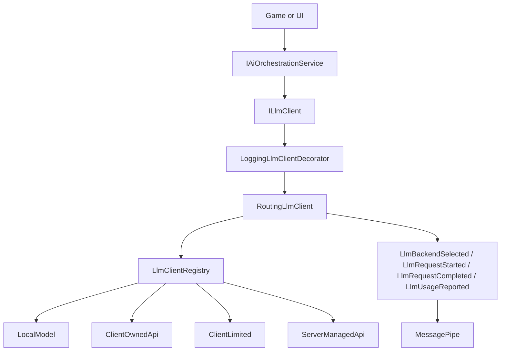

# CoreAI Unity Architecture

## Layers

`CoreAI.Core` is portable C# and owns orchestration contracts, agent policies, Lua safety, memory contracts, and message contracts. It does not reference UnityEngine, VContainer, or MessagePipe.

`CoreAI.Source` is the Unity integration layer. It owns VContainer composition, MessagePipe brokers, Unity logging, settings assets, LLM adapters, chat UI, world commands, and editor-facing setup.

Game code should depend on public contracts such as `IAiOrchestrationService`, `ILlmClient`, `IAiGameCommandSink`, `LlmExecutionMode`, and MessagePipe messages instead of reaching into infrastructure classes.

## LLM Mode Flow

## Single-Mode And Multi-Mode Setup

For simple projects, choose one global mode on `CoreAISettingsAsset`:

- `LocalModel` uses LLMUnity when the platform and scene provide an `LLMAgent`.
- `ClientOwnedApi` calls an OpenAI-compatible endpoint with the user's provider key.
- `ClientLimited` calls an OpenAI-compatible endpoint after local request and prompt-size checks.
- `ServerManagedApi` calls a backend-owned proxy through `ServerManagedLlmClient` and keeps provider keys off the client. Games can set a dynamic JWT with `ServerManagedAuthorization.SetProvider(...)`.
- `Offline` uses deterministic test/demo responses.

For mixed projects, use `LlmRoutingManifest` profiles. Each profile has its own `LlmExecutionMode`, backend settings, context window, and optional ClientLimited limits. Route entries map role ids such as `PlayerChat`, `Analyzer`, or `*` to those profiles.

## MessagePipe Boundary

The portable core defines message contracts only. The Unity layer registers brokers in `CoreServicesInstaller` and publishes LLM routing/status/usage messages from `RoutingLlmClient`. Tool execution also publishes `LlmToolCallStarted`, `LlmToolCallCompleted`, and `LlmToolCallFailed`.

Tool lifecycle events expose `LlmToolCallInfo` through `Info`. It carries `TraceId`, `RoleId`, provider `CallId`, `ToolName`, and sanitized arguments, so observers can correlate start/completed/failed events for the exact tool call. The old direct properties remain as accessors for compatibility.

New UI, diagnostics, and gameplay observers should subscribe to MessagePipe messages. Existing static events remain for compatibility, but new cross-layer integration should prefer MessagePipe.

### Child LifetimeScope and `GlobalMessagePipe`

`CoreServicesInstaller` registers MessagePipe in `CoreAILifetimeScope` and, in a build callback, calls **`GlobalMessagePipe.SetProvider(resolver.AsServiceProvider())`**. `RoutingLlmClient` publishes `LlmBackendSelected`, `LlmRequestStarted`, `LlmRequestCompleted`, and `LlmUsageReported` through **`IPublisher<T>` resolved from that same (parent) container**.

If the game adds a **child** `LifetimeScope` (VContainer parent = `CoreAILifetimeScope`) and calls **`RegisterMessagePipe()` again** for its own cross-feature brokers, the child scope may resolve **`ISubscriber<LlmRequestStarted>`** (and the other LLM message types) from a **different** MessagePipe instance. Those subscribers will not receive events from the parent publishers, so telemetry and debug UI can show **zero calls / no timing** while the LLM still responds. For services registered only under the child scope, prefer **`GlobalMessagePipe.GetSubscriber<T>()`** for CoreAI LLM observability (same provider as `RoutingLlmClient`), or register additional brokers using the **parent** `MessagePipeOptions` without creating a second pipe.

**PlayMode / tests without `CoreAILifetimeScope`:** `ToolExecutionPolicy` publishes `LlmToolCall*` only when **`GlobalMessagePipe.IsInitialized`**. Package helper **`GlobalMessagePipeMinimalBootstrap.EnsureInitializedForLlmDiagnostics()`** registers the same LLM/tool broker types and sets the static provider. **`TestAgentSetup.Initialize`** calls it automatically so headless PlayMode fixtures (e.g. `AgentMemoryOpenAiApiPlayModeTests`) can subscribe to **`GlobalMessagePipe.GetSubscriber<LlmToolCallCompleted>()`** and receive events from real MEAI runs. If a full game scope already called `SetProvider`, the bootstrap is a no-op.

## Runtime Context And Memory Scope

`IAiPromptContextProvider` lets a game append per-request context such as current quest, lesson slot, learner profile, or world objective without mutating the static role prompt. `AiPromptComposer` appends these sections under `## Runtime Context`.

`ScopedAgentMemoryStoreDecorator` and `IAgentMemoryScopeProvider` let projects isolate memory by tenant, user, session, topic, and role while preserving the old role-only key when no scope provider is registered.

`IConversationContextManager` prepares long chat history before each LLM call. The default `DeterministicConversationContextManager` keeps recent messages in `ChatHistory` and compacts older turns into a `## Conversation Summary` system section using `IConversationSummaryStore`. This keeps long chats within budget without requiring a second model call; projects can replace the manager with an LLM-backed summarizer later.

## WebGL Rule

`LocalModel` cannot use native LLMUnity in WebGL. WebGL projects should use `ServerManagedApi` for production, or `ClientOwnedApi` only for local/dev scenarios where key exposure is acceptable.

**VContainer / IL2CPP:** `CoreServicesInstaller` registers **`IAiGameCommandSink`** with an explicit factory so player builds do not require constructor reflection on `MessagePipeAiCommandSink`. The package ships **`link.xml`** at `Assets/CoreAiUnity/link.xml`. EditMode guard: `CoreServicesInstallerEditModeTests`.
