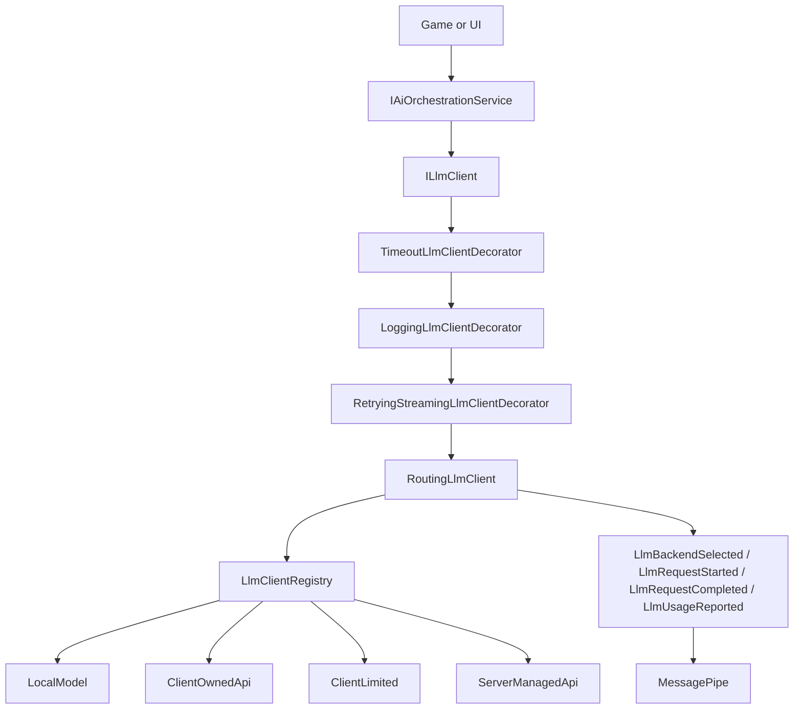

# CoreAI Unity Architecture

**What this is.** The binding contracts of the Unity host: where a layer boundary runs, which execution
path is the default, how events cross the DI seam, how memory keys are derived, and which rules a
change must not break. It is written for someone modifying CoreAI or integrating it deeply — not for a
first scene.

**If you are starting out, this is the wrong door.** Go to
[QUICK_START](QUICK_START.md) → [the Unity package README](../README.md) →
[AGENT_BUILDER](../../CoreAI/Docs/AGENT_BUILDER.md). Come back when you need to know *why* something is
wired the way it is.

**Neighbouring documents.** [DGF_SPEC](DGF_SPEC.md) holds the normative spec (DI, threads, authority);
[DEVELOPER_GUIDE](DEVELOPER_GUIDE.md) is the practical code map; [STREAMING_ARCHITECTURE](STREAMING_ARCHITECTURE.md)
and [HTTP_TRANSPORT_SPEC](HTTP_TRANSPORT_SPEC.md) go deeper on the transport. Full map:
[DOCS_INDEX](DOCS_INDEX.md).

| Section | Answers |
|---|---|
| [Layers](#layers) | What belongs in `CoreAI.Core` versus `CoreAI.Source`, and what game code may depend on |
| [Streaming Is The Default Execution Path](#streaming-is-the-default-execution-path) | Why headless task execution also streams, and how parallel tool calls are bounded |
| [LLM Mode Flow](#llm-mode-flow) | The decorator chain from `IAiOrchestrationService` down to a backend |
| [Single-Mode And Multi-Mode Setup](#single-mode-and-multi-mode-setup) | Choosing one global mode versus per-role routing profiles |
| [MessagePipe Boundary](#messagepipe-boundary) | Which events exist, who publishes them, and the child-scope trap that silently drops them |
| [Runtime Context And Memory Scope](#runtime-context-and-memory-scope) | Per-request context, and exactly how a memory key is derived and isolated |
| [Timeout & Retry Rule](#timeout--retry-rule-v151) | Who owns timeouts, who owns retries, and how errors reach player versus log |
| [Test Integrity Rule](#test-integrity-rule) | What a test here is allowed to assert and what counts as rescuing the implementation |
| [WebGL Rule](#webgl-rule) | Browser constraints on local models, HTTP, Lua, IL2CPP and async continuations |
| [Audit Log](#audit-log) | The hash-chained record of requests, tool calls and world mutations |
| [Source code documentation and comments](#source-code-documentation-and-comments) | Comment and XML-doc conventions for this package |

## Layers

`CoreAI.Core` is portable C# and owns orchestration contracts, agent policies, Lua safety, memory contracts, and message contracts. It does not reference UnityEngine, VContainer, or MessagePipe.

`CoreAI.Source` is the Unity integration layer. It owns VContainer composition, MessagePipe brokers, Unity logging, settings assets, LLM adapters, chat UI, world commands, and editor-facing setup.

Game code should depend on public contracts such as `IAiOrchestrationService`, `ILlmClient`, `IAiGameCommandSink`, `LlmExecutionMode`, and MessagePipe messages instead of reaching into infrastructure classes.

## Streaming Is The Default Execution Path

Streaming is the default everywhere, not just for chat/live UI. When `ICoreAISettings.EnableStreaming` is on, `AiOrchestrator.RunTaskAsync` (agent/task execution) runs through `ILlmClient.CompleteStreamingAsync` via a `CompleteForTaskAsync` helper that collapses the stream back into an `LlmCompletionResult`. Non-interactive task execution therefore uses the same execute-as-you-stream tool loop (including bounded-parallel tool calls) as chat. Non-streaming `CompleteAsync` is the fallback only when `EnableStreaming` is off. Effective streaming still honours the per-role (`AgentBuilder.WithStreaming`) and UI (`CoreAiChatConfig.EnableStreaming`) overrides.

Tool calls execute in **parallel** on both the batch and the streamed path, bounded by `ICoreAISettings.MaxParallelToolCalls` (default 4; `1` = strictly sequential/legacy). Mutating built-ins (`memory`, `manage_mods`, `manage_skills`, `world_command`, `component_command`, `execute_lua`, `call_skill_tool`) are serialized relative to each other. Streamed mutations wait for turn completion so whole-turn echoes can be rejected before side effects; result order is preserved.

## LLM Mode Flow


```mermaid
flowchart TD
    Game["Game or UI"] --> Orchestrator["IAiOrchestrationService"]
    Orchestrator --> LlmClient["ILlmClient"]
    LlmClient --> Timeout["TimeoutLlmClientDecorator"]
    Timeout --> Logging["LoggingLlmClientDecorator"]
    Logging --> RetryStream["RetryingStreamingLlmClientDecorator"]
    RetryStream --> Routing["RoutingLlmClient"]
    Routing --> Registry["LlmClientRegistry"]
    Registry --> LocalModel["LocalModel"]
    Registry --> ClientOwnedApi["ClientOwnedApi"]
    Registry --> ClientLimited["ClientLimited"]
    Registry --> ServerManagedApi["ServerManagedApi"]
    Routing --> Events["LlmBackendSelected / LlmRequestStarted / LlmRequestCompleted / LlmUsageReported"]
    Events --> MessagePipe["MessagePipe"]
```

## Single-Mode And Multi-Mode Setup

For simple projects, choose one global mode on `CoreAISettingsAsset`:

- `LocalModel` uses LLMUnity when the platform and scene provide an `LLMAgent`.
- `ClientOwnedApi` calls an OpenAI-compatible endpoint with the user's provider key.
- `ClientLimited` calls an OpenAI-compatible endpoint after local request and prompt-size checks.
- `ServerManagedApi` calls a backend-owned proxy through `ServerManagedLlmClient` and keeps provider keys off the client. Games can set a dynamic JWT with `ServerManagedAuthorization.SetProvider(...)`. Dynamic host-specific headers (for example, per-lesson usage attribution) are attached via `ServerManagedAuthorization.SetRequestHeaderProvider(...)`: one immutable snapshot per invocation, preserving transport-owned auth/trace/idempotency headers; the next invocation picks up fresh values even when the same request object is reused.
- `Offline` uses deterministic test/demo responses.

For mixed projects, use `LlmRoutingManifest` profiles. Each profile has its own `LlmExecutionMode`, backend settings, context window, and optional ClientLimited limits. Route entries map role ids such as `SmartChat`, `Analyzer`, or `*` to those profiles.

## MessagePipe Boundary

The portable core defines message contracts only. The Unity layer registers brokers in `CoreServicesInstaller` and publishes LLM routing/status/usage messages from `RoutingLlmClient`.

**Usage is cumulative across tool roundtrips (4.19.0).** `MeaiLlmClient` no longer reports only the last roundtrip's token usage. The streaming path emits a usage-bearing `LlmStreamChunk` immediately as each roundtrip's usage arrives, so `RoutingLlmClient` publishes `LlmUsageReported` even when the turn later times out or is cancelled mid-stream. The non-streaming path sums provider usage across every tool roundtrip via the shared `LlmUsageAccumulator`, so a multi-tool-call turn reports whole-turn totals instead of just the final call's numbers.

Since **v1.5.0**, tool lifecycle events (`LlmToolCallStarted`, `LlmToolCallCompleted`, `LlmToolCallFailed`) are published through a two-layer adapter chain:
1. **`ToolExecutionPolicy`** (portable, `CoreAI.Core`) calls **`IToolCallEventPublisher.PublishStarted/Completed/Failed`** — no MessagePipe dependency.
2. **`MessagePipeToolCallEventPublisher`** (Unity, `CoreAI.Source`) implements `IToolCallEventPublisher` and delegates to **`GlobalMessagePipe.GetPublisher<T>()`**.
3. **`IToolExecutionNotifier.NotifyToolExecuted`** → **`CoreAiToolExecutionNotifier`** bridges to `CoreAi.NotifyToolExecuted` for static event subscribers.

Both streaming and non-streaming paths wire these adapters identically (in `MeaiLlmClient`), ensuring event parity regardless of execution path.

Tool lifecycle events expose `LlmToolCallInfo` through `Info`. It carries `TraceId`, `RoleId`, provider `CallId`, `ToolName`, and sanitized arguments, so observers can correlate start/completed/failed events for the exact tool call. The old direct properties remain as accessors for compatibility.

New UI, diagnostics, and gameplay observers should subscribe to MessagePipe messages. Existing static events remain for compatibility, but new cross-layer integration should prefer MessagePipe.

### Child LifetimeScope and `GlobalMessagePipe`

`CoreServicesInstaller` registers MessagePipe in `CoreAILifetimeScope` and, in a build callback, calls **`GlobalMessagePipe.SetProvider(resolver.AsServiceProvider())`**. `RoutingLlmClient` publishes `LlmBackendSelected`, `LlmRequestStarted`, `LlmRequestCompleted`, and `LlmUsageReported` through **`IPublisher<T>` resolved from that same (parent) container**.

If the game adds a **child** `LifetimeScope` (VContainer parent = `CoreAILifetimeScope`) and calls **`RegisterMessagePipe()` again** for its own cross-feature brokers, the child scope may resolve **`ISubscriber<LlmRequestStarted>`** (and the other LLM message types) from a **different** MessagePipe instance. Those subscribers will not receive events from the parent publishers, so telemetry and debug UI can show **zero calls / no timing** while the LLM still responds. For services registered only under the child scope, prefer **`GlobalMessagePipe.GetSubscriber<T>()`** for CoreAI LLM observability (same provider as `RoutingLlmClient`), or register additional brokers using the **parent** `MessagePipeOptions` without creating a second pipe.

**PlayMode / tests without `CoreAILifetimeScope`:** `ToolExecutionPolicy` publishes `LlmToolCall*` only when **`GlobalMessagePipe.IsInitialized`**. Package helper **`GlobalMessagePipeMinimalBootstrap.EnsureInitializedForLlmDiagnostics()`** registers the same LLM/tool broker types and sets the static provider. **`TestAgentSetup.Initialize`** calls it automatically so headless PlayMode fixtures (e.g. `AgentMemoryOpenAiApiPlayModeTests`) can subscribe to **`GlobalMessagePipe.GetSubscriber<LlmToolCallCompleted>()`** and receive events from real MEAI runs. If a full game scope already called `SetProvider`, the bootstrap is a no-op.

## Runtime Context And Memory Scope

`IAiPromptContextProvider` lets a game append per-request context such as current quest, lesson slot, learner profile, or world objective without mutating the static role prompt. `AiPromptComposer` appends these sections under `## Runtime Context`.

`IAgentMemoryScopeProvider` defines the tenant/user/session/topic boundary. One canonical key transformer serves memory/flat chat, structured transcript, compacted summary, and the queue cancellation scope. Any non-empty scope is encoded as `scope-v1-<64 lowercase hex>` from the full SHA-256 over an injective length-prefixed tuple. Neither tenant/user/session/topic nor the role id lands in the scoped filename or the storage-error log; a case-only difference yields different lowercase hashes and does not collide on Windows/macOS. An empty `AgentMemoryScope.Empty` preserves the previous bare role key byte-for-byte for backward compatibility only. The scoped facade does not pick up that shared legacy key automatically: the host explicitly chooses the identity recipient of the migration.

**Actor and durable scope.** Inside a turn the queue pins the ambient `ActorContext`. A named actor's durable key (`actor-v1-…`) includes its actor id, role, and non-empty tenant/user/session/topic memory scope. The actor's declared scope wins; if it is empty, the host's `IAgentMemoryScopeProvider` supplies the scope. Changing the transport connection (`ActorContext.SessionId`) preserves memory when the actor id, role, and durable scope stay the same. Changing any durable scope field deliberately isolates the history, including for the same actor id. Keep `AgentMemoryScope.SessionId` stable across reconnects when resuming one lesson; it identifies the memory partition, not the network connection. An empty scope everywhere preserves existing named-actor keys. Outside a turn, wrap named-actor history reads and resets in `using (AgentMemoryActorScope.Enter(actorContext))` with the same host scope provider to select the same partition.

The default anonymous local actor (`"local"`, issued by `DefaultLocalHostIdentityProvider` with an empty scope) identifies nobody and therefore **does not override the host-declared scope**: with an empty ambient scope the key is computed from the provider, with a non-empty one from the `ActorContext` scope itself, and only when there is no scope anywhere does the legacy bare role key remain. Previously `"local"` unconditionally returned the bare role id, so records written inside a turn went to the shared `<Role>.json` while hydration and reads went to the student's `scope-v1-…`: lesson dialogue never reached the student's history, while the shared file accumulated other people's lessons.

`CoreAILifetimeScope` accepts the provider in two ways **before the container is built**: a component inheriting `AgentMemoryScopeProviderBehaviour` is assigned in the inspector field **Agent Memory Scope Provider**, or code calls `SetAgentMemoryScopeProvider(IAgentMemoryScopeProvider)` on an inactive GameObject and then activates the scope. In the same place the host can call `SetAgentMemoryPersistenceMode(AgentMemoryPersistenceMode.SessionOnly)`. Both setters throw `InvalidOperationException` after build: silently changing the key space or backing store in the middle of requests is forbidden. `CorePortableInstaller` adds `DefaultAgentMemoryScopeProvider` only if the host has not registered its own provider yet, so the host instance always wins over the default.

```csharp
public sealed class RedoSchoolMemoryScopeProvider : AgentMemoryScopeProviderBehaviour
{
    public string CurrentStudentId { get; private set; } = "";

    public void SetStudent(string opaqueBackendStudentId)
    {
        CurrentStudentId = opaqueBackendStudentId ?? "";
    }

    public override AgentMemoryScope GetScope(string roleId)
    {
        return new AgentMemoryScope("redoschool", CurrentStudentId, "", "");
    }
}

// For a code-only setup the object must stay inactive until VContainer is built.
scopeGameObject.SetActive(false);
coreAiLifetimeScope.SetAgentMemoryScopeProvider(provider);
coreAiLifetimeScope.SetAgentMemoryPersistenceMode(AgentMemoryPersistenceMode.SessionOnly);
scopeGameObject.SetActive(true);
```

`CurrentStudentId` here is the stable opaque id of the authorized student from the backend, used only for the local storage key. It must never be added to the prompt, logs, or provider body. In particular, the OpenRouter `session_id` is a separate application/agent-cohort routing id and **never a student id**. If one process genuinely serves students in parallel, the provider must keep the scope in request-local context rather than in a single global mutable string; the example above targets a Unity client with one currently authorized student.

`IConversationContextManager` prepares long chat history before each LLM call. The default `DeterministicConversationContextManager` keeps recent messages in `ChatHistory` and compacts older turns into a `## Conversation Summary` system section using `IConversationSummaryStore`. **`RegisterCorePortable`** registers **`InMemoryConversationSummaryStore`** by default so summaries accumulate across turns for each role for the process lifetime. **`IContextBudgetPolicy`** (`DefaultContextBudgetPolicy`) plus **`ITokenEstimator`** (`HeuristicTokenEstimator`) allocate a **`HistoryTokenBudget`** from the role/context window minus reserved completion headroom and an estimate of system + user + tool-contract text — this replaces the legacy fixed `ContextTokens/2` split.

`CoreAILifetimeScope` registers backing stores separately from the public contracts. `Persistent` mode stays the backward-compatible default: the private `FileAgentMemoryStore` serves desktop and WebGL (`persistentDataPath`; on WebGL the engine's own automatic persistence flushes it to IndexedDB and `CoreAiWebGlPersistence` reports whether that persistence is armed), desktop uses the private `FileConversationSummaryStore`, while WebGL uses `InMemoryConversationSummaryStore` for summaries. `SessionOnly` mode replaces both private backings with `InMemoryAgentMemoryStore` and `InMemoryConversationSummaryStore`: the memory document, flat chat, structured transcript, and compacted summary live only until the process ends and create no files. In both modes the same scoped memory/transcript/summary decorators are exposed outward, and `RegisterCorePortable(... suppressDefaultConversationSummaryStore: true, suppressDefaultAgentMemoryStore: true)` does not add competing defaults. Backing stores keep their own locking and atomic-mutation semantics; `ScopedAgentMemoryStoreDecorator` also proxies `IAtomicAgentMemoryStore` onto the already computed scoped key and uses a safe per-key fallback when an arbitrary inner store lacks native atomic capability.

If the backend reports **`LlmErrorCode.ContextLengthExceeded`** (`MeaiOpenAiChatClient` maps HTTP 413 and common overload bodies/messages), **`AiOrchestrator`** may retry **bounded** rebuilds up to **`ICoreAISettings.MaxContextOverflowRetries`** (default `3`, `0` disables). Each retry increments **`ContextRetryLevel`**, and **`DefaultContextBudgetPolicy`** applies a **`0.75^level`** history-budget factor so older history is dropped progressively. Coordinating interface: **`IConversationCompactionCoordinator`** (default **`DefaultConversationCompactionCoordinator`**).

`FileAgentMemoryStore` still implements `IConversationTranscriptStore`: structured `ConversationEntry` records migrate from the legacy flat `chatHistoryJson` when `transcriptEntriesJson` is absent. `InMemoryAgentMemoryStore` implements the same memory/chat/transcript and atomic-mutation capabilities without filesystem API. The selected production backing is never published directly as either memory or transcript, so the raw role key cannot be bypassed via a DI resolve.

## Timeout & Retry Rule (v1.5.1)

**Timeout:** the interactive UI timeout is enforced by `CoreAiChatService` via UniTask `CancelAfterSlim` (PlayerLoop-based, WebGL-compatible). Since **5.4.0** the portable pipeline also wraps every client in `TimeoutLlmClientDecorator`, which applies a request timeout off `ICoreAISettings.LlmRequestTimeoutSeconds` on both the streaming and non-streaming paths (belt-and-braces for hosts that call the pipeline outside the chat service). In Unity, `LlmPipelineInstaller` injects `UnityMainThreadLlmAsyncMarshaler`, so the portable deadline is also driven by the PlayerLoop instead of `CancellationTokenSource.CancelAfter`. See [`STREAMING_ARCHITECTURE.md`](STREAMING_ARCHITECTURE.md) §8.

**Retries:** network-level retries (HTTP 429, 5xx, exponential backoff) are handled exclusively by `LoggingLlmClientDecorator`. The orchestrator does not multiply those retries with its own counters. Since **5.4.0** `RetryingStreamingLlmClientDecorator` additionally retries a *streaming* call, but only before the stream commits any content, so a mid-stream failure is never silently restarted. Both decorators receive the Unity marshaler for PlayerLoop-driven retry delays in WebGL. `LlmPipelineInstaller` composes the chain as `Timeout( Logging( RetryingStreaming( routed ) ) )`.

**Context-length retry:** in addition to network retries above, **`AiOrchestrator.RunTaskAsync`** may issue bounded additional LLM calls when the completion result carries **`ContextLengthExceeded`**, after rebuilding prompts with progressively tighter history compaction.

**Error propagation:** `CoreAiChatService` does not swallow exceptions; `CoreAiChatPanel` catches them and splits the failure between **two audiences** via **`LlmErrorPresentation`** (portable core):

- **Player** — `ToUserMessage(ex)` in the chat bubble: a message the backend authored for the player wins (parsed out of `LlmClientException.ProviderErrorBody`), otherwise a phrase for the typed `LlmErrorCode`. JSON bodies, stack traces and over-long text never reach the transcript, and a `401` body is never shown (providers echo the submitted key back in it).
- **Log** — `ToDiagnosticText(ex)` plus the exception itself: typed code, HTTP status, retry hint, raw provider body (redacted for `401`) and stack trace.

Override `CoreAiChatPanel.ResolveErrorMessage(Exception)` / `ResolveStreamErrorMessage(string)` to localize or re-route the player-facing text; the log line is written first, so an override cannot hide diagnostics.

## Test Integrity Rule

See also `Assets/CoreAiUnity/Tests/README.md` for the full EditMode + PlayMode test requirements.

Tests must measure whether the system under test works. They must not rescue the implementation or the model with answer-shaped hints after a failure.

- Prompts and fixtures should describe the user/game goal in domain language. They may mention a capability only when that capability is the actual feature under test, but they must not dictate exact tool payloads, exact Lua bodies, exact response text, or private expected values unless the test is explicitly a parser, serializer, repair, or deterministic extraction fixture.
- A retry may handle infrastructure only: model startup, transport retry, rate-limit/backoff, or a fresh user turn that a real player could reasonably send. A retry must not say "previous answer failed; now call this exact tool with these exact arguments".
- Assertions must verify resulting state, emitted commands, tool traces, memory contents, or UI output. Avoid asserting exact natural-language text from a real LLM; assert the semantic fact that matters.
- Tool-backed integration tests must prove the tool-backed behaviour actually happened. A Lua test should require a completed `execute_lua` trace or the runtime Lua state it produced; a memory test should require the memory tool or persisted memory contract; a merchant/economy test should require the economy state change. Do not accept prose, memory-only text, or final JSON as a substitute for the tool/runtime contract under test.
- Forced tool choice is allowed only when the test explicitly validates a specific tool binding/execution path. It must not be used in tests that claim to measure whether the model autonomously chooses the correct tool.
- Mandatory live-model PlayMode should contain the strongest representative scenario for each behaviour. Long duplicates, same-path variants, and exploratory stress probes should be `[Explicit]` targeted tests with their diagnostic purpose documented, so the full suite remains a stable product gate rather than a stochastic benchmark collection.
- Timeout is diagnostic data. Medium single-turn live-model tests should use 120 seconds. Complex tool, SkillSet, crafting, Lua, or multi-agent turns should use 240 seconds. Do not exceed 600 seconds without a separate investigation note. If a test hits timeout, first inspect whether the prompt, routing, tool schema, cancellation path, or model reasoning mode is wrong; do not blindly raise the timeout.
- EditMode and stubbed PlayMode tests may use exact strings and exact payloads only when the exact bytes are the contract under test: parser extraction, JSON repair, serialization, migration, deterministic sandbox execution, or regression fixtures. Keep those tests clearly named and separate from live-model verification.
- Integration tests should not assert implementation details that are not part of the public contract. If a test needs an exact internal call sequence, prefer a narrower unit/parser test or add a trace contract that makes the sequence observable.

## WebGL Rule

`LocalModel` cannot use native LLMUnity in WebGL. WebGL projects should use `ServerManagedApi` for production, or `ClientOwnedApi` only for local/dev scenarios where key exposure is acceptable. Timeout and retry delays in WebGL use UniTask PlayerLoop scheduling through `UnityMainThreadLlmAsyncMarshaler`; `CancellationTokenSource.CancelAfter` and finite `Task.Delay` are not functional in Emscripten.

**HTTP LLM on WebGL player:** Unity forbids `System.Net` / `HttpClient` in browser builds. When **`CoreAISettingsAsset.WebGlNativeStreaming`** is **`true`** (default on new assets since **v1.6.13**), **`MeaiLlmClient.CreateHttp`** uses **`FetchSseOpenAiTransport`** + **`CoreAiSseFetch.jslib`** — real incremental **`fetch`** SSE (see [`HTTP_TRANSPORT_SPEC.md`](HTTP_TRANSPORT_SPEC.md)). When **`false`**, **`UnityWebRequestOpenAiTransport`** is used — it does not deliver incremental SSE; **`MeaiOpenAiChatClient`** may use **non-streaming** completion and **simulate** streaming updates. Cross-origin APIs need **CORS** (see [`TROUBLESHOOTING.md`](TROUBLESHOOTING.md) § WebGL).

**Lua on WebGL player:** runtime Lua execution through **`SecureLuaEnvironment`** / Lua-CSharp is supported on WebGL player builds and **on by default**. Toggle with **`CoreAISettingsAsset.EnableLuaOnWebGl`**. The Full `unity_*` reflection tier stays disabled on WebGL. Lua-CSharp is a managed, AOT-safe VM, so no IL2CPP stripping protection is needed for it.

**Local-model capability boundary:** unsupported players do not register `ILlmAgentProvider` or
`LlmUnityAutostartEntryPoint`. `LocalModel` resolves to an actionable failure client, while HTTP and
Offline composition and runtime hot-swap remain valid without a local provider. The Hub removes new
local-model choices, disables a persisted local selection, and displays
`LocalModelPlatformSupport.BrowserUnavailableMessage` instead of misclassifying the result as merely
"no live scope".

**LLMUnity build containment:** the installed LLMUnity package has an eager native initializer that
can execute before CoreAI runtime composition. For unsupported targets, CoreAI therefore removes
LLMUnity behaviours from staged scene copies and replaces `LLMUnitySetup.InitializeOnLoad` only in the
current build's reported `Temp/StagingArea/Data/Managed/undream.llmunity.Runtime.dll`. The build
callback rejects persistent Bee caches, fails closed when the current staging assembly is absent, and re-opens the written DLL to
assert that the initializer contains only `ret`. It never patches Assets, Packages,
`Library/ScriptAssemblies`, `Library/PackageCache`, or general Bee/player-script caches. Supported
native targets bypass both scene stripping and assembly rewriting.

**Runtime late-host containment:**
[`CoreAiWebGlLlmUnitySceneGuard`](../Runtime/Source/Features/WebGl/CoreAiWebGlLlmUnitySceneGuard.cs) is
installed automatically on an unsupported player and disables loaded LLMUnity behaviours without
disabling unrelated components on their GameObjects. It rescans scene loads and later frames, but it
cannot intercept an arbitrary third-party `Awake` or static initializer before that code runs. The
Editor Cecil pass is consequently a build-compatibility containment layer, not the ideal
RUNTIME-first primary design. Removing that debt requires an upstream platform gate, an
unsupported-target assembly split, or a maintained LLMUnity fork; see `KNOWN_ISSUES.md`.

**VContainer / IL2CPP:** `CoreServicesInstaller` registers **`IAiGameCommandSink`** with an explicit factory so player builds do not require constructor reflection on `MessagePipeAiCommandSink`. The package ships **`link.xml`** at `Assets/CoreAiUnity/link.xml`. EditMode guard: `CoreServicesInstallerEditModeTests`.

**Async continuations (v1.5.10–v1.5.14 — split by layer):** In **portable** `com.neoxider.coreai`, the MEAI tool path (`SmartToolCallingChatClient`, `AiOrchestrator` completion calls — streaming by default, non-streaming fallback, `QueuedAiOrchestrator`) still uses **`ConfigureAwait(false)`** where appropriate so thread-pool continuations do not needlessly capture Unity sync context (WebGL hygiene). **`ToolExecutionPolicy`** therefore routes each **`AIFunction.InvokeAsync`** through **`ICoreAISettings.ToolInvocationMarshaler`**: default pass-through in Core; **`CoreAISettingsAsset`** supplies **`UnityMainThreadLlmAsyncMarshaler`**, which **`UniTask.SwitchToMainThread`s** inside **Play Mode / built players** only. Since **v1.5.14**, in **`UNITY_EDITOR`** with **`!Application.isPlaying`** (Edit Mode), the marshaler runs the tool body **inline** (no player-loop hop) so **`Task.Wait` / `.Result`** on the editor managed main thread cannot deadlock thread-pooled MEAI continuations. In Editor Play Mode, **`RuntimeInitializeOnLoadMethod` (BeforeSceneLoad / AfterSceneLoad)**, **`Application.onBeforeRender`**, and **`EditorApplication.update`** prime the Editor **`Application.isPlaying` mirror**, reducing stale **`0`** during Test Runner and low-render-loop situations. Off the mirrored main thread the marshaler still uses **`_editorMirrorIsPlaying != 1`** to decide **inline** (so unknown **`-1`** inlines and **Edit Mode** stacks that **`Task.Run(...).Wait()`** on the main thread do not deadlock on **`SwitchToMainThread`**). **`MeaiOpenAiChatClient`** delegates HTTP I/O to **`IOpenAiHttpTransport`**: **`HttpClientOpenAiTransport`** avoids **`ConfigureAwait(false)`** on its **`await`**s; **`UnityWebRequestOpenAiTransport`** uses **`Task.Yield`** in WebGL. **`MeaiLlmClient` / `RoutingLlmClient`** avoid **`ConfigureAwait(false)`** on the inner completion **`await`** toward Unity/UI callers. **`CoreAiChatPanel`** may **`UniTask.SwitchToMainThread`** or **`Task.Yield`** for UI repaint where documented.

## Audit Log

The append-only audit log records every LLM request/response, tool call, and world mutation event to a single SHA-256-chained JSONL file. Entries carry `prevHash`/`hash` so the chain detects accidental corruption and reordering (an unkeyed integrity checksum, not tamper-proof against the file owner; an opt-in keyed HMAC chain is available — see `AUDIT_LOG.md`).

- **Portable core** (`CoreAI`): `IAuditLog`, `AuditEntry` (struct with `AuditEntryKind` discriminator), `AuditHash`, `AuditContext` (traceId-keyed prompt hash + model cache).
- **Unity layer** (`CoreAiUnity`): `AuditLogWriter` (background flush loop, rotation at 50 MB), three interceptors that subscribe existing event buses (`LlmAuditInterceptor`, `ToolCallAuditInterceptor`) and the `AuditedWorldCommandExecutor` decorator over `CoreAiWorldCommandExecutor`.
- **Activation:** `CoreServicesInstaller.RegisterCore` → `AuditLogInstaller.RegisterAuditLog()` — no setup needed after install.
- **Zero main-thread blocking:** `IAuditLog.Record()` enqueues; the writer flushes every ~500 ms on a background loop.
- **Design:** [AUDIT_LOG.md](AUDIT_LOG.md).

## Source code documentation and comments

Applies to **`Assets/CoreAI`** (portable) and **`Assets/CoreAiUnity/Runtime`** unless noted.

- **Language:** All source-code documentation is **English-only**: public XML documentation (`///`), member summaries, inline implementation remarks, `TODO`/`HACK` notes, and region labels. XML comments must describe intent and contract in domain terms; avoid mechanical phrases such as `Gets or sets X`, `Stores X`, or `Represents X`.
- **Product-facing strings:** In-game prompts, Inspector **tooltips** localized for a shipped locale, sample dialogue, etc. **do not** need to match this rule; only **developer-facing** artifacts in `.cs`.
- **`// TODO:`** and **`// HACK:`** are allowed when behaviour is non-obvious or a deliberate temporary workaround (**`TODO`** = planned follow-up, **`HACK`** = invariant or constraint callers must respect). Prefer a **short** phrase after the keyword.
- **Other `//` comments:** Avoid narrative `//` comments in production runtime code. Prefer **`///`** on APIs, **`// HACK:`** where the codebase must preserve a subtle invariant, or no comment if the code is clear. **`Tests`** (`Assets/*/Tests`) may retain richer comments for Arrange/Assert clarity.
- **`*` fenced regions** (`#region`) are optional; keep **English** labels if used.
