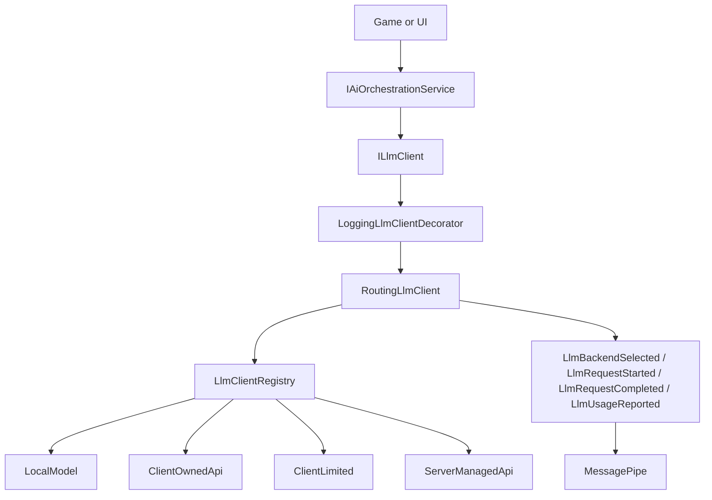

# CoreAI Unity Architecture

## Layers

`CoreAI.Core` is portable C# and owns orchestration contracts, agent policies, Lua safety, memory contracts, and message contracts. It does not reference UnityEngine, VContainer, or MessagePipe.

`CoreAI.Source` is the Unity integration layer. It owns VContainer composition, MessagePipe brokers, Unity logging, settings assets, LLM adapters, chat UI, world commands, and editor-facing setup.

Game code should depend on public contracts such as `IAiOrchestrationService`, `ILlmClient`, `IAiGameCommandSink`, `LlmExecutionMode`, and MessagePipe messages instead of reaching into infrastructure classes.

## LLM Mode Flow

```mermaid
flowchart TD
    Game["Game or UI"] --> Orchestrator["IAiOrchestrationService"]
    Orchestrator --> LlmClient["ILlmClient"]
    LlmClient --> Logging["LoggingLlmClientDecorator"]
    Logging --> Routing["RoutingLlmClient"]
    Routing --> Registry["LlmClientRegistry"]
    Registry --> LocalModel["LocalModel"]
    Registry --> ClientOwnedApi["ClientOwnedApi"]
    Registry --> ClientLimited["ClientLimited"]
    Registry --> ServerManagedApi["ServerManagedApi"]
    Routing --> Events["LlmBackendSelected / LlmRequestStarted / LlmRequestCompleted / LlmUsageReported"]
    Events --> MessagePipe["MessagePipe"]
```

## Single-Mode And Multi-Mode Setup

For simple projects, choose one global mode on `CoreAISettingsAsset`:

- `LocalModel` uses LLMUnity when the platform and scene provide an `LLMAgent`.
- `ClientOwnedApi` calls an OpenAI-compatible endpoint with the user's provider key.
- `ClientLimited` calls an OpenAI-compatible endpoint after local request and prompt-size checks.
- `ServerManagedApi` calls a backend-owned proxy through `ServerManagedLlmClient` and keeps provider keys off the client. Games can set a dynamic JWT with `ServerManagedAuthorization.SetProvider(...)`.
- `Offline` uses deterministic test/demo responses.

For mixed projects, use `LlmRoutingManifest` profiles. Each profile has its own `LlmExecutionMode`, backend settings, context window, and optional ClientLimited limits. Route entries map role ids such as `SmartChat`, `Analyzer`, or `*` to those profiles.

## MessagePipe Boundary

The portable core defines message contracts only. The Unity layer registers brokers in `CoreServicesInstaller` and publishes LLM routing/status/usage messages from `RoutingLlmClient`.

Since **v1.5.0**, tool lifecycle events (`LlmToolCallStarted`, `LlmToolCallCompleted`, `LlmToolCallFailed`) are published through a two-layer adapter chain:
1. **`ToolExecutionPolicy`** (portable, `CoreAI.Core`) calls **`IToolCallEventPublisher.PublishStarted/Completed/Failed`** — no MessagePipe dependency.
2. **`MessagePipeToolCallEventPublisher`** (Unity, `CoreAI.Source`) implements `IToolCallEventPublisher` and delegates to **`GlobalMessagePipe.GetPublisher<T>()`**.
3. **`IToolExecutionNotifier.NotifyToolExecuted`** → **`CoreAiToolExecutionNotifier`** bridges to `CoreAi.NotifyToolExecuted` for static event subscribers.

Both streaming and non-streaming paths wire these adapters identically (in `MeaiLlmClient`), ensuring event parity regardless of execution path.

Tool lifecycle events expose `LlmToolCallInfo` through `Info`. It carries `TraceId`, `RoleId`, provider `CallId`, `ToolName`, and sanitized arguments, so observers can correlate start/completed/failed events for the exact tool call. The old direct properties remain as accessors for compatibility.

New UI, diagnostics, and gameplay observers should subscribe to MessagePipe messages. Existing static events remain for compatibility, but new cross-layer integration should prefer MessagePipe.

### Child LifetimeScope and `GlobalMessagePipe`

`CoreServicesInstaller` registers MessagePipe in `CoreAILifetimeScope` and, in a build callback, calls **`GlobalMessagePipe.SetProvider(resolver.AsServiceProvider())`**. `RoutingLlmClient` publishes `LlmBackendSelected`, `LlmRequestStarted`, `LlmRequestCompleted`, and `LlmUsageReported` through **`IPublisher<T>` resolved from that same (parent) container**.

If the game adds a **child** `LifetimeScope` (VContainer parent = `CoreAILifetimeScope`) and calls **`RegisterMessagePipe()` again** for its own cross-feature brokers, the child scope may resolve **`ISubscriber<LlmRequestStarted>`** (and the other LLM message types) from a **different** MessagePipe instance. Those subscribers will not receive events from the parent publishers, so telemetry and debug UI can show **zero calls / no timing** while the LLM still responds. For services registered only under the child scope, prefer **`GlobalMessagePipe.GetSubscriber<T>()`** for CoreAI LLM observability (same provider as `RoutingLlmClient`), or register additional brokers using the **parent** `MessagePipeOptions` without creating a second pipe.

**PlayMode / tests without `CoreAILifetimeScope`:** `ToolExecutionPolicy` publishes `LlmToolCall*` only when **`GlobalMessagePipe.IsInitialized`**. Package helper **`GlobalMessagePipeMinimalBootstrap.EnsureInitializedForLlmDiagnostics()`** registers the same LLM/tool broker types and sets the static provider. **`TestAgentSetup.Initialize`** calls it automatically so headless PlayMode fixtures (e.g. `AgentMemoryOpenAiApiPlayModeTests`) can subscribe to **`GlobalMessagePipe.GetSubscriber<LlmToolCallCompleted>()`** and receive events from real MEAI runs. If a full game scope already called `SetProvider`, the bootstrap is a no-op.

## Runtime Context And Memory Scope

`IAiPromptContextProvider` lets a game append per-request context such as current quest, lesson slot, learner profile, or world objective without mutating the static role prompt. `AiPromptComposer` appends these sections under `## Runtime Context`.

`ScopedAgentMemoryStoreDecorator` and `IAgentMemoryScopeProvider` let projects isolate memory by tenant, user, session, topic, and role while preserving the old role-only key when no scope provider is registered.

`IConversationContextManager` prepares long chat history before each LLM call. The default `DeterministicConversationContextManager` keeps recent messages in `ChatHistory` and compacts older turns into a `## Conversation Summary` system section using `IConversationSummaryStore`. **`RegisterCorePortable`** registers **`InMemoryConversationSummaryStore`** by default so summaries accumulate across turns for each role for the process lifetime. **`IContextBudgetPolicy`** (`DefaultContextBudgetPolicy`) plus **`ITokenEstimator`** (`HeuristicTokenEstimator`) allocate a **`HistoryTokenBudget`** from the role/context window minus reserved completion headroom and an estimate of system + user + tool-contract text — this replaces the legacy fixed `ContextTokens/2` split.

`CoreAILifetimeScope` registers **`FileConversationSummaryStore`** at `%persistentDataPath%/CoreAI/ConversationSummaries` (non-WebGL targets), then calls **`RegisterCorePortable(suppressDefaultConversationSummaryStore: true, suppressDefaultAgentMemoryStore: true)`** so persistence survives app restarts and the host’s **`FileAgentMemoryStore`** is the sole **`IAgentMemoryStore`** (since **v1.5.22** — avoids a duplicate **`NullAgentMemoryStore`** registration that caused **`VContainerException`** at scope build). **`UNITY_WEBGL`** skips file-backed summaries and calls **`RegisterCorePortable(suppressDefaultConversationSummaryStore: false, suppressDefaultAgentMemoryStore: true)`** so **`InMemoryConversationSummaryStore`** applies — synchronous **`File`** access on WebGL maps to IndexedDB and would stall the main thread each turn (since **v1.5.20**). **WebGL player** still registers **`FileAgentMemoryStore`** + **`IConversationTranscriptStore`** (since **v1.6.19**): chat/memory JSON under **`persistentDataPath`** is flushed to IndexedDB after writes via **`CoreAi_PersistFsSync`** (**`CoreAiPersistFs.jslib`**), so history survives reload when **`Application.Quit`** does not run. Hosts that only call **`RegisterCorePortable()`** keep the portable in-memory summaries and default **`NullAgentMemoryStore`**. **`NullConversationSummaryStore`** remains for diagnostics/tests that disable accumulation. Composition note for custom hosts: register your **`IConversationSummaryStore`** implementation first, then **`RegisterCorePortable(suppressDefaultConversationSummaryStore: true)`**; if you register your own **`IAgentMemoryStore`**, pass **`suppressDefaultAgentMemoryStore: true`** as well.

If the backend reports **`LlmErrorCode.ContextLengthExceeded`** (`MeaiOpenAiChatClient` maps HTTP 413 and common overload bodies/messages), **`AiOrchestrator`** may **`CompleteAsync`** **once more** after rebuilding the request at **`ContextRetryLevel = 1`** (half history budget floor). Coordinating interface: **`IConversationCompactionCoordinator`** (default **`DefaultConversationCompactionCoordinator`**).

`FileAgentMemoryStore` implements **`IConversationTranscriptStore`**: structured **`ConversationEntry`** rows (tool hooks for future callers) migrate from legacy flat **`chatHistoryJson`** when `transcriptEntriesJson` is absent.

## Timeout & Retry Rule (v1.5.1)

**Timeout:** enforced exclusively by `CoreAiChatService` via UniTask `CancelAfterSlim` (PlayerLoop-based, WebGL-compatible). The portable layer (`AiOrchestrator`, `LoggingLlmClientDecorator`) passes `CancellationToken` through without wrapping. See [`STREAMING_ARCHITECTURE.md`](STREAMING_ARCHITECTURE.md) §8.

**Retries:** network-level retries (HTTP 429, 5xx, exponential backoff) are handled exclusively by `LoggingLlmClientDecorator`. The orchestrator does not multiply those retries with its own counters.

**Context-length retry:** in addition to network retries above, **`AiOrchestrator.RunTaskAsync`** may issue **one** second LLM call when the completion result carries **`ContextLengthExceeded`**, after rebuilding prompts with tighter history compaction.

**Error propagation:** `CoreAiChatService` does not swallow exceptions; `CoreAiChatPanel` catches and displays them.

## WebGL Rule

`LocalModel` cannot use native LLMUnity in WebGL. WebGL projects should use `ServerManagedApi` for production, or `ClientOwnedApi` only for local/dev scenarios where key exposure is acceptable. Timeout in WebGL uses `CancelAfterSlim` (UniTask PlayerLoop) — `CancellationTokenSource.CancelAfter` is not functional in Emscripten (v1.5.1 fix).

**HTTP LLM on WebGL player:** Unity forbids `System.Net` / `HttpClient` in browser builds. When **`CoreAISettingsAsset.WebGlNativeStreaming`** is **`true`** (default on new assets since **v1.6.13**), **`MeaiLlmClient.CreateHttp`** uses **`FetchSseOpenAiTransport`** + **`CoreAiSseFetch.jslib`** — real incremental **`fetch`** SSE (see [`HTTP_TRANSPORT_SPEC.md`](HTTP_TRANSPORT_SPEC.md)). When **`false`**, **`UnityWebRequestOpenAiTransport`** is used — it does not deliver incremental SSE; **`MeaiOpenAiChatClient`** may use **non-streaming** completion and **simulate** streaming updates. Cross-origin APIs need **CORS** (see [`TROUBLESHOOTING.md`](TROUBLESHOOTING.md) § WebGL).

**LLMUnity in scene:** If the scene still contains **`LLM` / `LLMAgent`**, native **LlamaLib** may run before DI skips LLMUnity. Add **[`CoreAiWebGlLlmUnitySceneGuard`](../Runtime/Source/Features/WebGl/CoreAiWebGlLlmUnitySceneGuard.cs)** to a bootstrap object (early execution order) or remove those components from WebGL scenes.

**VContainer / IL2CPP:** `CoreServicesInstaller` registers **`IAiGameCommandSink`** with an explicit factory so player builds do not require constructor reflection on `MessagePipeAiCommandSink`. The package ships **`link.xml`** at `Assets/CoreAiUnity/link.xml`. EditMode guard: `CoreServicesInstallerEditModeTests`.

**Async continuations (v1.5.10–v1.5.14 — split by layer):** In **portable** `com.nexoider.coreai`, the non-streaming MEAI tool path (`SmartToolCallingChatClient`, `AiOrchestrator._llm.CompleteAsync`, `QueuedAiOrchestrator`) still uses **`ConfigureAwait(false)`** where appropriate so thread-pool continuations do not needlessly capture Unity sync context (WebGL hygiene). **`ToolExecutionPolicy`** therefore routes each **`AIFunction.InvokeAsync`** through **`ICoreAISettings.ToolInvocationMarshaler`**: default pass-through in Core; **`CoreAISettingsAsset`** supplies **`UnityMainThreadLlmAsyncMarshaler`**, which **`UniTask.SwitchToMainThread`s** inside **Play Mode / built players** only. Since **v1.5.14**, in **`UNITY_EDITOR`** with **`!Application.isPlaying`** (Edit Mode), the marshaler runs the tool body **inline** (no player-loop hop) so **`Task.Wait` / `.Result`** on the editor managed main thread cannot deadlock thread-pooled MEAI continuations. Since **v1.6.2**, **`RuntimeInitializeOnLoadMethod` (BeforeSceneLoad / AfterSceneLoad)** primes the Editor **`Application.isPlaying` mirror** before the first **`onBeforeRender`**, reducing stale **`0`** during Play Mode. Off the mirrored main thread the marshaler still uses **`_editorMirrorIsPlaying != 1`** to decide **inline** (so unknown **`-1`** inlines and **Edit Mode** stacks that **`Task.Run(...).Wait()`** on the main thread do not deadlock on **`SwitchToMainThread`**). **`MeaiOpenAiChatClient`** delegates HTTP I/O to **`IOpenAiHttpTransport`**: **`HttpClientOpenAiTransport`** avoids **`ConfigureAwait(false)`** on its **`await`**s; **`UnityWebRequestOpenAiTransport`** uses **`Task.Yield`** in WebGL. **`MeaiLlmClient` / `RoutingLlmClient`** avoid **`ConfigureAwait(false)`** on the inner completion **`await`** toward Unity/UI callers. **`CoreAiChatPanel`** may **`UniTask.SwitchToMainThread`** or **`Task.Yield`** for UI repaint where documented.

## Source code documentation and comments

Applies to **`Assets/CoreAI`** (portable) and **`Assets/CoreAiUnity/Runtime`** unless noted.

- **Language:** All source-code documentation is **English-only**: public XML documentation (`///`), member summaries, inline implementation remarks, `TODO`/`HACK` notes, and region labels. XML comments must describe intent and contract in domain terms; avoid mechanical phrases such as `Gets or sets X`, `Stores X`, or `Represents X`.
- **Product-facing strings:** In-game prompts, Inspector **tooltips** localized for a shipped locale, sample dialogue, etc. **do not** need to match this rule; only **developer-facing** artifacts in `.cs`.
- **`// TODO:`** and **`// HACK:`** are allowed when behaviour is non-obvious or a deliberate temporary workaround (**`TODO`** = planned follow-up, **`HACK`** = invariant or constraint callers must respect). Prefer a **short** phrase after the keyword.
- **Other `//` comments:** Avoid narrative `//` comments in production runtime code. Prefer **`///`** on APIs, **`// HACK:`** where the codebase must preserve a subtle invariant, or no comment if the code is clear. **`Tests`** (`Assets/*/Tests`) may retain richer comments for Arrange/Assert clarity.
- **`*` fenced regions** (`#region`) are optional; keep **English** labels if used.

See [`CODE_AUDIT_AND_FOLLOWUPS.md`](CODE_AUDIT_AND_FOLLOWUPS.md) for backlog files and spotted logic/doc issues tracked during cleanup.
