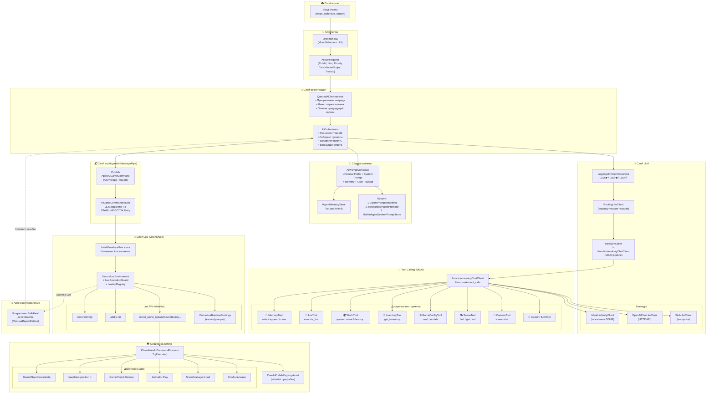
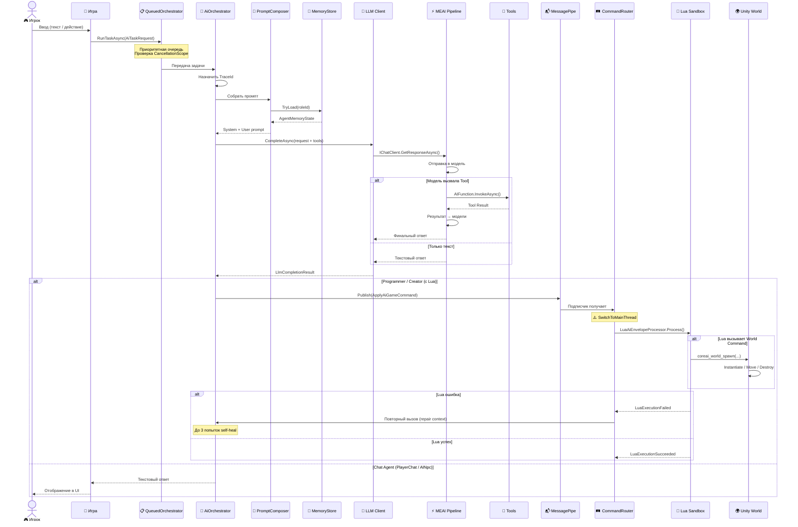

# 🗺️ Как команда от игрока проходит через всю систему

**Версия документа:** 1.0 | **Дата:** Апрель 2026

Этот документ детально описывает путь команды игрока от момента ввода до исполнения в игровом мире. Понимание этого потока — ключ к отладке и расширению CoreAI.

---

## 1. Общая диаграмма потока



---

## 2. Пошаговый разбор (с номерами шагов)

### Шаг 1: Ввод игрока → `AiTaskRequest`

```csharp
// Игрок нажал кнопку крафта или ввёл текст в чат
await orchestrator.RunTaskAsync(new AiTaskRequest
{
    RoleId = "CoreMechanicAI",           // Какой агент обработает
    Hint = "Скрафти оружие: Iron + Fire Crystal",  // Что сделать
    Priority = 5,                         // Приоритет (больше = важнее)
    CancellationScope = "crafting"        // Группа отмены
});
```

### Шаг 2: Очередь → `QueuedAiOrchestrator`

```
📋 Очередь задач:
┌──────────┬──────────┬────────────┬──────────────────┐
│ Priority │ RoleId   │ CancelScope│ Status           │
├──────────┼──────────┼────────────┼──────────────────┤
│    10    │ Creator  │ session    │ ⏳ В обработке    │
│     5    │ Mechanic │ crafting   │ ⏳ Ожидание       │ ← наша задача
│     1    │ Analyzer │ analytics  │ ⏳ Ожидание       │
└──────────┴──────────┴────────────┴──────────────────┘

Лимит параллелизма: MaxConcurrent = 2
```

**Что происходит:**
- Задача помещается в приоритетную очередь
- Если уже есть задача с тем же `CancellationScope` — предыдущая отменяется
- Когда слот освобождается — задача передаётся в `AiOrchestrator`

### Шаг 3: Сборка промпта → `AiPromptComposer`

```
═══════════════════════════════════════════════════
  ФИНАЛЬНЫЙ СИСТЕМНЫЙ ПРОМПТ (собирается из 3 частей)
═══════════════════════════════════════════════════

📌 Часть 1 — Universal Prefix (общий для всех):
"You are an AI agent in a game. Always stay in character."

📌 Часть 2 — Промпт роли (CoreMechanicAI):
"You are the CoreMechanicAI. Evaluate crafting recipes..."

📌 Часть 3 — Память агента (из прошлых вызовов):
"Previous memory: Craft#1: Iron Blade damage:45 fire:0"

═══════════════════════════════════════════════════
  USER PAYLOAD
═══════════════════════════════════════════════════
{
  "telemetry": { "wave": 3, "playerLevel": 5 },
  "hint": "Скрафти оружие: Iron + Fire Crystal"
}
```

### Шаг 4: Запрос к LLM → `ILlmClient`

```
┌─────────────────────────────────────────────────────┐
│  LoggingLlmClientDecorator                           │
│  📋 LLM ▶ [traceId=abc123] role=CoreMechanicAI       │
│                                                       │
│  ┌─────────────────────────────────────────────────┐ │
│  │  RoutingLlmClient                                │ │
│  │  Маршрут: CoreMechanicAI → OpenAiHttp             │ │
│  │                                                   │ │
│  │  ┌─────────────────────────────────────────────┐ │ │
│  │  │  MeaiLlmClient                              │ │ │
│  │  │  + FunctionInvokingChatClient                │ │ │
│  │  │  + SmartToolCallingChatClient                │ │ │
│  │  │    (дедупликация, защита от циклов)          │ │ │
│  │  │                                              │ │ │
│  │  │  Tools: [memory, execute_lua, game_config]   │ │ │
│  │  └─────────────────────────────────────────────┘ │ │
│  └─────────────────────────────────────────────────┘ │
│                                                       │
│  📋 LLM ◀ [traceId=abc123] 247 tokens, 1.2s           │
└─────────────────────────────────────────────────────┘
```

### Шаг 5: Модель отвечает (с Tool Call)

```json
// Модель возвращает tool call:
{
  "name": "memory",
  "arguments": {
    "action": "append",
    "content": "Craft#2: Iron + Fire Crystal → Flame Sword damage:45 fire:15"
  }
}
```

**MEAI Pipeline автоматически:**
1. Распознаёт tool call в ответе
2. Находит `MemoryTool` по имени `"memory"`
3. Вызывает `MemoryTool.ExecuteAsync(action, content)`
4. Результат → обратно модели → финальный текстовый ответ

### Шаг 6: Публикация → MessagePipe

```csharp
// AiOrchestrator публикует результат в шину:
messageBroker.Publish(new ApplyAiGameCommand
{
    CommandTypeId = "AiEnvelope",
    Payload = "```lua\ncreate_item(\"Flame Sword\", 75)\nadd_effect(\"fire_damage\", 15)\nreport(\"crafted Flame Sword\")\n```",
    TraceId = "abc123"
});
```

### Шаг 7: Маршрутизация → `AiGameCommandRouter`

```
⚠️ КРИТИЧНО: Переключение на ГЛАВНЫЙ ПОТОК Unity!

Background Thread ──→ UniTask.SwitchToMainThread() ──→ Main Thread
                                                          ↓
                                              LuaAiEnvelopeProcessor
                                                          ↓
                                                 SecureLuaEnvironment
```

### Шаг 8: Исполнение Lua → `SecureLuaEnvironment`

```lua
-- Lua исполняется в песочнице MoonSharp:
create_item("Flame Sword", 75)        -- → Whitelist API
add_effect("fire_damage", 15)         -- → Whitelist API
report("crafted Flame Sword")         -- → IGameLuaRuntimeBindings

-- Если Lua вызывает World Command:
coreai_world_spawn("SwordVFX", "fx_sword", 0, 1, 0)
-- → Публикует ApplyAiGameCommand{CommandTypeId = "WorldCommand"}
-- → AiGameCommandRouter → ICoreAiWorldCommandExecutor.TryExecute()
```

### Шаг 9: Авто-восстановление при ошибке (Self-Heal)

```
Попытка 1: LLM → Lua → ❌ Runtime Error: "bad argument to 'create_item'"
    ↓
Попытка 2: LLM (с контекстом ошибки) → Lua → ❌ Syntax Error
    ↓
Попытка 3: LLM (с историей ошибок) → Lua → ✅ Успех!
    ↓
LuaExecutionSucceeded { TraceId = "abc123" }
```

---

## 3. Диаграмма последовательности (Sequence Diagram)



---

## 4. Поток для конкретных сценариев

### 4.1 Сценарий: Игрок спрашивает NPC-торговца

```
Игрок: "Что у тебя есть?"
  ↓
AiTaskRequest { RoleId = "Merchant", Hint = "Что у тебя есть?" }
  ↓
QueuedAiOrchestrator → AiOrchestrator
  ↓
PromptComposer: System="You are a shopkeeper..." + ChatHistory (последние 20 сообщений)
  ↓
LLM → FunctionInvokingChatClient
  ↓
Модель: {"name": "get_inventory", "arguments": {}}
  ↓
InventoryTool → [{name: "Iron Sword", price: 50, qty: 3}, ...]
  ↓
Результат → модели → "У меня отличные товары! Iron Sword за 50 монет..."
  ↓
Игрок видит ответ в чате 💬
```

### 4.2 Сценарий: Creator меняет сложность

```
Analyzer: "Игрок доминирует, скука растёт"
  ↓
AiTaskRequest { RoleId = "Creator", Hint = "Игрок слишком силён..." }
  ↓
Модель: 
  1. {"name": "memory", "arguments": {"action": "write", "content": "Wave 7: increased difficulty"}}
  2. Lua: coreai_world_spawn("EliteBoss", "boss_7", 50, 0, 50)
  ↓
MessagePipe → Router → Lua → coreai_world_spawn
  ↓
WorldCommandExecutor → PrefabRegistry → Instantiate(EliteBoss @ 50,0,50)
  ↓
Элитный босс появляется в мире! 🎮
```

### 4.3 Сценарий: Programmer чинит Lua

```
Creator: "Напиши скрипт награды за босса"
  ↓
AiTaskRequest { RoleId = "Programmer", Hint = "Скрипт награды..." }
  ↓
Попытка 1:
  Модель → {"name": "execute_lua", "arguments": {"code": "reward_player(500)\nreport('done')"}}
  Lua → ❌ "attempt to call 'reward_player' (a nil value)"
  ↓
Попытка 2 (с контекстом ошибки):
  Модель → {"name": "execute_lua", "arguments": {"code": "report('reward: 500 gold')"}}
  Lua → ✅ Success
  ↓
LuaExecutionSucceeded { TraceId = "abc123" }
```

---

## 5. Ключевые точки безопасности

| Точка | Защита | Описание |
|-------|--------|----------|
| **Очередь** | Приоритет + CancellationScope | Предотвращение спама задач |
| **Промпт** | Universal Prefix | Единые правила для всех агентов |
| **Tool Calling** | SmartToolCallingChatClient | Детекция дубликатов, защита от циклов |
| **Tool Retry** | MaxToolCallRetries (3) | Маленькие модели получают повторные попытки |
| **Lua** | SecureLuaEnvironment + Guard | Whitelist API, лимит шагов, wallclock |
| **World Commands** | PrefabRegistryAsset | Whitelist префабов для спавна |
| **Потоки** | MainThread маршалинг | Unity API только на главном потоке |
| **Self-Heal** | MaxLuaRepairRetries (3) | Лимит попыток восстановления Lua |

---

## 6. Визуальная карта файлов

```
CoreAI/Runtime/Core/
├── Orchestration/
│   ├── AiOrchestrator.cs          ← Главный оркестратор
│   ├── QueuedAiOrchestrator.cs    ← Очередь с приоритетами
│   ├── AiTaskRequest.cs           ← DTO запроса
│   └── AiPromptComposer.cs       ← Сборка промптов
├── Features/
│   ├── Llm/
│   │   ├── ILlmClient.cs         ← Интерфейс LLM
│   │   ├── ILlmTool.cs           ← Интерфейс инструмента
│   │   └── MeaiLlmClient.cs      ← MEAI pipeline
│   ├── AgentMemory/
│   │   ├── MemoryTool.cs          ← Tool для памяти
│   │   └── IAgentMemoryStore.cs   ← Хранилище памяти
│   ├── LuaExecution/
│   │   ├── SecureLuaEnvironment.cs ← Песочница Lua
│   │   └── LuaExecutionGuard.cs   ← Лимиты Lua
│   └── World/
│       └── CoreAiWorldCommandEnvelope.cs ← DTO команд мира

CoreAiUnity/Runtime/Source/
├── Composition/
│   └── CoreAILifetimeScope.cs     ← DI контейнер (VContainer)
├── Features/
│   ├── Llm/
│   │   ├── MeaiLlmUnityClient.cs  ← LLMUnity адаптер
│   │   ├── OpenAiChatLlmClient.cs ← HTTP API адаптер
│   │   └── RoutingLlmClient.cs    ← Маршрутизация по ролям
│   ├── Messaging/
│   │   └── AiGameCommandRouter.cs ← Маршрутизатор + main thread
│   ├── Lua/
│   │   └── LuaAiEnvelopeProcessor.cs ← Обработчик Lua конвертов
│   └── World/
│       └── CoreAiWorldCommandExecutor.cs ← Исполнитель команд мира
```

---

> 📖 **Связанные документы:**
> - [TOOL_CALL_SPEC.md](TOOL_CALL_SPEC.md) — формат JSON команд
> - [DEVELOPER_GUIDE.md](DEVELOPER_GUIDE.md) — архитектура и карта кода
> - [AI_AGENT_ROLES.md](AI_AGENT_ROLES.md) — роли агентов
> - [WORLD_COMMANDS.md](WORLD_COMMANDS.md) — команды мира
> - [MemorySystem.md](MemorySystem.md) — система памяти
