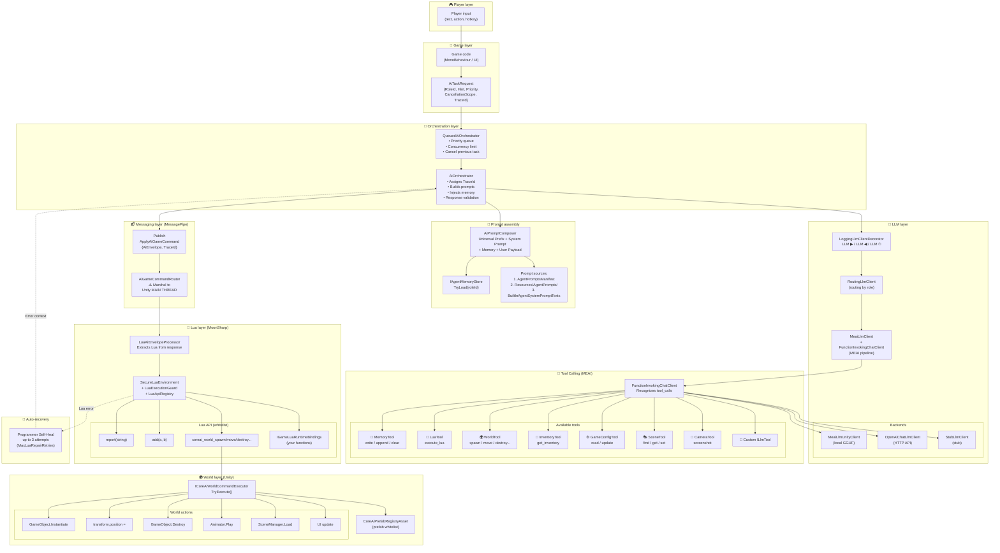
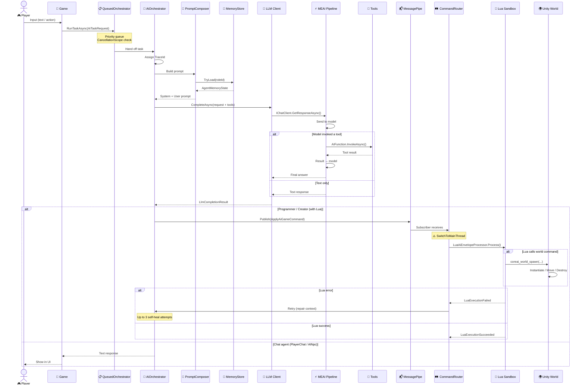

# 🗺️ How a player command flows through the system

**Document version:** 1.0 | **Date:** April 2026

This document describes in detail the path of a player command from input to execution in the game world. Understanding this flow is key to debugging and extending CoreAI.

---

## 1. High-level flow diagram



---

## 2. Step-by-step walkthrough (numbered steps)

### Step 1: Player input → `AiTaskRequest`

```csharp
// Player clicked a craft button or typed in chat
await orchestrator.RunTaskAsync(new AiTaskRequest
{
    RoleId = "CoreMechanicAI",           // Which agent handles it
    Hint = "Craft weapon: Iron + Fire Crystal",  // What to do
    Priority = 5,                         // Priority (higher = more important)
    CancellationScope = "crafting"        // Cancellation group
});
```

### Step 2: Queue → `QueuedAiOrchestrator`

```
📋 Task queue:
┌──────────┬──────────┬────────────┬──────────────────┐
│ Priority │ RoleId   │ CancelScope│ Status           │
├──────────┼──────────┼────────────┼──────────────────┤
│    10    │ Creator  │ session    │ ⏳ In progress    │
│     5    │ Mechanic │ crafting   │ ⏳ Waiting        │ ← our task
│     1    │ Analyzer │ analytics  │ ⏳ Waiting        │
└──────────┴──────────┴────────────┴──────────────────┘

Concurrency limit: MaxConcurrent = 2
```

**What happens:**
- The task is placed in a priority queue
- If a task with the same `CancellationScope` already exists, the previous one is cancelled
- When a slot frees up, the task is handed to `AiOrchestrator`

### Step 3: Prompt assembly → `AiPromptComposer`

```
═══════════════════════════════════════════════════
  FINAL SYSTEM PROMPT (built from 3 parts)
═══════════════════════════════════════════════════

📌 Part 1 — Universal Prefix (shared by all):
"You are an AI agent in a game. Always stay in character."

📌 Part 2 — Role prompt (CoreMechanicAI):
"You are the CoreMechanicAI. Evaluate crafting recipes..."

📌 Part 3 — Agent memory (from prior runs):
"Previous memory: Craft#1: Iron Blade damage:45 fire:0"

═══════════════════════════════════════════════════
  USER PAYLOAD
═══════════════════════════════════════════════════
{
  "telemetry": { "wave": 3, "playerLevel": 5 },
  "hint": "Craft weapon: Iron + Fire Crystal"
}
```

### Step 4: LLM request → `ILlmClient`

```
┌─────────────────────────────────────────────────────┐
│  LoggingLlmClientDecorator                           │
│  📋 LLM ▶ [traceId=abc123] role=CoreMechanicAI       │
│                                                       │
│  ┌─────────────────────────────────────────────────┐ │
│  │  RoutingLlmClient                                │ │
│  │  Route: CoreMechanicAI → OpenAiHttp             │ │
│  │                                                   │ │
│  │  ┌─────────────────────────────────────────────┐ │ │
│  │  │  MeaiLlmClient                              │ │ │
│  │  │  + FunctionInvokingChatClient                │ │ │
│  │  │  + SmartToolCallingChatClient                │ │ │
│  │  │    (dedup, loop protection)                  │ │ │
│  │  │                                              │ │ │
│  │  │  Tools: [memory, execute_lua, game_config]   │ │ │
│  │  └─────────────────────────────────────────────┘ │ │
│  └─────────────────────────────────────────────────┘ │
│                                                       │
│  📋 LLM ◀ [traceId=abc123] 247 tokens, 1.2s           │
└─────────────────────────────────────────────────────┘
```

### Step 5: Model response (with tool call)

```json
// Model returns a tool call:
{
  "name": "memory",
  "arguments": {
    "action": "append",
    "content": "Craft#2: Iron + Fire Crystal → Flame Sword damage:45 fire:15"
  }
}
```

**MEAI pipeline automatically:**
1. Recognizes the tool call in the response
2. Resolves `MemoryTool` by name `"memory"`
3. Calls `MemoryTool.ExecuteAsync(action, content)`
4. Result → back to the model → final text response

### Step 6: Publish → MessagePipe

```csharp
// AiOrchestrator publishes the result to the bus:
messageBroker.Publish(new ApplyAiGameCommand
{
    CommandTypeId = "AiEnvelope",
    Payload = "```lua\ncreate_item(\"Flame Sword\", 75)\nadd_effect(\"fire_damage\", 15)\nreport(\"crafted Flame Sword\")\n```",
    TraceId = "abc123"
});
```

### Step 7: Routing → `AiGameCommandRouter`

```
⚠️ CRITICAL: Switch to Unity MAIN THREAD!

Background Thread ──→ UniTask.SwitchToMainThread() ──→ Main Thread
                                                          ↓
                                              LuaAiEnvelopeProcessor
                                                          ↓
                                                 SecureLuaEnvironment
```

### Step 8: Lua execution → `SecureLuaEnvironment`

```lua
-- Lua runs in MoonSharp sandbox:
create_item("Flame Sword", 75)        -- → Whitelist API
add_effect("fire_damage", 15)         -- → Whitelist API
report("crafted Flame Sword")         -- → IGameLuaRuntimeBindings

-- If Lua invokes a world command:
coreai_world_spawn("SwordVFX", "fx_sword", 0, 1, 0)
-- → Publishes ApplyAiGameCommand{CommandTypeId = "WorldCommand"}
-- → AiGameCommandRouter → ICoreAiWorldCommandExecutor.TryExecute()
```

### Step 9: Auto-recovery on error (Self-Heal)

```
Attempt 1: LLM → Lua → ❌ Runtime Error: "bad argument to 'create_item'"
    ↓
Attempt 2: LLM (with error context) → Lua → ❌ Syntax Error
    ↓
Attempt 3: LLM (with error history) → Lua → ✅ Success!
    ↓
LuaExecutionSucceeded { TraceId = "abc123" }
```

---

## 3. Sequence diagram



---

## 4. Flows for specific scenarios

### 4.1 Scenario: Player asks an NPC merchant

```
Player: "What do you have?"
  ↓
AiTaskRequest { RoleId = "Merchant", Hint = "What do you have?" }
  ↓
QueuedAiOrchestrator → AiOrchestrator
  ↓
PromptComposer: System="You are a shopkeeper..." + ChatHistory (last 20 messages)
  ↓
LLM → FunctionInvokingChatClient
  ↓
Model: {"name": "get_inventory", "arguments": {}}
  ↓
InventoryTool → [{name: "Iron Sword", price: 50, qty: 3}, ...]
  ↓
Result → model → "I've got great goods! Iron Sword for 50 coins..."
  ↓
Player sees reply in chat 💬
```

### 4.2 Scenario: Creator adjusts difficulty

```
Analyzer: "Player is dominating, boredom rising"
  ↓
AiTaskRequest { RoleId = "Creator", Hint = "Player is too strong..." }
  ↓
Model: 
  1. {"name": "memory", "arguments": {"action": "write", "content": "Wave 7: increased difficulty"}}
  2. Lua: coreai_world_spawn("EliteBoss", "boss_7", 50, 0, 50)
  ↓
MessagePipe → Router → Lua → coreai_world_spawn
  ↓
WorldCommandExecutor → PrefabRegistry → Instantiate(EliteBoss @ 50,0,50)
  ↓
Elite boss appears in the world! 🎮
```

### 4.3 Scenario: Programmer fixes Lua

```
Creator: "Write a boss reward script"
  ↓
AiTaskRequest { RoleId = "Programmer", Hint = "Reward script..." }
  ↓
Attempt 1:
  Model → {"name": "execute_lua", "arguments": {"code": "reward_player(500)\nreport('done')"}}
  Lua → ❌ "attempt to call 'reward_player' (a nil value)"
  ↓
Attempt 2 (with error context):
  Model → {"name": "execute_lua", "arguments": {"code": "report('reward: 500 gold')"}}
  Lua → ✅ Success
  ↓
LuaExecutionSucceeded { TraceId = "abc123" }
```

---

## 5. Key security checkpoints

| Checkpoint | Protection | Description |
|------------|------------|-------------|
| **Queue** | Priority + CancellationScope | Reduces task spam |
| **Prompt** | Universal Prefix | Shared rules for all agents |
| **Tool calling** | SmartToolCallingChatClient | Duplicate detection, loop protection |
| **Tool retry** | MaxToolCallRetries (3) | Small models get another try |
| **Lua** | SecureLuaEnvironment + Guard | Whitelist API, step limit, wall clock |
| **World commands** | PrefabRegistryAsset | Whitelist prefabs for spawn |
| **Threads** | Main-thread marshaling | Unity APIs only on main thread |
| **Self-heal** | MaxLuaRepairRetries (3) | Cap on Lua repair attempts |

---

## 6. Visual file map

```
CoreAI/Runtime/Core/
├── Orchestration/
│   ├── AiOrchestrator.cs          ← Main orchestrator
│   ├── QueuedAiOrchestrator.cs    ← Priority queue
│   ├── AiTaskRequest.cs           ← Request DTO
│   └── AiPromptComposer.cs       ← Prompt assembly
├── Features/
│   ├── Llm/
│   │   ├── ILlmClient.cs         ← LLM interface
│   │   ├── ILlmTool.cs           ← Tool interface
│   │   └── MeaiLlmClient.cs      ← MEAI pipeline
│   ├── AgentMemory/
│   │   ├── MemoryTool.cs          ← Memory tool
│   │   └── IAgentMemoryStore.cs   ← Memory store
│   ├── LuaExecution/
│   │   ├── SecureLuaEnvironment.cs ← Lua sandbox
│   │   └── LuaExecutionGuard.cs   ← Lua limits
│   └── World/
│       └── CoreAiWorldCommandEnvelope.cs ← World command DTO

CoreAiUnity/Runtime/Source/
├── Composition/
│   └── CoreAILifetimeScope.cs     ← DI container (VContainer)
├── Features/
│   ├── Llm/
│   │   ├── MeaiLlmUnityClient.cs  ← LLMUnity adapter
│   │   ├── OpenAiChatLlmClient.cs ← HTTP API adapter
│   │   └── RoutingLlmClient.cs    ← Role-based routing
│   ├── Messaging/
│   │   └── AiGameCommandRouter.cs ← Router + main thread
│   ├── Lua/
│   │   └── LuaAiEnvelopeProcessor.cs ← Lua envelope handler
│   └── World/
│       └── CoreAiWorldCommandExecutor.cs ← World command executor
```

---

> 📖 **Related documents:**
> - [TOOL_CALL_SPEC.md](TOOL_CALL_SPEC.md) — JSON command format
> - [DEVELOPER_GUIDE.md](DEVELOPER_GUIDE.md) — architecture and code map
> - [AI_AGENT_ROLES.md](AI_AGENT_ROLES.md) — agent roles
> - [WORLD_COMMANDS.md](WORLD_COMMANDS.md) — world commands
> - [MemorySystem.md](MemorySystem.md) — memory system
