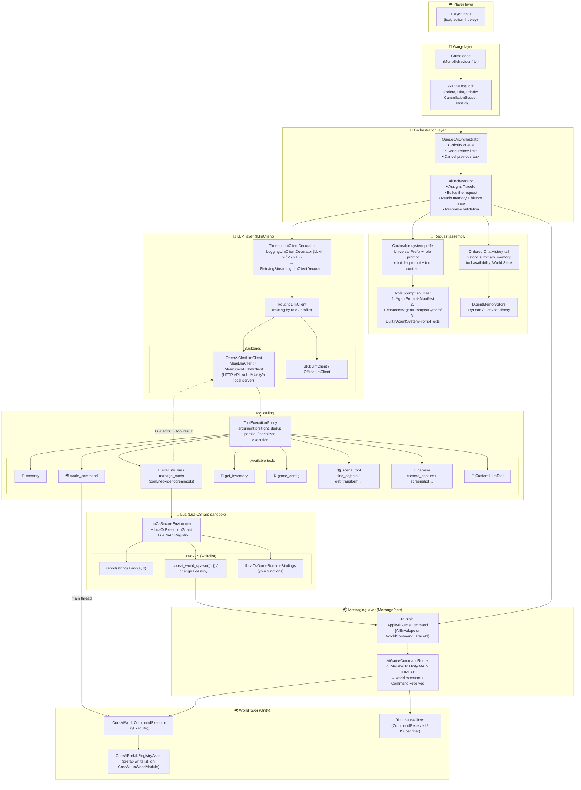

# 🗺️ How a player command flows through the system

This document describes in detail the path of a player command from input to execution in the game world. Understanding this flow is key to debugging and extending CoreAI.

---

## 1. High-level flow diagram


```mermaid
flowchart TB
    subgraph PLAYER ["🎮 Player layer"]
        Input["Player input<br/>(text, action, hotkey)"]
    end

    subgraph GAME ["🎯 Game layer"]
        GameCode["Game code<br/>(MonoBehaviour / UI)"]
        TaskRequest["AiTaskRequest<br/>{RoleId, Hint, Priority,<br/>CancellationScope, TraceId}"]
    end

    subgraph ORCHESTRATION ["🧠 Orchestration layer"]
        QueuedOrch["QueuedAiOrchestrator<br/>• Priority queue<br/>• Concurrency limit<br/>• Cancel previous task"]
        AiOrch["AiOrchestrator<br/>• Assigns TraceId<br/>• Builds the request<br/>• Reads memory + history once<br/>• Response validation"]
    end

    subgraph PROMPT ["📝 Request assembly"]
        Prefix["Cacheable system prefix<br/>Universal Prefix + role prompt<br/>+ builder prompt + tool contract"]
        Tail["Ordered ChatHistory tail<br/>history, summary, memory,<br/>tool availability, World State"]
        PromptSource["Role prompt sources:<br/>1. AgentPromptsManifest<br/>2. Resources/AgentPrompts/System/<br/>3. BuiltInAgentSystemPromptTexts"]
        MemoryLoad["IAgentMemoryStore<br/>TryLoad / GetChatHistory"]
    end

    subgraph LLM ["🤖 LLM layer (ILlmClient)"]
        Decorators["TimeoutLlmClientDecorator<br/>→ LoggingLlmClientDecorator (LLM &gt; / &lt; / x / ~)<br/>→ RetryingStreamingLlmClientDecorator"]
        Routing["RoutingLlmClient<br/>(routing by role / profile)"]

        subgraph BACKENDS ["Backends"]
            OpenAI["OpenAiChatLlmClient<br/>MeaiLlmClient + MeaiOpenAiChatClient<br/>(HTTP API, or LLMUnity's local server)"]
            Stub["StubLlmClient / OfflineLlmClient"]
        end
    end

    subgraph TOOLCALL ["🔧 Tool calling"]
        Policy["ToolExecutionPolicy<br/>argument preflight, dedup,<br/>parallel / serialized execution"]

        subgraph TOOLS ["Available tools"]
            MemoryTool["🧠 memory"]
            LuaTool["📜 execute_lua / manage_mods<br/>(com.neoxider.coreaimods)"]
            WorldTool["🌍 world_command"]
            InvTool["🎒 get_inventory"]
            ConfigTool["⚙️ game_config"]
            SceneTool["🎭 scene_tool<br/>find_objects / get_transform ..."]
            CamTool["📸 camera<br/>camera_capture / screenshot ..."]
            CustomTool["🧩 Custom ILlmTool"]
        end
    end

    subgraph LUA ["🔧 Lua (Lua-CSharp sandbox)"]
        SecureLua["LuaCsSecureEnvironment<br/>+ LuaCsExecutionGuard<br/>+ LuaCsApiRegistry"]

        subgraph LUAAPI ["Lua API (whitelist)"]
            Report["report(string) / add(a, b)"]
            WorldAPI["coreai_world_spawn({...}) / change / destroy ..."]
            GameBindings["ILuaCsGameRuntimeBindings<br/>(your functions)"]
        end
    end

    subgraph MESSAGING ["📬 Messaging layer (MessagePipe)"]
        Publish["Publish ApplyAiGameCommand<br/>{AiEnvelope or WorldCommand, TraceId}"]
        Router["AiGameCommandRouter<br/>⚠️ Marshal to Unity MAIN THREAD<br/>→ world executor + CommandReceived"]
    end

    subgraph WORLD ["🌍 World layer (Unity)"]
        WorldExec["ICoreAiWorldCommandExecutor<br/>TryExecute()"]
        PrefabReg["CoreAiPrefabRegistryAsset<br/>(prefab whitelist, on CoreAiLuaWorldModule)"]
        Subs["Your subscribers<br/>(CommandReceived / ISubscriber)"]
    end

    Input --> GameCode
    GameCode --> TaskRequest
    TaskRequest --> QueuedOrch
    QueuedOrch --> AiOrch

    AiOrch --> Prefix
    AiOrch --> Tail
    Prefix --> PromptSource
    Tail --> MemoryLoad

    AiOrch --> Decorators
    Decorators --> Routing
    Routing --> OpenAI
    Routing --> Stub
    OpenAI --> Policy

    Policy --> MemoryTool
    Policy --> LuaTool
    Policy --> WorldTool
    Policy --> InvTool
    Policy --> ConfigTool
    Policy --> SceneTool
    Policy --> CamTool
    Policy --> CustomTool

    LuaTool --> SecureLua
    SecureLua --> Report
    SecureLua --> WorldAPI
    SecureLua --> GameBindings
    LuaTool -.->|"Lua error → tool result"| OpenAI

    WorldTool -->|"main thread"| WorldExec
    WorldAPI --> Publish
    AiOrch --> Publish
    Publish --> Router
    Router --> WorldExec
    Router --> Subs
    WorldExec --> PrefabReg

    classDef player fill:#e8f5e9,stroke:#4caf50,stroke-width:2px
    classDef game fill:#e3f2fd,stroke:#2196f3,stroke-width:2px
    classDef orch fill:#fff3e0,stroke:#ff9800,stroke-width:2px
    classDef llm fill:#fce4ec,stroke:#e91e63,stroke-width:2px
    classDef tool fill:#f3e5f5,stroke:#9c27b0,stroke-width:2px
    classDef msg fill:#e0f2f1,stroke:#009688,stroke-width:2px
    classDef lua fill:#fff8e1,stroke:#ffc107,stroke-width:2px
    classDef world fill:#efebe9,stroke:#795548,stroke-width:2px
```

---

## 2. Step-by-step walkthrough (numbered steps)

### Step 1: Player input → `AiTaskRequest`

```csharp
// Player clicked a craft button or typed in chat
await orchestrator.RunTaskAsync(new AiTaskRequest
{
    RoleId = "CoreMechanicAI",           // Which agent handles it
    Hint = "Craft weapon: Iron + Fire Crystal",  // What to do
    Priority = 5,                         // Priority (higher = more important)
    CancellationScope = "crafting"        // Cancellation group
});
```

### Step 2: Queue → `QueuedAiOrchestrator`

```
📋 Task queue:
┌──────────┬──────────┬────────────┬──────────────────┐
│ Priority │ RoleId   │ CancelScope│ Status           │
├──────────┼──────────┼────────────┼──────────────────┤
│    10    │ Creator  │ session    │ ⏳ In progress    │
│     5    │ Mechanic │ crafting   │ ⏳ Waiting        │ ← our task
│     1    │ Analyzer │ analytics  │ ⏳ Waiting        │
└──────────┴──────────┴────────────┴──────────────────┘

Concurrency limit: AiOrchestrationQueueOptions.MaxConcurrent
```

**What happens:**
- The task is placed in a priority queue
- If a task with the same `CancellationScope` (in the same memory scope) already exists, the previous one is cancelled
- When a slot frees up, the task is handed to `AiOrchestrator`

### Step 3: Request assembly → `AiOrchestrator`

```
═══════════════════════════════════════════════════
  CACHEABLE SYSTEM PREFIX (byte-stable per role)
═══════════════════════════════════════════════════

📌 Layer 1 — Universal Prefix (shared by all):
"You are an AI agent in a game. Always stay in character."

📌 Layer 2 — Role prompt (CoreMechanicAI):
"You are the CoreMechanicAI. Evaluate crafting recipes..."

📌 Layers 3–4 — AgentBuilder prompt + full role tool contract

═══════════════════════════════════════════════════
  ORDERED TAIL (LlmCompletionRequest.ChatHistory)
═══════════════════════════════════════════════════
recent history / ## Conversation Summary
## Memory: "Craft#1: Iron Blade damage:45 fire:0"
## Tool Availability (current request)
## World State (IAiPromptContextProvider)

═══════════════════════════════════════════════════
  USER PAYLOAD (AiPromptComposer.BuildUserPayload)
═══════════════════════════════════════════════════
{
  "telemetry": { "wave": 3, "playerLevel": 5 },
  "hint": "Craft weapon: Iron + Fire Crystal"
}
```

Memory and history are read once per request; they never enter the cacheable prefix. Details:
[DEVELOPER_GUIDE §3.5](DEVELOPER_GUIDE.md#35-prompt-layers-what-the-model-actually-sees).

### Step 4: LLM request → `ILlmClient`

```
┌─────────────────────────────────────────────────────────┐
│  TimeoutLlmClientDecorator                               │
│  ┌─────────────────────────────────────────────────────┐ │
│  │  LoggingLlmClientDecorator                           │ │
│  │  📋 LLM > traceId=abc123 role=CoreMechanicAI ...     │ │
│  │  ┌─────────────────────────────────────────────────┐ │ │
│  │  │  RetryingStreamingLlmClientDecorator             │ │ │
│  │  │  → RoutingLlmClient (role → profile / endpoint)  │ │ │
│  │  │  → OpenAiChatLlmClient                           │ │ │
│  │  │     MeaiLlmClient (tool loop)                    │ │ │
│  │  │     + ToolExecutionPolicy                        │ │ │
│  │  │     + MeaiOpenAiChatClient (HTTP / SSE)          │ │ │
│  │  │                                                  │ │ │
│  │  │  Tools: [memory, execute_lua, game_config]       │ │ │
│  │  └─────────────────────────────────────────────────┘ │ │
│  │  📋 LLM < traceId=abc123 ... wallMs=1200 | ...        │ │
│  └─────────────────────────────────────────────────────┘ │
└─────────────────────────────────────────────────────────┘
```

### Step 5: Model response (with tool call)

```json
// Model returns a tool call:
{
  "name": "memory",
  "arguments": {
    "action": "append",
    "content": "Craft#2: Iron + Fire Crystal → Flame Sword damage:45 fire:15"
  }
}
```

**The tool loop automatically:**
1. Takes the call from the provider's `tool_calls` (or, on an endpoint without a native tool channel, from the text)
2. Resolves the `memory` tool by name and checks the arguments against its schema
3. Calls `MemoryTool.ExecuteAsync(action, content)`
4. Result → back to the model → final text response

### Step 6: Lua through the `execute_lua` tool

```json
{"name": "execute_lua", "arguments": {"code": "report('crafted Flame Sword')\ncoreai_world_spawn({ prefab = 'SwordVFX', name = 'fx_sword', x = 0, y = 1, z = 0 })"}}
```

```lua
-- Lua runs in the Lua-CSharp sandbox (LuaCsSecureEnvironment):
report("crafted Flame Sword")          -- → default bindings (LuaCsLoggingRuntimeBindings)
coreai_world_spawn({ prefab = "SwordVFX", name = "fx_sword", x = 0, y = 1, z = 0 })
-- → Publishes ApplyAiGameCommand{CommandTypeId = "WorldCommand"}
-- → AiGameCommandRouter → ICoreAiWorldCommandExecutor.TryExecute()
```

The tool result (success, or the Lua error) goes back to the model in the same turn.

### Step 7: Publish → MessagePipe

```csharp
// After the turn, AiOrchestrator publishes the visible result to the bus:
sink.Publish(new ApplyAiGameCommand
{
    CommandTypeId = AiGameCommandTypeIds.Envelope,   // "AiEnvelope"
    JsonPayload = "Crafted Flame Sword (damage 45, fire 15).",
    SourceRoleId = "CoreMechanicAI",
    TraceId = "abc123"
});
```

### Step 8: Routing → `AiGameCommandRouter`

```
⚠️ CRITICAL: Switch to Unity MAIN THREAD!

Background Thread ──→ UniTask.SwitchToMainThread() ──→ Main Thread
                                                          ↓
                                    ICoreAiWorldCommandExecutor.TryExecute(cmd)
                                                          ↓
                                    AiGameCommandRouter.CommandReceived (your code)
```

The router does not execute Lua from an `AiEnvelope`. If you want that path (Lua in the reply text plus
automatic Programmer repair), construct `LuaCsAiEnvelopeProcessor` from `com.neoxider.coreaimods` and call
`Process(cmd)` from your own subscriber.

### Step 9: Recovery on error

```
Turn 1: model → execute_lua → ❌ "attempt to call a nil value (global 'create_item')"
    ↓  (the error is the tool result)
Turn 2: model → execute_lua with corrected code → ✅ Success
    ↓
Final text response
```

If every call in `MaxToolCallRetries` (default 3) consecutive tool batches fails, or the roundtrip cap is hit,
the loop makes one final tools-disabled summary turn.

---

## 3. Sequence diagram

```mermaid
sequenceDiagram
    actor Player as 🎮 Player
    participant Game as 🎯 Game
    participant Queue as 📋 QueuedOrchestrator
    participant Orch as 🧠 AiOrchestrator
    participant Memory as 💾 MemoryStore
    participant LLM as 🤖 LLM Client
    participant Tools as 🔧 ToolExecutionPolicy + tools
    participant Lua as 📜 Lua Sandbox
    participant Bus as 📬 MessagePipe
    participant Router as 🛤️ CommandRouter
    participant World as 🌍 Unity World

    Player->>Game: Input (text / action)
    Game->>Queue: RunTaskAsync(AiTaskRequest)

    Note over Queue: Priority queue<br/>CancellationScope check
    Queue->>Orch: Hand off task

    Orch->>Orch: Assign TraceId
    Orch->>Memory: TryLoad(roleId) + GetChatHistory(roleId)
    Memory-->>Orch: AgentMemoryState + history
    Orch->>Orch: Prefix + ordered tail + user payload

    Orch->>LLM: CompleteStreamingAsync (default) / CompleteAsync (fallback)
    Note over Orch,LLM: Streaming is default when EnableStreaming is on<br/>(RunTaskAsync via CompleteForTaskAsync);<br/>CompleteAsync only when streaming is off

    alt Model invoked a tool
        LLM->>Tools: validate arguments, invoke AIFunction
        opt execute_lua
            Tools->>Lua: run chunk
            Lua->>Bus: coreai_world_* → WorldCommand
            Lua-->>Tools: result or Lua error
        end
        Tools-->>LLM: Tool result
        LLM->>LLM: Result → model → next step
    end

    LLM-->>Orch: LlmCompletionResult (visible text + tool traces)
    Orch->>Memory: Append user + assistant turn
    Orch->>Bus: Publish(ApplyAiGameCommand AiEnvelope)

    Bus->>Router: Subscriber receives
    Note over Router: ⚠️ SwitchToMainThread
    Router->>World: ICoreAiWorldCommandExecutor.TryExecute
    Router-->>Game: CommandReceived
    Orch-->>Game: Text response
    Game-->>Player: Show in UI
```

---

## 4. Flows for specific scenarios

### 4.1 Scenario: Player asks an NPC merchant

```
Player: "What do you have?"
  ↓
AiTaskRequest { RoleId = "Merchant", Hint = "What do you have?" }
  ↓
QueuedAiOrchestrator → AiOrchestrator
  ↓
Request: System="You are a shopkeeper..." + ChatHistory (recent messages, default cap 30)
  ↓
LLM → tool loop
  ↓
Model: {"name": "get_inventory", "arguments": {}}
  ↓
InventoryTool → [{name: "Iron Sword", price: 50, qty: 3}, ...]
  ↓
Result → model → "I've got great goods! Iron Sword for 50 coins..."
  ↓
Player sees reply in chat 💬
```

### 4.2 Scenario: Creator adjusts difficulty

```
Analyzer: "Player is dominating, boredom rising"
  ↓
AiTaskRequest { RoleId = "Creator", Hint = "Player is too strong..." }
  ↓
Model:
  1. {"name": "memory", "arguments": {"action": "append", "content": "Wave 7: increased difficulty"}}
  2. {"name": "world_command", "arguments": {"action": "spawn", "prefabKey": "EliteBoss", "targetName": "boss_7", "x": 50, "y": 0, "z": 50}}
  ↓
WorldLlmTool → main thread → ICoreAiWorldCommandExecutor
  ↓
PrefabRegistry → Instantiate(EliteBoss @ 50,0,50)
  ↓
Elite boss appears in the world! 🎮
```

### 4.3 Scenario: Programmer fixes Lua

```
Creator: "Write a boss reward script"
  ↓
AiTaskRequest { RoleId = "Programmer", Hint = "Reward script..." }
  ↓
Roundtrip 1:
  Model → {"name": "execute_lua", "arguments": {"code": "reward_player(500)\nreport('done')"}}
  Tool result → ❌ attempt to call a nil value (global 'reward_player')
  ↓
Roundtrip 2 (the model read the error):
  Model → {"name": "execute_lua", "arguments": {"code": "report('reward: 500 gold')"}}
  Tool result → ✅ Success
  ↓
Final text response (TraceId = "abc123" in every log line)
```

---

## 5. Key security checkpoints

| Checkpoint | Protection | Description |
|------------|------------|-------------|
| **Queue** | Priority + CancellationScope | Reduces task spam |
| **Prompt** | Universal Prefix | Shared rules for all agents |
| **Tool calling** | ToolExecutionPolicy (both loops) | Argument preflight, cross-turn echo suppression, loop protection |
| **Tool parallelism** | MaxParallelToolCalls (4) | Bounded concurrent tool execution; mutating built-ins serialized; arrival-order results (`<=1` = sequential) |
| **Tool failures** | MaxToolCallRetries (3) | Consecutive all-failed batches end the loop with a summary turn |
| **Lua** | LuaCsSecureEnvironment + LuaCsExecutionGuard | Whitelist API, step limit, wall clock, allocation budget |
| **World commands** | CoreAiPrefabRegistryAsset | Whitelist prefabs for spawn |
| **Threads** | Main-thread marshaling | Unity APIs only on main thread |
| **Envelope Lua repair (opt-in)** | MaxLuaRepairRetries (3) | Cap on `LuaCsAiEnvelopeProcessor` repair generations |

---

## 6. Visual file map

```
CoreAI/Runtime/Core/Features/
├── Orchestration/
│   ├── AiOrchestrator.cs          ← Main orchestrator
│   ├── QueuedAiOrchestrator.cs    ← Priority queue
│   ├── AiTaskRequest.cs           ← Request DTO
│   └── ILlmClient.cs              ← LLM interface + LlmCancellation
├── AgentPrompts/
│   └── AiPromptComposer.cs        ← User payload
├── Llm/
│   ├── ILlmTool.cs                ← Tool interface
│   ├── ToolExecutionPolicy.cs     ← Tool execution rules
│   └── LoggingLlmClientDecorator.cs ← LLM > / < / x / ~ logs
└── AgentMemory/
    ├── MemoryTool.cs              ← Memory tool
    └── IAgentMemoryStore.cs       ← Memory store

CoreAiUnity/Runtime/Source/
├── Composition/
│   ├── CoreAILifetimeScope.cs     ← DI container (VContainer)
│   └── LlmPipelineInstaller.cs    ← ILlmClient decorator chain
└── Features/
    ├── Llm/Infrastructure/
    │   ├── MeaiLlmClient.cs       ← MEAI tool loop (streaming)
    │   ├── OpenAiChatLlmClient.cs ← HTTP API adapter (also LLMUnity's local server)
    │   ├── LlmUnityServerHttpSettings.cs ← LLMUnity endpoint settings
    │   └── RoutingLlmClient.cs    ← Role-based routing
    ├── Messaging/Infrastructure/
    │   └── AiGameCommandRouter.cs ← Router + main thread
    └── World/
        ├── WorldLlmTool.cs        ← world_command tool
        └── Infrastructure/
            ├── CoreAiWorldCommandEnvelope.cs ← World command DTO
            └── CoreAiWorldCommandExecutor.cs ← World command executor

CoreAIMods/Runtime/ (optional package)
├── LuaExecution/
│   ├── LuaTool.cs                 ← execute_lua
│   └── LuaCsAiEnvelopeProcessor.cs ← opt-in envelope Lua + repair
├── Scripting/LuaCs/
│   ├── LuaCsSecureEnvironment.cs  ← Lua sandbox
│   └── LuaCsExecutionGuard.cs     ← Lua limits
└── WorldBindings/
    └── LuaCsWorldRuntimeBindings.cs ← coreai_world_* functions
```

---

> 📖 **Related documents:**
> - [TOOL_CALL_SPEC.md](TOOL_CALL_SPEC.md) — JSON command format
> - [DEVELOPER_GUIDE.md](DEVELOPER_GUIDE.md) — architecture and code map
> - [AI_AGENT_ROLES.md](AI_AGENT_ROLES.md) — agent roles
> - [WORLD_COMMANDS.md](WORLD_COMMANDS.md) — world commands
> - [MemorySystem.md](MemorySystem.md) — memory system
