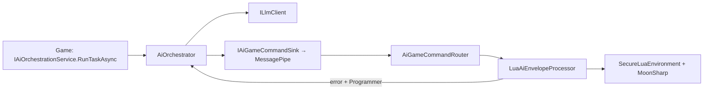

# CoreAI Developer Guide (template)

For teams who **wire the core into their own game** or **extend this repository**. Normative contracts and the roadmap live in **[DGF_SPEC.md](DGF_SPEC.md)**; this document is a practical map of the codebase and common tasks.

---

## 1. Where to start (reading order)

**From zero in ~10 minutes:** [QUICK_START.md](QUICK_START.md) → RogueliteArena scene, LLM, F9. **Index of all Docs:** [DOCS_INDEX.md](DOCS_INDEX.md).

| Step | Document / location | Why |
|-----|------------------|--------|
| 0 | [QUICK_START.md](QUICK_START.md), [../../_exampleGame/Docs/UNITY_SETUP.md](../../_exampleGame/Docs/UNITY_SETUP.md) | Quick start and step-by-step Example Game setup in Unity |
| 1 | [DGF_SPEC.md](DGF_SPEC.md) §1–5, §8–9 (**§9.4** — main Unity flow after LLM) | Core goals, LLM/stub, Lua, threading |
| 2 | [AI_AGENT_ROLES.md](AI_AGENT_ROLES.md) | Agent roles, placement, model selection |
| 3 | [LLMUNITY_SETUP_AND_MODELS.md](LLMUNITY_SETUP_AND_MODELS.md) | LLMUnity, LM Studio / OpenAI HTTP, Play Mode tests, Lua pipeline |
| 4 | [../README.md](../README.md) (host **`CoreAiUnity`**) | Builds, folders, DI, prompts, MessagePipe |
| 5 | [GameTemplateGuides/INDEX.md](GameTemplateGuides/INDEX.md) | Short recipes for your title |
| 6 | [../../_exampleGame/README.md](../../_exampleGame/README.md) | Example game and entry points |

---

## 2. Assemblies and responsibility boundaries

**Principle:** **`CoreAI.Core`** is portable **C#** with no engine-specific implementation; **`CoreAI.Source`** is the **Unity** layer (DI, scene, LLM adapters). Normatively fixed in **[DGF_SPEC §3.0](DGF_SPEC.md)**.

| Assembly | Folder | Constraint |
|--------|-------|-------------|
| **CoreAI.Core** | `Assets/CoreAI/Runtime/Core/` | **No Unity** (`noEngineReferences`). AI contracts, orchestrator, **`QueuedAiOrchestrator`** queue, session snapshot, MoonSharp sandbox, Lua parsing, envelope processor. |
| **CoreAI.Source** | `Assets/CoreAiUnity/Runtime/Source/` | Unity: VContainer, MessagePipe, LLM routing (**`RoutingLlmClient`**, **`LlmRoutingManifest`**), LLMUnity/OpenAI HTTP, logging, command router, Lua bindings (`report` / `add`). Package **`com.nexoider.coreaiunity`**. |
| **CoreAI.Tests** | `Assets/CoreAiUnity/Tests/EditMode/` | Edit Mode NUnit, no Play Mode. |
| **CoreAI.PlayModeTests** | `Assets/CoreAiUnity/Tests/PlayMode/` | Play Mode (orchestrator, optionally LM Studio via env). |
| **CoreAI.ExampleGame** | `Assets/_exampleGame/` | Demo arena; depends on Source. |

**Verification:** compile with `dotnet build` on generated `*.csproj` (Unity/Rider) or build from the IDE; **NUnit Edit Mode / Play Mode** — in **Unity Test Runner** (`Window → General → Test Runner`). The source of truth for scenarios involving `UnityEngine` and test assets is Test Runner, not bare `dotnet test` without Unity.

**Rule:** title gameplay logic should not “leak” into Core unless necessary. New **game** APIs for Lua go through **`IGameLuaRuntimeBindings`** in Source (or in the game assembly), not by editing the sandbox outside the whitelist.

---

## 2.1 Default behavior (out of the box) and tuning points

The template is meant to **work sensibly by default**, while still allowing targeted tuning without rewriting the core.

### What works out of the box

- **DI + MessagePipe + log:** `CoreAILifetimeScope` registers `IGameLogger`, `ApplyAiGameCommand` broker, `IAiGameCommandSink`.
- **Orchestration:** default `IAiOrchestrationService` is `QueuedAiOrchestrator` around `AiOrchestrator`.
- **Lua pipeline:** `AiGameCommandRouter` marshals handling to the main thread and runs `LuaAiEnvelopeProcessor`.
- **Lua limits:** `LuaExecutionGuard` caps wall-clock and “steps” (best-effort).
- **Prompts:** system/user chain from manifest → Resources → built-in fallback.
- **Programmer versions (Lua + data overlays):** in the Unity layer they are persisted to disk by default (File* store).
- **World Commands:** Lua API `coreai_world_*` publishes world commands to the bus; execution runs on the main thread (see [WORLD_COMMANDS.md](WORLD_COMMANDS.md)).
- **WebGL / IL2CPP:** `CoreServicesInstaller` registers **`IAiGameCommandSink`** with an explicit factory (`MessagePipeAiCommandSink`), not `Register<MessagePipeAiCommandSink>().As<…>()`, so VContainer does not depend on constructor metadata analysis (avoids `Type does not found injectable constructor` in player builds). The Unity package includes **`link.xml`** preserving `MessagePipeAiCommandSink`. EditMode coverage: **`CoreServicesInstallerEditModeTests`**.

### What you configure on `CoreAILifetimeScope`

- **LLM backend:** `OpenAiHttpLlmSettings` (OpenAI-compatible HTTP) and `LlmRoutingManifest` (per-role routing).
- **Prompts:** `AgentPromptsManifest` (system/user overrides and custom roles).
- **Logs:** `GameLogSettingsAsset` (feature and level filter).
- **World Commands:** `World Prefab Registry` (spawn prefab whitelist).

Recommendation for a title: keep settings in one or two ScriptableObject assets and version them in git (no secrets).

### 2.2 Logging: `IGameLogger`, tags/features, and external libraries (Serilog, etc.)

- **In the CoreAI core** use **`IGameLogger`** and **`GameLogFeature`** — built-in subsystem “tags” and level filtering via **`GameLogSettingsAsset`** (structured categories without a separate NuGet). Unity console output goes through **`FilteringGameLogger` → `UnityGameLogSink`**; avoid scattering **`Debug.Log`** across business code.
- **Serilog / NLog / Microsoft.Extensions.Logging** in Unity are wired separately if you need files, Seq, Elasticsearch, etc. They are **not** required for **core** code: implement your own **`IGameLogger`** or replace the sink to mirror into Serilog without mixing two logging styles in one layer.
- **Filtering in the Unity console:** by message prefix (category from **`GameLogFeature`**), by **`TraceId`** in the orchestrator/command chain (see host README), plus minimum level in the log asset.
- **Editor** (menus, setup without DI): **`CoreAIEditorLog`** — single entry point for editor messages.

---

## 3. Data flow (how everything connects)

Simplified runtime diagram:



1. The **game** calls **`IAiOrchestrationService.RunTaskAsync(AiTaskRequest)`** (role, hint, **`Priority`**, **`CancellationScope`**, optional Lua repair fields, **`TraceId`**).
2. The default implementation is **`QueuedAiOrchestrator`** (concurrency limit, priority, canceling the previous task with the same **`CancellationScope`**) around **`AiOrchestrator`**. **`AiOrchestrator`** assigns **`TraceId`**, assembles prompts, asks **`IConversationContextManager`** to prepare long chat history, then calls **`ILlmClient.CompleteAsync`**; with **`IRoleStructuredResponsePolicy`** for a role, **one** retry is allowed with a **`structured_retry:`** hint in user/hint. Then **`ApplyAiGameCommand`** is published (**`AiEnvelope`**, **`TraceId`**, …). Metrics — **`IAiOrchestrationMetrics`** (log under **`GameLogFeature.Metrics`**).
3. In DI, **`ILlmClient`** is **`LoggingLlmClientDecorator`** around **`RoutingLlmClient`** (or a legacy single client): inside — **`OpenAiChatLlmClient`** / **`MeaiLlmUnityClient`** / **`StubLlmClient`** per **`LlmRoutingManifest`** and role. Log **`GameLogFeature.Llm`** (`LLM ▶` / `LLM ◀` / `LLM ⏱`), backend line **`RoutingLlmClient→OpenAiHttp`**, etc. For “is this stub?” — **`LoggingLlmClientDecorator.Unwrap(client)`**.
4. Subscriber **`AiGameCommandRouter`** receives **`ApplyAiGameCommand`** from MessagePipe and **marshals handling to the Unity main thread** (`UniTask.SwitchToMainThread`), then calls **`LuaAiEnvelopeProcessor.Process`**: Lua is extracted from text, executed in the sandbox with API from **`IGameLuaRuntimeBindings`**; **`[MessagePipe]`** logs include the same task **`traceId`**.
5. On success / failure, **`LuaExecutionSucceeded`** / **`LuaExecutionFailed`** are published (**`TraceId`** preserved). For the **Programmer** role on error, the orchestrator is invoked again with repair context and the same **`TraceId`** (up to **3 attempts** by default, configurable via **`CoreAISettings.MaxLuaRepairRetries`**).

**Important:** gameplay systems may subscribe to **`ApplyAiGameCommand`** and react to command types; do not parse raw LLM text outside the shared pipeline if you want consistency. For logs and timeout details, see **[LLMUNITY_SETUP_AND_MODELS.md](LLMUNITY_SETUP_AND_MODELS.md)** §1 (CoreAI block) and timeout.

**Unity main thread (short):** after **`QueuedAiOrchestrator`**, async continuations often run **not** on the main thread; **`Publish`** from the orchestrator may arrive from the thread pool. Any code using **`UnityEngine`**, **`FindObjectsByType`**, scene, or UI — only on the main thread **or** after explicit marshaling. The template marshals in **`AiGameCommandRouter`**; your own MessagePipe subscribers should follow the same rule. Normative text and checklist: **[DGF_SPEC.md](DGF_SPEC.md) §9.4**.

---

### 3.1 Queue semantics

`QueuedAiOrchestrator` is the default `IAiOrchestrationService` wrapper. It provides:

- **Concurrency cap:** `AiOrchestrationQueueOptions.MaxConcurrent` limits total in-flight work across non-streaming and streaming tasks.
- **Priority:** higher `AiTaskRequest.Priority` runs first. Equal priority is FIFO.
- **Shared sync/stream priority:** `RunTaskAsync` and `RunStreamingAsync` use one effective priority order; a high-priority stream is not blocked behind a lower-priority non-stream task.
- **Latest-wins scopes:** when a new task has the same non-empty `CancellationScope`, older active and pending work for that scope is cancelled immediately.
- **Explicit stop:** `CancelTasks(scope)` cancels active work and removes pending non-streaming / streaming work for that scope.
- **External cancellation:** a caller `CancellationToken` cancels pending work before it starts, so callers do not wait for a free LLM slot just to observe cancellation.

Beginner rule: set `CancellationScope = roleId` for UI/chat-style “only latest request matters” flows.
Advanced rule: use stable domain scopes (`arena_wave_plan`, `npc:merchant:dialogue`) and priority bands
for predictable gameplay scheduling.

### 3.2 Long Context Management

Chat history is not sent blindly forever. When `AgentMemoryPolicy.RoleMemoryConfig.WithChatHistory` is enabled, `AiOrchestrator` loads recent stored chat and passes it to `IConversationContextManager`.

The default `DeterministicConversationContextManager` uses the role `ContextTokens` budget. Fresh turns remain in `LlmCompletionRequest.ChatHistory`; older turns are compacted into `## Conversation Summary` in the system prompt and can be stored through `IConversationSummaryStore`. This is deterministic and does not spend another LLM request.

Production projects can replace `IConversationContextManager` with an implementation that calls a backend summarizer, stores summaries per user/session/topic, or applies stricter privacy rules. Keep the output short and factual because it becomes part of every later request.

### 3.3 Tool Call Observability

Tool calls are awaited by `ToolExecutionPolicy.ExecuteSingleAsync`, including async `AIFunction` implementations. The policy publishes `LlmToolCallStarted`, `LlmToolCallCompleted`, and `LlmToolCallFailed`.

Each event exposes `Info: LlmToolCallInfo` with `TraceId`, `RoleId`, provider `CallId`, `ToolName`, and sanitized `ArgumentsJson`. Use `Info.CallId` when correlating start/completed/failed logs, especially when providers issue several tool calls in one response.

---

## 4. LLM: execution modes and routing

`LlmExecutionMode` is the public mode surface. One project can use a single global mode from `CoreAISettingsAsset`, or several modes at once through `LlmRoutingManifest` profiles.

| Mode | Runtime client path | When to use |
|--------|-------------------|-------------|
| **LocalModel** | `MeaiLlmUnityClient` via `LLMAgent` | Local/offline prototyping and shipped local models |
| **ClientOwnedApi** | `OpenAiChatLlmClient` | User/developer owns the provider key |
| **ClientLimited** | `ClientLimitedLlmClientDecorator` → `OpenAiChatLlmClient` | Local caps for demos or prototypes |
| **ServerManagedApi** | `ServerManagedLlmClient` pointed at a backend proxy | Production WebGL/multiplayer/school/SaaS deployment |
| **Offline** | `OfflineLlmClient` or `StubLlmClient` | Tests and builds without live model access |

`RoutingLlmClient` resolves a role through `LlmClientRegistry`, annotates `LlmCompletionRequest.RoutingProfileId`, and publishes `LlmBackendSelected`, `LlmRequestStarted`, `LlmRequestCompleted`, and `LlmUsageReported` via MessagePipe. Diagnostics and UI code should subscribe to those messages instead of inspecting registry internals.

**Note (child `LifetimeScope`):** those events are published with `IPublisher<T>` from **`CoreAILifetimeScope`**. If your title uses a **child** scope and a **second** `RegisterMessagePipe()`, constructor-injected `ISubscriber<LlmRequestStarted>` (and related types) resolved **only** in the child may attach to a **different** broker graph, so you will see **no** LLM telemetry despite live completions. Use **`GlobalMessagePipe.GetSubscriber<T>()`** after the parent scope has built (same provider as `CoreServicesInstaller`’s `SetProvider`), or avoid a second `RegisterMessagePipe` and extend the parent pipe for game-only events.

`ServerManagedApi` supports dynamic backend authorization:

```csharp
ServerManagedAuthorization.SetProvider(() => "Bearer " + authTokenStore.CurrentJwt);
```

Provider failures use `LlmErrorCode` on `LlmCompletionResult`, `LlmStreamChunk`, and `LlmRequestCompleted`, so callers can handle `QuotaExceeded`, `AuthExpired`, `RateLimited`, `BackendUnavailable`, and other stable categories without parsing error text.

For mixed routing, create profiles such as `player_server`, `analyzer_limited`, and `creator_local`, then map role ids to those profiles. A single request always resolves to one concrete backend, but the scene can keep multiple profiles active.

Symbol **`COREAI_NO_LLM`** (manual opt-out): the container keeps a chain with **`StubLlmClient`** / HTTP as needed — details in DGF_SPEC §5.2.

Symbol **`COREAI_HAS_LLMUNITY`** (automatic): defined via `versionDefines` in the asmdef when the `ai.undream.llm` package is installed. Code that depends on LLMUnity types (`MeaiLlmUnityClient`, `LLMAgent`, `LLMManager`) compiles **only** with this symbol. Users do not set it manually.

**Observability:** **`GameLogFeature.Llm`** (LLM requests); **`GameLogFeature.Metrics`** (orchestrator metrics, not in **`AllBuiltIn`** — enable manually in the asset). Older **Game Log Settings** without the **Llm** bit are patched on **`OnValidate`**. Filtering by **`traceId`** links **`LLM ▶/◀`** and **`ApplyAiGameCommand`**.

For streaming with tool-calling, a single cycle is used in `MeaiLlmClient.CompleteStreamingAsync`: if the model emits tool JSON, it runs inside the loop and is not rendered in the UI, then generation continues with the next streaming step.
By default, per-role streaming override is enabled for roles with tools (`AgentMode.ToolsAndChat` and `AgentMode.ToolsOnly`); for `AgentMode.ChatOnly` the standard fallback from settings remains.
`CoreAIGameEntryPoint` in the Unity layer is idempotent: repeated `Start()` does not reinitialize global `CoreAIAgent` and logs a warning on `LogTag.Composition`, guarding against accidental double composition of the scene container.

---

## 5. Prompts and roles

- **System prompt chain:** manifest (optional) → **`Resources/AgentPrompts/System/<RoleId>.txt`** → built-in fallback (**`BuiltInAgentSystemPromptTexts`**).
- **Built-in roles:** see **`BuiltInAgentRoleIds`** and **`AgentRolesAndPromptsTests`**.
- **Custom agents:** use **`AgentBuilder`** to create agents with unique tools. See [AGENT_BUILDER.md](AGENT_BUILDER.md).
- **User payload:** default JSON like `{"telemetry":{...},"hint":"..."}` from **`GameSessionSnapshot.Telemetry`**; Lua repair adds **`lua_repair_generation`**, **`lua_error`**, **`fix_this_lua`** (**`AiPromptComposer`**).
- **Runtime context:** register `IAiPromptContextProvider` implementations to append per-request context such as current quest, lesson slot, learner profile, or objective under `## Runtime Context`.
- **Agent memory (optional):** the agent persists memory via **MEAI tool calling**:
  - `{"name": "memory", "arguments": {"action": "write", "content": "..."}}` — overwrite
  - `{"name": "memory", "arguments": {"action": "append", "content": "..."}}` — append
  - `{"name": "memory", "arguments": {"action": "clear"}}` — clear

  By default memory is **off for all roles** except **Creator** (see `AgentMemoryPolicy`). At Unity runtime, memory is stored under `Application.persistentDataPath/CoreAI/AgentMemory/<RoleId>.json`. For multi-user or session-scoped products, wrap a store with `ScopedAgentMemoryStoreDecorator` and provide an `IAgentMemoryScopeProvider`.

---

## 5.1 MessagePipe extension points (beginner → pro)

CoreAI uses **MessagePipe** as the Unity-side integration bus. The default orchestrator flow is:

`AiOrchestrator` → `IAiGameCommandSink` → `MessagePipeAiCommandSink` → `IPublisher<ApplyAiGameCommand>` → `AiGameCommandRouter`

The important rule: **gameplay handling must run on the Unity main thread**. `AiGameCommandRouter`
already does `UniTask.SwitchToMainThread()` before processing Lua, world commands, logs, and
`CommandReceived`.

### Beginner path: subscribe after the safe router

For UI, tutorials, simple game reactions, or debugging, use:

```csharp
AiGameCommandRouter.CommandReceived += OnAiCommand;

private void OnAiCommand(ApplyAiGameCommand cmd)
{
    // Already on Unity main thread.
    Debug.Log(cmd.JsonPayload);
}
```

This is the easiest extension point: no direct DI or MessagePipe subscription is required, and it is safe
to touch Unity objects.

### Pro path: subscribe to MessagePipe directly

For larger systems, register your own `ISubscriber<ApplyAiGameCommand>` subscriber in the container.
This is useful for analytics, multiplayer replication, custom command routing, save integration, or
domain-specific systems.

If you subscribe directly to MessagePipe, **marshal your handler to the main thread** before touching
Unity APIs:

```csharp
_subscription = subscriber.Subscribe(cmd =>
{
    UniTask.Void(async () =>
    {
        await UniTask.SwitchToMainThread();
        // Safe Unity/GameObject work here.
    });
});
```

Direct MessagePipe subscribers may also run lightweight, thread-safe work without switching (for example
enqueueing telemetry), but Unity scene mutation, UI, `GameObject`, `Transform`, `Animator`, and most save/UI
integrations should use the main-thread path.

### Publishing commands

Prefer publishing through `IAiGameCommandSink` when you are inside CoreAI/agent code. Use
`IPublisher<ApplyAiGameCommand>` directly only in Unity integration code that is already part of the
MessagePipe composition. Keep payloads explicit (`CommandTypeId`, `TraceId`, `SourceRoleId`) so logs and
external subscribers can follow the agent work.

---

## 6. Lua for the Programmer agent

- Parsing: **`AiLuaPayloadParser`** (markdown → JSON **`ExecuteLua`**).
- Execution: **`SecureLuaEnvironment`**, **`LuaExecutionGuard`**, **`LuaApiRegistry`**.
- Limits: `LuaExecutionGuard` applies best-effort **wall-clock** and **step** caps (see `InstructionLimitDebugger`) so infinite Lua loops cannot hang forever.
- Default game calls in the template: **`LoggingLuaRuntimeBindings`** — **`report(string)`**, **`add(a,b)`**.
- Extension: register your **`IGameLuaRuntimeBindings`** in **`CoreAILifetimeScope`** (instead of or on top of the default — per project policy; avoid duplicating the interface in the container without an explicit replacement).
- World control (runtime): the built-in **World Commands** feature adds Lua API `coreai_world_*` and executes commands on the Unity main thread via MessagePipe. See **[WORLD_COMMANDS.md](WORLD_COMMANDS.md)**.

### 6.1 Lua version persistence and data overlay (platforms, restart)

This is **separate** CoreAI file storage under `Application.persistentDataPath` (via `File.WriteAllText` / read when creating the store), **not** Neo SaveProvider and not the title’s shared game save.

| What | Default path |
|-----|-------------------|
| Programmer Lua versions | `persistentDataPath/CoreAI/LuaScriptVersions/lua_script_versions.json` |
| Data overlays | `persistentDataPath/CoreAI/DataOverlayVersions/data_overlays.json` |

- **After restarting the game**, when the container starts the store reads JSON again: **current** text (`current`) and **revision history** are restored; orchestrator/Lua use the loaded state.
- **Android / iOS / Desktop** — normal writes to the app directory; data persists across sessions until the user uninstalls the app or clears “app data”.
- **WebGL** — `persistentDataPath` in Unity maps to browser storage (IndexedDB, etc.): usually works across sessions, but the user can clear site data; quota limits may apply — check [Unity documentation](https://docs.unity3d.com/) for your version under WebGL.
- **Sync with cloud / a single game save** needs a separate integration (copy files, custom provider, or mirroring after `RecordSuccessfulExecution`).

---

## 7. Tests

| Assembly | How to run | What it covers |
|--------|--------|----------------|
| **CoreAI.Tests** | Test Runner → Edit Mode | Prompts, stub LLM, Lua sandbox, envelope parser, **`LuaAiEnvelopeProcessor`**, repair composer, **`LuaProgrammerPipelineEndToEndEditModeTests`** (orchestrator → envelope → Lua → error → Programmer retry → success). |
| **CoreAI.PlayModeTests** | Test Runner → Play Mode | Orchestrator across roles; optional real HTTP (env vars **`COREAI_OPENAI_TEST_*`** — see LLMUNITY doc). |

Recommendation: run **Edit Mode** before a PR; Play Mode when DI/scene or the HTTP client changes.

Current Edit Mode checks for recent stability fixes:
- `CoreAIGameEntryPointEditModeTests` — single-init behavior for the CoreAI facade when the entry point starts twice.
- `MeaiLlmClientEditModeTests.CompleteStreamingAsync_ToolJsonWithVisiblePrefix_KeepsPrefixAndHidesJson` — tool-call JSON does not reach the UI; visible text is preserved.
- `MeaiLlmClientEditModeTests.CompleteStreamingAsync_TooManyToolIterations_ReturnsTerminalError` — streaming tool loop ends with a controlled error when the iteration limit is exceeded.

---

## 8. Example game (`_exampleGame`)

- Scene **`RogueliteArena`** (see Build Settings): **`CompositionRoot`** with **`CoreAILifetimeScope`**, **`ExampleRogueliteEntry`** (arena + hotkeys).
- **F9** — **Programmer** task (demo Lua + `report`), **`CoreAiLuaHotkey`** component.
- Child **`LifetimeScope`** in the sample: **`RogueliteArenaLifetimeScope`** — stub for game features with **Parent** = core.

Details: [../../_exampleGame/README.md](../../_exampleGame/README.md).

---

## 9. Typical developer tasks

| Task | Where to look / what to do |
|--------|----------------------------|
| New agent role | Constant or string id; prompt in Resources or manifest; add a test in **`AgentRolesAndPromptsTests`** if needed. |
| New AI command type | Extend handling of **`ApplyAiGameCommand.CommandTypeId`** (new subscriber or branch in the game); do not mix with raw LLM text without a parser. |
| New Lua functions for the LLM | Implement **`IGameLuaRuntimeBindings`**; register delegates in **`LuaApiRegistry`** (whitelist). |
| World control from Lua | Use **World Commands** (`coreai_world_*`), configure `CoreAiPrefabRegistryAsset` and assign it on `CoreAILifetimeScope`. See **[WORLD_COMMANDS.md](WORLD_COMMANDS.md)**. |
| Change model / cloud | [LLMUNITY_SETUP_AND_MODELS.md](LLMUNITY_SETUP_AND_MODELS.md); do not commit API keys for production. |
| Multiplayer | DGF_SPEC, **AI_AGENT_ROLES** (placement); LLM authority on the host is the game’s responsibility. |

---

## 9.1 Agent control (Control API)

Use the static facade `CoreAI.Api.CoreAi` to manage current agent state (cancel tasks, clear memory, subscribe to tools).

### Stopping an agent (cancel tasks)

If an agent is generating for a long time or its task is no longer valid, you can programmatically cancel all its current and queued tasks in `QueuedAiOrchestrator`:

```csharp
// Stop generation for a specific role (uses CancellationScope = roleId)
CoreAi.StopAgent("Teacher");
```
*Also available directly on the orchestrator for advanced users:* `_orchestrator.CancelTasks("Teacher")`.

### Stopping from built-in Chat UI (`CoreAiChatPanel`)

While a reply is generating, the send button `coreai-chat-send` in `CoreAiChatPanel` automatically switches to **Stop** mode:

- visually turns red (`.coreai-chat-send-button-stop`);
- button label changes from `>` to `X`;
- tooltip: `Stop generation (Esc)`.

The user can interrupt generation:

- by clicking that button again;
- with the `Esc` key while the chat is focused.

In both cases the UI calls `CoreAi.StopAgent(roleId)` and cancels the active request token, which safely stops the current reply and related role tasks in `QueuedAiOrchestrator`.
Starting with `com.nexoider.coreaiunity` **0.25.6**, the button stays enabled during generation (stop control), busy state is set until the first `await`, and the UI reliably clears streaming/sending state after cancel.

From **0.25.7**, auto-creation of `CoreAISettings.asset` in the Editor (`CoreAIBuildMenu`) runs via **`EditorApplication.delayCall`**: not in the same frame as domain reload, and with an on-disk file check — a cloned `Assets/Resources/CoreAISettings.asset` is not replaced by an empty asset with defaults.

### Clearing context

Reset chat history (short-term context) and/or long-term agent memory (MemoryTool):

```csharp
// Fully clear agent context (message history and memory)
CoreAi.ClearContext("Teacher");

// Clear only chat history (session context), leave agent memory intact
CoreAi.ClearContext("Teacher", clearChatHistory: true, clearLongTermMemory: false);

// Clear only long-term memory (facts, state), keep the current dialogue
CoreAi.ClearContext("Teacher", clearChatHistory: false, clearLongTermMemory: true);
```

### Subscribing to tool execution (`OnToolExecuted`)

For hooks (sounds, VFX, logging) you can subscribe to the global event for a successful tool call from the model (via MEAI):

```csharp
private void OnEnable()
{
    CoreAi.OnToolExecuted += HandleToolExecuted;
}

private void OnDisable()
{
    CoreAi.OnToolExecuted -= HandleToolExecuted;
}

private void HandleToolExecuted(string roleId, string toolName, IDictionary<string, object> args, object result)
{
    Debug.Log($"Agent {roleId} used tool {toolName}!");
    
    // Example: react to a specific tool
    if (toolName == "spawn_item" && args != null && args.TryGetValue("item_id", out var itemId))
    {
        AudioSystem.PlaySound($"spawn_{itemId}");
    }
}
```

### Clearing chat from UI (`CoreAiChatPanel`)

The built-in chat panel header (`CoreAiChatPanel`) has a 🗑 button — on click it clears all messages from the UI and resets **short-term context** (chat history) for the agent. That is the default behavior.

You can control this in code:

```csharp
// Clear UI messages + chat history (default for 🗑)
chatPanel.ClearChat();

// Full clear: chat and long-term memory
chatPanel.ClearChat(clearChatHistory: true, clearLongTermMemory: true);

// Long-term memory only, keep the current dialogue in the UI
chatPanel.ClearChat(clearChatHistory: false, clearLongTermMemory: true);
```

---

## 9.2 Where CoreAI is often “heavy” and how to simplify the pipeline (recommendations)

Practical integration pain points and ways to keep CoreAI automatic but configurable.

### 1) Scene and default assets setup

**Problem:** easy to forget `CoreAILifetimeScope` (LLM backend, prompts, log settings, world prefab registry).

**Simplify:**
- Add an Editor menu “CoreAI → Setup → Create Default Assets”:
  - `GameLogSettingsAsset` (with `Llm` and needed features enabled)
  - `OpenAiHttpLlmSettings` (empty template)
  - `AgentPromptsManifest` (optional)
  - `CoreAiPrefabRegistryAsset` (empty whitelist)
- Add “CoreAI → Setup → Validate Scene” (checks: `CoreAILifetimeScope` present, references valid, warnings).

### 2) Default LLM backend choice and stub fallback

**Problem:** “Why is the model silent?” — `LLMAgent` missing or HTTP off, and the core fell back to stub.

**Simplify:**
- Log an explicit summary at startup: backend=stub/llmunity/http and why.
- Show current backend and last request `traceId` in UI/dashboard.

### 3) Main thread vs background thread (Unity)

**Problem:** commands may arrive from the thread pool.

**Simplify:**
- Canonize one “apply to Unity” entry point (as with `AiGameCommandRouter`) and forbid handling directly from `ISubscriber<T>` without marshaling.
- Add a small util/template `MainThreadCommandQueue` for projects without UniTask.

### 4) Lua safety and predictability

**Problem:** infinite loops, API growth, Lua errors.

**Simplify:**
- Keep Lua API as **small features** (Versioning, World Commands, game bindings) and document each.
- Enable limits (`LuaExecutionGuard`) by default and log limit breaches as a distinct signal.

### 5) Versioning “scripts + configs”

**Problem:** Programmer changes both code and data; fast rollback matters.

**Simplify:**
- Stable keys (use case id / overlay key) and a single “Versions” UI in a dashboard (original/current/history + reset).
- “Reset All” for emergency recovery.

### 6) Repeatable CI/QA

**Problem:** Play Mode tests may depend on model/network.

**Simplify:**
- For CI: default `COREAI_NO_LLM` or stub profile, mandatory Edit Mode run.
- For an “integration” branch: separate manual job with HTTP env and a time cap.

---

## 10. PR checklist

- **Edit Mode:** `CoreAI.Tests` green (prompts, Lua, parsers, envelope processor).
- **Play Mode:** when changing `CoreAILifetimeScope`, scenes, `OpenAiChatLlmClient`, or Play Mode tests — run `CoreAI.PlayModeTests`.
- **Secrets:** do not commit API keys, `.env` with keys, or local model paths with personal data; for CI use environment variables (see [LLMUNITY_SETUP_AND_MODELS.md](LLMUNITY_SETUP_AND_MODELS.md)).
- **Documentation:** if contracts or flow change (DGF §3 / DI), update **DGF_SPEC** and this guide in the same PR if needed.
- **UPM release (any change under `Assets/CoreAI` or `Assets/CoreAiUnity`):** bump **`version`** in [`../../CoreAI/package.json`](../../CoreAI/package.json) (`com.nexoider.coreai`) and [`../package.json`](../package.json) (`com.nexoider.coreaiunity`; dependency = core version); add entries in **[../../CoreAI/CHANGELOG.md](../../CoreAI/CHANGELOG.md)** and **[../CHANGELOG.md](../CHANGELOG.md)**; update docs for the affected feature (root **README.md** / **README_RU.md**, [DOCS_INDEX](DOCS_INDEX.md), [README_CHAT](../Runtime/Source/Features/Chat/README_CHAT.md), [QUICK_START](QUICK_START.md), etc.); if public API changes, add tests as needed.

---

## 11. Document versioning

Record major contract changes in **DGF_SPEC** (version in the header). **DEVELOPER_GUIDE** describes the current code map; if it diverges from code, the repository wins — update the guide in the same PR.

**UPM sync:** the number in the README header and in **QUICK_START** should match the current **`package.json`**, or package consumers see a stale version.

**Version of this guide:** 1.4 (April 2026) — UPM release checklist (version + CHANGELOG + docs), README sync with `package.json`.
