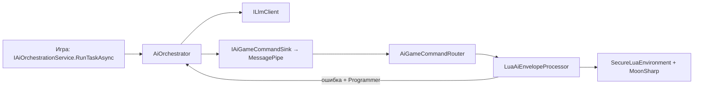

# Руководство разработчика CoreAI (шаблон)

Документ для тех, кто **подключает ядро к своей игре** или **расширяет репозиторий**. Нормативные контракты и дорожная карта — в **[DGF_SPEC.md](DGF_SPEC.md)**; здесь — практическая карта кода и типичные задачи.

---

## 1. С чего начать (порядок чтения)

**С нуля за 10 минут:** [QUICK_START.md](QUICK_START.md) → сцена RogueliteArena, LLM, F9. **Оглавление всех Docs:** [DOCS_INDEX.md](DOCS_INDEX.md).

| Шаг | Документ / место | Зачем |
|-----|------------------|--------|
| 0 | [QUICK_START.md](QUICK_START.md), [../../_exampleGame/Docs/UNITY_SETUP.md](../../_exampleGame/Docs/UNITY_SETUP.md) | Быстрый старт и пошаговая настройка Example Game в Unity |
| 1 | [DGF_SPEC.md](DGF_SPEC.md) §1–5, §8–9 (**§9.4** — главный поток Unity после LLM) | Цели ядра, LLM/stub, Lua, потоки |
| 2 | [AI_AGENT_ROLES.md](AI_AGENT_ROLES.md) | Роли агентов, placement, выбор модели |
| 3 | [LLMUNITY_SETUP_AND_MODELS.md](LLMUNITY_SETUP_AND_MODELS.md) | LLMUnity, LM Studio / OpenAI HTTP, PlayMode-тесты, Lua-пайплайн |
| 4 | [../README.md](../README.md) (хост **`CoreAiUnity`**) | Сборки, папки, DI, промпты, MessagePipe |
| 5 | [GameTemplateGuides/INDEX.md](GameTemplateGuides/INDEX.md) | Короткие рецепты под тайтл |
| 6 | [../../_exampleGame/README.md](../../_exampleGame/README.md) | Пример игры и точки входа |

---

## 2. Сборки и границы ответственности

**Принцип:** **`CoreAI.Core`** — переносимый **C#** без реализации под конкретный движок; **`CoreAI.Source`** — слой **Unity** (DI, сцена, LLM-адаптеры). Нормативно зафиксировано в **[DGF_SPEC §3.0](DGF_SPEC.md)**.

| Сборка | Папка | Ограничение |
|--------|-------|-------------|
| **CoreAI.Core** | `Assets/CoreAI/Runtime/Core/` | **Без Unity** (`noEngineReferences`). Контракты ИИ, оркестратор, очередь **`QueuedAiOrchestrator`**, снимок сессии, песочница MoonSharp, парсинг Lua, процессор конверта. |
| **CoreAI.Source** | `Assets/CoreAiUnity/Runtime/Source/` | Unity: VContainer, MessagePipe, маршрутизация LLM (**`RoutingLlmClient`**, **`LlmRoutingManifest`**), LLMUnity/OpenAI HTTP, логирование, роутер команд, биндинги Lua (`report` / `add`). Пакет **`com.nexoider.coreaiunity`**. |
| **CoreAI.Tests** | `Assets/CoreAiUnity/Tests/EditMode/` | EditMode NUnit, без Play Mode. |
| **CoreAI.PlayModeTests** | `Assets/CoreAiUnity/Tests/PlayMode/` | Play Mode (оркестратор, опционально LM Studio через env). |
| **CoreAI.ExampleGame** | `Assets/_exampleGame/` | Демо-арена; зависит от Source. |

**Проверка:** компиляция — `dotnet build` по сгенерированным `*.csproj` (Unity/Rider) или сборка из IDE; **NUnit EditMode / Play Mode** — в **Unity Test Runner** (`Window → General → Test Runner`). Источник истины для сценариев с `UnityEngine` и тестовыми ассетами — Test Runner, а не «голый» `dotnet test` без Unity.

**Правило:** игровая логика тайтла не должна «протекать» в Core без необходимости. Новые **игровые** API для Lua — через реализацию **`IGameLuaRuntimeBindings`** в Source (или в сборке игры), а не правки песочницы в обход whitelist.

---

## 2.1 Дефолтное поведение (из коробки) и точки настройки

Шаблон задуман так, чтобы **по умолчанию работал “разумно”**, но при необходимости позволял точечную настройку без переписывания ядра.

### Что работает “из коробки”

- **DI + MessagePipe + лог**: `CoreAILifetimeScope` регистрирует `IGameLogger`, брокер `ApplyAiGameCommand`, `IAiGameCommandSink`.
- **Оркестрация**: `IAiOrchestrationService` по умолчанию — `QueuedAiOrchestrator` вокруг `AiOrchestrator`.
- **Lua‑конвейер**: `AiGameCommandRouter` переносит обработку на main thread и запускает `LuaAiEnvelopeProcessor`.
- **Лимиты Lua**: `LuaExecutionGuard` ограничивает wall‑clock и “шаги” (best‑effort).
- **Prompts**: цепочка system/user по манифесту → Resources → встроенный fallback.
- **Версии Programmer (Lua + data overlays)**: в Unity‑слое по умолчанию сохраняются на диск (File* store).
- **World Commands**: Lua API `coreai_world_*` публикует команды мира в шину, выполнение — на main thread (см. [WORLD_COMMANDS.md](WORLD_COMMANDS.md)).

### Что настраивается в инспекторе `CoreAILifetimeScope`

- **LLM backend**: `OpenAiHttpLlmSettings` (OpenAI‑compatible HTTP) и `LlmRoutingManifest` (маршрутизация по ролям).
- **Промпты**: `AgentPromptsManifest` (переопределения system/user и кастомные роли).
- **Логи**: `GameLogSettingsAsset` (фильтр по фичам и уровню).
- **World Commands**: `World Prefab Registry` (whitelist префабов для спавна).

Рекомендация для тайтла: держать настройки в 1‑2 ScriptableObject‑ассетах и версионировать их в git (без секретов).

### 2.2 Логирование: `IGameLogger`, теги/фичи и внешние библиотеки (Serilog и т.п.)

- **В ядре CoreAI** используйте **`IGameLogger`** и **`GameLogFeature`** — это встроенные «теги» подсистем и фильтр по уровню через **`GameLogSettingsAsset`** (аналог структурированных категорий без отдельного NuGet). Вывод в консоль Unity идёт через **`FilteringGameLogger` → `UnityGameLogSink`**; не разбрасывайте **`Debug.Log`** по бизнес-коду.
- **Serilog / NLog / Microsoft.Extensions.Logging** в Unity подключают отдельно, если нужен вывод в файлы, Seq, Elasticsearch и т.д. Для кода **ядра** они не требуются: достаточно реализовать свой **`IGameLogger`** или заменить sink, чтобы дублировать записи в Serilog, не смешивая два стиля логирования в одном слое.
- **Фильтрация в консоли Unity:** по префиксу сообщения (категория из **`GameLogFeature`**), по **`TraceId`** в цепочке оркестратора/команд (см. README хоста), плюс настройки минимального уровня в ассете логов.
- **Editor** (меню, setup без DI): **`CoreAIEditorLog`** — единая точка сообщений редактора.

---

## 3. Поток данных (как всё связано)

Упрощённая схема рантайма:

1. **Игра** вызывает **`IAiOrchestrationService.RunTaskAsync(AiTaskRequest)`** (роль, hint, **`Priority`**, **`CancellationScope`**, опционально поля ремонта Lua и **`TraceId`**).
2. Реализация по умолчанию — **`QueuedAiOrchestrator`** (лимит параллелизма, приоритет, отмена предыдущей задачи с тем же **`CancellationScope`**) вокруг **`AiOrchestrator`**. **`AiOrchestrator`** назначает **`TraceId`**, собирает промпты, вызывает **`ILlmClient.CompleteAsync`**; при **`IRoleStructuredResponsePolicy`** для роли возможен **один** повтор с подсказкой **`structured_retry:`** в user/hint. Затем публикуется **`ApplyAiGameCommand`** (**`AiEnvelope`**, **`TraceId`**, …). Метрики — **`IAiOrchestrationMetrics`** (лог при **`GameLogFeature.Metrics`**).
3. В DI **`ILlmClient`** — **`LoggingLlmClientDecorator`** вокруг **`RoutingLlmClient`** (или legacy один клиент): внутри — **`OpenAiChatLlmClient`** / **`MeaiLlmUnityClient`** / **`StubLlmClient`** по **`LlmRoutingManifest`** и роли. Лог **`GameLogFeature.Llm`** (`LLM ▶` / `LLM ◀` / `LLM ⏱`), строка бэкенда **`RoutingLlmClient→OpenAiHttp`** и т.п. Для «это stub?» — **`LoggingLlmClientDecorator.Unwrap(client)`**.
4. Подписчик **`AiGameCommandRouter`** получает **`ApplyAiGameCommand`** из MessagePipe и **переносит обработку на главный поток Unity** (`UniTask.SwitchToMainThread`), затем вызывает **`LuaAiEnvelopeProcessor.Process`**: из текста извлекается Lua код, выполняется в песочнице с API из **`IGameLuaRuntimeBindings`**; в лог **`[MessagePipe]`** попадает **`traceId`** той же задачи.
5. При успехе / ошибке публикуются **`LuaExecutionSucceeded`** / **`LuaExecutionFailed`** ( **`TraceId`** сохраняется). Для роли **Programmer** при ошибке оркестратор вызывается повторно с контекстом ремонта и тем же **`TraceId`** (до **3 попыток** по умолчанию, настраивается через **`CoreAISettings.MaxLuaRepairGenerations`**).

**Важно:** геймплейные системы могут подписываться на **`ApplyAiGameCommand`** и реагировать на типы команд; не парсить сырой текст LLM вне общего конвейера, если хотите единообразия. Подробнее логи и таймаут: **[LLMUNITY_SETUP_AND_MODELS.md](LLMUNITY_SETUP_AND_MODELS.md)** §1 (блок про CoreAI) и таймаут.

**Unity — главный поток (кратко):** после **`QueuedAiOrchestrator`** продолжение async часто выполняется **не** на main thread; **`Publish`** из оркестратора может прийти с пула. Любой код с **`UnityEngine`**, **`FindObjectsByType`**, сценой и UI — только на главном потоке **или** после явного маршалинга. Шаблон делает маршалинг в **`AiGameCommandRouter`**; свои подписчики на MessagePipe должны повторять тот же принцип. Нормативно и с чеклистом: **[DGF_SPEC.md](DGF_SPEC.md) §9.4**.

---

## 4. LLM: два бэкенда

| Режим | Где настраивается | Когда выбирается |
|--------|-------------------|------------------|
| **LLMUnity** (`LLMAgent` на сцене) | Инспектор **LLM** / **LLMAgent** | По умолчанию, если HTTP выключен: фактический клиент — **`MeaiLlmUnityClient`**, в контейнере обёрнут в **`LoggingLlmClientDecorator`**. См. [LLMUNITY_SETUP_AND_MODELS.md](LLMUNITY_SETUP_AND_MODELS.md). |
| **OpenAI-compatible HTTP** | Asset **CoreAI → LLM → OpenAI-compatible HTTP**, поле на **`CoreAILifetimeScope`** | **`OpenAiHttpLlmSettings.UseOpenAiCompatibleHttp`** — тогда внутри декоратора реализация — **`OpenAiChatLlmClient`**. |

Символ **`COREAI_NO_LLM`**: в контейнере остаётся цепочка с **`StubLlmClient`** / HTTP при необходимости — детали в DGF_SPEC §5.2.

**Наблюдаемость:** **`GameLogFeature.Llm`** (запросы LLM); **`GameLogFeature.Metrics`** (метрики оркестратора, не входит в **`AllBuiltIn`** — включите вручную в ассете). Старые **Game Log Settings** без бита **Llm** дополняются при **`OnValidate`**. Фильтр по **`traceId`** связывает **`LLM ▶/◀`** и **`ApplyAiGameCommand`**.

---

## 5. Промпты и роли

- **Цепочка системного промпта:** манифест (опционально) → **`Resources/AgentPrompts/System/<RoleId>.txt`** → встроенный fallback (**`BuiltInAgentSystemPromptTexts`**).
- **Встроенные роли:** см. **`BuiltInAgentRoleIds`** и тесты **`AgentRolesAndPromptsTests`**.
- **Кастомные агенты:** используйте **`AgentBuilder`** для создания новых агентов с уникальными инструментами. См. [AGENT_BUILDER.md](AGENT_BUILDER.md).
- **User payload:** по умолчанию — JSON вида `{"telemetry":{...},"hint":"..."}` из **`GameSessionSnapshot.Telemetry`**; при ремонте Lua добавляются поля **`lua_repair_generation`**, **`lua_error`**, **`fix_this_lua`** (**`AiPromptComposer`**).
- **Память агента (опционально):** агент сохраняет память через **MEAI tool calling**:
  - `{"name": "memory", "arguments": {"action": "write", "content": "..."}}` — перезаписать
  - `{"name": "memory", "arguments": {"action": "append", "content": "..."}}` — дописать
  - `{"name": "memory", "arguments": {"action": "clear"}}` — очистить

  По умолчанию память **выключена у всех ролей**, кроме **Creator** (см. `AgentMemoryPolicy`). В рантайме Unity память хранится в `Application.persistentDataPath/CoreAI/AgentMemory/<RoleId>.json`.

---

## 6. Lua для агента Programmer

- Парсинг: **`AiLuaPayloadParser`** (markdown → JSON **`ExecuteLua`**).
- Исполнение: **`SecureLuaEnvironment`**, **`LuaExecutionGuard`**, **`LuaApiRegistry`**.
- Лимиты: `LuaExecutionGuard` включает best-effort ограничение **wall-clock** и **шагов** (см. `InstructionLimitDebugger`), чтобы бесконечные циклы Lua не могли зависнуть навсегда.
- Дефолтные игровые вызовы в шаблоне: **`LoggingLuaRuntimeBindings`** — **`report(string)`**, **`add(a,b)`**.
- Расширение: зарегистрируйте свою реализацию **`IGameLuaRuntimeBindings`** в **`CoreAILifetimeScope`** (вместо или поверх дефолтной — по политике проекта; избегайте дублирования интерфейса в контейнере без явной замены).
- Управление миром (рантайм): встроенная фича **World Commands** добавляет Lua‑API `coreai_world_*` и выполняет команды на главном потоке Unity через MessagePipe. См. **[WORLD_COMMANDS.md](WORLD_COMMANDS.md)**.

### 6.1 Персистенция версий Lua и data overlay (платформы, перезапуск)

Это **отдельное** файловое хранение CoreAI под `Application.persistentDataPath` (через `File.WriteAllText` / чтение при создании store), **не** Neo SaveProvider и не общий игровой сейв тайтла.

| Что | Путь по умолчанию |
|-----|-------------------|
| Версии Lua Programmer | `persistentDataPath/CoreAI/LuaScriptVersions/lua_script_versions.json` |
| Data overlays | `persistentDataPath/CoreAI/DataOverlayVersions/data_overlays.json` |

- **После перезапуска игры** при старте контейнера store снова читает JSON: восстанавливаются **текущий** текст (`current`) и **история** ревизий; оркестратор/Lua используют уже загруженное состояние.
- **Android / iOS / Desktop** — обычная запись в каталог приложения; данные сохраняются между сеансами, пока пользователь не удалит приложение или не очистит «данные приложения».
- **WebGL** — `persistentDataPath` в Unity мапится на хранилище браузера (IndexedDB и т.п.): между сессиями обычно работает, но пользователь может очистить данные сайта; возможны ограничения квоты — уточняйте по [документации Unity](https://docs.unity3d.com/) для вашей версии под WebGL.
- Для **синхронизации с облаком / одним сейвом игры** нужна отдельная интеграция (копирование файлов, свой провайдер или зеркалирование после `RecordSuccessfulExecution`).

---

## 7. Тесты

| Сборка | Запуск | Что проверяет |
|--------|--------|----------------|
| **CoreAI.Tests** | Test Runner → EditMode | Промпты, stub LLM, песочница Lua, парсер конверта, **`LuaAiEnvelopeProcessor`**, композер repair, **`LuaProgrammerPipelineEndToEndEditModeTests`** (оркестратор → конверт → Lua → ошибка → повтор Programmer → успех). |
| **CoreAI.PlayModeTests** | Test Runner → PlayMode | Оркестратор по всем ролям; опционально реальный HTTP (переменные **`COREAI_OPENAI_TEST_*`** — см. LLMUNITY doc). |

Рекомендация: перед PR прогонять **EditMode**; PlayMode — при изменениях DI/сцены или HTTP-клиента.

---

## 8. Пример игры (`_exampleGame`)

- Сцена **`RogueliteArena`** (см. Build Settings): **`CompositionRoot`** с **`CoreAILifetimeScope`**, **`ExampleRogueliteEntry`** (арена + хоткеи).
- **F9** — задача **Programmer** (демо Lua + `report`), компонент **`CoreAiLuaHotkey`**.
- Дочерний **`LifetimeScope`** примера: **`RogueliteArenaLifetimeScope`** — заготовка под фичи игры с **Parent** = ядро.

Подробности: [../../_exampleGame/README.md](../../_exampleGame/README.md).

---

## 9. Типичные задачи разработчика

| Задача | Куда смотреть / что делать |
|--------|----------------------------|
| Новая роль агента | Константа или строковый id; промпт в Resources или манифесте; при необходимости тест в **`AgentRolesAndPromptsTests`**. |
| Новый тип команды ИИ | Расширить обработку **`ApplyAiGameCommand.CommandTypeId`** (новый подписчик или ветка в игре); не смешивать с сырым текстом LLM без парсера. |
| Новые функции для Lua от LLM | Реализовать **`IGameLuaRuntimeBindings`**; регистрация делегатов в **`LuaApiRegistry`** (whitelist). |
| Управление миром из Lua | Использовать **World Commands** (`coreai_world_*`), настроить `CoreAiPrefabRegistryAsset` и назначить в `CoreAILifetimeScope`. См. **[WORLD_COMMANDS.md](WORLD_COMMANDS.md)**. |
| Смена модели / облако | [LLMUNITY_SETUP_AND_MODELS.md](LLMUNITY_SETUP_AND_MODELS.md); для продакшена не коммить API-ключи. |
| Мультиплеер | DGF_SPEC, **AI_AGENT_ROLES** (placement); авторитет LLM на хосте — ответственность игры. |

---

## 9.1 Где CoreAI обычно “сложный” и как упростить пайплайн (рекомендации)

Ниже — практические “узкие места” при интеграции и способы сделать CoreAI более автоматичным, но настраиваемым.

### 1) Сборка сцены и ассетов “по умолчанию”

**Проблема:** легко забыть настроить `CoreAILifetimeScope` (LLM backend, промпты, лог‑настройки, реестр префабов мира).

**Упростить:**
- Добавить Editor‑меню “CoreAI → Setup → Create Default Assets”:
  - `GameLogSettingsAsset` (с включенным `Llm` и нужными фичами)
  - `OpenAiHttpLlmSettings` (пустой шаблон)
  - `AgentPromptsManifest` (опционально)
  - `CoreAiPrefabRegistryAsset` (пустой whitelist)
- Добавить “CoreAI → Setup → Validate Scene” (проверка: есть `CoreAILifetimeScope`, корректные ссылки, предупреждения).

### 2) Дефолтный выбор LLM backend и деградация в stub

**Проблема:** «почему молчит модель?» — потому что `LLMAgent` не найден или HTTP не включен, а ядро ушло в stub.

**Упростить:**
- В логах старта писать явное резюме: backend=stub/llmunity/http, почему выбран.
- В UI/дашборде показывать текущий backend и `traceId` последних запросов.

### 3) Main thread vs background thread (Unity)

**Проблема:** команды могут приходить с пула потоков.

**Упростить:**
- Канонизировать одну точку “apply to Unity” (как сейчас `AiGameCommandRouter`) и запрещать прямую обработку из `ISubscriber<T>` без маршалинга.
- Добавить небольшой util/шаблон `MainThreadCommandQueue` для проектов без UniTask.

### 4) Lua безопасность и предсказуемость

**Проблема:** бесконечные циклы, расширение API, ошибки в Lua.

**Упростить:**
- Держать Lua API в виде **малых фич** (Versioning, World Commands, game‑bindings) и документировать каждую.
- По умолчанию включать лимиты (`LuaExecutionGuard`) и логировать превышение лимитов как отдельный сигнал.

### 5) Версионирование “скрипты + конфиги”

**Проблема:** Programmer меняет и код, и данные; нужен быстрый rollback.

**Упростить:**
- Стабильные ключи (usecase id / overlay key) и единый UI “Versions” в дашборде (показ original/current/history + reset).
- “Reset All” для аварийного восстановления.

### 6) Повторяемый CI/QA

**Проблема:** PlayMode тесты могут зависеть от модели/сети.

**Упростить:**
- Для CI: дефолт `COREAI_NO_LLM` или stub‑профиль, обязательный EditMode прогон.
- Для “integration” ветки: отдельный ручной job с env для HTTP и ограничением времени.

---

## 10. Чеклист PR

- **EditMode:** `CoreAI.Tests` без ошибок (промпты, Lua, парсеры, процессор конверта).
- **PlayMode:** при изменениях `CoreAILifetimeScope`, сцен, `OpenAiChatLlmClient` или PlayMode-тестов — прогнать `CoreAI.PlayModeTests`.
- **Секреты:** не коммитить API-ключи, `.env` с ключами, локальные пути к моделям с персональными данными; для CI использовать переменные окружения (см. [LLMUNITY_SETUP_AND_MODELS.md](LLMUNITY_SETUP_AND_MODELS.md)).
- **Документация:** если меняется контракт или поток (§3 DGF / DI), обновить **DGF_SPEC** и при необходимости этот гайд в том же PR.

---

## 11. Версионирование документов

Крупные изменения контрактов фиксируйте в **DGF_SPEC** (версия в шапке). **DEVELOPER_GUIDE** описывает текущую карту кода; при расхождении с кодом приоритет у репозитория — обновите гайд в том же PR.

**Версия этого гайда:** 1.3 (апрель 2026) — TraceId, декоратор LLM, таймаут запроса, логи Llm/MessagePipe, Unwrap(stub).
