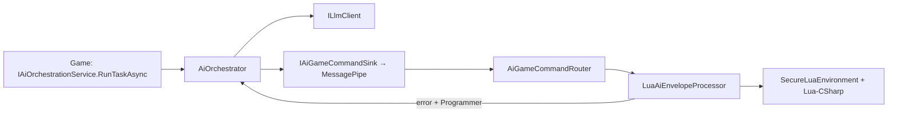

# CoreAI Developer Guide (template)

For teams who **wire the core into their own game** or **extend this repository**. Normative contracts and the roadmap live in **[DGF_SPEC.md](DGF_SPEC.md)**; this document is a practical map of the codebase and common tasks.

CoreAI 7.0 uses endpoint/profile/role separation for runtime LLM routing. Prefer
`ILlmEndpointRegistry` plus `AgentBuilder.WithLlmProfile(...)` over mutating one global backend. Legacy
`CoreAiBackend.Apply*` remains available as the `legacy/default` compatibility path.

Runtime routing is deliberately not a singleton-provider design. A project may persist zero, one, or many
endpoint descriptors and independently assign profiles to built-in or custom agent roles. **Automatic**
routing means “no per-request override”: request profile, agent default, role assignment, route default, and
legacy fallback keep their normal precedence. `Active` endpoints accept new work; `KeepWarm` endpoints may
stay initialized without being routable.

The Unity registry persists endpoint descriptors, profiles, and role assignments under persistent data, but
never session API keys. Passing `null` as the update key preserves the in-memory credential; passing `""`
clears it. A `SecretReference` is resolved by `ILlmEndpointSecretProvider` during activation (the default
uses the reference as an environment-variable name). External HTTP activation prefers a successful
`GET {BaseUrl}/models`; `404`/`405` falls back to a minimal `POST {BaseUrl}/chat/completions` probe, while
authentication, missing-route, server, and network failures remain failures. LLMUnity has no `/v1/models`: activation waits for native startup, then verifies that
`POST /v1/chat/completions` accepts a connection (`401`/`403` remain authentication failures). Use separate
named `LLMAgent` objects and unique ports for parallel local endpoints; same-host model/port mutation is
rejected so an active generation is never torn down beneath in-flight requests.

The HTTP readiness boundary is portable. `CoreAI.Core` defines `ILlmEndpointReadinessProbe`, its request,
result, and status policy, and provides `HttpClientOpenAiReadinessProbe` for ordinary .NET hosts.
CoreAiUnity registers `UnityWebRequestOpenAiReadinessProbe` for players and WebGL and injects it into both
runtime endpoint activation and normal LLMUnity autostart. Native `LLMAgent` lookup, `LLM.WaitUntilReady()`,
ownership leases, and llama.cpp unload remain Unity-only.

---

## 1. Where to start (reading order)

**From zero in ~10 minutes:** [QUICK_START.md](QUICK_START.md) → RogueliteArena scene, LLM, F9. **Index of all Docs:** [DOCS_INDEX.md](DOCS_INDEX.md).

| Step | Document / location | Why |
|-----|------------------|--------|
| 0 | [QUICK_START.md](QUICK_START.md), [../../_exampleGame/Docs/UNITY_SETUP.md](../../_exampleGame/Docs/UNITY_SETUP.md) | Quick start and step-by-step Example Game setup in Unity |
| 1 | [DGF_SPEC.md](DGF_SPEC.md) §1–5, §8–9 (**§9.4** — main Unity flow after LLM) | Core goals, LLM/stub, Lua, threading |
| 2 | [AI_AGENT_ROLES.md](AI_AGENT_ROLES.md) | Agent roles, placement, model selection |
| 3 | [LLMUNITY_SETUP_AND_MODELS.md](LLMUNITY_SETUP_AND_MODELS.md) | LLMUnity, LM Studio / OpenAI HTTP, Play Mode tests, Lua pipeline |
| 4 | [../README.md](../README.md) (host **`CoreAiUnity`**) | Builds, folders, DI, prompts, MessagePipe |
| 5 | [GameTemplateGuides/INDEX.md](GameTemplateGuides/INDEX.md) | Short recipes for your title |
| 6 | [../../_exampleGame/README.md](../../_exampleGame/README.md) | Example game and entry points |

---

## 2. Assemblies and responsibility boundaries

**Principle:** **`CoreAI.Core`** is portable **C#** with no engine-specific implementation; **`CoreAI.Source`** is the **Unity** layer (DI, scene, LLM adapters). Normatively fixed in **[DGF_SPEC §3.0](DGF_SPEC.md)**.

| Assembly | Folder | Constraint |
|--------|-------|-------------|
| **CoreAI.Core** | `Assets/CoreAI/Runtime/Core/` | **No Unity** (`noEngineReferences`). AI contracts, orchestrator, queue, session snapshot, LLM policy, memory, tools, and portable extension points. Lua VM/sandbox implementations live in **CoreAI.Mods**, not Core. |
| **CoreAI.Source** | `Assets/CoreAiUnity/Runtime/Source/` | Unity: VContainer, MessagePipe, LLM routing (**`RoutingLlmClient`**, **`LlmRoutingManifest`**), LLMUnity/OpenAI HTTP, logging, command router, Lua bindings (`report` / `add`). Unity-side adapters: **`MessagePipeToolCallEventPublisher`**, **`CoreAiToolExecutionNotifier`**. Package **`com.neoxider.coreaiunity`**. |
| **CoreAI.Tests** | `Assets/CoreAiUnity/Tests/EditMode/` | Edit Mode NUnit (**includes `UnityMainThreadLlmAsyncMarshalerEditModeTests`**, **v1.5.14** — Edit Mode deadlock regression). |
| **CoreAI.Tests.PlayMode.FastNoLlm** | `Assets/CoreAiUnity/Tests/PlayMode/FastNoLlm/` | Fast Play Mode: stubs, orchestrator smoke, UITK/chat panel, Lua (**no loaded model / no HTTP LLM dependency** where avoidable). |
| **CoreAI.Tests.PlayMode.LlmVerification** | `Assets/CoreAiUnity/Tests/PlayMode/LlmVerification/` | Live-model probes (**Ignore** without backend/env). |
| **CoreAI.Tests.PlayMode.Scenarios** | `Assets/CoreAiUnity/Tests/PlayMode/Scenarios/` | Long multi-step game scenarios (crafting workflows, merchants). Supports DLLs **`CoreAI.Tests.PlayMode.Shared`** + **`CoreAI.Tests.PlayMode.LlmInfra`**. |
| **CoreAI.ExampleGame** | `Assets/_exampleGame/` | Demo arena; depends on Source. |

**Verification:** compile with `dotnet build` on generated `*.csproj` (Unity/Rider) or build from the IDE; **NUnit Edit Mode / Play Mode** — in **Unity Test Runner** (`Window → General → Test Runner`). The source of truth for scenarios involving `UnityEngine` and test assets is Test Runner, not bare `dotnet test` without Unity.

**Rule:** title gameplay logic should not “leak” into Core unless necessary. New **game** APIs for Lua go through **`IGameLuaRuntimeBindings`** / **`GameLuaBindingsExtensibility`** in Source (or in the game assembly), not by editing the sandbox outside the whitelist. Guide: [LUA_BEST_PRACTICES.md](../../CoreAI/Docs/LUA_BEST_PRACTICES.md).

---

## 2.1 Default behavior (out of the box) and tuning points

The template is meant to **work sensibly by default**, while still allowing targeted tuning without rewriting the core.

### What works out of the box

- **DI + MessagePipe + log:** `CoreAILifetimeScope` registers `IGameLogger`, `ApplyAiGameCommand` broker, `IAiGameCommandSink`.
- **Orchestration:** default `IAiOrchestrationService` is `QueuedAiOrchestrator` around `AiOrchestrator`.
- **Lua pipeline:** `AiGameCommandRouter` marshals handling to the main thread and runs `LuaAiEnvelopeProcessor`.
- **Lua limits:** `LuaExecutionGuard` caps wall-clock and “steps” (best-effort).
- **Prompts:** system/user chain from manifest → Resources → built-in fallback.
- **Programmer versions (Lua + data overlays):** in the Unity layer they are persisted to disk by default (File* store).
- **World Commands:** Lua API `coreai_world_*` publishes world commands to the bus; execution runs on the main thread (see [WORLD_COMMANDS.md](WORLD_COMMANDS.md)).
- **WebGL / IL2CPP:** `CoreServicesInstaller` registers **`IAiGameCommandSink`** with an explicit factory (`MessagePipeAiCommandSink`), not `Register<MessagePipeAiCommandSink>().As<…>()`, so VContainer does not depend on constructor metadata analysis (avoids `Type does not found injectable constructor` in player builds). The Unity package includes **`link.xml`** preserving `MessagePipeAiCommandSink`. EditMode coverage: **`CoreServicesInstallerEditModeTests`**.

### What you configure on `CoreAILifetimeScope`

- **LLM backend:** `OpenAiHttpLlmSettings` (OpenAI-compatible HTTP) and `LlmRoutingManifest` (per-role routing).
- **Prompts:** `AgentPromptsManifest` (system/user overrides and custom roles).
- **Logs:** `GameLogSettingsAsset` (feature and level filter).
- **World Commands:** `World Prefab Registry` (spawn prefab whitelist).

Recommendation for a title: keep settings in one or two ScriptableObject assets and version them in git (no secrets).

### 2.2 Logging: `IGameLogger`, tags/features, and external libraries (Serilog, etc.)

- **In the CoreAI core** use **`IGameLogger`** and **`GameLogFeature`** — built-in subsystem “tags” and level filtering via **`GameLogSettingsAsset`** (structured categories without a separate NuGet). Unity console output goes through **`FilteringGameLogger` → `UnityGameLogSink`**; avoid scattering **`Debug.Log`** across business code.
- **Serilog / NLog / Microsoft.Extensions.Logging** in Unity are wired separately if you need files, Seq, Elasticsearch, etc. They are **not** required for **core** code: implement your own **`IGameLogger`** or replace the sink (**`IGameLogSink`**) to mirror into Serilog without mixing two logging styles in one layer.
- **Changing the filter while the game runs:** **`GameLogFilter`** (static, thread-safe, works in a player).
  `GameLogFilter.MinimumLevel = GameLogLevel.Debug`, `GameLogFilter.EnabledFeatures = GameLogFeature.Llm | GameLogFeature.Metrics`,
  `GameLogFilter.SetFeatureEnabled(GameLogFeature.Llm, false)`, `GameLogFilter.Snapshot()`, `GameLogFilter.ResetToAuthored()`.
  Prefixes can also be changed independently: set `GameLogFilter.IncludeCoreAiPrefix` and
  `GameLogFilter.IncludeFeaturePrefix`, or use the two omission checkboxes on `GameLogSettingsAsset` when
  an application logging facade already identifies the message. Both default to `true` for compatibility.
  **`CoreAILifetimeScope`** copies **`GameLogSettingsAsset`** into that filter while building the container and registers the
  copy as **`IGameLogSettings`**, so the scoped logger **and** **`GameLoggerUnscopedFallback`** obey the same live rules and the
  **`.asset`** is never mutated at runtime. Without an assigned asset the scope warns **once** and falls back to every category
  at level **Info** (**`GameLogDefaults`**).
- **Filtering in the Unity console:** by message prefix (category from **`GameLogFeature`**), by **`TraceId`** in the orchestrator/command chain (see host README), plus minimum level in the log asset.
- **Editor** (menus, setup without DI): **`CoreAIEditorLog`** — single entry point for editor messages.

---

## 3. Data flow (how everything connects)

Simplified runtime diagram:


```mermaid
flowchart LR
  Game["Game: IAiOrchestrationService.RunTaskAsync"]
  Orch["AiOrchestrator"]
  LLM["ILlmClient"]
  Sink["IAiGameCommandSink → MessagePipe"]
  Router["AiGameCommandRouter"]
  LuaP["LuaAiEnvelopeProcessor"]
  Lua["SecureLuaEnvironment + Lua-CSharp"]
  Game --> Orch
  Orch --> LLM
  Orch --> Sink
  Sink --> Router
  Router --> LuaP
  LuaP --> Lua
  LuaP -->|"error + Programmer"| Orch
```

1. The **game** calls **`IAiOrchestrationService.RunTaskAsync(AiTaskRequest)`** (role, hint, **`Priority`**, **`CancellationScope`**, optional Lua repair fields, **`TraceId`**).
2. The default implementation is **`QueuedAiOrchestrator`** (concurrency limit, priority, canceling the previous task with the same **`CancellationScope` within the current `AgentMemoryScope`**) around **`AiOrchestrator`**. **`AiOrchestrator`** assigns **`TraceId`**, assembles prompts, asks **`IConversationContextManager`** to prepare long chat history, then obtains a completion — **streaming by default** (drives **`ILlmClient.CompleteStreamingAsync`** and collapses the stream to a result when **`ICoreAISettings.EnableStreaming`** is on, the same execute-as-you-stream tool path as chat), falling back to **`ILlmClient.CompleteAsync`** only when streaming is off; with **`IRoleStructuredResponsePolicy`** for a role, **one** retry is allowed with a **`structured_retry:`** hint in user/hint. Then **`ApplyAiGameCommand`** is published (**`AiEnvelope`**, **`TraceId`**, …). Metrics — **`IAiOrchestrationMetrics`** (log under **`GameLogFeature.Metrics`**).
3. In DI (composed by **`LlmPipelineInstaller`** as `Timeout( Logging( RetryingStreaming( routed ) ) )`), **`ILlmClient`** is **`TimeoutLlmClientDecorator`** → **`LoggingLlmClientDecorator`** → **`RetryingStreamingLlmClientDecorator`** around **`RoutingLlmClient`** (or a legacy single client): inside — **`OpenAiChatLlmClient`** / **`MeaiLlmUnityClient`** / **`StubLlmClient`** per **`LlmRoutingManifest`** and role. Log **`GameLogFeature.Llm`** (`LLM ▶` / `LLM ◀` / `LLM ⏱`), backend line **`RoutingLlmClient→OpenAiHttp`**, etc. For “is this stub?” — **`LoggingLlmClientDecorator.Unwrap(client)`**.
4. Subscriber **`AiGameCommandRouter`** receives **`ApplyAiGameCommand`** from MessagePipe and **marshals handling to the Unity main thread** (`UniTask.SwitchToMainThread`), then calls **`LuaAiEnvelopeProcessor.Process`**: Lua is extracted from text, executed in the sandbox with API from **`IGameLuaRuntimeBindings`**; **`[MessagePipe]`** logs include the same task **`traceId`**.
5. On success / failure, **`LuaExecutionSucceeded`** / **`LuaExecutionFailed`** are published (**`TraceId`** preserved). For the **Programmer** role on error, the orchestrator is invoked again with repair context and the same **`TraceId`** (up to **3 attempts** by default, configurable via **`CoreAISettings.MaxLuaRepairRetries`**).

**Important:** gameplay systems may subscribe to **`ApplyAiGameCommand`** and react to command types; do not parse raw LLM text outside the shared pipeline if you want consistency. For logs and timeout details, see **[LLMUNITY_SETUP_AND_MODELS.md](LLMUNITY_SETUP_AND_MODELS.md)** §1 (CoreAI block) and timeout.

**Unity main thread (short):** after **`QueuedAiOrchestrator`**, async continuations often run **not** on the main thread; **`Publish`** from the orchestrator may arrive from the thread pool. Any code using **`UnityEngine`**, **`FindObjectsByType`**, scene, or UI — only on the main thread **or** after explicit marshaling. The template marshals in **`AiGameCommandRouter`**; your own MessagePipe subscribers should follow the same rule. Normative text and checklist: **[DGF_SPEC.md](DGF_SPEC.md) §9.4**.

---

### 3.1 Queue semantics

`QueuedAiOrchestrator` is the default `IAiOrchestrationService` wrapper. It provides:

- **Concurrency cap:** `AiOrchestrationQueueOptions.MaxConcurrent` limits total in-flight work across non-streaming and streaming tasks.
- **Priority:** higher `AiTaskRequest.Priority` runs first. Equal priority is FIFO.
- **Shared sync/stream priority:** `RunTaskAsync` and `RunStreamingAsync` use one effective priority order; a high-priority stream is not blocked behind a lower-priority non-stream task.
- **Latest-wins scopes:** when a new task has the same non-empty `CancellationScope` and the same current `AgentMemoryScope`, older active and pending work for that identity partition is cancelled immediately. Two students using the same role do not cross-cancel.
- **Enqueue-time identity snapshot:** each admitted sync or streaming work item captures its immutable `AgentMemoryScope` before entering the queue. Execution, cancellation teardown, and `RecordUnstartedTurn` use that captured scope even if a mutable host provider has already switched to another student. Do not use a global mutable student id as an implicit substitute for setting the provider before each enqueue.
- **Explicit stop:** `CancelTasks(scope)` and `CoreAi.StopAgent(scope)` cancel that logical scope only in each matching role's current tenant/user/session/topic partition; the scope does not have to equal the role id. When the caller already knows the concrete role, `IScopedAiTaskCancellation.CancelTasks(scope, roleId)` is the explicit single-role capability.
- **External cancellation:** a caller `CancellationToken` cancels pending work before it starts, so callers do not wait for a free LLM slot just to observe cancellation.

Beginner rule: set `CancellationScope = roleId` for UI/chat-style “only latest request matters” flows.
Advanced rule: use stable domain scopes (`arena_wave_plan`, `npc:merchant:dialogue`) and priority bands
for predictable gameplay scheduling.

### 3.2 Long Context Management

Chat history is not sent blindly forever. When `AgentMemoryPolicy.RoleMemoryConfig.WithChatHistory` is enabled, `AiOrchestrator` loads recent stored chat and passes it to `IConversationContextManager`.

The default `DeterministicConversationContextManager` uses the role `ContextTokens` budget (and the portable token budget when enabled). Fresh turns remain in `LlmCompletionRequest.ChatHistory`; older turns are compacted into a `## Conversation Summary` system-role tail message in that history, never into the cacheable first system prompt. Summaries are stored in `IConversationSummaryStore`: **`RegisterCorePortable`** wires **`InMemoryConversationSummaryStore`** by default (accumulation for the process); Unity’s **`CoreAILifetimeScope`** overrides with **`FileConversationSummaryStore`** for disk persistence. This compaction is deterministic and does not spend another LLM request.

Production projects can replace `IConversationContextManager` with an implementation that calls a backend summarizer, stores summaries per user/session/topic, or applies stricter privacy rules. Keep the output short and factual because it becomes part of every later request.

### 3.3 Tool Call Observability

Tool calls are awaited by `ToolExecutionPolicy.ExecuteSingleAsync` (portable, `CoreAI.Core`), including async `AIFunction` implementations. The policy publishes tool lifecycle events through the **`IToolCallEventPublisher`** abstraction:

| Event | When |
|-------|------|
| `LlmToolCallStarted` | Immediately before `AIFunction.InvokeAsync` |
| `LlmToolCallCompleted` | After successful invocation |
| `LlmToolCallFailed` | After failed invocation, exception, or missing tool |

In Unity, `MessagePipeToolCallEventPublisher` bridges these calls to `GlobalMessagePipe`. Non-Unity hosts can supply their own implementation or use `NullToolCallEventPublisher`.

Additionally, `IToolExecutionNotifier.NotifyToolExecuted` fires after each successful tool execution — in Unity this delegates to `CoreAi.NotifyToolExecuted` via `CoreAiToolExecutionNotifier`.

Both streaming and non-streaming paths in `MeaiLlmClient` create `ToolExecutionPolicy` with the same adapters, ensuring **identical event sequences** regardless of execution path. Within one LLM turn, tool calls run in **bounded parallel** on both paths, capped by `ICoreAISettings.MaxParallelToolCalls` (default 4; `1` = strictly sequential). Mutating built-ins (`memory`, `manage_mods`, `manage_skills`, `world_command`, `component_command`, `execute_lua`, `call_skill_tool`) are serialized relative to each other; streamed mutations wait until turn completion so replay can be rejected before side effects; result order is preserved.

Each event exposes `Info: LlmToolCallInfo` with `TraceId`, `RoleId`, provider `CallId`, `ToolName`, and sanitized `ArgumentsJson`. Use `Info.CallId` when correlating start/completed/failed logs, especially when providers issue several tool calls in one response.

**History trimming.** The shared **`ToolCallHistoryTrimmer`** drops the oldest resolved Assistant+Tool exchanges once tool-related messages exceed **`ICoreAISettings.MaxToolCallHistoryMessages`** (default **20**, **0** = unlimited). System and the original user message are always kept, and a unit is never split, so a surviving `tool`-role message is never orphaned from its `tool_calls` message. Since **4.19.0** this trimming applies to the **streaming** tool loop in `MeaiLlmClient` too, not just the non-streaming `SmartToolCallingChatClient` path — both loops now grow history identically.

**Final no-tools summary turn.** When a turn stops because the roundtrip cap or the max-consecutive-tool-errors guard was hit, both loops give the model **one** final tools-disabled roundtrip ("Tool budget exhausted. Do not call any more tools. Summarize in plain text …") instead of returning empty or canned text. This runs at most once per turn.

**Duplicate/echo handling.** Only a **cross-turn echo** — a call whose combined signature was already registered by an *earlier* turn in the same request — is suppressed as a duplicate. Identical calls issued together within one batch/turn (e.g. "spawn tree" three times in one response) all execute; there is no intra-batch duplicate guard. A signature is registered only **after** a batch/turn makes progress (at least one call did not fail), so a transiently-failed call can be retried with the exact same arguments instead of being silently swallowed as an echo.

**Consecutive-error abort.** `ToolExecutionPolicy.IsMaxErrorsReached` counts only batches/turns where **every** call failed; a partially-successful batch (e.g. 4 of 5 tool calls succeed) resets progress instead of counting toward the 3-strikes abort.

Unity hosts can use the public `CoreAi` facade instead of subscribing to MessagePipe directly:

```csharp
IDisposable sub = CoreAi.SubscribeToolCalls(record =>
{
    if (record.Status == "completed" && record.Info.ToolName == "execute_lua")
    {
        Debug.Log($"Tool completed for {record.Info.RoleId}: {record.Info.ArgumentsJson}");
    }
});

IReadOnlyList<LlmToolCallRecord> recent = CoreAi.GetToolCallHistorySnapshot();
CoreAi.ClearToolCallHistory();
sub.Dispose();
```

For single-event hooks, subscribe to `CoreAi.OnToolCallStarted`, `CoreAi.OnToolCallCompleted`, or `CoreAi.OnToolCallFailed`. `CoreAi.OnToolExecuted` remains available for the legacy successful-tool callback that exposes the argument dictionary and raw result object. Prefer `SubscribeToolCalls` in tests because it observes the real lifecycle event, not the final assistant text.

Custom `ILlmTool` implementations that should be exposed to MEAI must implement `IAIFunctionLlmTool` for a single `AIFunction`, or `IAIFunctionsLlmTool` for multiple functions. `MeaiLlmClient` intentionally does not use reflection duck typing for `CreateAIFunction()`; unknown `ILlmTool` implementations are skipped with a warning so binding behavior stays explicit and testable.

### 3.4 Logging Architecture (v1.5.0)

Since v1.5.0, CoreAI uses **two logging interfaces**:

| Interface | Package | Used by | Static access |
|-----------|---------|---------|---------------|
| **`ILog`** | `CoreAI.Core` (portable) | `ToolExecutionPolicy`, `SmartToolCallingChatClient`, `LoggingLlmClientDecorator` | `Log.Instance` |
| **`IGameLogger`** | `CoreAI.Source` (Unity) | `MeaiLlmClient`, `RoutingLlmClient`, Unity-side infrastructure | DI-injected |

In production, `CoreServicesInstaller` registers `UnityLog : ILog` and sets `Log.Instance` to that adapter. Both interfaces write to the same Unity console.

**Key rule for tool-call diagnostics**: the `[ToolCall]` per-call diagnostic line is written by `ToolExecutionPolicy` via `ILog` (`Log.Instance`), **not** `IGameLogger`. If a PlayMode test uses a `SpyLogger : IGameLogger` to capture log lines, it must **also** implement `ILog` and set `Log.Instance = spy` before invoking the pipeline, otherwise `[ToolCall]` lines are silently dropped to `NullLog`.

```csharp
// PlayMode test pattern:
private sealed class SpyLogger : IGameLogger, ILog { ... }

[TearDown] public void TearDown() => Log.Instance = NullLog.Instance;

// In test body:
var spy = new SpyLogger();
Log.Instance = spy;
```

**Never assert a CoreAI `ILog` message with `LogAssert.Expect`.** Whether an `ILog` line reaches the
Unity console depends on two pieces of process-wide state that any earlier test in the run may have
changed: `Log.Instance` (a `NullLog` swallows everything) and the live `GameLogFilter` mask/level. A
`LogAssert.Expect` over such a line therefore passes or fails by test order, not by behaviour. Register
an explicit recorder in the container under test and assert against it instead — see
`RecordingLog` in `CoreAI.Mods.Tests` and its use in `RbxWorldHostDiWiringEditModeTests`:

```csharp
// EditMode test pattern:
builder.RegisterInstance<ILog>(_log); // RecordingLog, not the ambient Log.Instance
...
Assert.IsTrue(_log.HasError("RbxWorldHost NOT resolved"));
```

### 3.5 Prompt Layers (what the model actually sees)

The first provider system prompt is **not** the literal string you pass to `AgentBuilder.WithSystemPrompt`.
CoreAI composes a byte-stable, role-wide prefix from four layers:

| Layer | Source | Configured by | Purpose |
|------|--------|---------------|---------|
| **1 — Universal Prefix** | `ICoreAISettings.UniversalSystemPromptPrefix` (default: 4 baseline rules) | `CoreAISettingsAsset` Inspector → **General → Universal Prompt Prefix** | Project-wide guard rails that apply to every role (style, safety, output format). |
| **2 — Role base prompt** | `AgentPromptsManifest` ScriptableObject **OR** `Resources/Prompts/{RoleId}.txt` **OR** built-in fallback string for `BuiltInAgentRoleIds` | `AgentPromptsManifest` asset | Stable per-role instructions (Creator, Programmer, PlainChat, SmartChat, Merchant, etc.). |
| **3 — Builder additional role prompt** | `AgentBuilder.WithSystemPrompt(...)` text stored in `AgentMemoryPolicy` | Code | Stable refinement of this registered role/NPC. |
| **4 — Full role tool contract** | All tools registered for the role, rendered in canonical name/schema order | `AgentBuilder.WithTool(...)`, skills, built-ins | Stable role capability definitions shared across requests. |

**Shared-prefix order:** `Layer 1 + Layer 2 + Layer 3 + Layer 4`. Each layer is optional. The resulting
`LlmCompletionRequest.SystemPrompt` must stay byte-identical for every student using the same role/provider route.

All request/student-dependent content is later than that prefix when callers use the cache-safe request API.
`LlmCompletionRequest.ChatHistory` contains the conversation summary and recent transcript, followed by ordered
orchestration tail entries for:

1. `AiTaskRequest.RequestSystemInstructions` as `## Request System Instructions`;
2. canonical memory and pending memory updates;
3. `AllowedToolNames` / `ForcedToolMode` / `RequiredToolName` as
   `## Tool Availability (current request)`;
4. runtime/world state as `## World State`.

The transport appends the current `UserPayload` only after this tail. Native request `Tools` are still filtered to
the current turn; the tail explicitly forbids tools filtered out of the stable full role contract, preserving the
same enforcement for text-shaped backends. The current MEAI OpenAI-compatible adapter maps orchestration
`ChatRole.System` tail entries to provider-safe `ChatRole.User` messages headed `System context update:` because
some compatible templates reject a system role outside position zero. This preserves ordering and the stable
cache prefix, but does not claim provider system/developer authority for the volatile tail.

**Layer 3 write mode.** `WithSystemPrompt(...)` replaces the current builder-level Layer 3 fragment by default. This keeps factories and reconfiguration code from accidentally carrying stale role instructions forward. If several code-owned fragments must be combined deliberately, use `AppendSystemPrompt(...)` or `WithSystemPrompt(..., SystemPromptWriteMode.Append)`:

```csharp
new AgentBuilder("Teacher")
    .WithSystemPrompt("You are a teacher.")
    .AppendSystemPrompt("Use short examples for this lesson.")
    .Build();
```

**Skipping the universal prefix.** Roles that need a fully custom prompt (strict JSON parsers, validators) opt out per role:

```csharp
new AgentBuilder("JsonParser")
    .WithSystemPrompt("You are a strict JSON parser. Output JSON only.")
    .WithOverrideUniversalPrefix() // skips Layer 1 for this role
    .Build();
```

**Per-request prompt APIs.** `AiTaskRequest.SystemPrompt` keeps its legacy contract: it replaces the role base
prompt for that request and is included in the first provider system message. Existing integrations therefore do
not silently change behavior, but a per-student value there fragments the shared cache.

Use `AiTaskRequest.RequestSystemInstructions` for volatile current-turn or student guidance. It is emitted in the
ordered tail and does not replace or mutate the role prefix.

Cache reuse is scoped conceptually to a stable agent/role prompt version and provider route, never to a student.
Student memory/history/limits remain tail data. Routers may hold several physical warm copies on different
endpoints, so validate real savings with provider `cached_tokens` / `cache_write_tokens`; byte-identical prefixes
prove eligibility but cannot guarantee a hit. Identical instances of one role/persona share the same eligible
prefix across students; every unique persona/prompt version creates another prefix on each selected endpoint.

OpenAI-compatible provider fields are configured in code without reflection:

```csharp
OpenAiHttpOptions options = OpenAiHttpOptions.From(settings);
options.SetProviderBodyParameter("provider", new JObject
{
    ["order"] = new JArray("cloudflare/fp8"),
    ["allow_fallbacks"] = false
});
options.SetProviderBodyParameter("session_id", "coreai-teacher-v3");
```

The safe API recursively sorts object keys, preserves array order, rejects CoreAI-owned structural keys, and is
atomic. C# `null` removes a field; `JValue.CreateNull()` sends JSON `null`. OpenRouter `session_id` must be an
opaque application/agent cohort, never `studentId`, email, login, learner GUID, or other PII. A small fixed shard
set is appropriate only when deliberately designed for throughput. The exact `cloudflare/fp8` pin above makes
cache measurement reproducible but disables fallback; remove or redesign it for production availability.
The raw `ExtraBodyJson` property is retained as an advanced backwards-compatible escape hatch and can override
reserved fields, so prefer `SetProviderBodyParameter` in new code.

**How to inspect the actual final prompt.** Two options:

1. Toggle `Log LLM Input` on `CoreAISettingsAsset` (Inspector → Debug → Log LLM Input). The composed prompt is dumped to the console for every request.
2. Read `AgentTurnTrace.SystemPromptPreview` for the shared prefix. To inspect volatile tail ordering, capture
   `LlmCompletionRequest.ChatHistory` in an `ILlmClient` test double (see `PromptCacheLayeringEditModeTests`).

**Common confusion.** A frequent first-time issue is "I wrote *You are a pirate*, but the agent keeps mentioning rules I never wrote." That's Layer 1 leaking through. Either edit `UniversalSystemPromptPrefix` on the asset, or call `WithOverrideUniversalPrefix()` for that single role. Editing the prefix changes behavior for every agent that does not opt out — make that edit deliberately.

**Why these layers and not one big prompt?** They keep universal rules in one place, role catalogues reusable,
registered role customization beside the agent definition, and the expensive full tool contract shared across
students. The separate volatile tail prevents one student's memory or current lesson state from destroying cache
reuse for everyone else.

---

## 4. LLM: execution modes and routing

`LlmExecutionMode` is the public mode surface. One project can use a single global mode from `CoreAISettingsAsset`, or several modes at once through `LlmRoutingManifest` profiles.

| Mode | Runtime client path | When to use |
|--------|-------------------|-------------|
| **LocalModel** | `MeaiLlmUnityClient` via `LLMAgent` | Local/offline prototyping and shipped local models |
| **ClientOwnedApi** | `OpenAiChatLlmClient` | User/developer owns the provider key |
| **ClientLimited** | `ClientLimitedLlmClientDecorator` → `OpenAiChatLlmClient` | Local caps for demos or prototypes |
| **ServerManagedApi** | `ServerManagedLlmClient` pointed at a backend proxy | Production WebGL/multiplayer/school/SaaS deployment |
| **Offline** | `OfflineLlmClient` or `StubLlmClient` | Tests and builds without live model access. **Conversational** roles (chat, `Teacher`-style ids, NPC dialog) receive a single **Offline Custom Response** line from settings — never the full serialized `UserPayload`. **`SourceTag == "Chat"`** failures return a trimmed error string to the orchestrator caller instead of `null`. See **COREAI_SETTINGS.md** (Offline). |

**Runtime backend switching:** the static facade **`CoreAiBackend`** (`ApplyHttpApi` / `ApplyLlmUnity` / `ApplyOffline` / `ApplyAuto`, hot `SetModel` / `SetApiKey` / `SetApiBaseUrl`, `VerifyAsync` health probe, `OnBackendChanged`) switches the primary backend at runtime without restarting the scene, and the drop-in `CoreAiBackendPanel` prefab exposes it as an in-game settings UI. See **[RUNTIME_BACKEND_SWITCHING.md](RUNTIME_BACKEND_SWITCHING.md)** — including the caveat that only the legacy-fallback primary client is swapped; explicit `LlmRoutingManifest` profiles are not touched.

`RoutingLlmClient` resolves a role through `LlmClientRegistry`, annotates `LlmCompletionRequest.RoutingProfileId`, and publishes `LlmBackendSelected`, `LlmRequestStarted`, `LlmRequestCompleted`, and `LlmUsageReported` via MessagePipe. Diagnostics and UI code should subscribe to those messages instead of inspecting registry internals.

**Note (child `LifetimeScope`):** those events are published with `IPublisher<T>` from **`CoreAILifetimeScope`**. If your title uses a **child** scope and a **second** `RegisterMessagePipe()`, constructor-injected `ISubscriber<LlmRequestStarted>` (and related types) resolved **only** in the child may attach to a **different** broker graph, so you will see **no** LLM telemetry despite live completions. Use **`GlobalMessagePipe.GetSubscriber<T>()`** after the parent scope has built (same provider as `CoreServicesInstaller`’s `SetProvider`), or avoid a second `RegisterMessagePipe` and extend the parent pipe for game-only events.

**Note (PlayMode tests without a scene scope):** use **`CoreAi.SubscribeToolCalls`** for assertions whenever possible. It receives the same lifecycle events as MessagePipe and does not require a scene `CoreAILifetimeScope`. If a test specifically validates MessagePipe integration, call **`GlobalMessagePipeMinimalBootstrap.EnsureInitializedForLlmDiagnostics()`** (or use **`TestAgentSetup`**, which invokes it in **`Initialize`**) before subscribing to `GlobalMessagePipe.GetSubscriber<LlmToolCallCompleted>()`.

`ServerManagedApi` supports dynamic backend authorization:

```csharp
ServerManagedAuthorization.SetProvider(() => "Bearer " + authTokenStore.CurrentJwt);
```

Для динамической атрибуции usage без пересоздания клиента зарегистрируйте
`IRequestHeaderProvider` через `ServerManagedAuthorization.SetRequestHeaderProvider(...)`. `ServerManagedLlmClient`
снимает заголовки один раз на invocation `CompleteAsync` / `CompleteStreamingAsync`, поэтому внутренний HTTP/auth-retry,
внешний sync retry после retryable result/exception и streaming pre-commit retry не могут сменить lesson/cohort
в середине logical request. Следующий invocation берёт новое значение, даже
если host повторно использует тот же объект `LlmCompletionRequest`. Custom hook не может подменить
`Authorization`, `Content-Type`, `Idempotency-Key` и
`X-Request-Id`; backend всё равно обязан валидировать client-supplied значение. См.
[SERVER_MANAGED_PROTOCOL.md](../../CoreAI/Docs/SERVER_MANAGED_PROTOCOL.md).

Provider failures use `LlmErrorCode` on `LlmCompletionResult`, `LlmStreamChunk`, and `LlmRequestCompleted`, so callers can handle `QuotaExceeded`, `AuthExpired`, `RateLimited`, `BackendUnavailable`, and other stable categories without parsing error text.

### 4.1 Assistant text and reasoning contract (7.0.7+)

The public LLM result has two deliberately separate channels:

| Buffered completion | Streaming completion | Contract |
|---|---|---|
| `LlmCompletionResult.Content` | `LlmStreamChunk.Text` | The only visible assistant answer. Build UI text, commands, notes, and assistant chat history from this channel only. |
| `LlmCompletionResult.ReasoningContent` | `LlmStreamChunk.ReasoningText` | Ephemeral diagnostics from provider `reasoning_content` / `reasoning` / `reasoningContent` or inline `<think>` spans. Never merge into the visible answer. |

When provider content is empty and reasoning is non-empty, CoreAI preserves the reasoning field but does
not promote it. The buffered path reports `LlmErrorCode.EmptyResponse`; the streaming path can deliver
reasoning diagnostic chunks and then an `EmptyResponse` terminal chunk without visible text.

**Persistence boundary:** reasoning must never enter MemoryTool, `IAgentMemoryStore` chat history,
generated student/player notes, `ApplyAiGameCommand.JsonPayload`, `AgentTurnTrace.AssistantResponse`, or
any other automatic assistant record. Those paths consume only `Content` / accumulated `Text`. A host may
show reasoning in an explicitly diagnostic UI, but any durable diagnostic capture must be separate,
opt-in, redacted, and governed by its own retention policy.

For mixed routing, create profiles such as `player_server`, `analyzer_limited`, and `creator_local`, then map role ids to those profiles. A single request always resolves to one concrete backend, but the scene can keep multiple profiles active.

Symbol **`COREAI_LLM`** (manual positive opt-in, since v7.0.0): compiles provider-backed HTTP/MEAI and available LLMUnity client implementations, provider transports, and their focused tests. Portable orchestration/queueing, scripted and stub clients, chat contracts/UI, tool contracts, and the required Microsoft.Extensions.AI assemblies remain in Core without the symbol. Add or remove it via **CoreAI → Setup → Modules → LLM Providers** or **Project Settings → Player → Scripting Define Symbols**.

Symbol **`COREAI_HAS_LLMUNITY`** (automatic): defined via `versionDefines` in the asmdef when the `ai.undream.llm` package is installed. Code that depends on LLMUnity types (`MeaiLlmUnityClient`, `LLMAgent`, `LLMManager`) compiles **only** with this symbol. Users do not set it manually.

Symbol **`COREAI_LUA`** (manual positive opt-in, since v7.0.0): compiles the Lua (Lua-CSharp) runtime surfaces and Lua-dependent tests in. It is independent of `COREAI_LLM`: either module can compile alone, while both symbols enable the full runtime. Lua-CSharp ships bundled inside the CoreAI Mods package (`Assets/CoreAIMods/Plugins/Lua.dll` + `Lua.Annotations.dll`), so enabling Lua requires only the define, not another package install. Add or remove the define via **CoreAI → Setup → Modules → Lua (Lua-CSharp)** or **Project Settings → Player → Scripting Define Symbols**.

**LLMUnity defaults (Editor / desktop player, since v1.7.4):** when **`LocalModel`** / **`UseLlmUnity`** is on, **`ConfigurableLlmAgentProvider`** can **auto-create** a runtime **`LLM` + `LLMAgent`** from **`CoreAISettingsAsset`** if the scene has none (**`LlmUnityAutoCreateRuntimeHost`**, default **on**). **`GgufModelPath`** on the asset is applied to **`LLM.model`** before Model Manager fallback. **`LlmUnityAutostartLocalServer`** (default **on**) triggers a post-DI warm-up via **`LlmUnityAutostartEntryPoint`** (timeout: **`LlmUnityStartupTimeoutSeconds`**). WebGL and builds without LLMUnity keep the previous scene-based / stub paths. See [LLMUNITY_SETUP_AND_MODELS.md](LLMUNITY_SETUP_AND_MODELS.md). **Editor-time creation (since v5.0.3):** both `CoreAI/Setup/Create Chat Demo Scene` and `CoreAI/Setup/Create Bare Scene (advanced)` call the shared `CoreAIBuildMenu.NeedsLlmUnity` / `TryCreateLlmUnityObjects` and add `LLM` + `LLMAgent` to the generated scene up front when the settings need them, so the components are visible and configurable before the runtime fallback would ever kick in. **Standalone menu (since v5.0.4):** `CoreAI/Setup/Create LLMUnity Objects (LLM + LLMAgent)` calls the same `TryCreateLlmUnityObjects` directly on the current scene regardless of settings, for adding the host to an existing scene without recreating it. **Native tool-calling via local OpenAI server (since v5.0.8):** the LLMUnity backend now runs the model as its **built-in OpenAI-compatible server** (`llm.remote = true` + **`LlmUnityServerPort`**, default 13333, set **before** the service initializes) and CoreAI talks to it through the **native HTTP client** (`OpenAiChatLlmClient` over `LlmUnityServerHttpSettings`, `POST /v1/chat/completions`) — so LLMUnity gets real structured `tool_calls` + SSE streaming, exactly like LM Studio, with **no** external server to install. `LlmUnityAutostartEntryPoint` polls the endpoint until it accepts requests before declaring ready. The old prompt-injected text-parse client (`LlmUnityMeaiChatClient` / `MeaiLlmUnityClient`) was removed. The server exposes only `/v1/chat/completions` (no `/v1/models`), so the model name is passed explicitly.

**Observability:** **`GameLogFeature.Llm`** (LLM requests); **`GameLogFeature.Metrics`** (orchestrator metrics; part of **`AllBuiltIn`** / **`All`** since the logging fix — "all categories" really means all). Assets serialized before that fix are widened to the new **`AllBuiltIn`** once, keyed on the asset's version field, so a deliberate partial selection is never overwritten again. Filtering by **`traceId`** links **`LLM ▶/◀`** and **`ApplyAiGameCommand`**.

For streaming with tool-calling, `MeaiLlmClient.CompleteStreamingAsync` uses one cycle per MEAI step. Since **v1.7.3**, when tools are **declared** (`Tools` non-empty) and **`LlmCompletionRequest.BufferFullStreamingIterationWhenToolsDeclared`** is not **`true`**, the client uses a **hybrid JSON hold** (same idea as for unbound streaming): only the prefix that cannot be part of an incomplete text-shaped tool JSON is streamed live; the rest is held until extraction runs, so tool JSON does not leak into the chat. Native **`delta.tool_calls`** (Path 2) and text-shaped JSON (Path 1) both reconcile any held prefix with the cleaned assistant string and emit a **suffix** as **`LlmStreamChunk.Text`** when needed. Set **`BufferFullStreamingIterationWhenToolsDeclared = true`** only if a backend fragments deltas in a way that breaks hybrid hold.
By default, per-role streaming override is enabled for roles with tools (`AgentMode.ToolsAndChat` and `AgentMode.ToolsOnly`); for `AgentMode.ChatOnly` the standard fallback from settings remains.
`CoreAIGameEntryPoint` in the Unity layer is idempotent: repeated `Start()` does not reinitialize global `CoreAIAgent` and logs a warning on `LogTag.Composition`, guarding against accidental double composition of the scene container.

---

## 5. Prompts and roles

- **System prompt chain:** manifest (optional) → **`Resources/AgentPrompts/System/<RoleId>.txt`** → built-in fallback (**`BuiltInAgentSystemPromptTexts`**).
- **Built-in roles:** see **`BuiltInAgentRoleIds`** and **`AgentRolesAndPromptsTests`**. Since core **3.2.0**: typed **`RoleId`** struct (implicit `string` conversions, `RoleId.SmartChat` etc.) — prefer it over inline role-string literals.
- **Custom agents:** use **`AgentBuilder`** to create agents with unique tools. See [AGENT_BUILDER.md](../../CoreAI/Docs/AGENT_BUILDER.md).
- **User payload:** default JSON like `{"telemetry":{...},"hint":"..."}` from **`GameSessionSnapshot.Telemetry`**; Lua repair adds **`lua_repair_generation`**, **`lua_error`**, **`fix_this_lua`** (**`AiPromptComposer`**).
- **Runtime context:** register `IAiPromptContextProvider` implementations to build per-request context such as current quest, lesson slot, learner profile, or objective; the orchestrator emits it in the final system-role `## World State` tail message, never in the shared prefix.
- **Agent memory (optional):** the agent persists memory via **MEAI tool calling**:
  - `{"name": "memory", "arguments": {"action": "write", "content": "..."}}` — overwrite
  - `{"name": "memory", "arguments": {"action": "append", "content": "..."}}` — append
  - `{"name": "memory", "arguments": {"action": "clear"}}` — clear

  By default memory is **off for all roles** except **Creator** (see `AgentMemoryPolicy`). `CoreAILifetimeScope` uses `AgentMemoryPersistenceMode.Persistent` by default and stores unscoped legacy data under `Application.persistentDataPath/CoreAI/AgentMemory/<RoleId>.json`. A host that must leave no student conversation files calls `SetAgentMemoryPersistenceMode(AgentMemoryPersistenceMode.SessionOnly)` on the inactive scope before VContainer build; memory, flat chat, structured transcript and compacted summary then use process-only backing. For multi-user or session-scoped products, also supply an `IAgentMemoryScopeProvider` that returns tenant/user/session/topic for the current request. Every non-empty scope is persisted as `scope-v1-<full SHA-256>.json`; the same opaque key partitions file mutation locks, transcripts, summaries, chat history, and queue cancellation without placing raw ids in filenames/logs. The default provider returns `AgentMemoryScope.Empty`, preserving one role-only memory **and chat-history** key; that is safe only for a one-user process, disabled memory/history, or intentionally shared state. Scoped stores never auto-claim that shared legacy file: migrate a bare role explicitly into one chosen scope, then clear/archive the old role key. A multi-tenant server must never keep the empty default.

- **MEAI tools on Unity (`ToolInvocationMarshaler`):** since **v1.5.12**, `ToolExecutionPolicy` wraps MEAI **`AIFunction.InvokeAsync`** in **`ICoreAISettings.ToolInvocationMarshaler`**. The default **`CoreAISettingsAsset`** uses **`UnityMainThreadLlmAsyncMarshaler`** (**`UniTask.SwitchToMainThread`** in Player / packaged builds **only** — since **v1.5.14**, **Edit Mode `!Application.isPlaying`** skips the hop to avoid deadlock with **`Task.Wait`/`Result`** on the editor managed main thread) because **`SmartToolCallingChatClient`** still uses **`ConfigureAwait(false)`** for WebGL. With **`COREAI_LLM`** enabled, HTTP OpenAI traffic is handled by portable **`MeaiOpenAiChatClient`** (**`System.Net.Http.HttpClient`**) in **`CoreAI.Core`**.

---

## 5.1 MessagePipe extension points (beginner → pro)

CoreAI uses **MessagePipe** as the Unity-side integration bus. The default orchestrator flow is:

`AiOrchestrator` → `IAiGameCommandSink` → `MessagePipeAiCommandSink` → `IPublisher<ApplyAiGameCommand>` → `AiGameCommandRouter`

The important rule: **gameplay handling must run on the Unity main thread**. `AiGameCommandRouter`
already does `UniTask.SwitchToMainThread()` before processing Lua, world commands, logs, and
`CommandReceived`.

### Beginner path: subscribe after the safe router

For UI, tutorials, simple game reactions, or debugging, use:

```csharp
AiGameCommandRouter.CommandReceived += OnAiCommand;

private void OnAiCommand(ApplyAiGameCommand cmd)
{
    // Already on Unity main thread.
    Debug.Log(cmd.JsonPayload);
}
```

This is the easiest extension point: no direct DI or MessagePipe subscription is required, and it is safe
to touch Unity objects.

### Pro path: subscribe to MessagePipe directly

For larger systems, register your own `ISubscriber<ApplyAiGameCommand>` subscriber in the container.
This is useful for analytics, multiplayer replication, custom command routing, save integration, or
domain-specific systems.

If you subscribe directly to MessagePipe, **marshal your handler to the main thread** before touching
Unity APIs:

```csharp
_subscription = subscriber.Subscribe(cmd =>
{
    UniTask.Void(async () =>
    {
        await UniTask.SwitchToMainThread();
        // Safe Unity/GameObject work here.
    });
});
```

Direct MessagePipe subscribers may also run lightweight, thread-safe work without switching (for example
enqueueing telemetry), but Unity scene mutation, UI, `GameObject`, `Transform`, `Animator`, and most save/UI
integrations should use the main-thread path.

### Publishing commands

Prefer publishing through `IAiGameCommandSink` when you are inside CoreAI/agent code. Use
`IPublisher<ApplyAiGameCommand>` directly only in Unity integration code that is already part of the
MessagePipe composition. Keep payloads explicit (`CommandTypeId`, `TraceId`, `SourceRoleId`) so logs and
external subscribers can follow the agent work.

---

## 6. Lua for the Programmer agent

- Parsing: **`AiLuaPayloadParser`** (markdown → JSON **`ExecuteLua`**).
- Execution: **`SecureLuaEnvironment`**, **`LuaExecutionGuard`**, **`LuaApiRegistry`**.
- Limits: `LuaExecutionGuard` applies best-effort **wall-clock** and **step** caps (see `InstructionLimitDebugger`) so infinite Lua loops cannot hang forever.
- Default game calls in the template: **`LoggingLuaRuntimeBindings`** — **`report(string)`**, **`add(a,b)`**.
- Extension: register your **`IGameLuaRuntimeBindings`** in **`CoreAILifetimeScope`** (instead of or on top of the default — per project policy; avoid duplicating the interface in the container without an explicit replacement).
- World control (runtime): the built-in **World Commands** feature adds Lua API `coreai_world_*` and executes commands on the Unity main thread via MessagePipe. See **[WORLD_COMMANDS.md](WORLD_COMMANDS.md)**.

### 6.1 Lua version persistence and data overlay (platforms, restart)

This is **separate** CoreAI file storage under `Application.persistentDataPath` (via `File.WriteAllText` / read when creating the store), **not** Neo SaveProvider and not the title’s shared game save.

| What | Default path |
|-----|-------------------|
| Programmer Lua versions | `persistentDataPath/CoreAI/LuaScriptVersions/lua_script_versions.json` |
| Data overlays | `persistentDataPath/CoreAI/DataOverlayVersions/data_overlays.json` |

- **After restarting the game**, when the container starts the store reads JSON again: **current** text (`current`) and **revision history** are restored; orchestrator/Lua use the loaded state.
- **Android / iOS / Desktop** — normal writes to the app directory; data persists across sessions until the user uninstalls the app or clears “app data”.
- **WebGL** — в режиме `AgentMemoryPersistenceMode.Persistent` `persistentDataPath` maps to browser storage (IndexedDB / IDBFS): agent memory and chat JSON use **`FileAgentMemoryStore`** under **`CoreAILifetimeScope`** on the **player** too (**v1.6.19+**), with **`CoreAi_PersistFsSync`** after writes so data survives reload when **`Application.Quit`** does not run. Since **v1.7.2**, **`CoreAiPersistFs.jslib`** queues **`FS.syncfs`** so only one sync runs at a time (avoids concurrent sync warnings and related stalls). Conversation **summaries** for compaction stay **in-memory** on WebGL. `SessionOnly` keeps memory, chat, transcript and summary in memory and does not call file persistence. Users can clear site data; quota limits may apply — see [Unity documentation](https://docs.unity3d.com/) for your version under WebGL.
- **Sync with cloud / a single game save** needs a separate integration (copy files, custom provider, or mirroring after `RecordSuccessfulExecution`).

---

## 7. Tests

| Assembly | How to run | What it covers |
|--------|--------|----------------|
| **CoreAI.Tests** | Test Runner → Edit Mode | Prompts, stub LLM, Lua sandbox, envelope parser, **`LuaAiEnvelopeProcessor`**, repair composer, **`LuaProgrammerPipelineEndToEndEditModeTests`** (orchestrator → envelope → Lua → error → Programmer retry → success). |
| **PlayMode assemblies** (`CoreAI.Tests.PlayMode.*`) | Test Runner → Play Mode (**filter by assembly**) | **`FastNoLlm`** — quick stub coverage; **`LlmVerification`** — streaming/HTTP/tool/memory probes (env **`COREAI_OPENAI_TEST_*`** / LLMUNITY — see LLMUNITY doc); **`Scenarios`** — crafting / merchant narratives. Shared helpers: **`Shared`**, **`LlmInfra`**. |

Reasoning-isolation runtime regression: in Test Runner select **PlayMode** and filter by
`CoreAI.Tests.PlayMode.ReasoningIsolationPlayModeTests` (assembly
`CoreAI.Tests.PlayMode.FastNoLlm`). Its fake `IOpenAiHttpTransport` exercises the real provider adapter,
LLM adapter, orchestrator, chat service, consumer callback, and history boundary without a model, API key,
or network request.

Recommendation: run **Edit Mode** before a PR; Play Mode when DI/scene or the HTTP client changes.

Current Edit Mode checks for recent stability fixes:
- `CoreAIGameEntryPointEditModeTests` — single-init behavior for the CoreAI facade when the entry point starts twice.
- `MeaiLlmClientEditModeTests.CompleteStreamingAsync_ToolJsonWithVisiblePrefix_KeepsPrefixAndHidesJson` — tool-call JSON does not reach the UI; visible text is preserved.
- `MeaiLlmClientEditModeTests.CompleteStreamingAsync_TooManyToolIterations_ReturnsTerminalError` — streaming tool loop ends with a controlled error when the iteration limit is exceeded.

### Testing code that waits on a UniTask timer

**If the code under test resumes from `UniTask.Delay` or `CancelAfterSlim`, the test must yield editor
frames.** Those continuations run on the UniTask player loop, which in EditMode is driven by the editor
update; a plain `[Test] async Task` awaits without ever giving the editor a frame, so the timer never
fires. The test does not fail — it *hangs* until the runner kills it, minutes later, and because it
depends on what the rest of the run did it looks like flakiness rather than a mistake.

Use `[UnityTest]`, yield frames, and bound every wait so a stuck task is named instead of silent:

```csharp
[UnityTest]
[Timeout(30000)]
public IEnumerator DrainRemoval_DefersOwnedHostReleaseUntilTrackedRequestCompletes()
{
    ...
    yield return WaitForTask(registry.RemoveEndpointAsync("owned"), "drained endpoint removal");
}

private static IEnumerator WaitForTask(Task task, string what, float timeoutSeconds = 10f)
{
    float deadline = Time.realtimeSinceStartup + timeoutSeconds;
    while (!task.IsCompleted && Time.realtimeSinceStartup < deadline)
    {
        yield return null;                 // lets the editor loop tick, so UniTask timers fire
    }

    Assert.IsTrue(task.IsCompleted, $"{what} did not complete within {timeoutSeconds}s.");
    task.GetAwaiter().GetResult();         // rethrow faults exactly as await would
}
```

Live examples: `LlmEndpointRegistryPersistenceEditModeTests` (drain loop) and
`CoreAiChatServiceEditModeTests` (request timeouts, which additionally set `Time.timeScale = 0f` to
prove the deadline is real time, not game time).

---

## 8. Example game (`_exampleGame`)

- Scene **`RogueliteArena`** (see Build Settings): **`CompositionRoot`** with **`CoreAILifetimeScope`**, **`ExampleRogueliteEntry`** (arena + hotkeys).
- **F9** — **Programmer** task (demo Lua + `report`), **`CoreAiLuaHotkey`** component.
- Child **`LifetimeScope`** in the sample: **`RogueliteArenaLifetimeScope`** — stub for game features with **Parent** = core.

Details: [../../_exampleGame/README.md](../../_exampleGame/README.md).

---

## 9. Typical developer tasks

| Task | Where to look / what to do |
|--------|----------------------------|
| New agent role | Constant or string id; prompt in Resources or manifest; add a test in **`AgentRolesAndPromptsTests`** if needed. |
| New AI command type | Extend handling of **`ApplyAiGameCommand.CommandTypeId`** (new subscriber or branch in the game); do not mix with raw LLM text without a parser. |
| New Lua functions for the LLM | Implement **`IGameLuaRuntimeBindings`**; register delegates in **`LuaApiRegistry`** (whitelist). |
| World control from Lua | Use **World Commands** (`coreai_world_*`), configure `CoreAiPrefabRegistryAsset` and assign it on `CoreAILifetimeScope`. See **[WORLD_COMMANDS.md](WORLD_COMMANDS.md)**. |
| Change model / cloud | [LLMUNITY_SETUP_AND_MODELS.md](LLMUNITY_SETUP_AND_MODELS.md); do not commit API keys for production. |
| Multiplayer | DGF_SPEC, **AI_AGENT_ROLES** (placement); LLM authority on the host is the game’s responsibility. |

---

## 9.1 Agent control (Control API)

Use the static facade `CoreAI.Api.CoreAi` to manage current agent state (cancel tasks, clear memory, subscribe to tools).

### Stopping an agent (cancel tasks)

If an agent is generating for a long time or its task is no longer valid, you can programmatically cancel all its current and queued tasks in `QueuedAiOrchestrator`:

```csharp
// Stop generation for a specific role (uses CancellationScope = roleId)
CoreAi.StopAgent("Teacher");
```
*Also available directly on the orchestrator:* `_orchestrator.CancelTasks("Teacher")` for the stock `scope == roleId` path. For a domain scope, use `((IScopedAiTaskCancellation)_orchestrator).CancelTasks("npc:merchant:dialogue", "Merchant")`.

### Stopping from built-in Chat UI (`CoreAiChatPanel`)

While a reply is generating, the send button `coreai-chat-send` in `CoreAiChatPanel` automatically switches to **Stop** mode:

- visually turns red (`.coreai-chat-send-button-stop`);
- button label changes from `>` to `X`;
- tooltip: `Stop generation (Esc)`.

The user can interrupt generation:

- by clicking that button again;
- with the `Esc` key while the chat is focused.

In both cases the UI calls `CoreAi.StopAgent(roleId)` and cancels the active request token, which safely stops the current reply and related role tasks in `QueuedAiOrchestrator`.
Starting with `com.neoxider.coreaiunity` **0.25.6**, the button stays enabled during generation (stop control), busy state is set until the first `await`, and the UI reliably clears streaming/sending state after cancel.

#### Public busy contract — since 2.4.0

External code that gates work on chat-busy state (e.g. RedoSchool's `ChatExternalSubmitUnlock`) should subscribe to `CoreAiChatPanel.BusyStateChanged` and read `CoreAiChatPanel.IsBusy` instead of reflecting on the private `_isSending` / `_isStreaming` / `_isStopping` / `_isClearing` flags. The contract:

```csharp
public bool IsBusy { get; }                                  // _isSending || _isStreaming || _isStopping || _isClearing
public event Action<bool> BusyStateChanged;                  // UI thread, fires on transitions only
public event Action<int /*iteration*/, string /*lastTool*/> ToolRoundStarted;
public int CurrentTurnGeneration { get; }                    // monotonic, ++ at start of each turn
public void ResetBusyStateWithoutCancellation();             // unlock UI without cancelling HTTP or moving the turn generation
public bool AbandonCurrentTurn();                            // Unreleased — honestly gives up on the current turn (see below)
```

`ToolRoundStarted` fires before each LLM iteration inside a turn (after a tool result), so hosts can show "tool advance_lesson (2/3)" badges without observing the private streaming state machine.

**`ResetBusyStateWithoutCancellation()` vs `AbandonCurrentTurn()`:** the first only clears the busy flags and typing/streaming UI — the turn itself keeps running, and when it eventually finishes or fails it still owns the transcript. Use it when the turn is already finished by its own code path and only the UI needs a nudge. If your own watchdog is giving up on a turn that may still be in flight (e.g. a shorter host-side timeout than the package's HTTP timeout), call `AbandonCurrentTurn()` instead: it bumps `CurrentTurnGeneration` (so the in-flight turn's own completion/error handling recognises itself as stale and does not touch the transcript), cancels the active request the same way the Stop button does, and resets busy state for you. It returns `true` only if a turn was actually in flight, so you don't show a "no answer" message for nothing. This is what prevents a host's own timeout message from being followed by a second, redundant error bubble once the real request eventually fails.

**Stock chat template:** default floating size **~650×910** (see `CoreAiChatConfig` / `CoreAiChat.uss`), **vertical scrollbar flush** to the panel’s inner right edge, and optional **`coreai-long-request-hint`** (status under the typing row on long turns) — details in [README_CHAT.md](../Runtime/Source/Features/Chat/README_CHAT.md).

**Default assets are never created implicitly.** `CoreAIBuildMenu` no longer runs an `[InitializeOnLoadMethod]` bootstrap on editor load, so importing the package never writes into your `Assets/` — least of all a `Resources/CoreAISettings.asset` that would then ship inside your player. Create them explicitly with **`CoreAI/Settings`** (settings asset only) or **`CoreAI/Setup/Create Default Assets`** (settings + prompts + logging + permissions + routing + prefab registry); the scene wizards (`Create Chat Demo Scene`, `Create Bare Scene (advanced)`) call the same code path.

### Clearing context

Reset chat history (short-term context) and/or long-term agent memory (MemoryTool):

`clearChatHistory: true` очищает flat/structured turns и scoped compacted conversation summary. Поэтому старый
summary не может снова попасть в следующий prompt после визуальной очистки чата. Это одинаково для
`Persistent` и `SessionOnly` persistence policy.

```csharp
// Fully clear agent context (message history and memory)
CoreAi.ClearContext("Teacher");

// Clear only chat history (session context), leave agent memory intact
CoreAi.ClearContext("Teacher", clearChatHistory: true, clearLongTermMemory: false);

// Clear only long-term memory (facts, state), keep the current dialogue
CoreAi.ClearContext("Teacher", clearChatHistory: false, clearLongTermMemory: true);
```

### Subscribing to tool execution (`OnToolExecuted`)

For hooks (sounds, VFX, logging) you can subscribe to the global event for a successful tool call from the model (via MEAI):

```csharp
private void OnEnable()
{
    CoreAi.OnToolExecuted += HandleToolExecuted;
}

private void OnDisable()
{
    CoreAi.OnToolExecuted -= HandleToolExecuted;
}

private void HandleToolExecuted(string roleId, string toolName, IDictionary<string, object?>? args, object? result)
{
    Debug.Log($"Agent {roleId} used tool {toolName}!");
    
    // Example: react to a specific tool
    if (toolName == "spawn_item" && args != null && args.TryGetValue("item_id", out var itemId))
    {
        AudioSystem.PlaySound($"spawn_{itemId}");
    }
}
```

The built-in **`CoreAiChatPanel`** can append one diagnostic row per tool call when **`CoreAiChatConfig.ShowToolCallsInChat`** is enabled (default **off**). Override **`CoreAiChatPanel.FormatToolExecutedForChat`** for custom text. The tool-call display and chat history are keyed to the **active** role, so switching agents (via the runtime agent dropdown or `EnableAgentSwitching()`) re-targets tool bubbles and reloads that role's transcript. The **Hub-embedded chat** forces `ShowToolCallsInChat` on (via runtime options) so tool progress is always visible there, independent of the shared chat config.

### Clearing chat from UI (`CoreAiChatPanel`)

The built-in chat panel header (`CoreAiChatPanel`) has a 🗑 button — on click it clears all messages from the UI and resets **short-term context** (chat history) for the agent. That is the default behavior.

You can control this in code:

```csharp
// Clear UI messages + chat history (default for 🗑)
chatPanel.ClearChat();

// Full clear: chat and long-term memory
chatPanel.ClearChat(clearChatHistory: true, clearLongTermMemory: true);

// Long-term memory only, keep the current dialogue in the UI
chatPanel.ClearChat(clearChatHistory: false, clearLongTermMemory: true);
```

---

## 9.2 Where CoreAI is often “heavy” and how to simplify the pipeline (recommendations)

Practical integration pain points and ways to keep CoreAI automatic but configurable.

### 1) Scene and default assets setup

**Problem:** easy to forget `CoreAILifetimeScope` (LLM backend, prompts, log settings, world prefab registry).

**Simplify:**
- Add an Editor menu “CoreAI → Setup → Create Default Assets”:
  - `GameLogSettingsAsset` (with `Llm` and needed features enabled)
  - `OpenAiHttpLlmSettings` (empty template)
  - `AgentPromptsManifest` (optional)
  - `CoreAiPrefabRegistryAsset` (empty whitelist)
- Add “CoreAI → Setup → Validate Scene” (checks: `CoreAILifetimeScope` present, references valid, warnings).
- Use **CoreAI → Delete All Persistent Saves...** (Editor only, **not** in Play Mode) to wipe **`Application.persistentDataPath/CoreAI`** — agent memory + persisted chat JSON, conversation summaries (desktop), Lua script versions, data overlays. Does **not** delete assets under `Assets/`.

### 2) Default LLM backend choice and stub fallback

**Problem:** “Why is the model silent?” — `LLMAgent` missing or HTTP off, and the core fell back to stub.

**Simplify:**
- Log an explicit summary at startup: backend=stub/llmunity/http and why.
- Show current backend and last request `traceId` in UI/dashboard.

### 3) Main thread vs background thread (Unity)

**Problem:** commands may arrive from the thread pool.

**Simplify:**
- Canonize one “apply to Unity” entry point (as with `AiGameCommandRouter`) and forbid handling directly from `ISubscriber<T>` without marshaling.
- Add a small util/template `MainThreadCommandQueue` for projects without UniTask.

### 4) Lua safety and predictability

**Problem:** infinite loops, API growth, Lua errors.

**Simplify:**
- Keep Lua API as **small features** (Versioning, World Commands, game bindings) and document each.
- Enable limits (`LuaExecutionGuard`) by default and log limit breaches as a distinct signal.

### 5) Versioning “scripts + configs”

**Problem:** Programmer changes both code and data; fast rollback matters.

**Simplify:**
- Stable keys (use case id / overlay key) and a single “Versions” UI in a dashboard (original/current/history + reset).
- “Reset All” for emergency recovery.

### 6) Repeatable CI/QA

**Problem:** Play Mode tests may depend on model/network.

**Simplify:**
- For CI: the no-symbol `core` configuration or a stub profile, plus mandatory Edit Mode runs for all four module combinations.
- For an “integration” branch: separate manual job with HTTP env and a time cap.
- For WebGL demo QA, build the exact demo-scene matrix into a fresh player and opt in to the
  external harness with `?coreai-external-driver=1`. The persistent
  `CoreAiChatExternalDriver` accepts
  `unityInstance.SendMessage('CoreAiChatExternalDriver', 'LoadScene', '<scene path or name>')` only
  for scenes present in that player. After every load, call `DumpUnsupportedShaders`; treat scenes
  omitted from the player as an evidence gap rather than inferring WebGL compatibility from Editor.
- The repository's `CoreAIG11WebGlBuild` entry point freezes all 15 first-party demo scenes into its
  WebGL QA player even though the normal product Build Settings intentionally keep only the three
  primary entry scenes. Update its ordered scene regression whenever the published demo inventory
  changes.
- The external driver is absent without the opt-in flag, rejects empty or non-build scene names,
  survives scene changes without duplicating itself, and logs both requested and completed scene
  identity. This makes the browser harness reusable without exposing a shipping navigation API.

---

## 10. PR checklist

- **Edit Mode:** `CoreAI.Tests` green (prompts, Lua, parsers, envelope processor).
- **Play Mode:** when changing `CoreAILifetimeScope`, scenes, `OpenAiChatLlmClient`, or Play Mode tests — run **`CoreAI.Tests.PlayMode.FastNoLlm`** (always quick), then selectively **`CoreAI.Tests.PlayMode.LlmVerification`** / **`Scenarios`** where your change touches live LLMs or workflows.
- **Secrets:** do not commit API keys, `.env` with keys, or local model paths with personal data; for CI use environment variables (see [LLMUNITY_SETUP_AND_MODELS.md](LLMUNITY_SETUP_AND_MODELS.md)).
- **Documentation:** if contracts or flow change (DGF §3 / DI), update **DGF_SPEC** and this guide in the same PR if needed.
- **UPM release (any change under `Assets/CoreAI` or `Assets/CoreAiUnity`):** bump **`version`** in [`../../CoreAI/package.json`](../../CoreAI/package.json) (`com.neoxider.coreai`) and [`../package.json`](../package.json) (`com.neoxider.coreaiunity`; dependency = core version); add entries in **[../../CoreAI/CHANGELOG.md](../../CoreAI/CHANGELOG.md)** and **[../CHANGELOG.md](../CHANGELOG.md)**; update docs for the affected feature (root **README.md**, [DOCS_INDEX](DOCS_INDEX.md), [README_CHAT](../Runtime/Source/Features/Chat/README_CHAT.md), [QUICK_START](QUICK_START.md), etc.); if public API changes, add tests as needed.

---

## 11. Document versioning

Record major contract changes in **DGF_SPEC** (version in the header). **DEVELOPER_GUIDE** describes the current code map; if it diverges from code, the repository wins — update the guide in the same PR.

**UPM sync:** the number in the README header and in **QUICK_START** should match the current **`package.json`**, or package consumers see a stale version.

**Version of this guide:** 7.19.0 (2026-09-05) — six-package topology; independent library/feature log-prefix controls; UI Toolkit UXML serialization via `[UxmlElement]` / `[UxmlAttribute]` (Unity 6000.0+, required by Unity 6.6); independent positive `COREAI_LLM` / `COREAI_LUA` opt-ins; provider-only meaning of `COREAI_LLM`; opaque multi-user persistence keys and enqueue-time scope snapshots for queue execution/cancellation; session-only persistence and current chat lifecycle contracts. Historical feature notes remain in both package changelogs.
