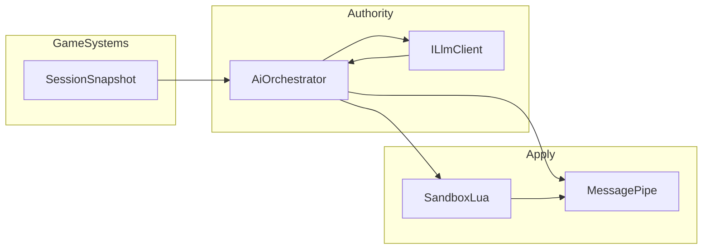

# CoreAI — Core SPEC (Dynamic Game Framework)

**Document version:** 0.21
**Repository:** CoreAI · **Author:** Neoxider (handle neoxider) — [github.com/NeoXider](https://github.com/NeoXider)
**UPM:** **`com.nexoider.coreai`** (`Assets/CoreAI`) — portable **`CoreAI.Core`** only: pure **C# without an engine** (`noEngineReferences`). **`com.nexoider.coreaiunity`** (`Assets/CoreAiUnity`) — **`CoreAI.Source`** (implementation for **Unity**), plus `Docs/`, `Tests/`, `Editor/`, `Resources/`, scene **`_mainCoreAI`**.
**Sample game:** `Assets/_exampleGame` (see also `Docs/ROGUELITE_PLAYBOOK.md` in the sample)
**Reference architecture (do not copy wholesale):** `D:\Git\GameDev-Last-War`
**AI role catalog (orchestration, placement, models):** [AI_AGENT_ROLES.md](AI_AGENT_ROLES.md)
**Developer practical guide (code map, Lua, tests):** [DEVELOPER_GUIDE.md](DEVELOPER_GUIDE.md)
**Quick start and Docs table of contents:** [QUICK_START.md](QUICK_START.md), [DOCS_INDEX.md](DOCS_INDEX.md) · **Example game in Unity:** [../../_exampleGame/Docs/UNITY_SETUP.md](../../_exampleGame/Docs/UNITY_SETUP.md)

---

## 1. Goals and non-goals

### 1.1 Goals

- A single **core** for games with **procedural and AI-driven** logic: rule changes, waves, modifiers, character effects.
- **One code path** for single-player and multiplayer: offline, the player is the local **authority** (host analogue).
- **Orchestration** of multiple model requests and scenarios: queue, priorities, timeouts, budget.
- **Safe execution** of optional code (Lua / MoonSharp) in a **sandbox** with whitelist and limits.
- **Application of AI decisions** only via explicit **commands and typed events** (primarily **MessagePipe**), without direct “text parsing” in gameplay systems.
- **Default “out of the box” pipeline:** a minimal scene and `CoreAILifetimeScope` shall bring up a working path (LLM/stub → orchestrator → MessagePipe → Lua sandbox → commands); the game may override specific points as needed (prompts, LLM routing, whitelist API, policies).

### 1.2 Non-goals (v1)

- Anti-cheat and client trust in competitive PvP — a separate discipline.
- A full copy of the Last-War stack (ECS, gRPC, PlayFab, etc.) — **layer and DI ideas** only where appropriate.
- A guarantee of “perfect” Lua security — practical **defense in depth**, not a mathematical proof.

---

## 2. Glossary

| Term | Meaning |
|------|---------|
| **Authority** | The node that may invoke the LLM, the orchestrator, and **fix** the final session rules (host or local solo). |
| **Session snapshot** | Minimal telemetry DTO for prompt/logic (wave, core HP, party composition, mode flags, etc.). |
| **Command / game event** | Typed message on the bus (MessagePipe) that game code handles deterministically. |
| **Use case (dynamic)** | Unit of behavior, possibly AI-generated: data (JSON) and/or a Lua fragment under whitelist. |
| **Sandbox** | Isolated MoonSharp `Script` + globals policy + limits + registered C# delegates. |
| **AI orchestrator** | Service that accepts **tasks** from the game, assigns priorities, and prevents parallel calls from blocking the main thread without policy. |
| **Agent role** | Logical request type: **Creator**, **Analyzer**, **Programmer** (Lua), **AINpc**, **CoreMechanicAI**, etc. — see [AI_AGENT_ROLES.md](AI_AGENT_ROLES.md). |
| **Placement** | Where the role runs: **HostAuthoritative**, **LocalPerClient**, **Hybrid** — set by game configuration, not hard-coded in the core. |

---

## 3. Current repository state (normative snapshot)

### 3.0 Boundary between CoreAI and CoreAIUnity (normative)

| Layer | Package / assembly | Contents |
|------|-------------------|----------|
| **Engine-agnostic core** | **`com.nexoider.coreai`** → **`CoreAI.Core`** (`Assets/CoreAI/Runtime/Core/`) | Pure **C#**: contracts (`ILlmClient`, orchestrator, task queue), **MoonSharp** sandbox, typed commands and extension points. **No** `UnityEngine`, **no** explicit implementation for Unity, Unreal, Godot, etc. — only portable logic and abstractions; binding to the “game world” is external via interface implementations and injection. |
| **Unity implementation** | **`com.nexoider.coreaiunity`** → **`CoreAI.Source`** (`Assets/CoreAiUnity/Runtime/Source/`) | Concrete **Unity** implementation: VContainer, MessagePipe, LLMUnity / OpenAI HTTP, `MonoBehaviour` (`CoreAILifetimeScope`, entry points), Unity console logging, file stores, main-thread marshaling, UI wiring. Depends on **`com.nexoider.coreai`**. |

**Invariant:** all code referencing **`UnityEngine`** and Unity scenario integration resides in **`CoreAI.Source`** / package **`coreaiunity`**; **`CoreAI.Core`** shall contain only portable .NET/C# (plus MoonSharp/VContainer per asmdef).

### 3.1 Packages (`Packages/manifest.json`)

- **VContainer**, **MessagePipe** + **MessagePipe.VContainer**
- **R3**, **UniTask**
- **MoonSharp** (`org.moonsharp.moonsharp`, UPM)
- **MCPForUnity** (`com.coplaydev.unity-mcp`) — editor automation; **mandatory** test execution path for agent/CI with Cursor — see **§11–12**.
- **LLM for Unity** ([LLMUnity](https://github.com/undreamai/LLMUnity), package `ai.undream.llm` in manifest) — local/remote inference (llama.cpp), `LLM` / `LLMAgent`, grammar/RAG per package documentation. The core still introduces **`ILlmClient`**; the **reference** implementation is a thin adapter over LLMUnity + **stub** mode (§5.2).

### 3.2 Assembly `CoreAI.Core` (`Assets/CoreAI/Runtime/Core/CoreAI.Core.asmdef`)

- `noEngineReferences: true`; references: **VContainer**, **MoonSharp.Interpreter** (UPM MoonSharp asmdef name).
- Portable logic: AI contracts, MVP orchestrator, Lua sandbox, session snapshot DTO.

### 3.3 Assembly `CoreAI.Source` (`Assets/CoreAiUnity/Runtime/Source/CoreAI.Source.asmdef`)

- References: **CoreAI.Core**, **VContainer**, **MessagePipe**, **MessagePipe.VContainer**, **undream.llmunity.Runtime** (LLMUnity).
- **R3**, **UniTask** — present in manifest; add to asmdef as code adopts them.

### 3.4 Composition and scene

- **`CoreAILifetimeScope`**: `RegisterCore()` — logger, MessagePipe, **`ApplyAiGameCommand`** broker, `IAiGameCommandSink`; **optionally** **`LlmRoutingManifest`** + **`LlmClientRegistry`** / **`ILlmRoutingController`**, else legacy **OpenAI HTTP** (`OpenAiHttpLlmSettings`) + LLMUnity; then **`ILlmClient`** as **`LoggingLlmClientDecorator`** around **`RoutingLlmClient`** (or directly **OpenAiChatLlmClient** / **MeaiLlmUnityClient** / **StubLlmClient** when routing is off; symbol **`COREAI_NO_LLM`** — no LLMUnity adapter). Decorator: log **`GameLogFeature.Llm`**, log backend **`RoutingLlmClient→…`**, **`TraceId`**, **timeout** (**Llm Request Timeout Seconds**, **0** = disabled). Before **`RegisterCorePortable()`**: **`AiOrchestrationQueueOptions`**, **`IAiOrchestrationMetrics`** (Null or **`LoggingAiOrchestrationMetrics`** when **`GameLogFeature.Metrics`**). **`RegisterCorePortable()`** — sandbox, **`LuaAiEnvelopeProcessor`**, **`AiOrchestrator`** + **`QueuedAiOrchestrator`** as **`IAiOrchestrationService`** (parallelism cap, **`AiTaskRequest.Priority`**, **`CancellationScope`**), **`IRoleStructuredResponsePolicy`** (default no-op), session snapshot, solo authority; **`IGameLuaRuntimeBindings`** / **`ILuaExecutionObserver`**. **`ApplyAiGameCommand`** carries **`TraceId`**; Lua repair preserves it on **`AiTaskRequest`**. Entry points: first **`AiGameCommandRouter`**, then **`CoreAIGameEntryPoint`**. Game feature scopes use **Parent** to this root.
- **`CoreAIGameEntryPoint`**: start + test orchestrator invocation (bootstrap).
- Core scene: **`Assets/CoreAiUnity/Scenes/_mainCoreAI.unity`** (editor display name may be `_mainCoreAI`; add to Build Settings as **startup** for template development if needed).
- **Game Log Settings** (optional): `Resources/GameLogSettings.asset` or a custom asset on scope.

---

## 4. Target module architecture (`Assets/CoreAI/Runtime/Core`, `Assets/CoreAiUnity/Runtime/Source`)

**Portable core (`Runtime/Core/`, assembly `CoreAI.Core`):** `Composition/`, `Authority/`, `Session/`, `Messaging/`, `Sandbox/`, and slices **`Features/<name>/`** — agent memory, prompts, orchestration/LLM contracts, Lua pipeline, script versioning and data overlay.

**Unity layer (`Assets/CoreAiUnity/Runtime/Source/`, assembly `CoreAI.Source`):** `Composition/` (DI, entry points) and **`Features/<name>/(Infrastructure|Presentation)/`** — log, LLM adapters, Lua/MessagePipe, manifest/Resources prompts, file stores, UI (dashboard, chat, scheduler).

| Area (example) | Responsibility |
|----------------|----------------|
| `Source/Composition/` | `CoreAILifetimeScope`, installers, subsystem registration |
| `Source/Features/Logging/Infrastructure/` | `IGameLogger`, sink, log settings |
| `Source/Features/Llm/Infrastructure/` | OpenAI HTTP, LLMUnity, routing, decorators |
| `Source/Features/Lua/Infrastructure/` | File-backed Lua/data overlay versions, aggregate bindings |
| `Source/Features/Messaging/Infrastructure/` | `ApplyAiGameCommand` → MessagePipe bridge, see §8 |
| `Source/Features/Prompts/Infrastructure/` | Manifest and Resources prompt providers |
| `Source/Features/Dashboard/Presentation/` | IMGUI dashboard, permissions asset |
| `Source/Features/PlayerChat/Presentation/` | In-game chat panel |
| `Source/Features/Scheduling/Presentation/` | Scheduled task triggers |

### 4.1 “Default behavior”

The template sets defaults:
- **LLM backend:** if HTTP is off and `LLMAgent` is missing — safe `StubLlmClient`.
- **Unity marshaling:** bus command handling is moved to the main thread in `AiGameCommandRouter`.
- **Lua sandbox:** whitelist API only, dangerous globals disabled, execution limits.
- **Persistence:** Programmer Lua versions and data overlay persist to disk in the Unity layer by default.

The game may, as needed:
- replace `ILlmClient` / enable `LlmRoutingManifest`
- replace/extend `IGameLuaRuntimeBindings`
- subscribe to `ApplyAiGameCommand` or `AiGameCommandRouter.CommandReceived` with its own logic

**Data flow (normative):**

1. The game publishes **facts** on the bus and/or updates the snapshot service.
2. **Only the authority** enqueues a task for the orchestrator (solo = local always yes).
3. The orchestrator calls the LLM when budget allows → receives a **structured** response.
4. Validation → conversion to **commands** → `IPublisher<T>.Publish` (or a specialized command service).
5. Optionally: a Lua use case runs in the sandbox; from Lua, **only** delegates leading to permitted commands/events are available.

### 4.1 Portable C# core without Unity (DLL / other engines)

**Permitted and useful as a roadmap** if scope is not inflated on early iterations. Idea: isolate **engine-agnostic** logic in a separate assembly (e.g. `CoreAI.Core` / `CoreAI.Portable`), target **.NET Standard 2.1** or **.NET 8** class library — no references to `UnityEngine`, no UPM-specific asmdef where an SDK-style `.csproj` is preferable.

**Suitable for the portable assembly (as refactoring proceeds):**

- Contracts and DTOs: session snapshot, commands, agent roles, validation results.
- **AI orchestrator** (queue, priorities, timeouts) — on abstractions only: `ILlmClient`, `IClock`, `ILog` (project interfaces, not `UnityEngine.Debug`).
- **MoonSharp sandbox** — interpreter **does not depend on Unity** (pure .NET); whitelist and globals policy live in **`CoreAI.Core`**; UPM reference `org.moonsharp.moonsharp` in `CoreAI.Core.asmdef` is **normal** for the template.
- **`ILlmClient`** implementations: HTTP to Ollama/OpenAI, stub (§5.2) — without Unity.
- A simplified **command bus** (`ICommandBus` / light pub-sub) if full **MessagePipe** is undesirable outside Unity; or a thin wrapper over the same pattern without Unity dependencies.

**What remains in the Unity layer (`CoreAI.Unity` / current `CoreAI.Source` + separate asmdef):**

- `LifetimeScope`, MonoBehaviour, scenes, `GameObject`, NGO, **LLMUnity** ([LLMUnity](https://github.com/undreamai/LLMUnity)), `StreamingAssets`, MCP editor integration.
- Adapters: `ILog` → `UnityGameLogSink`, MessagePipe ↔ portable event bridge as needed.

**Consumers of the portable DLL:** authority server without a Unity client, **Godot 4 (.NET)**, console tests, CI tools, another engine with hosted CLR. **Do not** expect “one DLL for all engines without recompilation” for native C++ — only where a compatible .NET runtime exists.

**Deferring on phase one is acceptable:** current `CoreAI.Source` may live in Unity until headless/another engine is required; then extract a folder/project and move types without `UnityEngine` in batches.

### 4.2 Portable assembly (`CoreAI.Core`) dependencies: minimum vs “same stack”

**Template recommendation:** in **`CoreAI.Core`**, **few** external packages where possible, but **VContainer is permitted deliberately** (consistent DI style with `CoreAI.Source`). The rest of the “Unity stack” (**MessagePipe**, **R3**, **UniTask**) defaults to **`CoreAI.Source`** + adapters to Core.

| Package | In `CoreAI.Core` | Comment |
|---------|------------------|---------|
| **VContainer** | **Yes (template decision)** | Convenience and uniform service registration. Add **`VContainer`** reference to `CoreAI.Core.asmdef` **if** the assembly compiles with **`noEngineReferences: true`** (API only, no `UnityEngine`). If the UPM VContainer package pulls Unity — do not falsely disable `noEngineReferences`: either move DI to Source only, or record in an ADR the variant with `Microsoft.Extensions.DependencyInjection` for headless. |
| **MessagePipe** (+ VContainer) | Default **no** | UPM layer pulls Unity; in Core — own **`ICommandBus`** / delegates / internal subscriber list; in Source — wrapper publishing to MessagePipe. |
| **R3** | Default **no** | UI/client reactivity closer to Unity; in Core — `event`, `IObservable` from Rx (if truly needed) or simple callbacks. Exception: if you choose **one** netstandard-compatible package for all hosts — record in an ADR. |
| **UniTask** | Default **no** | In Core — `Task` / `ValueTask`; in Unity layer — UniTask for PlayerLoop integration. |
| **MoonSharp** | **Yes** | Runs **without Unity** on .NET; sandbox and globals/whitelist policy in **`CoreAI.Core`**. In `CoreAI.Source` — calls from game loop/host only if needed. Assembly name in UPM: usually under `org.moonsharp.moonsharp` (verify in PackageCache on first asmdef reference). |
| **System.Text.Json** / **HttpClient** | Permitted | For `ILlmClient` HTTP and JSON parsing on BCL. |

**Why not pull everything into the portable assembly immediately:** each dependency implies versions, compatibility with **Godot / console / Linux server**, licenses, and size. A thinner Core simplifies **DLL extraction** and testing without the editor.

**Alternative “unified stack”:** if the non-Unity host target is **one** (e.g. ASP.NET only), you may explicitly record an **allowed set** (e.g. `Microsoft.Extensions.*` + MediatR) **instead of** duplicating MessagePipe — a separate decision, to be described in an ADR and not mixed with Unity UPM without bridges.

---

## 5. Networking and authority (policy)

- The **client is not treated as authoritative** for **global** AI outcomes (session rules, world, shared loot/craft in co-op): it shall not execute raw model output as truth for others.
- The **host** (or solo) is the **reference** for orchestration and for roles with **HostAuthoritative**; clients receive **replicated state** (NGO, etc.).
- **Not all roles must exist in the game:** only **AINpc**, only **CoreMechanicAI**, or any subset is permitted — see [AI_AGENT_ROLES.md](AI_AGENT_ROLES.md) §5–6.
- **Placement:** some roles (e.g. **CoreMechanicAI** or visual **AINpc**) may be **LocalPerClient** or **Hybrid** per developer decision; the core defines the **contract** for policy; the game chooses (co-op fairness vs local “flavor”).
- Telemetry for **Analyzer** and **Creator** in multiplayer shall by default be collected **on the authority**; local metrics that do not affect rules — per game policy.

### 5.1 Recommended network stack for the template (library choice)

**Default recommendation: Netcode for GameObjects (NGO)** — Unity package (`com.unity.netcode.gameobjects`), free, evolves with editor versions, fits **host / server + clients**. For CoreAI: **on the host** run the AI orchestrator and LLM; clients receive **agreed** `NetworkVariable` / RPC / custom messages with wave and rule parameters. Optionally later — **Unity Gaming Services** (Relay, Lobby) without changing the base authority model.

| Option | Pros for the template | Cons / when not to use |
|--------|----------------------|------------------------|
| **NGO** | Official Unity path, documentation, listen-server (host-player), predictable updates under LTS/Unity 6 | More ceremony than Mirror; some advanced scenarios via packages/UGS |
| **Mirror** | Open source, many tutorials, listen server out of the box, cloud not mandatory | Not an “official” Unity package; support and compatibility are community-driven |
| **Fish-Networking** | Strong performance and features, free core | Separate ecosystem; learning and migration from NGO differ |
| **Photon (Fusion / PUN2)** | Ready relay/cloud, convenient for quick internet multiplayer | **Not fully free** at scale; Photon pricing and cloud coupling; often excessive at start for “AI on host only” |
| **Photon Quantum** | Fixed-tick simulation | Separate paradigm (ECS-like), licensing; often heavy for first `_exampleGame` pass |

**Conclusion:** for **free**, **capable within Unity**, and aligned with “**host authority for AI**” — **NGO**. **Mirror** is a reasonable alternative if you deliberately avoid the Unity Multiplayer ecosystem. **Photon** makes sense when you need **managed relay/matchmaking** and accept limits/pricing, not as a “simple free NGO replacement.”

Core interfaces (`INetworkAuthority` / `IsServer` / `IsHost`) shall allow **substituting** transport if strictly necessary (e.g. tests or a Mirror-based project), but the **reference implementation** in the repository is **NGO**.

### 5.2 Builds without AI models (roadmap, HostAuthoritative)

When **all** LLM roles are concentrated on the **host**, the template shall eventually allow **a build variant without embedded models and without a mandatory LLM runtime** on the player machine:

- **Goals:** demo and test builds, CI without Ollama, smaller distribution, “host without GPU / without downloaded weights,” store policies “no network calls to LLM.”
- **Implementation direction (not a commitment of current code):**
  - DI registration of **`ILlmClient`** as a **stub** (`NullLlmClient` / `HeuristicLlmClient`) yielding **deterministic** or **tabular** responses per role (fallback from ScriptableObject / seed).
  - Optional compile symbol (**Scripting Define**) **`COREAI_NO_LLM`** — manual opt-out for **full** LLM disable (HTTP + LLMUnity). Symbol **`COREAI_HAS_LLMUNITY`** is set **automatically** via `versionDefines` in asmdef when package `ai.undream.llm` is present — code depending on LLMUnity types compiles only when present.
  - Orchestrator in “no LLM” mode **shall not fail:** tasks map to heuristics or are marked “skipped” with logging; **MessagePipe** and game logic remain operational.
  - NGO clients still receive **replicated state**; the only difference is that the **source** of decisions on the host is not a neural net but a stub/designer data.
- Fallback contract details shall follow `ILlmClient` in code; this subclause records a **template design requirement**.

---

## 6. AI orchestrator (requirements)

- Register **only roles enabled in the game** from the catalog [AI_AGENT_ROLES.md](AI_AGENT_ROLES.md); each task has `AgentRoleId` + **placement** + priority.
- **Task queue** with **priority** (configurable): e.g. CoreMechanicAI (craft moment) > Creator (rule change) > AINpc (replica) > Analyzer (batch).
- **Timeout** per task and per LLM call; cancellation on session phase change (round end, pause, return to hub).
- **Parallelism cap** (e.g. at most N concurrent LLM calls).
- **Deduplication:** similar requests in one frame — merge or drop per policy.
- **Do not block** the main thread: asynchrony via **UniTask** (or equivalent) with explicit return to the main thread before applying to Unity API.

---

## 7. LLM and response contract

- Input: system prompt for the role + **Session Snapshot** + permitted **JSON Schema** / field description.
- Output: first validate **structure** (fields, types, ranges); failure → retry with error message (limited attempts) or task rejection.
- Free-form text **is not** a game command until validation and mapping to command types.
- **Model choice and placement (local / API)** per role is not rigidly fixed in this SPEC; see [AI_AGENT_ROLES.md](AI_AGENT_ROLES.md), section **“6. Model recommendations.”** `ILlmClient` may route roles to different endpoints or model sizes.
- **Build without models** (stub `ILlmClient`, heuristics) — see **§5.2**; primarily relevant when **HostAuthoritative** covers all AI on the host.

---

## 8. Lua sandbox (MoonSharp)

### 8.1 Security

- Remove or override dangerous **globals** (`os`, `io`, `require`, dynamic code loading — per MoonSharp version checklist).
- **Whitelist** of registered functions only; no arbitrary Unity API access from Lua for LLM-generated code.

### 8.2 Limits

- **MaxInstructions** (or equivalent in the MoonSharp version used). In the template this is implemented via a pluggable debugger hook (`InstructionLimitDebugger`) in `LuaExecutionGuard` (best-effort step limit + wall clock).
- **Timeout** policy for Lua chunk execution aligned with §10 (main thread).

### 8.3 Bridge to MessagePipe (Last-War motivation)

In Last-War (`Assets/Scripts/LuaBehaviour/`, including the **`LuaMessagePipeAdapter`** idea) Lua publishes/subscribes to events by type name. For CoreAI:

- Allow only an **explicit list** of command / DTO types (registry of names or ids).
- Publication from Lua → **one** C# delegate that maps to `IPublisher<T>` with type checking.
- Arbitrary types and reflection from Lua are prohibited.

**Built-in bridge example:** World Commands (`AiGameCommandTypeIds.WorldCommand`) — Lua publishes a command via whitelist `coreai_world_*`, the Unity layer handles on the main thread and applies scene changes. See `Docs/WORLD_COMMANDS.md`.

### 8.4 Tests

- EditMode: forbidden API call, instruction overrun, invalid event type — expected errors.
- EditMode: World Commands — Lua publishes `WorldCommand`, JSON envelope check (see `WorldCommandLuaBindingsEditModeTests`).

---

## 9. Execution threads (ADR)

### ADR-9.1 — Recommended default model

- **Lua and command application to Unity** — on the **main thread** (MoonSharp `Script` in the same thread as MessagePipe `Publish` / game state changes).
- **LLM calls** — **async** (`Task` / UniTask in Unity layer); result is validated and **marshaled to the main thread** before publishing commands and touching `UnityEngine` API.
- The **orchestrator** shall not block the network tick beyond policy: move heavy steps to async and split work across frames if needed.

### ADR-9.2 — Alternative (Lua on a worker)

Permitted **only** if **all** CLR callbacks from Lua enqueue work to the main thread and **do not** call `UnityEngine` directly. Requires explicit code review and EditMode tests for absence of races.

### ADR-9.3 — Alignment with template code (current)

Assembly **`CoreAI.Core`** does not reference Unity; main-thread marshaling is provided in **`CoreAI.Source`** (bootstrap, entry points, MessagePipe subscribers). Sandbox in Core remains thread-neutral — invoke from the game per ADR-9.1.

### ADR-9.4 — Unity guidance: LLM → commands → scene (main thread)

**Purpose of this subclause:** the async chain after the orchestrator **does not guarantee** execution on the Unity main thread; without explicit marshaling, subscribers may silently fail to apply effects (or behave nondeterministically).

1. **Where the background thread comes from**
   The default **`IAiOrchestrationService`** implementation is **`QueuedAiOrchestrator`** around **`AiOrchestrator`**. Inside the queue, continuation after `await _inner.RunTaskAsync(...)` uses **`ConfigureAwait(false)`**, so after **`ILlmClient.CompleteAsync`** the **`AiOrchestrator`** code (validation, memory, **`IAiGameCommandSink.Publish`**) often runs on the **thread pool**, not the main thread.

2. **What counts as “Unity code”**
   Any **`UnityEngine.*`** calls, work with **`GameObject` / `Component` / `Transform`**, **`Object.FindObjectsByType`**, **`Instantiate`**, scene state changes, and typical game structures (`Dictionary` + scene objects in one scenario) **shall** run on the **main** editor/player thread.

3. **What the template in the repository does**
   Subscriber **`AiGameCommandRouter`** on **`ApplyAiGameCommand`**, after delivery from MessagePipe, **does not** handle the command on the current thread immediately: it schedules work via **`UniTask.SwitchToMainThread()`**, then on the **main thread** calls **`LuaAiEnvelopeProcessor.Process`**, static event **`CommandReceived`**, and log **`GameLogFeature.MessagePipe`**. Thus listeners such as **`ArenaCompanionAiListener`**, **`ArenaCreatorWavePlanner`**, and UI subscribed to **`CommandReceived`** receive callbacks in a Unity-safe context.

4. **For custom subscribers**
   - **Preferred:** subscribe to **`AiGameCommandRouter.CommandReceived`** (after router marshaling) **or** duplicate the same pattern (`await UniTask.SwitchToMainThread()` at the start of the handler).
   - **If** subscribing **directly** to **`ISubscriber<ApplyAiGameCommand>`** (parallel to the router): you **must** marshal handler body to the main thread the same way or via a queue + **`Update()`** on a `MonoBehaviour`.
   - **Without UniTask:** a command queue (`ConcurrentQueue<ApplyAiGameCommand>`) and drain in **`Update`/`LateUpdate`** — an acceptable explicit variant.

5. **Alternative “main thread immediately”**
   One could remove `ConfigureAwait(false)` in the queue or **`SwitchToMainThread`** **before** `Publish` in the orchestrator — that changes main-thread load and the **`CoreAI.Core`** contract (no UniTask there). Current **template canon:** marshaling **at the Unity layer boundary** in **`AiGameCommandRouter`** (see source `Assets/CoreAiUnity/Runtime/Source/Features/Messaging/Infrastructure/AiGameCommandRouter.cs`).

### ADR-9.5 — “Automatic default pipeline” (principle)

The template adheres to:
- **minimal scene** + `CoreAILifetimeScope` shall bring up a working path without manual DI wiring in code
- **safe defaults** (stub instead of crash, whitelist instead of reflection, Lua limits)
- configuration via **ScriptableObject assets** and/or explicit DI interfaces

This simplifies onboarding and reduces accidental main-thread/safety violations.

---

## 10. Integration with the `_exampleGame` sample

- Minimal run: arena, wave, score/health UI (see sample playbook).
- One **procedural hook** through the core: e.g. wave affix or enemy composition — only via bus commands after authority.
- Sample dependency: separate asmdef, reference only the core **public API** (when extracted).

---

## 11. MCPForUnity

### 11.1 Editor and scenes

- Inspect objects on `_mainCoreAI`, prefabs, composition regression after changes.

### 11.2 Mandatory test execution via MCP (repository policy)

- New and changed core logic shall be accompanied by **Unity Test Framework** tests (prefer **EditMode** for sandbox, DI, parsers; **PlayMode** for integrations as needed).
- After material edits the agent **shall** run tests via **MCPForUnity**, not rely on “mental compilation” only:
  1. Invoke **`run_tests`** (mode `EditMode` and/or `PlayMode`, filter `assembly_names` / `test_names` if needed).
  2. Await result via **`get_test_job`** with `job_id` (parameter **`wait_timeout`** 30–120 s reduces manual polling).
  3. On failure — **`include_failed_tests` / `include_details`**, fix code, repeat cycle.
- Unity Editor with the CoreAI project open shall be **reachable** by the MCP server (see [CoplayDev/unity-mcp](https://github.com/CoplayDev/unity-mcp)); without this, the test step is marked blocked and run manually in Test Runner.
- MCP **does not replace** batchmode CI (`Unity -batchmode -runTests`) when a pipeline exists — both channels complement each other.

---

## 12. Quality and CI

- The project **compiles** without duplicate VContainer packages (single source — UPM).
- **Tests:** see §11.2; each phase B–C feature shall have at least one **regression** test before merge to the main branch (criterion for humans and agents).
- Local / CI: `Unity -batchmode -quit` and where possible **`-runTests`** with the same assemblies as in Editor.
- Global analyzers — do not break the template build without an explicit decision.

---

## 13. Roadmap in phases (synchronized with repository plan)

### Phase A — Scene baseline and build

| Id | Acceptance criterion |
|----|----------------------|
| A1 | On `_mainCoreAI`: object with `CoreAILifetimeScope`, Game Log Settings if needed |
| A2 | `CoreAIGameEntryPoint` runs on start (Auto Run) |
| A3 | Scene in Build Settings as startup for template development (team decision) |
| A4 | Build without conflicting VContainer copies and critical compile errors |

### Phase B — **CoreAiUnity** host (docs, tests, assets)

| Id | Criterion |
|----|-----------|
| B1 | `Session Snapshot` contract + telemetry builder |
| B2 | Orchestrator: queue, priorities, timeouts, authority check |
| B3 | `ILlmClient` + adapter for **LLMUnity** and/or **mock/stub** (§5.2) |
| B4 | Application only via MessagePipe / explicit commands |
| B5 | Update this SPEC when contracts change |

### Phase C — Lua sandbox

| Id | Criterion |
|----|-----------|
| C1 | Whitelist API |
| C2 | Instruction / time limits |
| C3 | MessagePipe bridge (restricted type registry) |
| C4 | EditMode security tests |

### Phase D — `_exampleGame` sample

| Id | Criterion |
|----|-----------|
| D1 | Minimal run (arena, wave, UI) |
| D2 | One procedural hook through the core |
| D3 | Link to `ROGUELITE_PLAYBOOK.md` iteratively |

### Phase E — Load and multiplayer

| Id | Criterion |
|----|-----------|
| E1 | Orchestrator load scenarios (avoid unnecessary main-thread blocking) |
| E2 | Host/client model for AI and rules |
| E3 | Extend MCPForUnity scenarios for regression |

### Phase F — UPM package `com.nexoider.coreai`

| Id | Criterion |
|----|-----------|
| **F0** | **Done:** **`Assets/CoreAI/package.json`** — **`com.nexoider.coreai`**, dependencies: **VContainer**, **MoonSharp**; **`Assets/CoreAiUnity/package.json`** — **`com.nexoider.coreaiunity`**, dependencies: **`com.nexoider.coreai`**, MessagePipe, UniTask, LLMUnity, etc. |
| **F1** | **Done:** monorepo — sources in **`Assets/CoreAI`** and **`Assets/CoreAiUnity`**; **do not** register them in **`manifest.json`** via **`file:`** to a path inside **`Assets/`** (Unity UPM rejects). External project: Git UPM **`?path=Assets/CoreAI`** / **`?path=Assets/CoreAiUnity`**. |
| **F2** | **Done:** **`CoreAI.Core`** in **`Assets/CoreAI/Runtime/Core/`**; **`CoreAI.Source`** in **`Assets/CoreAiUnity/Runtime/Source/`**; tests, **`Assets/CoreAiUnity/Resources`**, **Editor**, **Docs** — in package **`CoreAiUnity`**. |
| F3 | Publish: git URL with **`?path=Assets/CoreAI`**, tags per `version`, optional OpenUPM; sync `package.json` version with releases. |

---

## 14. Summary for context (copy-paste)

**CoreAI:** Unity core template for procedural logic and AI. **Done:** **`CoreAI.Core`** in **`Assets/CoreAI`**, **`CoreAI.Source`** in **`Assets/CoreAiUnity`** (LLM routing **`RoutingLlmClient`**, **`QueuedAiOrchestrator`**, **`IRoleStructuredResponsePolicy`**, metrics **`GameLogFeature.Metrics`**); VContainer + MessagePipe + MoonSharp + LLMUnity + MCPForUnity in project manifest; host **`Assets/CoreAiUnity`** (scene **`Scenes/_mainCoreAI`**, prompts in **`Resources`**); sample **`RogueliteArena`**. **Networking:** NGO (§5.1). **Roles:** [AI_AGENT_ROLES.md](AI_AGENT_ROLES.md). **Guide:** [DEVELOPER_GUIDE.md](DEVELOPER_GUIDE.md). **Tests:** `CoreAI.Tests`, `CoreAI.PlayModeTests`. **Defines:** `COREAI_NO_LLM` (manual opt-out, §5.2), `COREAI_HAS_LLMUNITY` (auto, versionDefines).

---

## 15. Document revision history

| Version | Changes |
|---------|---------|
| 0.1 | Draft from DGF plan |
| 0.2 | Sync with CoreAI repository, phases A–E, Last-War, no LLM in manifest |
| 0.3 | §5.1 network choice: NGO default, Mirror / Fish-Net / Photon comparison |
| 0.4 | §5 refinement: role subset, placement; §6 orchestrator + link to AI_AGENT_ROLES.md |
| 0.5 | §7 link to AI_AGENT_ROLES §6 (models local/API); catalog v1.1 |
| 0.6 | §5.2 roadmap: builds without LLM on host, stub ILlmClient, optional define |
| 0.7 | §3.1 LLMUnity in manifest; §11.2 mandatory MCP test run (`run_tests`/`get_test_job`); §12; B3 LLMUnity adapter |
| 0.8 | §4.1 portable C# core / DLL without Unity, adapter layer |
| 0.9 | §4.2 Core vs Source dependency policy (MessagePipe/R3/UniTask/VContainer) |
| 0.10 | §4.2: VContainer allowed in CoreAI.Core when compatible with noEngineReferences |
| 0.11 | §4.1–4.2: MoonSharp explicitly as Core dependency (no Unity) |
| 0.12 | §9 ADR-9.1–9.3; in code: `CoreAI.Core` assembly, `ILlmClient` + stub + LLMUnity in Source, MVP orchestrator, `ApplyAiGameCommand` + MessagePipe, MoonSharp sandbox, `CoreAI.Tests`, `COREAI_NO_LLM` |
| 0.13 | Link to [DEVELOPER_GUIDE.md](DEVELOPER_GUIDE.md); §3.4: OpenAI HTTP, `LuaAiEnvelopeProcessor`, entry point order, Lua bindings |
| 0.14 | §3.4: `LoggingLlmClientDecorator`, LLM timeout, `TraceId` on request/command, `GameLogFeature.Llm`, §14 summary |
| 0.15 | §Phase F: core UPM (`package.json`, dependencies including AI Navigation); plan F1–F3 |
| 0.16 | Header: repository author Neoxider (GitHub link) |
| 0.17 | §3.4: LLM routing, orchestrator queue, metrics; phase F1–F2 (UPM move Core/Source into package) |
| 0.18 | Package **`com.nexoider.coreai`**, code in **`Assets/CoreAI`**; Git UPM **`?path=Assets/CoreAI`** (as NeoxiderTools); monorepo without **`file:`** in manifest |
| 0.19 | Template host folder renamed to **`Assets/CoreAiUnity`** (instead of `_source`); paths in docs and **NeoxiderSettings** updated |
| 0.20 | §9 **ADR-9.4:** explicit main-thread guidance after LLM (`QueuedAiOrchestrator` + `ConfigureAwait(false)`), role of **`AiGameCommandRouter`** and **`UniTask.SwitchToMainThread`**, checklist for custom MessagePipe subscribers |
| 0.21 | Sources only in **`Assets/CoreAI`** and **`Assets/CoreAiUnity`**; duplicates removed from **`Packages/`**; **`manifest`**: no **`file:`** to `Assets/` |
