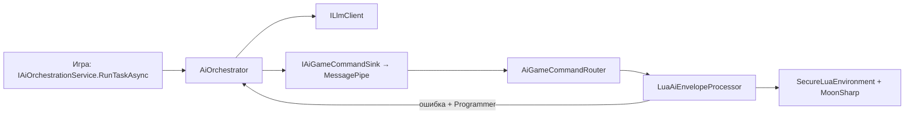

# Руководство разработчика CoreAI (шаблон)

Документ для тех, кто **подключает ядро к своей игре** или **расширяет репозиторий**. Нормативные контракты и дорожная карта — в **[DGF_SPEC.md](DGF_SPEC.md)**; здесь — практическая карта кода и типичные задачи.

---

## 1. С чего начать (порядок чтения)

**С нуля за 10 минут:** [QUICK_START.md](QUICK_START.md) → сцена RogueliteArena, LLM, F9. **Оглавление всех Docs:** [DOCS_INDEX.md](DOCS_INDEX.md).

| Шаг | Документ / место | Зачем |
|-----|------------------|--------|
| 0 | [QUICK_START.md](QUICK_START.md), [../../_exampleGame/Docs/UNITY_SETUP.md](../../_exampleGame/Docs/UNITY_SETUP.md) | Быстрый старт и пошаговая настройка Example Game в Unity |
| 1 | [DGF_SPEC.md](DGF_SPEC.md) §1–5, §8–9 | Цели ядра, LLM/stub, Lua, потоки |
| 2 | [AI_AGENT_ROLES.md](AI_AGENT_ROLES.md) | Роли агентов, placement, выбор модели |
| 3 | [LLMUNITY_SETUP_AND_MODELS.md](LLMUNITY_SETUP_AND_MODELS.md) | LLMUnity, LM Studio / OpenAI HTTP, PlayMode-тесты, Lua-пайплайн |
| 4 | [../README.md](../README.md) (ядро `_source`) | Сборки, папки, DI, промпты, MessagePipe |
| 5 | [GameTemplateGuides/INDEX.md](GameTemplateGuides/INDEX.md) | Короткие рецепты под тайтл |
| 6 | [../../_exampleGame/README.md](../../_exampleGame/README.md) | Пример игры и точки входа |

---

## 2. Сборки и границы ответственности

| Сборка | Папка | Ограничение |
|--------|-------|-------------|
| **CoreAI.Core** | `Assets/_source/Core/` | **Без Unity** (`noEngineReferences`). Контракты ИИ, оркестратор, снимок сессии, песочница MoonSharp, парсинг Lua из ответа LLM, процессор конверта. |
| **CoreAI.Source** | `Assets/_source/Runtime/` | Unity: VContainer, MessagePipe, LLMUnity/OpenAI HTTP, логирование, роутер команд, биндинги Lua (`report` / `add`). |
| **CoreAI.Tests** | `Assets/_source/Tests/EditMode/` | EditMode NUnit, без Play Mode. |
| **CoreAI.PlayModeTests** | `Assets/_source/Tests/PlayMode/` | Play Mode (оркестратор, опционально LM Studio через env). |
| **CoreAI.ExampleGame** | `Assets/_exampleGame/` | Демо-арена; зависит от Source. |

**Правило:** игровая логика тайтла не должна «протекать» в Core без необходимости. Новые **игровые** API для Lua — через реализацию **`IGameLuaRuntimeBindings`** в Source (или в сборке игры), а не правки песочницы в обход whitelist.

---

## 3. Поток данных (как всё связано)

Упрощённая схема рантайма:

1. **Игра** вызывает **`IAiOrchestrationService.RunTaskAsync(AiTaskRequest)`** (роль, hint, опционально поля ремонта Lua).
2. **`AiOrchestrator`** собирает системный/user промпт через **`AiPromptComposer`**, вызывает **`ILlmClient.CompleteAsync`**, публикует **`ApplyAiGameCommand`** с **`CommandTypeId = AiEnvelope`**, **`JsonPayload`** = сырой текст модели, плюс **`SourceRoleId`**, **`SourceTaskHint`**, **`LuaRepairGeneration`**.
3. Подписчик **`AiGameCommandRouter`** сначала вызывает **`LuaAiEnvelopeProcessor.Process`**: из текста извлекается Lua (fenced `lua` или JSON **`ExecuteLua`**), выполняется в песочнице с API из **`IGameLuaRuntimeBindings`**.
4. При успехе / ошибке публикуются **`LuaExecutionSucceeded`** / **`LuaExecutionFailed`**. Для роли **Programmer** при ошибке оркестратор вызывается повторно с контекстом **`lua_error`** / **`fix_this_lua`** в user payload (лимит поколений см. **`LuaAiEnvelopeProcessor`**).

**Важно:** геймплейные системы могут подписываться на **`ApplyAiGameCommand`** и реагировать на типы команд; не парсить сырой текст LLM вне общего конвейера, если хотите единообразия.

---

## 4. LLM: два бэкенда

| Режим | Где настраивается | Когда выбирается |
|--------|-------------------|------------------|
| **LLMUnity** (`LLMAgent` на сцене) | Инспектор **LLM** / **LLMAgent** | По умолчанию, если на **`CoreAILifetimeScope`** не включён OpenAI HTTP asset или он выключен. См. [LLMUNITY_SETUP_AND_MODELS.md](LLMUNITY_SETUP_AND_MODELS.md). |
| **OpenAI-compatible HTTP** | Asset **CoreAI → LLM → OpenAI-compatible HTTP**, поле на **`CoreAILifetimeScope`** | **`OpenAiHttpLlmSettings.UseOpenAiCompatibleHttp`** — тогда **`ILlmClient`** = **`OpenAiChatLlmClient`** (эндпоинт `.../v1/chat/completions`). |

Символ **`COREAI_NO_LLM`**: в контейнере остаётся цепочка с **`StubLlmClient`** / HTTP при необходимости — детали в DGF_SPEC §5.2.

---

## 5. Промпты и роли

- **Цепочка системного промпта:** манифест (опционально) → **`Resources/AgentPrompts/System/<RoleId>.txt`** → встроенный fallback (**`BuiltInAgentSystemPromptTexts`**).
- **Встроенные роли:** см. **`BuiltInAgentRoleIds`** и тесты **`AgentRolesAndPromptsTests`**.
- **User payload:** по умолчанию — JSON вида `{"telemetry":{...},"hint":"..."}` из **`GameSessionSnapshot.Telemetry`**; при ремонте Lua добавляются поля **`lua_repair_generation`**, **`lua_error`**, **`fix_this_lua`** (**`AiPromptComposer`**).
- **Память агента (опционально):** агент может сам сохранять “память” через блоки в ответе:
  - fenced `memory` — перезаписать память
  - fenced `memory_append` — дописать
  - fenced `memory_clear` — очистить
  
  По умолчанию память **выключена у всех ролей**, кроме **Creator** (см. `AgentMemoryPolicy`). В рантайме Unity память хранится в `Application.persistentDataPath/CoreAI/AgentMemory/<RoleId>.json`.

---

## 6. Lua для агента Programmer

- Парсинг: **`AiLuaPayloadParser`** (markdown → JSON **`ExecuteLua`**).
- Исполнение: **`SecureLuaEnvironment`**, **`LuaExecutionGuard`**, **`LuaApiRegistry`**.
- Дефолтные игровые вызовы в шаблоне: **`LoggingLuaRuntimeBindings`** — **`report(string)`**, **`add(a,b)`**.
- Расширение: зарегистрируйте свою реализацию **`IGameLuaRuntimeBindings`** в **`CoreAILifetimeScope`** (вместо или поверх дефолтной — по политике проекта; избегайте дублирования интерфейса в контейнере без явной замены).

---

## 7. Тесты

| Сборка | Запуск | Что проверяет |
|--------|--------|----------------|
| **CoreAI.Tests** | Test Runner → EditMode | Промпты, stub LLM, песочница Lua, парсер конверта, **`LuaAiEnvelopeProcessor`**, композер repair, **`LuaProgrammerPipelineEndToEndEditModeTests`** (оркестратор → конверт → Lua → ошибка → повтор Programmer → успех). |
| **CoreAI.PlayModeTests** | Test Runner → PlayMode | Оркестратор по всем ролям; опционально реальный HTTP (переменные **`COREAI_OPENAI_TEST_*`** — см. LLMUNITY doc). |

Рекомендация: перед PR прогонять **EditMode**; PlayMode — при изменениях DI/сцены или HTTP-клиента.

---

## 8. Пример игры (`_exampleGame`)

- Сцена **`RogueliteArena`** (см. Build Settings): **`CompositionRoot`** с **`CoreAILifetimeScope`**, **`ExampleRogueliteEntry`** (арена + хоткеи).
- **F9** — задача **Programmer** (демо Lua + `report`), компонент **`CoreAiLuaHotkey`**.
- Дочерний **`LifetimeScope`** примера: **`RogueliteArenaLifetimeScope`** — заготовка под фичи игры с **Parent** = ядро.

Подробности: [../../_exampleGame/README.md](../../_exampleGame/README.md).

---

## 9. Типичные задачи разработчика

| Задача | Куда смотреть / что делать |
|--------|----------------------------|
| Новая роль агента | Константа или строковый id; промпт в Resources или манифесте; при необходимости тест в **`AgentRolesAndPromptsTests`**. |
| Новый тип команды ИИ | Расширить обработку **`ApplyAiGameCommand.CommandTypeId`** (новый подписчик или ветка в игре); не смешивать с сырым текстом LLM без парсера. |
| Новые функции для Lua от LLM | Реализовать **`IGameLuaRuntimeBindings`**; регистрация делегатов в **`LuaApiRegistry`** (whitelist). |
| Смена модели / облако | [LLMUNITY_SETUP_AND_MODELS.md](LLMUNITY_SETUP_AND_MODELS.md); для продакшена не коммить API-ключи. |
| Мультиплеер | DGF_SPEC, **AI_AGENT_ROLES** (placement); авторитет LLM на хосте — ответственность игры. |

---

## 10. Чеклист PR

- **EditMode:** `CoreAI.Tests` без ошибок (промпты, Lua, парсеры, процессор конверта).
- **PlayMode:** при изменениях `CoreAILifetimeScope`, сцен, `OpenAiChatLlmClient` или PlayMode-тестов — прогнать `CoreAI.PlayModeTests`.
- **Секреты:** не коммитить API-ключи, `.env` с ключами, локальные пути к моделям с персональными данными; для CI использовать переменные окружения (см. [LLMUNITY_SETUP_AND_MODELS.md](LLMUNITY_SETUP_AND_MODELS.md)).
- **Документация:** если меняется контракт или поток (§3 DGF / DI), обновить **DGF_SPEC** и при необходимости этот гайд в том же PR.

---

## 11. Версионирование документов

Крупные изменения контрактов фиксируйте в **DGF_SPEC** (версия в шапке). **DEVELOPER_GUIDE** описывает текущую карту кода; при расхождении с кодом приоритет у репозитория — обновите гайд в том же PR.

**Версия этого гайда:** 1.2 (апрель 2026) — ссылки на QUICK_START, DOCS_INDEX, UNITY_SETUP для Example Game.
