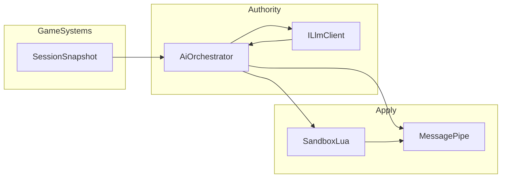

# CoreAI — SPEC ядра (Dynamic Game Framework)

**Версия документа:** 0.13  
**Репозиторий:** CoreAI  
**Код ядра:** `Assets/_source` — сборки **`CoreAI.Core`** (`Core/`, без Unity) и **`CoreAI.Source`** (`Runtime/`)  
**Пример игры:** `Assets/_exampleGame` (см. также `Docs/ROGUELITE_PLAYBOOK.md` в примере)  
**Референс-архитектура (не копировать целиком):** `D:\Git\GameDev-Last-War`  
**Каталог ролей ИИ (оркестрация, placement, модели):** [AI_AGENT_ROLES.md](AI_AGENT_ROLES.md)  
**Практическое руководство разработчика (карта кода, Lua, тесты):** [DEVELOPER_GUIDE.md](DEVELOPER_GUIDE.md)  
**Быстрый старт и оглавление Docs:** [QUICK_START.md](QUICK_START.md), [DOCS_INDEX.md](DOCS_INDEX.md) · **Example Game в Unity:** [../../_exampleGame/Docs/UNITY_SETUP.md](../../_exampleGame/Docs/UNITY_SETUP.md)

---

## 1. Цели и нецели

### 1.1 Цели

- Единое **ядро** для игр с **процедурной и ИИ-управляемой** логикой: смена правил, волн, модификаторов, персонажных эффектов.
- **Один код-путь** для синглплеера и мультиплеера: в офлайне игрок = локальный **авторитет** (аналог хоста).
- **Оркестрация** нескольких запросов к моделям и сценариев: очередь, приоритеты, таймауты, бюджет.
- **Безопасное исполнение** необязательного кода (Lua / MoonSharp) в **песочнице** с whitelist и лимитами.
- **Применение решений ИИ** только через явные **команды и типизированные события** (в первую очередь **MessagePipe**), без прямого «разбора текста» в геймплейных системах.

### 1.2 Нецели (v1)

- Античит и доверие к клиенту в соревновательном PvP — отдельная дисциплина.
- Полная копия стека Last-War (ECS, gRPC, PlayFab и т.д.) — только **идеи слоёв и DI**, где уместно.
- Гарантия «идеальной» безопасности Lua — практическая **глубина обороны**, не математическое доказательство.

---

## 2. Глоссарий

| Термин | Значение |
|--------|----------|
| **Авторитет** | Узел, который может вызывать LLM, оркестратор и **фиксировать** итоговые правила сессии (хост или локальный solo). |
| **Снимок сессии (Session Snapshot)** | Минимальный DTO телеметрии для промпта/логики (волна, HP ядра, состав партии, флаги режима и т.д.). |
| **Команда / игровое событие** | Типизированное сообщение в шине (MessagePipe), которое игровой код обрабатывает детерминированно. |
| **Use case (динамический)** | Единица поведения, возможно сгенерированная ИИ: данные (JSON) и/или фрагмент Lua под whitelist. |
| **Песочница** | Изолированный `Script` MoonSharp + политика globals + лимиты + зарегистрированные C# делегаты. |
| **Оркестратор ИИ** | Сервис, принимающий **задачи** от игры, выставляющий приоритеты и не дающий параллельным вызовам блокировать главный поток без политики. |
| **Роль агента** | Логический тип запроса: **Creator**, **Analyzer**, **Programmer** (Lua), **AINpc**, **CoreMechanicAI** и др. — см. [AI_AGENT_ROLES.md](AI_AGENT_ROLES.md). |
| **Placement** | Где исполняется роль: **HostAuthoritative**, **LocalPerClient**, **Hybrid** — задаётся конфигом игры, не жёстко ядром. |

---

## 3. Текущее состояние репозитория (зафиксировано)

### 3.1 Пакеты (`Packages/manifest.json`)

- **VContainer**, **MessagePipe** + **MessagePipe.VContainer**
- **R3**, **UniTask**
- **MoonSharp** (`org.moonsharp.moonsharp`, UPM)
- **MCPForUnity** (`com.coplaydev.unity-mcp`) — автоматизация редактора; **обязательный** путь запуска тестов для агента/CI в связке с Cursor — см. **§11–12**.
- **LLM for Unity** ([LLMUnity](https://github.com/undreamai/LLMUnity), пакет `ai.undream.llm` в manifest) — локальный/удалённый инференс (llama.cpp), `LLM` / `LLMAgent`, grammar/RAG по документации пакета. В ядре по-прежнему вводится **`ILlmClient`**; **эталонная** реализация — тонкий адаптер над LLMUnity + режим **stub** (§5.2).

### 3.2 Сборка `CoreAI.Core` (`Assets/_source/Core/CoreAI.Core.asmdef`)

- `noEngineReferences: true`; ссылки: **VContainer**, **MoonSharp.Interpreter** (имя asmdef UPM MoonSharp).
- Портативная логика: контракты ИИ, оркестратор MVP, песочница Lua, DTO снимка сессии.

### 3.3 Сборка `CoreAI.Source` (`Assets/_source/Runtime/CoreAI.Source.asmdef`)

- Ссылки: **CoreAI.Core**, **VContainer**, **MessagePipe**, **MessagePipe.VContainer**, **undream.llmunity.Runtime** (LLMUnity).
- **R3**, **UniTask** — в manifest есть; в asmdef подключать по мере использования в коде.

### 3.4 Композиция и сцена

- **`CoreAILifetimeScope`**: `RegisterCore()` — логгер, MessagePipe, брокер **`ApplyAiGameCommand`**, `IAiGameCommandSink`; при необходимости **OpenAI HTTP** (`OpenAiHttpLlmSettings`); затем **`ILlmClient`** (OpenAI / stub / LLMUnity при `LLMAgent` в сцене; символ **`COREAI_NO_LLM`** — без LLMUnity-адаптера); **`RegisterCorePortable()`** — песочница, **`LuaAiEnvelopeProcessor`**, оркестратор, снимок сессии, авторитет solo; **`IGameLuaRuntimeBindings`** / **`ILuaExecutionObserver`** (логирующие реализации в Source). Entry points: сначала **`AiGameCommandRouter`** (подписка + Lua), затем **`CoreAIGameEntryPoint`** (bootstrap LLM). Игровые feature-scope'ы вешать отдельно с **Parent** на этот корень ядра.
- **`CoreAIGameEntryPoint`**: старт + тестовый вызов оркестратора (bootstrap).
- Сцена ядра: **`Assets/_source/Scenes/_mainCoreAI.unity`** (имя в редакторе может отображаться как `_mainCoreAI`; в Build Settings при необходимости сделать **стартовой** для разработки шаблона).
- **Game Log Settings** (опционально): `Resources/GameLogSettings.asset` или свой asset на scope.

---

## 4. Целевая архитектура модулей (`_source/Runtime`)

Рекомендуемое разбиение (папки наращивать по мере реализации):

| Область | Ответственность |
|---------|-----------------|
| `Composition/` | `CoreAILifetimeScope`, installers, регистрация подсистем |
| `Infrastructure/` | Логирование, время, опции, общие утилиты |
| `Infrastructure/Messaging/` | Политики публикации, адаптеры (в т.ч. мост Lua → MessagePipe, см. §8) |
| `Session/` | Снимок сессии, сбор телеметрии, версия правил |
| `Ai/` | Оркестратор, очередь, роли, `ILlmClient`, валидация схем ответа |
| `Sandbox/` | Фабрика `Script`, whitelist API, лимиты, dry-run |
| `Features/` | Узкие фичи ядра, не раздувая корень |

**Поток данных (норматив):**

1. Игра публикует **факты** в шину и/или обновляет сервис снимка.
2. **Только авторитет** ставит задачу оркестратору (solo = локально всегда да).
3. Оркестратор вызывает LLM при наличии бюджета → получает **структурированный** ответ.
4. Валидация → преобразование в **команды** → `IPublisher<T>.Publish` (или специализированный сервис команд).
5. Опционально: Lua use case исполняется в песочнице; из Lua доступны **только** делегаты, ведущие к разрешённым командам/событиям.

### 4.1 Портативное ядро C# без Unity (DLL / другие движки)

**Возможно и полезно как дорожная карта**, если не раздувать scope на первых итерациях. Идея: вынести **движко-независимую** логику в отдельную сборку (например `CoreAI.Core` / `CoreAI.Portable`), ориентир **.NET Standard 2.1** или **.NET 8** class library — без ссылок на `UnityEngine`, без UPM-специфичных asmdef там, где удобнее SDK-style `.csproj`.

**Что уместно держать в портативной сборке (по мере рефакторинга):**

- Контракты и DTO: снимок сессии, команды, роли агентов, результаты валидации.
- **Оркестратор ИИ** (очередь, приоритеты, таймауты) — только на абстракциях: `ILlmClient`, `IClock`, `ILog` (свои интерфейсы, не `UnityEngine.Debug`).
- **Песочница MoonSharp** — интерпретатор **не зависит от Unity** (чистый .NET); whitelist и лимиты живут в **`CoreAI.Core`**; ссылка на UPM-пакет `org.moonsharp.moonsharp` в `CoreAI.Core.asmdef` — **норма** для шаблона.
- Реализации **`ILlmClient`**: HTTP к Ollama/OpenAI, stub (§5.2) — без Unity.
- Упрощённая **шина команд** (`ICommandBus` / собственный лёгкий pub-sub), если полный **MessagePipe** в не-Unity контексте нежелателен; либо тонкая обёртка над тем же паттерном без Unity-зависимостей.

**Что остаётся в слое Unity (`CoreAI.Unity` / текущий `CoreAI.Source` + отдельный asmdef):**

- `LifetimeScope`, MonoBehaviour, сцены, `GameObject`, NGO, **LLMUnity** ([LLMUnity](https://github.com/undreamai/LLMUnity)), `StreamingAssets`, интеграция MCP в редакторе.
- Адаптеры: `ILog` → `UnityGameLogSink`, при необходимости мост MessagePipe ↔ портативные события.

**Потребители портативной DLL:** сервер авторитета без клиента Unity, **Godot 4 (.NET)**, консольные тесты, инструменты CI, другой движок с hosted CLR. **Не** ждать «один DLL на все движки без перекомпиляции» под нативный C++ — только там, где есть совместимый .NET runtime.

**«Забить» на первом этапе — нормально:** текущий `CoreAI.Source` может жить в Unity до появления реальной потребности в headless/другом движке; тогда выделить папку/проект и переносить типы без `UnityEngine` пакетно.

### 4.2 Зависимости портативной сборки (`CoreAI.Core`): минимум vs «тот же стек»

**Рекомендация шаблона:** в **`CoreAI.Core`** — **по возможности мало** внешних пакетов, но **VContainer допускается осознанно** (единый стиль DI с `CoreAI.Source`). Остальное из «unity-стека» (**MessagePipe**, **R3**, **UniTask**) по умолчанию в **`CoreAI.Source`** + адаптеры к Core.

| Пакет | В `CoreAI.Core` | Комментарий |
|--------|-----------------|-------------|
| **VContainer** | **Да (решение шаблона)** | Удобство и единообразие регистрации сервисов. Добавить ссылку **`VContainer`** в `CoreAI.Core.asmdef`, **если** сборка компилируется с **`noEngineReferences: true`** (используем только API без `UnityEngine`). Если UPM-пакет VContainer тянет Unity — не отключать `noEngineReferences` ложно: либо вынести DI только в Source, либо зафиксировать в ADR вариант с `Microsoft.Extensions.DependencyInjection` для headless. |
| **MessagePipe** (+ VContainer) | По умолчанию **нет** | UPM-слой тянет Unity; в Core — свой **`ICommandBus`** / делегаты / внутренний список подписчиков; в Source — обёртка, которая прокидывает в MessagePipe. |
| **R3** | По умолчанию **нет** | UI/клиентская реактивность ближе к Unity; в Core — `event`, `IObservable` из Rx (если очень нужно) или простые колбэки. Исключение: если выберете **один** netstandard-совместимый пакет и примете его как контракт для всех хостов — зафиксировать в ADR. |
| **UniTask** | По умолчанию **нет** | В Core — `Task` / `ValueTask`; в Unity-слое — UniTask для интеграции с PlayerLoop. |
| **MoonSharp** | **Да** | Работает **без Unity** на .NET; песочница и политика globals/whitelist — в **`CoreAI.Core`**. В `CoreAI.Source` — только вызовы из игрового цикла/хоста, если нужны. Имя сборки в UPM: обычно по `org.moonsharp.moonsharp` (проверить в PackageCache при первой ссылке asmdef). |
| **System.Text.Json** / **HttpClient** | Допустимо | Для `ILlmClient` HTTP и парсинга JSON на BCL. |

**Почему не тащить всё в портативную сборку сразу:** каждая зависимость — это версии, совместимость с **Godot / консолью / сервером Linux**, лицензии и размер. Чем тоньше Core, тем проще **вынести DLL** и тестировать без редактора.

**Альтернатива «единый стек»:** если целевой не-Unity хост **один** (например только ASP.NET), можно явно зафиксировать **разрешённый набор** (например `Microsoft.Extensions.*` + MediatR) **вместо** дублирования MessagePipe — это отдельное решение, его нужно описать в ADR и не смешивать с Unity-UPM без мостов.

---

## 5. Сеть и авторитет (политика)

- **Клиент не считается авторитетом** для **глобальных** исходов ИИ (правила сессии, мир, общий лут/крафт в коопе): не исполняет сырой вывод модели как истину для других.
- **Хост** (или solo) — **эталон** для оркестрации и для ролей с **HostAuthoritative**; на клиенты уходит **реплицированное состояние** (NGO и др.).
- **Не все роли обязаны существовать в игре:** допустим только **AINpc**, только **CoreMechanicAI** или любое подмножество — см. [AI_AGENT_ROLES.md](AI_AGENT_ROLES.md) §5–6.
- **Placement:** часть ролей (напр. **CoreMechanicAI** или визуальный слой **AINpc**) по решению разработчика может быть **LocalPerClient** или **Hybrid**; ядро задаёт **контракт** политики, игра — конкретный выбор (честность коопа vs локальный «флейвор»).
- Телеметрия для **Analyzer** и **Creator** на мультиплеере по умолчанию собирается **на авторитете**; локальные метрики без влияния на правила — по политике игры.

### 5.1 Рекомендуемый сетевой стек для шаблона (выбор библиотеки)

**Рекомендация по умолчанию: Netcode for GameObjects (NGO)** — пакет Unity (`com.unity.netcode.gameobjects`), бесплатный, развивается вместе с версиями редактора, хорошо ложится на модель **хост / сервер + клиенты**. Для CoreAI это важно: **на хосте** крутятся оркестратор ИИ и LLM, клиенты получают уже **согласованные** `NetworkVariable` / RPC / custom messages с параметрами волн и правил. Опционально позже — **Unity Gaming Services** (Relay, Lobby) без смены базовой модели авторитета.

| Решение | Плюсы для шаблона | Минусы / когда не брать |
|--------|-------------------|-------------------------|
| **NGO** | Официальный путь Unity, документация, listen-server (хост-игрок), предсказуемые обновления под LTS/Unity 6 | Больше «церемонии», чем у Mirror; часть продвинутых сценариев через пакеты/UGS |
| **Mirror** | Открытый код, много туториалов, listen server из коробки, без облака не обязательны | Не «официальный» пакет Unity; саппорт и совместимость — на сообществе |
| **Fish-Networking** | Сильный по производительности и фичам, бесплатный core | Отдельная экосистема; обучение и миграция с NGO отличаются |
| **Photon (Fusion / PUN2)** | Готовый relay/облако, удобно для быстрого интернета-мультиплеера | **Не полностью бесплатно** на масштабе; модель ценообразования и привязка к облаку Photon; для «ИИ только на хосте» часто избыточно на старте |
| **Photon Quantum** | Симуляция с фиксированным тиком | Отдельная парадигма (ECS-like), лицензирование; для первого полигона `_exampleGame` обычно тяжеловато |

**Итог:** для **бесплатного**, **мощного в рамках Unity** и совместимого с политикой «**авторитет хоста для ИИ**» — **NGO**. **Mirror** — разумная альтернатива, если сознательно хотите обойтись без экосистемы Unity Multiplayer. **Photon** имеет смысл, когда нужен **managed relay/матчмейкинг** и готовы к лимитам/тарифам, а не как «просто бесплатная замена NGO».

Интерфейс в коде ядра (`INetworkAuthority` / `IsServer` / `IsHost`) проектируется так, чтобы при крайней необходимости **подменить** транспорт (например тесты или второй проект на Mirror), но **эталонная реализация** в репозитории — **NGO**.

### 5.2 Билды без моделей ИИ (roadmap, HostAuthoritative)

Когда **все** роли с LLM сосредоточены на **хосте**, шаблон в перспективе должен позволять **собирать вариант билда без встроенных моделей и без обязательного рантайма LLM** на машине игрока:

- **Цели:** демо- и тест-сборки, CI без Ollama, дистрибутив меньшего размера, сценарий «хост без GPU / без скачанных весов», магазины с политикой «без сетевых вызовов к LLM».
- **Направление реализации (не обязательство текущего кода):**
  - Регистрация в DI **`ILlmClient`** реализации-**заглушки** (`NullLlmClient` / `HeuristicLlmClient`), выдающей **детерминированные** или **табличные** ответы по роли (fallback из ScriptableObject / seed).
  - Опционально символ компиляции (**Scripting Define**), например `COREAI_NO_LLM`, чтобы **исключить** тяжёлые зависимости LLM-пакета из конкретного билда, если пакет это допускает.
  - Оркестратор в режиме «без LLM» **не падает**: задачи либо маппятся на эвристики, либо помечаются «пропущено» с логом; **MessagePipe** и игровая логика остаются рабочими.
  - Клиенты в NGO по-прежнему получают **реплицированное состояние**; отличие только в том, что **источник** решений на хосте — не нейросеть, а заглушка/дизайнерские данные.
- Детали контрактов fallback — по мере появления `ILlmClient` в коде; этот подпункт фиксирует **требование к дизайну** шаблона.

---

## 6. Оркестратор ИИ (требования)

- Регистрация **только включённых в игру** ролей из каталога [AI_AGENT_ROLES.md](AI_AGENT_ROLES.md); у каждой задачи — `AgentRoleId` + **placement** + приоритет.
- **Очередь задач** с **приоритетом** (настраиваемым): например CoreMechanicAI (момент крафта) > Creator (смена правил) > AINpc (реплика) > Analyzer (батч).
- **Таймаут** на задачу и на LLM-вызов; отмена при смене фазы сессии (конец раунда, пауза, выход в хаб).
- **Ограничение параллелизма** (например не более N одновременных вызовов LLM).
- **Дедупликация**: схожие запросы в один кадр — объединять или отбрасывать по политике.
- **Не блокировать** главный поток: асинхронность через **UniTask** (или эквивалент) с явным возвратом на главный поток для применения к Unity API.

---

## 7. LLM и контракт ответа

- Ввод: системный промпт роли + **Session Snapshot** + допустимые **JSON Schema** / описание полей.
- Вывод: сначала валидация **структуры** (поля, типы, диапазоны); провал → повтор с сообщением об ошибке (ограниченное число попыток) или отказ задачи.
- Текст свободной формы **не** является командой игре до прохождения валидации и маппинга на типы команд.
- **Выбор модели и размещение (локально / API)** по ролям SPEC не фиксирует жёстко; ориентиры в [AI_AGENT_ROLES.md](AI_AGENT_ROLES.md), раздел **«6. Рекомендации по моделям»**. Реализация `ILlmClient` может маршрутизировать роли на разные endpoint’ы или размеры моделей.
- **Билд без моделей** (заглушка `ILlmClient`, эвристики) — см. **§5.2**; актуально в первую очередь при **HostAuthoritative** для всего ИИ на хосте.

---

## 8. Песочница Lua (MoonSharp)

### 8.1 Безопасность

- Снять или переопределить опасные **globals** (`os`, `io`, `require`, динамическая загрузка кода — по чеклисту версии MoonSharp).
- Только **whitelist** зарегистрированных функций; без доступа к произвольным Unity API из Lua для кода от LLM.

### 8.2 Лимиты

- **MaxInstructions** (или эквивалент в используемой версии MoonSharp).
- Политика **таймаута** на выполнение чанка Lua согласованная с §10 (главный поток).

### 8.3 Мост к MessagePipe (мотив Last-War)

В Last-War (`Assets/Scripts/LuaBehaviour/`, в т.ч. идея **`LuaMessagePipeAdapter`**) Lua публикует/подписывается на события по имени типа. Для CoreAI:

- Разрешать только **явный перечень** типов команд / DTO (реестр имён или id).
- Публикация из Lua → **один** C# делегат, который маппит на `IPublisher<T>` с проверкой типа.
- Запрет произвольных типов и рефлексии из Lua.

### 8.4 Тесты

- EditMode: вызов запрещённого API, превышение инструкций, неверный тип события — ожидаемые ошибки.

---

## 9. Потоки выполнения (ADR)

### ADR-9.1 — Рекомендуемая модель по умолчанию

- **Lua и применение команд к Unity** — на **главном потоке** (MoonSharp `Script` в том же потоке, что и `Publish` в MessagePipe / изменение состояния игры).
- **Вызовы LLM** — **асинхронно** (`Task` / UniTask в Unity-слое); результат валидируется и **маршалится на main thread** перед публикацией команд и касанием `UnityEngine` API.
- **Оркестратор** не должен блокировать сетевой тик дольше политики: тяжёлые шаги выносить в async и дробить работу по кадрам при необходимости.

### ADR-9.2 — Альтернатива (Lua на воркере)

Допустима **только** если **все** CLR-callback'и из Lua ставят работу в очередь на main thread и **не** вызывают `UnityEngine` напрямую. Требуется явная проверка в code review и EditMode-тесты на отсутствие гонок.

### ADR-9.3 — Соответствие коду шаблона (текущее)

Сборка **`CoreAI.Core`** не ссылается на Unity; маршалинг на main thread обеспечивается в **`CoreAI.Source`** (bootstrap, entry points, подписчики MessagePipe). Песочница в Core остаётся потоково-нейтральной — вызывать из игры с учётом ADR-9.1.

---

## 10. Интеграция с примером `_exampleGame`

- Минимальный забег: арена, волна, UI счёта/здоровья (см. playbook примера).
- Одна **процедурная ручка** через ядро: например аффикс волны или состав врагов — только через команды шины после авторитета.
- Зависимость примера: отдельный asmdef, ссылка только на **публичный API** ядра (когда выделен).

---

## 11. MCPForUnity

### 11.1 Редактор и сцены

- Проверка объектов на `_mainCoreAI`, префабы, регрессия композиции после изменений.

### 11.2 Обязательный запуск тестов через MCP (политика репозитория)

- Новая и изменённая логика ядра сопровождается **тестами Unity Test Framework** (предпочтительно **EditMode** для песочницы, DI, парсеров; **PlayMode** — для интеграций по мере необходимости).
- После значимых правок агент **должен** прогонять тесты через **MCPForUnity**, а не ограничиваться «сборкой в голове»:
  1. Вызов **`run_tests`** (режим `EditMode` и/или `PlayMode`, при необходимости фильтр `assembly_names` / `test_names`).
  2. Ожидание результата через **`get_test_job`** с `job_id` (параметр **`wait_timeout`** 30–120 с снижает ручной polling).
  3. При падении — **`include_failed_tests` / `include_details`**, правка кода, повтор цикла.
- Редактор Unity с подключённым проектом CoreAI должен быть **доступен** MCP-серверу (см. документацию [CoplayDev/unity-mcp](https://github.com/CoplayDev/unity-mcp)); без этого шаг тестов помечается как заблокированный и выполняется вручную в Test Runner.
- MCP **не отменяет** batchmode CI (`Unity -batchmode -runTests`) при наличии пайплайна — оба канала дополняют друг друга.

---

## 12. Качество и CI

- Проект **компилируется** без дублирования пакетов VContainer (единственный источник — UPM).
- **Тесты:** см. §11.2; каждая фича фазы B–C должна иметь хотя бы один **регрессионный** тест до слияния в основную ветку (критерий для человека и для агента).
- Локально / CI: `Unity -batchmode -quit` и при возможности **`-runTests`** с теми же сборками, что и в Editor.
- Глобальные анализаторы — не ломать сборку шаблона без явного решения.

---

## 13. Дорожная карта в фазах (синхрон с планом репозитория)

### Фаза A — База сцены и сборка

| Id | Критерий готовности |
|----|---------------------|
| A1 | На `_mainCoreAI`: объект с `CoreAILifetimeScope`, при необходимости Game Log Settings |
| A2 | `CoreAIGameEntryPoint` отрабатывает при старте (Auto Run) |
| A3 | Сцена в Build Settings как стартовая для разработки шаблона (по решению команды) |
| A4 | Сборка без конфликтующих копий VContainer и критичных ошибок компиляции |

### Фаза B — Ядро `_source`

| Id | Критерий |
|----|----------|
| B1 | Контракт `Session Snapshot` + сборщик телеметрии |
| B2 | Оркестратор: очередь, приоритеты, таймауты, проверка авторитета |
| B3 | `ILlmClient` + адаптер под **LLMUnity** и/или **mock/stub** (§5.2) |
| B4 | Применение только через MessagePipe / явные команды |
| B5 | Актуализация этого SPEC при смене контрактов |

### Фаза C — Песочница Lua

| Id | Критерий |
|----|----------|
| C1 | Whitelist API |
| C2 | Лимиты инструкций / время |
| C3 | Мост к MessagePipe (ограниченный реестр типов) |
| C4 | EditMode-тесты безопасности |

### Фаза D — Пример `_exampleGame`

| Id | Критерий |
|----|----------|
| D1 | Минимальный забег (арена, волна, UI) |
| D2 | Одна ручка процедурной логики через ядро |
| D3 | Связка с `ROGUELITE_PLAYBOOK.md` итеративно |

### Фаза E — Нагрузка и мультиплеер

| Id | Критерий |
|----|----------|
| E1 | Сценарии нагрузки оркестратора (без лишней блокировки main thread) |
| E2 | Модель хост/клиент для ИИ и правил |
| E3 | Расширение сценариев MCPForUnity под регрессию |

---

## 14. Саммари для вставки в контекст (копипаст)

**CoreAI:** шаблон Unity-ядра под процедурную логику и ИИ. **Сделано:** VContainer + MessagePipe + R3 + UniTask + MoonSharp + **[LLMUnity](https://github.com/undreamai/LLMUnity)** (`ai.undream.llm`) + MCPForUnity в manifest; **`CoreAI.Core`** (портатив: `ILlmClient`, stub, оркестратор MVP, песочница Lua, **`LuaAiEnvelopeProcessor`**) + **`CoreAI.Source`** (DI, LLMUnity + OpenAI HTTP, MessagePipe, лог, роутер команд); сцены **`_mainCoreAI`**, пример **`RogueliteArena`**. **Сборка:** `CoreAI.Core` + `CoreAI.Source`. **Сеть:** NGO (§5.1). **Роли:** [AI_AGENT_ROLES.md](AI_AGENT_ROLES.md). **Гайд разработчика:** [DEVELOPER_GUIDE.md](DEVELOPER_GUIDE.md). **Тесты:** `CoreAI.Tests`, `CoreAI.PlayModeTests`, MCP §11.2. **Define:** `COREAI_NO_LLM` — без LLMUnity-адаптера (§5.2). **Референс:** Last-War (`LuaBehaviour`, DI).

---

## 15. История версий документа

| Версия | Изменения |
|--------|-----------|
| 0.1 | Черновик из плана DGF |
| 0.2 | Синхронизация с репозиторием CoreAI, фазы A–E, Last-War, отсутствие LLM в manifest |
| 0.3 | §5.1 выбор сети: NGO по умолчанию, Mirror / Fish-Net / Photon — сравнение |
| 0.4 | §5 уточнение: подмножество ролей, placement; §6 оркестратор + ссылка на AI_AGENT_ROLES.md |
| 0.5 | §7 ссылка на AI_AGENT_ROLES §6 (модели локально/API); каталог v1.1 |
| 0.6 | §5.2 roadmap: билды без LLM на хосте, stub ILlmClient, optional define |
| 0.7 | §3.1 LLMUnity в manifest; §11.2 обязательный прогон тестов через MCP (`run_tests`/`get_test_job`); §12; B3 адаптер LLMUnity |
| 0.8 | §4.1 портативное ядро C# / DLL без Unity, слой адаптеров |
| 0.9 | §4.2 политика зависимостей Core vs Source (MessagePipe/R3/UniTask/VContainer) |
| 0.10 | §4.2: VContainer разрешён в CoreAI.Core при совместимости с noEngineReferences |
| 0.11 | §4.1–4.2: MoonSharp явно как зависимость Core (без Unity) |
| 0.12 | §9 ADR-9.1–9.3; в коде: сборка `CoreAI.Core`, `ILlmClient` + stub + LLMUnity в Source, оркестратор MVP, `ApplyAiGameCommand` + MessagePipe, песочница MoonSharp, `CoreAI.Tests`, `COREAI_NO_LLM` |
| 0.13 | Ссылка на [DEVELOPER_GUIDE.md](DEVELOPER_GUIDE.md); §3.4: OpenAI HTTP, `LuaAiEnvelopeProcessor`, порядок entry points, биндинги Lua |
