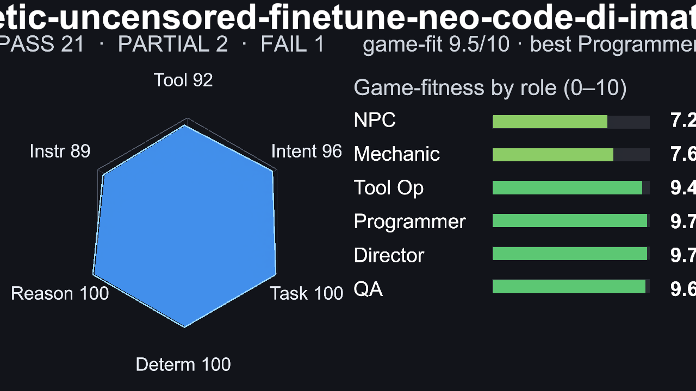
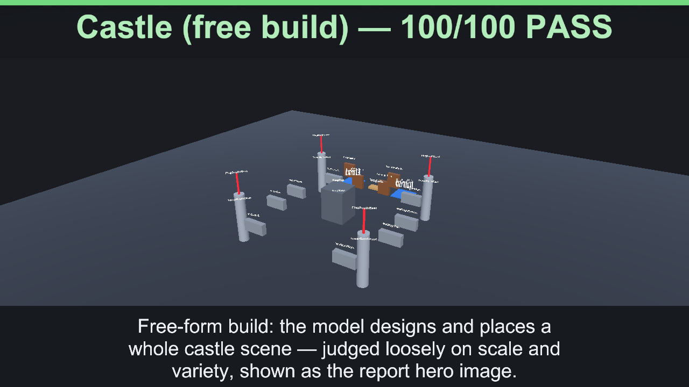
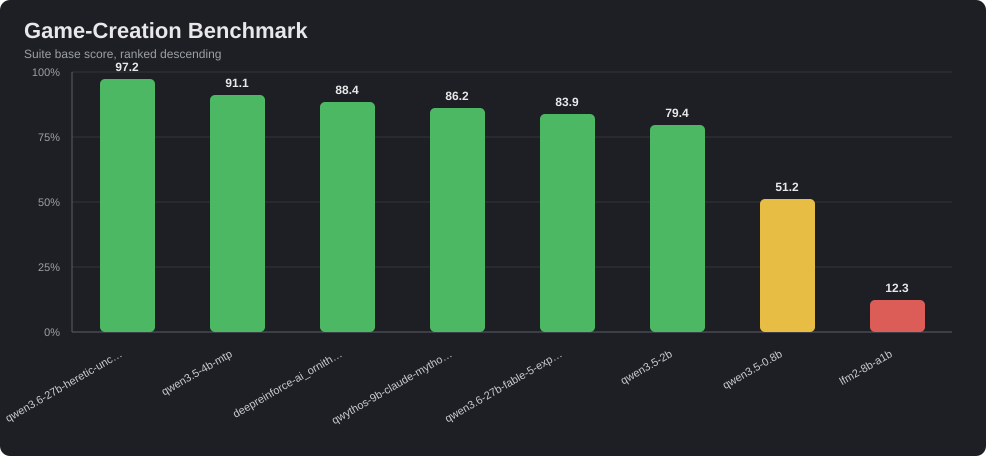

# CoreAI Game-Creation Benchmark

The CoreAI Game-Creation Benchmark measures how well an LLM can build a game inside CoreAI, not how well it can describe one. Each scenario drives the real `execute_lua` and `world_command` tools, then grades the resulting world commands, Lua logic slots, simulated playthroughs, screenshots, and tool-call trace.

The benchmark answers the practical production question: is this model usable for my game, and for which role? A model can be fast and conversational but still fail as a scene builder, mechanic author, tool operator, programmer, orchestrator, or QA agent if it cannot call tools correctly, obey constraints, or reason through game rules.

## Scenario Groups

| Group | Difficulty | What it measures | Typical task |
|---|---:|---|---|
| G1 - Build world | 2-3/5 | World construction plus simple Lua rules | Spawn a player, coins, goal, and install score/win logic. |
| G2 - Mechanic Lua | 1-3/5 | Deterministic runtime mechanic authoring | Install `calculate_damage`, `win_condition`, or `craft_result` slots. |
| G3 - Reasoning/design | 4-5/5 | Derived game-rule reasoning, not code transcription | Work out tiered prices, Fibonacci rewards, clamps, boolean dungeon logic, or balanced enemy HP. |
| G4 - Playthrough | 5/5 | Multi-slot rule systems that survive simulation | Combat, shop, and crafting-chain playthroughs checked step by step. |
| G5 - Strict instruction-following | 3/5 | Subtractive compliance under explicit constraints | Never touch a protected object, use spawn only, obey exact counts/order, avoid forbidden tools, and stay within a tool budget. |
| G6 - Free-build castle hero | 5/5 | Open-ended visual building with real scene output | Build a castle scene from the model's own positions; graded leniently on scale (12+ objects) and variety (20+), kept as the report hero image. |

Groups are implemented as real PlayMode benchmark scenarios under `Assets/CoreAiUnity/Tests/PlayMode/LlmVerification/Benchmarks`. G1 and G6 capture scene screenshots because the built scene is part of the result; G2-G5 are primarily graded through logic execution and traces.

## Scoring

Each scenario is scored on a 0-100 base score. Checkpoints are weighted and normalized to 100, then penalties and hard caps are applied.

The six benchmark dimensions are:

| Dimension | Meaning |
|---|---|
| Tool correctness | Uses the expected tools, with valid arguments and no failed tool calls or invalid world commands. |
| Intent and sequence | Follows the requested order and uses the right action pattern. |
| Task completion | Actually achieves the requested game state or behavior. |
| Determinism | Produces identical outputs for identical inputs. |
| Reasoning | Solves derived mechanics and hidden samples that were not spoon-fed in the prompt. |
| Instruction adherence | Obeys explicit constraints, especially in subtractive G5 scenarios. |

Penalties subtract from the base score for failed tool calls, invalid world commands, over-building, disallowed actions, forbidden tools, repeated violations, and scenario-specific mistakes. Hard caps prevent misleading scores: an incomplete timeout/fault or final-state failure can cap at 60, and a prose-only run that never fires a tool can cap at 40.

Bonus is separate from the comparable base score. A scenario can earn up to 20 bonus points only when its base score is at least 90. The bonus rewards robustness/correctness plus efficiency: fewer tokens and less time than the scenario budget. Reports show `Total = Base + Bonus`, but suite rankings compare base score.

Verdicts:

| Verdict | Rule |
|---|---|
| PASS | Base score >= 90 and all mandatory checkpoints passed. |
| PARTIAL | Base score from 50 to 89. |
| FAIL | Base score below 50. |

When repetitions are enabled, each scenario is run multiple times and the suite score uses the per-scenario median base score. This makes rankings less sensitive to one noisy local-model run.

## Game-Fitness Roles

The report converts dimension scores plus generation speed into a 0-10 fitness rating for each game-development role:

| Role | What it needs most |
|---|---|
| NPC / Dialogue | Basic tool use, task completion, speed, and lightweight instruction adherence. |
| Mechanic / GameMaster | Strict instructions, valid tools, task completion, speed, and sequencing. |
| Scene / Tool Operator | Reliable world/tool calls, ordering, instruction adherence, task completion, and determinism. |
| Programmer / Logic Author | Reasoning, valid Lua/tool use, task completion, instruction adherence, and determinism. |
| Orchestrator / Director | High reasoning, sequencing, instruction-following, task completion, and determinism. |
| QA / Regression Judge | Determinism, instruction adherence, reasoning, task completion, and tool correctness. |

Each role has gates. If a required dimension is below its minimum, the role is capped as not suitable even if other dimensions are high. Partial runs do not over-claim: if a run did not measure a dimension needed by a role, that role is marked not assessed. A tiny-model rule also caps agentic roles when tool correctness is below 40, because a model that cannot reliably call tools is not usable for agentic game work.

## Speed Metrics

The benchmark reports two speed numbers:

| Metric | Meaning |
|---|---|
| Decode tok/s | Completion tokens divided by time spent inside LLM calls. This is the number comparable to LM Studio's token/sec counter. |
| Effective tok/s | Completion tokens divided by the whole agentic session time, including tool execution, grading, orchestration gaps, and other overhead. |

LM Studio's headline tok/s can look higher because it is often measured on a tiny prompt and may use MTP/speculative decoding. CoreAI benchmark prompts are real agentic prompts with tool schemas, role instructions, scenario goals, traces, and grading context. In recorded runs the prompt is often much larger than the completion, commonly around 14x the generated output. That makes effective tok/s the honest end-to-end user experience, while decode tok/s is the fair runtime-throughput comparison.

## How To Run

Open the UI Toolkit benchmark window from:

`CoreAI/Benchmarks/Benchmark Window (UITK)...`

The window has three tabs:

| Tab | Purpose |
|---|---|
| Run | Choose model/base URL overrides, scenario groups, repetitions, retries, timeout override, and start a run. |
| History | Browse past runs grouped by model, inspect dimension/role scores, open reports, and view captured scene thumbnails. |
| Compare | Select the newest JSON reports per model, optionally pin one model first, and build `COMPARISON.md` plus `COMPARISON.svg`. |

For a one-click run, use:

`CoreAI/Benchmarks/Run Game-Creation Benchmark`

The one-click menu reuses the last saved benchmark-window settings. Results are written to `TestResults/CoreAI/Benchmarks/BENCHMARK_<yyyyMMdd_HHmmss>_<model>.md` and `.json`.

For batchmode or automation, launch the explicit PlayMode suite through:

```powershell
Unity.exe -batchmode -projectPath C:\Git\CoreAI `
  -executeMethod CoreAI.Tests.EditMode.GameCreationBenchmarkLauncher.RunFromCli `
  -coreAiBenchmarkModel qwen3.5-4b-mtp `
  -coreAiBenchmarkGroups G1,G2,G3,G4,G5,G6 `
  -coreAiBenchmarkReps 3
```

Environment shaping is also supported:

| Variable | Purpose |
|---|---|
| `COREAI_TEST_BASE_URL` | OpenAI-compatible endpoint, for example LM Studio at `http://127.0.0.1:1234/v1`. |
| `COREAI_TEST_API_KEY` | API key when required; local LM Studio normally leaves this empty. |
| `COREAI_TEST_MODEL` | Model id to request. |
| `COREAI_BENCHMARK_GROUPS` | CSV group filter, such as `G1,G2,G6`; empty means all groups. |
| `COREAI_BENCHMARK_REPS` | Repetitions per scenario. Use 3-5 for median stability when comparing local models. |

For an LM Studio multi-model sweep, load one model at a time, run the benchmark, unload it, and move to the next model. Example structure:

```powershell
$models = @(
  "qwen3.5-4b-mtp",
  "qwen3.6-27b-heretic-uncensored-finetune-neo-code-di-imatrix-max"
)

foreach ($model in $models) {
  lms unload --all
  lms load $model
  Unity.exe -batchmode -projectPath C:\Git\CoreAI `
    -executeMethod CoreAI.Tests.EditMode.GameCreationBenchmarkLauncher.RunFromCli `
    -coreAiBenchmarkModel $model `
    -coreAiBenchmarkGroups G1,G2,G3,G4,G5,G6 `
    -coreAiBenchmarkReps 3
  lms unload $model
}
```

After the sweep, build the comparison report from the Compare tab or the `CoreAI/Benchmarks/Build Model Comparison Report` menu.

## Comparison Report

The comparison report is built from the per-model JSON files. It emits:

- `COMPARISON.md` with a ranked table, dimension columns, efficiency/tool-error metrics, a Mermaid chart, and best-per-dimension highlights.
- `COMPARISON.svg` with a TerminalBench-style suite-score bar chart.

There are two ordering modes:

| Mode | Behavior |
|---|---|
| Ranked descending | Default. Models are sorted by suite base score. |
| Pinned first | One selected model is placed first, then the rest remain ranked. Useful for comparing a candidate against a baseline. |

## Results Example



_Model card: suite score, dimension profile, and role fitness in one image._


_G1 scene example: the model built the coin-collector world and the report marks expected/missing/extra objects visually._



_G6 scene example: a free-form castle build preserving the model-authored layout._



_Comparison chart: suite base scores across the newest JSON report for each selected model._

Example 8-model ranking from `TestResults/CoreAI/Benchmarks/COMPARISON.md`:

| # | Model | Suite | Pass-rate | P/PA/F | Tools | Intent | Task | Determ | Reason | Instr | Eff | Tool-err | Tokens | Run |
|---:|---|---:|---:|---|---:|---:|---:|---:|---:|---:|---:|---:|---:|---|
| 1 | `qwen3.6-27b-heretic-uncensored-finetune-neo-code-di-imatrix-max` | **94.8** | 87.5% | 21/2/1 | 91.7 | 96.3 | 100 | 100 | 100 | 88.9 | 2.2 | 10.3% | 38219 | `20260629_220051` |
| 2 | `qwen3.5-4b-mtp` | **88.8** | 75% | 18/3/3 | 88.9 | 100 | 89.9 | 100 | 88.9 | 72.2 | 4.6 | 20.6% | 38833 | `20260629_212832` |
| 3 | `deepreinforce-ai_ornith-1.0-9b` | **84.4** | 70.8% | 17/3/4 | 75 | 94.1 | 89.6 | 100 | 66.7 | 88.9 | 3.6 | 43.3% | 35436 | `20260629_213245` |
| 4 | `qwen3.6-27b-fable-5-experimental` | **82.2** | 66.7% | 16/3/5 | 76.9 | 94.1 | 80.4 | 100 | 88.9 | 100 | 2.3 | 46.4% | 38785 | `20260629_214659` |
| 5 | `qwen3.5-2b` | **82.1** | 75% | 18/2/4 | 83.3 | 82.4 | 81.3 | 0 | 63 | 100 | 5.2 | 26.5% | 29793 | `20260629_212524` |
| 6 | `qwythos-9b-claude-mythos-5-1m` | **79.1** | 75% | 18/1/5 | 72.2 | 82.4 | 83.3 | 100 | 66.7 | 88.9 | 4.6 | 39.7% | 39010 | `20260629_214115` |
| 7 | `qwen3.5-0.8b` | **53.7** | 37.5% | 9/4/11 | 86.1 | 66.9 | 74.1 | 50 | 35.6 | 55.6 | 3.1 | 10.2% | 20084 | `20260629_212253` |
| 8 | `lfm2-8b-a1b` | **12.3** | 0% | 0/0/24 | 50 | 2.2 | 0 | 0 | 0 | 72.2 | 0 | 0% | 31140 | `20260629_212725` |
