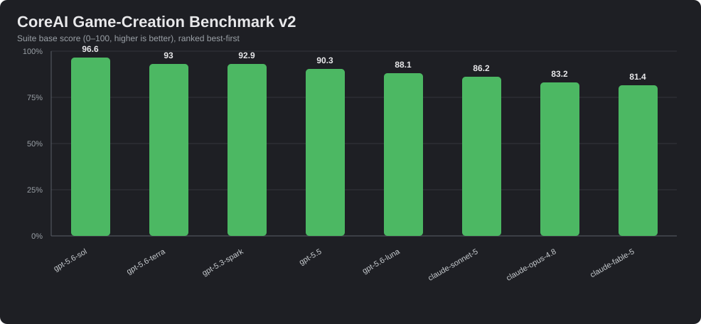

# CoreAI Game-Creation Benchmark — Community Leaderboard

This is the living public leaderboard for the [CoreAI Game-Creation Benchmark](../Assets/CoreAIBenchmark/README.md) (`com.neoxider.coreaibenchmark`). The benchmark measures how well an LLM can *build a game* inside CoreAI — not how well it can describe one. Each scenario drives the real `execute_lua` and `world_command` tools through eight scenario groups (G1 world building, G2 mechanic Lua, G3 reasoning/design, G4 playthroughs, G5 strict instruction-following, G6 free-build castle hero, G7 comprehensive integration, G8 observe-then-act), then grades the resulting world state, Lua logic slots, simulated playthroughs, screenshots, and tool-call trace into a 0-100 suite score. It is **not** a text-quality benchmark: a model can be a great conversationalist and still fail here if it cannot call tools correctly, obey constraints, or reason through game rules. The leaderboard exists to answer one practical question — "can this model build a game, and for which role?" — and anyone can submit results (see [Submit your model's score](#submit-your-models-score)).

G8's current "observe" input is a textual description of existing objects. It measures single-turn
conditional selection and mutation; it does not claim live scene sensing or sustained multi-turn recovery.

Full methodology: [benchmark guide](../Assets/CoreAIBenchmark/README.md) · [benchmark design](../Assets/CoreAIBenchmark/Tests/PlayMode/Benchmarks/BENCHMARK_DESIGN.md) · [example full report](Images/example_report/example_report.md).

## Suite Versioning Policy

Scores are only comparable **within the same suite version**. Scenario sets, checkpoint weights, penalties, and caps change between versions, so a v1.6 score and a hypothetical v1.7 score are different measurements even for the same model. The suite version is stamped into every report JSON (`suiteVersion`) and shown in the report header. When the suite version bumps, the leaderboard starts a new section; older sections are kept for history but never mixed into the current ranking.

**Current suite version: v1.7** (G1-G8, no token caps).

### Suite version history

| Suite | Status | Notes |
|---|---|---|
| v1.7 | **Current** | G1-G8; adds described-state conditional selection and benchmark v2 prompts. |
| v1.6 | Historical | G1-G7 scenario groups, six-dimension scoring, role fitness, mean-over-repetitions suite score. |
| < v1.6 | Retired | Pre-leaderboard development iterations; results were not published and are not comparable. |

## Leaderboard — Suite v1.7

### Frontier models (2026-07-11 maintainer sweep, G1–G8)



Run through the `cli-agents` `openai-server` bridge (an OpenAI-compatible shim over the Claude Code / Codex
CLIs). Ranked by suite base score. Per-group scores are G1…G8; see the benchmark README for the group legend.

| # | Model | Suite | Pass-rate | P/PA/F | G1 | G2 | G3 | G4 | G5 | G6 | G7 | G8 | Tokens | Submitted by |
|---:|---|---:|---:|---|---:|---:|---:|---:|---:|---:|---:|---:|---:|---|
| 1 | `codex/gpt-5.6-sol` | **96.6** | 85.7% | 24/3/1 | 96.3 | 100 | 100 | 100 | 100 | 63.9 | 100 | 96.3 | 16379 | maintainer |
| 2 | `codex/gpt-5.6-terra` | **93.0** | 86.2% | 25/2/2 | 95.6 | 100 | 84.2 | 97.7 | 99.7 | 62.9 | 100 | 96.3 | 32194 | maintainer |
| 3 | `codex/gpt-5.5` | **90.3** | 82.8% | 24/2/3 | 96.3 | 100 | 95.3 | 93 | 80 | 55.6 | 100 | 96.3 | 17188 | maintainer |
| 4 | `codex/gpt-5.6-luna` | **88.1** | 79.3% | 23/2/4 | 91.9 | 100 | 100 | 97.7 | 87.7 | 25.2 | 100 | 69.7 | 18426 | maintainer |
| 5 | `claude-sonnet-5` | **86.2** | 75.9% | 22/4/3 | 91.9 | 95.7 | 94.1 | 93 | 70 | 50 | 93.7 | 96.3 | 18250 | maintainer |
| 6 | `claude-opus-4.8` | **79.7** | 75.9% | 22/2/5 | 54.9 | 94.3 | 78.2 | 93 | 100 | 49 | 100 | 42.6 | 19851 | maintainer |
| 7 | `claude-fable-5` | **78.9** | 72.4% | 21/3/5 | 55.7 | 94.3 | 93 | 93 | 100 | 46 | 93.7 | 9.2 | 21980 | maintainer |

> Single run per model (reps=1), streaming off, native tools on, temperature 0.1, Unity 6000.3.14f1. Run over
> the CLI bridge, so absolute tokens/time are not comparable to a direct-API submission (tool-calling was
> verified equivalent to a native OpenAI backend first). The G6 image-feedback (vision) variant did not run —
> the CLI bridge is text + tool-calls only. Indicative single-shot results, not a controlled multi-rep A/B.
> A ranked public submission still requires the artifacts and hardware disclosure below.

## Historical Leaderboard — Suite v1.6

Column legend: **Suite** = 0-100 suite base score (ranking key) · **Pass-rate** = share of scenario runs that PASS · **P/PA/F** = PASS / PARTIAL / FAIL counts · **Tools** = tool correctness · **Intent** = intent and sequence · **Task** = task completion · **Determ** = determinism · **Reason** = reasoning · **Instr** = instruction adherence · **Eff** = effective tok/s (end-to-end) · **Tool-err** = failed tool-call rate · **Tokens** = completion tokens for the run · **Run** = run id (report timestamp).

### Cloud / frontier models

One full G1-G7 run each (suite v1.6, no token caps):

| # | Model | Suite | Pass-rate | P/PA/F | Tools | Intent | Task | Determ | Reason | Instr | Eff | Tool-err | Tokens | Run | Submitted by |
|---:|---|---:|---:|---|---:|---:|---:|---:|---:|---:|---:|---:|---:|---|---|
| 1 | `GPT-5.5` | **97** | 96% | 24/1/0 | 74.6 | 100 | 99.6 | 100 | 100 | 100 | 4.3 | 14.3% | 13789 | `20260703_024825` | maintainer |
| 2 | `glm-5.2` | **93.5** | 77.3% | 17/4/1 | 68.8 | 100 | 96.3 | 100 | 100 | 96.3 | 2 | 6.5% | 80861 | `20260702_234351` | maintainer |
| 3 | `GPT-5.3 Codex Spark` | **93.2** | 87.5% | 21/2/1 | 92.6 | 94.1 | 91.2 | 0 | 96.3 | 96.3 | 4.4 | 7.1% | 14009 | `20260703_033023` | maintainer |
| 4 | `claude-opus-4.8` | **92.9** | 87.5% | 21/3/0 | 59.3 | 94.1 | 99.5 | 100 | 100 | 96.3 | 3.3 | 10.4% | 25758 | `20260702_171849` | maintainer |
| 5 | `claude-haiku-4.5` | **92.7** | 80% | 20/4/1 | 86.8 | 91 | 99.6 | 100 | 100 | 83.8 | 3.5 | 1.4% | 36569 | `20260703_010715` | maintainer |
| 6 | `claude-fable-5` | **89.5** | 80% | 20/4/1 | 57.9 | 88.9 | 95.6 | 100 | 90 | 96.3 | 3.3 | 5.6% | 27312 | `20260702_191106` | maintainer |
| 7 | `claude-sonnet-5` | **88.2** | 84% | 21/1/3 | 72.8 | 94.4 | 92 | 100 | 100 | 78.7 | 4.2 | 10.6% | 16391 | `20260702_195533` | maintainer |

### Local models (LMStudio)

Same suite on consumer hardware. All existing rows come from the maintainer's single-machine LM Studio sweep (one model loaded at a time); the exact hardware spec is not published, which is one more reason local scores should be read per-machine — see [Disclaimers](#disclaimers). Community submissions must state their hardware.

| # | Model | Suite | Pass-rate | P/PA/F | Tools | Intent | Task | Determ | Reason | Instr | Eff | Tool-err | Tokens | Run | Submitted by |
|---:|---|---:|---:|---|---:|---:|---:|---:|---:|---:|---:|---:|---:|---|---|
| 1 | `qwen3.6-27b-heretic-…-imatrix-max` | **93.1** | 87% | 20/1/2 | 98 | 96.1 | 96.8 | 100 | 100 | 88 | 1.3 | 9.7% | 52495 | `20260702_062928` | maintainer |
| 2 | `deepreinforce-ai_ornith-1.0-9b` | **92.1** | 68.2% | 15/7/0 | 68.8 | 93.3 | 99.5 | 100 | 100 | 83.8 | 2.6 | 15.6% | 96801 | `20260702_093857` | maintainer |
| 3 | `qwen3.5-4b-mtp` | **92** | 84% | 21/3/1 | 93 | 100 | 93.5 | 100 | 100 | 91.7 | 4.7 | 11.9% | 62773 | `20260702_205410` | maintainer |
| 4 | `qwen3.6-27b-fable-5-experimental` | **87.3** | 73.7% | 14/3/2 | 85.9 | 83.3 | 88.9 | 100 | 80 | 83.8 | 1.9 | 32.2% | 58974 | `20260702_054314` | maintainer |
| 5 | `qwen3.5-2b` | **84.8** | 75% | 18/2/4 | 92.6 | 100 | 83.3 | 100 | 66.7 | 91.2 | 4.4 | 8.5% | 57656 | `20260702_225056` | maintainer |
| 6 | `deepreinforce-ai_ornith-1.0-35b` | **81.1** | 65.2% | 15/4/4 | 83.3 | 87.5 | 91.3 | 100 | 95.8 | 78.7 | 3.5 | 16.8% | 70744 | `20260702_101519` | maintainer |
| 7 | `qwythos-9b-claude-mythos-5-1m` | **81** | 62.5% | 15/5/4 | 69.4 | 84.6 | 91.7 | 100 | 88.9 | 78.7 | 3.2 | 18.2% | 63570 | `20260702_052949` | maintainer |
| 8 | `qwen3.5-0.8b` | **57.8** | 41.7% | 10/4/10 | 94.4 | 80.1 | 91.4 | 100 | 55.6 | 38 | 2.4 | 1% | 43383 | `20260702_222625` | maintainer |
| 9 | `lfm2-8b-a1b` | **12.4** | 0% | 0/0/25 | 50.9 | 2.1 | 0 | 0 | 0 | 57.8 | 0 | 0% | 52430 | `20260702_051709` | maintainer |

Comparison charts for these tables live in the repository README's [Game-Creation Benchmark section](../README.md#game-creation-benchmark), and are rebuilt from hand-picked report JSONs as described in [custom comparisons](../Assets/CoreAIBenchmark/README.md#custom-comparisons-from-hand-picked-reports).

## Submit Your Model's Score

Community submissions are welcome. The workflow:

### 1. Run the benchmark

Follow the [How To Run](../Assets/CoreAIBenchmark/README.md#how-to-run) section of the benchmark guide. In short:

- **Editor UI:** open `CoreAI/Benchmarks/Benchmark Window (UITK)...`, choose model / base URL, select all groups **G1-G8**, and start a run. For a repeat with the last saved settings use `CoreAI/Benchmarks/Run Game-Creation Benchmark`.
- **Batchmode / automation:**

  ```powershell
  Unity.exe -batchmode -projectPath C:\Git\CoreAI `
    -executeMethod CoreAI.Tests.EditMode.GameCreationBenchmarkLauncher.RunFromCli `
    -coreAiBenchmarkModel <your-model-id> `
    -coreAiBenchmarkGroups G1,G2,G3,G4,G5,G6,G7,G8 `
    -coreAiBenchmarkReps 3
  ```

- **Endpoint shaping:** point `COREAI_TEST_BASE_URL` at any OpenAI-compatible endpoint (e.g. LM Studio at `http://127.0.0.1:1234/v1`), plus `COREAI_TEST_API_KEY` / `COREAI_TEST_MODEL` as needed. `COREAI_BENCHMARK_REPS` of 3-5 smooths out noisy local-model runs (the suite score averages repetitions per scenario). For a multi-model sweep, load one model at a time as shown in the guide's LM Studio example.

Results are written to `TestResults/CoreAI/Benchmarks/BENCHMARK_<yyyyMMdd_HHmmss>_<model>.md` and `.json`. That folder is gitignored — reports never land in the repo by accident, so you attach them to the PR explicitly.

### 2. Open a PR against this file

Add one row to the appropriate table (cloud or local) with your name/handle in **Submitted by**, keeping the ranking sorted by Suite score. Required artifacts, attached to the PR (as PR attachment or linked gist — do not commit `TestResults/` contents into the repo):

| Artifact | Details |
|---|---|
| Report JSON | The full `BENCHMARK_<runid>_<model>.json` from `TestResults/CoreAI/Benchmarks/`. The `.md` report is a nice-to-have. |
| Run id | The `yyyyMMdd_HHmmss` timestamp from the report filename — goes into the **Run** column. |
| Model identity | Exact model id / file name and, for local models, the quantization (e.g. `Q4_K_M`, `imatrix`) and context length used. |
| Hardware | For local runs: GPU/CPU, VRAM/RAM, and the runtime (LM Studio / llama.cpp / other) with version. Cloud runs: provider + endpoint type. |
| Suite version | Must match the leaderboard section you are adding to (currently **v1.7**; check `suiteVersion` in your report JSON). |
| Settings | Groups run (full current submissions must be G1-G8), repetitions, any timeout overrides, and any non-default endpoint settings. |

### 3. What reviewers check

- The report JSON parses, its `suiteVersion` matches the section, and the table row matches the JSON's suite score, pass-rate, P/PA/F, dimension scores, tool-error rate, tokens, and run id.
- All eight groups G1-G8 were run for a current v1.7 submission (partial-group runs are not rankable — dimensions the run did not measure cannot be compared).
- The model id, quantization, and hardware declaration are plausible and complete.
- No signs of harness modification (scenario prompts, weights, penalties, or caps changed locally).

### 4. Honesty rules

- **First run counts.** Submit your first full run, or explicitly declare "best of N" / "run X of N" with all N run ids. Silent cherry-picking of the best run is grounds for removal.
- Repetitions *within* a run (`COREAI_BENCHMARK_REPS`) are fine and encouraged for local models — that averaging is part of the suite design. Discarding whole runs is what must be declared.
- Do not edit scenario definitions, weights, or grading code for a submitted run.
- Reruns after harness fixes or model updates are welcome as new rows/replacements — just say what changed.

## Disclaimers

- **Scores vary with setup.** Quantization, context length, sampler settings, runtime version, and endpoint behavior all move local-model scores, and speed columns (Eff) additionally depend on hardware. Treat local scores as "this model file, on this machine, with these settings", not as an absolute property of the model family.
- **This measures game-building tool use, not general intelligence.** The suite grades tool-call correctness, instruction adherence, determinism, and game-rule reasoning inside CoreAI's world. A low score does not mean a model is bad at chat, prose, or general coding — and a high score claims nothing beyond "this model can drive CoreAI's tools to build and reason about a game".
- Scores are only comparable within a suite version (see [Suite Versioning Policy](#suite-versioning-policy)).
- One-run scores carry noise; the PASS/PARTIAL/FAIL split and the dimension columns are often more informative than a single-point suite-score gap of a point or two.
