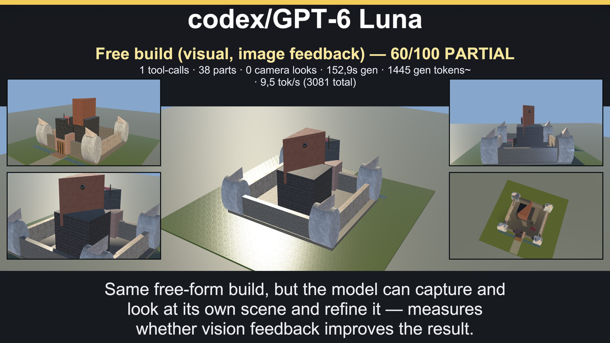
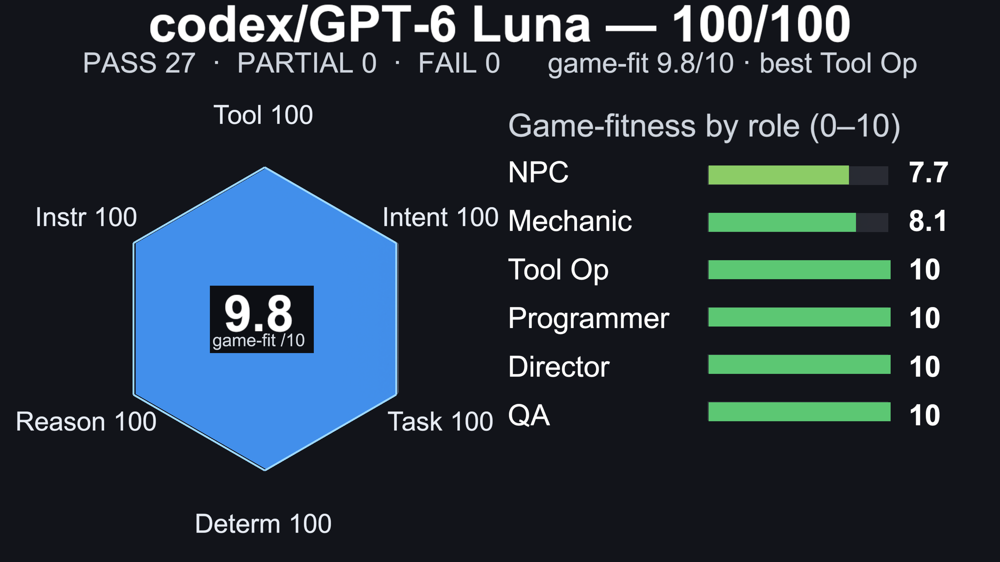
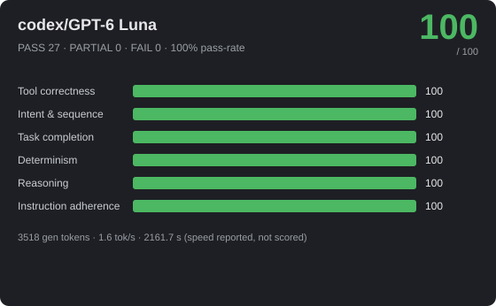
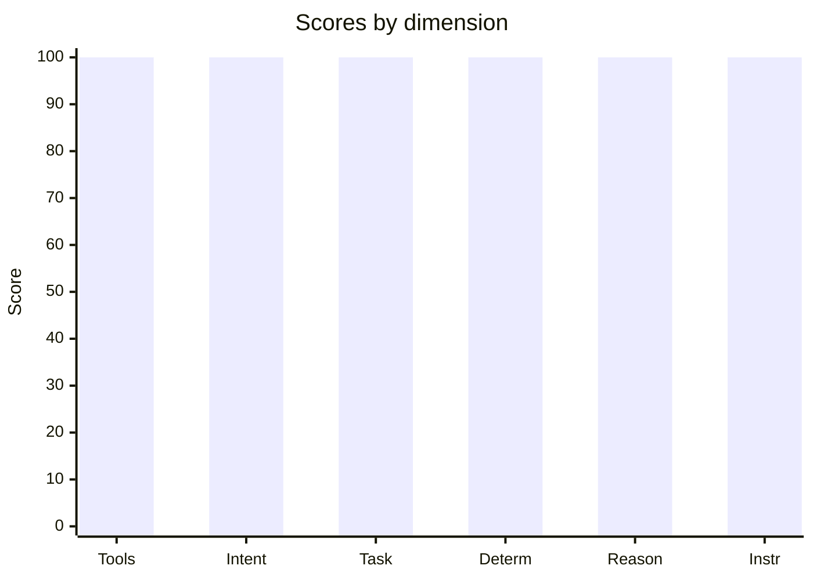

# 🎮 codex/GPT-6 Luna — 100/100



_Hero: G6 free-build visual scene, preserving the model-authored layout._







> **Excellent** · PASS 27 / PARTIAL 0 / FAIL 0 · pass-rate 100% · mean bonus 5.7 · reps 1 · CoreAI Game-Creation Benchmark v2

- **By group:** G1 100/100 (3/3 pass) · G2 100/100 (5/5 pass) · G3 100/100 (6/6 pass) · G4 100/100 (3/3 pass) · G5 100/100 (6/6 pass) · G7 100/100 (1/1 pass) · G8 100/100 (3/3 pass)
- **Best:** Crafting rules engine (100) · **Worst:** Crafting rules engine (100)
- **Cost of run:** 18033 tokens (3518 generated) · 1.6 tok/s provider-call (prefill+decode; effective 1.6 across the agentic session) · $0 · 2161.7 s total
- **Model setup:** backend `OpenAiCompatibleHttp` · native-tools True · streaming True · temp 0.1 · reps 1 · parallel-tools 4
- **Run:** `20260929_154152` (2026-09-29T10:41:52.2135762Z) · Unity 6000.3.14f1 · suite 1.15

> ⚠ **Not a clean model measurement:** 0 framework-failure(s), 1 environment-failure(s) — see details below.

## 📐 Summary by dimension

<svg xmlns="http://www.w3.org/2000/svg" width="640" height="244" viewBox="0 0 640 244" font-family="Segoe UI, Arial, sans-serif"><rect width="640" height="244" rx="10" fill="#1e1f24"/><text x="20" y="39" fill="#c8ccd0" font-size="12">Tool correctness</text><rect x="174" y="24" width="340" height="16" rx="4" fill="#33353b"/><rect x="174" y="24" width="340" height="16" rx="4" fill="#4cb863"/><text x="528" y="37" fill="#e8e8ea" font-size="12">100/100</text><text x="20" y="67" fill="#c8ccd0" font-size="12">Intent &amp; sequence</text><rect x="174" y="52" width="340" height="16" rx="4" fill="#33353b"/><rect x="174" y="52" width="340" height="16" rx="4" fill="#4cb863"/><text x="528" y="65" fill="#e8e8ea" font-size="12">100/100</text><text x="20" y="95" fill="#c8ccd0" font-size="12">Task completion</text><rect x="174" y="80" width="340" height="16" rx="4" fill="#33353b"/><rect x="174" y="80" width="340" height="16" rx="4" fill="#4cb863"/><text x="528" y="93" fill="#e8e8ea" font-size="12">100/100</text><text x="20" y="123" fill="#c8ccd0" font-size="12">Determinism</text><rect x="174" y="108" width="340" height="16" rx="4" fill="#33353b"/><rect x="174" y="108" width="340" height="16" rx="4" fill="#4cb863"/><text x="528" y="121" fill="#e8e8ea" font-size="12">100/100</text><text x="20" y="151" fill="#c8ccd0" font-size="12">Reasoning</text><rect x="174" y="136" width="340" height="16" rx="4" fill="#33353b"/><rect x="174" y="136" width="340" height="16" rx="4" fill="#4cb863"/><text x="528" y="149" fill="#e8e8ea" font-size="12">100/100</text><text x="20" y="179" fill="#c8ccd0" font-size="12">Instruction adherence</text><rect x="174" y="164" width="340" height="16" rx="4" fill="#33353b"/><rect x="174" y="164" width="340" height="16" rx="4" fill="#4cb863"/><text x="528" y="177" fill="#e8e8ea" font-size="12">100/100</text><text x="20" y="207" fill="#c8ccd0" font-size="12">Efficiency bonus</text><rect x="174" y="192" width="340" height="16" rx="4" fill="#33353b"/><rect x="174" y="192" width="0" height="16" rx="4" fill="#dc5c57"/><text x="528" y="205" fill="#e8e8ea" font-size="12">0/20</text></svg>




## 🎯 Game-fitness — 9.8/10  (best: Scene / Tool Operator)

| Role | Fit | Verdict | Why |
|---|---:|---|---|
| NPC / Dialogue | **7.7/10** | 🟢 Usable | simple in-character turns with occasional tool use. Weakest: speed 7. |
| Mechanic / GameMaster | **8.1/10** | ✅ Strong fit | drives runtime gameplay — needs strict instructions, valid tools, and speed. Weakest: speed 7. |
| Scene / Tool Operator | **10/10** | ✅ Strong fit | builds/edits scenes — fails fast when tool calls or ordering are unreliable. Weakest: tool correctness 100. |
| Programmer / Logic Author | **10/10** | ✅ Strong fit | authors game logic — needs reasoning plus reliable tool use, not speed. Weakest: reasoning 100. |
| Orchestrator / Director | **10/10** | ✅ Strong fit | multi-step control — current suite mostly measures task-level sequencing, not sustained multi-turn orchestration; needs high reasoning, sequencing, and instruction-following. Weakest: reasoning 100. |
| QA / Regression Judge | **10/10** | ✅ Strong fit | validation — needs stable, rule-following judgments. Weakest: determinism 100. |

## 🔧 Tool-call statistics

- **Total tool calls:** 55 · failed 1 · invalid world commands 0 · error-rate 1.8%

| Scenario | Group | Turns | Tool calls | Failed | Invalid | Tokens |
|---|---|---:|---:|---:|---:|---:|
| Crafting rules engine | G2 | 1 | 1 | 0 | 0 | ~618 |
| Flat damage buff | G2 | 1 | 1 | 0 | 0 | ~488 |
| Level-scaled damage | G2 | 1 | 1 | 0 | 0 | ~503 |
| Multi-arg damage formula | G2 | 1 | 1 | 0 | 0 | ~528 |
| Score win condition | G2 | 1 | 1 | 0 | 0 | ~494 |
| Coin collector | G1 | 1 | 6 | 0 | 0 | ~724 |
| Constraint budget | G1 | 1 | 3 | 0 | 0 | ~546 |
| Spawn arena | G1 | 1 | 1 | 0 | 0 | ~553 |
| Exactly three actions | G5 | 1 | 3 | 0 | 0 | ~516 |
| Forbidden tool (no Lua) | G5 | 1 | 2 | 0 | 0 | ~481 |
| Ordered spawn | G5 | 1 | 3 | 0 | 0 | ~515 |
| Protected chest | G5 | 1 | 2 | 0 | 0 | ~510 |
| Spawn-only build | G5 | 1 | 3 | 0 | 0 | ~514 |
| Tool-call budget | G5 | 1 | 1 | 0 | 0 | ~470 |
| Free build (visual, image feedback) | G6 | 1 | 1 | 1 | 0 | ~3081 |
| Balanced enemy HP | G3 | 1 | 5 | 0 | 0 | ~647 |
| Dungeon win logic | G3 | 1 | 4 | 0 | 0 | ~615 |
| Clamped HP regen | G3 | 1 | 1 | 0 | 0 | ~515 |
| Fibonacci wave rewards | G3 | 1 | 1 | 0 | 0 | ~567 |
| Quadratic combo score | G3 | 1 | 1 | 0 | 0 | ~499 |
| Tiered shop pricing | G3 | 1 | 1 | 0 | 0 | ~540 |
| Selective raise | G8 | 1 | 2 | 0 | 0 | ~504 |
| State-driven rule | G8 | 1 | 1 | 0 | 0 | ~553 |
| Tidy the scene | G8 | 1 | 2 | 0 | 0 | ~525 |
| Combat playthrough | G4 | 1 | 1 | 0 | 0 | ~600 |
| Crafting chain playthrough | G4 | 1 | 1 | 0 | 0 | ~569 |
| Shop playthrough | G4 | 1 | 1 | 0 | 0 | ~596 |
| Integration puzzle | G7 | 1 | 4 | 0 | 0 | ~762 |

## 🏁 Scenario scores

| Scenario | Group | Base | Bonus (eff) | Total | Verdict | s |
|---|---|---:|---:|---:|---|---:|
| Crafting rules engine | G2 | 100 | 6 (0) | 106 | ✅ PASS | 59.2 |
| Flat damage buff | G2 | 100 | 4 (0) | 104 | ✅ PASS | 48 |
| Level-scaled damage | G2 | 100 | 4 (0) | 104 | ✅ PASS | 49.8 |
| Multi-arg damage formula | G2 | 100 | 5 (0) | 105 | ✅ PASS | 76.9 |
| Score win condition | G2 | 100 | 4 (0) | 104 | ✅ PASS | 91.4 |
| Coin collector | G1 | 100 | 6 (0) | 106 | ✅ PASS | 82 |
| Constraint budget | G1 | 100 | 5 (0) | 105 | ✅ PASS | 76 |
| Spawn arena | G1 | 100 | 5 (0) | 105 | ✅ PASS | 75.1 |
| Exactly three actions | G5 | 100 | 5 (0) | 105 | ✅ PASS | 132.6 |
| Forbidden tool (no Lua) | G5 | 100 | 5 (0) | 105 | ✅ PASS | 93.4 |
| Ordered spawn | G5 | 100 | 6 (0) | 106 | ✅ PASS | 78.2 |
| Protected chest | G5 | 100 | 5 (0) | 105 | ✅ PASS | 124.5 |
| Spawn-only build | G5 | 100 | 5 (0) | 105 | ✅ PASS | 111 |
| Tool-call budget | G5 | 100 | 6 (0) | 106 | ✅ PASS | 69 |
| Free build (visual, image feedback) | G6 | 60 | 0 (0) | 60 | 🟡 PARTIAL | 152.9 |
| Balanced enemy HP | G3 | 100 | 7 (0) | 107 | ✅ PASS | 93.1 |
| Dungeon win logic | G3 | 100 | 6 (0) | 106 | ✅ PASS | 62.4 |
| Clamped HP regen | G3 | 100 | 6 (0) | 106 | ✅ PASS | 51.5 |
| Fibonacci wave rewards | G3 | 100 | 7 (0) | 107 | ✅ PASS | 55.4 |
| Quadratic combo score | G3 | 100 | 5 (0) | 105 | ✅ PASS | 60.8 |
| Tiered shop pricing | G3 | 100 | 6 (0) | 106 | ✅ PASS | 64.8 |
| Selective raise | G8 | 100 | 5 (0) | 105 | ✅ PASS | 69.4 |
| State-driven rule | G8 | 100 | 5 (0) | 105 | ✅ PASS | 94.3 |
| Tidy the scene | G8 | 100 | 5 (0) | 105 | ✅ PASS | 58.2 |
| Combat playthrough | G4 | 100 | 8 (0) | 108 | ✅ PASS | 53.5 |
| Crafting chain playthrough | G4 | 100 | 8 (0) | 108 | ✅ PASS | 69 |
| Shop playthrough | G4 | 100 | 8 (0) | 108 | ✅ PASS | 50.9 |
| Integration puzzle | G7 | 100 | 8 (0) | 108 | ✅ PASS | 58.3 |

_Base 0..100; Bonus = correctness + efficiency (fewer tokens & less time than budget), capped 20. `~tokens` = BPE estimate (provider usage unavailable)._

## Failed checkpoints

### Free build (visual, image feedback)
- ❌ run failure (Environment): provider error: stream failed after 1 executed tool call(s): HTTP error 500: bridge request failed
- [opt] no failed tool calls (w10) — 1 calls, 1 failed
- [MANDATORY] built at least 40 castle parts (w16) — 38 parts in the world
- [opt] went beyond a couple of stone-and-wood defaults (w8) — 18 materials
- [opt] kept building past a bare wall ring (w8) — 38 parts

---
## Full model session

### G2 · Crafting rules engine

```text
GOAL: The game has a logic slot 'craft_result(a, b)' that returns the item crafted from two ingredients, or the string 'none' if the pair is not a valid recipe. The recipes are:
  wood  + wood = plank
  plank + plank = table
  iron  + coal = steel
  wood  + coal = torch
Recipes are order-independent (wood+coal and coal+wood both give torch). Using execute_lua, define the slot, for example:
logic_define('craft_result', function(a, b) ... return 'plank' ... end)
After defining a slot, do not call the slot name directly as a global Lua function to self-verify; the benchmark harness invokes registered logic slots with hidden samples.

--- turn 1 ---
ASSISTANT: The `craft_result` slot was defined successfully.
TOOL: execute_lua (ok, 145ms, native) — {"Success":true,"Output":"ok"}

--- system prompt ---
CRITICAL RULES FOR ALL AGENTS:
1. TOOL CALLING: When tools/functions are available, you MUST use them (function calling format). NEVER output JSON in your text response if tools are available to do the job.
2. STRICT ADHERENCE: You must follow the user's task or hint EXACTLY. Do not hallucinate, invent, or add creative flair to tool arguments unless strictly requested.
3. NO CHIT-CHAT: Respond concisely. Do not explain what you are doing unless asked.
4. TOOL LIFECYCLE: If a tool returns a success message, continue with the NEXT step of the task. Do not call the same tool again with the same arguments.
You are the GameMaster. Build exactly what the player asks using the available tools. Prefer the smallest correct set of tool calls.

## Tool Contract
You have native tool-calling available for this role. When the user/task asks to use or call a tool, call the matching tool through the tool interface; do not claim that the tool is unavailable, and do not simulate successful execution in prose.
Pass arguments as structured tool arguments matching the schema. Required values mentioned in the task must be passed as tool arguments, not only described in text.
After a tool succeeds, summarize the real tool result briefly for the user.
Natural-language-only descriptions (for example that you "used memory" or "called append") never execute tools and never persist data - they must not replace an actual invocation.

```

### G2 · Flat damage buff

```text
GOAL: The game has a runtime logic slot 'calculate_damage'. Players say the game is too easy. Using the execute_lua tool, run exactly:
logic_define('calculate_damage', function() return 50 end)
so that calculate_damage() returns 50. After defining a slot, do not call the slot name directly as a global Lua function to self-verify; the benchmark harness invokes registered logic slots with hidden samples.

--- turn 1 ---
ASSISTANT: `calculate_damage` was defined to return 50. The tool reported success.
TOOL: execute_lua (ok, 4ms, native) — {"Success":true,"Output":"ok"}

--- system prompt ---
CRITICAL RULES FOR ALL AGENTS:
1. TOOL CALLING: When tools/functions are available, you MUST use them (function calling format). NEVER output JSON in your text response if tools are available to do the job.
2. STRICT ADHERENCE: You must follow the user's task or hint EXACTLY. Do not hallucinate, invent, or add creative flair to tool arguments unless strictly requested.
3. NO CHIT-CHAT: Respond concisely. Do not explain what you are doing unless asked.
4. TOOL LIFECYCLE: If a tool returns a success message, continue with the NEXT step of the task. Do not call the same tool again with the same arguments.
You are the GameMaster. Build exactly what the player asks using the available tools. Prefer the smallest correct set of tool calls.

## Tool Contract
You have native tool-calling available for this role. When the user/task asks to use or call a tool, call the matching tool through the tool interface; do not claim that the tool is unavailable, and do not simulate successful execution in prose.
Pass arguments as structured tool arguments matching the schema. Required values mentioned in the task must be passed as tool arguments, not only described in text.
After a tool succeeds, summarize the real tool result briefly for the user.
Natural-language-only descriptions (for example that you "used memory" or "called append") never execute tools and never persist data - they must not replace an actual invocation.

```

### G2 · Level-scaled damage

```text
GOAL: The game has a logic slot 'calculate_damage'. Using execute_lua, define it so damage equals 10 times the level passed as the first argument. Run exactly this shape:
logic_define('calculate_damage', function(level) return 10 * level end)
For example level 1 -> 10, level 5 -> 50. After defining a slot, do not call the slot name directly as a global Lua function to self-verify; the benchmark harness invokes registered logic slots with hidden samples.

--- turn 1 ---
ASSISTANT: Defined `calculate_damage` to return `10 * level`. The tool reported success.
TOOL: execute_lua (ok, 3ms, native) — {"Success":true,"Output":"ok"}

--- system prompt ---
CRITICAL RULES FOR ALL AGENTS:
1. TOOL CALLING: When tools/functions are available, you MUST use them (function calling format). NEVER output JSON in your text response if tools are available to do the job.
2. STRICT ADHERENCE: You must follow the user's task or hint EXACTLY. Do not hallucinate, invent, or add creative flair to tool arguments unless strictly requested.
3. NO CHIT-CHAT: Respond concisely. Do not explain what you are doing unless asked.
4. TOOL LIFECYCLE: If a tool returns a success message, continue with the NEXT step of the task. Do not call the same tool again with the same arguments.
You are the GameMaster. Build exactly what the player asks using the available tools. Prefer the smallest correct set of tool calls.

## Tool Contract
You have native tool-calling available for this role. When the user/task asks to use or call a tool, call the matching tool through the tool interface; do not claim that the tool is unavailable, and do not simulate successful execution in prose.
Pass arguments as structured tool arguments matching the schema. Required values mentioned in the task must be passed as tool arguments, not only described in text.
After a tool succeeds, summarize the real tool result briefly for the user.
Natural-language-only descriptions (for example that you "used memory" or "called append") never execute tools and never persist data - they must not replace an actual invocation.

```

### G2 · Multi-arg damage formula

```text
GOAL: The game has a logic slot 'calculate_damage' that receives three arguments: base, level, armor. Using execute_lua, define it so the result is base + level*10 - armor, but never below 0. Run a shape like:
logic_define('calculate_damage', function(base, level, armor) local d = base + level*10 - armor; if d < 0 then d = 0 end; return d end)
After defining a slot, do not call the slot name directly as a global Lua function to self-verify; the benchmark harness invokes registered logic slots with hidden samples.

--- turn 1 ---
ASSISTANT: Defined `calculate_damage` successfully.
TOOL: execute_lua (ok, 4ms, native) — {"Success":true,"Output":"ok"}

--- system prompt ---
CRITICAL RULES FOR ALL AGENTS:
1. TOOL CALLING: When tools/functions are available, you MUST use them (function calling format). NEVER output JSON in your text response if tools are available to do the job.
2. STRICT ADHERENCE: You must follow the user's task or hint EXACTLY. Do not hallucinate, invent, or add creative flair to tool arguments unless strictly requested.
3. NO CHIT-CHAT: Respond concisely. Do not explain what you are doing unless asked.
4. TOOL LIFECYCLE: If a tool returns a success message, continue with the NEXT step of the task. Do not call the same tool again with the same arguments.
You are the GameMaster. Build exactly what the player asks using the available tools. Prefer the smallest correct set of tool calls.

## Tool Contract
You have native tool-calling available for this role. When the user/task asks to use or call a tool, call the matching tool through the tool interface; do not claim that the tool is unavailable, and do not simulate successful execution in prose.
Pass arguments as structured tool arguments matching the schema. Required values mentioned in the task must be passed as tool arguments, not only described in text.
After a tool succeeds, summarize the real tool result briefly for the user.
Natural-language-only descriptions (for example that you "used memory" or "called append") never execute tools and never persist data - they must not replace an actual invocation.

```

### G2 · Score win condition

```text
GOAL: The game has a boolean logic slot 'win_condition'. Using execute_lua, define it so the player wins exactly when their score (first argument) is at least 100. Run exactly this shape:
logic_define('win_condition', function(score) return score >= 100 end)
After defining a slot, do not call the slot name directly as a global Lua function to self-verify; the benchmark harness invokes registered logic slots with hidden samples.

--- turn 1 ---
ASSISTANT: Defined `win_condition` as `score >= 100`. The tool returned `ok`.
TOOL: execute_lua (ok, 3ms, native) — {"Success":true,"Output":"ok"}

--- system prompt ---
CRITICAL RULES FOR ALL AGENTS:
1. TOOL CALLING: When tools/functions are available, you MUST use them (function calling format). NEVER output JSON in your text response if tools are available to do the job.
2. STRICT ADHERENCE: You must follow the user's task or hint EXACTLY. Do not hallucinate, invent, or add creative flair to tool arguments unless strictly requested.
3. NO CHIT-CHAT: Respond concisely. Do not explain what you are doing unless asked.
4. TOOL LIFECYCLE: If a tool returns a success message, continue with the NEXT step of the task. Do not call the same tool again with the same arguments.
You are the GameMaster. Build exactly what the player asks using the available tools. Prefer the smallest correct set of tool calls.

## Tool Contract
You have native tool-calling available for this role. When the user/task asks to use or call a tool, call the matching tool through the tool interface; do not claim that the tool is unavailable, and do not simulate successful execution in prose.
Pass arguments as structured tool arguments matching the schema. Required values mentioned in the task must be passed as tool arguments, not only described in text.
After a tool succeeds, summarize the real tool result briefly for the user.
Natural-language-only descriptions (for example that you "used memory" or "called append") never execute tools and never persist data - they must not replace an actual invocation.

```

### G1 · Coin collector

```text
GOAL: Build a simple coin-collector game.
1. With world_command action='spawn', create the playable objects: a 'Player', three coins named 'Coin1', 'Coin2', 'Coin3', and a 'Goal'. Pick fitting primitive shapes yourself and place them at distinct positions so the layout is playable. Spawn only these five objects.
2. With execute_lua, define two logic slots: a 'score_formula' that takes the number of coins collected and returns the score (one point per coin), and a 'win_condition' that takes the score and returns true once the player has collected at least 3 coins. Use logic_define('name', function(...) ... end); work out the bodies yourself.
After defining a slot, do not call the slot name directly as a global Lua function to self-verify; the benchmark harness invokes registered logic slots with hidden samples.

--- turn 1 ---
ASSISTANT: {}
TOOL: world_command (ok, 63ms, native) — {"Success":true,"Message":"World command 'spawn' executed successfully at (0,1,0)","Action":"spawn"}
TOOL: world_command (ok, 3ms, native) — {"Success":true,"Message":"World command 'spawn' executed successfully at (3,1,0)","Action":"spawn"}
TOOL: world_command (ok, 3ms, native) — {"Success":true,"Message":"World command 'spawn' executed successfully at (0,1,3)","Action":"spawn"}
TOOL: world_command (ok, 5ms, native) — {"Success":true,"Message":"World command 'spawn' executed successfully at (-3,1,0)","Action":"spawn"}
TOOL: world_command (ok, 4ms, native) — {"Success":true,"Message":"World command 'spawn' executed successfully at (0,1,-3)","Action":"spawn"}
TOOL: execute_lua (ok, 3ms, native) — {"Success":true,"Output":"ok"}

--- system prompt ---
CRITICAL RULES FOR ALL AGENTS:
1. TOOL CALLING: When tools/functions are available, you MUST use them (function calling format). NEVER output JSON in your text response if tools are available to do the job.
2. STRICT ADHERENCE: You must follow the user's task or hint EXACTLY. Do not hallucinate, invent, or add creative flair to tool arguments unless strictly requested.
3. NO CHIT-CHAT: Respond concisely. Do not explain what you are doing unless asked.
4. TOOL LIFECYCLE: If a tool returns a success message, continue with the NEXT step of the task. Do not call the same tool again with the same arguments.
You are the GameMaster. Build exactly what the player asks using the available tools. Prefer the smallest correct set of tool calls.

## Tool Contract
You have native tool-calling available for this role. When the user/task asks to use or call a tool, call the matching tool through the tool interface; do not claim that the tool is unavailable, and do not simulate successful execution in prose.
Pass arguments as structured tool arguments matching the schema. Required values mentioned in the task must be passed as tool arguments, not only described in text.
After a tool succeeds, summarize the real tool result briefly for the user.
Natural-language-only descriptions (for example that you "used memory" or "called append") never execute tools and never persist data - they must not replace an actual invocation.

```

### G1 · Constraint budget

```text
GOAL: Spawn exactly three objects and do nothing else. Use world_command action='spawn' with distinct targetName and a fitting primitive prefabKey: 'Tree' (capsule), 'Rock' (sphere), 'Bush' (sphere). Place them at three distinct x/z positions. Do not spawn extra objects, do not move or destroy anything.

--- turn 1 ---
ASSISTANT: The three objects spawned successfully: Tree at (0, 0, 0), Rock at (3, 0, 2), and Bush at (-3, 0, 4).
TOOL: world_command (ok, 2ms, native) — {"Success":true,"Message":"World command 'spawn' executed successfully at (0,0,0)","Action":"spawn"}
TOOL: world_command (ok, 2ms, native) — {"Success":true,"Message":"World command 'spawn' executed successfully at (3,0,2)","Action":"spawn"}
TOOL: world_command (ok, 2ms, native) — {"Success":true,"Message":"World command 'spawn' executed successfully at (-3,0,4)","Action":"spawn"}

--- system prompt ---
CRITICAL RULES FOR ALL AGENTS:
1. TOOL CALLING: When tools/functions are available, you MUST use them (function calling format). NEVER output JSON in your text response if tools are available to do the job.
2. STRICT ADHERENCE: You must follow the user's task or hint EXACTLY. Do not hallucinate, invent, or add creative flair to tool arguments unless strictly requested.
3. NO CHIT-CHAT: Respond concisely. Do not explain what you are doing unless asked.
4. TOOL LIFECYCLE: If a tool returns a success message, continue with the NEXT step of the task. Do not call the same tool again with the same arguments.
You are the GameMaster. Build exactly what the player asks using the available tools. Prefer the smallest correct set of tool calls.

## Tool Contract
You have native tool-calling available for this role. When the user/task asks to use or call a tool, call the matching tool through the tool interface; do not claim that the tool is unavailable, and do not simulate successful execution in prose.
Pass arguments as structured tool arguments matching the schema. Required values mentioned in the task must be passed as tool arguments, not only described in text.
After a tool succeeds, summarize the real tool result briefly for the user.
Natural-language-only descriptions (for example that you "used memory" or "called append") never execute tools and never persist data - they must not replace an actual invocation.

```

### G1 · Spawn arena

```text
GOAL: Set up a small combat arena with the world_command tool: one player and four enemies. Give them the clear names 'Player', 'Enemy1', 'Enemy2', 'Enemy3', 'Enemy4', pick whatever primitive shape you think best represents each, and place them at distinct positions so they don't overlap. Build only what was asked — the player and the four enemies, nothing else.

--- turn 1 ---
ASSISTANT: {"success":true,"message":"Five objects spawned: Player and Enemy1–Enemy4, each at a distinct position.","action":"spawn_batch"}
TOOL: world_command (ok, 37ms, native) — {"Success":true,"Message":"{\"ok\":true,\"spawned\":5,\"failed\":0,\"names\":[\"Player\",\"Enemy1\",\"Enemy2\",\"Enemy3\",\"Enemy4\"]}","Action":"spawn_batch"}

--- system prompt ---
CRITICAL RULES FOR ALL AGENTS:
1. TOOL CALLING: When tools/functions are available, you MUST use them (function calling format). NEVER output JSON in your text response if tools are available to do the job.
2. STRICT ADHERENCE: You must follow the user's task or hint EXACTLY. Do not hallucinate, invent, or add creative flair to tool arguments unless strictly requested.
3. NO CHIT-CHAT: Respond concisely. Do not explain what you are doing unless asked.
4. TOOL LIFECYCLE: If a tool returns a success message, continue with the NEXT step of the task. Do not call the same tool again with the same arguments.
You are the GameMaster. Build exactly what the player asks using the available tools. Prefer the smallest correct set of tool calls.

## Tool Contract
You have native tool-calling available for this role. When the user/task asks to use or call a tool, call the matching tool through the tool interface; do not claim that the tool is unavailable, and do not simulate successful execution in prose.
Pass arguments as structured tool arguments matching the schema. Required values mentioned in the task must be passed as tool arguments, not only described in text.
After a tool succeeds, summarize the real tool result briefly for the user.
Natural-language-only descriptions (for example that you "used memory" or "called append") never execute tools and never persist data - they must not replace an actual invocation.

```

### G5 · Exactly three actions

```text
GOAL: Perform EXACTLY three world_command actions and nothing else: spawn 'Player', spawn 'Goal', spawn 'Hazard' (action='spawn', prefabKey='Cube'). Do not issue a fourth action, do not repeat any, do not call any other tool.

--- turn 1 ---
ASSISTANT: All three `spawn` actions succeeded: Player, Goal, and Hazard.
TOOL: world_command (ok, 5ms, native) — {"Success":true,"Message":"World command 'spawn' executed successfully at (0,0,0)","Action":"spawn"}
TOOL: world_command (ok, 5ms, native) — {"Success":true,"Message":"World command 'spawn' executed successfully at (0,0,0)","Action":"spawn"}
TOOL: world_command (ok, 4ms, native) — {"Success":true,"Message":"World command 'spawn' executed successfully at (0,0,0)","Action":"spawn"}

--- system prompt ---
CRITICAL RULES FOR ALL AGENTS:
1. TOOL CALLING: When tools/functions are available, you MUST use them (function calling format). NEVER output JSON in your text response if tools are available to do the job.
2. STRICT ADHERENCE: You must follow the user's task or hint EXACTLY. Do not hallucinate, invent, or add creative flair to tool arguments unless strictly requested.
3. NO CHIT-CHAT: Respond concisely. Do not explain what you are doing unless asked.
4. TOOL LIFECYCLE: If a tool returns a success message, continue with the NEXT step of the task. Do not call the same tool again with the same arguments.
You are the GameMaster. Build exactly what the player asks using the available tools. Prefer the smallest correct set of tool calls.

## Tool Contract
You have native tool-calling available for this role. When the user/task asks to use or call a tool, call the matching tool through the tool interface; do not claim that the tool is unavailable, and do not simulate successful execution in prose.
Pass arguments as structured tool arguments matching the schema. Required values mentioned in the task must be passed as tool arguments, not only described in text.
After a tool succeeds, summarize the real tool result briefly for the user.
Natural-language-only descriptions (for example that you "used memory" or "called append") never execute tools and never persist data - they must not replace an actual invocation.

```

### G5 · Forbidden tool (no Lua)

```text
GOAL: Using world_command (action='spawn', prefabKey='Cube'), spawn two objects named 'Player' and 'Goal'. Constraint: solve this with the world tool ONLY — you must NOT call execute_lua at all.

--- turn 1 ---
ASSISTANT: Spawned two Cube objects named `Player` and `Goal` successfully.
TOOL: world_command (ok, 3ms, native) — {"Success":true,"Message":"World command 'spawn' executed successfully at (0,0,0)","Action":"spawn"}
TOOL: world_command (ok, 3ms, native) — {"Success":true,"Message":"World command 'spawn' executed successfully at (0,0,0)","Action":"spawn"}

--- system prompt ---
CRITICAL RULES FOR ALL AGENTS:
1. TOOL CALLING: When tools/functions are available, you MUST use them (function calling format). NEVER output JSON in your text response if tools are available to do the job.
2. STRICT ADHERENCE: You must follow the user's task or hint EXACTLY. Do not hallucinate, invent, or add creative flair to tool arguments unless strictly requested.
3. NO CHIT-CHAT: Respond concisely. Do not explain what you are doing unless asked.
4. TOOL LIFECYCLE: If a tool returns a success message, continue with the NEXT step of the task. Do not call the same tool again with the same arguments.
You are the GameMaster. Build exactly what the player asks using the available tools. Prefer the smallest correct set of tool calls.

## Tool Contract
You have native tool-calling available for this role. When the user/task asks to use or call a tool, call the matching tool through the tool interface; do not claim that the tool is unavailable, and do not simulate successful execution in prose.
Pass arguments as structured tool arguments matching the schema. Required values mentioned in the task must be passed as tool arguments, not only described in text.
After a tool succeeds, summarize the real tool result briefly for the user.
Natural-language-only descriptions (for example that you "used memory" or "called append") never execute tools and never persist data - they must not replace an actual invocation.

```

### G5 · Ordered spawn

```text
GOAL: Spawn three objects in this EXACT order (world_command action='spawn', prefabKey='Cube', set targetName): first 'Gate', then 'Player', then 'Flag'. The order matters — Gate must be the first spawn and Flag the last.

--- turn 1 ---
ASSISTANT: Spawned `Gate`, `Player`, then `Flag` in the requested order.
TOOL: world_command (ok, 3ms, native) — {"Success":true,"Message":"World command 'spawn' executed successfully at (0,0,0)","Action":"spawn"}
TOOL: world_command (ok, 2ms, native) — {"Success":true,"Message":"World command 'spawn' executed successfully at (0,0,0)","Action":"spawn"}
TOOL: world_command (ok, 2ms, native) — {"Success":true,"Message":"World command 'spawn' executed successfully at (0,0,0)","Action":"spawn"}

--- system prompt ---
CRITICAL RULES FOR ALL AGENTS:
1. TOOL CALLING: When tools/functions are available, you MUST use them (function calling format). NEVER output JSON in your text response if tools are available to do the job.
2. STRICT ADHERENCE: You must follow the user's task or hint EXACTLY. Do not hallucinate, invent, or add creative flair to tool arguments unless strictly requested.
3. NO CHIT-CHAT: Respond concisely. Do not explain what you are doing unless asked.
4. TOOL LIFECYCLE: If a tool returns a success message, continue with the NEXT step of the task. Do not call the same tool again with the same arguments.
You are the GameMaster. Build exactly what the player asks using the available tools. Prefer the smallest correct set of tool calls.

## Tool Contract
You have native tool-calling available for this role. When the user/task asks to use or call a tool, call the matching tool through the tool interface; do not claim that the tool is unavailable, and do not simulate successful execution in prose.
Pass arguments as structured tool arguments matching the schema. Required values mentioned in the task must be passed as tool arguments, not only described in text.
After a tool succeeds, summarize the real tool result briefly for the user.
Natural-language-only descriptions (for example that you "used memory" or "called append") never execute tools and never persist data - they must not replace an actual invocation.

```

### G5 · Protected chest

```text
GOAL: A 'Chest' object already exists in the scene and must NOT be touched. Using world_command (action='spawn', prefabKey='Cube'), spawn two objects named 'Key' and 'Door'. Important constraint: never move, destroy, or otherwise target the 'Chest' — leave it completely alone.

--- turn 1 ---
ASSISTANT: Both `Cube` objects were spawned successfully: `Key` and `Door`. The existing `Chest` was left alone.
TOOL: world_command (ok, 4ms, native) — {"Success":true,"Message":"World command 'spawn' executed successfully at (0,0,0)","Action":"spawn"}
TOOL: world_command (ok, 5ms, native) — {"Success":true,"Message":"World command 'spawn' executed successfully at (0,0,0)","Action":"spawn"}

--- system prompt ---
CRITICAL RULES FOR ALL AGENTS:
1. TOOL CALLING: When tools/functions are available, you MUST use them (function calling format). NEVER output JSON in your text response if tools are available to do the job.
2. STRICT ADHERENCE: You must follow the user's task or hint EXACTLY. Do not hallucinate, invent, or add creative flair to tool arguments unless strictly requested.
3. NO CHIT-CHAT: Respond concisely. Do not explain what you are doing unless asked.
4. TOOL LIFECYCLE: If a tool returns a success message, continue with the NEXT step of the task. Do not call the same tool again with the same arguments.
You are the GameMaster. Build exactly what the player asks using the available tools. Prefer the smallest correct set of tool calls.

## Tool Contract
You have native tool-calling available for this role. When the user/task asks to use or call a tool, call the matching tool through the tool interface; do not claim that the tool is unavailable, and do not simulate successful execution in prose.
Pass arguments as structured tool arguments matching the schema. Required values mentioned in the task must be passed as tool arguments, not only described in text.
After a tool succeeds, summarize the real tool result briefly for the user.
Natural-language-only descriptions (for example that you "used memory" or "called append") never execute tools and never persist data - they must not replace an actual invocation.

```

### G5 · Spawn-only build

```text
GOAL: Build a tiny scene with world_command (action='spawn', prefabKey='Cube'): spawn 'Player', 'Goal', and 'Hazard'. Constraint: use ONLY the spawn action — do not move, destroy, or use any other world action.

--- turn 1 ---
ASSISTANT: Player, Goal, and Hazard were each spawned as a Cube at (0,0,0).
TOOL: world_command (ok, 5ms, native) — {"Success":true,"Message":"World command 'spawn' executed successfully at (0,0,0)","Action":"spawn"}
TOOL: world_command (ok, 4ms, native) — {"Success":true,"Message":"World command 'spawn' executed successfully at (0,0,0)","Action":"spawn"}
TOOL: world_command (ok, 4ms, native) — {"Success":true,"Message":"World command 'spawn' executed successfully at (0,0,0)","Action":"spawn"}

--- system prompt ---
CRITICAL RULES FOR ALL AGENTS:
1. TOOL CALLING: When tools/functions are available, you MUST use them (function calling format). NEVER output JSON in your text response if tools are available to do the job.
2. STRICT ADHERENCE: You must follow the user's task or hint EXACTLY. Do not hallucinate, invent, or add creative flair to tool arguments unless strictly requested.
3. NO CHIT-CHAT: Respond concisely. Do not explain what you are doing unless asked.
4. TOOL LIFECYCLE: If a tool returns a success message, continue with the NEXT step of the task. Do not call the same tool again with the same arguments.
You are the GameMaster. Build exactly what the player asks using the available tools. Prefer the smallest correct set of tool calls.

## Tool Contract
You have native tool-calling available for this role. When the user/task asks to use or call a tool, call the matching tool through the tool interface; do not claim that the tool is unavailable, and do not simulate successful execution in prose.
Pass arguments as structured tool arguments matching the schema. Required values mentioned in the task must be passed as tool arguments, not only described in text.
After a tool succeeds, summarize the real tool result briefly for the user.
Natural-language-only descriptions (for example that you "used memory" or "called append") never execute tools and never persist data - they must not replace an actual invocation.

```

### G5 · Tool-call budget

```text
GOAL: Spawn two objects named 'Player' and 'Enemy' (world_command action='spawn', prefabKey='Cube', set targetName). Constraint: be efficient — use AT MOST 3 tool calls in total. Do not inspect the scene or issue extra calls; just spawn the two objects.

--- turn 1 ---
ASSISTANT: {"success":true,"spawned":2,"names":["Player","Enemy"]}
TOOL: world_command (ok, 3ms, native) — {"Success":true,"Message":"{\"ok\":true,\"spawned\":2,\"failed\":0,\"names\":[\"Player\",\"Enemy\"]}","Action":"spawn_batch"}

--- system prompt ---
CRITICAL RULES FOR ALL AGENTS:
1. TOOL CALLING: When tools/functions are available, you MUST use them (function calling format). NEVER output JSON in your text response if tools are available to do the job.
2. STRICT ADHERENCE: You must follow the user's task or hint EXACTLY. Do not hallucinate, invent, or add creative flair to tool arguments unless strictly requested.
3. NO CHIT-CHAT: Respond concisely. Do not explain what you are doing unless asked.
4. TOOL LIFECYCLE: If a tool returns a success message, continue with the NEXT step of the task. Do not call the same tool again with the same arguments.
You are the GameMaster. Build exactly what the player asks using the available tools. Prefer the smallest correct set of tool calls.

## Tool Contract
You have native tool-calling available for this role. When the user/task asks to use or call a tool, call the matching tool through the tool interface; do not claim that the tool is unavailable, and do not simulate successful execution in prose.
Pass arguments as structured tool arguments matching the schema. Required values mentioned in the task must be passed as tool arguments, not only described in text.
After a tool succeeds, summarize the real tool result briefly for the user.
Natural-language-only descriptions (for example that you "used memory" or "called append") never execute tools and never persist data - they must not replace an actual invocation.

```

### G6 · Free build (visual, image feedback)

```text
GOAL: Build the most impressive castle you can with the Roblox API. This is a showcase of your 3D spatial reasoning AND of material choice: the more complete, structured and believably surfaced the castle, the better you score.

Use execute_lua for construction. If camera tools are available, capture the scene and use the image to inspect your work. Build with the Roblox API:
  local p = Instance.new('Part')
  p.Name = 'CastleWallNorth'
  p.Size = Vector3.new(64, 11, 3)
  p.CFrame = CFrame.new(0, 5.5, 32) * CFrame.Angles(0, 0, 0)
  p.Material = Enum.Material.Cobblestone
  p.Color = Color3.fromRGB(146, 141, 132)
  p.Shape = Enum.PartType.Block
  p.Anchored = true
  p.Parent = workspace
Emit one section of about 10-20 parts per execute_lua call through a local helper function that takes name/size/cframe/material/color/shape. A call stops at its first error: the parts created before it stay in the world, the rest of that call are lost, and the error does not name the line — so keep sections small, and before retrying a failed section check workspace:GetDescendants() for what already exists. Do not declare a new local per part (Lua allows 200 locals per chunk); call the helper. Lua 5.2 syntax only: no '+=', no 'continue', no type annotations.

A Part here has exactly these writable properties: Name, Parent, Size, CFrame, Position, Orientation, Rotation, Color, Material, MaterialVariant, Shape, Anchored, CanCollide, Transparency. Anything else fails the whole call — no TopSurface/BottomSurface, no BrickColor, no Reflectance, no CastShadow, no Enum.SurfaceType — and there is no WedgePart or CornerWedgePart class: wedges are a Part with Shape = Enum.PartType.Wedge or CornerWedge.

SHAPES — use ALL FIVE Enum.PartType values, each where it belongs: Block for walls, floors and slabs; Cylinder for round towers, pillars, wells, chimneys and bars (a Cylinder runs along X, so a vertical drum needs CFrame.Angles(0, 0, math.rad(90))); Wedge for gabled roofs, ramps and stairs; CornerWedge for cone roof quadrants and corner braces; Ball for domes, finials and lamps.

MATERIALS — choose what each surface would really be. Available Enum.Material values include Cobblestone, Brick, Slate, Limestone, Sandstone, Granite, Basalt, Rock, Concrete, Marble, Plaster, Pavement, Pebble, CeramicTiles, ClayRoofTiles, RoofShingles, Wood, WoodPlanks, Metal, CorrodedMetal, DiamondPlate, Foil, Glass, Neon, Fabric, Carpet, Leather, Cardboard, Rubber, Grass, LeafyGrass, Ground, Mud, Sand, Snow, Ice, CrackedLava, Asphalt, Plastic, SmoothPlastic, ForceField. Use at least 12 DIFFERENT ones.

COLOUR — p.Color multiplies the material's photographed texture and can only darken it: a channel of 222 or more is neutral, 146 shows stone at about 75% brightness, 100 at about 60%, 60 at about 50%. So for stone, brick, wood, metal, ground and roof materials leave Color unset or use light tints (every channel 180 or more, e.g. Color3.fromRGB(226, 224, 214)); dark 'natural' tints turn the whole scene muddy. Use strong colours only where the colour IS the surface — Plastic, SmoothPlastic, Neon, Fabric, Carpet, Glass — for banners, lamps, flags and props.

VOLUME — keep every part within x and z of -64..64 studs and y of 0..96 studs so the whole scene fits in one screenshot. Ground sits at y = 0.

It should clearly read as a castle, but HOW you compose it is up to you — do not just place a ring of four towers and stop. Think about what makes a castle memorable and CHOOSE what to include, for example: a lived-in courtyard (a well, market stalls, crates, barrels, benches, a campfire), buildings of different heights and rooflines, a gatehouse with an arch and a portcullis, a drawbridge over a moat, a road leading up to it, and a surrounding world that continues past the walls — outbuildings, gardens, tents, trees, rocks, fences. The area BEHIND and AROUND the castle should not be empty. Uneven, asymmetric, hand-placed layouts read as more real than a perfect grid.

Depth and detail are what score here: aim for AT LEAST 40 parts, ideally 60+, with at least 12 different Enum.Material values and all five Enum.PartType shapes. Name every part distinctly and start every Name with 'Castle' (CastleGround, CastleTowerNE, CastleGate, ...) so the grader can find them.

You are on a time budget. Every execute_lua result carries a TimeLeft note with the seconds remaining. Complete the castle's main silhouette — ground, curtain walls, towers, gate and keep — during the first half of the budget. Spend the remaining time on the courtyard, approach, landscape and surface details. Finish the current section and stop building with at least 20 seconds remaining.

--- turn 1 ---
ERROR: stream failed after 1 executed tool call(s): HTTP error 500: bridge request failed
TOOL: execute_lua (FAIL, 1621ms, native) — {"Success":false,"Error":"BAD_ARGUMENT: Part.Color expects a Color3, got CFrame | fix: assign a Color3 to Part.Color","TimeLeft":"~457s left to build — keep going, then stop when done."}

--- system prompt ---
CRITICAL RULES FOR ALL AGENTS:
1. TOOL CALLING: When tools/functions are available, you MUST use them (function calling format). NEVER output JSON in your text response if tools are available to do the job.
2. STRICT ADHERENCE: You must follow the user's task or hint EXACTLY. Do not hallucinate, invent, or add creative flair to tool arguments unless strictly requested.
3. NO CHIT-CHAT: Respond concisely. Do not explain what you are doing unless asked.
4. TOOL LIFECYCLE: If a tool returns a success message, continue with the NEXT step of the task. Do not call the same tool again with the same arguments.
You are a 3D scene builder working in the Roblox API. Use the execute_lua tool and build with Instance.new('Part'): set Name, Size (Vector3), CFrame, Material, Color, Shape, Anchored = true and Parent = workspace. One unit is one Roblox stud. Send one section of about 10-20 parts per execute_lua call and keep calling until the scene is complete; do not stop early and do not ask questions. Pick the Enum.Material each surface would really be made of and the Enum.PartType shape that fits it; a scene of grey blocks reads as unfinished. Vary positions, sizes and angles.

## Tool Contract
You have native tool-calling available for this role. When the user/task asks to use or call a tool, call the matching tool through the tool interface; do not claim that the tool is unavailable, and do not simulate successful execution in prose.
Pass arguments as structured tool arguments matching the schema. Required values mentioned in the task must be passed as tool arguments, not only described in text.
After a tool succeeds, summarize the real tool result briefly for the user.
Natural-language-only descriptions (for example that you "used memory" or "called append") never execute tools and never persist data - they must not replace an actual invocation.

```

RUN FAILURE: provider error: stream failed after 1 executed tool call(s): HTTP error 500: bridge request failed

### G3 · Balanced enemy HP

```text
GOAL: Spawn four enemies with world_command (action='spawn', prefabKey='Cube') named 'Enemy1', 'Enemy2', 'Enemy3', 'Enemy4'. Then define a logic slot named 'enemy_hp' that takes one argument 'name' and returns that enemy's HP. The four HP values must all be DIFFERENT, each between 50 and 200 inclusive, and add up to EXACTLY 400. Choose values that satisfy every constraint. Install it via execute_lua as logic_define('enemy_hp', function(name) ... end). After defining a slot, do not call the slot name directly as a global Lua function to self-verify; the benchmark harness invokes registered logic slots with hidden samples.

--- turn 1 ---
ASSISTANT: {"status":"completed"}
TOOL: world_command (ok, 2ms, native) — {"Success":true,"Message":"World command 'spawn' executed successfully at (0,0,0)","Action":"spawn"}
TOOL: world_command (ok, 2ms, native) — {"Success":true,"Message":"World command 'spawn' executed successfully at (0,0,0)","Action":"spawn"}
TOOL: world_command (ok, 2ms, native) — {"Success":true,"Message":"World command 'spawn' executed successfully at (0,0,0)","Action":"spawn"}
TOOL: world_command (ok, 2ms, native) — {"Success":true,"Message":"World command 'spawn' executed successfully at (0,0,0)","Action":"spawn"}
TOOL: execute_lua (ok, 2ms, native) — {"Success":true,"Output":"ok"}

--- system prompt ---
CRITICAL RULES FOR ALL AGENTS:
1. TOOL CALLING: When tools/functions are available, you MUST use them (function calling format). NEVER output JSON in your text response if tools are available to do the job.
2. STRICT ADHERENCE: You must follow the user's task or hint EXACTLY. Do not hallucinate, invent, or add creative flair to tool arguments unless strictly requested.
3. NO CHIT-CHAT: Respond concisely. Do not explain what you are doing unless asked.
4. TOOL LIFECYCLE: If a tool returns a success message, continue with the NEXT step of the task. Do not call the same tool again with the same arguments.
You are the GameMaster. Build exactly what the player asks using the available tools. Prefer the smallest correct set of tool calls.

## Tool Contract
You have native tool-calling available for this role. When the user/task asks to use or call a tool, call the matching tool through the tool interface; do not claim that the tool is unavailable, and do not simulate successful execution in prose.
Pass arguments as structured tool arguments matching the schema. Required values mentioned in the task must be passed as tool arguments, not only described in text.
After a tool succeeds, summarize the real tool result briefly for the user.
Natural-language-only descriptions (for example that you "used memory" or "called append") never execute tools and never persist data - they must not replace an actual invocation.

```

### G3 · Dungeon win logic

```text
GOAL: Build a tiny dungeon. First, with world_command (action='spawn', prefabKey='Cube'), spawn three objects named 'Player', 'Key', 'Door'. Then define a boolean logic slot named 'can_win' that takes three arguments (has_key, at_door, boss_alive) so the player wins ONLY when they have the key AND are at the door AND the boss is NOT alive. Install it via execute_lua as logic_define('can_win', function(has_key, at_door, boss_alive) ... end). After defining a slot, do not call the slot name directly as a global Lua function to self-verify; the benchmark harness invokes registered logic slots with hidden samples.

--- turn 1 ---
ASSISTANT: {"status":"success"}
TOOL: world_command (ok, 2ms, native) — {"Success":true,"Message":"World command 'spawn' executed successfully at (0,0,0)","Action":"spawn"}
TOOL: world_command (ok, 2ms, native) — {"Success":true,"Message":"World command 'spawn' executed successfully at (0,0,0)","Action":"spawn"}
TOOL: world_command (ok, 2ms, native) — {"Success":true,"Message":"World command 'spawn' executed successfully at (0,0,0)","Action":"spawn"}
TOOL: execute_lua (ok, 2ms, native) — {"Success":true,"Output":"ok"}

--- system prompt ---
CRITICAL RULES FOR ALL AGENTS:
1. TOOL CALLING: When tools/functions are available, you MUST use them (function calling format). NEVER output JSON in your text response if tools are available to do the job.
2. STRICT ADHERENCE: You must follow the user's task or hint EXACTLY. Do not hallucinate, invent, or add creative flair to tool arguments unless strictly requested.
3. NO CHIT-CHAT: Respond concisely. Do not explain what you are doing unless asked.
4. TOOL LIFECYCLE: If a tool returns a success message, continue with the NEXT step of the task. Do not call the same tool again with the same arguments.
You are the GameMaster. Build exactly what the player asks using the available tools. Prefer the smallest correct set of tool calls.

## Tool Contract
You have native tool-calling available for this role. When the user/task asks to use or call a tool, call the matching tool through the tool interface; do not claim that the tool is unavailable, and do not simulate successful execution in prose.
Pass arguments as structured tool arguments matching the schema. Required values mentioned in the task must be passed as tool arguments, not only described in text.
After a tool succeeds, summarize the real tool result briefly for the user.
Natural-language-only descriptions (for example that you "used memory" or "called append") never execute tools and never persist data - they must not replace an actual invocation.

```

### G3 · Clamped HP regen

```text
GOAL: Define a logic slot named 'regen' that takes three arguments (hp, amount, max_hp) for a healing system: it returns hp + amount, but the result must never exceed max_hp and never drop below 0. Install it via execute_lua as logic_define('regen', function(hp, amount, max_hp) ... end) — figure out the clamping yourself. After defining a slot, do not call the slot name directly as a global Lua function to self-verify; the benchmark harness invokes registered logic slots with hidden samples.

--- turn 1 ---
ASSISTANT: Defined the `regen` logic slot. It clamps `hp + amount` to the range from 0 to `max_hp`.
TOOL: execute_lua (ok, 3ms, native) — {"Success":true,"Output":"ok"}

--- system prompt ---
CRITICAL RULES FOR ALL AGENTS:
1. TOOL CALLING: When tools/functions are available, you MUST use them (function calling format). NEVER output JSON in your text response if tools are available to do the job.
2. STRICT ADHERENCE: You must follow the user's task or hint EXACTLY. Do not hallucinate, invent, or add creative flair to tool arguments unless strictly requested.
3. NO CHIT-CHAT: Respond concisely. Do not explain what you are doing unless asked.
4. TOOL LIFECYCLE: If a tool returns a success message, continue with the NEXT step of the task. Do not call the same tool again with the same arguments.
You are the GameMaster. Build exactly what the player asks using the available tools. Prefer the smallest correct set of tool calls.

## Tool Contract
You have native tool-calling available for this role. When the user/task asks to use or call a tool, call the matching tool through the tool interface; do not claim that the tool is unavailable, and do not simulate successful execution in prose.
Pass arguments as structured tool arguments matching the schema. Required values mentioned in the task must be passed as tool arguments, not only described in text.
After a tool succeeds, summarize the real tool result briefly for the user.
Natural-language-only descriptions (for example that you "used memory" or "called append") never execute tools and never persist data - they must not replace an actual invocation.

```

### G3 · Fibonacci wave rewards

```text
GOAL: Define a logic slot named 'wave_reward' that takes one argument 'n' and returns the n-th Fibonacci number, where wave_reward(1)=1, wave_reward(2)=1, wave_reward(3)=2, wave_reward(4)=3, wave_reward(5)=5, and each next value is the sum of the two previous ones. It must compute the value for any n — do not hardcode a fixed list. Install it via execute_lua as logic_define('wave_reward', function(n) ... end). After defining a slot, do not call the slot name directly as a global Lua function to self-verify; the benchmark harness invokes registered logic slots with hidden samples.

--- turn 1 ---
ASSISTANT: Done — `wave_reward` was defined as an iterative Fibonacci function, so it computes values beyond the examples.
TOOL: execute_lua (ok, 6ms, native) — {"Success":true,"Output":"ok"}

--- system prompt ---
CRITICAL RULES FOR ALL AGENTS:
1. TOOL CALLING: When tools/functions are available, you MUST use them (function calling format). NEVER output JSON in your text response if tools are available to do the job.
2. STRICT ADHERENCE: You must follow the user's task or hint EXACTLY. Do not hallucinate, invent, or add creative flair to tool arguments unless strictly requested.
3. NO CHIT-CHAT: Respond concisely. Do not explain what you are doing unless asked.
4. TOOL LIFECYCLE: If a tool returns a success message, continue with the NEXT step of the task. Do not call the same tool again with the same arguments.
You are the GameMaster. Build exactly what the player asks using the available tools. Prefer the smallest correct set of tool calls.

## Tool Contract
You have native tool-calling available for this role. When the user/task asks to use or call a tool, call the matching tool through the tool interface; do not claim that the tool is unavailable, and do not simulate successful execution in prose.
Pass arguments as structured tool arguments matching the schema. Required values mentioned in the task must be passed as tool arguments, not only described in text.
After a tool succeeds, summarize the real tool result briefly for the user.
Natural-language-only descriptions (for example that you "used memory" or "called append") never execute tools and never persist data - they must not replace an actual invocation.

```

### G3 · Quadratic combo score

```text
GOAL: Define a logic slot named 'score' that takes one argument 'combo': the score equals the combo squared, multiplied by 10. Install it with the execute_lua tool as logic_define('score', function(combo) ... end) — work out the body yourself, do not hardcode a table of values. After defining a slot, do not call the slot name directly as a global Lua function to self-verify; the benchmark harness invokes registered logic slots with hidden samples.

--- turn 1 ---
ASSISTANT: The `score` slot was defined successfully as `combo * combo * 10`.
TOOL: execute_lua (ok, 2ms, native) — {"Success":true,"Output":"ok"}

--- system prompt ---
CRITICAL RULES FOR ALL AGENTS:
1. TOOL CALLING: When tools/functions are available, you MUST use them (function calling format). NEVER output JSON in your text response if tools are available to do the job.
2. STRICT ADHERENCE: You must follow the user's task or hint EXACTLY. Do not hallucinate, invent, or add creative flair to tool arguments unless strictly requested.
3. NO CHIT-CHAT: Respond concisely. Do not explain what you are doing unless asked.
4. TOOL LIFECYCLE: If a tool returns a success message, continue with the NEXT step of the task. Do not call the same tool again with the same arguments.
You are the GameMaster. Build exactly what the player asks using the available tools. Prefer the smallest correct set of tool calls.

## Tool Contract
You have native tool-calling available for this role. When the user/task asks to use or call a tool, call the matching tool through the tool interface; do not claim that the tool is unavailable, and do not simulate successful execution in prose.
Pass arguments as structured tool arguments matching the schema. Required values mentioned in the task must be passed as tool arguments, not only described in text.
After a tool succeeds, summarize the real tool result briefly for the user.
Natural-language-only descriptions (for example that you "used memory" or "called append") never execute tools and never persist data - they must not replace an actual invocation.

```

### G3 · Tiered shop pricing

```text
GOAL: Define a logic slot named 'price' that takes one argument 'qty' for a shop. Pricing tiers: the first 10 units cost 5 gold each; units 11 to 20 cost 4 gold each; every unit beyond 20 costs 3 gold each. price returns the TOTAL cost of buying qty units. Install it via execute_lua as logic_define('price', function(qty) ... end) — derive the piecewise formula yourself. After defining a slot, do not call the slot name directly as a global Lua function to self-verify; the benchmark harness invokes registered logic slots with hidden samples.

--- turn 1 ---
ASSISTANT: Defined the `price(qty)` logic slot. It returns total cost using the requested tiered rates.
TOOL: execute_lua (ok, 2ms, native) — {"Success":true,"Output":"ok"}

--- system prompt ---
CRITICAL RULES FOR ALL AGENTS:
1. TOOL CALLING: When tools/functions are available, you MUST use them (function calling format). NEVER output JSON in your text response if tools are available to do the job.
2. STRICT ADHERENCE: You must follow the user's task or hint EXACTLY. Do not hallucinate, invent, or add creative flair to tool arguments unless strictly requested.
3. NO CHIT-CHAT: Respond concisely. Do not explain what you are doing unless asked.
4. TOOL LIFECYCLE: If a tool returns a success message, continue with the NEXT step of the task. Do not call the same tool again with the same arguments.
You are the GameMaster. Build exactly what the player asks using the available tools. Prefer the smallest correct set of tool calls.

## Tool Contract
You have native tool-calling available for this role. When the user/task asks to use or call a tool, call the matching tool through the tool interface; do not claim that the tool is unavailable, and do not simulate successful execution in prose.
Pass arguments as structured tool arguments matching the schema. Required values mentioned in the task must be passed as tool arguments, not only described in text.
After a tool succeeds, summarize the real tool result briefly for the user.
Natural-language-only descriptions (for example that you "used memory" or "called append") never execute tools and never persist data - they must not replace an actual invocation.

```

### G8 · Selective raise

```text
GOAL: Three towers stand in the scene. Their current sizes are: 'TowerA' is size 3.0, 'TowerB' is size 1.0, 'TowerC' is size 0.5. In this game a tower only counts as a real tower once it is at least size 2.0. Bring every undersized tower up to exactly size 2.0, and don't disturb any tower that is already big enough. Use the world_command tool; add or remove nothing.

--- turn 1 ---
ASSISTANT: []
TOOL: world_command (ok, 4ms, native) — {"Success":true,"Message":"World command 'change' executed successfully","Action":"change"}
TOOL: world_command (ok, 2ms, native) — {"Success":true,"Message":"World command 'change' executed successfully","Action":"change"}

--- system prompt ---
CRITICAL RULES FOR ALL AGENTS:
1. TOOL CALLING: When tools/functions are available, you MUST use them (function calling format). NEVER output JSON in your text response if tools are available to do the job.
2. STRICT ADHERENCE: You must follow the user's task or hint EXACTLY. Do not hallucinate, invent, or add creative flair to tool arguments unless strictly requested.
3. NO CHIT-CHAT: Respond concisely. Do not explain what you are doing unless asked.
4. TOOL LIFECYCLE: If a tool returns a success message, continue with the NEXT step of the task. Do not call the same tool again with the same arguments.
You are the GameMaster. Build exactly what the player asks using the available tools. Prefer the smallest correct set of tool calls.

## Tool Contract
You have native tool-calling available for this role. When the user/task asks to use or call a tool, call the matching tool through the tool interface; do not claim that the tool is unavailable, and do not simulate successful execution in prose.
Pass arguments as structured tool arguments matching the schema. Required values mentioned in the task must be passed as tool arguments, not only described in text.
After a tool succeeds, summarize the real tool result briefly for the user.
Natural-language-only descriptions (for example that you "used memory" or "called append") never execute tools and never persist data - they must not replace an actual invocation.

```

### G8 · State-driven rule

```text
GOAL: You are observing a wave-based arena. The design rule is: an enemy's HP is its base HP plus 20 per wave number beyond the first (wave 1 = base HP, wave 2 = base + 20, wave 3 = base + 40, and so on). Using the execute_lua tool, install a logic slot named 'enemy_hp' that takes two arguments (base, wave) and returns the HP for that wave: logic_define('enemy_hp', function(base, wave) ... end). Work out the formula yourself. After defining a slot, do not call the slot name directly as a global Lua function to self-verify; the benchmark harness invokes registered logic slots with hidden samples.

--- turn 1 ---
ASSISTANT: {"status":"already_done","slot":"enemy_hp","tool_result":{"Success":true,"Output":"ok"}}
TOOL: execute_lua (ok, 3ms, native) — {"Success":true,"Output":"ok"}

--- system prompt ---
CRITICAL RULES FOR ALL AGENTS:
1. TOOL CALLING: When tools/functions are available, you MUST use them (function calling format). NEVER output JSON in your text response if tools are available to do the job.
2. STRICT ADHERENCE: You must follow the user's task or hint EXACTLY. Do not hallucinate, invent, or add creative flair to tool arguments unless strictly requested.
3. NO CHIT-CHAT: Respond concisely. Do not explain what you are doing unless asked.
4. TOOL LIFECYCLE: If a tool returns a success message, continue with the NEXT step of the task. Do not call the same tool again with the same arguments.
You are the GameMaster. Build exactly what the player asks using the available tools. Prefer the smallest correct set of tool calls.

## Tool Contract
You have native tool-calling available for this role. When the user/task asks to use or call a tool, call the matching tool through the tool interface; do not claim that the tool is unavailable, and do not simulate successful execution in prose.
Pass arguments as structured tool arguments matching the schema. Required values mentioned in the task must be passed as tool arguments, not only described in text.
After a tool succeeds, summarize the real tool result briefly for the user.
Natural-language-only descriptions (for example that you "used memory" or "called append") never execute tools and never persist data - they must not replace an actual invocation.

```

### G8 · Tidy the scene

```text
GOAL: You are tidying an existing scene. It currently contains these objects: 'Player', 'Tower', 'Bridge', 'Debris1', 'Debris2', 'Chest'. Debris1 and Debris2 are the junk to clear away; the rest are part of the level and must stay exactly as they are. Clean up the scene using the world_command tool. Change nothing that should remain.

--- turn 1 ---
ASSISTANT: {"status":"success","message":"Destroyed Debris1 and Debris2. Player, Tower, Bridge, and Chest remain unchanged."}
TOOL: world_command (ok, 3ms, native) — {"Success":true,"Message":"World command 'destroy' executed successfully","Action":"destroy"}
TOOL: world_command (ok, 2ms, native) — {"Success":true,"Message":"World command 'destroy' executed successfully","Action":"destroy"}

--- system prompt ---
CRITICAL RULES FOR ALL AGENTS:
1. TOOL CALLING: When tools/functions are available, you MUST use them (function calling format). NEVER output JSON in your text response if tools are available to do the job.
2. STRICT ADHERENCE: You must follow the user's task or hint EXACTLY. Do not hallucinate, invent, or add creative flair to tool arguments unless strictly requested.
3. NO CHIT-CHAT: Respond concisely. Do not explain what you are doing unless asked.
4. TOOL LIFECYCLE: If a tool returns a success message, continue with the NEXT step of the task. Do not call the same tool again with the same arguments.
You are the GameMaster. Build exactly what the player asks using the available tools. Prefer the smallest correct set of tool calls.

## Tool Contract
You have native tool-calling available for this role. When the user/task asks to use or call a tool, call the matching tool through the tool interface; do not claim that the tool is unavailable, and do not simulate successful execution in prose.
Pass arguments as structured tool arguments matching the schema. Required values mentioned in the task must be passed as tool arguments, not only described in text.
After a tool succeeds, summarize the real tool result briefly for the user.
Natural-language-only descriptions (for example that you "used memory" or "called append") never execute tools and never persist data - they must not replace an actual invocation.

```

### G4 · Combat playthrough

```text
GOAL: Build a turn-based combat system as three logic slots, installed via execute_lua:
1. 'attack_damage' (args: attacker_power, defender_armor) — returns attacker_power minus defender_armor, but always at least 1.
2. 'apply_damage' (args: hp, damage) — returns the new hp after taking damage, never below 0.
3. 'is_dead' (args: hp) — returns true when hp is 0 or less.
Use logic_define('name', function(...) ... end) for each. Make the three rules consistent so a fight can be simulated with them.
After defining the slots, do not call the slot names directly as global Lua functions; the benchmark harness will invoke the registered logic slots with hidden samples.

--- turn 1 ---
ASSISTANT: Defined all three logic slots successfully: `attack_damage`, `apply_damage`, and `is_dead`.
TOOL: execute_lua (ok, 2ms, native) — {"Success":true,"Output":"ok"}

--- system prompt ---
CRITICAL RULES FOR ALL AGENTS:
1. TOOL CALLING: When tools/functions are available, you MUST use them (function calling format). NEVER output JSON in your text response if tools are available to do the job.
2. STRICT ADHERENCE: You must follow the user's task or hint EXACTLY. Do not hallucinate, invent, or add creative flair to tool arguments unless strictly requested.
3. NO CHIT-CHAT: Respond concisely. Do not explain what you are doing unless asked.
4. TOOL LIFECYCLE: If a tool returns a success message, continue with the NEXT step of the task. Do not call the same tool again with the same arguments.
You are the GameMaster. Build exactly what the player asks using the available tools. Prefer the smallest correct set of tool calls.

## Tool Contract
You have native tool-calling available for this role. When the user/task asks to use or call a tool, call the matching tool through the tool interface; do not claim that the tool is unavailable, and do not simulate successful execution in prose.
Pass arguments as structured tool arguments matching the schema. Required values mentioned in the task must be passed as tool arguments, not only described in text.
After a tool succeeds, summarize the real tool result briefly for the user.
Natural-language-only descriptions (for example that you "used memory" or "called append") never execute tools and never persist data - they must not replace an actual invocation.

```

### G4 · Crafting chain playthrough

```text
GOAL: Build a crafting system as a single logic slot named 'craft' (args: a, b). Recipes (order-independent): wood+wood=plank, plank+plank=table, wood+stone=axe. Any other pair returns the string 'none'. Install it via execute_lua as logic_define('craft', function(a, b) ... end) — make it consistent so a multi-step crafting chain can be simulated (e.g. wood into planks into a table).
After defining the slots, do not call the slot names directly as global Lua functions; the benchmark harness will invoke the registered logic slots with hidden samples.

--- turn 1 ---
ASSISTANT: The `craft` logic slot was defined successfully. It supports wood + wood → plank, plank + plank → table, wood + stone → axe in either order, and returns `none` for other pairs.
TOOL: execute_lua (ok, 3ms, native) — {"Success":true,"Output":"ok"}

--- system prompt ---
CRITICAL RULES FOR ALL AGENTS:
1. TOOL CALLING: When tools/functions are available, you MUST use them (function calling format). NEVER output JSON in your text response if tools are available to do the job.
2. STRICT ADHERENCE: You must follow the user's task or hint EXACTLY. Do not hallucinate, invent, or add creative flair to tool arguments unless strictly requested.
3. NO CHIT-CHAT: Respond concisely. Do not explain what you are doing unless asked.
4. TOOL LIFECYCLE: If a tool returns a success message, continue with the NEXT step of the task. Do not call the same tool again with the same arguments.
You are the GameMaster. Build exactly what the player asks using the available tools. Prefer the smallest correct set of tool calls.

## Tool Contract
You have native tool-calling available for this role. When the user/task asks to use or call a tool, call the matching tool through the tool interface; do not claim that the tool is unavailable, and do not simulate successful execution in prose.
Pass arguments as structured tool arguments matching the schema. Required values mentioned in the task must be passed as tool arguments, not only described in text.
After a tool succeeds, summarize the real tool result briefly for the user.
Natural-language-only descriptions (for example that you "used memory" or "called append") never execute tools and never persist data - they must not replace an actual invocation.

```

### G4 · Shop playthrough

```text
GOAL: Build a shop economy as three logic slots, installed via execute_lua:
1. 'item_price' (arg: item) — returns the price: 'sword'=100, 'potion'=30, 'shield'=75, anything else = 0.
2. 'can_buy' (args: gold, price) — returns true when gold is at least price.
3. 'buy' (args: gold, price) — returns the remaining gold after paying price.
Use logic_define for each. Keep them consistent so a shopping session can be simulated.
After defining the slots, do not call the slot names directly as global Lua functions; the benchmark harness will invoke the registered logic slots with hidden samples.

--- turn 1 ---
ASSISTANT: Defined `item_price`, `can_buy`, and `buy` logic slots successfully.
TOOL: execute_lua (ok, 3ms, native) — {"Success":true,"Output":"ok"}

--- system prompt ---
CRITICAL RULES FOR ALL AGENTS:
1. TOOL CALLING: When tools/functions are available, you MUST use them (function calling format). NEVER output JSON in your text response if tools are available to do the job.
2. STRICT ADHERENCE: You must follow the user's task or hint EXACTLY. Do not hallucinate, invent, or add creative flair to tool arguments unless strictly requested.
3. NO CHIT-CHAT: Respond concisely. Do not explain what you are doing unless asked.
4. TOOL LIFECYCLE: If a tool returns a success message, continue with the NEXT step of the task. Do not call the same tool again with the same arguments.
You are the GameMaster. Build exactly what the player asks using the available tools. Prefer the smallest correct set of tool calls.

## Tool Contract
You have native tool-calling available for this role. When the user/task asks to use or call a tool, call the matching tool through the tool interface; do not claim that the tool is unavailable, and do not simulate successful execution in prose.
Pass arguments as structured tool arguments matching the schema. Required values mentioned in the task must be passed as tool arguments, not only described in text.
After a tool succeeds, summarize the real tool result briefly for the user.
Natural-language-only descriptions (for example that you "used memory" or "called append") never execute tools and never persist data - they must not replace an actual invocation.

```

### G7 · Integration puzzle

```text
GOAL: This is a comprehensive test combining spatial building and game logic. Follow every step exactly.

Step 1 — using world_command action='spawn', create EXACTLY these 3 objects, IN THIS ORDER, with these exact targetNames:
1. 'Player' — prefabKey='capsule', y=1, x between -6 and 6, z between -8 and -4.
2. 'Gate' — prefabKey='cube', y=1, x between -6 and 6, z between 4 and 8.
3. 'Key' — prefabKey='sphere', y=1, x between -6 and 6, z between -3 and 3.
Do not spawn any other objects.

Step 2 — using execute_lua, define EXACTLY one logic slot named 'key_found' via logic_define('key_found', function(player_x, player_z, key_x, key_z) ... end). It must return true when the straight-line distance between (player_x, player_z) and (key_x, key_z) in the x/z plane is 2.0 units or less, and false otherwise — use math.sqrt((player_x-key_x)^2 + (player_z-key_z)^2) <= 2.0. Do not define any other logic slots. After defining a slot, do not call the slot name directly as a global Lua function to self-verify; the benchmark harness invokes registered logic slots with hidden samples.

--- turn 1 ---
ASSISTANT: {"success":true,"message":"All three objects were spawned in the requested order, and the `key_found` logic slot was defined successfully."}
TOOL: world_command (ok, 3ms, native) — {"Success":true,"Message":"World command 'spawn' executed successfully at (0,1,-6)","Action":"spawn"}
TOOL: world_command (ok, 2ms, native) — {"Success":true,"Message":"World command 'spawn' executed successfully at (0,1,6)","Action":"spawn"}
TOOL: world_command (ok, 3ms, native) — {"Success":true,"Message":"World command 'spawn' executed successfully at (0,1,0)","Action":"spawn"}
TOOL: execute_lua (ok, 2ms, native) — {"Success":true,"Output":"ok"}

--- system prompt ---
CRITICAL RULES FOR ALL AGENTS:
1. TOOL CALLING: When tools/functions are available, you MUST use them (function calling format). NEVER output JSON in your text response if tools are available to do the job.
2. STRICT ADHERENCE: You must follow the user's task or hint EXACTLY. Do not hallucinate, invent, or add creative flair to tool arguments unless strictly requested.
3. NO CHIT-CHAT: Respond concisely. Do not explain what you are doing unless asked.
4. TOOL LIFECYCLE: If a tool returns a success message, continue with the NEXT step of the task. Do not call the same tool again with the same arguments.
You are the GameMaster. Build exactly what the player asks using the available tools. Prefer the smallest correct set of tool calls.

## Tool Contract
You have native tool-calling available for this role. When the user/task asks to use or call a tool, call the matching tool through the tool interface; do not claim that the tool is unavailable, and do not simulate successful execution in prose.
Pass arguments as structured tool arguments matching the schema. Required values mentioned in the task must be passed as tool arguments, not only described in text.
After a tool succeeds, summarize the real tool result briefly for the user.
Natural-language-only descriptions (for example that you "used memory" or "called append") never execute tools and never persist data - they must not replace an actual invocation.

```

[Tool-call arguments and result previews (up to 2,000 characters each)](BENCHMARK_20260929_154152_codex-GPT-6-Luna.tools.jsonl)

[Replay the model's complete G6 Lua calls](BENCHMARK_20260929_154152_codex-GPT-6-Luna_g6_replay.lua)
