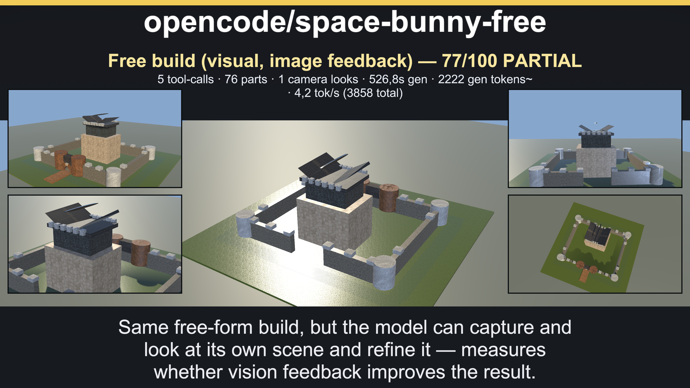
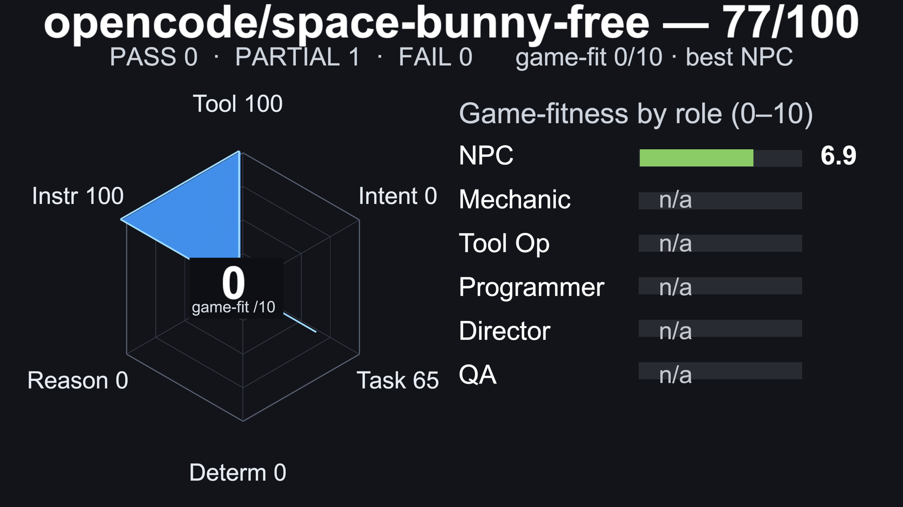
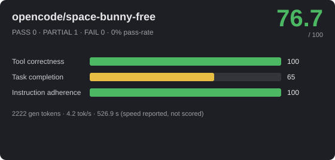
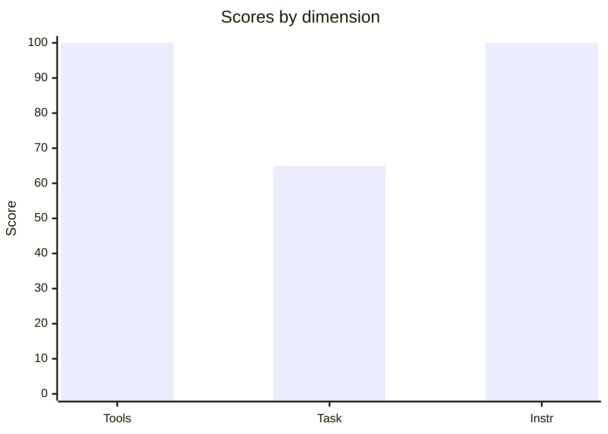

# 🎮 opencode/space-bunny-free — 76.7/100



_Hero: G6 free-build visual scene, preserving the model-authored layout._







> **Strong** · PASS 0 / PARTIAL 1 / FAIL 0 · pass-rate 0% · mean bonus 0 · reps 1 · CoreAI Game-Creation Benchmark v2

- **By group:** G6 76.7/100 (0/1 pass)
- **Best:** Free build (visual, image feedback) (76.7) · **Worst:** Free build (visual, image feedback) (76.7)
- **Cost of run:** 3858 tokens (2222 generated) · 4.2 tok/s provider-call (prefill+decode; effective 4.2 across the agentic session) · $0 · 526.9 s total
- **Model setup:** backend `OpenAiCompatibleHttp` · native-tools True · streaming True · temp 0.1 · reps 1 · parallel-tools 4
- **Run:** `20260929_200407` (2026-09-29T15:04:07.3799978Z) · Unity 6000.3.14f1 · suite 1.15

## 📐 Summary by dimension

<svg xmlns="http://www.w3.org/2000/svg" width="640" height="160" viewBox="0 0 640 160" font-family="Segoe UI, Arial, sans-serif"><rect width="640" height="160" rx="10" fill="#1e1f24"/><text x="20" y="39" fill="#c8ccd0" font-size="12">Tool correctness</text><rect x="174" y="24" width="340" height="16" rx="4" fill="#33353b"/><rect x="174" y="24" width="340" height="16" rx="4" fill="#4cb863"/><text x="528" y="37" fill="#e8e8ea" font-size="12">100/100</text><text x="20" y="67" fill="#c8ccd0" font-size="12">Task completion</text><rect x="174" y="52" width="340" height="16" rx="4" fill="#33353b"/><rect x="174" y="52" width="221" height="16" rx="4" fill="#e8bd44"/><text x="528" y="65" fill="#e8e8ea" font-size="12">65/100</text><text x="20" y="95" fill="#c8ccd0" font-size="12">Instruction adherence</text><rect x="174" y="80" width="340" height="16" rx="4" fill="#33353b"/><rect x="174" y="80" width="340" height="16" rx="4" fill="#4cb863"/><text x="528" y="93" fill="#e8e8ea" font-size="12">100/100</text><text x="20" y="123" fill="#c8ccd0" font-size="12">Efficiency bonus</text><rect x="174" y="108" width="340" height="16" rx="4" fill="#33353b"/><rect x="174" y="108" width="0" height="16" rx="4" fill="#dc5c57"/><text x="528" y="121" fill="#e8e8ea" font-size="12">0/20</text></svg>




## 🎯 Game-fitness — 0/10  (best: NPC / Dialogue)

| Role | Fit | Verdict | Why |
|---|---:|---|---|
| NPC / Dialogue | **6.9/10** | 🟢 Usable | simple in-character turns with occasional tool use. Weakest: speed 17. |
| Mechanic / GameMaster | — | ⚪ Not assessed | partial run — intent/sequence not measured. drives runtime gameplay — needs strict instructions, valid tools, and speed. |
| Scene / Tool Operator | — | ⚪ Not assessed | partial run — intent/sequence, determinism not measured. builds/edits scenes — fails fast when tool calls or ordering are unreliable. |
| Programmer / Logic Author | — | ⚪ Not assessed | partial run — reasoning, determinism not measured. authors game logic — needs reasoning plus reliable tool use, not speed. |
| Orchestrator / Director | — | ⚪ Not assessed | partial run — reasoning, intent/sequence, determinism not measured. multi-step control — current suite mostly measures task-level sequencing, not sustained multi-turn orchestration; needs high reasoning, sequencing, and instruction-following. |
| QA / Regression Judge | — | ⚪ Not assessed | partial run — determinism, reasoning not measured. validation — needs stable, rule-following judgments. |

## 🔧 Tool-call statistics

- **Total tool calls:** 5 · failed 0 · invalid world commands 0 · error-rate 0%

| Scenario | Group | Turns | Tool calls | Failed | Invalid | Tokens |
|---|---|---:|---:|---:|---:|---:|
| Free build (visual, image feedback) | G6 | 1 | 5 | 0 | 0 | ~3858 |

## 🏁 Scenario scores

| Scenario | Group | Base | Bonus (eff) | Total | Verdict | s |
|---|---|---:|---:|---:|---|---:|
| Free build (visual, image feedback) | G6 | 76.7 | 0 (0) | 76.7 | 🟡 PARTIAL | 526.9 |

_Base 0..100; Bonus = correctness + efficiency (fewer tokens & less time than budget), capped 20. `~tokens` = BPE estimate (provider usage unavailable)._

## Failed checkpoints

### Free build (visual, image feedback)
- [opt] went beyond a couple of stone-and-wood defaults (w8) — 12 materials
- [opt] used all five Enum.PartType shapes (w20) — 3 shapes: Block,Cylinder,Wedge

---
## Full model session

### G6 · Free build (visual, image feedback)

```text
GOAL: Build the most impressive castle you can with the Roblox API. This is a showcase of your 3D spatial reasoning AND of material choice: the more complete, structured and believably surfaced the castle, the better you score.

Use execute_lua for construction. If camera tools are available, capture the scene and use the image to inspect your work. Build with the Roblox API:
  local p = Instance.new('Part')
  p.Name = 'CastleWallNorth'
  p.Size = Vector3.new(64, 11, 3)
  p.CFrame = CFrame.new(0, 5.5, 32) * CFrame.Angles(0, 0, 0)
  p.Material = Enum.Material.Cobblestone
  p.Color = Color3.fromRGB(146, 141, 132)
  p.Shape = Enum.PartType.Block
  p.Anchored = true
  p.Parent = workspace
Emit one section of about 10-20 parts per execute_lua call through a local helper function that takes name/size/cframe/material/color/shape. A call stops at its first error: the parts created before it stay in the world, the rest of that call are lost, and the error does not name the line — so keep sections small, and before retrying a failed section check workspace:GetDescendants() for what already exists. Do not declare a new local per part (Lua allows 200 locals per chunk); call the helper. Lua 5.2 syntax only: no '+=', no 'continue', no type annotations.

A Part here has exactly these writable properties: Name, Parent, Size, CFrame, Position, Orientation, Rotation, Color, Material, MaterialVariant, Shape, Anchored, CanCollide, Transparency. Anything else fails the whole call — no TopSurface/BottomSurface, no BrickColor, no Reflectance, no CastShadow, no Enum.SurfaceType — and there is no WedgePart or CornerWedgePart class: wedges are a Part with Shape = Enum.PartType.Wedge or CornerWedge.

SHAPES — use ALL FIVE Enum.PartType values, each where it belongs: Block for walls, floors and slabs; Cylinder for round towers, pillars, wells, chimneys and bars (a Cylinder runs along X, so a vertical drum needs CFrame.Angles(0, 0, math.rad(90))); Wedge for gabled roofs, ramps and stairs; CornerWedge for cone roof quadrants and corner braces; Ball for domes, finials and lamps.

MATERIALS — choose what each surface would really be. Available Enum.Material values include Cobblestone, Brick, Slate, Limestone, Sandstone, Granite, Basalt, Rock, Concrete, Marble, Plaster, Pavement, Pebble, CeramicTiles, ClayRoofTiles, RoofShingles, Wood, WoodPlanks, Metal, CorrodedMetal, DiamondPlate, Foil, Glass, Neon, Fabric, Carpet, Leather, Cardboard, Rubber, Grass, LeafyGrass, Ground, Mud, Sand, Snow, Ice, CrackedLava, Asphalt, Plastic, SmoothPlastic, ForceField. Use at least 12 DIFFERENT ones.

COLOUR — p.Color multiplies the material's photographed texture and can only darken it: a channel of 222 or more is neutral, 146 shows stone at about 75% brightness, 100 at about 60%, 60 at about 50%. So for stone, brick, wood, metal, ground and roof materials leave Color unset or use light tints (every channel 180 or more, e.g. Color3.fromRGB(226, 224, 214)); dark 'natural' tints turn the whole scene muddy. Use strong colours only where the colour IS the surface — Plastic, SmoothPlastic, Neon, Fabric, Carpet, Glass — for banners, lamps, flags and props.

VOLUME — keep every part within x and z of -64..64 studs and y of 0..96 studs so the whole scene fits in one screenshot. Ground sits at y = 0.

It should clearly read as a castle, but HOW you compose it is up to you — do not just place a ring of four towers and stop. Think about what makes a castle memorable and CHOOSE what to include, for example: a lived-in courtyard (a well, market stalls, crates, barrels, benches, a campfire), buildings of different heights and rooflines, a gatehouse with an arch and a portcullis, a drawbridge over a moat, a road leading up to it, and a surrounding world that continues past the walls — outbuildings, gardens, tents, trees, rocks, fences. The area BEHIND and AROUND the castle should not be empty. Uneven, asymmetric, hand-placed layouts read as more real than a perfect grid.

Depth and detail are what score here: aim for AT LEAST 40 parts, ideally 60+, with at least 12 different Enum.Material values and all five Enum.PartType shapes. Name every part distinctly and start every Name with 'Castle' (CastleGround, CastleTowerNE, CastleGate, ...) so the grader can find them.

You are on a time budget. Every execute_lua result carries a TimeLeft note with the seconds remaining. Complete the castle's main silhouette — ground, curtain walls, towers, gate and keep — during the first half of the budget. Spend the remaining time on the courtyard, approach, landscape and surface details. Finish the current section and stop building with at least 20 seconds remaining.

--- turn 1 ---
ASSISTANT: session id: ses_f1249b30fffeijdeV63DMr1JBH
TOOL: execute_lua (ok, 1903ms, native) — {"Success":true,"TimeLeft":"~445s left to build — keep going, then stop when done."}
TOOL: execute_lua (ok, 41ms, native) — {"Success":true,"TimeLeft":"~409s left to build — keep going, then stop when done."}
TOOL: execute_lua (ok, 22ms, native) — {"Success":true,"TimeLeft":"~369s left to build — keep going, then stop when done."}
TOOL: execute_lua (ok, 16ms, native) — {"Success":true,"TimeLeft":"~314s left to build — keep going, then stop when done."}
TOOL: camera_capture (ok, 102ms, native) — {"ok":true,"summary":"Captured 'BenchmarkLivePreviewCamera' (agent camera) at 1024x576, pos (14, 16, -22), rot (28.2, 327.5, 0).","camera":"BenchmarkLivePreviewCamera","isMain":false,"width":1024,"height":576,"format":"jpg","sizeBytes":59372,"pose":{"position":{"x":14.0,"y":16.0,"z":-22.0},"rotation":{"x":28.23026,"y":327.5288,"z":0.0},"fieldOfView":50.0},"imageAttached":true}

--- system prompt ---
CRITICAL RULES FOR ALL AGENTS:
1. TOOL CALLING: When tools/functions are available, you MUST use them (function calling format). NEVER output JSON in your text response if tools are available to do the job.
2. STRICT ADHERENCE: You must follow the user's task or hint EXACTLY. Do not hallucinate, invent, or add creative flair to tool arguments unless strictly requested.
3. NO CHIT-CHAT: Respond concisely. Do not explain what you are doing unless asked.
4. TOOL LIFECYCLE: If a tool returns a success message, continue with the NEXT step of the task. Do not call the same tool again with the same arguments.
You are a 3D scene builder working in the Roblox API. Use the execute_lua tool and build with Instance.new('Part'): set Name, Size (Vector3), CFrame, Material, Color, Shape, Anchored = true and Parent = workspace. One unit is one Roblox stud. Send one section of about 10-20 parts per execute_lua call and keep calling until the scene is complete; do not stop early and do not ask questions. Pick the Enum.Material each surface would really be made of and the Enum.PartType shape that fits it; a scene of grey blocks reads as unfinished. Vary positions, sizes and angles.

## Tool Contract
You have native tool-calling available for this role. When the user/task asks to use or call a tool, call the matching tool through the tool interface; do not claim that the tool is unavailable, and do not simulate successful execution in prose.
Pass arguments as structured tool arguments matching the schema. Required values mentioned in the task must be passed as tool arguments, not only described in text.
After a tool succeeds, summarize the real tool result briefly for the user.
Natural-language-only descriptions (for example that you "used memory" or "called append") never execute tools and never persist data - they must not replace an actual invocation.

```

[Tool-call arguments and result previews (up to 2,000 characters each)](BENCHMARK_20260929_200407_opencode-space-bunny-free.tools.jsonl)

[Replay the model's complete G6 Lua calls](BENCHMARK_20260929_200407_opencode-space-bunny-free_g6_replay.lua)
