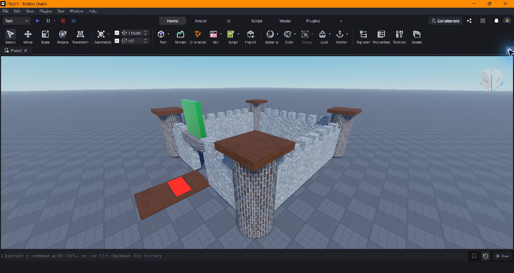
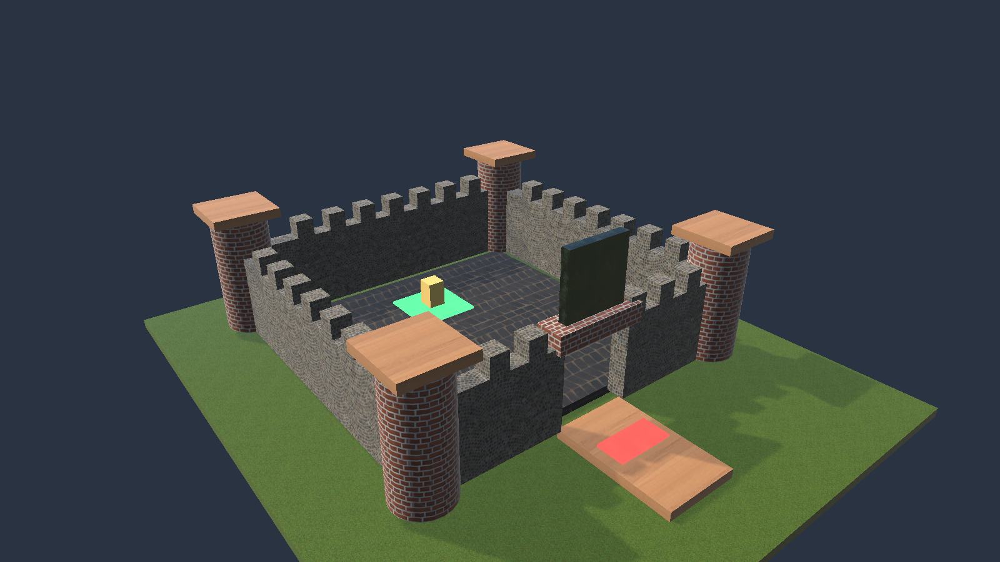

# Castle quest: Roblox Studio and CoreAI parity fixture

The [shared Lua fixture](../../Assets/CoreAIMods/Tests/EditMode/RbxApi/Acceptance/CastleQuestParity.lua)
builds a 51-part castle and runs a deterministic collectible mini-game. The walls, battlements,
four cylindrical towers, bridge, locked gate, three coins, key, trap, victory pad, and runner are
created through Roblox-shaped APIs in both engines. `Touched` handlers are connected to the
interactive parts.

The script first rejects the gate and victory pad, collects three coins, rejects the gate again
without a key, collects the key, takes one trap hit, opens the gate, and reaches the victory pad.
It destroys four collected objects and leaves the completed scene visible. Duplicate coin pickup
does not increase the score. The expected output in both engines is:

```text
COREAI_CASTLE_QUEST_PARITY|parts=51>47;coins=3;key=true;health=2;gate=true;win=true;gateY=14
```

## Verification

- Roblox Studio's documented `RunScript` task executed the exact `.lua` file in a Baseplate place.
  Its output matched the line above. The open Studio GUI showed upright towers, bridge, raised
  gate, and the completed castle.
- The same file ran through CoreAI's Lua mod runtime in the open Unity Editor. The
  `RobloxCoreAiParityEditModeTests` fixture passed 2/2 tests. Its castle test also checked that
  the rendered tower's vertical extent exceeds its horizontal extent after a quarter-turn roll.
- The Roblox Cylinder's length follows local X. The fixture therefore uses `Size.X = 13` and
  a 90-degree `CFrame` roll for each upright tower. An initial unrotated script made the towers
  lie sideways in Studio; the corrected shared script matches the geometry in both engines.

| Roblox Studio | CoreAI Unity |
|---|---|
|  |  |

The result establishes parity for this construction and deterministic game-state route, including
the cylinder axis convention. It does not establish pixel-identical materials or lighting. Studio's
default Baseplate covers the fixture's lower grass ground in the Studio image. The fixture connects
`Touched` handlers but invokes the route functions directly so both runtimes receive the same
ordered interactions; physical overlap delivery and player input remain separate tests.

To reproduce the Studio run, pass the fixture's absolute path to the
[documented Studio CLI](https://create.roblox.com/docs/studio/command-line-interface):
`RobloxStudioBeta.exe --task RunScript --runScriptFile <path> --outputFile <log> --quitAfterExecution`.
In Unity, run `CoreAI.Tests.EditMode.RbxApi.Acceptance.RobloxCoreAiParityEditModeTests` in EditMode.
