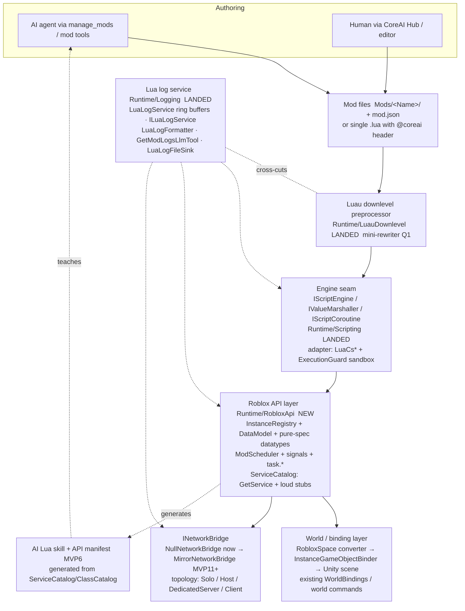

# Roblox-like Mod API — Definitive Roadmap (MVP0..MVP17)

CoreAI's mod system evolves into a **Roblox-shaped Lua API**. Rationale: LLMs know the Roblox API
better than any custom game API (training-data volume), so an AI that writes mods in this dialect
hallucinates less and ships working code faster. Humans get a familiar, documented API for free.

This document is the single plan of record. It supersedes the previous MVP1..MVP4 seed roadmap;
"Standing decisions" below are carried over in substance and refined where the detailed design
forced a choice. MVP0 (the engine abstraction seam) has **landed (2026-07-22)** and **MVP1
landed in 6.3.0 with the §5.1.8 acceptance gate green**, including the pulled-forward input and
camera slice (§MVP1); the Lua log service core has **landed** in
`Assets/CoreAIMods/Runtime/Logging/`, editor Lua/Luau syntax highlighting has **shipped
(editor-side)**, and the three normative Roblox-behavior reference docs are **complete** in
`Docs/CoreAIMods/RobloxReference/` (§2.1).
Since then **MVP2 has largely landed** (scheduler, deferred signals, services framework, loopback
remotes, the shared JSON contract, the Model pivot slice, and the complete 45-item `Enum.Material`
catalog — see §MVP2 for the remaining items) and **MVP3 (the world/place package) is code complete
(2026-09-24)** with its Unity verification gate pending; its contract and acceptance evidence are in
[`WORLD_PACKAGE.md`](WORLD_PACKAGE.md). Audits of MVP1, MVP2 and MVP8 (2026-09-24) were followed by
fix waves recorded in the rung sections below and in `TODO.md`; they are unreleased.

**Architecture (normative)**: every deliverable in this ladder is built to
`Docs/ARCHITECTURE_RULES.md` — engine-free Domain assemblies (`noEngineReferences: true`),
inward-only references with the Unity adapter as the sole engine boundary, interface-first
DI via installers, UniTask + CancellationToken discipline, and a per-module
architecture-fitness test (the seam-honesty test is the template). Reviewers reject work
that violates it.

**Versioning (LOCKED; historical record)**: the Roblox-like Lua mod API was a breaking change to the
mod contract, so it shipped as a **major** bump — the CoreAI package family went **5.9.0 → 6.0.0**,
with the five packages that existed then bumped together. Today all **seven** packages
(`com.neoxider.coreai`, `coreaiunity`, `coreaimods`, `coreaihub`, `coreaibenchmark`, `coreaimcp`,
`coreaimirror`) move in lockstep (ROADMAP.md §4, mod-system.md §8); the current release is in each
package's `package.json` and the changelogs. `mod.json` `api_version` is a **separate contract line
starting at 1**, independent of the package version (§MVP5).

**Roblox API parity (LOCKED — user, 2026-07-23):** the Lua-facing API replicates Roblox **1:1** —
identical class / method / property / event / enum names and semantics — so copy-paste Roblox
scripts run unchanged. Keyboard/mouse input is Roblox `UserInputService` exactly
(`InputBegan`/`InputEnded`/`InputChanged`; `InputObject` with `KeyCode`/`UserInputType`/`Position`/
`Delta`; `Enum.KeyCode`/`Enum.UserInputType`; `IsKeyDown`/`GetKeysPressed`/`GetMouseLocation`/
`MouseBehavior`). No CoreAI-invented dialect on the Roblox surface. Unity implementations (New Input
System, primitives, physics, camera) are only **swappable backends behind seams** — the Lua names and
behavior must match Roblox regardless of backend. **Exception:** FullAccess (the Unity-native
`unity_*` reflection surface) is a **separate module with its own skill** and may diverge. Legacy
CoreAI-isms (`input_*` poll, `coreai_world_*`) stay for back-compat but are NOT the canonical Roblox
surface. Applies to every current and future rung.

---

## 1. Principles

Two principles override Roblox fidelity whenever they conflict:

1. **AI-first authoring.** The primary mod author is the in-game LLM (humans second). API choices,
   docs, error messages, and logs are optimized for machine consumption and self-repair loops.
   Every error a mod can trigger carries: mod id, script, line, a stable error code, and a
   *suggested fix* — because the reader is an agent that will immediately try to patch the mod.
   The AI's skill document **is** the documentation (§MVP6): one artifact teaches the LLM and the
   human, and embeds the machine-readable implemented-vs-stub manifest generated from code.
2. **Realtime.** The game is created and modified *while it runs* (unlike Roblox edit-then-play).
   Hot reload, live logs, and in-play AI debugging are core features, not tooling extras. Every
   feature must answer "does this work in a built player on device, mid-session?" (see
   `AGENTS.md` — RUNTIME-first).

Derived rules:

- **Loud stubs.** Anything not implemented yet ships as an **explicit stub** that fails with a
  structured `NOT_IMPLEMENTED` Lua error naming the roadmap phase and a workaround — never
  silently. Stub code carries `// TODO: MVP<n> — <what completes it>`. The stub-error format is
  stable and machine-parsable from day one (§5.2.7). (One documented exception: DEV-5,
  `task.synchronize`/`task.desynchronize`.)
- **Current Roblox shapes.** API names and signatures follow the *current* official Roblox
  reference (verified July 2026; footnotes §9): `task.*`, `RunService.PreSimulation/PostSimulation/
  PreRender`, `Instance` members incl. attributes and tags, `DataStore` async methods,
  `RemoteEvent`/`UnreliableRemoteEvent`. Deprecated legacy names (`wait`, `spawn`, `RenderStepped`,
  `Stepped`) are provided as aliases because tutorial-corpus scripts use them, with a
  once-per-mod deprecation note in the mod log.
- **Multiplayer-shaped from day one.** Single-player is "a server with one local client"
  (Roblox's own model). All networking APIs exist from MVP2 in local-loopback form behind
  `INetworkBridge`; Mirror replaces the loopback in MVP11 without changing any mod-facing API.
  The bridge is topology-aware from the first interface draft (§2, Network topology).
- **WebGL must not break.** WebGL is not the priority target overall, but it must stay green as a
  **solo player** (Null loopback bridge) and, later, as a **pure client** against a dedicated
  server. Every MVP's Definition of Done implicitly includes the WebGL acceptance checklist
  (§6.5): no threads, no blocking waits, no sync-over-async, IDBFS flush after persistence writes.

## 2. Standing decisions (researched 2026-07; items marked LOCKED are user-confirmed)

- **VM**: keep Lua-CSharp v0.5.6 (bundled `Lua.dll`/`Lua.Annotations.dll` in
  `Assets/CoreAIMods/Plugins`; Lua 5.2, double-only numbers — near-Luau semantics). No MoonSharp
  return, no native Luau (WebGL). Stock upstream build: the local `NotifyTop` patch we carried on
  0.5.5 landed upstream as PR #331, and our WebGL coroutine deadlock report (issue #327) as PR #329.
- **Luau syntax**: pure-C# downlevel preprocessor at mod ingestion (strip type annotations, rewrite
  `+=`/`continue`/string interpolation/`if`-expressions/`//`). Parser: the targeted
  **mini-rewriter**, chosen and **implemented on disk** (`Assets/CoreAIMods/Runtime/LuauDownlevel/`:
  `LuauLexer.cs`, `LuauRewriteParser.cs`, `LuauDownleveler.cs`); Loretta is reconsidered only if
  construct coverage proves insufficient (Q1 closed). darklua's rule set is the reference spec.
  Standalone (no VM dependency).
- **Engine abstraction**: all interpreter access goes through neutral interfaces so the VM can be
  swapped later — `IScriptEngine`, `IScriptState`, `IValueMarshaller`, `IScriptFunctionRegistry`,
  `IScriptCoroutine` (with `Kill()`), `IScriptExecutionGuard`, `IExecutionBudget`, plus the value
  contract (`ScriptValueKind`, `IScriptTable`, `ScriptCallContext`, `ScriptCallResult`,
  `ScriptSandboxProfile`, `ScriptRuntimeException`) — **landed** in
  `Assets/CoreAIMods/Runtime/Scripting/` with the `LuaCs*` adapters in `Scripting/LuaCs/`.
  Script values cross the seam as **opaque `object` handles** classified via
  `IValueMarshaller.GetKind` (`ScriptValueKind`); there is no `ScriptValue` wrapper type.
  The existing `LuaCs*` classes (`LuaCsModRuntime`, `LuaCsSecureEnvironment`,
  `LuaCsExecutionGuard`, `LuaCsCoroutineHandle`/`Runner`) become the single adapter layer. The
  Roblox API layer in this roadmap is written **only** against the neutral interfaces.
- **Multiplayer transport**: **Mirror**, via NeoxiderTools `Neo.Network` (a separate repository),
  which already has a solo fallback when the `MIRROR` define is absent. Proven mappings:
  `NetworkEventDispatcher` ≈ `FireServer`→`FireAllClients`; `NetworkActionRelay` TargetRpc scopes
  ≈ `FireClient`; `NetworkPropertySync` ≈ replicated properties;
  `NeoNetworkSpawner` ≈ server spawn; `NeoNetworkPlayer` ≈ `Players.LocalPlayer`/ownership;
  `NetworkContextActionRelay` demonstrates the paired `NetworkMessage` request/response pattern
  for `RemoteFunction`. CoreAI itself has zero multiplayer code today — the bridge is **designed
  now, implemented in MVP11–13**.
- **Network topology (LOCKED)**: supported targets are **host mode** (listen server: server +
  local client in one desktop process) and **dedicated server** (headless, no local client).
  Implementation order: **Null loopback (solo) → host → dedicated** — host mode first because it
  is the fastest dev loop and mirrors Roblox Studio play-testing; dedicated server follows as its
  own MVP step (mostly headless bootstrap + CLI). WebGL can never host or listen: in browsers the
  only modes are **solo** and **pure client** of a dedicated/remote server, and WebGL is not a
  priority. `INetworkBridge` stays topology-agnostic
  (`Solo | Host | DedicatedServer | Client`) and **never** assumes "the server always has a local
  client" (e.g. `PreRender` must be skippable server-side; `Players.LocalPlayer` is nil on a
  dedicated server, Roblox parity).
- **Identity**: one `InstanceRegistry` owns identity from day one. Every Instance gets a stable
  `instanceId`; the record reserves fields for the Mirror `netId` and the CoreAI world-command name
  so the three identity spaces (Roblox Instance ref / Mirror netId / CoreAI name-string) reconcile
  in one place. This is the pre-payment on the most expensive future bridge. Details §3.3.
- **Coordinates (LOCKED)**: Roblox datatypes (`Vector3`, `CFrame`) are implemented as **pure math
  exactly to Roblox spec** — right-handed, `LookVector = -Z`, every constructor/operator/`lookAt`/
  `ToWorldSpace` per the official docs; mods never touch a Unity `Transform`. Exactly **one
  conversion boundary** exists: the static `RobloxSpace` class (§5.1.4, D2). Nothing outside it
  converts — enforced by a lint-style test.
- **Units / scale (LOCKED, supersedes the earlier 1:1 default)**: scale is a single configurable
  constant inside `RobloxSpace`; **default 1 stud = 0.28 m**. Rationale: the AI author's trained
  priors (`WalkSpeed 16`, `JumpPower 50`, `Gravity 196.2`, part sizes) produce correct *game
  feel* at 0.28 without re-teaching — copy-paste corpus achieves feel-parity, not just
  math-parity (Roblox gravity 196.2 studs/s² = 54.9 m/s² ≈ 5.6 g is the intended snappy feel).
  1 stud = 1 m remains available for meter-integrated games. Corpus tests run at 0.28 as primary
  + 1:1 smoke. Implementation rule: mod-driven rigidbodies get gravity applied **per-body**
  (custom force, `Rigidbody.useGravity = false`), never via global `Physics.gravity`, so
  Roblox-physics mods coexist with a host game running Earth gravity. The AI skill teaches the
  active scale (§MVP6).
- **Assets under scale (LOCKED)**: **only numbers convert at the API boundary; assets are never
  rescaled.** (1) Primitives (`Part` Block/Ball/…) use Unity unit primitives; the binder sets
  `localScale = Size × RobloxSpace.MetersPerStud`. Shapes Unity lacks (Wedge, CornerWedge, the
  Roblox-oriented Cylinder) get our own meshes authored **normalized to 1 unit = 1 stud** — the
  only stud-authored assets allowed; the same scaling formula applies. (2) Existing
  meter-authored prefabs (host game, NeoxiderTools) are **never** rescaled — that breaks
  physics/colliders/animations/NavMesh and is a forbidden operation; mods read them with a
  meters→studs conversion at the API boundary (a 1.8 m human reads as ~6.4 studs — plausible
  Roblox proportions), and spawning game prefabs via our InsertService-analog keeps authored
  size. (3) The meter-authored character controller stays metric; the Humanoid adapter converts
  numbers (`WalkSpeed` studs/s → m/s, `JumpPower`, …); part mass/density scales by volume
  (×0.28³). That adapter is now a supported extension point rather than a plan: a host registers an
  `IRbxCharacterMotorProvider` and drives Rbx characters with its own controller, with CoreAI's own
  motor answering for whatever the provider declines — see
  [CHARACTER_MOTOR_BRIDGE.md](CHARACTER_MOTOR_BRIDGE.md). (4) Switching the scale config (0.28 ↔ 1:1)
  must require touching **zero assets** — only the `RobloxSpace` constant (tested: §5.1.8).
- **Host integration profile**: embedding CoreAI mods into an **existing meter-scale Unity game** is a
  first-class scenario. A per-project host profile (ScriptableObject: `RobloxSpace` scale [default
  0.28], capability defaults, which host services/objects are bound, the per-world `ClientWritePolicy`
  — `RobloxParity` [default] / `Strict`, resolved through the single authority-resolver seam so future
  partial-authority rules are a resolver swap, §MVP12; co-building is a host grant, not an `Open` mode
  (owner decision 3) — plus the per-role human tool-surface config and the Players-may-fly flag from
  the roles/locomotion decisions below) makes integration "drop a config and it works".
  `RobloxSpace`'s configurable scale **is** the meter-world adapter — no second conversion layer
  exists or is planned. Ships as a small deliverable in MVP16 (§MVP16).
- **Roles: Creator / Player (LOCKED — studio == game)**: every connected player has a per-world
  **role** — **Creator** (the host's default in their own world; grantable to others = the Team
  Create analog) or **Player** (joiner default). The role gates the **human-driven** AI tool
  surface (Hub chat: `manage_mods`, `execute_lua`, save/load world), configurable per world in
  the host integration profile — from fully locked down to full sandbox. **Critical
  separation: game-sanctioned AI creation is NOT role-gated** — a mod calling the reserved
  `AIService` (e.g. ability-crafting gameplay where the AI generates a new ability as part of
  game logic) runs under the **mod's** capability grants/quotas set by the creator and works
  for pure Players; generated content carries the origin tag `ai:<modId>` and the normal
  budgets/quarantine apply. Role is an input to the authority resolver (§MVP12) — the player
  dimension. Reservation is cheap in the early MVPs: a `Role` field on the Player record (the
  synthetic player in MVP2, real `Player`s in MVP8) plus one tool-gating point; mature
  enforcement (role granting, UI) arrives with multiplayer (MVP12). Regardless of role, the
  chat/agent interaction itself is always non-blocking — play and task the AI in parallel
  (§MVP16, async agent workflow).
- **Locomotion: Humanoid / Fly (orthogonal to role)**: `Humanoid` = the normal character;
  `Fly` = free-fly, the in-game analog of the Studio camera. A Creator defaults to Fly while
  building; whether Players may fly is a per-world host-profile config (a cheat in most games,
  normal in creative worlds). Implementation rides the Humanoid rung (§MVP8).
- **Event mode (LOCKED)**: **Deferred** signal behavior only, matching Roblox's current direction
  (templates default to `Enum.SignalBehavior.Deferred` [^10]) — details §5.1.4 (D4).
- **Clocks (LOCKED)**: the scheduler (`task.wait`, `task.delay`) and the frame pipeline run on
  **scaled game time** (they respect `Time.timeScale` — pause/slow-mo pauses/slows mods), and the
  real-time surface ships alongside with Roblox names: `os.time()`, `os.clock()`,
  `workspace:GetServerTimeNow()`, `time()` (`DateTime` is a loud backlog stub, M2-15). Full
  clock-mapping table in §5.2.6 (D9).
- **Hot reload (LOCKED)**: reloading a mod restarts its scripts with clean state; mod-created
  Instances are destroyed by default (opt-out `preserveInstances` flag per mod); mod stores
  **always** survive. Full survival matrix in §6.3.
- **Mod manifest (LOCKED)**: `mod.json` carries `api_version` from day one; the loader
  version-gates mods against the host's mod-API version (§MVP5).
- **One JSON contract (LOCKED)**: a single table↔JSON mapping (`HttpService:JSONEncode/JSONDecode`
  parity — arrays vs dictionaries, null handling, number formatting) implemented once and shared
  by DataStore marshalling **and** remote payload serialization (§5.2.4).
- **Skill = docs (LOCKED)**: the in-game LLM's Lua skill and the human-facing API docs are one
  artifact, with the generated API manifest embedded; every MVP that grows the API surface must
  update it as part of its DoD (§MVP6).
- **Test hierarchy (LOCKED convention)**: the layout and the rule-citing conformance-test naming
  convention in §6.6; every MVP DoD references it.
- **One-shot execution + ownership ledger (LOCKED)**: `execute_lua` is a first-class **runtime**
  feature (conscious deviation from Roblox's Studio-only command bar — DEV-12): it runs in the
  full Roblox API environment, under the same sandbox and budgets, keeps no persistence of its
  own, and returns results. Instances created by a one-shot are **world-owned by default** —
  they persist, are saved with the world, and survive mod reloads (explicit cleanup only) — but
  carry origin tags (`origin: console:<invocationId>`) enabling selective cleanup/undo ("remove
  everything from invocation N"); an optional `execute_lua` **preview** scope is ephemeral
  (auto-cleanup). One unified ownership ledger, two lifecycle policies: **mod-owned**
  (auto-teardown on reload; a `persistent` flag promotes to world-owned) vs **world-owned**
  (console default) — the same `TeardownModEffects` pipeline serves both.
- **World file / place package (LOCKED)**: a shareable zip (`world.json` + `Mods/` +
  `manifest.json` carrying `format_version` + `api_version`; all JSON per the `RobloxJson`
  contract) containing the world-owned instance tree (with owner/origin metadata), world
  settings (gravity, `RobloxSpace` scale), and mod sources. Mod-ephemeral state is **not**
  saved — mods restart clean on world load, per the hot-reload contract (§6.3). **One
  serializer** serves disk save **and** the multiplayer join snapshot the host streams to
  connecting clients (the MVP11/MVP12 join flow is designed to reuse it). Save/load work at
  runtime without restart (load = `TeardownModEffects` for all mods → restore tree → start the
  world's mods); AI tools `save_world`/`load_world`. Evolves CoreAI's existing WorldState save.
  MVP1 consequence (explicit): `InstanceRegistry` records are serializable with stable ids from
  day one. Detailed in §MVP3.
- **Two-tier backups (LOCKED)**: **manual saves** — player-owned named slots in `Saves/Manual/`,
  never auto-overwritten; AI tools can create but never overwrite or delete them, and an
  AI-initiated restore requires player confirmation — vs **autosaves** — a rolling ring (~10)
  in `Saves/Auto/<timestamp>-<trigger>.world`, with a snapshot taken **before** every AI
  mutation (mod load/reload, world-mutating `execute_lua`) and trigger metadata recorded. Both
  tiers use the place-package format. Complements the `ILuaScriptVersionStore` source rollback;
  principle: **undo is never the only recovery path**.
- **Quarantine error policy (LOCKED; core implemented 2026-07-22 — replaces auto-unload/auto-disable;
  see `mod-system.md` §5a; `mod:<id>` chunk names still pending per §5.2.7)**:
  at the error threshold a mod **stops dispatching but stays loaded and addressable**; reload
  clears quarantine. Events: `ModQuarantined` and `ModTearingDown(modId, reason)`; the
  `TeardownModEffects(modId, reason)` pipeline clears logic-slot overrides and (future) owned
  instances/coroutines, and is the single teardown entry point shared by hot reload, quarantine
  escalation, and world load. Script chunk names become `mod:<id>` — the §5.2.7 error contract
  depends on it.
- **AI-call reservations (LOCKED — cheap now, from the AIService feasibility audit)**:
  (i) `LuaCapabilities` gains `Ai = 1<<5` (excluded from `All`, like `Full`) when `mod.json`
  capability parsing lands (MVP5) — the same parsing also reserves `Data = 1<<6` for DataStore
  access (§MVP9); `LuaCapabilities.cs` currently ends at `Full = 1<<4`, so both bits are free;
  (ii) MVP2's `ModScheduler` wait system is built on a generic
  "resume a Lua thread when a host `Task`/callback completes" primitive (`ScheduleWaitUntil`),
  with time waits as the special case — DataStore `GetAsync` (MVP9) and the future `agent:Ask`
  both need it (§5.2.2); (iii) conventions from day one: `AiTaskRequest.SourceTag =
  "Mod:<modId>"`, `CancellationScope = "Mod:<modId>"`, hot-reload teardown calls
  `CancelTasks(scope)`; chat-history keying reserved as `(roleId, sessionKey)`.
- **Frame-budget reservation**: `IExecutionBudget` and the scheduler interfaces carry a
  **per-frame / per-mod slice** concept (accounting + skip/downgrade + `BUDGET_EXCEEDED`
  warning) from the first interface draft, even though slice *enforcement* lands later (MVP17)
  — retrofitting accounting seams is expensive; reserving them is free (§5.2.3).

### 2.1 Normative references (behavior rulebooks)

Three normative documents in `Docs/CoreAIMods/RobloxReference/` specify the target Roblox
behavior in numbered, testable rules. **Policy: the implementation follows these rules;
deviations must be recorded as explicit decisions** (table below). The plan cites rule IDs
instead of restating semantics.

| Doc | Scope | Rule IDs |
|---|---|---|
| `01_SCRIPTS_AND_SCHEDULER.md` | script types/contexts, require, task scheduler, frame order, signals, Instance lifecycle | R1.x–R7.x, plus UNCERTAIN items U1–U7 |
| `02_MULTIPLAYER_REPLICATION.md` | replication model, remotes, authority, serialization/limits appendices | M1.x–M7.x |
| `03_SERVICES_AND_DATA.md` | services, DataStore semantics + emulation table | S1.x–S7.x |

Uncertainty policy: each U1–U7 item in the scheduler doc gets an explicit recorded stance during
MVP2 design review (testable stances become conformance tests; a stance later contradicted by
verified Roblox behavior is re-filed as a deviation below).

Conscious deviations (running list — additions require an entry here):

| ID | Roblox behavior (rule) | CoreAI decision | Why |
|---|---|---|---|
| DEV-1 | cyclic `require` hangs forever (R3.7) | raise `CYCLIC_REQUIRE` naming the cycle path | hangs are hostile to AI self-repair; an error is patchable |
| DEV-2 | `SignalBehavior.Immediate` exists | Deferred only; setter is a loud stub | D4; budget enforcement and reentrancy safety |
| DEV-3 | no per-slice instruction budgets | budget kills + quarantine per mod (§2, quarantine policy) | sandbox safety in a live game |
| DEV-4 | fixed stud scale | configurable `RobloxSpace` scale (default 0.28 m) | host-game integration |
| DEV-5 | `task.synchronize/desynchronize` switch Parallel Luau contexts; `RBXScriptSignal:ConnectParallel` runs the handler in parallel | no-op + once-per-mod log note; `ConnectParallel` is `Connect` (serial) with the same once-per-mod note | Parallel-annotated scripts are otherwise runnable; throwing would fail working code |
| DEV-6 | global gravity | per-body gravity forces, host `Physics.gravity` untouched | mods coexist with the host game's physics |
| DEV-7 | destroyed instances stay readable (`Parent` nil + locked, R5.8/R6.2) | member access on a destroyed instance raises `INSTANCE_DESTROYED` — **except** inside destruction-queued handlers (`Destroying`/`AncestryChanged`), which read a **tombstone** (`Name`, `ClassName`, `Parent == nil`; connections gone). A `Parent` change notification raised by the destruction itself is tombstone-readable too, and `BasePart` properties read inside those handlers return the part's last-known values (both part sinks keep the most recent 2,048 destroyed parts; older ones are forgotten) | loud errors drive AI self-repair; the tombstone keeps R5.8's observable post-destruction state |
| DEV-9 | legacy `wait`/`spawn`/`delay` have a ~29 ms floor + load-dependent throttling (R4.9) | preserve the **0.029 s minimum delay**, but omit load-dependent throttling | the real floor preserves timing compatibility; deterministic scheduling avoids machine-load-dependent behavior |
| DEV-10 | `GetAsync`/`UpdateAsync` return a `DataStoreKeyInfo` second value (S1.4/S1.7 — S1.4 is `GetAsync`'s `(value, DataStoreKeyInfo)` tuple; S1.7 is `UpdateAsync`'s transform contract) | second return is `nil` in MVP9 — documented reduced fidelity | version/metadata model not emulated locally; loud stubs cover the explicit version APIs |
| DEV-11 | `GetAsync` results are cached for 4 s (S1.5) | cache **not emulated** — every `GetAsync` reads the store | the local store is fast; emulating the cache would only add staleness surprises |
| DEV-12 | command-bar/one-shot execution is Studio-only | `execute_lua` one-shots are a first-class **runtime** feature (full API env, same sandbox/budgets; §2 one-shot decision) | Realtime principle — the game is authored while it runs |
| DEV-13 | a Lua string is a byte string; non-ASCII text built from UTF-8 byte sequences (e.g. `'\195\169'` for "é") is one Unicode codepoint by Luau's own character-counting (`utf8.len`), even though `#s` counts the 2 raw bytes | crossing the C#/Lua boundary maps each byte to one `System.Char` (UTF-16 code unit) — a non-ASCII codepoint spanning 2+ UTF-8 bytes becomes that many C# chars, not one; pinned by `RoundTrip_UnicodeStrings_SurviveEncodeDecodeUnescaped` (`RbxJsonContractEditModeTests`) | the VM boundary marshals bytes, not codepoints; a mod author, or C# code reading a Lua string (logs, `GetAttribute`, `JSONEncode` output), must not assume `String.Length`/indexing on a crossed string matches Luau's `utf8.len`/perceived character count for non-ASCII text |
| DEV-15 | "The name of an instance cannot exceed 100 characters" — the mirror states the cap, not what an over-long assignment does | an over-long `Name` keeps its first 100 characters (never splitting a surrogate pair) | truncation instead of an error keeps a world saved before the cap existed restorable |
| DEV-16 | `Humanoid.MaxHealth = math.huge` stores infinity (a common "invincible" idiom) | accepted, but stored as the largest finite double, so `Health == math.huge` is false (compare with `MaxHealth`); `TakeDamage(math.huge)` still kills; NaN is refused | a non-finite value cannot be saved in a world package; the idiom keeps working without making the world unsavable |
| DEV-14 | members carrying `security: PluginSecurity` are unreachable from a running game — they exist for Studio and plugins, and the shipped experience never sees them (e.g. `ScriptContext:SetTimeout`, which limits how long a script may run without yielding) | the same members are reachable at RUNTIME, gated to the elevated actor tier (`ActorContext.Grants.IsUnrestricted`); an ordinary mod is refused exactly as it is for any other privileged member | CoreAI has no Studio: authoring and playing are ONE application, so "Studio-only" has no place to live. Mapping these to "unavailable" would delete a control the creator legitimately needs while the game runs; mapping them to "anyone" would let a mod raise its own execution budget. The elevated tier is the only honest reading, and it is the same tier that already gates the rest of the privileged surface. Sibling of DEV-12, which made the same call for one-shot execution |

---

## 3. Architecture overview

### 3.1 Layer diagram



Rules of the arrows:

- Mods never touch Unity types directly; the Roblox API layer is pure C# over the engine seam and
  talks to Unity only through the binder (`InstanceGameObjectBinder`) and existing world bindings
  (`Assets/CoreAIMods/Runtime/WorldBindings/`). All spatial values cross through `RobloxSpace`
  (§5.1.4, D2) — the single conversion boundary.
- The Roblox API layer never references `Lua.*` types — only `Runtime/Scripting` interfaces. This
  keeps a future VM swap (or a second VM for tests) a one-adapter job.
- Networking calls never leave the Roblox API layer except through `INetworkBridge`. In solo play
  the `NullNetworkBridge` loops server→client calls back locally through the deferred queue, so
  `RemoteEvent` code written for multiplayer runs unchanged.
- Logging is a cross-cutting sink: preprocessor diagnostics, VM errors, `print`/`warn`/`error`,
  budget kills, stub hits, and network-bridge drops all land in the same per-mod ring buffer
  (`LuaLogService`).
- The skill/manifest is **generated from** the same catalogs that implement `GetService` and the
  class registry — documentation cannot drift from code (§MVP6).

### 3.2 Execution contexts (Roblox-style single+multi)

Three script contexts, declared per-script by folder (§MVP5), semantics per R1.x/R2.x:

| Context | Roblox analogue | Solo | Host mode | Dedicated server | Pure client (incl. WebGL) |
|---|---|---|---|---|---|
| `server` | Script in ServerScriptService | runs (local "server") | runs | runs | never |
| `client` | LocalScript in StarterPlayerScripts | runs (local "client") | runs (host's own client) | never | runs |
| `shared` | ModuleScript in ReplicatedStorage | on require, both sides | both sides | server side | client side |

In solo play the same process hosts both contexts, but they still communicate **only** via
remotes/replication (loopback). This is enforced from MVP5 so mods do not accidentally develop
solo-only coupling that breaks in MVP11. Note the host-mode column: host = server + one local
client in one process, but that is a *topology*, not an API assumption — a dedicated server runs
the `server` column with no local client at all.

### 3.3 Identity model (the three-spaces problem)

Three identity spaces must reconcile:

1. **Roblox space** — Lua holds `Instance` references; scripts also address by name-path
   (`workspace.SpawnPad`).
2. **Mirror space** — replicated objects are addressed by `netId` (uint) on the wire.
3. **CoreAI space** — existing world commands and world-query tools address objects by
   name strings (`WorldBindings/LuaCsWorldRuntimeBindings.cs`, `WorldQuerySceneWalker`).

`InstanceRegistry` (MVP1) is the single owner. One record per instance:

```
InstanceRecord {
  InstanceId  Id;         // ulong, monotonic per session, never reused; 0 = invalid
  uint        NetId;      // 0 until Mirror binds it (MVP12); server-assigned
  string      WorldName;  // CoreAI world-command name; null until bound to a world object
  RbxInstance Instance;   // the live Lua-visible proxy
  string      OwnerModId; // teardown owner; null = host/world-owned
  string      OriginTag;  // ownership ledger (§2): "mod:<id>" | "console:<invocationId>" | null (host)
}
```

Invariants (testable from MVP1):

- Lookup by any of the three keys returns the same record (`TryGet` / `TryGetByNetId` /
  `TryGetByWorldName`).
- `Id` is allocated at registration and stable until `Destroy`; it appears in every log line and
  error concerning the instance, so the AI can correlate logs ↔ tree ↔ world queries.
- MVP12 rule reserved now: on a Mirror client, spawn messages carry the server's `InstanceId` so
  client-side registries mirror server ids 1:1 (no translation table in mod code, ever).
- The id space is **partitioned by an authority bit from MVP1** (e.g. the top bit:
  server-assigned vs locally-assigned); only server-space ids ever cross the wire — the
  MVP11+ marshal/spawn paths reject locally-assigned ids.
- Records are **serializable with stable ids from day one** — the world-file serializer (§2,
  world file; §MVP3) round-trips them without a remap table.
- Host/world objects discovered by CoreAI world queries get lazily wrapped: first Lua access
  creates the record with `WorldName` set and `OwnerModId = null` (positions read through the
  `RobloxSpace` inverse, §5.1.4 D2 — consistent both ways).

---

## 4. MVP ladder

Effort scale: S ≈ ≤2 agent-days, M ≈ ≤1 agent-week, L ≈ multi-week / parallelizable.
Each MVP's Definition of Done (DoD) is a testable gate; corpus percentages defined in §6.4; test
placement and naming follow §6.6. **Two implicit DoD items apply to every MVP**: (a) the WebGL
acceptance checklist (§6.5) passes; (b) if the MVP grows the Lua-visible API surface, the
skill/docs are updated and the API manifest regenerated (§MVP6). Gate (b) activates once MVP6
lands — there is no skill to update before it; MVP6's own DoD includes retroactive coverage of
the MVP1–MVP5 surface.

| # | Title | Depends on | Effort |
|---|-------|-----------|--------|
| MVP0 | Engine abstraction seam *(landed 2026-07-22)* | — | M |
| MVP1 | Instance/DataModel core + pure-spec datatypes + RobloxSpace + identity *(landed 6.3.0; §5.1.8 gate green)* | MVP0 | L |
| MVP2 | Scheduler, signals, clocks, services/materials framework, loopback remotes | MVP1 | L |
| MVP3 | World file (place package) + two-tier backups *(code complete 2026-09-24; Unity verification gate pending)* | MVP1, MVP2 | M |
| MVP4 | RBXL import/export (round trip both directions; scripts arrive as disabled mods) | MVP1, MVP2, MVP3 | M |
| MVP5 | Mod system UX (hierarchy, contexts, hot reload, AI tools) | MVP2 + preprocessor *(landed — mini-rewriter, Q1)* | M |
| MVP6 | AI Lua skill = the documentation (+ generated API manifest) | MVP2; co-evolves with MVP5 | M |
| MVP7 | Editor tooling (highlighting *(shipped, editor-side)*, viewer, manager) | MVP5 | M |
| MVP8 | Gameplay services I (Players, Humanoid, Touched, Debris, TweenService) | MVP2 | L |
| MVP9 | DataStoreService + leaderstats | MVP2, MVP8 | M |
| MVP10 | Input services (UserInputService, ContextActionService) | MVP2 | M |
| MVP11 | Mirror bridge core — **host mode** (remotes over the wire) | MVP5, MVP8 | L |
| MVP12 | Replication (spawn, property sync, authority, rate limits) | MVP11 | L |
| MVP13 | Dedicated server (headless bootstrap + CLI; WebGL pure client validated) | MVP12 | M |
| MVP14 | GUI subset (ScreenGui → runtime UI Toolkit) | MVP2, MVP8, MVP10 | L |
| MVP15 | Audio / FX / animation services | MVP8 | M |
| MVP16 | In-game console + AI self-repair loop | MVP5, MVP6, MVP7 | M |
| MVP17 | Perf + WebGL hardening + benchmark corpus | all | M |

Ordering changes vs. the seed roadmap, with justification:

- **Networking loopback stubs moved from "MVP1" to MVP2.** `RemoteEvent`/`RemoteFunction` are
  signal-and-yield objects; they cannot exist before `RBXScriptSignal`, the scheduler, and
  `INetworkBridge` (all MVP2). Shipping them earlier would mean stubbing the stubs.
- **World file (MVP3) and RBXL import/export (MVP4) land immediately after MVP2 (user
  decision).** Opening real Roblox maps is a headline capability that exercises the MVP1/MVP2
  surface broadly; the native place package comes first because import produces `world.json` —
  and keeping it a small dedicated rung isolates the RBXL converter from serializer churn.
- **Mod-system UX and log wiring moved after the API core (MVP5).** Hot-reload teardown rules are
  meaningless before instance ownership exists (MVP1: `OwnerModId`) and connection lifetimes exist
  (MVP2). The preprocessor is a parallel track that merges here; the log core has already landed.
- **The AI skill is its own early MVP (MVP6), right after the mod-system MVP.** It must exist
  *before* the service breadth arrives, because every later MVP appends to it; and it needs MVP2's
  catalogs (the manifest source) plus MVP5's authoring workflow (which it teaches). Motivation is
  a real incident, not theory: a small 4B model hand-animated a 2-second movement with raw
  `execute_lua` loops instead of using `TweenService` — wrong-tool-choice errors are prevented by
  the skill, not by the API.
- **Input (MVP10) split from gameplay services (MVP8).** UserInputService interacts with CoreAI's
  cursor gating and the Hub's focus model — an isolatable risk that should not block Players/
  Humanoid work.
- **Host mode before dedicated server (MVP11 → MVP13).** Locked topology order: host mode is the
  fastest dev loop (one desktop process, mirrors Roblox Studio play-testing); the dedicated
  server is mostly headless bootstrap + CLI on top of an already-working bridge, so it lands as
  its own step after replication.
- **The seed's "MVP4 tooling" is split**: editor tooling (MVP7) vs. in-game console + self-repair
  (MVP16), because the latter depends on the Mirror-era log routing and the mature tool surface.

### MVP0 — Engine abstraction seam *(landed 2026-07-22)*

- **Goal**: no code outside the adapter references `Lua.*`; the Roblox layer builds on neutral
  interfaces only.
- **Deliverables** (contract **landed on disk** in `Assets/CoreAIMods/Runtime/Scripting/`):
  `IScriptEngine`, `IScriptState`, `IValueMarshaller`, `IScriptFunctionRegistry`,
  `IScriptCoroutine` (with `Kill()`), `IScriptExecutionGuard`, `IExecutionBudget`,
  `ScriptValueKind`, `IScriptTable`, `ScriptCallContext`, `ScriptCallResult`,
  `ScriptSandboxProfile`, `ScriptRuntimeException`; `LuaCs*` classes refactored into the adapter
  (`Scripting/LuaCs/`: `LuaCsScriptEngine`, `LuaCsScriptState`, `LuaCsValueMarshaller`,
  `LuaCsScriptCoroutine`, …); `LuaCsApiRegistry` leak closed; `LuaCsCoroutineHandle`/`Runner`
  exposed through `IScriptCoroutine`.
- **DoD**: `CoreAI.Mods.csproj` compiles with the seam in place; existing EditMode tests green;
  a grep for `using Lua;` outside `Scripting/LuaCs/`+`Infrastructure/` adapters returns nothing.
- **Effort**: M (landed).

### MVP1 — Instance/DataModel core (detail: §5.1) *(landed 6.3.0; input slice + camera pulled forward)*

- **Status**: the engine-free datatypes, `InstanceRegistry`/`RbxDataModel` core, the `RobloxSpace`
  conversion boundary, the `IInstanceBackingBinder`/`InstanceGameObjectBinder` materialization
  slice, and the Lua surface (`Instance.new`/`game`/`workspace`, datatype globals, Part spatial
  properties pushed through `IPartPropertySink`) are on disk in
  `Assets/CoreAIMods/Runtime/RobloxApi/` + `Runtime/Scripting/LuaCs/LuaCsRoblox*.cs` and wired by
  `CoreAiModsInstaller`. Shipped in 6.3.0 with the §5.1.8 acceptance gate green (build/query/clone/
  destroy + RobloxSpace round-trip + golden fixtures + conversion lint), `Part.Shape`
  (Ball/Cylinder/Wedge meshes; CornerWedge → Block fallback), and — pulled forward from MVP10/§camera —
  a Roblox-1:1 `UserInputService` slice (behind a swappable `IInputSource` seam) and
  `workspace.CurrentCamera` (over a swappable camera rig), so mini-games are playable on the MVP1 base.
- **Goal**: `game`, `workspace`, `Instance.new`, the full navigation/lifecycle member set,
  pure-spec datatypes with the `RobloxSpace` conversion boundary, and the unified identity
  registry.
- **Deliverables**: see §5.1 (the detailed half of this document).
- **Dependencies**: MVP0.
- **DoD**: MVP1 acceptance test list (§5.1.8) green — including the `RobloxSpace` round-trip
  property tests, golden fixtures, and the conversion lint test; a mod can build, query, clone,
  and destroy an instance tree that materializes as GameObjects and is visible to CoreAI world
  queries.
- **Effort**: L.

### MVP2 — Scheduler, signals, clocks, services framework (detail: §5.2)

- **Current state**: `ModScheduler`, `task.*` plus the legacy aliases, general deferred
  signal dispatch, yieldable signal handlers, and `ServiceCatalog` with member-access loud stubs
  have landed, together with the shared JSON contract / `HttpService` JSON members, loopback
  `RemoteEvent`/`UnreliableRemoteEvent`/`RemoteFunction`, absent-child `WaitForChild` yield (with
  the 5 s infinite-yield warning and the timeout overload), the `Model`/`PVInstance` pivot slice,
  and the **complete materials catalog** — all 45 `Enum.Material` items render (catalog-driven
  `RbxTextureMaterialProvider`: thirty-six packaged CC0 sets, any item overridable from a project-local
  2K–4K catalog via the Editor menus; the rest procedural via `RbxProceduralMaterialProvider`) with an
  opaque magenta diagnostic material for an unmapped id, plus `MaterialVariant`/`MaterialService` for
  a game's own textures.

  The functional surface is complete. **Clocks** (`time`, `os.time`, `os.clock`, `tick`,
  `workspace:GetServerTimeNow`) landed on the injectable `IRbxClockSource` port, so a game can redefine
  time — accelerated days, a deterministic replay, a server-synchronised session — and monotonicity is
  testable without touching the machine clock. `os` is still not the stock library: the sandbox table
  holds exactly `time` and `clock`, asserted by pair count. The **RunService topology queries**
  (`IsServer`/`IsClient`/`IsStudio`/`IsRunning`) answer through the swappable `IRbxRuntimeTopology`
  seam MVP11 will replace; `BindToRenderStep`/`UnbindFromRenderStep` stay loud stubs, being render-step
  binding rather than topology. The **Tier-A corpus gate was already green** — the 30% floor is
  enforced by `TierACorpusEditModeTests` and the frozen catalog clears it roughly threefold.

  What remains is **not code**: the G10 capacity gate fails on the AI backend, not on CoreAI. At the
  measured 17.4–38.5 s provider p95 with one lane, forty requests cannot be served inside a 60 s
  window by any implementation — the arithmetic in the acceptance manifest calls for 12–25 backend
  lanes, and even then the 5 s p95 is unreachable because a single provider response already exceeds
  it. That is a model and hardware decision. The observability seam the frame gate needs before it can
  be measured honestly (`ILuaCsGuardObserver`) has landed.
- **Goal**: time and events — `task.*`, `RunService`, the clock surface,
  `RBXScriptSignal`/connections, `game:GetService` with the loud-stub catalog, the materials
  catalog, the shared JSON contract, and loopback remotes. Conformance targets:
  R4.x (scheduler), R5.x (signals).
- **Deliverables**: see §5.2.
- **Dependencies**: MVP1.
- **DoD**: MVP2 acceptance list (§5.2.9) green, incl. frame order per R4.2 and deferred dispatch
  per R5.4–R5.7; stances for U1–U7 recorded (§2.1); **corpus gate: ≥30%** of the Tier-A corpus
  runs unmodified (§6.4).
- **Effort**: L.

### MVP3 — World file (place package) + two-tier backups *(code complete 2026-09-24; Unity gate pending)*

- **Status**: code complete (2026-09-24); the Unity verification gate is pending — EditMode 0 failed
  and PlayMode `FastNoLlm` 0 failed must be run in Unity (the portable `dotnet test` suites on Linux:
  engine-free 2105 passed / 0 failed / 3 skipped; Lua tier 1437 passed / 0 failed / 2 skipped, with
  the engine-bound cases Inconclusive by design). The rung closes, and MVP4 starts, only after that
  gate and the release.
- **Current state**: the deliverables below are built and covered by EditMode tests.
  The `.world` ZIP container, `FileRbxWorldPackageStore` (create-once manual slots + the two-phase
  durable autosave ring), `ConfirmedWorldMutationGate` in front of every `execute_lua` and every
  mutating `manage_mods` action, `RbxWorldRuntimeSessionController` transactional session
  replacement, the `save_world`/`load_world` tools with the confirm-before-restore flow, and the
  built-player **Hub → World Loads** page all exist. The shipped contract, its validation limits,
  and the WebGL execution budget are specified in [`WORLD_PACKAGE.md`](WORLD_PACKAGE.md). The W3.5
  tail is implemented: a player-confirmed load is recorded as a durable startup selection
  (`Saves/Startup`, create-once entries, the same durability rule as every save) and restored at boot
  through the same staged swap, with the default world on any failure and a Hub reset button. Also
  closed: restore as one host-enveloped operation (rung-zero residue), the ACL floor (an ACL-composed
  session refuses a legacy package), restored trees charging the instance quota, JSON failures from
  every world tool, and a refusal of world loads while network sessions are live (the MVP11 entry
  guard). The real WebGL page-reload gate is still open.

- **Goal**: the world is a savable, shareable artifact — the single serializer that disk save,
  backups, and (later) the multiplayer join snapshot all share (§2, world file / backups).
- **Placement**: a small dedicated rung right after MVP2 — RBXL import (MVP4) must produce
  `world.json`, so the native format and serializer come first; keeping them a separate rung
  isolates the converter from serializer churn.
- **Deliverables**:
  1. Place-package format: zip of `world.json` + `Mods/` + `manifest.json` (`format_version`,
     `api_version`), all JSON via `RobloxJson`; contains the world-owned instance tree (with
     owner/origin metadata from the ownership ledger), world settings (gravity, `RobloxSpace`
     scale), and mod sources. Mod-ephemeral state is **not** saved — mods restart clean on
     world load (§6.3 contract).
  2. **One serializer** for disk save and the MVP11/MVP12 join snapshot — the join flow is
     designed against this component from the start.
  3. Runtime save/load without restart: load = `TeardownModEffects` for all mods → restore
     tree → start the world's mods.
  4. AI tools `save_world`/`load_world` (§6.2); evolves CoreAI's existing WorldState save.
  5. Two-tier backups (§2): `Saves/Manual/` named slots (AI tools can create but never
     overwrite/delete; AI-initiated restore requires player confirmation) + `Saves/Auto/
     <timestamp>-<trigger>.world` rolling ring (~10), snapshot taken before each AI mutation
     (mod load/reload, world-mutating `execute_lua`) with trigger metadata.
- **Dependencies**: MVP1 (registry with stable, serializable ids), MVP2 (`RobloxJson`).
- **DoD**: save → load round-trips the world-owned tree with stable ids (golden comparison);
  mods restart clean on load; a manual slot is provably untouchable by AI tools (negative
  test); the autosave ring rotates and records triggers; WebGL IDBFS flush after save.
  (Since Unity 6.3 the flush is the engine's automatic `persistentDataPath` persistence, reported by
  `CoreAiWebGlPersistence.SyncAsync`.)
- **DoD evidence** (each item proven by a named test that fails on a wrong implementation):
  (a) golden round trip — `WritePackage_AuthoredWorld_MatchesLiteralGoldenJson`,
  `ReadPackage_HandWrittenLiteralPackage_RestoresLiteralIdsParentsRevisionsAndPartState`;
  (b) clean restart — `ConfirmedPackageLoad_SwapsEveryFacadeAndRestartsOnlyActiveModsOnce` (active mods
  start once; the outgoing scheduler has `LiveThreadCount == 0`);
  (c) manual slots untouchable, restore only after player confirmation —
  `SaveWorldTool_SecondSaveToSameSlot_IsRefusedAsResultAndKeepsFirstBytes`,
  `WorldPersistenceSurface_ExposesNoDeleteOverwriteRemoveOrReplacePath`,
  `ProgrammerRole_WorldTools_AreExactlySaveLoadListAndLoadAutosave`, and the positive confirm in
  `StartupSelection_ConfirmedManualLoad_RestartRestoresSameTreeAndExactSources`;
  (d) ring and triggers — `FileStore_DefaultAutosaveCapacity_IsTenAndRotatesOnlyTheOldest`,
  `ListAutoSaves_HyphenatedTriggers_RoundTripExactly`, `ListAutoSavesTool_ReturnsExactNameTriggerTimestampAndSize`,
  `ConfirmedBackup_GatedExecuteLua_WritesExactlyOneExecuteLuaAutosaveToFileStore`;
  (e) persistence after save — `FileStores_WithoutInjectedHook_DefaultToCoreAiWebGlPersistenceSyncAsync`
  (the real-browser reload stays an open gate);
  (f) invalid names as JSON results (7.45.0) — `SaveWorld_InvalidSlot_IsRefusedAsResult_WithoutCallingService`,
  `LoadWorld_InvalidSlot_IsRefusedAsResult_WithoutCallingService`,
  `LoadAutoSave_InvalidName_IsRefusedAsResult_WithoutCallingService`.
  Rung-zero envelope: `RungZeroHostRestore_AclPackageLoad_RestoresTreeAsOneHostEnvelopedOperation` (and
  its headless twin); ACL floor: `AclComposedSession_LegacyPackage_IsRefusedBeforeAnySideEffect`,
  `WorldLoadRequest_AclComposedSession_RefusesLegacyPackageBeforeAskingThePlayer`; startup selection:
  `StartupSelection_ConfirmedAutosaveLoad_SurvivesTheAutosaveRotatingAway`,
  `StartupRestore_CorruptOversizedOrMissingEntry_KeepsDefaultWorld_NeverThrows`,
  `StartupSequence_RestoresFirst_AndRehydratesTheDefaultWorldUnlessRestored`. The full list is in
  [`WORLD_PACKAGE.md`](WORLD_PACKAGE.md#acceptance-status-mvp3).
- **Effort**: M.

### MVP4 — RBXL import/export

- **Goal**: real `.rbxl`/`.rbxm` maps open in CoreAI **and our worlds export back — the
  round trip works in both directions** (user requirement: import from Roblox and back), as a
  converter layered over the native place package (import produces `world.json` + mod entries;
  it never bypasses the native format). Import breadth exceeds export breadth by design:
  export emits only the Roblox-shaped subset we model.
- **Deliverables**:
  1. **First task — reader verification**: candidate C# implementation
     MaximumADHD/Roblox-File-Format (pure C#) — verify license + netstandard/Unity (IL2CPP)
     compatibility; fall back to our own reader against the rbx-dom spec if it fails either.
  2. `import_rbxl` (binary + XML formats) → `world.json` + mod entries. Scope tiers:
     (1) geometry/instance tree — `Part`/Wedge/`Model` sizes, CFrames, colors, materials →
     `InstanceRegistry` via `RobloxSpace`; (2) embedded Luau scripts imported as **disabled**
     mods — untrusted code: the player/AI enables after review, the downleveler processes them
     on enable, quarantine applies; (3) Lighting/SpawnLocations/Value objects/attributes as API
     coverage allows. Scripts-as-disabled-mods needs only the source store (exists today), not
     the MVP5 mod UX — the dependency graph stays MVP1+MVP2+MVP3.
  3. Explicit limits: `rbxassetid://` marketplace assets (meshes/textures/sounds) are **not**
     auto-downloaded (ToS + third-party rights) — placeholders preserve the id, with a
     user-supplied substitution table; `Terrain` instances are skipped with an info diagnostic
     (Terrain voxel import is far-future — §7 Non-goals).
  4. `export_rbxl` — **in scope, not secondary**: exports the Roblox-shaped subset of the
     world (only the subset we model — import breadth exceeds export breadth); DoD (b) self
     round-trip is mandatory. Effort note: the export path reuses the same file-format library
     as the reader, so it stays within the MVP4 estimate.
- **Dependencies**: MVP1 (datatypes + registry), MVP2 (`RobloxJson`), MVP3 (place package).
  **Not** MVP5.
- **DoD**: (a) a real community/test `.rbxl` map imports (geometry tier) with instance counts
  and transforms verified via the registry + a golden comparison; (b) self round-trip: export
  our world to `.rbxl` and re-import it, lossless for the Roblox-shaped subset; (c) embedded
  Luau scripts arrive as disabled mod entries, source preserved, downleveler-processed on
  enable. Fixture `.rbxl` files live under
  `Assets/CoreAIMods/Tests/EditMode/RobloxApi/Corpus/Fixtures/`.
- **Effort**: M.

### MVP5 — Mod system UX

- **Goal**: the Roblox-inspired-but-file-native mod layout, contexts, enable/disable, hot reload,
  and the AI management tool surface — equally usable by humans and the LLM.
- **Deliverables**:
  1. Folder mods: `Mods/<ModName>/mod.json` + `server/`, `client/`, `shared/` script folders.
     `mod.json` schema: `id`, `name`, `version`, **`api_version`** (a single int starting at 1 —
     the mod-API contract version the mod targets, no major/minor; the loader refuses a mod
     whose `api_version` is above the host's and warns with `API_VERSION_MISMATCH` when it is
     below), `enabled`, `loadOrder` (int, ascending),
     `capabilities` (maps to existing `LuaCapabilities`; parsing also reserves `Ai = 1<<5`,
     excluded from `All` like `Full` — the AIService hook — and `Data = 1<<6`, the DataStore
     gate for §MVP9; §2 AI-call reservations), `contexts`
     (implicit from folders, overridable), `preserveInstances` (hot-reload flag, §6.3),
     `category`, `description`.
  2. Single-file mods keep the existing `--[[@coreai ...]]` frontmatter (`LuaModHeader.cs`,
     spec in `Docs/CoreAIMods/mod-system.md` §1) and are treated as a one-script `shared`-context
     mod; the seeder (`BundledModSeeder`) continues to work unchanged. The header gains an
     optional `api_version:` key with the same gating.
  3. `require` for `shared` modules with Roblox caching semantics per R3.2/R3.4 (one execution
     per VM, cached table identity); cyclic require = `CYCLIC_REQUIRE` error (deviation DEV-1
     from R3.7).
  4. Enable/disable without deletion (persisted `enabled`; disabled mods keep source + store).
  5. Hot reload pipeline: file/store change → preprocessor → teardown per §6.3 → re-run; reload
     latency target < 250 ms for a 500-line mod.
  6. Preprocessor wired into `LoadMod` (source maps: reported line numbers refer to the
     *author's* file, not the downleveled text — mandatory for AI self-repair).
  7. Log service wired end-to-end: mod lifecycle events and preprocessor diagnostics flow into
     `LuaLogService` (`Assets/CoreAIMods/Runtime/Logging/`); the existing-but-unwired
     `GetModLogsLlmTool` is registered with the agent toolset (its TODO closes here);
     `LuaLogFileSink` optional file sink configurable per build.
  8. AI tools (§6.2): `list_mods`, `enable_mod`, `disable_mod`, `get_api_surface` added next to
     the existing `manage_mods` actions (`LuaModsLlmTool.cs`) and the newly wired
     `GetModLogsLlmTool`.
  9. `game:BindToClose(fn)` with M6.1 semantics: multiple callbacks may be bound; on shutdown
     they run **in parallel** with a bounded flush window (~30 s); invoked on world unload, app
     quit, server shutdown, and world-load teardown (rides the `TeardownModEffects` pipeline).
     Closes the MVP1/MVP2 `→MVP5` stubs (§5.1.3 DataModel row, §5.2.4).
- **Dependencies**: MVP2; preprocessor (parallel track) merges here.
- **DoD**: AI can, via tools only: create a folder mod, break it, read the error from
  `GetModLogsLlmTool` output (correct file/line), patch it, hot-reload, and confirm recovery — as
  an automated integration test. Disabled mod provably runs zero instructions. Require-semantics
  conformance tests named per §6.6 (e.g. `R3_2_RequireExecutesOnce`). **Corpus gate: ≥50% of
  Tier-A (§6.4)**.
- **Effort**: M.

### MVP6 — AI Lua skill = the documentation

- **Goal**: one artifact that (a) is injected as the in-game LLM's modding skill, (b) serves as
  the human-facing API docs, and (c) embeds the machine-readable API manifest — so the LLM never
  calls unimplemented API and never picks the wrong tool for a job the API already solves.
- **Motivating incident (real)**: a 4B in-game model animated a 2-second movement by hand —
  a raw `execute_lua` loop updating position every iteration — instead of one
  `TweenService:Create` call. The API was capable; the model's guidance was not. The skill exists
  to preempt exactly this class of failure.
- **Deliverables**:
  1. Skill document (single source, English) with per-service teaching sections: short correct
     examples in the CoreAI dialect (verified against the corpus harness so examples cannot rot).
  2. A **"Common mistakes"** section of wrong→right pairs, seeded with the known wrong-tool
     patterns and grown from observed repair sessions:
     - manual per-frame movement loops → `TweenService:Create` (the incident above);
     - polling (`while true do ... FindFirstChild ...`) → events (`ChildAdded`,
       `GetPropertyChangedSignal`) or `WaitForChild` (immediate child in MVP1; absent-child yield
       in MVP2);
     - busy-wait / `os.clock()` spin → `task.wait(seconds)`;
     - per-frame `FindFirstChild`/`GetService` in `Heartbeat` → cache the reference once;
     - `while wait() do` → `RunService.Heartbeat:Connect`;
     - forgetting `:Disconnect()`/relying on GC → connection lifetime rules (§5.2.5);
     - assuming a `shared` ModuleScript is one shared object → each context gets its own
       isolated copy (R3.4, §3.2 matrix); share state via remotes/attributes, never module
       tables (moved here from Q5);
     - **scale confusion (named entry)**: the active `RobloxSpace` scale and how canonical
       Roblox numbers (`WalkSpeed 16`, `Gravity 196.2`, `JumpPower 50`) translate under it —
       at the default 0.28 m/stud they apply verbatim; at 1:1 they must be rescaled.
     - **units-per-channel rule (named entry, MUST be stated explicitly in the skill)**:
       everything that goes through the mod API / `execute_lua` speaks **studs + right-handed
       Roblox space** — both read and write, round-trip symmetric; everything that goes through
       Unity-side C# tools (scene inspection, screenshots, world queries) speaks **meters +
       Unity space**. Never mix numbers taken from one channel into calls on the other without
       converting — the model must always know which channel a number came from.
  3. **API manifest**: machine-readable (JSON) listing every class/member/service with status
     `implemented | stub(planned_mvp) | not_planned`, **generated** from `ServiceCatalog` +
     `ClassCatalog` (same single source as the `get_api_surface` tool, §6.2). Embedded in or
     referenced by the skill so the model checks capability before writing code.
  4. Delivery: evolves/replaces the existing baked prompt text
     `Assets/CoreAI/Runtime/Core/Features/AgentPrompts/BuiltInLuaModdingSkillText.cs` — the new
     skill is assembled at build time from the doc + generated manifest, not hand-maintained C#
     string literals.
  5. Update protocol: every API-surface MVP (1, 2, 8, 9, 10, 11, 12, 14, 15) has "skill/docs
     updated + manifest regenerated" in its DoD; a CI check fails when the generated manifest and
     the committed skill disagree.
- **Dependencies**: MVP2 (catalogs exist to generate from); co-evolves with MVP5 (it documents the
  mod layout and tools).
- **DoD**: manifest generation is deterministic and CI-diffed against the catalogs; the skill
  covers 100% of implemented services (checked mechanically: every catalog entry has a doc
  section), **retroactively covering the full MVP1–MVP5 surface at ship time** (the implicit
  gate (b) in §4 activates from here on); a prompt-eval fixture set exists — the "move a part smoothly over 2 s" task answered
  with TweenService, the "wait for a child" task answered with yielding `WaitForChild` (MVP2;
  immediate-child lookup shipped in MVP1) — runnable against a
  small model as a regression harness.
- **Effort**: M.

### MVP7 — Editor tooling

- **Goal**: humans can read and edit mods comfortably inside Unity.
- **Deliverables**: Lua/Luau syntax highlighting (importer + inspector, `Editor/` +
  `Runtime/LuaAssets` *(shipped, editor-side)*); read-only script viewer with revision diff
  (`ILuaScriptVersionStore` data); Mod Manager editor window mirroring Hub Mods-tab actions
  (enable/disable/reload/logs); mod log console window (an `ILuaLogService` view with per-mod
  filter — no Unity console involvement).
- **Dependencies**: MVP5.
- **DoD**: opening a `.lua` mod shows highlighted source; toggling a mod in the window
  hot-swaps it in play mode; log window updates live from `LuaLogService` subscriptions.
- **Effort**: M. Editor-only by nature; runtime equivalents live in the Hub (MVP16 completes).

### MVP8 — Gameplay services I

- **Current state (audit fix waves, 2026-09-24, unreleased)**: TweenService advances in O(1) per
  step (a `TweenInfo.new(1e-300, …, -1)` hung the host), refuses non-finite goals at `Create`, contains
  a faulting tween (cancelled with `Completed(Cancelled)`), plays `Reverses` as two legs per repeat,
  never fires `Touched` for a tweened move, and charges each tween to the creating actor's quota with at
  most 256 finished tweens kept per actor; a mod's tweens die with it. `Humanoid:TakeDamage`/`MoveTo`/
  `ChangeState`, `Debris:AddItem` and the Tween calls need `WorldEdit` and write authority, so one
  actor's mod can no longer kill or steer another actor's character; Debris refuses services, `game`,
  the camera and a `Player`, and re-adding an item keeps its eviction order. `CanCollide = false`
  behaves as in Roblox (bodies pass, `Touched` and `Raycast` still see the part), only Workspace
  content is physical, cylinders are hit and touched, a nested part is independent of its parent, and
  an unanchored part reads its live pose. `Died` fires only inside the Workspace, `MoveTo` arrives
  within ~1 stud on the ground plane, `JumpPower` is clamped to [0, 1000], and `MaxHealth = math.huge`
  follows DEV-16. Later in the same waves: `MoveTo` ends with `false` when a script, a `PivotTo` or a
  tween moves the `HumanoidRootPart` (M8-18); `Humanoid:Clone` keeps its health and movement values;
  a character `Model` is `Archivable = false`; a mod's tweens are destroyed when it unloads, is
  quarantined or its actor disconnects (M8-22); `CollectionService.TagAdded`/`TagRemoved`/`GetAllTags`
  count only holders inside the DataModel (M8-10); `ClickDetector.MouseClick` passes the clicking
  player, measures the range from that player's character and works for detectors under a `Model` or
  `Folder`, the deepest winning (M8-11, M8-08); and `Player:Kick(message)` carries its text to the
  client. Acceptance item P8.4 (Debris) and the per-item evidence live in
  `dev-docs/MVP8_ACCEPTANCE_MANIFEST.md`.
- **Goal**: the minimum service set that makes classic tutorial gameplay scripts (kill bricks,
  pickups, doors, speed pads) run — with Roblox game feel at the default scale.
- **Deliverables**:
  1. `Players` service: `LocalPlayer` (nil on dedicated server — Roblox parity),
     `PlayerAdded`/`PlayerRemoving`, `GetPlayers`, `GetPlayerByUserId`,
     `GetPlayerFromCharacter` [^14]; solo = one synthetic `Player` with `UserId = 1`,
     `Name`/`DisplayName` from profile.
  2. `Player`: `Character`, `CharacterAdded`, `UserId`, `Name`, `DisplayName`, `leaderstats`
     convention (a `Folder` named `leaderstats` with Value objects — requires `IntValue`/
     `StringValue`/`NumberValue` classes, added here). The Player record carries the CoreAI
     `Role` field (Creator/Player — §2 roles decision; the MVP2 synthetic player already
     reserves it).
  3. `Humanoid` basics on the CoreAI player avatar: `Health`, `MaxHealth`, `WalkSpeed`,
     `JumpPower` (default 50) + `JumpHeight` + `UseJumpPower` (default **true**) per S3.5 —
     the jump impulse derives from whichever mechanic is active — `MoveDirection` (read-only),
     `TakeDamage(amount)`,
     `MoveTo(location, part?)` + `MoveToFinished(reached)`, `Died`, `HealthChanged(health)` [^11].
     Backed by CoreAI's existing player/controller, which **stays metric** — the Humanoid
     adapter converts numbers only (`WalkSpeed` studs/s → m/s, `JumpPower`; per the LOCKED asset
     rule) so `WalkSpeed = 16` feels Roblox-correct at 0.28 m/stud; unsupported states = loud
     stubs. The **Fly** locomotion mode (§2, locomotion decision) lands alongside: Creator
     free-fly by default while building; Players-may-fly per host profile.
  4. `BasePart.Touched`/`TouchEnded` bridged from NeoxiderTools `PhysicsEvents3D`
     (collision+trigger relay); PlayMode-tested (§6.6); debounce documented in the skill, not
     built-in (Roblox parity).
  5. `Debris:AddItem(item, lifetime = 10)` [^15] on the scheduler.
  6. `TweenService:Create(instance, tweenInfo, propertyTable)` [^12], `TweenInfo.new(...)`,
     `Tween:Play/Pause/Cancel`, `Completed(playbackState)`; tween driver runs in the Heartbeat
     phase on scaled game time (D9); tweenable: number, Vector3, CFrame, Color3, UDim2; other
     S4.3 types (bool, Rect, UDim, Vector2, Vector2int16, EnumItem) raise a loud stub naming
     the MVP backlog.
  7. `workspace:Raycast(origin, direction, params?)` over `Physics.Raycast` (through
     `RobloxSpace`).
  8. Per-body gravity for mod-driven rigidbodies per DEV-6: `Rigidbody.useGravity = false` +
     custom force from `Workspace.Gravity` (default `196.2` studs/s²) scaled via `RobloxSpace`.
  9. `CollectionService`: `GetTagged(tag)` + `GetInstanceAddedSignal(tag)`/
     `GetInstanceRemovedSignal(tag)` over the MVP1 tag store (S5.2/S5.3) — closes the MVP2
     `→MVP8` stub and Q7.
- **Dependencies**: MVP2 (signals/scheduler); NeoxiderTools package present.
- **DoD**: kill-brick, touch-pickup-with-leaderstats, and door-tween corpus fixtures pass at
  0.28 scale (primary) and 1:1 (smoke); a dropped part falls with Roblox-feel acceleration under
  per-body gravity while the host scene keeps Earth gravity; **corpus gate ≥60%** of Tier-A+B;
  skill updated (TweenService section + the incident's wrong→right pair verified).
- **Effort**: L.

### MVP9 — DataStoreService + persistence

- **Goal**: Roblox-shaped persistence over CoreAI's existing store, semantics per S-rules
  (`03_SERVICES_AND_DATA.md` DataStore emulation table).
- **Deliverables**: `DataStoreService:GetDataStore(name, scope?)` →
  `GlobalDataStore` facade: `GetAsync(key)`, `SetAsync(key, value, userIds?, options?)`,
  `UpdateAsync(key, transformFunction)`, `IncrementAsync(key, delta = 1)`,
  `RemoveAsync(key)` [^4] — all *yield* the calling Lua thread via the scheduler's
  `ScheduleWaitUntil` completion primitive (§2 AI-call reservations; never block the frame),
  resolving next Heartbeat. `UpdateAsync` semantics (incl. nil-return aborts the
  write, S1.8) per S1.x. Backend — **store identity is WORLD-GLOBAL (S1.1 parity)**: the key is
  `"ds:<name>:<scope>:<key>"` with **no modId prefix** — the same `(name, scope)` requested from
  any mod hits the same store; access is capability-gated (the `Data = 1<<6` capability reserved
  by MVP5 capability parsing, §2 AI-call reservations). The MVP6
  skill must teach that stores are shared across mods — name collisions are the author's
  responsibility, same as Roblox. Values stored as JSON strings in
  `FileLuaModStore` (atomic writes, WebGL IDBFS flush already handled); pluggable
  `Neo.Save.ISaveProvider` backend behind an interface. `UpdateAsync` = read-modify-write under
  the existing store lock. Table↔JSON via the **shared JSON contract** (`RobloxJson`, §5.2.4 —
  the same component behind `HttpService:JSONEncode`); non-JSON values (functions, Instances)
  raise `BAD_ARGUMENT` naming the offending key path. Loud-stub set (explicit):
  `GetVersionAsync`, `ListKeysAsync`, `ListVersionsAsync`/`GetVersionAtTimeAsync`/
  `RemoveVersionAsync` (S1.18), `GetRequestBudgetForRequestType` (S1.24), and
  `GetOrderedDataStore` (S1.2, S1.27–S1.29) — `GetOrderedDataStore` is a stub in MVP9, but a
  minimal integer-sorted implementation is a cheap fast-follow worth costing (leaderboards are
  corpus-common); the `DataStoreKeyInfo` second return of `GetAsync`/`UpdateAsync` is `nil` in
  MVP9 — documented reduced fidelity (DEV-10). The S1.5 4-second `GetAsync` cache is **not
  emulated** (DEV-11): every `GetAsync` reads the store. `leaderstats` + DataStore sample mod
  ships as a bundled fixture.
- **Dependencies**: MVP2 (yield, JSON), MVP8 (Players for per-player keys, `Player.UserId`
  scoping convention `u:<UserId>`).
- **DoD**: save/load round-trip test incl. WebGL editor-simulated flush; concurrent
  `UpdateAsync` calls serialize correctly; conformance tests named per §6.6 (e.g.
  `S1_8_UpdateAsyncNilAborts`); corpus DataStore fixtures pass.
- **Effort**: M.

### MVP10 — Input services

- **Goal**: mods read input the Roblox way without fighting CoreAI's own input/cursor model.
- **Deliverables**: `UserInputService`: `InputBegan`/`InputChanged`/`InputEnded`
  `(input: InputObject, gameProcessedEvent: bool)`, `IsKeyDown(keyCode)`, `GetMouseLocation()`,
  `TouchTap`, `MouseBehavior`; `InputObject` (`KeyCode`, `UserInputType`, `UserInputState`,
  `Position`, `Delta`); `Enum.KeyCode`/`UserInputType`/`UserInputState` tables.
  `ContextActionService`: `BindAction(actionName, functionToBind, createTouchButton,
  ...inputTypes)`, `BindActionAtPriority`, `UnbindAction`, `SetTitle`, `SetImage`; handler
  receives `(actionName, inputState, inputObject)` and may return
  `Enum.ContextActionResult.Pass/Sink` [^13]. **Cursor-gating aware**: when the CoreAI Hub or
  chat has focus, `gameProcessedEvent = true` (mirroring Roblox's meaning: the engine consumed
  it) — mods keep receiving events and can filter, exactly like Roblox tutorials teach. Input
  services exist only in contexts that have a client (never on a dedicated server).
- **Dependencies**: MVP2. Bridged to Unity Input System through one adapter class so the host
  game's input stack stays authoritative.
- **DoD**: sprint-on-shift and click-to-place corpus fixtures pass with the Hub both open and
  closed; touch button appears on a touch device / device simulator; **corpus gate ≥70%** of
  Tier-A+B.
- **Effort**: M.

### MVP11 — Mirror bridge core (host mode)

- **Current state (7.45.0 plus the unreleased fix waves)**: `com.neoxider.coreaimirror` ships
  `MirrorNetworkBridge : INetworkBridge` behind the `MIRROR` define, `CoreAiMirrorAuthenticator` and
  `CoreAiMirrorSessionHost`. Since 7.42.0 a scene switches it on through
  `CoreAiMirrorNetworkBridgeProvider` on `CoreAiModsLifetimeScope`, and `RemoteEvent` /
  `RemoteFunction` traffic runs through Mirror's real handlers and batcher — proven over an in-memory
  transport; no two-process run over a real socket has been made. Since 7.43.0 `Player:Kick()` closes
  the connection. The unreleased fix waves add: one connection per actor with the newest winning on
  reconnect (the Player carries over; teardown is keyed by connection); one admission attempt per
  connection and an admission deadline (`AdmissionTimeoutSeconds`, 10 s); per-channel payload limits
  (reliable and `RemoteFunction` up to 64 KiB, unreliable up to Roblox's 1,000 B, an oversize answer
  returned as a failure); in-process delivery for actors local to the server; client handlers that no
  longer require Mirror authentication; stale answers, malformed envelopes and orphaned requests
  dropped and counted instead of thrown; kcp2k's negative connection ids handled (MP-25);
  `AttachWorld(Func<LuaCsRbxApiBindings>)` wiring `Players.IdentitySource` itself, and a world that
  refuses a transport-admitted actor with `NOT_AUTHORITY` when it has no identity source. On the
  remote codec: client-authored `Instance` references resolve only if the sender can see them (MP-01),
  a 64 KiB packet no longer costs hundreds of megabytes to decode (MP-02), and NaN/±Infinity travel as
  bare numbers (MP-17). Later in the same waves: a readiness handshake (the server holds a joining
  client's reliable remotes until it acknowledges, drops and counts its unreliable ones, and drops a
  client that has not acknowledged within 10 s, MP-09), a server clock carried by the server's own
  Unix-time anchors instead of `NetworkTime.offset` (MP-06), kick and supersede notices that reach the
  client before the drop — with `Player:Kick(message)`'s text — and a client's own kick disconnecting
  it (MP-22), the in-process loopback refusing an `UnreliableRemoteEvent` over 1,000 B like the wire,
  and a per-sender budget of 32 live handler threads for remote-started
  `OnServerEvent`/`OnServerInvoke` work (MP-10); a disconnected actor's mods are unloaded once their
  running code has returned (M2-24). Mixed CoreAI versions on server and client fail loudly. Host
  mode, world-state replication, the join snapshot over the wire and handing live sessions to a world
  loaded at runtime are still open — until MVP11 a world load is refused while network sessions are
  live (`network_sessions_active`). See `Assets/CoreAIMirror/README.md` (Sessions, Known limits) and
  `TODO.md`.
- **Goal**: real multiplayer transport under the *unchanged* mod-facing API, in the **host mode**
  topology first (desktop listen server — fastest dev loop, mirrors Roblox Studio play-testing).
  Wire behavior per M-rules (`02_MULTIPLAYER_REPLICATION.md`, incl. serialization/limits
  appendices).
- **Deliverables**:
  1. `MirrorNetworkBridge : INetworkBridge` (guarded by `MIRROR` define; `NullNetworkBridge`
     remains the no-define/solo path — same pattern as `Neo.Network`). Topologies delivered in
     this MVP: `Host` + `Client`. `DedicatedServer` bootstrap is MVP13; the interface already
     carries it.
  2. `RemoteEvent` over the wire: `FireServer` → Mirror Command path (pattern:
     `NetworkEventDispatcher`), `FireClient(player, ...)` → TargetRpc (pattern:
     `NetworkActionRelay`), `FireAllClients` → Rpc. `UnreliableRemoteEvent` on Mirror's
     unreliable channel; payload size checked against transport MTU with a loud
     `PAYLOAD_TOO_LARGE` error (Roblox: documented drop threshold 1000 B; practical budget
     ~900 B — community-measured, UNCERTAIN [^6-note]). As built, the limit is per channel:
     an unreliable payload is capped at Roblox's 1,000 B, or at the transport's datagram when that
     is smaller; a reliable remote or `RemoteFunction` payload at the codec's 64 KiB, or at the
     transport's reliable message size when that is smaller.
  3. `RemoteFunction` request/response over paired `NetworkMessage`s (pattern:
     `NetworkContextActionRelay`), with timeout → Lua error, matching "InvokeClient is
     hazardous" guidance [^7] in the docs string.
  4. Payload marshalling per the M-doc serialization appendix — the wire envelope is the
     **identical MVP2 loopback envelope** (§5.2.4: `RobloxJson` + tagged datatype/`InstanceId`
     entries; table-key stringification etc. — conformance tests like `M3_8_TableKeysStringified`
     per §6.6); Instances marshal as `InstanceId` and resolve via the registry on the far side
     (nil + warning if unknown — the same rule as MVP2).
  5. Script contexts enforced for real per the §3.2 matrix; context violation of server-only
     APIs (e.g. DataStore on client) is a loud `CONTEXT_VIOLATION` error naming the rule
     (Roblox parity, M-rules).
  6. `Players` becomes real: one `Player` per Mirror connection (`NeoNetworkPlayer` mapping),
     `PlayerAdded`/`PlayerRemoving` from connect/disconnect.
  7. `workspace:GetServerTimeNow()` stays Unix-epoch seconds (D9 table): the server's epoch
     clock is synced to clients via the Mirror clock offset (`INetworkBridge.ServerTimeNow`).
     As built, the bridge side is real: `INetworkBridge.ServerClockOffsetSeconds` plus
     `IsServerClockSynchronized`, fed by the server's clock anchors (`CoreAiServerClockMessage`);
     the world side re-bases at the first synchronization and slews afterwards (D9 table).
- **Dependencies**: MVP5 (contexts declared), MVP8 (Players), NeoxiderTools `Neo.Network`.
- **DoD**: host + client playtest: chat-via-RemoteEvent fixture, server-authoritative kill brick,
  RemoteFunction round trip with timeout test; all solo corpus fixtures still pass with `MIRROR`
  absent.
- **Effort**: L.

### MVP12 — Replication

- **Current state (2026-09-10, phase 0)**: the engine-free core under this rung is built and tested
  registry-to-registry — every registry setter reports the member it changed (`RevisionAdvanced`),
  `ReplicationDirtySet` accumulates it, `ReplicationStream` plans ordered Spawn/Patch/Remove per
  recipient through `GuardedReplicationFilter` (the floor a game filter cannot open, transcribed
  from the mirror's class tags), and `ReplicationApplier` applies a plan to a replica registry with
  duplicate/gap/violation handling. Nothing in production constructs these types and no bytes cross
  a socket; a replicated `Player` and cross-batch references are named open limits — `TODO.md`,
  "MVP2.5 rungs". Since the 2026-09-24 audit (unreleased): a resync converges onto a replica that
  already holds a world (`ReplicationApplier.BeginResync(worldSequence)` reconciles in place and keeps
  client handlers connected), `PlanWorld` sends an empty batch to a recipient that held something and
  may now see nothing, a removal goes only to streams that knew the id (`DeltasFor(stream)`), and a
  replica no longer restores the server's owner/ACL metadata (MP-13, MP-20; stripping it at capture is
  open). `dev-docs/REPLICATION_PHASE0.md` has the detail.
- **Goal**: instance trees and properties replicate; the identity promise (§3.3) is cashed in.
  Semantics per M-rules (authority, ownership, replication order).
- **Deliverables**: server-side `Instance.new` under `workspace`/`ReplicatedStorage` replicates
  to clients (spawn path via `NeoNetworkSpawner`); property sync for the whitelisted mutable set
  (`Name`, transform/CFrame, `Color`, `Transparency`, `Anchored`, attributes) via
  `NetworkPropertySync`-style hooks, dirty-flagged and batched per tick; `instanceId ↔ netId`
  binding in `InstanceRegistry` (server assigns, clients mirror); authority model — CoreAI is a
  **framework**, so client-write behavior is a configurable per-world **`ClientWritePolicy`**
  (lives in the host integration profile, §2):
  **`RobloxParity` (DEFAULT)** — a client mod writing to a server-owned replicated instance
  succeeds **locally**, never replicates, and the server state overwrites it on the next sync
  (M2.6/M1.5; local-only VFX/hides are a feature, not an error) — default because the Roblox
  corpus and the AI's trained priors assume it;
  **`Strict`** — such writes are rejected with `NOT_AUTHORITY` (+ the "use a RemoteEvent"
  hint) — competitive games / anti-cheat.
  There is **no `Open` policy** (owner decision 3, `dev-docs/MVP25_BUILD_PLAN_2026-09-04.md` §D):
  creative/co-build worlds (the "friend's AI edits the host's world" scenario) use a **host grant**
  (`WriteGrantLedger`) — under either policy, a client write covered by a grant for
  `(instance, action)` is not applied locally but sent as a `MutationIntent` that the server
  checks, applies and replicates; nothing a client sends selects authority.
  Under every policy, `NOT_AUTHORITY` also fires on explicit replication attempts (e.g. a
  client calling a server-only bridge op). **Implementation shape (reserved seam)**: the policy
  is not a raw enum check scattered through replication code but a single **authority
  resolver** queried as `(instance, property/action) → WriteVerdict { ApplyLocalOnly |
  Replicate | Reject }`; the only MVP implementation is the world-default policy above, but
  because the seam's signature already takes instance + property, future **partial-authority
  rules** (per-Instance / per-property / per-player — e.g. "clients may move furniture but not
  delete walls", or a per-Instance attribute override) are a new resolver implementation, not a
  replication rewrite. Partial-authority rules are a backlog item — no new MVP rung;
  per-connection rate limits on remotes and property writes (`NeoNetworkComponent.RateLimitCheck`
  pattern); late-joiner snapshot replay — the join snapshot **reuses the MVP3 world-file
  serializer** (§2, world file), not a second tree-serialization path.
- **Dependencies**: MVP11; MVP3 (join snapshot = world-file serializer).
- **DoD**: server mod builds a tree, client sees identical ids/names/positions; client tamper
  test under the default `RobloxParity` policy: a client write to a server-owned instance stays
  local and is overwritten by the next server sync (M2.6), while an explicit replication attempt
  raises `NOT_AUTHORITY` + logged; a test for `Strict` (write rejected with `NOT_AUTHORITY`), one
  for a host grant (the granted write travels as an intent, is applied by the server and
  replicates) and one asserting the policy enum has exactly two values; late joiner converges;
  100-instance churn soak stays under rate budget;
  conformance tests cite M-rule IDs per §6.6.
- **Effort**: L.

### MVP13 — Dedicated server

- **Goal**: the same bridge and mod stack running headless — no local client, no rendering.
- **Deliverables**: headless bootstrap (Unity dedicated-server build target / `-batchmode
  -nographics`), CLI/config surface (port, world/save selection, mod set, capability grants);
  `DedicatedServer` topology live end-to-end: `Players.LocalPlayer = nil`, `client` scripts never
  load, `PreRender` never fires, input/GUI services absent (per §3.2/§5.2.3); headless log
  routing (no Hub): `LuaLogFileSink` + remote log fetch for the host-side AI; **WebGL pure
  client validated against the dedicated server** (browser connects out; never hosts).
- **Dependencies**: MVP12.
- **DoD**: dedicated binary hosts 2 clients (one desktop, one WebGL) through the client fixture
  set; 1-hour soak without leaks; solo/host modes unaffected.
- **Effort**: M.

### MVP14 — GUI subset

- **Goal**: tutorial-grade GUI scripts run: `ScreenGui`/`Frame`/`TextLabel`/`TextButton`/
  `ImageLabel`/`TextBox` + `UICorner`/`UIListLayout`, rendered as runtime UI Toolkit (UXML/USS
  interpreted at runtime — RUNTIME-first, same approach as the Hub).
- **Deliverables**: class set above; `UDim2` layout semantics (Scale+Offset → USS percent+px);
  `MouseButton1Click`, `Activated`, `FocusLost(enterPressed)`; `player.PlayerGui` container;
  z-order via `DisplayOrder`/`ZIndex`. Everything else in the GUI family = loud stubs.
- **Dependencies**: MVP2 (signals), MVP8 (Players/`player.PlayerGui`), MVP10 (input focus
  rules); coexists with Hub windows.
- **DoD**: "score label + shop button" corpus fixtures pass; GUI survives hot reload (rebuilt);
  **corpus gate ≥75%** of Tier-A+B+C.
- **Effort**: L.

### MVP15 — Audio / FX / animation services

- **Goal**: presentation-layer breadth.
- **Deliverables**: `Sound` (`Play/Stop/Pause`, `Playing`, `Volume`, `Looped`, `Ended`) over the
  host audio manager; `SoundService:PlayLocalSound`; `ParticleEmitter` minimal (`Enabled`,
  `Rate`, `Color`, `Emit(count)`) over a pooled Unity particle prefab; `AnimationController`-area
  = loud stubs except a documented CoreAI extension `humanoid:PlayAnimationByName(name)` (R15 rig
  fidelity is a non-goal).
- **Dependencies**: MVP8.
- **DoD**: sound-on-touch and emit-burst fixtures pass on desktop + WebGL solo.
- **Effort**: M.

### MVP16 — In-game console + AI self-repair loop

- **Goal**: close the realtime loop — the AI (and player) can see, diagnose, and fix mods
  *during play* with zero editor involvement.
- **Deliverables**: Hub "Console" page — merged live log stream from `LuaLogService`
  (filter by mod/level/context, incl. client logs forwarded from Mirror clients to the host's AI,
  rendered via `LuaLogFormatter.ToPromptText` for the agent path); a REPL line executing in a
  chosen mod's sandbox — REPL/`execute_lua` one-shots follow the §2 ownership rules: created
  instances are world-owned with `console:<invocationId>` origin tags, selective undo by
  invocation, and the preview scope auto-cleans; self-repair upgrade: the existing auto-repair path
  (`LuaModAutoRepairPolicy.cs`, `Presentation/CoreAiLuaModAutoRepair.cs`) is extended from
  load-error repair to *runtime* repair — the agent subscribes to `watch_mod_logs` (§6.2),
  correlates structured errors (id+file+line+code+hint), patches via `manage_mods reload`, and
  verifies via the same log stream; repair attempts are rate-limited
  (`LuaGenerationRateLimiter`) and every attempt is a recorded revision (rollback via
  `TryRevertMod`). Repair outcomes feed the skill's "Common mistakes" backlog (§MVP6).
  Also here: the **async agent workflow** — role-independent core UX, not a Creator mode:
  the player keeps playing as a normal character (including playing what the AI is currently
  building) and in parallel types new tasks to the AI; the chat is always non-blocking
  (background generation already landed — Esc collapses the Hub, generation continues).
  Remaining deliverables: a **task queue** (new instructions enqueue instead of blocking or
  derailing the current work) and an unobtrusive **HUD status indicator** ("agent building:
  X…" + completion notification) that needs no open Hub. The loop is closed by existing
  pieces: autosave before every AI mutation, quarantine, and the agent reading Lua logs to
  self-fix while the player keeps playing. Roles/world config only gate WHAT the AI may do
  on a player's behalf (§2, roles decision), never this play-while-tasking pattern.
  Also lands here: the **host integration profile** (§2) — a per-project ScriptableObject
  (`RobloxSpace` scale, capability defaults, bound host services/objects, `ClientWritePolicy`
  §MVP12) so embedding the mod stack into an existing meter-scale game is a drop-in config,
  not code.
- **Dependencies**: MVP5 (tools), MVP6 (skill in the loop), MVP7 (viewer parts reused); benefits
  from MVP11+ (remote logs).
- **DoD**: scripted chaos test — a mod that starts erroring at runtime is autonomously fixed by
  the agent within N repair attempts in a built player, no Unity console consulted.
- **Effort**: M.

### MVP17 — Performance + WebGL hardening

- **Goal**: the whole stack holds its budget on the weakest target.
- **Deliverables**: benchmark corpus (Tier-C, §6.4) as a perf suite; per-phase scheduler budget
  telemetry into Statistics; zero-alloc audit of hot paths (signal fire, marshalling,
  `RobloxSpace` conversions, tick); WebGL soak as solo **and** as pure client (IDBFS flush
  cadence, single-thread yields); stress: 50 mods / 5k instances / 2k connections; kill-switch
  UX for runaway mods (**quarantine** after K consecutive budget kills — `ModQuarantined`/
  `ModTearingDown` flow over the `ILuaModRuntime.ModHandlerErrored` consumers, tune + surface
  it; §2 quarantine policy); per-frame/per-mod **slice enforcement** lands here on the
  accounting seams reserved since MVP2 (§2, frame-budget reservation).
- **Dependencies**: everything shipped so far.
- **DoD**: frame cost of the mod stack ≤ 2 ms at the stress profile on mid-tier hardware;
  WebGL build passes the same ≥85% A+B+C gate as desktop, restricted to the solo-eligible
  subset (multi-client fixtures excluded), plus the client-mode fixture set.
- **Effort**: M.

---

## 5. MVP1 and MVP2 in detail

New code home: `Assets/CoreAIMods/Runtime/RobloxApi/` (asmdef: part of `CoreAI.Mods`), all files
guarded `#if COREAI_LUA` where they touch the VM adapter, namespace `CoreAI.Mods.Rbx`.
C# classes use the `Rbx` prefix to avoid colliding with Unity types (`RbxInstance` vs. Unity
`Object`); the *Lua-visible* names are unprefixed Roblox names. Rule IDs cited below refer to
the normative docs in §2.1.

### 5.1 MVP1 — Instance/DataModel core

#### 5.1.1 Task breakdown

| # | Task | Files (new unless noted) |
|---|------|--------------------------|
| 1 | Identity: `InstanceId`, `InstanceRecord`, `InstanceRegistry` | `RobloxApi/Identity/InstanceId.cs`, `InstanceRegistry.cs` |
| 2 | `RbxInstance` base: hierarchy, navigation, lifecycle, attributes, tags | `RobloxApi/Instances/RbxInstance.cs` |
| 3 | Class set: `Folder`, `Model`, `BasePart`/`Part`, `Workspace`, container services, `DataModel` | `RobloxApi/Instances/*.cs` |
| 4 | Pure-spec datatypes: `Vector3`, `CFrame`, `Color3`, `UDim`, `UDim2`, `Enum` registry | `RobloxApi/Datatypes/*.cs` |
| 5 | **`RobloxSpace` conversion boundary** (D2/D3): `ToUnity`/`FromUnity` for position/rotation/CFrame/velocity + the scale constant | `RobloxApi/Spatial/RobloxSpace.cs` |
| 6 | Marshalling: datatypes + instances over `IValueMarshaller` | `RobloxApi/Marshalling/RobloxValueMarshaller.cs` |
| 7 | Unity binder: materialize/track GameObjects for spatial instances (all transforms via `RobloxSpace`) | `RobloxApi/Binding/InstanceGameObjectBinder.cs` |
| 8 | World bridge: lazy-wrap CoreAI world objects as Instances (reads via `RobloxSpace` inverse) | `RobloxApi/Binding/WorldInstanceAdapter.cs` (uses `WorldBindings/WorldQuerySceneWalker.cs`) |
| 9 | Lua global installation: `game`, `workspace`, `Instance`, datatype constructors | `RobloxApi/RobloxApiInstaller.cs` (registered from `Composition/CoreAiModsInstaller.cs`) |
| 10 | Error surface: `RbxError` codes + formatter (§5.2.7, shared) | `RobloxApi/RbxError.cs` |
| 11 | Tests: datatype goldens, `RobloxSpace` suite, instance lifecycle | `Assets/CoreAIMods/Tests/EditMode/RobloxApi/{Datatypes,Instances}/` (§6.6) |

The `RobloxSpace` test suite (task 5/11), named explicitly:

- `RobloxSpaceRoundTripTests` — property-based: `FromUnity(ToUnity(x)) == x` over randomized
  positions/rotations/CFrames (and the Unity-first direction), at both scales. Dual-scale
  EditMode runs require a **test-only reset hook / per-test config injection** for the scale
  (production keeps the constant-per-session rule).
- `RobloxSpaceGoldenFixtureTests` — golden fixtures against documented Roblox values:
  `CFrame.lookAt` cases, `CFrame.Angles` chirality, nested `ToWorldSpace`/`ToObjectSpace`
  compositions, `LookVector/RightVector/UpVector` handedness.
- `RobloxSpaceUsageLintTests` — lint-style scan of the `RobloxApi` layer sources: no direct
  `UnityEngine.Transform`/`Vector3`/`Quaternion` math outside `RobloxSpace` and the binder's
  single call sites (the tripwire against scattered double conversions).

#### 5.1.2 Public C# API sketch

```csharp
// Identity/InstanceId.cs
public readonly struct InstanceId : IEquatable<InstanceId>
{
    public readonly ulong Value;                  // 0 = invalid; monotonic, never reused in-session
    public static InstanceId None => default;
}

// Identity/InstanceRegistry.cs
public sealed class InstanceRegistry
{
    public InstanceId Register(RbxInstance instance, string ownerModId);
    public bool TryGet(InstanceId id, out RbxInstance instance);
    public bool TryGetByNetId(uint netId, out RbxInstance instance);        // empty until MVP12
    public bool TryGetByWorldName(string worldName, out RbxInstance instance);
    public void BindNetId(InstanceId id, uint netId);                        // MVP12
    public void BindWorldName(InstanceId id, string worldName);
    public void Unregister(InstanceId id);
    public IReadOnlyList<RbxInstance> GetOwnedBy(string modId);              // hot-reload teardown
    public event Action<InstanceRecord> Registered;
    public event Action<InstanceRecord> Unregistered;
}

// Spatial/RobloxSpace.cs — THE single conversion boundary (D2/D3). Pure static, no state
// beyond the configured scale. Nothing else in the API layer converts (lint-enforced).
public static class RobloxSpace
{
    /// <summary>Meters per stud. Default 0.28; configurable at host bootstrap, constant per session.</summary>
    public static float MetersPerStud { get; }   // set once via RobloxSpaceConfig;
                                                 // internal test-only reset hook for dual-scale EditMode runs (§5.1.1)

    public static UnityEngine.Vector3 ToUnity(RbxVector3 position);       // scale + negate Z
    public static RbxVector3 FromUnity(UnityEngine.Vector3 position);
    public static UnityEngine.Quaternion ToUnity(in RbxCFrameRotation r); // matching handedness flip
    public static RbxCFrameRotation FromUnity(UnityEngine.Quaternion q);
    public static (UnityEngine.Vector3 pos, UnityEngine.Quaternion rot) ToUnity(in RbxCFrame cf);
    public static RbxCFrame FromUnity(UnityEngine.Vector3 pos, UnityEngine.Quaternion rot);
    public static UnityEngine.Vector3 VelocityToUnity(RbxVector3 v);      // scale + flip, no translation
    public static RbxVector3 VelocityFromUnity(UnityEngine.Vector3 v);
    public static float AccelerationToUnity(float studsPerSecSq);         // gravity etc.
}

// Instances/RbxInstance.cs — mirrors the Roblox Instance member set [^3]
public abstract class RbxInstance
{
    public InstanceId Id { get; }
    public string ClassName { get; }
    public const int MaxNameLength = 100;                   // longer names are truncated (DEV-15)
    public string Name { get; set; }
    public bool Archivable { get; set; }                    // honored by Clone()
    public RbxInstance Parent { get; set; }                 // full re-parent pipeline; throws PARENT_LOCKED after Destroy

    public RbxInstance FindFirstChild(string name, bool recursive = false);
    public RbxInstance FindFirstChildOfClass(string className);
    public RbxInstance FindFirstChildWhichIsA(string className, bool recursive = false);
    public RbxInstance FindFirstAncestor(string name);
    public RbxInstance FindFirstAncestorOfClass(string className);
    public RbxInstance FindFirstAncestorWhichIsA(string className);
    public IReadOnlyList<RbxInstance> GetChildren();
    public IReadOnlyList<RbxInstance> GetDescendants();
    public RbxInstance Clone();                             // deep; skips Archivable == false
    public void Destroy();                                  // atomicity per R6.2
    public void ClearAllChildren();
    public bool IsA(string className);                      // walks the class ancestry incl. "Instance"
    public bool IsDescendantOf(RbxInstance ancestor);
    public bool IsAncestorOf(RbxInstance descendant);

    public object GetAttribute(string attribute);           // opaque seam value handle (IValueMarshaller)
    public void SetAttribute(string attribute, object value);
    public IReadOnlyDictionary<string, object> GetAttributes();
    public void AddTag(string tag);                         // CollectionService arrives later;
    public void RemoveTag(string tag);                      // tags themselves work from MVP1
    public bool HasTag(string tag);
    public IReadOnlyList<string> GetTags();

    // Signals: all use the general deferred Connect/Once/Wait path.
    public RbxScriptSignal ChildAdded { get; }
    public RbxScriptSignal ChildRemoved { get; }
    public RbxScriptSignal DescendantAdded { get; }
    public RbxScriptSignal DescendantRemoving { get; }
    public RbxScriptSignal Destroying { get; }
    public RbxScriptSignal AncestryChanged { get; }         // (movedInstance, newParent), on every descendant
    public RbxScriptSignal Changed { get; }                 // (propertyName); a ValueBase passes its new Value
    public RbxScriptSignal AttributeChanged { get; }        // (attributeName)
    public RbxScriptSignal GetAttributeChangedSignal(string attribute);
    public RbxScriptSignal GetPropertyChangedSignal(string property);
    // fires Changed and the per-property signal, only on a real change
    protected internal void NotifyPropertyChanged(string property);
}
```

#### 5.1.3 Lua-visible surface (MVP1)

Globals installed: `game`, `workspace` (== `game.Workspace`), `Instance`, `Vector3`, `CFrame`,
`Color3`, `UDim`, `UDim2`, `Enum`.

| Class | Lua members shipped by the current release | Planned loud stubs (has rung) | Backlog loud errors (no rung) | Unsupported loud errors (deliberate) |
|---|---|---|---|---|
| `Instance` (static) | `Instance.new(className)`; deprecated second `parent` arg accepted with a once-per-mod log; about ninety known Roblox classes that are not built (`WedgePart`, `SpawnLocation`, `Weld`, `Attachment`, …) raise `NOT_IMPLEMENTED` instead of "Unable to create" | — | `Instance.fromExisting` | — |
| `Instance` (members) | §5.1.2 navigation/lifecycle/attributes/tags; `WaitForChild` including the absent-child yield, 5 s infinite-yield warning and timeout overload; general Instance-tree signals; `Changed` on every instance; `GetPropertyChangedSignal` refusing a name that is not a property of the class | — | `FindFirstDescendant`, `QueryDescendants`, `GetActor`, the styling and sandboxing members | — |
| `Folder` | pure container | — | — | — |
| `PVInstance` descendants | ancestry/API shape plus `PivotTo`, `GetPivot` | — | — | — |
| `Model` | container plus `PrimaryPart`, `WorldPivot`, `GetPivot`, `PivotTo` | — | `MoveTo` (use `PivotTo`), `TranslateBy`, `GetBoundingBox`, `GetExtentsSize`, `ScaleTo`/`GetScale`, the persistent-player and legacy primary-part members | — |
| `BasePart`/`Part` | `Position`, `Size`, `CFrame`, `Orientation`, `Rotation`, `Color`, `Transparency`, `Anchored`, `CanCollide`, `Shape`, `Material` (all 45 `Enum.Material` items render; unmapped ids fall back to a magenta diagnostic material), `MaterialVariant` (string; `""` for none; an unknown name renders the plain `Material`, not an error) | — | `Velocity`, `AssemblyLinearVelocity`, `AssemblyAngularVelocity`, `Massless`, `CanQuery`, `CanTouch`, `CollisionGroup`, `CustomPhysicalProperties`, six legacy surface properties | — |
| `Workspace` | child navigation; `CurrentCamera`; `SignalBehavior` reads `Enum.SignalBehavior.Deferred` (D4); inherited `PivotTo`/`GetPivot` | `Raycast`/`Gravity` → MVP8; `GetServerTimeNow` → MVP2 | — | `Terrain`; setting `SignalBehavior` (Deferred-only, D4) |
| `Camera` | `CFrame`, `CameraType`, `CameraSubject`; a `PVInstance`, so `GetPivot`/`PivotTo` | — | `FieldOfView` (needs a rig API) and the other projection/viewport members | — |
| `DataModel` (`game`) | class-scoped `GetService`/`FindService`; `GetService` resolves tree-backed services, registered placeholders and 28 further known Roblox services as loud placeholders; placeholder member access raises `NOT_IMPLEMENTED` with its rung or workaround; `FindService` returns nil for a registered placeholder not yet resolved; unknown names (and `""`) raise `UNKNOWN_SERVICE`; `IsLoaded()` is true and `Loaded` never fires | class-scoped `BindToClose` → MVP5 | `PlaceId`, `GameId`, `JobId` and the other place-metadata members | — |
| containers | `ReplicatedStorage`, `ServerStorage`, `ServerScriptService`, `StarterPlayer` tree nodes | — | — | — |
| `Lighting` | structural service/tree node | — | `ClockTime`, `Ambient`, `GeographicLatitude` | — |
| `UserInputService` | `InputBegan`, `InputEnded`, `InputChanged`; `MouseBehavior`; `IsKeyDown`, `GetKeysPressed`, `GetMouseLocation`; signal `Wait` | — | — | — |
| `RunService` | `PreAnimation`, `PreSimulation`, `PostSimulation`, `PreRender`; legacy `Heartbeat`, `Stepped`, `RenderStepped`; `IsServer`, `IsClient`, `IsRunning`, `IsStudio`; signal `Wait` | `BindToRenderStep`, `UnbindFromRenderStep` → MVP2 | — | — |
| `ClickDetector` | `MouseClick`, `MouseHoverEnter`, `MouseHoverLeave`, `MaxActivationDistance`; signal `Wait` | — | — | — |
| `InputObject` | read-only `KeyCode`, `UserInputType`, `UserInputState`, `Position`, `Delta` | — | — | — |
| `RBXScriptSignal` | deferred `Connect`/`Once`/`Wait` on every shipped signal; handlers may yield with `task.wait` | — | — | — |
| `RBXScriptConnection` | read-only `Connected`; `Disconnect()` | — | — | — |

The concurrently wired end state is now verified: `GetService`/`FindService` are scoped to
ServiceProvider, `BindToClose` to DataModel, and `Workspace.SignalBehavior` reads Deferred while
writes resolve through the catalog's deliberate-unsupported status.

Datatypes — **pure Roblox math, spec-exact (LOCKED)**: right-handed, `LookVector = -Z`; all
constructors/operators per official docs, validated by golden fixtures (§5.1.1). No Unity type
appears in any datatype signature.

- `Vector3.new(x, y, z)`, `.zero`, `.one`, `.xAxis/.yAxis/.zAxis`, `X Y Z`, `Magnitude`, `Unit`,
  `:Dot`, `:Cross`, `:Lerp`, `+ - * /` (scalar and component-wise per Roblox).
- `CFrame.new()`, `.new(x,y,z)`, `.new(pos)`, `CFrame.lookAt(pos, target, up?)`,
  `CFrame.Angles(rx,ry,rz)`, `CFrame.fromEulerAnglesXYZ`, `Position`, `LookVector`, `RightVector`,
  `UpVector`, `*` (CFrame·CFrame, CFrame·Vector3), `:Inverse()`, `:ToWorldSpace()`,
  `:ToObjectSpace()`, `:GetComponents()`.
- `Color3.new(r,g,b)` (0..1), `Color3.fromRGB(0..255)`, `Color3.fromHSV`, `Color3.fromHex`.
- `UDim.new(scale, offset)`, `UDim2.new(xs, xo, ys, yo)`, `UDim2.fromScale`, `UDim2.fromOffset`.
- `Enum.<Type>.<Item>` registry: `Material`, `PartType` in MVP1; each Enum item has `.Name`,
  `.Value`, `.EnumType`; unknown enum access = loud stub naming the phase that adds it.

#### 5.1.4 Semantics where Unity differs from Roblox (decisions D1–D10)

- **D1 — Pure-spec datatypes. LOCKED.** `Vector3`/`CFrame` are pure math exactly to Roblox spec:
  right-handed coordinate system, `LookVector = -Z`, every constructor/operator/`lookAt`/
  `ToWorldSpace`/`ToObjectSpace` matching the official reference. Mods never touch a Unity
  `Transform`. Scripts that hand-build rotation matrices from raw components therefore work
  unmodified. Golden-fixture tests pin the behavior to documented Roblox values (§5.1.1).
- **D2 — One conversion boundary: `RobloxSpace`. LOCKED.** A single static class owns
  `ToUnity`/`FromUnity` for position/rotation/CFrame/velocity: the canonical handedness flip
  (negate Z position + the matching quaternion adjustment) so Roblox `LookVector` (−Z) maps onto
  Unity `transform.forward` (+Z). Nothing outside `RobloxSpace` converts — enforced by
  `RobloxSpaceUsageLintTests`, a lint-style test scanning the API layer for direct Transform math
  (the tripwire against scattered double conversions, which are this design's primary failure
  mode). Reading existing Unity scene objects (world wrap, §3.3) goes through the same
  converter's inverse, so the mapping is consistent both ways. Documented visible artifact:
  **mod-space `z` = −Unity `z`** — stated in the skill and in world-query tool docs.
- **D3 — Scale: configurable, default 1 stud = 0.28 m. LOCKED (supersedes the earlier 1:1
  default).** One constant inside `RobloxSpace` (`MetersPerStud`); positions, velocities, and
  gravity all flow through it. 0.28 is the default because the AI's trained priors
  (`WalkSpeed 16`, `JumpPower 50`, `Gravity 196.2`, part sizes) then produce correct game feel
  without re-teaching — feel-parity, not just math-parity (196.2 studs/s² × 0.28 = 54.9 m/s²
  ≈ 5.6 g, the intended snappy Roblox feel). 1 stud = 1 m stays available for meter-integrated
  games. `Workspace.Gravity` defaults to `196.2` studs/s² and is applied **per body**
  (`Rigidbody.useGravity = false` + custom force; DEV-6) so the host game's `Physics.gravity`
  is never touched. **Asset rule (LOCKED)**: only numbers convert — the binder scales unit
  primitives by `Size × MetersPerStud`; the only stud-authored assets are our normalized
  1-unit-=-1-stud meshes for Wedge/CornerWedge/oriented Cylinder; meter-authored prefabs are
  never rescaled and read back through the meters→studs inverse; switching 0.28 ↔ 1:1 touches
  zero assets, only the constant. Part mass/density scales by volume (×scale³). Corpus tests run
  at 0.28 primary + 1:1 smoke (§6.4); the skill teaches the active scale as a named "common
  mistakes" entry (§MVP6).
- **D4 — Signal mode: Deferred only. LOCKED (DEV-2).** Handlers never run inside the C# mutation
  that fired them; they are queued and drained at defined resumption points per R5.4–R5.7
  (§5.2.3), matching Roblox's deferred-signal direction (templates default to Deferred [^10]).
  `Workspace.SignalBehavior` reads `Enum.SignalBehavior.Deferred`; setting it is a loud stub
  ("Immediate mode is not planned; restructure with task.defer if you need ordering"). Deferred
  is also what makes budget enforcement sane: each drained handler runs under its own
  `IExecutionBudget` slice, so one storming signal cannot re-enter and stall the host mutation.
- **D5 — `Parent = nil` and materialization.** An instance with `Parent == nil` (fresh
  `Instance.new`, or explicitly detached) exists only in the registry: no GameObject, no physics,
  no rendering, no world-query visibility — mirroring Roblox, where unparented instances are not
  simulated. The binder materializes the GameObject when the instance first enters the
  `workspace` subtree and *deactivates* (not destroys) it when detached, so re-parenting is
  cheap. As built, the whole parented DataModel materializes, but only the Workspace subtree is
  active: `Lighting`, `Players`, the storage services and parts directly under `game` materialize
  inactive (no physics, no rendering), and the flag is recomputed on every re-parent. A part's
  children live in a `"<Part> (children)"` container with no scale or rotation, so a nested part does
  not inherit its parent's scale or join its compound collider.
- **D6 — `Destroy()` vs Unity `Object.Destroy` timing.** `instance:Destroy()` follows R6.2
  (atomicity and ordering), concretely: (1) `Destroying` is **enqueued** on the deferred queue —
  handlers do *not* run at the fire site, (2) Parent set to nil and **locked** — any later
  `.Parent =` raises `PARENT_LOCKED` ("The Parent property of X is locked, use a new
  Instance instead"), (3) all connections on its signals disconnect (pending invocations per
  R5.7), (4) children destroy recursively, (5) registry record unregistered, (6) GameObject
  destroyed via Unity `Object.Destroy` (takes effect end-of-frame — invisible to Lua because
  every Lua observation path goes through the registry). Per **R5.8**, the queued
  `Destroying`/`AncestryChanged` handlers run at the **next resumption point after destruction
  completes** and observe post-destruction state: `Parent == nil`, connections gone. Inside
  those destruction-queued handlers the instance reads as a **tombstone** (DEV-7): `Name`,
  `ClassName`, `Parent` (nil) stay readable; everywhere else, any member access on a destroyed
  instance raises `INSTANCE_DESTROYED` with the id and destruction site.
- **D7 — `WaitForChild(name, timeOut?)`.** With the child present: returns immediately (shipped in
  MVP1). When absent, MVP2 adds the calling-thread yield, the no-timeout overload's Roblox-style
  warning `Infinite yield possible on 'workspace:WaitForChild("X")'` after 5 s while it keeps
  waiting, and the timeout overload returning `nil` after `timeOut` seconds [^3].
- **D8 — `Clone()`** deep-copies the subtree, skipping `Archivable == false` nodes (returns nil
  if the root itself is non-archivable, Roblox parity); the clone's `Parent` is nil; attributes
  and tags copy; new `InstanceId`s are allocated (identity is never cloned). References inside the
  cloned subtree are remapped: `Model.PrimaryPart` and `ObjectValue.Value` point at the copies (a
  reference outside the subtree is kept), and `WorldPivot` is kept. `game:Clone()`, a service's
  `Clone()` and `player:Clone()` return nil. Traversals (`FindFirstChild` recursive,
  `GetDescendants`, `Clone`, `Destroy`) are iterative, and the live tree is capped at the snapshot
  depth (2,048 levels) — a deeper `Parent` assignment is `BAD_ARGUMENT`.
- **D10 — `BasePart.Rotation` uses XYZ Euler order (INFERRED).** The offline Roblox creator docs
  describe only degrees around three axes; the `Rotation` API-dump entry supplies
  `Vector3`/`NotReplicated` but no order.
  CoreAI therefore uses XYZ (`CFrame.Angles`/
  `CFrame.fromEulerAnglesXYZ`) because `Rotation` predates `Orientation`, whose order is explicitly
  documented as YXZ. This is an inference from an undocumented Roblox detail, not verified parity;
  re-check it if the mirror or a behavioral fixture gains a normative answer.

(D9 — the clock model — lives in §5.2.6 with the scheduler it governs.)

#### 5.1.5 Marshalling rules

- Datatypes cross the seam **by value** as tagged userdata with metatables providing operators
  and members; `tostring(v)` matches Roblox formatting (`"1, 2, 3"` for Vector3) because corpus
  scripts string-match on it.
- Instances cross **by reference**: the Lua object is a thin proxy holding `InstanceId`; property
  access resolves through the registry each time (this is what makes `INSTANCE_DESTROYED`
  reliable and hot-reload-safe).
- `nil`/boolean/number/string pass through natively. Tables only cross at explicit boundaries
  (attributes reject tables — Roblox parity; DataStore and remotes JSON-marshal them via
  `RobloxJson`, §5.2.4).

#### 5.1.6 Loud-stub inventory (MVP1) and TODO wording

Every stub throws via the shared formatter (§5.2.7) with code `NOT_IMPLEMENTED`. The inventory
records its C# marker; scheduled stubs normally use `// TODO: MVP<n> — ...`.

| Status | Surface | Phase / meaning | Source |
|---|---|---|---|
| shipped | `PVInstance:PivotTo/GetPivot`; `Model.PrimaryPart/WorldPivot` | landed in the MVP2 Model-pivot slice; no longer a stub | `ClassCatalog` |
| shipped | `WorldRoot:Raycast`; `Workspace.Gravity` | landed in MVP8 slice 8.5: `Raycast(origin, direction, raycastParams?)` with the mirror's 15,000-stud cap, `Gravity` 196.2 studs/s² per-body | `ClassCatalog` |
| shipped | `Workspace:GetServerTimeNow` | landed in MVP2: epoch seconds over `IRbxClockSource` plus the bridge's server offset on a client; monotonic after a client's first synchronization, backward corrections slewed (D9 table) | Lua binding |
| shipped | `BasePart.Material` | landed: all 45 `Enum.Material` items render, unmapped ids resolve to a magenta diagnostic material ([research](../../dev-docs/MATERIALS_RESEARCH.md)) | `ClassCatalog` |
| shipped | `MaterialVariant` / `MaterialService` | landed in 7.10.0: `Instance.new("MaterialVariant")` parented to `MaterialService`; parts wear one via the string property `BasePart.MaterialVariant` (`""` for none); an unknown name renders the plain `Material`, not an error | `ClassCatalog` |
| planned | `RunService:BindToRenderStep`/`UnbindFromRenderStep` | MVP2; the four topology queries (`IsServer`/`IsClient`/`IsStudio`/`IsRunning`) and the modern frame events (`PreAnimation`/`PreSimulation`/`PostSimulation`/`PreRender`) have shipped | `ClassCatalog` |
| backlog | BasePart velocity, mass, collision-query, physical-properties, and legacy-surface members listed in §5.1.3 | known member; no rung assigned | `ClassCatalog` |
| backlog | `Lighting.ClockTime/Ambient/GeographicLatitude` | known member; no rung assigned | `ClassCatalog` |
| unsupported | `Workspace.Terrain` | deliberate non-goal; use Parts | `ClassCatalog` |
| shipped | absent-child `WaitForChild` | landed: scheduler yield, 5 s infinite-yield warning, timeout overload | Lua binding |
| planned | `game:BindToClose` | MVP5 | DataModel binding |
| backlog | `Instance.fromExisting` | not scheduled; use `Clone()` | Lua binding |
| backlog / unsupported | `Instance.new` of about ninety known Roblox classes (parts, meshes, constraints, body movers, `Tool`, `Sound`, …) | each class names its status and a workaround instead of "Unable to create" | `ClassCatalog` |
| backlog / unsupported | 28 known Roblox services (`StarterGui` → MVP14; `Teams`, `PhysicsService`, `ReplicatedFirst`, … backlog; platform services such as `BadgeService`, `TeleportService`, `TextChatService` unsupported) | a loud placeholder instead of `UNKNOWN_SERVICE` | `ServiceCatalog` |
| backlog | extended member tables of `Instance`, `Model`, `WorldRoot`, `Camera`, `DataModel`, `BasePart` (`Model:MoveTo`, spatial queries, collision groups, `Camera.FieldOfView`, place metadata, mass/impulse members, CSG) | known member; no rung assigned | `ClassCatalog` |

The concurrent end state moves `Workspace.SignalBehavior` out of the catalog's planned row: reads
return Deferred, while writes are deliberately unsupported per D4.

`WorldRoot:Raycast`/`Touched`/`TouchEnded` shipped in MVP8 slice 8.5 but stayed silently broken
across a **runtime** world reload until a third audit round (2026-09-09) traced it: the Rbx API
handed to a newly loaded world stayed wired to the physics port the load was about to dispose,
instead of the one it had just published, so every raycast against the second (and any later)
world missed and no contact signal fired again — with nothing in the log. Fixed by attaching the
post-publish port after the world commits rather than while it is still staging
(`RbxWorldRuntimeSessionController.LoadConfirmedAsync`); see
`dev-docs/MVP_CLOSURE_AUDIT_2026-09-06.md` §6.

#### 5.1.7 Risks and mitigations

| Risk | Mitigation |
|---|---|
| **Scattered coordinate conversions** — a second ad-hoc Z-flip or scale factor sneaks in somewhere (double conversion = subtly mirrored/mis-scaled worlds; the classic failure mode of this design) | single boundary rule (D2) enforced mechanically by `RobloxSpaceUsageLintTests`; property-based round-trip tests catch asymmetry; golden fixtures catch chirality regressions |
| Registry proxy indirection too slow for hot loops (`part.Position` per frame) | property access resolves via a cached record reference invalidated on destroy, not a dictionary hit per call; benchmark in MVP1 tests, budget: ≤1 µs/access editor-Mono |
| Class hierarchy sprawl | class ancestry is data (`ClassCatalog` table: name → parent, creatable flag), not C# inheritance depth; adding a class = one row + optional behavior class; the same catalog feeds the API manifest (§MVP6) |
| GameObject leak on mod crash | binder subscribes to `InstanceRegistry.Unregistered` *and* hot-reload teardown enumerates `GetOwnedBy(modId)` — two independent sweeps |
| Divergent `tostring`/format breaking string-matching scripts | corpus fixtures assert formatting; formatting rules centralized in one class |

#### 5.1.8 Acceptance criteria (MVP1 test list, EditMode; names per §6.6)

1. `Instance.new("Part")` → ClassName/Name defaults; registry has record; no GameObject yet (D5).
2. Parent into `workspace` → GameObject appears with the `RobloxSpace`-converted transform;
   detach → deactivated.
3. Navigation: `FindFirstChild` (+recursive), `FindFirstChildOfClass/WhichIsA`, ancestor trio,
   `GetChildren` order = insertion order, `GetDescendants` preorder.
4. `IsA("BasePart")`, `IsA("Instance")` true for `Part`; false cases. (The hierarchy is rooted at
   `Object`; `Part` is a `FormFactorPart`, and `Camera` is a `PVInstance`.)
5. `Clone` deep-copies, respects `Archivable = false`, allocates fresh ids (D8).
6. `Destroy` sequence per D6/R6.2 incl. `PARENT_LOCKED` and `INSTANCE_DESTROYED` on later access.
7. Attributes: set/get/enumerate; wrong types rejected with `BAD_ARGUMENT` naming the type.
8. Tags: add/remove/has/list.
9. Datatypes: operator table (Vector3 arithmetic, CFrame composition), `tostring` formats,
   `Color3.fromRGB` rounding — golden fixtures against documented Roblox values.
10. `RobloxSpace` suite (§5.1.1): round-trip identity at 0.28 and 1:1; lookAt/Angles chirality
    goldens; usage lint clean; mod-space z = −Unity z asserted explicitly.
11. Asset-scale rule: `Part` with `Size = Vector3.new(4, 1, 2)` produces
    `localScale = (4, 1, 2) × MetersPerStud` — asserted under **both** scale configs with zero
    asset differences (only the `RobloxSpace` constant changes); wedge/corner-wedge meshes obey
    the same formula. Holds for a part nested in a part too: the child container carries no scale.
12. Identity: `TryGetByWorldName` resolves a CoreAI world object lazily wrapped (position equals
    the `RobloxSpace` inverse of its Unity position — a 1.8 m-tall host object reads ~6.4 studs
    at default scale); same record via `TryGet(id)`. **PARTIAL** for writes: an adopted host
    object follows pose writes only — the binder never changes the scale, shape, material or
    Rigidbody of a GameObject the host owns (M1-16).
13. Every stub in §5.1.6 raises `NOT_IMPLEMENTED` with mod id, line, and phase name.
14. `Instance.new("Part", parent)` works and logs the deprecation note exactly once per mod.
15. `InstanceId` authority partition (§3.3): server-assigned and locally-assigned ids are
    distinguishable by the authority bit; the allocator never collides the two spaces; a
    locally-assigned id is rejected by the (future) wire-marshal path.

### 5.2 MVP2 — Scheduler, signals, clocks, services framework

#### 5.2.1 Task breakdown

Tasks 1-3 and 6-10 plus 12 and 13 have landed, and 5 is wired for the frame signals (its topology
query methods are still loud stubs). Task 4 (the clock surface) has landed except `DateTime`, which is
a loud backlog stub (M2-15, 2026-09-24); task 11 (the Tier-A corpus gate) remains. File paths below
are the original plan; the shipped code uses the `RbxApi` namespace and folder layout.

| # | Task | Files |
|---|------|-------|
| 1 | `RbxScriptSignal` / `RbxScriptConnection` + deferred queue (R5.x) | `RobloxApi/Events/RbxScriptSignal.cs` |
| 2 | `ModScheduler`: phases, thread pool over `IScriptCoroutine`, wait/delay heaps (R4.x), `ScheduleWaitUntil` completion primitive | `RobloxApi/Scheduling/ModScheduler.cs` |
| 3 | `task` library + legacy aliases (`wait`, `spawn`, `delay`) | `RobloxApi/Scheduling/TaskLibrary.cs` |
| 4 | Clock surface (D9): `time`, `os.time`, `os.clock`, `DateTime`, `GetServerTimeNow` — landed on `IRbxClockSource` except `DateTime` (a loud backlog stub, M2-15; no `RbxDateTime` exists) | `RobloxApi/Scheduling/RbxClocks.cs`, `RobloxApi/Datatypes/RbxDateTime.cs` |
| 5 | `RunService` service + tick-driver wiring | `RobloxApi/Services/RunServiceImpl.cs`; edit `Infrastructure/LuaModRuntimeTickDriver.cs` |
| 6 | `ServiceCatalog`: `GetService`, registration, stub factory | `RobloxApi/Services/ServiceCatalog.cs` |
| 7 | Shared JSON contract + `HttpService` JSON members | `RobloxApi/Marshalling/RobloxJson.cs`, `RobloxApi/Services/HttpServiceImpl.cs` |
| 8 | `INetworkBridge` + `NullNetworkBridge` + `RemoteEvent`/`UnreliableRemoteEvent`/`RemoteFunction` loopback | `RobloxApi/Networking/INetworkBridge.cs`, `NullNetworkBridge.cs`, `RobloxApi/Instances/RemoteEvent.cs` |
| 9 | Absent-child `WaitForChild` yield, 5 s warning, and timeout overload (the immediate-child path shipped in MVP1); `signal:Wait()`; `Destroying`-order guarantees | edits in `RbxInstance` |
| 10 | Error formatter finalized + budget-kill integration | `RobloxApi/RbxError.cs`; edits `Scripting/LuaCs/LuaCsExecutionGuard.cs` adapter |
| 11 | Tier-A corpus harness (20 fixtures) | `Assets/CoreAIMods/Tests/EditMode/RobloxApi/Corpus/` (+`Fixtures/`) |
| 12 | `BasePart.Material` materials catalog, following the [materials research](../../dev-docs/MATERIALS_RESEARCH.md) — **landed** as `RbxProceduralMaterialProvider` + `RbxTextureMaterialProvider` (all 45 items, magenta fallback) | `RbxApi/Unity/Rbx*MaterialProvider.cs`; part binder + Lua bindings |
| 13 | `Model` pivot — **landed**: `PivotTo`/`GetPivot` aggregating child-part CFrames, plus `PrimaryPart`/`WorldPivot` | `RbxApi/Instances/RbxModel.cs`; Lua bindings |

#### 5.2.2 Public C# API sketch

```csharp
// Events/RbxScriptSignal.cs
// Seam value convention (the LANDED Runtime/Scripting contract): script values cross as opaque
// `object` handles classified by IValueMarshaller.GetKind (ScriptValueKind); handlers are the
// engine's opaque callable handle (the same `callable` IScriptEngine.CreateCoroutine takes);
// table arguments read via IScriptTable; host callbacks return ScriptCallResult. There is no
// ScriptValue / IScriptFunctionRef type.
public sealed class RbxScriptSignal
{
    public RbxScriptConnection Connect(object callable);           // engine callable handle
    public RbxScriptConnection Once(object callable);              // auto-disconnect after first fire
    public object[] Wait();                                        // yields calling Lua thread; raw seam values
    internal void Fire(params object[] args);                      // enqueue on the deferred queue
    internal void DisconnectAll();                                 // Destroy / teardown path
}

public sealed class RbxScriptConnection
{
    public bool Connected { get; }
    public void Disconnect();                // pending-invocation semantics per R5.7
    public string OwnerModId { get; }        // teardown bookkeeping (§6.3)
}

// Scheduling/ModScheduler.cs
public enum SchedulerPhase { PreSimulation, PostSimulation, Heartbeat, PreRender }

public interface IRbxScriptThreadTerminalFault   // a thread that can name the fault that ended it
{
    RbxError TerminalFault { get; }
}

public sealed class ModScheduler
{
    // task library backing — signatures mirror Roblox task.* [^1]; all timing on SCALED game time (D9)
    // `callable` = the engine's opaque callable handle; args = raw seam values (object handles)
    public IScriptCoroutine Spawn(object callable, object[] args);   // resume now
    public IScriptCoroutine Defer(object callable, object[] args);   // next resumption point (R4.8)
    public IScriptCoroutine Delay(double seconds, object callable, object[] args);
    public void Cancel(IScriptCoroutine thread);
    // called from a yielded Lua thread; returns actual elapsed (scaled) on resume
    public double ScheduleWait(IScriptCoroutine caller, double seconds);
    // generic completion primitive (§2, AI-call reservations): resumes `caller` at the next
    // resumption point after the host Task/callback completes. ScheduleWait is the time special
    // case; DataStore GetAsync (MVP9) and the future agent:Ask ride this same path.
    public void ScheduleWaitUntil(IScriptCoroutine caller, System.Threading.Tasks.Task completion);

    // host pump — called by LuaModRuntimeTickDriver (frame mapping §5.2.3, order per R4.2)
    public void RunPhase(SchedulerPhase phase, double deltaSeconds);

    public event Action<string /*modId*/, RbxError> ThreadFaulted;   // handler faults of owned connections,
                                                                      // SIGNAL_CASCADE (firing mod), BUDGET_EXCEEDED,
                                                                      // dead-thread resumes
    public event Action<string /*source*/, Exception> HostFaulted;   // faults no mod owns (host callbacks, ownerless
                                                                      // handlers, throwing subscribers)
    public event Action<string /*modId*/, bool /*completed*/> ThreadResumeSucceeded;
    public const int DefaultMaxSignalInvocationsPerOwner = 16384;   // per resumption point
    public const int DefaultMaxQueuedSignalInvocations = 65536;
    public void ConfigureSignalBudget(int maxInvocationsPerOwner, int maxQueuedInvocations);
    public void ScheduleHostCallback(double seconds, Action callback); // a throwing callback goes to HostFaulted;
                                                                        // the rest of the slot still runs
}

// Services/ServiceCatalog.cs
public sealed class ServiceCatalog
{
    public void Register(string serviceName, RbxInstance service);
    public void RegisterStub(string serviceName, string plannedMvp, string workaroundHint);
    /// <summary>Unknown name throws UNKNOWN_SERVICE ("X is not a valid Service name").
    /// A registered stub RETURNS a StubService object; the error fires on first member
    /// access, so the failure points at the usage line, not the GetService line.</summary>
    public RbxInstance GetService(string serviceName);
    /// <summary>Feeds get_api_surface and the MVP6 manifest generator.</summary>
    public IReadOnlyList<ServiceSurfaceEntry> DescribeSurface();
}

// Networking/INetworkBridge.cs — full surface now, loopback impl now, Mirror in MVP11 (host)
// and MVP13 (dedicated). Topology-explicit: NOTHING here may assume the server has a local client.
public enum NetworkTopology { Solo, Host, DedicatedServer, Client }

public interface INetworkBridge
{
    NetworkTopology Topology { get; }      // NullNetworkBridge: Solo
    bool IsServer { get; }                 // Solo/Host/DedicatedServer
    bool IsClient { get; }                 // Solo/Host/Client — false on DedicatedServer
    void FireServer(InstanceId remote, byte[] payload);                    // client → server
    void FireClient(InstanceId remote, int playerId, byte[] payload);      // server → one client
    void FireAllClients(InstanceId remote, byte[] payload);                // server → all
    void FireServerUnreliable(InstanceId remote, byte[] payload);
    void FireClientUnreliable(InstanceId remote, int playerId, byte[] payload);
    void FireAllClientsUnreliable(InstanceId remote, byte[] payload);
    // RemoteFunction: request/response with correlation id; loopback resolves next drain
    void Invoke(InstanceId remote, int targetPlayerId, byte[] payload, uint correlationId);
    void Respond(InstanceId remote, int targetPlayerId, uint correlationId, byte[] payload);
    event Action<InstanceId, int /*fromPlayerId*/, byte[]> ServerEventReceived;
    event Action<InstanceId, byte[]> ClientEventReceived;
    // receive side of Invoke: the handler host answers via Respond with the same correlationId
    event Action<InstanceId, int /*fromPlayerId*/, uint /*correlationId*/, byte[]> InvokeReceived;
    event Action<InstanceId, uint /*correlationId*/, byte[]> ResponseReceived;
    int LocalPlayerId { get; }             // solo: 1; dedicated server: 0 (no local player)
    double ServerTimeNow { get; }          // D9: backs workspace:GetServerTimeNow()
}
```

#### 5.2.3 Frame pipeline: Unity ↔ Roblox mapping (order per R4.2)

`LuaModRuntimeTickDriver` (exists; today it only pumps `ILuaModRuntime.Tick`) grows three hook
points. Order within one Unity frame:

| Unity callback | Scheduler work, in order | Roblox event fired |
|---|---|---|
| `FixedUpdate` (0..n per frame) | drain deferred queue; fire phase | `RunService.PreAnimation(dt)` immediately before `PreSimulation(dt)` (cheap alias in the same slot — avoids a stub) (+ legacy `Stepped(time, dt)` alias) |
| `Update` | drain deferred queue → fire `PostSimulation(dt)` → **resume expired `task.wait`/`task.delay` threads (before Heartbeat, per R4.2/R4.11)** → fire `Heartbeat(dt)` | `RunService.PostSimulation(dt)`, then `Heartbeat(dt)` |
| `LateUpdate` | fire phase → drain deferred queue | `RunService.PreRender(dt)` (+ legacy `RenderStepped` alias) |

Notes:

- **What is actually implemented, 2026-09-06.** The three-callback split below is the design; the
  shipped driver (`LuaModRuntimeTickDriver`) pumps every RunService phase from a single `Update()`
  through `LuaCsRbxApiBindings.PumpFrame`, in the order PreAnimation → PreSimulation (+ legacy
  `Stepped`) → PostSimulation → Heartbeat → input → PreRender (+ legacy `RenderStepped`), and uses
  `FixedUpdate()` only to open the physics step and apply gravity. The observable ORDER matches the
  table; the callback each phase is fired from does not. That matters for one thing only — a phase
  fired from `Update` runs once per rendered frame, not once per simulated step — and it is
  recorded here rather than left for the next reader to discover.
- Roblox fires `PostSimulation`/`Heartbeat` after physics; Unity's physics step happens inside
  the FixedUpdate loop, so firing them from `Update` preserves the "after simulation" contract.
  `PreRender`/`RenderStepped` fire only in a topology that renders — a dedicated server never runs
  them (Roblox parity: `PreRender` is client-only). The gate is `IRbxRuntimeTopology.RendersFrames`,
  **not** `IsClient`: CoreAI's solo process both renders and is the server, and `IsClient` stays
  false there on purpose, so gating on it would silently kill every solo game's per-frame render
  handler.
- All `dt` arguments are **scaled** game-time deltas (D9): `Time.deltaTime` /
  `Time.fixedDeltaTime`. At `Time.timeScale = 0` the FixedUpdate row stops entirely and wait
  heaps freeze; the deferred queue still drains (so UI-ish mods stay responsive during pause).
- `task.defer` is **not** part of the delayed-threads slot: deferred threads resume at the end
  of the current resumption point (R4.8) — i.e. with the drain that follows whichever slot
  spawned them, never on the wait/delay heap.
- **Deferred dispatch follows R5.4–R5.7**: drain points = the table rows above plus "after each
  batch of resumed threads" (matching Roblox's resumption points [^10]); handlers that fire more
  signals queue for the *same* drain up to the re-entrancy cap of **10 generations per R5.6**,
  then `SIGNAL_CASCADE` — loud, with the offending chain in the message; the
  Disconnect-vs-Destroy pending-handler asymmetry is exactly R5.7.
- **Fault containment (as built).** `ModScheduler.Advance` contains every fault: a throwing handler,
  a cascade, a resume of a dead thread, a throwing host callback or `Wait`-timeout factory drops only
  the guilty chain. A cascade is a fault of the mod that fired; a fault is attributed to its mod
  through `ThreadFaulted`, and one no mod owns goes to `HostFaulted`. The other phases and mods run
  on in the same frame, and an unobserved fault is rethrown only after the whole frame.
  `PhaseReached`/`ThreadFaulted` subscribers are contained one by one. A width budget caps the fan-out:
  16,384 handler invocations per owner and 65,536 queued per resumption point, beyond which the rest
  are dropped with `BUDGET_EXCEEDED`. A `task.defer` issued by a handler runs in the same resumption
  point (at most 10 drain rounds). The tick driver contains `Advance` and `Tick` separately. A
  runtime composed with a logger logs each distinct ownerless fault once (at most 64, then one summary
  line); without a logger the scheduler still rethrows.
- **Budgets (DEV-3)**: each resumed thread / drained handler runs under `IExecutionBudget`
  (`LuaCsExecutionGuard` semantics: instruction + wall-clock caps per slice, defaults from
  `LuaCsCoroutineHandle`: 10k steps / 500 ms, tuned down per phase; since 7.39.0 both halves are
  the GAME's — one serialized `LuaCsCoroutineBudgetSettings` on `CoreAiModsLifetimeScope`, resolved
  by every coroutine site and re-read on every resume, with `ScriptContext:SetTimeout(seconds)`
  moving the wall-clock half live for the host actor per DEV-14 and the instruction half staying
  composition-only because Roblox has no scriptable equivalent). Breach kills that
  thread only, logs `BUDGET_EXCEEDED` with the mod/site, and counts toward the mod's quarantine
  streak (existing `ModHandlerErrored` flow → **quarantine** policy, §2). For scheduler threads the
  streak counts faulting frames: any number of faults in one frame counts once, a frame whose threads
  ran cleanly resets it, idle frames change nothing, and quarantine is decided at the end of `Tick`. Budget
  wall-clocks are always **unscaled** real time — `timeScale = 0` must not grant infinite
  budgets. The budget interfaces carry **per-frame/per-mod slice accounting**
  (skip/downgrade + `BUDGET_EXCEEDED` warning) from MVP2 even though slice *enforcement* lands
  in MVP17 (§2, frame-budget reservation).

#### 5.2.4 Lua-visible surface (MVP2)

- `task.spawn(fn | taskHandle, ...) → taskHandle`; `task.defer(fn | taskHandle, ...) → taskHandle`
  (semantics per R4.8); `task.delay(duration, fn | taskHandle, ...) → taskHandle`;
  `task.wait(duration = 0) → elapsed`; `task.cancel(taskHandle)`. `task.synchronize`/
  `task.desynchronize`: **no-op +
  once-per-mod log note** (deviation DEV-5). `math.huge` as a `task.wait`/`task.delay`/`WaitForChild`
  duration parks the thread until it is cancelled or its mod unloads; a NaN duration raises
  `duration must be a number, not NaN`; `task.cancel` on a finished thread is a no-op.
  As built (M2-14, 2026-09-24): `task.spawn`/`task.defer`/`task.delay` take back a handle the same
  mod's `task.*` call returned, and `task.spawn(t) == t`. A parked thread (suspended by a native
  `coroutine.yield`) resumes; a deferred or delayed one is detached from its old slot, which never
  fires; the running thread may re-queue itself through `task.defer`/`task.delay` only. A dead
  thread, a thread suspended in a scheduler wait, another mod's or another scheduler's thread, and
  the running thread passed to `task.spawn` are refused with `BAD_ARGUMENT`.
- **Native `coroutine.yield` and nested coroutines (M2-06, M2-19, M2-20).** A native
  `coroutine.yield` in a task thread parks it for `task.spawn(t, ...)`, and those arguments are what
  `coroutine.yield` returns; in a signal handler, a `RemoteFunction` callback, a legacy
  `spawn`/`delay` function or the main chunk nothing could resume it, so the thread is stopped with
  `CONTEXT_VIOLATION` (reported through `IRbxScriptThreadTerminalFault`), and `THREAD_CAP` names
  how many parked threads hold slots. `task.wait`, `signal:Wait`, `WaitForChild` and a
  `RemoteFunction` invoke from inside a `coroutine.create` coroutine raise `CONTEXT_VIOLATION`
  instead of suspending the outer task thread; a yield inside a `string.format`/`gsub` callback no
  longer poisons the thread's later waits (the unfinished wait is rolled back). Every thread exit
  raises the scheduler's `ThreadRetired` once, which releases its tracking entry, its pending
  `signal:Wait` connection and an unanswered `RemoteFunction` request (M2-07, M2-18).
- **R4.10 native coroutine-library interop is UNSUPPORTED.** A boxed CoreAI task handle may be
  rescheduled/cancelled, but a thread from `coroutine.create()` cannot be accepted or returned:
  `IScriptEngine` cannot wrap an existing native thread, and `IScriptCoroutine` exposes neither
  the native VM value nor a stable native identity. Passing one (or a `coroutine.running()` value)
  to `task.spawn`/`defer`/`delay` is `BAD_ARGUMENT` naming this rule.
- Legacy aliases: `wait(t)` → `task.wait(t)` but returning the legacy pair
  `(elapsed, time())` per R4.9; `spawn(fn)` → `task.defer` passing the legacy args
  `(elapsedTime, engineUptime)` per R4.9; `delay(t, fn)` → `task.delay` — each logs a
  deprecation note once per mod. All three enforce the **0.029 s floor**; load-dependent
  throttling is deliberately omitted (DEV-9).
- Clock surface per D9 (§5.2.6): `time()`, `os.time()`, `os.clock()`, `tick()` (legacy, with
  deprecation note), `DateTime.now()`/`DateTime.fromUnixTimestamp()`/
  `DateTime.fromUnixTimestampMillis()` (+ `UnixTimestamp`/`UnixTimestampMillis` fields),
  `workspace:GetServerTimeNow()`. As built: `DateTime` is a loud backlog stub (M2-15) whose error
  points at `os.time()` and `GetServerTimeNow()`; `os.time(t)` reads the date table as UTC (Luau's
  choice), `hour` defaulting to 12, out-of-range fields carrying over, a missing `year`/`month`/`day`
  `BAD_ARGUMENT` (M2-22). `typeof` answers Roblox type names and `warn` writes to the mod's log at
  `Warn` (M1-06); `BrickColor`, `NumberSequence`, `ColorSequence`, `NumberRange`, `Ray`,
  `Region3`, `Rect`, `PhysicalProperties`, `OverlapParams` and `shared` are loud stubs too.
- `RunService`: events per §5.2.3; `IsServer()`, `IsClient()`, `IsRunning()` — answered from
  `INetworkBridge.Topology` (solo: both true; dedicated server: server only; pure client: client
  only); `IsStudio()` → false in player, true in editor; `BindToRenderStep(name, priority, fn)` /
  `UnbindFromRenderStep(name)` [^2].
- Signals: `:Connect(fn) → RBXScriptConnection`, `:Once(fn)`, `:Wait() → ...`,
  `connection.Connected`, `connection:Disconnect()` — dispatch per R5.x. All MVP1 Instance
  signals now live (`ChildAdded`, `Destroying`, `GetPropertyChangedSignal`,
  `GetAttributeChangedSignal`, …). Every signal uses the same deferred path: firing only queues
  handlers, which run at the next script-resumption point. Signal handlers are scheduler-owned
  and may call `task.wait()`. Handler order across multiple connections is not guaranteed (R5.11).
  As built: `GetPropertyChangedSignal` and `Changed` fire for engine-free members and for script,
  tween and `PivotTo` writes to parts and the camera; `ConnectParallel` is `Connect` (DEV-5); each
  handler receives its own copy of a table argument (the R5.10 bindable sanitization: no metatable,
  cycle-safe, depth 64, instances rebound); and the ownerless one-off `execute_lua` surface refuses
  `Connect`/`Once`/`ConnectParallel`/`Wait` with `CONTEXT_VIOLATION`, because a connection with no
  owning mod could never be torn down.
- **Shared JSON contract**: `RobloxJson` — one table↔JSON mapping (empty-table→`{}` vs `[]`
  rule, `null` handling, number formatting, string escapes — per the M-doc serialization
  appendix and S-rules) with `HttpService:JSONEncode(value) → string` and
  `HttpService:JSONDecode(input) → Variant` as its Lua face. The DataStore marshaller (MVP9) and
  the remote payload path (below, and Mirror in MVP11) reuse this exact component — one
  serialization semantics everywhere. The rest of `HttpService` (`GetAsync`, `RequestAsync`)
  stays loud-stubbed as not-planned (no open internet egress — Non-goals).
- `game:GetService(name)`: tree-backed services in the standard runtime are `Workspace`,
  `Lighting`, `ReplicatedStorage`, `ServerStorage`, `ServerScriptService`, `StarterPlayer`,
  `UserInputService`, `MaterialService`, and `RunService`, plus the catalog's tree-backed
  `HttpService`, `Players`, `Debris`, `TweenService`, `CollectionService` and `ScriptContext`.
  Registered placeholder names also resolve, but return a placeholder whose first member access
  raises `NOT_IMPLEMENTED` with its catalog rung or status: `DataStoreService` (MVP9);
  `ContextActionService` (MVP10); `SoundService` (MVP15); `StarterGui` (MVP14); `AIService`
  (`a future MVP (reserved)`); `PathfindingService`/`MarketplaceService` (unsupported); and, since
  the 2026-09-24 fix wave, 27 further known Roblox services as backlog or unsupported placeholders
  (42 registrations in all). `ServiceCatalog` also retains fallback registrations for `RunService`
  and `UserInputService`, which the normal game tree replaces with the live implementations; a bare
  fallback's error names the missing attachment. Unknown names (and `""`) still raise
  `UNKNOWN_SERVICE` at resolution with the Roblox-shaped message `X is not a valid Service name`.
- Remotes (loopback via `NullNetworkBridge`): `Instance.new("RemoteEvent")` under
  `ReplicatedStorage`; `:FireServer(...)`, `:FireClient(player, ...)`, `:FireAllClients(...)`,
  `OnServerEvent(player, ...)`, `OnClientEvent(...)` [^5]; `UnreliableRemoteEvent` same
  surface [^6]; `RemoteFunction`: `:InvokeServer(...) → ...` (yields), `OnServerInvoke = fn`,
  `:InvokeClient(player, ...)` (yields) + `OnClientInvoke` [^7]. Loopback delivery lands on the
  next deferred drain (never same-stack) so solo behavior matches wire behavior in shape.
  **Payload envelope (from MVP2)**: `RobloxJson` **plus** tagged entries for Roblox datatypes
  (marshalled by value) and `InstanceId` references (resolved via the registry on receive;
  unknown id → `nil` + warn — the same rule MVP11 keeps). MVP11 reuses this identical envelope
  on the wire. Two minimal MVP2-scoped helpers make loopback testable **without** pulling in
  later MVPs: (a) a **harness-level context tag** marking a test script as `server`/`client`
  (not the MVP5 folder layout — just enough for the loopback to route correctly), and (b) a
  **synthetic local Player placeholder** instance (`Name`, `UserId = 1`) handed to
  `OnServerEvent`; MVP8 upgrades it to the real `Player` class.
- `game.BindToClose` remains a loud stub (→MVP5, where it lands as a deliverable with M6.1
  semantics — parallel callbacks, ~30 s flush window).

#### 5.2.5 Semantics notes (MVP2)

- `task.wait(0)`/`task.wait()` resumes on the **next Heartbeat** (one-frame minimum, R4.x);
  returns actual elapsed **scaled** seconds (double).
- `task.spawn` resumes the new thread **immediately** (inside the current resumption), while
  `task.defer` queues it for the current/next drain point (R4.8) — preserving the Roblox
  distinction scripts rely on for ordering [^1].
- `signal:Wait()` for a signal that cannot fire in this context/topology (e.g. a client-only
  signal on a dedicated server, later MVPs) errors rather than deadlocks — context checks run at
  connect/wait time.
- Connection lifetime: a connection dies when (a) `Disconnect()` (pending-invocation behavior
  per R5.7), (b) its instance is destroyed, (c) its owner mod unloads/reloads (§6.3). Firing a
  signal with zero live connections is free (no queue entry).
- Thread lifetime: all threads spawned by a mod are tracked by owner; mod unload cancels them
  (`IScriptCoroutine.Kill` — semantics already implemented in `LuaCsCoroutineHandle`: killed
  threads report Dead and never resume again). Scheduler threads have **no lifetime step cap**: the
  per-resume budget is the only CPU limit, as in Roblox, so `while true do task.wait() end` runs for
  the whole session; memory is budgeted per resume (`EXCEEDED_MEMORY_BUDGET`). A lifetime cap remains
  only on handles built directly (`LuaCsCoroutineHandle.UnlimitedLifetimeSteps` marks its absence),
  and exhausting it fails loudly with `EXCEEDED_LIFETIME_STEP_BUDGET`.
- Reserved but inert in MVP2: every remote payload passes through the `INetworkBridge` byte
  path even in loopback (encode → decode via the §5.2.4 envelope: `RobloxJson` + tagged
  datatype/`InstanceId` entries), so marshalling bugs surface in solo play, not first in MVP11.
- U1–U7 stances (§2.1) are recorded alongside these notes during implementation; testable ones
  become conformance tests in `Tests/EditMode/RobloxApi/Scheduler/`.

#### 5.2.6 Clock model (D9, LOCKED)

Game logic runs on scaled time; wall-clock APIs exist under their Roblox names. Mapping:

| Lua API | Semantics (Roblox) | Backing Unity/C# clock | Scaled? |
|---|---|---|---|
| `task.wait` / `task.delay` / tween durations / `Debris` | scheduler time | `Time.time` accumulation via the phase pump | **yes** |
| `RunService` event `dt` args | frame/physics deltas | `Time.deltaTime` / `Time.fixedDeltaTime` | **yes** |
| `time()` | game-simulation time since world start | `Time.time` minus world-start offset | **yes** |
| `workspace:GetServerTimeNow()` | server-synchronized clock, monotonic, **Unix epoch seconds** | `IRbxClockSource` Unix seconds plus `INetworkBridge.ServerClockOffsetSeconds`. Where this process is the server clock (no bridge, `Solo`, `Host`, `DedicatedServer`): the local clock, held at its last reading while that clock steps back. On a `Client`: the local clock, unsmoothed, until `INetworkBridge.IsServerClockSynchronized`; re-based once at the first synchronization; from then on never decreasing — an estimate ahead is taken at once, one behind is slewed onto at half speed (`ServerTimeSlewRate` 0.5; Roblox's 0.6% would take half an hour for a ten-second correction). The Mirror offset comes from the server's own clock anchors (sent at readiness and every 5 s, corrected by half the round trip), not from `NetworkTime.offset`, which compares process uptimes | no |
| `os.time()` | Unix epoch seconds (UTC), integer | `DateTimeOffset.UtcNow.ToUnixTimeSeconds()` | no |
| `os.clock()` | CPU time for benchmarking | `Stopwatch`-based process time | no |
| `DateTime.now()` etc. | calendar datatype | planned: `System.DateTimeOffset` wrapped as `RbxDateTime`; as built a loud backlog stub (M2-15) pointing at `os.time()`/`GetServerTimeNow()` | no |
| `tick()` (legacy) | epoch seconds with fraction | `DateTimeOffset.UtcNow` fractional epoch; deprecation note once per mod | no |

Rules: pausing (`timeScale = 0`) freezes the first three rows and everything built on them;
budget enforcement always uses unscaled time (§5.2.3); the skill documents "use `task.wait` for
gameplay, `os.time`/`DateTime` for timestamps, `GetServerTimeNow` for cross-client sync" as a
teaching point with a wrong→right pair (busy-wait on `os.clock()` → `task.wait`).

#### 5.2.7 Error-message style (the AI self-repair contract)

One format everywhere (VM errors, stubs, budget kills, bridge errors). Human-readable line:

```
[mod:speed_pad script:server/main.lua line:12] NOT_IMPLEMENTED: TweenService:Create is planned
for MVP8. | fix: animate manually with RunService.Heartbeat + lerp until then.
```

Structure (also emitted as a structured record to `LuaLogService` — fields, not regex bait; the
format is **stable and machine-parsable from day one**, LOCKED):

- `modId`, `script` (author-relative path), `line` (post-source-map, i.e. the author's line)
- `code` — stable machine enum: `NOT_IMPLEMENTED`, `BAD_ARGUMENT`, `UNKNOWN_SERVICE`,
  `INSTANCE_DESTROYED`, `PARENT_LOCKED`, `BUDGET_EXCEEDED`, `SIGNAL_CASCADE`, `THREAD_CAP`,
  `CYCLIC_REQUIRE` (MVP5, DEV-1), `API_VERSION_MISMATCH` (MVP5), `NOT_AUTHORITY` (MVP12),
  `PAYLOAD_TOO_LARGE` (MVP11), `CONTEXT_VIOLATION` (MVP11), `WORLD_DETACHED` (the owning
  `RbxWorldHost` was destroyed — scene load, domain reload, or play-mode exit — so the registry the
  mods captured no longer backs a scene)
- `message` — states what happened and (for stubs) the exact MVP phase
- `fix` — one actionable suggestion, present tense, ≤1 sentence; for `BAD_ARGUMENT` it names the
  expected type and position (`fix: pass a Vector3, got string at argument 2`)

Rules: no stack-trace-only errors (the top frame is resolved to mod/script/line even through the
scheduler); identical repeated errors are coalesced in the ring buffer with a counter (AI context
budget is finite; `LuaLogFormatter.ToPromptText` renders the coalesced view); `debug.traceback`
remains available for depth. The `[mod:<id> script:… line:…]` prefix **is attached** to errors
raised inside a persistent mod — instance and service errors, and (since the 2026-09-24 fix wave)
datatype errors too — through `RbxError.WithContext(modId, script, line)`, with `script:main.lua`
and the author's post-downlevel line from the live traceback. One-off `execute_lua` errors have no
owning mod and stay unprefixed. What is still deferred to MVP5 is the VM chunk name `mod:<id>`, so
that raw VM tracebacks resolve to the owning mod too. Argument positions in `BAD_ARGUMENT` never count
`self`, and a property-assignment error reads `Part.Name expects a string, got number | fix: assign a
string to Part.Name`.

The same line is the error value a script receives: `pcall`, `xpcall` and a protected
`coroutine.resume` all get exactly the line a failing host call raised (as built since 2026-09-24:
`LuaCsHostFunctionException`, error level 0), and a sandbox cap its own one-line text the same way —
never a CLR type name, a managed stack trace or a source path, which used to cost about 1,600
characters per refusal and overflowed `execute_lua`'s 4,000-character result. A budget trip's error
value is a one-line text of the same kind. C# still reads the original exception (`HostException`,
`IScriptHostFailure`, `ScriptExecutionErrors.NextCause`). When such a line ends a scheduler thread,
the thread's fault keeps its code and context under one prefix (`RbxError.TryParse` is the exact
inverse of the formatter); only a plain Lua error is wrapped as `BAD_ARGUMENT`, and a budget kill is
`BUDGET_EXCEEDED`.

#### 5.2.8 Risks and mitigations

| Risk | Mitigation |
|---|---|
| Deferred queue reorders where corpus scripts assumed immediate | corpus gate catches it; per-drain generation cap (R5.6) keeps cascades diagnosable; author docs warn that multi-connection handler order is not guaranteed (R5.11) |
| Scheduler heap churn / GC in Heartbeat | binary heap keyed by resume-time, pooled nodes; zero-alloc drain measured in MVP2 tests, budget ≤ 1 KB/frame steady-state |
| `signal:Wait()` leaks threads if the signal never fires | threads owned by mod → reaped on unload; `Wait` counts against the mod's live-thread cap (default 256, `THREAD_CAP` error beyond) |
| Loopback remotes hide serialization cost | payloads always round-trip `RobloxJson` bytes (§5.2.5), perf measured in MVP17 |
| JSON round-trip loses number precision / table identity | contract documented in the skill (doubles only, no cycles, empty-table rule); cycle detection errors with the key path |
| Tick-driver ordering fights other CoreAI systems | single integration point: `LuaModRuntimeTickDriver` keeps its existing execution-order slot; new phases are methods on it, not new MonoBehaviours |

#### 5.2.9 Acceptance criteria (MVP2 test list; names cite rule IDs per §6.6)

1. `task.wait()` resumes at the next "resume delayed threads" slot — which R4.11 says is the same
   scheduling point the task docs call "the next Heartbeat step" — and returns the actual elapsed
   time; `task.wait(0.5)` within one frame of 0.5 s (test clock). Note the slot is *stage*-relative,
   not frame-relative: a wait issued before the current frame's delayed slot resumes in THAT slot
   (elapsed can be well under a frame delta), while one issued from the slot itself, from
   `Heartbeat` or from `PreRender` resumes next frame. Only the latter — the steady state for a
   thread the scheduler resumed — gives elapsed ≥ one frame delta, so do not assert that bound
   unconditionally.
2. `task.spawn` runs to first yield synchronously; `task.defer` does not run before the current
   drain completes (R4.8); relative ordering test from the Roblox docs example.
3. `task.cancel` on a waiting thread: never resumes; cancelling a thread that already finished is a
   no-op — Roblox's `task.cancel` closes the thread, and closing a dead thread is not an error (only
   the currently running thread, or a thread another scheduler owns, raises).
4. `task.delay(0, fn)` fires on the next Heartbeat.
5. Frame order matches R4.2 — including **delayed threads resume BEFORE Heartbeat**
   (`R4_2_DelayedThreadsResumeBeforeHeartbeat`); `Heartbeat`/`PostSimulation`/`PreSimulation`/
   `PreRender` fire in §5.2.3 order with plausible dt; legacy `Stepped`/`RenderStepped` aliases
   fire with legacy signatures; with a simulated `DedicatedServer` topology, `PreRender` never
   fires and `IsClient()` is false.
6. Clocks (D9): at `timeScale = 0.5`, `task.wait(1)` takes ~2 real seconds and returns ~1;
   `os.time()` is unaffected by timeScale; `time()` advances with scaled time;
   `GetServerTimeNow()` is monotonic, unscaled, and **epoch-comparable with `os.time()`**
   (|difference| ≤ 1 s); `os.clock()` measures monotonic elapsed wall time since the clock source
   was created — **a recorded deviation**: stock Lua's `os.clock` is process CPU time, but the
   offline mirror defines Luau's as monotonic elapsed wall time, and CoreAI follows the mirror.
7. Deferred dispatch per R5.4–R5.7: `ChildAdded` handler runs deferred, mutations inside the
   handler do not re-enter; re-entrancy cap of 10 generations raises `SIGNAL_CASCADE` (R5.6),
   attributed to the firing mod while the rest of the frame runs.
8. `Once` fires exactly once; `Wait` resumes with fire args; Disconnect-vs-Destroy
   pending-handler asymmetry exactly per R5.7.
9. Destroy → all connections dead, Parent nil + locked before disconnect/child teardown
   (R6.2/R5.7); `Destroying` handlers run at the next resumption point **after** destruction
   completes and observe post-destruction state — `Parent == nil`, connections gone (R5.8) —
   reading tombstone members per DEV-7.
10. `WaitForChild`: the pre-existing-child immediate path remains green from MVP1; MVP2 adds
    created 3 frames later → resumes, the 5 s warning text matching `Infinite yield possible…`,
    and the timeout overload returning nil.
11. `GetService("RunService")` works; a service that is still planned errors **at the member**,
    not at `GetService`, naming its rung — the frozen example moved from `TweenService`/MVP8 to
    `DataStoreService`/MVP9 when TweenService shipped in 7.19.0, and the tests moved with it;
    `GetService("Bogus")` → `Bogus is not a valid Service name`.
12. `HttpService:JSONEncode/JSONDecode` round-trips the contract fixtures (arrays, dicts,
    nested, empty table, null, unicode). **The "same component" half of this criterion was wrong
    and is retired**: `LuaCsRbxJson` (HttpService) and `LuaCsRbxNetworkCodec` (remotes) are two
    encoders answering two different questions, and measurement (2026-09-08) found three real
    divergences — the remote codec wraps every table in a `$rbx` envelope and carries an argument
    LIST at the root, it *rejects* mixed numeric/string keys and sparse arrays where the HTTP
    encoder silently follows Roblox and drops or null-pads them, and whole numbers format as `12`
    over HTTP versus `12.0` on the wire (`NaN`/`±Infinity` used to differ as well — bare over HTTP,
    quoted on the wire — until MP-17 made the wire encoder emit bare tokens too). String
    escaping agrees exactly. Forcing them together would change observable behaviour on both
    paths, so what is asserted instead is the divergence itself, fixture by fixture, in
    `RbxJsonContractEditModeTests` — a test that goes red the day either side drifts.
13. RemoteEvent loopback: `FireServer` from a test script tagged `client` (harness context tag,
    §5.2.4) reaches `OnServerEvent` next drain, args intact through the JSON byte round-trip;
    the first `OnServerEvent` argument is asserted to be the **synthetic local player proxy**
    (`UserId == 1`; the full `Player` class lands in MVP8); `RemoteFunction` invoke returns;
    two-mod cross-talk works.
14. Budget: `while true do end` in a Heartbeat handler is killed within its slice, other mods'
    handlers still run that same frame, `BUDGET_EXCEEDED` logged with mod/line, and K consecutive
    faulting frames **quarantine** only that mod (it stays loaded/addressable; reload clears — §2);
    budgets enforce at `timeScale = 0`. Library calls no longer escape the slice: string patterns
    are capped at 5,000,000 matcher steps per call (`EXCEEDED_PATTERN_STEP_BUDGET`), `gsub` and
    `string.format` results at 1,000,000 characters, and memory is enforced per resume.
15. Stances for U1–U7 recorded (§2.1); testable stances have conformance tests.
16. Corpus: ≥30% of Tier-A fixtures pass end-to-end (preprocess → load → run → assert).

---

## 6. Cross-cutting concerns

### 6.1 Lua logging integration points per MVP

Log core **(landed)**: `Assets/CoreAIMods/Runtime/Logging/` — `LuaLogService` per-mod ring
buffers behind `ILuaLogService` (C# query + subscription), `LuaLogFormatter.ToPromptText` for
agent-facing rendering, `GetModLogsLlmTool` (exists, unwired — MVP5 registers it), optional
`LuaLogFileSink`. No Unity console dependency anywhere in the mod path.

| MVP | What starts logging |
|---|---|
| 1 | instance lifecycle at debug level (create/parent/destroy with `InstanceId`), stub hits, deprecation notes |
| 2 | scheduler: thread spawn/kill, budget kills, signal cascade traces; structured error records (§5.2.7) |
| 3 | world save/load timeline; backup snapshots with trigger metadata (§MVP3) |
| 4 | RBXL import diagnostics: skipped `Terrain` (info), asset placeholders, script→disabled-mod entries |
| 5 | load/reload/teardown timeline per mod (incl. quarantine events `ModQuarantined`/`ModTearingDown`); preprocessor diagnostics with author line numbers; `GetModLogsLlmTool` wired |
| 8–10 | service-level warnings (Touched without collider, tween on destroyed instance, input while unfocused) |
| 11–12 | bridge: send/receive counters, drops, rate-limit trips, `CONTEXT_VIOLATION`; client logs forwarded to host buffers tagged with player id |
| 13 | headless routing: `LuaLogFileSink` + remote log fetch (no Hub on a dedicated server) |
| 16 | live stream to Hub Console + `watch_mod_logs` push tool |
| 17 | log-path overhead audit (target: disabled-level record ≤ 100 ns, zero alloc) |

### 6.2 AI toolchain per MVP (what the LLM can call)

Existing today: `manage_mods` (`LuaModsLlmTool.cs`) — load/reload/unload/forget/export/import/
versions/revert/diagnostics; `GetModLogsLlmTool` (built, awaiting wiring); plus world tools and
`LuaCsGameToolExecutor`.

| MVP | Tool additions |
|---|---|
| 3 | `save_world`/`load_world` — **shipped**: `save_world` writes a create-once manual slot; `load_world` never applies a package, it returns `player_confirmation_required` plus a one-use request id that the player accepts or rejects through the Hub World Loads page ([WORLD_PACKAGE.md](WORLD_PACKAGE.md)) |
| 4 | `import_rbxl`/`export_rbxl` (scripts arrive as disabled mod entries; asset placeholders reported) |
| 5 | `list_mods` (id, enabled, contexts, load order, error count), `enable_mod`/`disable_mod`, `GetModLogsLlmTool` wired (filters: mod, level, since, code; coalesced via `LuaLogFormatter`), `get_api_surface` (machine-readable: every class/member → implemented / stub-with-phase — **kills hallucinated-API loops**, the tool answers "can I call this" without trial-and-error) |
| 6 | the skill itself ships (the biggest "tool": correct priors incl. the active `RobloxSpace` scale); `get_api_surface` and the skill manifest are generated from the same catalogs |
| 7 | `diff_mod_versions` (revision diff text for repair context) |
| 8–10 | `get_api_surface` grows automatically from the ServiceCatalog + ClassCatalog (single source of truth — the tool reflects the registry, no hand-kept list) |
| 11–13 | `get_network_stats` (per-mod send rates, drops), log filters gain `player:` scope |
| 16 | `watch_mod_logs` (push subscription for the repair agent), `run_console` (REPL in a mod sandbox; one-shot ownership rules §2), auto-repair policy upgraded (§MVP16) |

### 6.3 Realtime / hot-reload rules (LOCKED)

Reload = teardown + fresh run of the mod's scripts with clean state. What survives:

| Thing | Survives reload? | Survives disable? | Rationale |
|---|---|---|---|
| Mod store (`ILuaModStore` / DataStore data) | **yes — always** | **yes — always** | persistence is the contract |
| Log ring buffer | yes | yes | the AI needs pre-crash history |
| Revision history (`ILuaScriptVersionStore`) | yes | yes | rollback path |
| Signal connections | **no** — always disconnected | no | stale closures over dead upvalues are the classic hot-reload bug; loud and predictable beats subtle |
| Running threads (`task.*`) | **no** — cancelled via `IScriptCoroutine.Kill` | no | same |
| Mod-owned instance tree (`OwnerModId`) | **no by default** — destroyed; **yes** with `mod.json: "preserveInstances": true`, then the new run re-acquires by `WaitForChild`/names (`WaitForChild` is immediate for an existing child from MVP1; absent-child yield is MVP2) | no (destroyed) | default favors deterministic re-runs; opt-out flag favors stateful builds (e.g. a mod that spent minutes generating a level) |
| Attributes the mod set on *host* instances | yes | yes | the mod decorated someone else's object; teardown must not vandalize the world |
| GUI (MVP14) | rebuilt | destroyed | GUI is a projection of code |

Additional rules: reload is atomic per mod (old version torn down only after the new source
preprocesses successfully — a syntax error leaves the old version running and logs the failure);
`loadOrder` respected on bulk reload; the world itself (host objects) is never touched by mod
teardown. **Quarantine (§2) rides the same pipeline**: at the error threshold a mod stops
dispatching but stays loaded/addressable (no auto-unload); reload clears quarantine;
`TeardownModEffects(modId, reason)` — announced by `ModTearingDown` — is the single teardown
entry point shared by hot reload, quarantine escalation, and world load (§MVP3), clearing
logic-slot overrides and (future) owned instances/coroutines, and cancelling AI tasks via
`CancelTasks("Mod:<modId>")` (§2, AI-call reservations).

### 6.4 Compatibility policy (the measurable corpus gate)

Corpus home: `Assets/CoreAIMods/Tests/EditMode/RobloxApi/Corpus/` (+`Fixtures/`) — real-world,
tutorial-grade Roblox scripts (rewritten from scratch to the same shape — never copied, per
Non-goals) with a tiny assertion harness. Fixtures run at the default 0.28 m/stud scale as
primary and 1 stud = 1 m as smoke (D3). Tiers:

- **Tier A (MVP2, 20 scripts)**: language + core API — loops with `task.wait`, part spawning,
  parenting, signals, kill-brick-shaped logic with a fake Touched, Luau syntax constructs
  (through the preprocessor).
- **Tier B (MVP8–10, +20)**: Players/Humanoid/leaderstats, Touched for real, tweens, Debris,
  DataStore save/load, input binding.
- **Tier C (MVP11–17, +20)**: remotes over the wire, replication assertions, GUI, perf
  micro-benchmarks (Tier C doubles as the MVP17 benchmark suite).

Gates (CI-enforced EditMode tests; a gate is part of the owning MVP's DoD):
MVP2 ≥ 30% of A · MVP5 ≥ 50% of A (preprocessor wired into `LoadMod`) · MVP8 ≥ 60% of A+B · MVP10 ≥ 70% of A+B ·
MVP14 ≥ 75% of A+B+C · MVP17 ≥ 85% of A+B+C. "Pass" = unmodified source preprocesses, loads,
runs to completion, assertions green, zero `NOT_IMPLEMENTED` hits. Corpus fixtures double as the
verified-example pool for the skill (§MVP6) — a fixture that passes is eligible to be quoted as
a documented example.

### 6.5 WebGL acceptance checklist (gate on every MVP)

WebGL is not the priority target, but it must never rot. Every MVP's DoD includes:

1. No threads, no `Task.Wait()`/`.Result`, no blocking waits anywhere in the new code
   (single-threaded WASM; the coroutine substrate already resumes synchronously —
   `LuaCsCoroutineHandle` docs).
2. No sync-over-async: anything that must wait yields through the scheduler (D9), never spins.
3. Persistence writes flush IDBFS (`CoreAiWebGlPersistence.Sync()` — already done by
   `FileLuaModStore`/`FileLuaModSourceStore`; new stores must match).
4. New plugins/parsers (Loretta, JSON) pass an IL2CPP/WebGL AOT smoke test before adoption.
5. Networking code compiles and runs with the browser constraint: WebGL is only ever `Solo` or
   `Client` topology — never `Host`/`DedicatedServer` (no listen sockets in browsers).

### 6.6 Test layout and conformance naming (LOCKED convention)

Test hierarchy (current layout plus the rung-owned folders that are still planned):

```
Assets/CoreAIMods/Tests/
  EditMode/
    ScriptEngineSeamEditModeTests.cs       # engine seam (MVP0; flat at EditMode root)
    ScriptingSeamHonestyEditModeTests.cs   # engine-seam architecture guard
    LuaLog*EditModeTests.cs                # log service/formatter fixtures (flat)
    LoggingSeamHonestyEditModeTests.cs     # logging architecture guard
    LuauDownlevel*EditModeTests.cs         # preprocessor + corpus/wiring fixtures (flat)
    RbxApi/
      Acceptance/             # MVP1 acceptance gate + goldens
      Binding/                # GameObject binder and world-host wiring
      Datatypes/              # Vector3/CFrame goldens, RbxSpace suite
      Instances/              # registry, lifecycle, navigation, service provider
      LiveCheck/              # small-model live-check harness
      LuaBindings/            # Lua-visible Rbx surface and pulled-forward services
      Scheduling/             # task.*, phases and budget attribution
      Services/               # planned — MVP2 ServiceCatalog/per-service fixtures
      Networking/             # planned — MVP2 bridge/remotes/serialization
      Corpus/     +Fixtures/  # planned — MVP2 Tier-A compatibility corpus (§6.4)
  PlayMode/                   # planned — MVP8+
    RbxApi/                   # physics/Touched, real tick-order, per-body gravity
```

**Conformance-test naming convention**: tests that pin behavior specified by a normative rule
(§2.1) cite the rule ID in the test name — `R4_2_DelayedThreadsResumeBeforeHeartbeat`,
`R5_6_DeferredReentrancyCapIs10`, `M3_8_TableKeysStringified`, `S1_8_UpdateAsyncNilAborts`.
This gives auditors rule→test traceability: grep a rule ID, find its tests. Deviation tests cite
the deviation ID (`DEV1_CyclicRequireRaisesError`).
Tests that pin a recorded DEV decision use the `DEV<n>_` prefix in the same way — for example,
`DEV3_BudgetKillTargetsOnlyOwningModAndOtherModRunsSameFrame`.

---

## 7. Non-goals

- Full Roblox fidelity: R15/R6 rigs, `MarketplaceService`, avatar/catalog systems, real
  DataStore cloud semantics (versioning, ordered stores), Parallel Luau actors, Terrain,
  `HttpService` open internet access (CoreAI's own AI backend is the only network egress;
  when its planned MVP2 surface lands, `HttpService` will expose JSON members only).
- Copying any Roblox code, assets, or documentation text — API *shape* compatibility only;
  corpus scripts are written from scratch.
- A Studio-like 3D editing UI. CoreAI's editor is conversation + Hub + (optionally) Unity.
  Backlog note (explicitly NOT a priority — AI does everything first): Creator hand-placing/
  moving/gizmos besides the AI chat is architecturally free later, because manual ops go
  through the same Instance operations + authority resolver as AI/mods — a UI layer, not a
  new system.
- Immediate signal mode (D4/DEV-2).
- Auto-downloading Roblox-hosted assets: `rbxassetid://` content (meshes/textures/sounds) is
  **never** fetched automatically (ToS + third-party rights) — RBXL import (§MVP4) leaves
  placeholders carrying the original id for user-supplied substitution.
- Terrain voxel import: far future, revisited only on demand — RBXL import simply skips
  `Terrain` instances with an info diagnostic.
- WebGL as a server of any kind (host or dedicated) — browsers are client/solo only.

## 8. Open questions

| # | Question | Blocking | Current lean |
|---|---|---|---|
| Q1 | Loretta vs mini-rewriter after the IL2CPP/WebGL smoke test | — | **Resolved**: mini-rewriter chosen and implemented on disk (`Assets/CoreAIMods/Runtime/LuauDownlevel/`: `LuauLexer.cs`, `LuauRewriteParser.cs`, `LuauDownleveler.cs`); Loretta reconsidered only if construct coverage proves insufficient |
| Q2 | Golden-fixture source values for datatype tests — hand-derived from docs vs captured from a live Roblox session | MVP1 | hand-derive core cases from documented examples; capture a verification set from a live session if licensing-clean |
| Q3 | Do `instanceId`s persist into world save files (stable across sessions)? | MVP3 | **Resolved** by the world-file decision (§2): registry records serialize with stable ids from day one — no remap table |
| Q4 | Mirror unreliable-channel MTU per transport (KCP vs others) for `PAYLOAD_TOO_LARGE` | MVP11 | **Resolved**: per channel, read from Mirror's `NetworkMessages.MaxContentSize` at runtime — unreliable capped at Roblox's 1,000 B or the transport's datagram when smaller (kcp2k: 1194 B), reliable and `RemoteFunction` at the codec's 64 KiB or the transport's reliable message size |
| Q5 | `shared` context double-execution: run on both sides (Roblox ModuleScript = per-VM copy) — confirm no shared-state illusions in docs/samples | — | **Resolved**: per-context isolated copies per R3.4 + the §3.2 matrix; "document loudly in the skill" moved to the MVP6 common-mistakes backlog |
| Q6 | WebGL DataStore quota (IDBFS size) — cap per mod? | MVP9 | 1 MB/mod soft cap with `warn`, hard cap 5 MB |
| Q7 | Do we need `CollectionService:GetTagged` + `GetInstanceAddedSignal` earlier than MVP8 (tags already work in MVP1)? | no | **Resolved**: committed as an MVP8 deliverable (S5.2/S5.3); pull into MVP2 only if a Tier-A fixture needs it |
| Q8 | Player identity mapping when Mirror auth lands (UserId source) | MVP11 | connection id now; pluggable identity provider interface |
| Q9 | Skill size vs small-model context budget (4B-class models) — full skill or tiered (core + per-service on demand)? | MVP6 | tiered: compact core skill + `get_api_surface`/per-service sections fetched on demand |
| Q10 | Binary packing of remote payloads (perf) while keeping `RobloxJson` semantics | MVP17 | JSON on the wire until profiling says otherwise |
| Q11 | Character controller interop at 0.28 scale: does the existing CoreAI avatar controller take `RobloxSpace`-scaled speeds directly, or need a calibration shim? | MVP8 | scale via `RobloxSpace` at the Humanoid binding; verify feel against Roblox reference clips |

Name reservation: **`AIService`** is reserved for future CoreAI agent/chat access from Lua —
registered as a stub from MVP2 (§5.2.4) with the §2 AI-call reservations keeping the path open;
the name must not be reused for anything else.

---

## 9. Footnotes — Roblox official docs consulted (July 2026)

- [^1]: task library — https://create.roblox.com/docs/reference/engine/libraries/task
  (`task.spawn/defer/delay(fn|thread, ...) → coroutine`, `task.wait(duration=0) → number`,
  `task.cancel(thread)`, `task.synchronize/desynchronize`)
- [^2]: RunService — https://create.roblox.com/docs/reference/engine/classes/RunService
  (`PreSimulation(deltaTimeSim)`, `PreAnimation`, `PostSimulation`, `PreRender(deltaTimeRender)`,
  `Heartbeat(deltaTime)`, legacy `RenderStepped`, `Stepped(time, deltaTime)`; `BindToRenderStep`,
  `IsServer/IsClient/IsStudio/IsRunning`)
- [^3]: Instance — https://create.roblox.com/docs/reference/engine/classes/Instance
  (`FindFirstChild(name, recursive)`, `WaitForChild(childName, timeOut)` returns an immediate child
  from MVP1 and gains absent-child yield, 5 s warning, and timeout overload in MVP2,
  `GetAttribute/SetAttribute/GetAttributes/GetAttributeChangedSignal`,
  `AddTag/RemoveTag/HasTag/GetTags`, events `ChildAdded/ChildRemoved/DescendantAdded/
  DescendantRemoving/Destroying/AncestryChanged/AttributeChanged`)
- [^4]: GlobalDataStore — https://create.roblox.com/docs/reference/engine/classes/GlobalDataStore
  (`GetAsync(key, options)`, `SetAsync(key, value, userIds, options)`,
  `UpdateAsync(key, transformFunction)`, `IncrementAsync(key, delta=1, userIds, options)`,
  `RemoveAsync(key)`; all yield)
- [^5]: RemoteEvent — https://create.roblox.com/docs/reference/engine/classes/RemoteEvent
  (`FireServer(...)` client-side, `FireClient(player, ...)`/`FireAllClients(...)` server-side,
  `OnServerEvent(player, ...)`, `OnClientEvent(...)`)
- [^6]: UnreliableRemoteEvent —
  https://create.roblox.com/docs/reference/engine/classes/UnreliableRemoteEvent (same member
  surface as RemoteEvent). [^6-note]: documented drop threshold 1000 B; practical budget ~900 B
  (community-measured, UNCERTAIN) — from Roblox announcements/DevForum, not the class page; we
  enforce our transport's real limit (Q4).
- [^7]: RemoteFunction — https://create.roblox.com/docs/reference/engine/classes/RemoteFunction
  (`InvokeServer`/`InvokeClient` yield; `OnServerInvoke(player, ...)`, `OnClientInvoke`)
- [^8]: Workspace — https://create.roblox.com/docs/reference/engine/classes/Workspace
  (`SignalBehavior: Enum.SignalBehavior` not-scriptable, `Gravity`)
- [^9]: SignalBehavior enum —
  https://create.roblox.com/docs/reference/engine/enums/SignalBehavior
  (Default=0, Immediate=1, Deferred=2, AncestryDeferred=3)
- [^10]: Deferred engine events — https://create.roblox.com/docs/scripting/events/deferred
  (resumption points: input processing, RunService callbacks, task library resumes,
  `BindToClose`; template places default to Deferred)
- [^11]: Humanoid — https://create.roblox.com/docs/reference/engine/classes/Humanoid
  (`Health/MaxHealth/WalkSpeed/JumpHeight/JumpPower (default 50, selected by UseJumpPower,
  default true — S3.5)/MoveDirection(read-only)`,
  `TakeDamage(amount)`, `MoveTo(location, part)`, `Died`, `HealthChanged(health)`,
  `MoveToFinished(reached)`)
- [^12]: TweenService — https://create.roblox.com/docs/reference/engine/classes/TweenService
  (`Create(instance, tweenInfo, propertyTable) → Tween`; TweenInfo(time, easingStyle,
  easingDirection, repeatCount, reverses, delayTime))
- [^13]: ContextActionService —
  https://create.roblox.com/docs/reference/engine/classes/ContextActionService
  (`BindAction(actionName, functionToBind, createTouchButton, inputTypes...)`,
  `BindActionAtPriority`, `UnbindAction`, `SetTitle`, `SetImage`; handler
  `(actionName, inputState, inputObject)`, `Enum.ContextActionResult.Pass/Sink`)
- [^14]: Players — https://create.roblox.com/docs/reference/engine/classes/Players
  (`LocalPlayer`, `PlayerAdded(player)`, `PlayerRemoving(player, reason)`, `GetPlayers()`,
  `GetPlayerByUserId(userId)`, `GetPlayerFromCharacter(character)`, `CharacterAutoLoads`)
- [^15]: Debris — https://create.roblox.com/docs/reference/engine/classes/Debris
  (`AddItem(item, lifetime)`, default lifetime 10)
