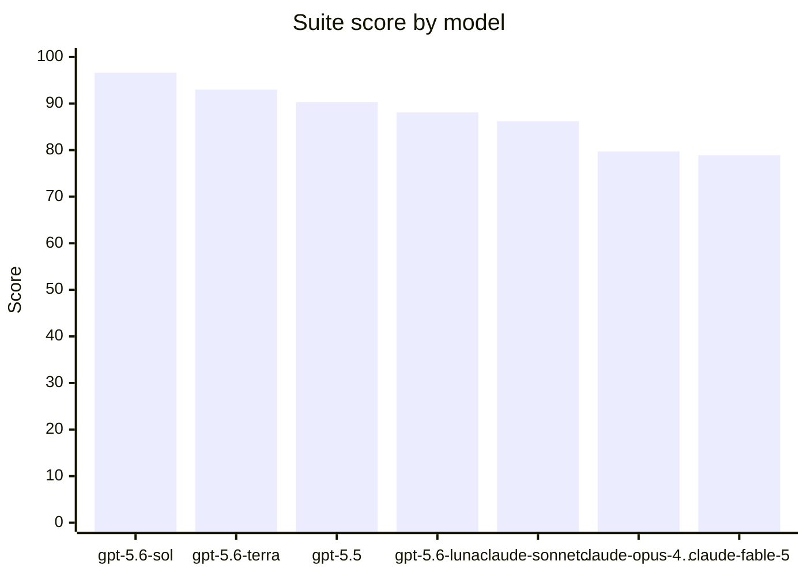

# 🏆 CoreAI Benchmark — CoreAI Game-Creation Benchmark v2 — frontier sweep

7 model(s), ranked by suite score.

| # | Model | Suite | Pass-rate | P/PA/F | Eff | Tool-err | Tokens | Run |
|---:|---|---:|---:|---|---:|---:|---:|---|
| 1 | `gpt-5.6-sol` | **96.6** | 85.7% | 24/3/1 | 0 | 2.8% | 16379 | `gpt-5.6-sol` |
| 2 | `gpt-5.6-terra` | **93** | 86.2% | 25/2/2 | 0 | 1.5% | 32194 | `gpt-5.6-terra` |
| 3 | `gpt-5.5` | **90.3** | 82.8% | 24/2/3 | 0 | 13.5% | 17188 | `gpt-5.5` |
| 4 | `gpt-5.6-luna` | **88.1** | 79.3% | 23/2/4 | 0 | 9.2% | 18426 | `gpt-5.6-luna` |
| 5 | `claude-sonnet-5` | **86.2** | 75.9% | 22/4/3 | 0 | 23.2% | 18250 | `claude-sonnet-5` |
| 6 | `claude-opus-4.8` | **79.7** | 75.9% | 22/2/5 | 0 | 22% | 19851 | `claude-opus-4.8` |
| 7 | `claude-fable-5` | **78.9** | 72.4% | 21/3/5 | 0 | 32.1% | 21980 | `claude-fable-5` |

