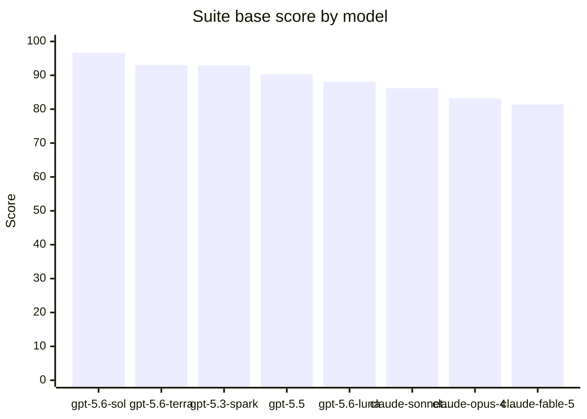

# 🏆 CoreAI Benchmark — CoreAI Game-Creation Benchmark v2 — frontier sweep

8 model(s), ranked by suite base score (suite v1.7, benchmark v2 prompts, G1–G8).

| # | Model | Suite | Pass-rate | P/PA/F | Tool-err | Tokens |
|---:|---|---:|---:|---|---:|---:|
| 1 | `gpt-5.6-sol` | **96.6** | 85.7% | 24/3/1 | 2.8% | 16379 |
| 2 | `gpt-5.6-terra` | **93.0** | 86.2% | 25/2/2 | 1.5% | 32194 |
| 3 | `gpt-5.3-spark` | **92.9** | 79.3% | 23/5/1 | 35.5% | 17616 |
| 4 | `gpt-5.5` | **90.3** | 82.8% | 24/2/3 | 13.5% | 17188 |
| 5 | `gpt-5.6-luna` | **88.1** | 79.3% | 23/2/4 | 9.2% | 18426 |
| 6 | `claude-sonnet-5` | **86.2** | 75.9% | 22/4/3 | 23.2% | 18250 |
| 7 | `claude-opus-4.8` | **83.2** | 79.3% | 23/2/4 | 23.9% | 26250 |
| 8 | `claude-fable-5` | **81.4** | 75.9% | 22/3/4 | 36.1% | 22360 |

> Generated by `CoreAI/Benchmarks/Build Model Comparison Report` from the newest per-model run JSON.
> `opus-4.8`, `fable-5` and `gpt-5.3-spark` were re-run after the `cli-agents` bridge gained a
> no-tool-call recovery retry. Single run per model over the CLI bridge; speed is reported, never scored.
>
> ⚠️ **Claude scores are understated.** The Claude rows ran through a non-native, unstable API with a high
> tool-failure rate (opus ~24%, sonnet ~23%, fable ~36% — well-formed calls that still fail to land) that
> cost points on tool correctness and task completion. Read them as a lower bound; a native API run would
> score higher. See [BENCHMARK_LEADERBOARD.md](../BENCHMARK_LEADERBOARD.md) for the full per-group (G1…G8) table.

