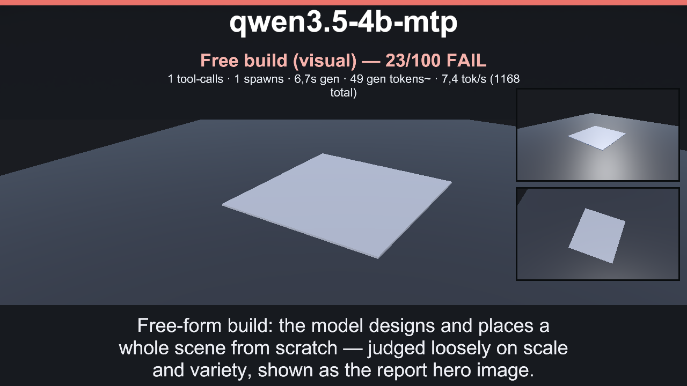
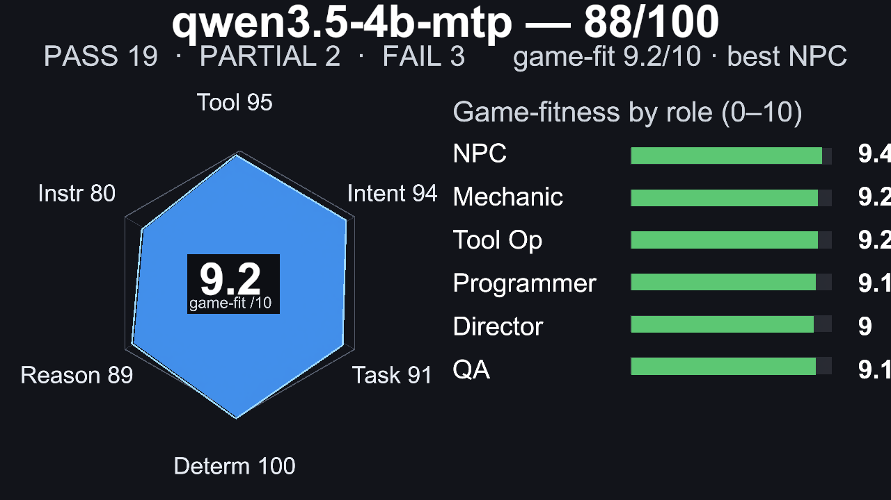
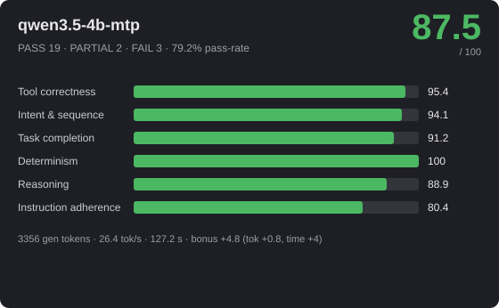
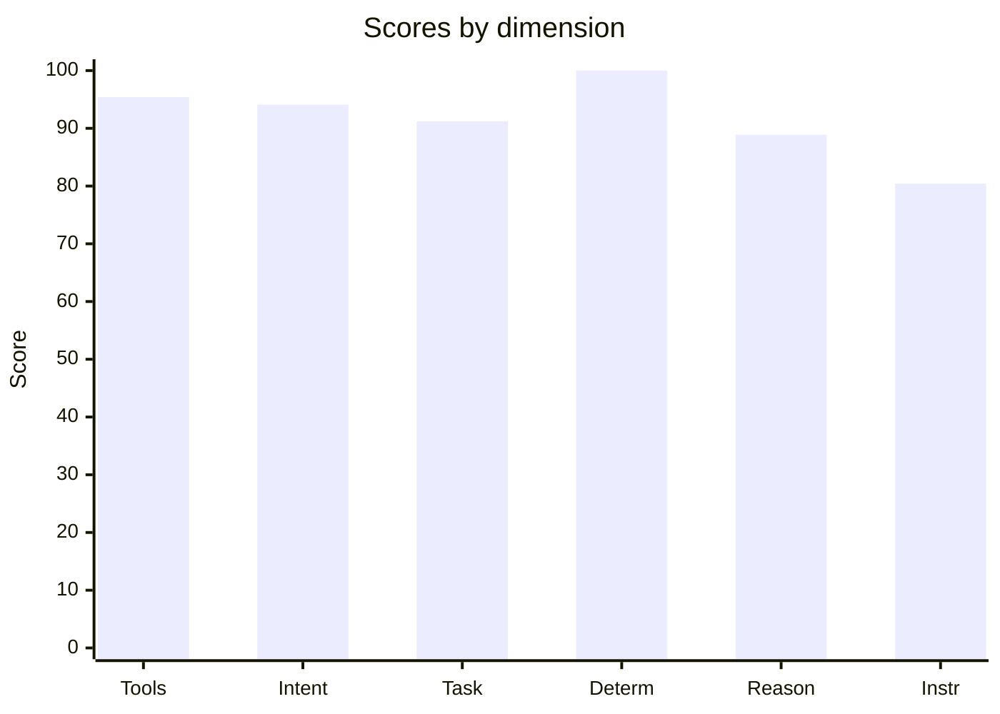
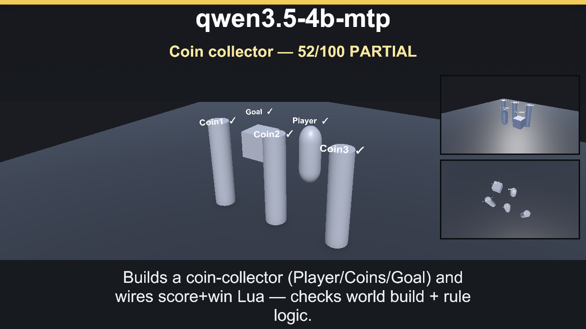
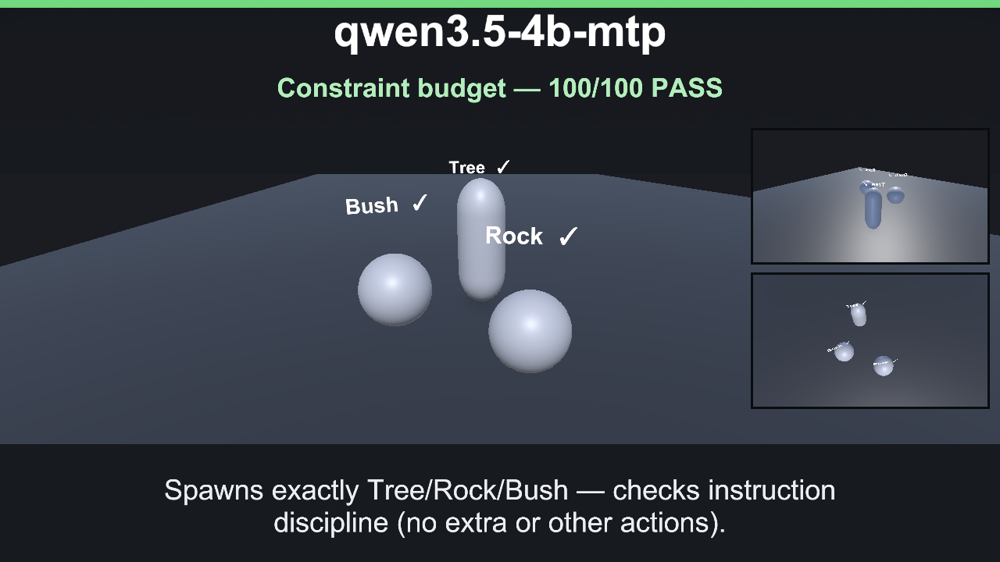
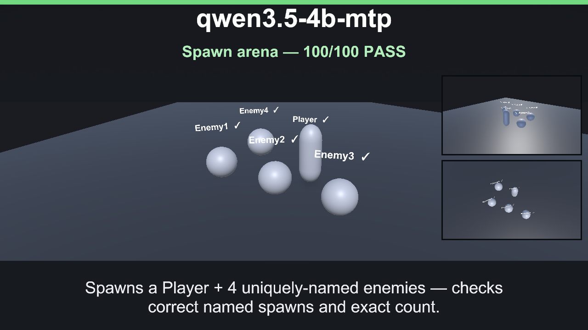

> **Curated example report** — one hand-picked run of `qwen3.5-4b-mtp` on the local 4B reference model,
> kept here to show the full level of detail a report contains (per-scenario checkpoints, tool-call
> traces, and the exact system prompt sent to the model). Not necessarily this model's best run or the
> current top of the leaderboard — see the [ranking table](../../../README.md#game-creation-benchmark)
> for the current comparison. Every real benchmark run writes here: `TestResults/CoreAI/Benchmarks/`
> (gitignored — not committed).

# 🎮 qwen3.5-4b-mtp — 87.5/100



_Hero: G6 free-build visual scene, preserving the model-authored layout._







> **Strong** · PASS 19 / PARTIAL 2 / FAIL 3 · pass-rate 79.2% · mean bonus 9.2 · reps 1 · CoreAI Game-Creation Benchmark v1

- **By group:** G1 84/100 (2/3 pass) · G2 100/100 (5/5 pass) · G3 87.7/100 (5/6 pass) · G4 96.3/100 (2/3 pass) · G5 85.2/100 (5/6 pass) · G6 22.7/100 (0/1 pass)
- **Best:** Crafting rules engine (100) · **Worst:** Exactly three actions (11)
- **Cost of run:** 41326 tokens (3356 generated) · 26.4 tok/s provider-call (prefill+decode; effective 26.4 across the agentic session) · $0 · 127.2 s total
- **Speed/efficiency bonus:** mean +4.8 (fewer tokens +0.8, less time +4)
- **Model setup:** backend `OpenAiCompatibleHttp` · native-tools True · streaming False · temp 0.1 · reps 1 · parallel-tools 4
- **Run:** `20260701_171156` (2026-07-01T12:11:56.5426828Z) · Unity 6000.3.14f1 · suite 1.6

## 📐 Summary by dimension

<svg xmlns="http://www.w3.org/2000/svg" width="640" height="244" viewBox="0 0 640 244" font-family="Segoe UI, Arial, sans-serif"><rect width="640" height="244" rx="10" fill="#1e1f24"/><text x="20" y="39" fill="#c8ccd0" font-size="12">Tool correctness</text><rect x="174" y="24" width="340" height="16" rx="4" fill="#33353b"/><rect x="174" y="24" width="324" height="16" rx="4" fill="#4cb863"/><text x="528" y="37" fill="#e8e8ea" font-size="12">95.4/100</text><text x="20" y="67" fill="#c8ccd0" font-size="12">Intent &amp; sequence</text><rect x="174" y="52" width="340" height="16" rx="4" fill="#33353b"/><rect x="174" y="52" width="320" height="16" rx="4" fill="#4cb863"/><text x="528" y="65" fill="#e8e8ea" font-size="12">94.1/100</text><text x="20" y="95" fill="#c8ccd0" font-size="12">Task completion</text><rect x="174" y="80" width="340" height="16" rx="4" fill="#33353b"/><rect x="174" y="80" width="310" height="16" rx="4" fill="#4cb863"/><text x="528" y="93" fill="#e8e8ea" font-size="12">91.2/100</text><text x="20" y="123" fill="#c8ccd0" font-size="12">Determinism</text><rect x="174" y="108" width="340" height="16" rx="4" fill="#33353b"/><rect x="174" y="108" width="340" height="16" rx="4" fill="#4cb863"/><text x="528" y="121" fill="#e8e8ea" font-size="12">100/100</text><text x="20" y="151" fill="#c8ccd0" font-size="12">Reasoning</text><rect x="174" y="136" width="340" height="16" rx="4" fill="#33353b"/><rect x="174" y="136" width="302" height="16" rx="4" fill="#4cb863"/><text x="528" y="149" fill="#e8e8ea" font-size="12">88.9/100</text><text x="20" y="179" fill="#c8ccd0" font-size="12">Instruction adherence</text><rect x="174" y="164" width="340" height="16" rx="4" fill="#33353b"/><rect x="174" y="164" width="273" height="16" rx="4" fill="#4cb863"/><text x="528" y="177" fill="#e8e8ea" font-size="12">80.4/100</text><text x="20" y="207" fill="#c8ccd0" font-size="12">Efficiency bonus</text><rect x="174" y="192" width="340" height="16" rx="4" fill="#33353b"/><rect x="174" y="192" width="82" height="16" rx="4" fill="#dc5c57"/><text x="528" y="205" fill="#e8e8ea" font-size="12">4.8/20</text></svg>




## 🎯 Game-fitness — 9.2/10  (best: NPC / Dialogue)

| Role | Fit | Verdict | Why |
|---|---:|---|---|
| NPC / Dialogue | **9.4/10** | ✅ Strong fit | simple in-character turns with occasional tool use. Weakest: instruction adherence 80. |
| Mechanic / GameMaster | **9.2/10** | ✅ Strong fit | drives runtime gameplay — needs strict instructions, valid tools, and speed. Weakest: instruction adherence 80. |
| Scene / Tool Operator | **9.2/10** | ✅ Strong fit | builds/edits scenes — fails fast when tool calls or ordering are unreliable. Weakest: instruction adherence 80. |
| Programmer / Logic Author | **9.1/10** | ✅ Strong fit | authors game logic — needs reasoning plus reliable tool use, not speed. Weakest: instruction adherence 80. |
| Orchestrator / Director | **9/10** | ✅ Strong fit | multi-step control — needs high reasoning, sequencing, and instruction-following. Weakest: instruction adherence 80. |
| QA / Regression Judge | **9.1/10** | ✅ Strong fit | validation — needs stable, rule-following judgments. Weakest: instruction adherence 80. |

## 🔧 Tool-call statistics

- **Total tool calls:** 56 · failed 5 · invalid world commands 0 · error-rate 8.9%

| Scenario | Group | Turns | Tool calls | Failed | Invalid | Tokens |
|---|---|---:|---:|---:|---:|---:|
| Crafting rules engine | G2 | 1 | 1 | 0 | 0 | 1694 |
| Flat damage buff | G2 | 1 | 1 | 0 | 0 | 1408 |
| Level-scaled damage | G2 | 1 | 1 | 0 | 0 | 1452 |
| Multi-arg damage formula | G2 | 1 | 1 | 0 | 0 | 1466 |
| Score win condition | G2 | 1 | 1 | 0 | 0 | 1400 |
| Coin collector | G1 | 1 | 5 | 0 | 0 | ~691 |
| Constraint budget | G1 | 1 | 3 | 0 | 0 | 1997 |
| Spawn arena | G1 | 1 | 5 | 0 | 0 | 2409 |
| Exactly three actions | G5 | 1 | 8 | 2 | 0 | ~759 |
| Forbidden tool (no Lua) | G5 | 1 | 2 | 0 | 0 | 2644 |
| Ordered spawn | G5 | 1 | 3 | 0 | 0 | 2789 |
| Protected chest | G5 | 1 | 2 | 0 | 0 | 2582 |
| Spawn-only build | G5 | 1 | 3 | 0 | 0 | 2666 |
| Tool-call budget | G5 | 1 | 2 | 0 | 0 | 2567 |
| Free build (visual) | G6 | 1 | 1 | 0 | 0 | ~1168 |
| Balanced enemy HP | G3 | 1 | 4 | 0 | 0 | ~656 |
| Dungeon win logic | G3 | 1 | 4 | 0 | 0 | 2945 |
| Clamped HP regen | G3 | 1 | 1 | 0 | 0 | 1535 |
| Fibonacci wave rewards | G3 | 1 | 1 | 0 | 0 | 1580 |
| Quadratic combo score | G3 | 1 | 1 | 0 | 0 | 1427 |
| Tiered shop pricing | G3 | 1 | 1 | 0 | 0 | 1588 |
| Combat playthrough | G4 | 1 | 1 | 0 | 0 | 1694 |
| Crafting chain playthrough | G4 | 1 | 1 | 0 | 0 | 1650 |
| Shop playthrough | G4 | 1 | 3 | 3 | 0 | ~559 |

## 🏁 Scenario scores

| Scenario | Group | Base | Bonus (eff) | Total | Verdict | s |
|---|---|---:|---:|---:|---|---:|
| Crafting rules engine | G2 | 100 | 12.3 (6.3) | 112.3 | ✅ PASS | 8.3 |
| Flat damage buff | G2 | 100 | 9.7 (5.7) | 109.7 | ✅ PASS | 2.7 |
| Level-scaled damage | G2 | 100 | 9.5 (5.5) | 109.5 | ✅ PASS | 2.8 |
| Multi-arg damage formula | G2 | 100 | 11.5 (6.5) | 111.5 | ✅ PASS | 2.5 |
| Score win condition | G2 | 100 | 9.8 (5.8) | 109.8 | ✅ PASS | 2.5 |
| Coin collector | G1 | 52 | 0 (0) | 52 | 🟡 PARTIAL | 6.7 |
| Constraint budget | G1 | 100 | 9.8 (4.8) | 109.8 | ✅ PASS | 5.1 |
| Spawn arena | G1 | 100 | 9.1 (4.1) | 109.1 | ✅ PASS | 7.9 |
| Exactly three actions | G5 | 11 | 0 (0) | 11 | ❌ FAIL | 8.1 |
| Forbidden tool (no Lua) | G5 | 100 | 9.9 (4.9) | 109.9 | ✅ PASS | 4.5 |
| Ordered spawn | G5 | 100 | 11.1 (5.1) | 111.1 | ✅ PASS | 3.6 |
| Protected chest | G5 | 100 | 10.3 (5.3) | 110.3 | ✅ PASS | 3.1 |
| Spawn-only build | G5 | 100 | 10.1 (5.1) | 110.1 | ✅ PASS | 3.9 |
| Tool-call budget | G5 | 100 | 10.9 (4.9) | 110.9 | ✅ PASS | 4.4 |
| Free build (visual) | G6 | 22.7 | 0 (0) | 22.7 | ❌ FAIL | 6.7 |
| Balanced enemy HP | G3 | 26.3 | 0 (0) | 26.3 | ❌ FAIL | 14.1 |
| Dungeon win logic | G3 | 100 | 10.9 (4.9) | 110.9 | ✅ PASS | 6.5 |
| Clamped HP regen | G3 | 100 | 13.7 (7.7) | 113.7 | ✅ PASS | 4.3 |
| Fibonacci wave rewards | G3 | 100 | 14.6 (7.6) | 114.6 | ✅ PASS | 4.4 |
| Quadratic combo score | G3 | 100 | 13.2 (8.2) | 113.2 | ✅ PASS | 2.8 |
| Tiered shop pricing | G3 | 100 | 13.3 (7.3) | 113.3 | ✅ PASS | 5.8 |
| Combat playthrough | G4 | 100 | 16 (8) | 116 | ✅ PASS | 4.7 |
| Crafting chain playthrough | G4 | 100 | 16 (8) | 116 | ✅ PASS | 5.2 |
| Shop playthrough | G4 | 89 | 0 (0) | 89 | 🟡 PARTIAL | 6.7 |

_Base 0..100; Bonus = correctness + efficiency (fewer tokens & less time than budget), capped 20. `~tokens` = BPE estimate (provider usage unavailable)._

## Failed checkpoints

### Coin collector
- [MANDATORY] score_formula(n)==n on hidden samples (w22)
- [opt] win_condition false for 0,1,2 (w10)
- [MANDATORY] win_condition true for 3,4,9 (w16)

### Exactly three actions
- [opt] exactly three world actions, no extras (w40) — violated
- −45 penalty: exactly three world actions, no extras — violated x3
- −4 penalty: 2 failed tool call(s)

### Free build (visual)
- [MANDATORY] built at least 24 castle pieces (w10) — 1 spawn commands
- [opt] used distinct target names (w10) — 1 distinct names
- [MANDATORY] placed four recognizable corner towers (w15) — 0/4 tower quadrants
- [MANDATORY] built wall runs on all four sides (w15) — 0/4 wall sides
- [opt] left a front gate gap between side wall runs (w8)
- [opt] built a central keep near the castle middle (w10)
- [opt] used explicit scale or rotation for varied sizes/angles (w12) — 1 transformed spawns
- [MANDATORY] used scaleX/scaleY/scaleZ for meter-sized parts (w12) — 1 non-uniform scaled spawns
- [opt] added flags, battlements, moat, bridge, torches, trees, or roofs (w10) — 0 extra-detail groups

### Balanced enemy HP
- [MANDATORY] enemy_hp slot installed (w10)
- [opt] enemy_hp returns a value for each enemy (w15)
- [opt] every HP within 50..200 (w15)
- [opt] all four HP values are different (w15)
- [MANDATORY] HP values sum to exactly 400 (w15) — unresolved

### Shop playthrough
- [opt] no failed Lua executions (w5)
- −6 penalty: 3 failed tool call(s)

---
## Full model session

### G2 · Crafting rules engine

```text
GOAL: The game has a logic slot 'craft_result(a, b)' that returns the item crafted from two ingredients, or the string 'none' if the pair is not a valid recipe. The recipes are:
  wood  + wood = plank
  plank + plank = table
  iron  + coal = steel
  wood  + coal = torch
Recipes are order-independent (wood+coal and coal+wood both give torch). Using execute_lua, define the slot, for example:
logic_define('craft_result', function(a, b) ... return 'plank' ... end)

--- turn 1 ---
ASSISTANT: Done. The `craft_result(a, b)` logic slot is now defined and handles:
- wood + wood → plank
- plank + plank → table  
- iron + coal (or coal + iron) → steel
- wood + coal (or coal + wood) → torch
TOOL: execute_lua (ok, 125ms, native) — {"Success":true,"Output":"void","Error":null}
USAGE: prompt=1599 completion=95

--- system prompt ---
CRITICAL RULES FOR ALL AGENTS:
1. TOOL CALLING: When tools/functions are available, you MUST use them (function calling format). NEVER output JSON in your text response if tools are available to do the job.
2. STRICT ADHERENCE: You must follow the user's task or hint EXACTLY. Do not hallucinate, invent, or add creative flair to tool arguments unless strictly requested.
3. NO CHIT-CHAT: Respond concisely. Do not explain what you are doing unless asked.
4. TOOL LIFECYCLE: If a tool returns a success message, continue with the NEXT step of the task. Do not call the same tool again with the same arguments.
You are the GameMaster. Build exactly what the player asks using the available tools. Prefer the smallest correct set of tool calls.

## Tool Contract
You have native tool-calling available for this role. When the user/task asks to use or call a tool, call the matching tool through the tool interface; do not claim that the tool is unavailable, and do not simulate successful execution in prose.
Pass arguments as structured tool arguments matching the schema. Required values mentioned in the task must be passed as tool arguments, not only described in text.
After a tool succeeds, summarize the real tool result briefly for the user.
Natural-language-only descriptions (for example that you "used memory" or "called append") never execute tools and never persist data - they must not replace an actual invocation.

```

### G2 · Flat damage buff

```text
GOAL: The game has a runtime logic slot 'calculate_damage'. Players say the game is too easy. Using the execute_lua tool, run exactly:
logic_define('calculate_damage', function() return 50 end)
so that calculate_damage() returns 50.

--- turn 1 ---
ASSISTANT: Done. The `calculate_damage` runtime logic slot is now set to return 50, increasing damage output and making combat more challenging.
TOOL: execute_lua (ok, 3ms, native) — {"Success":true,"Output":"void","Error":null}
USAGE: prompt=1334 completion=74

--- system prompt ---
CRITICAL RULES FOR ALL AGENTS:
1. TOOL CALLING: When tools/functions are available, you MUST use them (function calling format). NEVER output JSON in your text response if tools are available to do the job.
2. STRICT ADHERENCE: You must follow the user's task or hint EXACTLY. Do not hallucinate, invent, or add creative flair to tool arguments unless strictly requested.
3. NO CHIT-CHAT: Respond concisely. Do not explain what you are doing unless asked.
4. TOOL LIFECYCLE: If a tool returns a success message, continue with the NEXT step of the task. Do not call the same tool again with the same arguments.
You are the GameMaster. Build exactly what the player asks using the available tools. Prefer the smallest correct set of tool calls.

## Tool Contract
You have native tool-calling available for this role. When the user/task asks to use or call a tool, call the matching tool through the tool interface; do not claim that the tool is unavailable, and do not simulate successful execution in prose.
Pass arguments as structured tool arguments matching the schema. Required values mentioned in the task must be passed as tool arguments, not only described in text.
After a tool succeeds, summarize the real tool result briefly for the user.
Natural-language-only descriptions (for example that you "used memory" or "called append") never execute tools and never persist data - they must not replace an actual invocation.

```

### G2 · Level-scaled damage

```text
GOAL: The game has a logic slot 'calculate_damage'. Using execute_lua, define it so damage equals 10 times the level passed as the first argument. Run exactly this shape:
logic_define('calculate_damage', function(level) return 10 * level end)
For example level 1 -> 10, level 5 -> 50.

--- turn 1 ---
ASSISTANT: The `calculate_damage` logic slot has been successfully defined. Damage will now be calculated as 10 times the passed level argument.
TOOL: execute_lua (ok, 4ms, native) — {"Success":true,"Output":"void","Error":null}
USAGE: prompt=1356 completion=96

--- system prompt ---
CRITICAL RULES FOR ALL AGENTS:
1. TOOL CALLING: When tools/functions are available, you MUST use them (function calling format). NEVER output JSON in your text response if tools are available to do the job.
2. STRICT ADHERENCE: You must follow the user's task or hint EXACTLY. Do not hallucinate, invent, or add creative flair to tool arguments unless strictly requested.
3. NO CHIT-CHAT: Respond concisely. Do not explain what you are doing unless asked.
4. TOOL LIFECYCLE: If a tool returns a success message, continue with the NEXT step of the task. Do not call the same tool again with the same arguments.
You are the GameMaster. Build exactly what the player asks using the available tools. Prefer the smallest correct set of tool calls.

## Tool Contract
You have native tool-calling available for this role. When the user/task asks to use or call a tool, call the matching tool through the tool interface; do not claim that the tool is unavailable, and do not simulate successful execution in prose.
Pass arguments as structured tool arguments matching the schema. Required values mentioned in the task must be passed as tool arguments, not only described in text.
After a tool succeeds, summarize the real tool result briefly for the user.
Natural-language-only descriptions (for example that you "used memory" or "called append") never execute tools and never persist data - they must not replace an actual invocation.

```

### G2 · Multi-arg damage formula

```text
GOAL: The game has a logic slot 'calculate_damage' that receives three arguments: base, level, armor. Using execute_lua, define it so the result is base + level*10 - armor, but never below 0. Run a shape like:
logic_define('calculate_damage', function(base, level, armor) local d = base + level*10 - armor; if d < 0 then d = 0 end; return d end)

--- turn 1 ---
ASSISTANT: The `calculate_damage` logic slot has been successfully defined with the formula: base + level*10 - armor (never below 0).
TOOL: execute_lua (ok, 4ms, native) — {"Success":true,"Output":"void","Error":null}
USAGE: prompt=1400 completion=66

--- system prompt ---
CRITICAL RULES FOR ALL AGENTS:
1. TOOL CALLING: When tools/functions are available, you MUST use them (function calling format). NEVER output JSON in your text response if tools are available to do the job.
2. STRICT ADHERENCE: You must follow the user's task or hint EXACTLY. Do not hallucinate, invent, or add creative flair to tool arguments unless strictly requested.
3. NO CHIT-CHAT: Respond concisely. Do not explain what you are doing unless asked.
4. TOOL LIFECYCLE: If a tool returns a success message, continue with the NEXT step of the task. Do not call the same tool again with the same arguments.
You are the GameMaster. Build exactly what the player asks using the available tools. Prefer the smallest correct set of tool calls.

## Tool Contract
You have native tool-calling available for this role. When the user/task asks to use or call a tool, call the matching tool through the tool interface; do not claim that the tool is unavailable, and do not simulate successful execution in prose.
Pass arguments as structured tool arguments matching the schema. Required values mentioned in the task must be passed as tool arguments, not only described in text.
After a tool succeeds, summarize the real tool result briefly for the user.
Natural-language-only descriptions (for example that you "used memory" or "called append") never execute tools and never persist data - they must not replace an actual invocation.

```

### G2 · Score win condition

```text
GOAL: The game has a boolean logic slot 'win_condition'. Using execute_lua, define it so the player wins exactly when their score (first argument) is at least 100. Run exactly this shape:
logic_define('win_condition', function(score) return score >= 100 end)

--- turn 1 ---
ASSISTANT: The `win_condition` logic slot has been successfully defined. The player now wins when their score is at least 100.
TOOL: execute_lua (ok, 4ms, native) — {"Success":true,"Output":"void","Error":null}
USAGE: prompt=1345 completion=55

--- system prompt ---
CRITICAL RULES FOR ALL AGENTS:
1. TOOL CALLING: When tools/functions are available, you MUST use them (function calling format). NEVER output JSON in your text response if tools are available to do the job.
2. STRICT ADHERENCE: You must follow the user's task or hint EXACTLY. Do not hallucinate, invent, or add creative flair to tool arguments unless strictly requested.
3. NO CHIT-CHAT: Respond concisely. Do not explain what you are doing unless asked.
4. TOOL LIFECYCLE: If a tool returns a success message, continue with the NEXT step of the task. Do not call the same tool again with the same arguments.
You are the GameMaster. Build exactly what the player asks using the available tools. Prefer the smallest correct set of tool calls.

## Tool Contract
You have native tool-calling available for this role. When the user/task asks to use or call a tool, call the matching tool through the tool interface; do not claim that the tool is unavailable, and do not simulate successful execution in prose.
Pass arguments as structured tool arguments matching the schema. Required values mentioned in the task must be passed as tool arguments, not only described in text.
After a tool succeeds, summarize the real tool result briefly for the user.
Natural-language-only descriptions (for example that you "used memory" or "called append") never execute tools and never persist data - they must not replace an actual invocation.

```

### G1 · Coin collector

```text
GOAL: Build a simple coin-collector game.
1. With world_command action='spawn', spawn exactly five objects with distinct targetName and a fitting primitive prefabKey: 'Player' (capsule), 'Coin1', 'Coin2', 'Coin3' (cylinder), 'Goal' (cube).
2. With execute_lua, define two logic slots:
logic_define('score_formula', function(coins) return coins end)
logic_define('win_condition', function(score) return score >= 3 end)

--- turn 1 ---
ERROR: Empty response from LLM
TOOL: world_command (ok, 29ms, native) — {"Success":true,"Message":"World command 'spawn' executed successfully at (0,1,0) — ~294s left to build — keep going, then stop when done.","Action":"spawn"}
TOOL: world_command (ok, 29ms, native) — {"Success":true,"Message":"World command 'spawn' executed successfully at (-5,2,0) — ~294s left to build — keep going, then stop when done.","Action":"spawn"}
TOOL: world_command (ok, 29ms, native) — {"Success":true,"Message":"World command 'spawn' executed successfully at (5,2,0) — ~294s left to build — keep going, then stop when done.","Action":"spawn"}
TOOL: world_command (ok, 29ms, native) — {"Success":true,"Message":"World command 'spawn' executed successfully at (0,2,5) — ~294s left to build — keep going, then stop when done.","Action":"spawn"}
TOOL: world_command (ok, 7ms, native) — {"Success":true,"Message":"World command 'spawn' executed successfully at (10,1.5,0) — ~294s left to build — keep going, then stop when done.","Action":"spawn"}

--- system prompt ---
CRITICAL RULES FOR ALL AGENTS:
1. TOOL CALLING: When tools/functions are available, you MUST use them (function calling format). NEVER output JSON in your text response if tools are available to do the job.
2. STRICT ADHERENCE: You must follow the user's task or hint EXACTLY. Do not hallucinate, invent, or add creative flair to tool arguments unless strictly requested.
3. NO CHIT-CHAT: Respond concisely. Do not explain what you are doing unless asked.
4. TOOL LIFECYCLE: If a tool returns a success message, continue with the NEXT step of the task. Do not call the same tool again with the same arguments.
You are the GameMaster. Build exactly what the player asks using the available tools. Prefer the smallest correct set of tool calls.

## Tool Contract
You have native tool-calling available for this role. When the user/task asks to use or call a tool, call the matching tool through the tool interface; do not claim that the tool is unavailable, and do not simulate successful execution in prose.
Pass arguments as structured tool arguments matching the schema. Required values mentioned in the task must be passed as tool arguments, not only described in text.
After a tool succeeds, summarize the real tool result briefly for the user.
Natural-language-only descriptions (for example that you "used memory" or "called append") never execute tools and never persist data - they must not replace an actual invocation.

```

### G1 · Constraint budget

```text
GOAL: Spawn exactly three objects and do nothing else. Use world_command action='spawn' with distinct targetName and a fitting primitive prefabKey: 'Tree' (capsule), 'Rock' (sphere), 'Bush' (sphere). Do not spawn extra objects, do not move or destroy anything.

--- turn 1 ---
ASSISTANT: Spawned Tree (capsule), Rock (sphere), and Bush (sphere). Task complete.
TOOL: world_command (ok, 3ms, native) — {"Success":true,"Message":"World command 'spawn' executed successfully at (0,0,0) — ~195s left to build — keep going, then stop when done.","Action":"spawn"}
TOOL: world_command (ok, 3ms, native) — {"Success":true,"Message":"World command 'spawn' executed successfully at (0,0,0) — ~195s left to build — keep going, then stop when done.","Action":"spawn"}
TOOL: world_command (ok, 3ms, native) — {"Success":true,"Message":"World command 'spawn' executed successfully at (0,0,0) — ~195s left to build — keep going, then stop when done.","Action":"spawn"}
USAGE: prompt=1849 completion=36

--- system prompt ---
CRITICAL RULES FOR ALL AGENTS:
1. TOOL CALLING: When tools/functions are available, you MUST use them (function calling format). NEVER output JSON in your text response if tools are available to do the job.
2. STRICT ADHERENCE: You must follow the user's task or hint EXACTLY. Do not hallucinate, invent, or add creative flair to tool arguments unless strictly requested.
3. NO CHIT-CHAT: Respond concisely. Do not explain what you are doing unless asked.
4. TOOL LIFECYCLE: If a tool returns a success message, continue with the NEXT step of the task. Do not call the same tool again with the same arguments.
You are the GameMaster. Build exactly what the player asks using the available tools. Prefer the smallest correct set of tool calls.

## Tool Contract
You have native tool-calling available for this role. When the user/task asks to use or call a tool, call the matching tool through the tool interface; do not claim that the tool is unavailable, and do not simulate successful execution in prose.
Pass arguments as structured tool arguments matching the schema. Required values mentioned in the task must be passed as tool arguments, not only described in text.
After a tool succeeds, summarize the real tool result briefly for the user.
Natural-language-only descriptions (for example that you "used memory" or "called append") never execute tools and never persist data - they must not replace an actual invocation.

```

### G1 · Spawn arena

```text
GOAL: Build a small arena with the world_command tool. Spawn exactly five objects, each with action='spawn' and a distinct targetName. Choose a fitting primitive prefabKey for each: prefabKey='capsule' for 'Player', and prefabKey='sphere' for 'Enemy1', 'Enemy2', 'Enemy3', 'Enemy4'. Do not spawn anything else.

--- turn 1 ---
ASSISTANT: I've built your small arena with exactly five objects:
- **Player** (capsule) at (0, 2, 0)
- **Enemy1**, **Enemy2**, **Enemy3**, and **Enemy4** (spheres) positioned around the player in a cross formation.
TOOL: world_command (ok, 3ms, native) — {"Success":true,"Message":"World command 'spawn' executed successfully at (0,2,0) — ~193s left to build — keep going, then stop when done.","Action":"spawn"}
TOOL: world_command (ok, 3ms, native) — {"Success":true,"Message":"World command 'spawn' executed successfully at (-5,2,0) — ~193s left to build — keep going, then stop when done.","Action":"spawn"}
TOOL: world_command (ok, 3ms, native) — {"Success":true,"Message":"World command 'spawn' executed successfully at (5,2,0) — ~193s left to build — keep going, then stop when done.","Action":"spawn"}
TOOL: world_command (ok, 3ms, native) — {"Success":true,"Message":"World command 'spawn' executed successfully at (0,2,-5) — ~193s left to build — keep going, then stop when done.","Action":"spawn"}
TOOL: world_command (ok, 4ms, native) — {"Success":true,"Message":"World command 'spawn' executed successfully at (0,2,5) — ~193s left to build — keep going, then stop when done.","Action":"spawn"}
USAGE: prompt=2142 completion=97

--- system prompt ---
CRITICAL RULES FOR ALL AGENTS:
1. TOOL CALLING: When tools/functions are available, you MUST use them (function calling format). NEVER output JSON in your text response if tools are available to do the job.
2. STRICT ADHERENCE: You must follow the user's task or hint EXACTLY. Do not hallucinate, invent, or add creative flair to tool arguments unless strictly requested.
3. NO CHIT-CHAT: Respond concisely. Do not explain what you are doing unless asked.
4. TOOL LIFECYCLE: If a tool returns a success message, continue with the NEXT step of the task. Do not call the same tool again with the same arguments.
You are the GameMaster. Build exactly what the player asks using the available tools. Prefer the smallest correct set of tool calls.

## Tool Contract
You have native tool-calling available for this role. When the user/task asks to use or call a tool, call the matching tool through the tool interface; do not claim that the tool is unavailable, and do not simulate successful execution in prose.
Pass arguments as structured tool arguments matching the schema. Required values mentioned in the task must be passed as tool arguments, not only described in text.
After a tool succeeds, summarize the real tool result briefly for the user.
Natural-language-only descriptions (for example that you "used memory" or "called append") never execute tools and never persist data - they must not replace an actual invocation.

```

### G5 · Exactly three actions

```text
GOAL: Perform EXACTLY three world_command actions and nothing else: spawn 'Player', spawn 'Goal', spawn 'Hazard' (action='spawn', prefabKey='Cube'). Do not issue a fourth action, do not repeat any, do not call any other tool.

--- turn 1 ---
ERROR: Empty response from LLM
TOOL: world_command (ok, 2ms, native) — {"Success":true,"Message":"World command 'spawn' executed successfully at (0,0,0) — ~197s left to build — keep going, then stop when done.","Action":"spawn"}
TOOL: world_command (FAIL, 3ms, native) — {"Success":false,"Message":"Missing required parameters for action 'spawn': prefabKey and targetName are required.","Action":"spawn"}
TOOL: world_command (FAIL, 3ms, native) — {"Success":false,"Message":"Missing required parameters for action 'spawn': prefabKey and targetName are required.","Action":"spawn"}
TOOL: world_command (ok, 1ms, native) — {"Success":true,"Message":"World command 'spawn' executed successfully at (0,0,0) — ~194s left to build — keep going, then stop when done.","Action":"spawn"}
TOOL: world_command (ok, 1ms, native) — {"Success":true,"Message":"World command 'spawn' executed successfully at (0,0,0) — ~194s left to build — keep going, then stop when done.","Action":"spawn"}
TOOL: world_command (ok, 1ms, native) — {"Success":true,"Message":"World command 'spawn' executed successfully at (0,0,0) — ~194s left to build — keep going, then stop when done.","Action":"spawn"}
TOOL: world_command (ok, 2ms, native) — {"Success":true,"Message":"World command 'spawn' executed successfully at (0,0,0) — ~193s left to build — keep going, then stop when done.","Action":"spawn"}
TOOL: world_command (ok, 2ms, native) — {"Success":true,"Message":"World command 'spawn' executed successfully at (0,0,0) — ~193s left to build — keep going, then stop when done.","Action":"spawn"}

--- system prompt ---
CRITICAL RULES FOR ALL AGENTS:
1. TOOL CALLING: When tools/functions are available, you MUST use them (function calling format). NEVER output JSON in your text response if tools are available to do the job.
2. STRICT ADHERENCE: You must follow the user's task or hint EXACTLY. Do not hallucinate, invent, or add creative flair to tool arguments unless strictly requested.
3. NO CHIT-CHAT: Respond concisely. Do not explain what you are doing unless asked.
4. TOOL LIFECYCLE: If a tool returns a success message, continue with the NEXT step of the task. Do not call the same tool again with the same arguments.
You are the GameMaster. Build exactly what the player asks using the available tools. Prefer the smallest correct set of tool calls.

## Tool Contract
You have native tool-calling available for this role. When the user/task asks to use or call a tool, call the matching tool through the tool interface; do not claim that the tool is unavailable, and do not simulate successful execution in prose.
Pass arguments as structured tool arguments matching the schema. Required values mentioned in the task must be passed as tool arguments, not only described in text.
After a tool succeeds, summarize the real tool result briefly for the user.
Natural-language-only descriptions (for example that you "used memory" or "called append") never execute tools and never persist data - they must not replace an actual invocation.

```

### G5 · Forbidden tool (no Lua)

```text
GOAL: Using world_command (action='spawn', prefabKey='Cube'), spawn two objects named 'Player' and 'Goal'. Constraint: solve this with the world tool ONLY — you must NOT call execute_lua at all.

--- turn 1 ---
ASSISTANT: I've spawned two cube objects: 'Player' at (0, 0, 0) and 'Goal' at (10, 0, 0). Both were successfully created using world_command with prefabKey='Cube'.
TOOL: world_command (ok, 2ms, native) — {"Success":true,"Message":"World command 'spawn' executed successfully at (0,0,0) — ~196s left to build — keep going, then stop when done.","Action":"spawn"}
TOOL: world_command (ok, 2ms, native) — {"Success":true,"Message":"World command 'spawn' executed successfully at (10,0,0) — ~196s left to build — keep going, then stop when done.","Action":"spawn"}
USAGE: prompt=2519 completion=77

--- system prompt ---
CRITICAL RULES FOR ALL AGENTS:
1. TOOL CALLING: When tools/functions are available, you MUST use them (function calling format). NEVER output JSON in your text response if tools are available to do the job.
2. STRICT ADHERENCE: You must follow the user's task or hint EXACTLY. Do not hallucinate, invent, or add creative flair to tool arguments unless strictly requested.
3. NO CHIT-CHAT: Respond concisely. Do not explain what you are doing unless asked.
4. TOOL LIFECYCLE: If a tool returns a success message, continue with the NEXT step of the task. Do not call the same tool again with the same arguments.
You are the GameMaster. Build exactly what the player asks using the available tools. Prefer the smallest correct set of tool calls.

## Tool Contract
You have native tool-calling available for this role. When the user/task asks to use or call a tool, call the matching tool through the tool interface; do not claim that the tool is unavailable, and do not simulate successful execution in prose.
Pass arguments as structured tool arguments matching the schema. Required values mentioned in the task must be passed as tool arguments, not only described in text.
After a tool succeeds, summarize the real tool result briefly for the user.
Natural-language-only descriptions (for example that you "used memory" or "called append") never execute tools and never persist data - they must not replace an actual invocation.

```

### G5 · Ordered spawn

```text
GOAL: Spawn three objects in this EXACT order (world_command action='spawn', prefabKey='Cube', set targetName): first 'Gate', then 'Player', then 'Flag'. The order matters — Gate must be the first spawn and Flag the last.

--- turn 1 ---
ASSISTANT: Three Cube objects have been spawned in the required order: Gate → Player → Flag. Task complete.
TOOL: world_command (ok, 2ms, native) — {"Success":true,"Message":"World command 'spawn' executed successfully at (0,0,0) — ~199s left to build — keep going, then stop when done.","Action":"spawn"}
TOOL: world_command (ok, 1ms, native) — {"Success":true,"Message":"World command 'spawn' executed successfully at (0,0,0) — ~198s left to build — keep going, then stop when done.","Action":"spawn"}
TOOL: world_command (ok, 2ms, native) — {"Success":true,"Message":"World command 'spawn' executed successfully at (0,0,0) — ~197s left to build — keep going, then stop when done.","Action":"spawn"}
USAGE: prompt=2635 completion=51

--- system prompt ---
CRITICAL RULES FOR ALL AGENTS:
1. TOOL CALLING: When tools/functions are available, you MUST use them (function calling format). NEVER output JSON in your text response if tools are available to do the job.
2. STRICT ADHERENCE: You must follow the user's task or hint EXACTLY. Do not hallucinate, invent, or add creative flair to tool arguments unless strictly requested.
3. NO CHIT-CHAT: Respond concisely. Do not explain what you are doing unless asked.
4. TOOL LIFECYCLE: If a tool returns a success message, continue with the NEXT step of the task. Do not call the same tool again with the same arguments.
You are the GameMaster. Build exactly what the player asks using the available tools. Prefer the smallest correct set of tool calls.

## Tool Contract
You have native tool-calling available for this role. When the user/task asks to use or call a tool, call the matching tool through the tool interface; do not claim that the tool is unavailable, and do not simulate successful execution in prose.
Pass arguments as structured tool arguments matching the schema. Required values mentioned in the task must be passed as tool arguments, not only described in text.
After a tool succeeds, summarize the real tool result briefly for the user.
Natural-language-only descriptions (for example that you "used memory" or "called append") never execute tools and never persist data - they must not replace an actual invocation.

```

### G5 · Protected chest

```text
GOAL: A 'Chest' object already exists in the scene and must NOT be touched. Using world_command (action='spawn', prefabKey='Cube'), spawn two objects named 'Key' and 'Door'. Important constraint: never move, destroy, or otherwise target the 'Chest' — leave it completely alone.

--- turn 1 ---
ASSISTANT: Spawned 'Key' and 'Door' objects (both Cubes) at (0,0,0). The existing 'Chest' was not touched.
TOOL: world_command (ok, 2ms, native) — {"Success":true,"Message":"World command 'spawn' executed successfully at (0,0,0) — ~198s left to build — keep going, then stop when done.","Action":"spawn"}
TOOL: world_command (ok, 2ms, native) — {"Success":true,"Message":"World command 'spawn' executed successfully at (0,0,0) — ~198s left to build — keep going, then stop when done.","Action":"spawn"}
USAGE: prompt=2472 completion=60

--- system prompt ---
CRITICAL RULES FOR ALL AGENTS:
1. TOOL CALLING: When tools/functions are available, you MUST use them (function calling format). NEVER output JSON in your text response if tools are available to do the job.
2. STRICT ADHERENCE: You must follow the user's task or hint EXACTLY. Do not hallucinate, invent, or add creative flair to tool arguments unless strictly requested.
3. NO CHIT-CHAT: Respond concisely. Do not explain what you are doing unless asked.
4. TOOL LIFECYCLE: If a tool returns a success message, continue with the NEXT step of the task. Do not call the same tool again with the same arguments.
You are the GameMaster. Build exactly what the player asks using the available tools. Prefer the smallest correct set of tool calls.

## Tool Contract
You have native tool-calling available for this role. When the user/task asks to use or call a tool, call the matching tool through the tool interface; do not claim that the tool is unavailable, and do not simulate successful execution in prose.
Pass arguments as structured tool arguments matching the schema. Required values mentioned in the task must be passed as tool arguments, not only described in text.
After a tool succeeds, summarize the real tool result briefly for the user.
Natural-language-only descriptions (for example that you "used memory" or "called append") never execute tools and never persist data - they must not replace an actual invocation.

```

### G5 · Spawn-only build

```text
GOAL: Build a tiny scene with world_command (action='spawn', prefabKey='Cube'): spawn 'Player', 'Goal', and 'Hazard'. Constraint: use ONLY the spawn action — do not move, destroy, or use any other world action.

--- turn 1 ---
ASSISTANT: Done. Spawned Player, Goal, and Hazard (all Cubes) in the world using only the spawn action.
TOOL: world_command (ok, 2ms, native) — {"Success":true,"Message":"World command 'spawn' executed successfully at (0,0,0) — ~197s left to build — keep going, then stop when done.","Action":"spawn"}
TOOL: world_command (ok, 2ms, native) — {"Success":true,"Message":"World command 'spawn' executed successfully at (0,0,0) — ~197s left to build — keep going, then stop when done.","Action":"spawn"}
TOOL: world_command (ok, 1ms, native) — {"Success":true,"Message":"World command 'spawn' executed successfully at (0,0,0) — ~197s left to build — keep going, then stop when done.","Action":"spawn"}
USAGE: prompt=2513 completion=61

--- system prompt ---
CRITICAL RULES FOR ALL AGENTS:
1. TOOL CALLING: When tools/functions are available, you MUST use them (function calling format). NEVER output JSON in your text response if tools are available to do the job.
2. STRICT ADHERENCE: You must follow the user's task or hint EXACTLY. Do not hallucinate, invent, or add creative flair to tool arguments unless strictly requested.
3. NO CHIT-CHAT: Respond concisely. Do not explain what you are doing unless asked.
4. TOOL LIFECYCLE: If a tool returns a success message, continue with the NEXT step of the task. Do not call the same tool again with the same arguments.
You are the GameMaster. Build exactly what the player asks using the available tools. Prefer the smallest correct set of tool calls.

## Tool Contract
You have native tool-calling available for this role. When the user/task asks to use or call a tool, call the matching tool through the tool interface; do not claim that the tool is unavailable, and do not simulate successful execution in prose.
Pass arguments as structured tool arguments matching the schema. Required values mentioned in the task must be passed as tool arguments, not only described in text.
After a tool succeeds, summarize the real tool result briefly for the user.
Natural-language-only descriptions (for example that you "used memory" or "called append") never execute tools and never persist data - they must not replace an actual invocation.

```

### G5 · Tool-call budget

```text
GOAL: Spawn two objects named 'Player' and 'Enemy' (world_command action='spawn', prefabKey='Cube', set targetName). Constraint: be efficient — use AT MOST 3 tool calls in total. Do not inspect the scene or issue extra calls; just spawn the two objects.

--- turn 1 ---
ASSISTANT: Spawned 'Player' and 'Enemy' as cubes at (0,0,0). Done.
TOOL: world_command (ok, 2ms, native) — {"Success":true,"Message":"World command 'spawn' executed successfully at (0,0,0) — ~196s left to build — keep going, then stop when done.","Action":"spawn"}
TOOL: world_command (ok, 2ms, native) — {"Success":true,"Message":"World command 'spawn' executed successfully at (0,0,0) — ~196s left to build — keep going, then stop when done.","Action":"spawn"}
USAGE: prompt=2467 completion=55

--- system prompt ---
CRITICAL RULES FOR ALL AGENTS:
1. TOOL CALLING: When tools/functions are available, you MUST use them (function calling format). NEVER output JSON in your text response if tools are available to do the job.
2. STRICT ADHERENCE: You must follow the user's task or hint EXACTLY. Do not hallucinate, invent, or add creative flair to tool arguments unless strictly requested.
3. NO CHIT-CHAT: Respond concisely. Do not explain what you are doing unless asked.
4. TOOL LIFECYCLE: If a tool returns a success message, continue with the NEXT step of the task. Do not call the same tool again with the same arguments.
You are the GameMaster. Build exactly what the player asks using the available tools. Prefer the smallest correct set of tool calls.

## Tool Contract
You have native tool-calling available for this role. When the user/task asks to use or call a tool, call the matching tool through the tool interface; do not claim that the tool is unavailable, and do not simulate successful execution in prose.
Pass arguments as structured tool arguments matching the schema. Required values mentioned in the task must be passed as tool arguments, not only described in text.
After a tool succeeds, summarize the real tool result briefly for the user.
Natural-language-only descriptions (for example that you "used memory" or "called append") never execute tools and never persist data - they must not replace an actual invocation.

```

### G6 · Free build (visual)

```text
GOAL: Build the most impressive castle you can. This is a showcase of your 3D spatial reasoning: the more complete, structured and detailed the castle, the better you score. Use the world_command tool only, action='spawn', a DISTINCT targetName for every object, prefabKey for what to create, and explicit x,y,z coordinates within the -9..9 range so the whole castle fits in one screenshot. One Unity unit is one meter (y is height, larger y = higher; the ground is at y=0).

Pick the primitive that best fits each part via prefabKey — one of: cube, sphere, cylinder, capsule, quad. For example cylinders for round towers and flag poles, cubes for walls/keep/battlements, spheres for domes/treetops, and a wide flat low cube (or a quad) for the ground.

A castle MUST have, at minimum: four corner towers, walls connecting them into a closed perimeter, a gate gap at the front, and a central keep. Then add grandeur: battlements along the walls, flags on top of the towers, roofs, a bridge, a moat ring, trees and torches outside.

If you are unsure how to lay it out, follow this proven skeleton and then EXTEND it with more detail:
- Ground: prefabKey='cube' at (0,0,0), scaleX=18, scaleY=0.2, scaleZ=18.
- Four corner towers: prefabKey='cylinder' at (-6,1.5,-6), (6,1.5,-6), (-6,1.5,6), (6,1.5,6), scaleX=1.4, scaleY=3, scaleZ=1.4.
- Walls: cubes connecting towers. A wall piece is about 2 meters long and thin: scaleX=2, scaleY=1.2, scaleZ=0.35 for east-west walls, or scaleX=0.35, scaleY=1.2, scaleZ=2 for north-south walls. Leave the front edge z=6 open in the middle for the gate.
- Keep: several cubes near (0,1,0), at least 3 meters wide/tall using scaleX/scaleY/scaleZ.
- Flags: prefabKey='cylinder' on top of each tower at y=4, with thin scaleX/scaleZ and taller scaleY.
- Battlements: small cubes at y=3 along the wall tops; torches (cylinders) flanking the gate.

Aim for AT LEAST 24 objects — ideally 30+. Place walls so the towers actually connect into a perimeter and keep every targetName distinct. Do not stop early: keep emitting spawn calls until the castle is full and detailed — quantity and structure come first.

Give it natural variety — varied tower heights, differently sized pieces, angled roofs — so it does not read as a grid of identical cubes. Use scaleX, scaleY, scaleZ and rotations fx/fy/fz directly in spawn calls; do not build everything from default 1m cubes.

You are on a time budget. After every spawn, the tool result tells you how many seconds remain. Pace yourself: keep building steadily, and when the time is nearly up, stop spawning and finish — a complete smaller scene beats a half-built large one.

--- turn 1 ---
ERROR: Empty response from LLM
TOOL: world_command (ok, 4ms, native) — {"Success":true,"Message":"World command 'spawn' executed successfully at (0,0,0) scaleXYZ=(18,0.2,18) — ~595s left to build — keep going, then stop when done.","Action":"spawn"}

--- system prompt ---
CRITICAL RULES FOR ALL AGENTS:
1. TOOL CALLING: When tools/functions are available, you MUST use them (function calling format). NEVER output JSON in your text response if tools are available to do the job.
2. STRICT ADHERENCE: You must follow the user's task or hint EXACTLY. Do not hallucinate, invent, or add creative flair to tool arguments unless strictly requested.
3. NO CHIT-CHAT: Respond concisely. Do not explain what you are doing unless asked.
4. TOOL LIFECYCLE: If a tool returns a success message, continue with the NEXT step of the task. Do not call the same tool again with the same arguments.
You are a 3D scene builder. Use the world_command tool to place each object yourself, one spawn tool call per object, with explicit coordinates and meter-scale dimensions. One Unity unit is one meter. Use scaleX/scaleY/scaleZ for non-uniform parts such as walls, floors, roads, slabs, bridges and towers; do not rely only on default 1m objects. Keep building a rich, structured scene until it is complete — do not stop early and do not ask questions. Vary positions, sizes and angles.

## Tool Contract
You have native tool-calling available for this role. When the user/task asks to use or call a tool, call the matching tool through the tool interface; do not claim that the tool is unavailable, and do not simulate successful execution in prose.
Pass arguments as structured tool arguments matching the schema. Required values mentioned in the task must be passed as tool arguments, not only described in text.
After a tool succeeds, summarize the real tool result briefly for the user.
Natural-language-only descriptions (for example that you "used memory" or "called append") never execute tools and never persist data - they must not replace an actual invocation.

```

### G3 · Balanced enemy HP

```text
GOAL: Spawn four enemies with world_command (action='spawn', prefabKey='Cube') named 'Enemy1', 'Enemy2', 'Enemy3', 'Enemy4'. Then define a logic slot named 'enemy_hp' that takes one argument 'name' and returns that enemy's HP. The four HP values must all be DIFFERENT, each between 50 and 200 inclusive, and add up to EXACTLY 400. Choose values that satisfy every constraint. Install it via execute_lua as logic_define('enemy_hp', function(name) ... end).

--- turn 1 ---
ERROR: Empty response from LLM
TOOL: world_command (ok, 13ms, native) — {"Success":true,"Message":"World command 'spawn' executed successfully at (0,0,0) — ~289s left to build — keep going, then stop when done.","Action":"spawn"}
TOOL: world_command (ok, 13ms, native) — {"Success":true,"Message":"World command 'spawn' executed successfully at (0,1,0) — ~289s left to build — keep going, then stop when done.","Action":"spawn"}
TOOL: world_command (ok, 13ms, native) — {"Success":true,"Message":"World command 'spawn' executed successfully at (0,2,0) — ~289s left to build — keep going, then stop when done.","Action":"spawn"}
TOOL: world_command (ok, 13ms, native) — {"Success":true,"Message":"World command 'spawn' executed successfully at (0,3,0) — ~289s left to build — keep going, then stop when done.","Action":"spawn"}

--- system prompt ---
CRITICAL RULES FOR ALL AGENTS:
1. TOOL CALLING: When tools/functions are available, you MUST use them (function calling format). NEVER output JSON in your text response if tools are available to do the job.
2. STRICT ADHERENCE: You must follow the user's task or hint EXACTLY. Do not hallucinate, invent, or add creative flair to tool arguments unless strictly requested.
3. NO CHIT-CHAT: Respond concisely. Do not explain what you are doing unless asked.
4. TOOL LIFECYCLE: If a tool returns a success message, continue with the NEXT step of the task. Do not call the same tool again with the same arguments.
You are the GameMaster. Build exactly what the player asks using the available tools. Prefer the smallest correct set of tool calls.

## Tool Contract
You have native tool-calling available for this role. When the user/task asks to use or call a tool, call the matching tool through the tool interface; do not claim that the tool is unavailable, and do not simulate successful execution in prose.
Pass arguments as structured tool arguments matching the schema. Required values mentioned in the task must be passed as tool arguments, not only described in text.
After a tool succeeds, summarize the real tool result briefly for the user.
Natural-language-only descriptions (for example that you "used memory" or "called append") never execute tools and never persist data - they must not replace an actual invocation.

```

### G3 · Dungeon win logic

```text
GOAL: Build a tiny dungeon. First, with world_command (action='spawn', prefabKey='Cube'), spawn three objects named 'Player', 'Key', 'Door'. Then define a boolean logic slot named 'can_win' that takes three arguments (has_key, at_door, boss_alive) so the player wins ONLY when they have the key AND are at the door AND the boss is NOT alive. Install it via execute_lua as logic_define('can_win', function(has_key, at_door, boss_alive) ... end).

--- turn 1 ---
ASSISTANT: Done. Spawned Player, Key, and Door cubes at (0,1,0), (5,1,0), and (10,1,0). Defined `can_win` logic slot: returns true only when has_key=true AND at_door=true AND boss_alive=false.
TOOL: world_command (ok, 2ms, native) — {"Success":true,"Message":"World command 'spawn' executed successfully at (0,1,0) — ~296s left to build — keep going, then stop when done.","Action":"spawn"}
TOOL: world_command (ok, 2ms, native) — {"Success":true,"Message":"World command 'spawn' executed successfully at (5,1,0) — ~296s left to build — keep going, then stop when done.","Action":"spawn"}
TOOL: world_command (ok, 2ms, native) — {"Success":true,"Message":"World command 'spawn' executed successfully at (10,1,0) — ~296s left to build — keep going, then stop when done.","Action":"spawn"}
TOOL: execute_lua (ok, 2ms, native) — {"Success":true,"Output":"void","Error":null}
USAGE: prompt=2755 completion=87

--- system prompt ---
CRITICAL RULES FOR ALL AGENTS:
1. TOOL CALLING: When tools/functions are available, you MUST use them (function calling format). NEVER output JSON in your text response if tools are available to do the job.
2. STRICT ADHERENCE: You must follow the user's task or hint EXACTLY. Do not hallucinate, invent, or add creative flair to tool arguments unless strictly requested.
3. NO CHIT-CHAT: Respond concisely. Do not explain what you are doing unless asked.
4. TOOL LIFECYCLE: If a tool returns a success message, continue with the NEXT step of the task. Do not call the same tool again with the same arguments.
You are the GameMaster. Build exactly what the player asks using the available tools. Prefer the smallest correct set of tool calls.

## Tool Contract
You have native tool-calling available for this role. When the user/task asks to use or call a tool, call the matching tool through the tool interface; do not claim that the tool is unavailable, and do not simulate successful execution in prose.
Pass arguments as structured tool arguments matching the schema. Required values mentioned in the task must be passed as tool arguments, not only described in text.
After a tool succeeds, summarize the real tool result briefly for the user.
Natural-language-only descriptions (for example that you "used memory" or "called append") never execute tools and never persist data - they must not replace an actual invocation.

```

### G3 · Clamped HP regen

```text
GOAL: Define a logic slot named 'regen' that takes three arguments (hp, amount, max_hp) for a healing system: it returns hp + amount, but the result must never exceed max_hp and never drop below 0. Install it via execute_lua as logic_define('regen', function(hp, amount, max_hp) ... end) — figure out the clamping yourself.

--- turn 1 ---
ASSISTANT: Done. Defined `regen(hp, amount, max_hp)` which clamps the healing result between 0 and max_hp using `math.max(0, math.min(max_hp, hp + amount))`.
TOOL: execute_lua (ok, 4ms, native) — {"Success":true,"Output":"void","Error":null}
USAGE: prompt=1383 completion=152

--- system prompt ---
CRITICAL RULES FOR ALL AGENTS:
1. TOOL CALLING: When tools/functions are available, you MUST use them (function calling format). NEVER output JSON in your text response if tools are available to do the job.
2. STRICT ADHERENCE: You must follow the user's task or hint EXACTLY. Do not hallucinate, invent, or add creative flair to tool arguments unless strictly requested.
3. NO CHIT-CHAT: Respond concisely. Do not explain what you are doing unless asked.
4. TOOL LIFECYCLE: If a tool returns a success message, continue with the NEXT step of the task. Do not call the same tool again with the same arguments.
You are the GameMaster. Build exactly what the player asks using the available tools. Prefer the smallest correct set of tool calls.

## Tool Contract
You have native tool-calling available for this role. When the user/task asks to use or call a tool, call the matching tool through the tool interface; do not claim that the tool is unavailable, and do not simulate successful execution in prose.
Pass arguments as structured tool arguments matching the schema. Required values mentioned in the task must be passed as tool arguments, not only described in text.
After a tool succeeds, summarize the real tool result briefly for the user.
Natural-language-only descriptions (for example that you "used memory" or "called append") never execute tools and never persist data - they must not replace an actual invocation.

```

### G3 · Fibonacci wave rewards

```text
GOAL: Define a logic slot named 'wave_reward' that takes one argument 'n' and returns the n-th Fibonacci number, where wave_reward(1)=1, wave_reward(2)=1, wave_reward(3)=2, wave_reward(4)=3, wave_reward(5)=5, and each next value is the sum of the two previous ones. It must compute the value for any n — do not hardcode a fixed list. Install it via execute_lua as logic_define('wave_reward', function(n) ... end).

--- turn 1 ---
ASSISTANT: The `wave_reward` logic slot has been successfully defined and installed. It correctly computes the n-th Fibonacci number for any positive integer n (e.g., wave_reward(1)=1, wave_reward(2)=1, wave_reward(3)=2, etc.).
TOOL: execute_lua (ok, 8ms, native) — {"Success":true,"Output":"void","Error":null}
USAGE: prompt=1456 completion=124

--- system prompt ---
CRITICAL RULES FOR ALL AGENTS:
1. TOOL CALLING: When tools/functions are available, you MUST use them (function calling format). NEVER output JSON in your text response if tools are available to do the job.
2. STRICT ADHERENCE: You must follow the user's task or hint EXACTLY. Do not hallucinate, invent, or add creative flair to tool arguments unless strictly requested.
3. NO CHIT-CHAT: Respond concisely. Do not explain what you are doing unless asked.
4. TOOL LIFECYCLE: If a tool returns a success message, continue with the NEXT step of the task. Do not call the same tool again with the same arguments.
You are the GameMaster. Build exactly what the player asks using the available tools. Prefer the smallest correct set of tool calls.

## Tool Contract
You have native tool-calling available for this role. When the user/task asks to use or call a tool, call the matching tool through the tool interface; do not claim that the tool is unavailable, and do not simulate successful execution in prose.
Pass arguments as structured tool arguments matching the schema. Required values mentioned in the task must be passed as tool arguments, not only described in text.
After a tool succeeds, summarize the real tool result briefly for the user.
Natural-language-only descriptions (for example that you "used memory" or "called append") never execute tools and never persist data - they must not replace an actual invocation.

```

### G3 · Quadratic combo score

```text
GOAL: Define a logic slot named 'score' that takes one argument 'combo': the score equals the combo squared, multiplied by 10. Install it with the execute_lua tool as logic_define('score', function(combo) ... end) — work out the body yourself, do not hardcode a table of values.

--- turn 1 ---
ASSISTANT: Done: Defined `logic_define('score', function(combo) return combo * combo * 10 end)` successfully.
TOOL: execute_lua (ok, 5ms, native) — {"Success":true,"Output":"void","Error":null}
USAGE: prompt=1349 completion=78

--- system prompt ---
CRITICAL RULES FOR ALL AGENTS:
1. TOOL CALLING: When tools/functions are available, you MUST use them (function calling format). NEVER output JSON in your text response if tools are available to do the job.
2. STRICT ADHERENCE: You must follow the user's task or hint EXACTLY. Do not hallucinate, invent, or add creative flair to tool arguments unless strictly requested.
3. NO CHIT-CHAT: Respond concisely. Do not explain what you are doing unless asked.
4. TOOL LIFECYCLE: If a tool returns a success message, continue with the NEXT step of the task. Do not call the same tool again with the same arguments.
You are the GameMaster. Build exactly what the player asks using the available tools. Prefer the smallest correct set of tool calls.

## Tool Contract
You have native tool-calling available for this role. When the user/task asks to use or call a tool, call the matching tool through the tool interface; do not claim that the tool is unavailable, and do not simulate successful execution in prose.
Pass arguments as structured tool arguments matching the schema. Required values mentioned in the task must be passed as tool arguments, not only described in text.
After a tool succeeds, summarize the real tool result briefly for the user.
Natural-language-only descriptions (for example that you "used memory" or "called append") never execute tools and never persist data - they must not replace an actual invocation.

```

### G3 · Tiered shop pricing

```text
GOAL: Define a logic slot named 'price' that takes one argument 'qty' for a shop. Pricing tiers: the first 10 units cost 5 gold each; units 11 to 20 cost 4 gold each; every unit beyond 20 costs 3 gold each. price returns the TOTAL cost of buying qty units. Install it via execute_lua as logic_define('price', function(qty) ... end) — derive the piecewise formula yourself.

--- turn 1 ---
ASSISTANT: Done. The `price` logic slot is now defined with piecewise pricing tiers as requested.
TOOL: execute_lua (ok, 27ms, native) — {"Success":true,"Output":"void","Error":null}
USAGE: prompt=1439 completion=149

--- system prompt ---
CRITICAL RULES FOR ALL AGENTS:
1. TOOL CALLING: When tools/functions are available, you MUST use them (function calling format). NEVER output JSON in your text response if tools are available to do the job.
2. STRICT ADHERENCE: You must follow the user's task or hint EXACTLY. Do not hallucinate, invent, or add creative flair to tool arguments unless strictly requested.
3. NO CHIT-CHAT: Respond concisely. Do not explain what you are doing unless asked.
4. TOOL LIFECYCLE: If a tool returns a success message, continue with the NEXT step of the task. Do not call the same tool again with the same arguments.
You are the GameMaster. Build exactly what the player asks using the available tools. Prefer the smallest correct set of tool calls.

## Tool Contract
You have native tool-calling available for this role. When the user/task asks to use or call a tool, call the matching tool through the tool interface; do not claim that the tool is unavailable, and do not simulate successful execution in prose.
Pass arguments as structured tool arguments matching the schema. Required values mentioned in the task must be passed as tool arguments, not only described in text.
After a tool succeeds, summarize the real tool result briefly for the user.
Natural-language-only descriptions (for example that you "used memory" or "called append") never execute tools and never persist data - they must not replace an actual invocation.

```

### G4 · Combat playthrough

```text
GOAL: Build a turn-based combat system as three logic slots, installed via execute_lua:
1. 'attack_damage' (args: attacker_power, defender_armor) — returns attacker_power minus defender_armor, but always at least 1.
2. 'apply_damage' (args: hp, damage) — returns the new hp after taking damage, never below 0.
3. 'is_dead' (args: hp) — returns true when hp is 0 or less.
Use logic_define('name', function(...) ... end) for each. Make the three rules consistent so a fight can be simulated with them.

--- turn 1 ---
ASSISTANT: Done. Three logic slots installed:
1. `attack_damage` — returns max(1, attacker_power - defender_armor)
2. `apply_damage` — returns max(0, hp - damage)
3. `is_dead` — returns true when hp ≤ 0

These rules are consistent and can simulate turn-based combat by chaining them: calculate damage → apply to HP → check death condition.
TOOL: execute_lua (ok, 4ms, native) — {"Success":true,"Output":"void","Error":null}
USAGE: prompt=1473 completion=221

--- system prompt ---
CRITICAL RULES FOR ALL AGENTS:
1. TOOL CALLING: When tools/functions are available, you MUST use them (function calling format). NEVER output JSON in your text response if tools are available to do the job.
2. STRICT ADHERENCE: You must follow the user's task or hint EXACTLY. Do not hallucinate, invent, or add creative flair to tool arguments unless strictly requested.
3. NO CHIT-CHAT: Respond concisely. Do not explain what you are doing unless asked.
4. TOOL LIFECYCLE: If a tool returns a success message, continue with the NEXT step of the task. Do not call the same tool again with the same arguments.
You are the GameMaster. Build exactly what the player asks using the available tools. Prefer the smallest correct set of tool calls.

## Tool Contract
You have native tool-calling available for this role. When the user/task asks to use or call a tool, call the matching tool through the tool interface; do not claim that the tool is unavailable, and do not simulate successful execution in prose.
Pass arguments as structured tool arguments matching the schema. Required values mentioned in the task must be passed as tool arguments, not only described in text.
After a tool succeeds, summarize the real tool result briefly for the user.
Natural-language-only descriptions (for example that you "used memory" or "called append") never execute tools and never persist data - they must not replace an actual invocation.

```

### G4 · Crafting chain playthrough

```text
GOAL: Build a crafting system as a single logic slot named 'craft' (args: a, b). Recipes (order-independent): wood+wood=plank, plank+plank=table, wood+stone=axe. Any other pair returns the string 'none'. Install it via execute_lua as logic_define('craft', function(a, b) ... end) — make it consistent so a multi-step crafting chain can be simulated (e.g. wood into planks into a table).

--- turn 1 ---
ASSISTANT: Crafting system installed successfully via `logic_define('craft', ...)`. Recipes implemented:
- **wood + wood** → plank
- **plank + plank** → table  
- **wood + stone** (or stone + wood) → axe

All other input pairs return `'none'`, enabling multi-step chains like wood→plank→table.
TOOL: execute_lua (ok, 4ms, native) — {"Success":true,"Output":"void","Error":null}
USAGE: prompt=1506 completion=144

--- system prompt ---
CRITICAL RULES FOR ALL AGENTS:
1. TOOL CALLING: When tools/functions are available, you MUST use them (function calling format). NEVER output JSON in your text response if tools are available to do the job.
2. STRICT ADHERENCE: You must follow the user's task or hint EXACTLY. Do not hallucinate, invent, or add creative flair to tool arguments unless strictly requested.
3. NO CHIT-CHAT: Respond concisely. Do not explain what you are doing unless asked.
4. TOOL LIFECYCLE: If a tool returns a success message, continue with the NEXT step of the task. Do not call the same tool again with the same arguments.
You are the GameMaster. Build exactly what the player asks using the available tools. Prefer the smallest correct set of tool calls.

## Tool Contract
You have native tool-calling available for this role. When the user/task asks to use or call a tool, call the matching tool through the tool interface; do not claim that the tool is unavailable, and do not simulate successful execution in prose.
Pass arguments as structured tool arguments matching the schema. Required values mentioned in the task must be passed as tool arguments, not only described in text.
After a tool succeeds, summarize the real tool result briefly for the user.
Natural-language-only descriptions (for example that you "used memory" or "called append") never execute tools and never persist data - they must not replace an actual invocation.

```

### G4 · Shop playthrough

```text
GOAL: Build a shop economy as three logic slots, installed via execute_lua:
1. 'item_price' (arg: item) — returns the price: 'sword'=100, 'potion'=30, 'shield'=75, anything else = 0.
2. 'can_buy' (args: gold, price) — returns true when gold is at least price.
3. 'buy' (args: gold, price) — returns the remaining gold after paying price.
Use logic_define for each. Keep them consistent so a shopping session can be simulated.

--- turn 1 ---
ASSISTANT: {"error":"Agent aborted due to hitting maximum consecutive tool processing errors."}
TOOL: execute_lua (FAIL, 5ms, native) — {"Success":false,"Output":null,"Error":"attempt to call a nil value"}
TOOL: execute_lua (FAIL, 4ms, native) — {"Success":false,"Output":null,"Error":"attempt to call a nil value"}
TOOL: execute_lua (FAIL, 8ms, native) — {"Success":false,"Output":null,"Error":"attempt to call a nil value"}

--- system prompt ---
CRITICAL RULES FOR ALL AGENTS:
1. TOOL CALLING: When tools/functions are available, you MUST use them (function calling format). NEVER output JSON in your text response if tools are available to do the job.
2. STRICT ADHERENCE: You must follow the user's task or hint EXACTLY. Do not hallucinate, invent, or add creative flair to tool arguments unless strictly requested.
3. NO CHIT-CHAT: Respond concisely. Do not explain what you are doing unless asked.
4. TOOL LIFECYCLE: If a tool returns a success message, continue with the NEXT step of the task. Do not call the same tool again with the same arguments.
You are the GameMaster. Build exactly what the player asks using the available tools. Prefer the smallest correct set of tool calls.

## Tool Contract
You have native tool-calling available for this role. When the user/task asks to use or call a tool, call the matching tool through the tool interface; do not claim that the tool is unavailable, and do not simulate successful execution in prose.
Pass arguments as structured tool arguments matching the schema. Required values mentioned in the task must be passed as tool arguments, not only described in text.
After a tool succeeds, summarize the real tool result briefly for the user.
Natural-language-only descriptions (for example that you "used memory" or "called append") never execute tools and never persist data - they must not replace an actual invocation.

```


---
## 🖼 Scene screenshots

_Each object is shaped by its role (capsule = player, sphere = enemy, puck = coin, post = goal). Expected objects are coloured and marked ✓; unexpected/extra ones are red ✗; objects the model never built appear as faint grey ghosts marked ✗. The header shows the score and verdict._

### G1 · Coin collector — 52/100 🟡 PARTIAL
_Builds a coin-collector (Player/Coins/Goal) and wires score+win Lua — checks world build + rule logic._



### G1 · Constraint budget — 100/100 ✅ PASS
_Spawns exactly Tree/Rock/Bush — checks instruction discipline (no extra or other actions)._



### G1 · Spawn arena — 100/100 ✅ PASS
_Spawns a Player + 4 uniquely-named enemies — checks correct named spawns and exact count._


