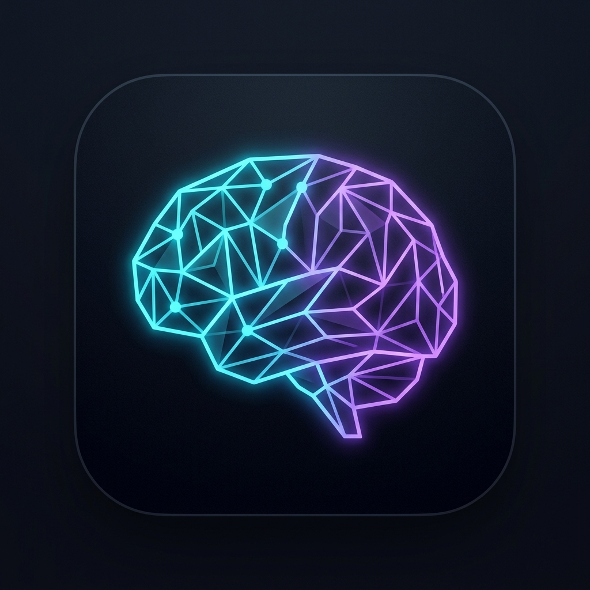

<p align="center">
  
</p>

#  CoreAI — AI Agents for Dynamic Games

*Read this in other languages: [English](README.md), [Русский](README_RU.md).*

**Living NPCs, procedural content, dynamic mechanics** — all driven by AI, right during gameplay.

**One repo, two packages:** a portable C# core and a Unity layer with DI, chat UI, and tests. Whether you want a *demo running in five minutes* or a *multi-agent pipeline with tools and Lua*, the same building blocks apply.

> **Why open this repo?** You get *agents that call your code*, *streaming that survives split tags*, *a chat panel in one click*, and optionally **`CoreAi.AskAsync("…")` from any script** — no DI homework required for your first feature.

> 🚀 **Proven on small models:** many PlayMode scenarios pass on a local **Qwen3.5-4B** (e.g. with reasoning “Think” off). You are not forced into expensive cloud APIs to ship something that feels smart.

**Version:** **v0.21.0** · `CoreAi` static API · orchestrator streaming · chat & streaming hardening

[](Assets/CoreAiUnity/Tests/EditMode)
[](https://unity.com/releases/editor)
[](LICENSE)

---

## Contents

| | Section |
|---|---------|
| [What’s new](#-whats-new-in-021) | 0.21 highlights |
| [Three ways to call the LLM](#-three-ways-in-ui--coreai--agents) | Chat UI · `CoreAi` · agents / orchestrator |
| [What CoreAI can do](#-what-coreai-can-do) | Agents, tools, Lua, memory |
| [Architecture](#%EF%B8%8F-architecture) | Two packages, diagram |
| [Quick Start](#-quick-start) | NuGet, UPM, scene |
| [Documentation](#-documentation) | Map of docs |
| [Tests](#-tests) | EditMode & PlayMode |

---

## 🆕 What's new in 0.21

- 🎯 **`CoreAi` static facade** — `AskAsync` / `StreamAsync` / `SmartAskAsync` / `Orchestrate*` / `TryGet*` / `Invalidate` — [COREAI_SINGLETON_API](Assets/CoreAiUnity/Docs/COREAI_SINGLETON_API.md).
- 🌊 **Orchestrator streaming** — `IAiOrchestrationService.RunStreamingAsync` for token-by-token output with the same authority/queue/validation path as `RunTaskAsync` (see [STREAMING_ARCHITECTURE](Assets/CoreAiUnity/Docs/STREAMING_ARCHITECTURE.md) §6).
- 💬 **Chat UX** — multiline input + Shift+Enter / Enter behaviour fixed; typing indicator as animated dots; streaming visible through the full `ILlmClient` decorator chain.

**Earlier 0.20.x (still in the box):** universal chat panel, HTTP + LLMUnity streaming, 3-layer streaming flags, one-click demo scene, broad EditMode coverage (Lua sandbox, tools, rate limit, filters).

Full notes: [Assets/CoreAiUnity/CHANGELOG.md](Assets/CoreAiUnity/CHANGELOG.md) · [CoreAI CHANGELOG](Assets/CoreAI/CHANGELOG.md).

---

## 🧭 Three ways in: UI · CoreAi · agents

| You are building… | Start here | One line |
|-------------------|------------|----------|
| **In-game chat for players** | `CoreAI → Setup → Create Chat Demo Scene` + `CoreAiChatPanel` | Play and type |
| **Any script, no DI yet** | `using CoreAI;` → `await CoreAi.AskAsync("…")` or `StreamAsync` | [COREAI_SINGLETON_API](Assets/CoreAiUnity/Docs/COREAI_SINGLETON_API.md) |
| **Full agent + tools + orchestrator** | `AgentBuilder` + `IAiOrchestrationService` | [AGENT_BUILDER](Assets/CoreAI/Docs/AGENT_BUILDER.md) |

All three paths share the same `CoreAILifetimeScope` and LLM backend when the scene is set up once.

---

## ✨ What CoreAI Can Do

### 🏗️ Create AI Agents in 3 Lines

```csharp
var merchant = new AgentBuilder("Blacksmith")
    .WithSystemPrompt("You are a blacksmith. Sell weapons and remember purchases.")
    .WithTool(new InventoryLlmTool(myInventory))  // Knows their stock
    .WithMemory()                                  // Remembers buyers
    .Build();

merchant.ApplyToPolicy(CoreAIAgent.Policy);

// Call the agent — one line, zero boilerplate:
merchant.Ask("Show me your swords");

// Or with a callback:
merchant.Ask("Show me your swords", (response) => Debug.Log(response));
```

**3 Agent Modes:** 🛒 ToolsAndChat · 🤖 ToolsOnly · 💬 ChatOnly

### 💬 Drop-in Chat UI

Add an NPC chat to any scene in minutes — no custom UI code required:

```
CoreAI → Setup → Create Chat Demo Scene
```

This generates `Assets/CoreAiUnity/Scenes/CoreAiChatDemo.unity` with a pre-wired `CoreAiChatPanel` (UI Toolkit + UXML/USS, dark theme by default), `CoreAiChatConfig_Demo.asset` and a fully configured `CoreAILifetimeScope` — press **Play** and chat.

```csharp
// Same stack as the panel — pick your style:
await foreach (var chunk in CoreAi.StreamAsync("Hello", "PlayerChat"))
    Debug.Log(chunk);

// Or explicit service (e.g. from DI in tests):
var service = CoreAiChatService.TryCreateFromScene();
await foreach (var chunk in service.SendMessageStreamingAsync("Hello", "PlayerChat"))
    if (!string.IsNullOrEmpty(chunk.Text)) Debug.Log(chunk.Text);
```

**Streaming pipeline:** HTTP SSE **or** LLMUnity callback → stateful `ThinkBlockStreamFilter` (strips `<think>` blocks split across chunks) → typing indicator → bubble. Cancellation aborts the underlying `UnityWebRequest` for free.

Docs: [README_CHAT.md](Assets/CoreAiUnity/Runtime/Source/Features/Chat/README_CHAT.md) · [STREAMING_ARCHITECTURE.md](Assets/CoreAiUnity/Docs/STREAMING_ARCHITECTURE.md)

---

### ⏳ Powerful Lua Coroutine Execution
Now CoreAI allows Lua scripts (like dynamically parsed world logic) to execute as asynchronous coroutines inside Unity:
```lua
-- Runs securely across multiple frames relying on Unity's Time
local start_time = time_now()
while time_now() - start_time < 2.0 do
    coroutine.yield()
end
```
Automatically maps APIs like `time_delta()`, `time_scale()`, and hooks securely via an internal `InstructionLimitDebugger` budget that yields processing back to Unity so you can run heavy computations without freezing the main thread.

---

### 🔧 AI Calls Tools (Function Calling)

AI doesn't just generate text — it **calls code** for real actions:

| Tool | What it does | Who uses it |
|------|--------------|-------------|
| 🌍 **WorldCommandTool** | Spawns, moves, modifies objects in the world | Creator AI |
| ⚡ **Action/Event Tool** | Calls any C# method or triggers an Event | All Agents |
| 🧠 **MemoryTool** | Saves/reads memory between sessions | All Agents |
| 📜 **LuaTool** | Executes Lua scripts | Programmer AI |
| 🎒 **InventoryTool** | Gets NPC inventory | Merchant AI |
| ⚙️ **GameConfigTool** | Reads/modifies game configs | Creator AI |
| 🎭 **SceneLlmTool** | Read and change hierarchy/transform in PlayMode | All Agents |
| 📸 **CameraLlmTool** | Captures screenshots (Base64 JPEG) for Vision | All Agents |

**Create your own:**
```csharp
public class WeatherLlmTool : ILlmTool
{
    public string Name => "get_weather";
    public string Description => "Get current weather.";
    public IEnumerable<AIFunction> CreateAIFunctions() 
    {
        yield return AIFunctionFactory.Create(
            async ct => await _provider.GetWeatherAsync(ct), "get_weather", "Get weather.");
    }
}
```

---

### 🎮 Dynamic Mechanics — AI Changes the Game Live

```
Player: "Craft a weapon from Iron and Fire Crystal"
  ↓
CoreMechanicAI: "Iron + Fire Crystal → Flame Sword, damage 45"
  ↓
Programmer AI: execute_lua → create_item("Flame Sword", "weapon", 75)
               add_special_effect("fire_damage: 15")
  ↓
✨ Player receives a unique item!
```

---

### 🧠 Memory — AI Remembers Everything

| | Memory | ChatHistory |
|--|--------|-------------|
| **Storage** | JSON file on disk | In LLMAgent (RAM) |
| **Duration** | Between sessions | Current conversation |
| **For what** | Facts, purchases, quests | Conversation context |

---

### 🔄 Tool Call Retry — AI Learns from Mistakes

Small models (Qwen3.5-2B) sometimes forget the format. CoreAI automatically gives **3 retries** + checks fenced Lua blocks immediately.

---

### 📏 Recommended Models

| Model | Size | Tool Calling | When to use |
|-------|------|--------------|-------------|
| **Qwen3.5-4B** | 4B | ✅ Great | **Recommended** for local GGUF |
| **Qwen3.5-35B (MoE) API** | 35B/3A | ✅ Excellent | **Ideal** via API — fast & accurate |
| **Gemma 4 26B (via LM Studio)** | 26B | ✅ Excellent | Great via HTTP API |
| **LM Studio / OpenAI API** | Any | ✅ Excellent | External models via HTTP — best choice |
| Qwen3.5-2B | 2B | ⚠️ Works | Works, but sometimes makes mistakes |
| Qwen3.5-0.8B | 0.8B | ⚠️ Basic | Most tests pass, struggles with multi-step |

> 💡 **Recommendation: Qwen3.5-4B locally or Qwen3.5-35B (MoE) via API**  
> MoE models (Mixture of Experts) activate only 3B parameters per inference — fast as 4B, accurate as 35B.

### 🧪 PlayMode Test Results by Model Size

All CoreAI PlayMode tests have been verified on real LLM backends. Results:

| Test Category | 0.8B | 2B | 4B+ |
|--------------|------|-----|------|
| Memory Tool (write/append/clear) | ✅ Pass | ✅ Pass | ✅ Pass |
| Custom Agents (tool calling) | ✅ Pass | ✅ Pass | ✅ Pass |
| World Commands (list/play/spawn) | ✅ Pass | ✅ Pass | ✅ Pass |
| Execute Lua (single tool) | ✅ Pass | ✅ Pass | ✅ Pass |
| Multi-Agent Workflow (Creator→Mechanic→Programmer) | ⚠️ Partial | ✅ Pass | ✅ Pass |
| Crafting Memory (multi-step: memory + lua) | ⚠️ Partial | ⚠️ Mostly | ✅ Pass |
| Chat History (persistent context) | ❌ Too small | ⚠️ Mostly | ✅ Pass |
| Player Chat (NPC dialogue) | ✅ Pass | ✅ Pass | ✅ Pass |

> 🏆 **Qwen3.5-4B passes ALL tests.** This is the recommended minimum for production use.  
> 📊 **Qwen3.5-0.8B passes most tests** — impressive for its size! Struggles only with complex multi-step tool calling chains.  
> 📈 **2B is a solid middle ground** — occasional mistakes in multi-step scenarios, but mostly reliable.

---

## 🏛️ Architecture

The repository consists of **two packages**:

| Package | What's inside | Dependencies |
|---------|--------------|--------------|
| **[com.nexoider.coreai](Assets/CoreAI)** | Portable core — pure C# **without** Unity | VContainer, MoonSharp |
| **[com.nexoider.coreaiunity](Assets/CoreAiUnity)** | Unity layer — DI, LLM, MEAI, MessagePipe, tests | Depends on `coreai` |

```
┌─────────────────────────────────────────────────────────────┐
│                      Player / Game                           │
└──────────────────────┬──────────────────────────────────────┘
                       ↓
┌─────────────────────────────────────────────────────────────┐
│                   AiOrchestrator                              │
│  • Priority queue  • Retry logic  • Tool calling              │
└──────────────────────┬──────────────────────────────────────┘
                       ↓
┌─────────────────────────────────────────────────────────────┐
│                     LLM Client                               │
│  • LLMUnity (local GGUF)  • OpenAI HTTP  • Stub             │
└──────────────────────┬──────────────────────────────────────┘
                       ↓
┌─────────────────────────────────────────────────────────────┐
│                   AI Agents                                  │
│  🛒 Merchant  📜 Programmer  🎨 Creator  📊 Analyzer        │
│  🗡️ CoreMechanic  💬 PlayerChat  + Your custom ones!        │
└──────────────────────┬──────────────────────────────────────┘
                       ↓
┌─────────────────────────────────────────────────────────────┐
│                   Tools (ILlmTool)                           │
│  🧠 Memory  📜 Lua  🎒 Inventory  ⚙️ GameConfig  + Yours!   │
└──────────────────────┬──────────────────────────────────────┘
                       ↓
┌─────────────────────────────────────────────────────────────┐
│                   Game World                                 │
│  • Lua Sandbox (MoonSharp)  • MessagePipe  • DI (VContainer)│
└─────────────────────────────────────────────────────────────┘
```

---

## 🚀 Quick Start

### 1. Install NuGet DLLs (required)

CoreAI uses [Microsoft.Extensions.AI](https://www.nuget.org/packages/Microsoft.Extensions.AI) for the LLM pipeline. Copy these DLLs into your project's `Assets/Packages/` folder (download from NuGet or copy from this repo's `Assets/Packages/`):

| NuGet Package | Version | Required by |
|---------------|---------|-------------|
| `Microsoft.Extensions.AI` | 10.4.1 | CoreAI Core |
| `Microsoft.Extensions.AI.Abstractions` | 10.4.1 | CoreAI Core |
| `Microsoft.Bcl.AsyncInterfaces` | 10.0.4 | System dependency |
| `System.Text.Json` | 10.0.4 | JSON serialization |
| `System.Text.Encodings.Web` | 10.0.4 | System dependency |
| `System.Numerics.Tensors` | 10.0.4 | System dependency |
| `Microsoft.Extensions.Logging.Abstractions` | 10.0.4 | Logging |
| `Microsoft.Extensions.DependencyInjection.Abstractions` | 10.0.4 | DI |
| `System.Diagnostics.DiagnosticSource` | 10.0.4 | System dependency |

> 💡 **Easiest way:** Clone this repo and copy the entire `Assets/Packages/` folder into your project.

### 2. Add dependencies to manifest.json (required)
Unity Package Manager does not support automatic downloading of Git dependencies from other packages. Open your project's `Packages/manifest.json` file and add these lines to the `"dependencies"` block:

```json
    "jp.hadashikick.vcontainer": "https://github.com/hadashiA/VContainer.git?path=VContainer/Assets/VContainer#1.17.0",
    "org.moonsharp.moonsharp": "https://github.com/moonsharp-devs/moonsharp.git?path=/interpreter#upm/beta/v3.0",
    "com.cysharp.messagepipe": "https://github.com/Cysharp/MessagePipe.git?path=src/MessagePipe.Unity/Assets/Plugins/MessagePipe",
    "com.cysharp.messagepipe.vcontainer": "https://github.com/Cysharp/MessagePipe.git?path=src/MessagePipe.Unity/Assets/Plugins/MessagePipe.VContainer",
    "com.cysharp.unitask": "https://github.com/Cysharp/UniTask.git?path=src/UniTask/Assets/Plugins/UniTask",
    "ai.undream.llm": "https://github.com/undreamai/LLMUnity.git",
```

*(After saving the file, Unity will automatically download VContainer, MoonSharp, UniTask, MessagePipe, and LLMUnity).*

### 3. Install CoreAI packages via Git URL
**Unity Editor →** Window → Package Manager → `+` → **Add package from git URL…**

**Step 1 — Core engine (pure C#, no UnityEngine):**
```text
https://github.com/NeoXider/CoreAI.git?path=Assets/CoreAI
```

**Step 2 — Unity layer (MonoBehaviour, LLM clients, tools):**
```text
https://github.com/NeoXider/CoreAI.git?path=Assets/CoreAiUnity
```

### 3. Setup Scene (one click)

After installation, use the menu:

```
CoreAI → Create Scene Setup
```

This will automatically:
- ✅ Create `CoreAILifetimeScope` on the scene
- ✅ Generate all required settings assets (`CoreAISettings`, `GameLogSettings`, `AgentPromptsManifest`, etc.)
- ✅ Assign assets to the scope
- ✅ Create `LLM` + `LLMAgent` objects (if backend is set to LLMUnity)

### 4. Configure LLM Backend

Open settings: **CoreAI → Settings** and choose your backend:

| Backend | Setup |
|---------|-------|
| **LLMUnity** (local) | Download a GGUF model (e.g. Qwen3.5-4B) via LLMUnity Model Manager |
| **HTTP API** (LM Studio, OpenAI) | Set `API Base URL` and `API Key` in Settings |
| **Auto** | CoreAI picks the best available backend automatically |

### 5. Create Your Agent

```csharp
var storyteller = new AgentBuilder("Storyteller")
    .WithSystemPrompt("You are a campfire storyteller. Share tales about the world.")
    .WithMemory()
    .WithChatHistory()
    .WithMode(AgentMode.ChatOnly)
    .Build();
```

> 📖 **Full setup guide with LLM configuration:** [QUICK_START.md](Assets/CoreAiUnity/Docs/QUICK_START.md)  
> 🏗️ **Agent Builder reference + ready recipes:** [AGENT_BUILDER.md](Assets/CoreAI/Docs/AGENT_BUILDER.md)

---

## 📚 Documentation

Start from the index and pick the level that matches your goal:

> 🧭 **[DOCS_INDEX.md](Assets/CoreAiUnity/Docs/DOCS_INDEX.md)** — full documentation map (Beginner → Intermediate → Architecture).

### Getting started

| Document | What's inside |
|----------|--------------|
| 🚀 [QUICK_START.md](Assets/CoreAiUnity/Docs/QUICK_START.md) | Install → open scene → connect LLM → Play |
| 🚀 [QUICK_START_FULL.md](Assets/CoreAiUnity/Docs/QUICK_START_FULL.md) | Full 10-min walkthrough: LM Studio → Unity → first command |
| 🎯 [COREAI_SINGLETON_API.md](Assets/CoreAiUnity/Docs/COREAI_SINGLETON_API.md) | **`CoreAi`** one-liners — beginners + pros |
| 🏗️ [AGENT_BUILDER.md](Assets/CoreAI/Docs/AGENT_BUILDER.md) | Build an NPC in 3 lines · modes · ready-made recipes |
| ⚙️ [COREAI_SETTINGS.md](Assets/CoreAiUnity/Docs/COREAI_SETTINGS.md) | Backends, models, timeout, streaming toggle |

### Chat & streaming

| Document | What's inside |
|----------|--------------|
| 💬 [README_CHAT.md](Assets/CoreAiUnity/Runtime/Source/Features/Chat/README_CHAT.md) | Drop-in `CoreAiChatPanel` + demo scene |
| 🌊 [STREAMING_ARCHITECTURE.md](Assets/CoreAiUnity/Docs/STREAMING_ARCHITECTURE.md) | SSE / LLMUnity → filters → UI · orchestrator streaming |

### Tools, memory, roles

| Document | What's inside |
|----------|--------------|
| 🔧 [TOOL_CALL_SPEC.md](Assets/CoreAiUnity/Docs/TOOL_CALL_SPEC.md) | Tool-calling specification |
| 🛒 [CHAT_TOOL_CALLING.md](Assets/CoreAiUnity/Docs/CHAT_TOOL_CALLING.md) | Merchant NPC with inventory |
| 🧠 [MemorySystem.md](Assets/CoreAiUnity/Docs/MemorySystem.md) | Agent memory (disk + chat history) |
| 🤖 [AI_AGENT_ROLES.md](Assets/CoreAiUnity/Docs/AI_AGENT_ROLES.md) | Agent roles & prompts |

### Architecture

| Document | What's inside |
|----------|--------------|
| 🗺️ [DEVELOPER_GUIDE.md](Assets/CoreAiUnity/Docs/DEVELOPER_GUIDE.md) | Code map, LLM→commands flow, PR checklist |
| 📐 [DGF_SPEC.md](Assets/CoreAiUnity/Docs/DGF_SPEC.md) | Normative spec: DI, threads, authority |
| 🛠️ [MEAI_TOOL_CALLING.md](Assets/CoreAI/Docs/MEAI_TOOL_CALLING.md) | MEAI pipeline: `ILlmTool` → `AIFunction` → `FunctionInvokingChatClient` |
| 📋 [CHANGELOG.md](Assets/CoreAI/CHANGELOG.md) · [CHANGELOG (Unity)](Assets/CoreAiUnity/CHANGELOG.md) | Version history |

---

## 🧪 Tests

```
Unity → Window → General → Test Runner
  ├── EditMode — large fast suite (no real LLM): prompts, streaming, Lua sandbox, tools, rate limit, CoreAi facade, orchestrator streaming, …
  └── PlayMode — integration tests with a configured HTTP or local GGUF backend
```

Run EditMode first in CI; PlayMode is optional and needs a backend (env vars for HTTP — see [LLMUNITY_SETUP_AND_MODELS](Assets/CoreAiUnity/Docs/LLMUNITY_SETUP_AND_MODELS.md)).

---

## 🌐 Multiplayer and Singleplayer

- **Singleplayer:** Same pipeline, AI works locally
- **Multiplayer:** AI logic on host, clients receive agreed outcomes

**One template — for both solo campaign and coop.**

---

## 🤝 Author and Community

**Author:** [Neoxider](https://github.com/NeoXider)  
**Ecosystem:** [NeoxiderTools](https://github.com/NeoXider/NeoxiderTools)  
**License:** [PolyForm Noncommercial 1.0.0](LICENSE) (commercial use — separate license)

**Contact:** neoxider@gmail.com | [GitHub Issues](https://github.com/NeoXider/CoreAI/issues)

---

> 🎮 **CoreAI** — ship *playable* AI: one scene, one static call, or one agent — your call.
