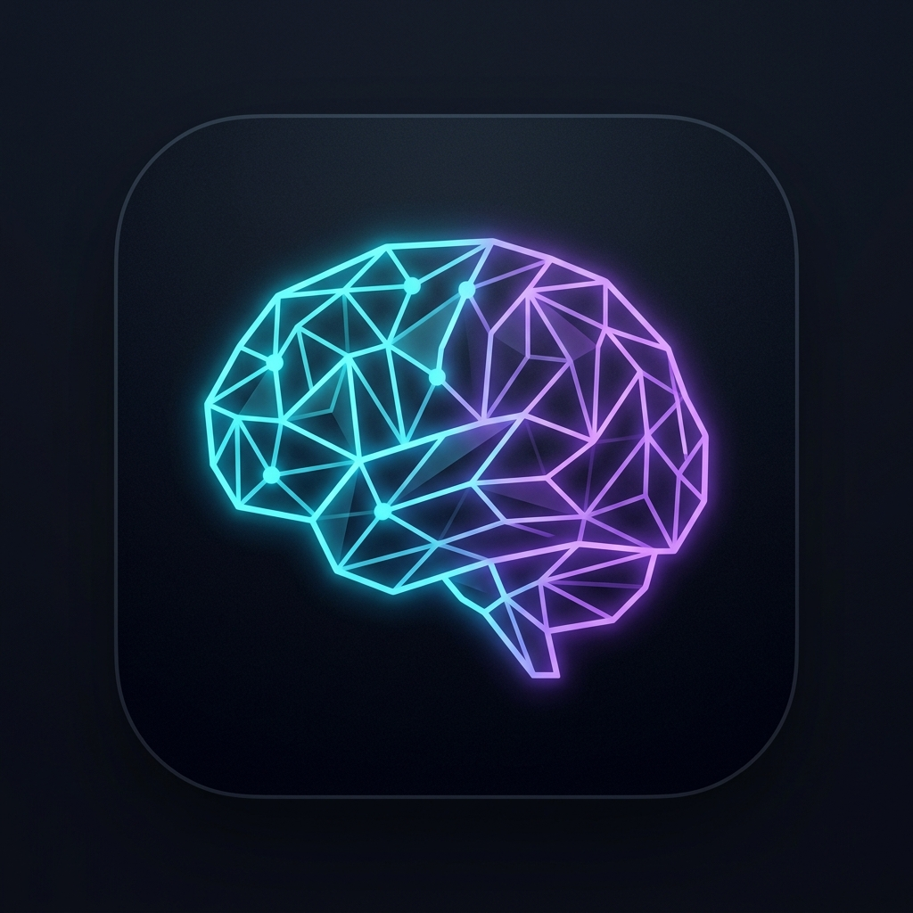
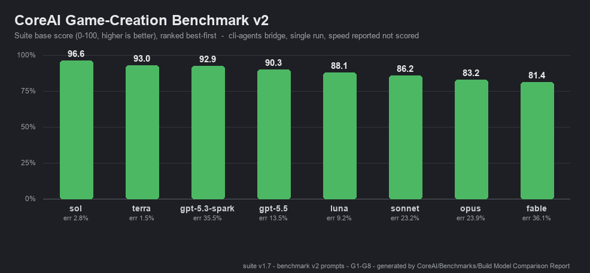

<p align="center">
  
</p>

#  CoreAI — LLM agents that play your game

**CoreAI is a Unity framework for LLM-powered NPCs and agents that call your game code** — function calling, tools, persistent memory, and runtime Lua — running on a **local 4 GB model** or any **OpenAI-compatible API**. No cloud keys required, no scripted dialogue trees.

[](https://github.com/NeoXider/CoreAI/actions/workflows/ci.yml)
[](https://github.com/NeoXider/CoreAI/actions/workflows/ci.yml)
[](https://unity.com/releases/editor)
[](#-recommended-models)
[](LICENSE)

<sub>
<a href="#-quick-start">Quick Start</a>&nbsp;&nbsp;•&nbsp;
<a href="#-what-coreai-can-do">Features</a>&nbsp;&nbsp;•&nbsp;
<a href="#-three-ways-in-ui--coreai--agents">Three ways in</a>&nbsp;&nbsp;•&nbsp;
<a href="#-recommended-models">Models</a>&nbsp;&nbsp;•&nbsp;
<a href="#%EF%B8%8F-architecture">Architecture</a>&nbsp;&nbsp;•&nbsp;
<a href="#-documentation">Docs</a>&nbsp;&nbsp;•&nbsp;
<a href="Docs/ROADMAP.md">Roadmap</a>&nbsp;&nbsp;•&nbsp;
<a href="#-tests">Tests</a>
</sub>

> ### 🎬 Imagine this
> A player walks up to a blacksmith NPC and types _"Got any fire swords?"_. The NPC **calls your inventory code**, finds nothing, then **replies in-character**: _"Fresh out of fire blades, but I can forge one if you bring me a Fire Crystal."_ The player crafts it — the **Programmer agent writes Lua**, the **CoreMechanic agent rolls stats**, and a unique _Flame Sword_ lands in their inventory. All at runtime, streaming token-by-token into a chat bubble, on a local model. **That's CoreAI.**

### Why CoreAI?

LLM-in-a-game demos are everywhere; **shipping** one is the hard part. CoreAI is the missing production layer between a chat box and your gameplay: the model doesn't just talk — it **calls your C# and Lua**, and the framework handles the messy reality of small local models (wrong tool casing, split streaming tags, runaway loops, rate limits, context overflow) so your game doesn't break.

- 🆓 **Works out of the box, scales to production** — one-liner `await CoreAi.AskAsync("…")` for your first feature; full `AgentBuilder` + orchestrator + per-role routing when you need it.
- 🧩 **No forced heavy dependencies** — LLM and Lua are **optional modules** (`COREAI_NO_LLM` / `COREAI_NO_LUA`, auto-detected from installed packages). Install only what your game uses.
- 🛡️ **Built for small local models** — auto-repairs tool-name casing, retries with feedback, survives streaming `<think>` splits, caps runaway generation. Recorded live checks on **Qwen3.5-4B** cover real memory and world-command tool calls; deterministic suites use stubs.

### Is it for you?

| You are… | Start with | Time to first result |
|----------|-----------|----------------------|
| 🟢 **New / prototyping** | `CoreAI → Setup → Create Chat Demo Scene` → Play, or `await CoreAi.AskAsync("…")` | ~5 min |
| 🔵 **Building a real game** | `AgentBuilder` + tools + `IAiOrchestrationService`, per-role LLM routing | grows with you |

> 🚀 **30-second start:** install (below) → open **`CoreAI → Getting Started`** (opens automatically on first import) → one-click **Create Chat Demo Scene** or launch any bundled demo → press **Play** → type. Jump to [Quick Start](#-quick-start).

### ⚡ At a glance

- 🧠 **Agents that call your code** — real function calling with tool retry, auto-repair, and memory
- 🏠 **Local-first** — representative live PlayMode tool calls pass on a 4B local model; no data leaves the player's machine
- 💬 **Drop-in chat UI** — one menu click creates a working streaming chat scene
- 🎯 **Self-Service Skills** — the model sees 2 meta-tools instead of hundreds (~91% token savings)
- 🌊 **Streaming that survives reality** — split `<think>` tags, fragmented tool calls, SSE chunking
- 🗜️ **Long chats that don't explode** — token budget, rolling summaries, optional smart compaction
- 🛡️ **Production guardrails** — per-tool timeout, runaway cap, loop guard, Lua generation rate limit, rate-limit metrics + F10 token-budget overlay
- 🔄 **Dual-backend fallback** — local model first, cloud API as automatic backup (or the reverse)
- 🔀 **Runtime multi-endpoint routing** — keep multiple local/cloud providers active and switch agents in Hub Settings without losing conversation state
- 🧩 **Optional modules** — no Mods package? No LLMUnity? Still compiles; features light up when packages appear
- 🌍 **Unity world control** — spawn primitives (`cube`, `sphere`, `cylinder`, `capsule`, `plane`, `empty`), move/rotate/scale objects, and add configured components through the reflection-free `component_command` tool

⭐ **If CoreAI saves you time — [star the repo](https://github.com/NeoXider/CoreAI)!** It's the main way other Unity devs find it.

> 🗺️ **Where this is going:** a Roblox-like Lua API written by the in-game AI, live multiplayer co-creation (the game *is* the editor), shareable world packages, and drop-in embedding into existing Unity games — the full plan with tracks and milestones lives in the **[Framework Roadmap](Docs/ROADMAP.md)**.

### Why not just call the API yourself?

Raw API calls get you text; CoreAI gives you the production layer around that text. Tool-calling, persistent memory, streaming, Lua sandboxing, retries, and multi-backend routing are already wired into Unity and covered by tests. You still own your game logic, but you do not have to rebuild the fragile glue around local models, OpenAI-compatible APIs, tool repair, and long-running conversations. CoreAI is the shortest path from "chat box" to agents that can safely act inside the game.

**Releases:** `version` in [core `package.json`](Assets/CoreAI/package.json) and [Unity `package.json`](Assets/CoreAiUnity/package.json) (same semver). **Notes:** [Unity changelog](Assets/CoreAiUnity/CHANGELOG.md) · [Core changelog](Assets/CoreAI/CHANGELOG.md).

---

## Contents

| | Section |
|---|---------|
| [Game-Creation Benchmark](#game-creation-benchmark) | Local LLM game-building benchmark and model ranking |
| [Three ways to call the LLM](#-three-ways-in-ui--coreai--agents) | Chat UI · `CoreAi` · agents / orchestrator |
| [What CoreAI can do](#-what-coreai-can-do) | Agents, tools, Lua, memory · long-chat budget & optional smart compaction (`v1.5+`) |
| [Integration examples & ideas](#-integration-examples--ideas) | Practical game-design patterns using CoreAI tools & memory |
| [Architecture](#%EF%B8%8F-architecture) | Five packages, install profiles, diagram |
| [Quick Start](#-quick-start) | NuGet, UPM, scene |
| [Documentation](#-documentation) | Map of docs |
| [Framework Roadmap](Docs/ROADMAP.md) | Vision, tracks (Roblox-like Lua API, multiplayer co-creation, worlds), release plan |
| [Tests](#-tests) | EditMode & PlayMode |
| [Multiplayer & Singleplayer](#-multiplayer-and-singleplayer) | Host-authoritative multiplayer, local singleplayer |
| [Changelog](#changelog) | Unity + core release notes (single source of truth) |
| [Author & Community](#-author-and-community) | Author, ecosystem, license, contact, support |

---

## Game-Creation Benchmark

CoreAI ships a game-creation benchmark: it scores how well an LLM builds and changes a game by driving real `execute_lua` and `world_command` tools — 0-100 across eight scenario groups (**suite v1.7**, benchmark v2 prompts, G1-G8), against any OpenAI-compatible endpoint.

**Top-tier models — v2 frontier sweep (2026-07-11):**



| # | Model | Suite | Pass-rate |
|---:|---|---:|---:|
| 1 | `gpt-5.6-sol` | **96.6** | 85.7% |
| 2 | `gpt-5.6-terra` | **93.0** | 86.2% |
| 3 | `gpt-5.3-spark` | **92.9** | 79.3% |
| 4 | `gpt-5.5` | **90.3** | 82.8% |
| 5 | `gpt-5.6-luna` | **88.1** | 79.3% |
| 6 | `claude-sonnet-5` | **86.2** | 75.9% |
| 7 | `claude-opus-4.8` | **83.2** | 79.3% |
| 8 | `claude-fable-5` | **81.4** | 75.9% |

One run each via the `cli-agents` bridge (indicative).

**Free models via the opencode native API** — the bridge can also drive [opencode](https://opencode.ai)'s
own headless server (`opencode serve`) with real token streaming, exposing free/local models through one
OpenAI-compatible endpoint:

| Model (opencode) | Suite | Pass-rate | Notes |
|---|---:|---:|---|
| `hy3-free` | **86.9** | 72.4% | full G1–G8, native streaming |
| `deepseek-v4-flash-free` | 87.2\* | 75.0% | \*partial (G1–G2); the full run hit the free tier's rate limit mid-suite |

> Free opencode-gateway models are rate-limited and meant for use inside opencode, so treat these as
> indicative "can a free model build a game?" checks, not ranked submissions.

> ⚠️ **Claude scores are understated.** The Claude models (`sonnet-5`, `opus-4.8`, `fable-5`) ran through
> a non-native, unstable API that gave them a high tool-failure rate (opus ~24%, sonnet ~23%, fable ~36%
> vs 1–13% for the Codex models) — well-formed tool calls that still failed to land. Those failures cost
> points on tool correctness and task completion, so the Claude rows sit a few points below their true
> capability. Read them as a **lower bound**, not a ceiling — a native API run would score higher.

Full tables (v2 + historical + local), methodology, group legend and the per-model castle prefabs: **[benchmark guide](Assets/CoreAIBenchmark/README.md)** · **[leaderboard](Docs/BENCHMARK_LEADERBOARD.md)**.

---

## 🧭 Three ways in: UI · CoreAi · agents

| You are building… | Start here | One line |
|-------------------|------------|----------|
| **In-game chat for players** | `CoreAI → Setup → Create Chat Demo Scene` + `CoreAiChatPanel` | Play and type |
| **Any script, no DI yet** | `using CoreAI;` → `await CoreAi.AskAsync("…")` or `StreamAsync` | [COREAI_SINGLETON_API](Assets/CoreAiUnity/Docs/COREAI_SINGLETON_API.md) |
| **Full agent + tools + orchestrator** | `AgentBuilder` + `IAiOrchestrationService` | [AGENT_BUILDER](Assets/CoreAI/Docs/AGENT_BUILDER.md) |

All three paths share the same `CoreAILifetimeScope` and LLM backend when the scene is set up once.

---

## ✨ What CoreAI Can Do

### 🏗️ Create AI Agents in 3 Lines

```csharp
var merchant = new AgentBuilder("Blacksmith")
    .WithSystemPrompt("You are a blacksmith. Sell weapons and remember purchases.")
    .WithTool(new InventoryLlmTool(myInventory))  // Knows their stock
    .WithMemory()                                  // Remembers buyers
    .WithMaxOutputTokens(512)                      // Per-agent reply budget
    .Build();                                      // → AgentConfig (in-memory blueprint)

// Attach that blueprint to the global policy created at startup (CoreAILifetimeScope).
// The orchestrator looks up tools/system prompt by RoleId ("Blacksmith") from this policy.
merchant.ApplyToPolicy(CoreAIAgent.Policy);

// Ask* uses CoreAIAgent.Orchestrator (same startup wiring). Needs Play + CoreAILifetimeScope on scene.
merchant.AskWithCallback("Show me your swords");
merchant.AskWithCallback("Show me your swords", (response) => Debug.Log(response));
```

- **`Build()`** — returns `AgentConfig` (role id, tools, prompts, mode). Still unknown to the runtime until registered.
- **`ApplyToPolicy(CoreAIAgent.Policy)`** — writes into the live `AgentMemoryPolicy` so **`RunTask` / tool routing** can find this role's tools and merged prompts. Without it, `"Blacksmith"` is just a string the model never gets the right stack for.
- **`AskWithCallback` / `AskAsync`** — thin wrappers over **`CoreAIAgent.Orchestrator`** → `AiTaskRequest` with `RoleId` from the config. Same idea as resolving `IAiOrchestrationService` from DI — see [COREAI_SINGLETON_API](Assets/CoreAiUnity/Docs/COREAI_SINGLETON_API.md).

**3 Agent Modes:** 🛒 ToolsAndChat · 🤖 ToolsOnly · 💬 ChatOnly

### 🎯 Self-Service Skills — Agents Load Tools On Demand

When your agent has dozens of tools across different domains (crafting, combat, trading, quests), sending all of them every request wastes tokens. **Skills** solve this:

```csharp
// Define skills — each is a group of tools + instructions
var crafting = new SkillSet("Crafting",
    "Forge weapons and armor from raw materials",
    "1. Call get_recipes to list recipes.\n2. Call craft_item to craft.",
    new DelegateLlmTool("get_recipes", "List recipes", (string type) => ...),
    new DelegateLlmTool("craft_item", "Craft item", (string id) => ...));

var combat = new SkillSet("Combat", "Fight enemies", "Call attack with target.",
    new DelegateLlmTool("attack", "Attack target", (string target) => ...));

// Register skills — model sees only 2 meta-tools, not all skill tools
var gm = new AgentBuilder("GameMaster")
    .WithSystemPrompt("You are a Game Master in a fantasy RPG.")
    .WithSkill(crafting)
    .WithSkill(combat)
    .Build();
gm.ApplyToPolicy(policy);
```

**How it works:**
1. Model sees a lightweight **catalog** (skill names + descriptions) in the system prompt
2. Model calls `read_skill("Crafting")` → gets full instructions + tool schemas
3. Model calls `call_skill_tool("get_recipes", "{}")` → proxy routes to real tool
4. **Token overhead: constant** (2 meta-tools) regardless of total skill/tool count

> 💡 **50 tools across 10 skills?** Without skills: ~4,000 tokens. With skills: ~360 tokens. **91% savings.**

Mix direct tools and skills freely: `WithTool(memory)` + `WithSkill(crafting)` — memory is always visible, crafting loads on demand.

**Three ways to attach a skill (v5.0)** — pick whichever fits your workflow:

| Path | How | Best for |
|------|-----|----------|
| 🖱️ Inspector | `CoreAILifetimeScope → Skills → Role Skills` + a `SkillSetAsset` (SO wrapping a TextAsset or inline text) | designers, no code |
| 🧩 Code | `CoreAi.AddSkillForRole("Programmer", skillSet)` at runtime, or `AgentBuilder.WithSkill(...)` | custom roles, dynamic skills |
| 📄 Resources override | drop `Resources/AgentSkills/<Name>.txt` to replace a built-in skill's text | tweaking shipped skills |

Built-in roles come with skills too: the **Programmer** role ships a `Lua Modding` skill — a full Lua platform reference the model loads on demand with `read_skill('Lua Modding')` before writing non-trivial mods.

Docs: [AGENT_BUILDER.md §Skills](Assets/CoreAI/Docs/AGENT_BUILDER.md) · [COREAI_SINGLETON_API](Assets/CoreAiUnity/Docs/COREAI_SINGLETON_API.md)

### 💬 Drop-in Chat UI

Add an NPC chat to any scene in minutes — no custom UI code required:

```
CoreAI → Setup → Create Chat Demo Scene
```

This generates `Assets/CoreAiUnity/Scenes/CoreAiChatDemo.unity` with a pre-wired `CoreAiChatPanel` (UI Toolkit + UXML/USS, dark theme by default; **default floating size ~650×910**, **flush-right scrollbar**, optional **long-turn hint** under the typing row), `CoreAiChatConfig_Demo.asset` and a fully configured `CoreAILifetimeScope` — press **Play** and chat.

```csharp
// Same stack as the panel — pick your style:
await foreach (var chunk in CoreAi.StreamAsync("Hello", "SmartChat"))
    Debug.Log(chunk);

// Or explicit service (e.g. from DI in tests):
var service = CoreAiChatService.TryCreateFromScene();
await foreach (var chunk in service.SendMessageStreamingAsync("Hello", "SmartChat"))
    if (!string.IsNullOrEmpty(chunk.Text)) Debug.Log(chunk.Text);
```

**Streaming pipeline:** HTTP SSE **or** LLMUnity callback → stateful `ThinkBlockStreamFilter` (strips `<think>` blocks split across chunks) → typing indicator → bubble. Cancellation cancels the in-flight HTTP **`HttpClient`** request / enumerator on the MEAI path.

Docs: [README_CHAT.md](Assets/CoreAiUnity/Runtime/Source/Features/Chat/README_CHAT.md) · [STREAMING_ARCHITECTURE.md](Assets/CoreAiUnity/Docs/STREAMING_ARCHITECTURE.md)

---

### ⏳ Powerful Lua Coroutine Execution
Now CoreAI allows Lua scripts (like dynamically parsed world logic) to execute as asynchronous coroutines inside Unity:
```lua
-- Runs securely across multiple frames relying on Unity's Time
local start_time = time_now()
while time_now() - start_time < 2.0 do
    coroutine.yield()
end
```
Automatically maps APIs like `time_delta()`, `time_scale()`, and hooks securely via an internal `InstructionLimitDebugger` budget that yields processing back to Unity so you can run heavy computations without freezing the main thread.

---

### 🔧 AI Calls Tools (Function Calling)

AI doesn't just generate text — it **calls code** for real actions:

| Tool | What it does | Who uses it |
|------|--------------|-------------|
| 🌍 **WorldCommandTool** | Spawns primitives/prefabs and moves, rotates, scales, parents, or toggles objects in the world | Creator AI |
| 🧱 **component_command** | Adds/configures curated Unity components such as `Rigidbody`, colliders, and `Light` without reflection | Creator AI |
| ⚡ **Action/Event Tool** | Calls any C# method or triggers an Event | All Agents |
| 🧠 **MemoryTool** | Saves/reads memory between sessions | All Agents |
| 📜 **LuaTool** | Executes Lua scripts | Programmer AI |
| 🎒 **InventoryTool** | Gets NPC inventory | Merchant AI |
| ⚙️ **GameConfigTool** | Reads/modifies game configs | Creator AI |
| 🎭 **SceneLlmTool** | Read and change hierarchy/transform in PlayMode | All Agents |
| 📸 **CameraLlmTool** | Captures screenshots (Base64 JPEG) for Vision | All Agents |

**Create your own:**
```csharp
public class WeatherLlmTool : ILlmTool
{
    public string Name => "get_weather";
    public string Description => "Get current weather.";
    public IEnumerable<AIFunction> CreateAIFunctions()
    {
        yield return AIFunctionFactory.Create(
            async ct => await _provider.GetWeatherAsync(ct), "get_weather", "Get weather.");
    }
}
```

> 💡 **Design tools for token economy:** use short parameter keys (`q` instead of `question_text`), concise descriptions, indexes instead of strings, and smart defaults. Details: [TOOL_CALL_SPEC.md](Assets/CoreAiUnity/Docs/TOOL_CALL_SPEC.md)

---

### 🎮 Dynamic Mechanics — AI Changes the Game Live

```
Player: "Craft a weapon from Iron and Fire Crystal"
  ↓
CoreMechanicAI: "Iron + Fire Crystal → Flame Sword, damage 45"
  ↓
Programmer AI: execute_lua → create_item("Flame Sword", "weapon", 75)
               add_special_effect("fire_damage: 15")
  ↓
✨ Player receives a unique item!
```

---

### 🧪 Build a whole game from mods alone

CoreAI mods aren't limited to tuning numbers — a host can expose its own Lua API so the **AI authors brand-new content at runtime**. The included **Unit Forge** demo ships an **empty arena**: every unit type, every wave, and every behaviour is added by Lua mods written through chat.

```lua
-- The AI writes this when you ask for "a knight line vs a goblin swarm"
forge_define("knight", "ally",  60, 8, 1.4, 1.1, "#3aa0ff")
forge_define("goblin", "enemy", 25, 4, 2.0, 1.0, "#3cc452")
for i = 1, 3 do forge_spawn("knight", -5, (i - 2) * 1.5) end
for i = 1, 4 do forge_spawn("goblin",  5, (i - 2) * 1.2) end

hooks_every(3.0, function()         -- endless reinforcements, also written by the AI
  if forge_count("enemy") < 6 then forge_spawn("goblin", 6, math.random(-3, 3)) end
end)
```

Capability tiers keep it safe: `forge_*` lives behind the **WorldEdit** tier, while a separate **Full** tier (opt-in, public members only by default) can reach arbitrary components via reflection. Toggle the optional Lua/LLM packages from **`CoreAI → Setup → Modules`**.

| Demo scene | What it shows |
|------------|---------------|
| 🛠️ **Unit Forge** (`Assets/CoreAI.Demos/ModdableUnits`) | New units & whole game loops created by mods alone |
| 🌊 **Wave Auto-Battler** (`Assets/CoreAI.Demos/LiveMechanicsMods`) | Number-tuning mods over a live battle |
| 🔓 **Full Access** (`Assets/CoreAI.Demos/FullAccess`) | Reflection-tier Lua reaching scene objects via `unity_*` |

Docs: [LUA_GAME_API](Assets/CoreAI/Docs/LUA_GAME_API.md) · [OPTIONAL_MODULES](Assets/CoreAiUnity/Docs/OPTIONAL_MODULES.md)

---

### 🧠 Memory — AI Remembers Everything

| | Memory | ChatHistory |
|--|--------|-------------|
| **Storage** | JSON file on disk | In LLMAgent (RAM) |
| **Duration** | Between sessions | Current conversation |
| **For what** | Facts, purchases, quests | Conversation context |

---

### 🗜️ Long conversations — budget, summaries & optional “smart compaction”

When **`WithChatHistory()`** fills the model window, CoreAI keeps a fresh **tail** of messages and folds older turns into **`## Conversation Summary`** in the system prompt (deterministic rollup by default). Newer releases add:

| Feature | What you get |
|--------|----------------|
| **Context budget** | `IContextBudgetPolicy` / `HistoryTokenBudget` — system + user + tools shrink what fits in history fairly. |
| **Persisted summaries** | **`InMemoryConversationSummaryStore`** (process) or **`FileConversationSummaryStore`** (disk under Unity’s **`persistentDataPath`**) — summaries accrue across turns. |
| **LLM-assisted compaction** *(opt-in)* | Extra **`CompleteAsync`** on role **`__CoreAI_ContextCompaction`** to rewrite the rolling summary (enable globally on **`CoreAISettingsAsset`**, then tune per agent). |
| **Per-role defaults** | **`AgentBuilder`** agents default **on**; built-in **`Programmer`** defaults **off** (cheaper truncation for tool-heavy Lua roles). **`WithLlmContextCompaction(false)`** to opt out. |

```csharp
// Custom agent: long chat + smart rollup when global toggle is enabled
new AgentBuilder("LoreKeeper")
    .WithChatHistory(8192, persistBetweenSessions: true)
    .WithLlmContextCompaction(true) // default anyway; explicit for docs
    .Build()
    .ApplyToPolicy(policy);

// Programmer-style role: deterministic only for this builder agent
new AgentBuilder("ToolsFirst")
    .WithChatHistory(4096)
    .WithLlmContextCompaction(false)
    .Build();
```

Deep dive: [CHANGELOG (Core `v1.5.2–1.5.3`)](Assets/CoreAI/CHANGELOG.md) · [MemorySystem](Assets/CoreAiUnity/Docs/MemorySystem.md) · [ARCHITECTURE](Assets/CoreAiUnity/Docs/ARCHITECTURE.md) · [COREAI_SETTINGS](Assets/CoreAiUnity/Docs/COREAI_SETTINGS.md).

---

### 🔄 Tool Call Retry + Self-Healing — AI Learns from Mistakes

Small models (Qwen3.5-2B) sometimes forget the format or case of tool names. CoreAI automatically:

- 🔧 **Repairs tool name casing** — `TryRepairToolName` silently maps `MEMORY` → `memory`, `Spawn_Quiz` → `spawn_quiz` before execution fails.
- ♻️ **Retries on failure** — up to **3 retries** with error feedback injected into chat history so the model self-corrects.
- 🌐 **Retries HTTP errors** — `429 (Rate Limited)` and `5xx` responses trigger automatic retry with `Retry-After` header support or exponential backoff (**2s → 4s**, configurable in Inspector).
- ✅ **Checks fenced Lua blocks** immediately.

```
Model says: {"name":"MEMORY", ...}
     ↓ TryRepairToolName
Executes: {"name":"memory", ...}  ← silently fixed, no error shown
```

---

### 📏 Recommended Models

| Model | Size | Tool Calling | When to use |
|-------|------|--------------|-------------|
| **Qwen3.5-4B** | 4B | ✅ Great | **Recommended** for local GGUF |
| **Qwen3.5-35B (MoE) API** | 35B/3A | ✅ Excellent | **Ideal** via API — fast & accurate |
| **Gemma 4 26B (via LM Studio)** | 26B | ✅ Excellent | Great via HTTP API |
| **LM Studio / OpenAI API** | Any | ✅ Excellent | External models via HTTP — best choice |
| Qwen3.5-2B | 2B | ⚠️ Works | Works, but sometimes makes mistakes |
| Qwen3.5-0.8B | 0.8B | ⚠️ Basic | Most tests pass, struggles with multi-step |

> 💡 **Recommendation: Qwen3.5-4B locally or Qwen3.5-35B (MoE) via API**
> MoE models (Mixture of Experts) activate only 3B parameters per inference — fast as 4B, accurate as 35B.

### 🧪 PlayMode Test Results by Model Size

The table below is a snapshot of a recorded PlayMode run against real LLM backends (results vary by model build, quantization, and provider). Reproduce it locally to confirm for your setup:

| Test Category | 0.8B | 2B | 4B+ |
|--------------|------|-----|------|
| Memory Tool (write/append/clear) | ✅ Pass | ✅ Pass | ✅ Pass |
| Custom Agents (tool calling) | ✅ Pass | ✅ Pass | ✅ Pass |
| World Commands (list/play/spawn) | ✅ Pass | ✅ Pass | ✅ Pass |
| Execute Lua (single tool) | ✅ Pass | ✅ Pass | ✅ Pass |
| Multi-Agent Workflow (Creator→Mechanic→Programmer) | ⚠️ Partial | ✅ Pass | ✅ Pass |
| Crafting Memory (multi-step: memory + lua) | ⚠️ Partial | ⚠️ Mostly | ✅ Pass |
| Chat History (persistent context) | ❌ Too small | ⚠️ Mostly | ✅ Pass |
| Player Chat (NPC dialogue) | ✅ Pass | ✅ Pass | ✅ Pass |

> 🏆 **Qwen3.5-4B passed every live case in this recorded run.** Re-run the cases your game depends on before shipping.
> 📊 **Qwen3.5-0.8B passes most tests** — impressive for its size! Struggles only with complex multi-step tool calling chains.
> 📈 **2B is a solid middle ground** — occasional mistakes in multi-step scenarios, but mostly reliable.

---

## 💡 Integration Examples & Ideas

How can you use CoreAI in your game? Here are some "Brainrot-free" ideas:

1.  **The "Alive" Merchant**: Instead of a static list, the blacksmith remembers that you sold him a legendary dragon scale yesterday. He might offer you a "special deal" on a Dragon-slaying sword today.
2.  **Autonomous Game Master**: Let the AI monitor the player's health and resources. If the player is struggling, the GM might "whisper" a hint or "accidentally" spawn a health potion nearby via `WorldCommandTool`.
3.  **Real-time Lore Narrator**: As the player enters a new biome, the AI generates unique lore based on the current weather, time of day, and the player's equipped items.
4.  **AI-Driven Procedural Quests**: Quests are no longer `Kill X Wolves`. An AI King asks you to `Investigate why the wolves are glowing`, and you can actually *interview* the wolves (who might be under a Lua-driven spell).
5.  **Voice/Chat-to-Action**: "Make it rain fire!" -> The AI parses the intent, checks the `WeatherTool`, and executes the corresponding Lua script to trigger a firestorm.

---

## 🏛️ Architecture

The repository ships as **five UPM packages**. Only the first two are required; Mods, Hub, and Benchmark are optional and installed independently:

| Package | What's inside | Depends on |
|---------|--------------|--------------|
| **[com.neoxider.coreai](Assets/CoreAI)** | Portable core — pure C# **without** Unity: orchestration, tools, memory, routing | — |
| **[com.neoxider.coreaiunity](Assets/CoreAiUnity)** | Unity host — DI (VContainer), LLM clients (MEAI), MessagePipe, chat UI, tests | `coreai` |
| **[com.neoxider.coreaimods](Assets/CoreAIMods)** | Optional Lua modding layer — Lua-CSharp sandbox, `execute_lua` / `manage_mods` tools, mod runtime | `coreai` + `coreaiunity` |
| **[com.neoxider.coreaihub](Assets/CoreAIHub)** | Optional UI Toolkit Hub window — tabbed pages (Chat, Settings, Statistics, Mods) | `coreai` + `coreaiunity` |
| **[com.neoxider.coreaibenchmark](Assets/CoreAIBenchmark)** | Dev/test-only LLM game-creation benchmark harness | `coreai` + `coreaiunity` + `coreaimods` |

Mods and Hub are independent optional installs — neither requires the other. When **both** are present, Mods' Hub integration assembly (`CoreAI.Mods.Hub`) auto-enables via the `COREAI_HAS_HUB` version define, adding a Mods page to the Hub window; without Hub installed, that assembly compiles out and Mods works standalone (`execute_lua`/`manage_mods` tools, no Hub UI).

**Install profiles:**

| Profile | Packages |
|---|---|
| **Base** | `coreai` + `coreaiunity` |
| **+Mods** | Base + `coreaimods` |
| **+Hub** | Base + `coreaihub` |
| **Full** | Base + `coreaimods` + `coreaihub` (+ `coreaibenchmark` for local model evaluation) |

See [INSTALL.md](INSTALL.md) for step-by-step instructions per profile.

<details><summary>Architecture diagram</summary>

```
┌─────────────────────────────────────────────────────────────┐
│                      Player / Game                           │
└──────────────────────┬──────────────────────────────────────┘
                       ↓
┌─────────────────────────────────────────────────────────────┐
│                   AiOrchestrator                              │
│  • Priority queue  • JSON strip (defense-in-depth)            │
└──────────────────────┬──────────────────────────────────────┘
                       ↓
┌─────────────────────────────────────────────────────────────┐
│   LLM pipeline: Timeout( Logging( RetryingStreaming( … ) ) )  │
│  • Request timeout  • Logging  • Pre-commit stream retry      │
│  • HTTP retry (429/5xx)  • Retry-After  • Exp. backoff        │
└──────────────────────┬──────────────────────────────────────┘
                       ↓
┌─────────────────────────────────────────────────────────────┐
│                     LLM Client (MeaiLlmClient)               │
│  • LLMUnity (local GGUF)  • OpenAI HTTP  • Stub             │
│  • TryExtractToolCallsFromText (JSON-in-text → tool call)    │
└──────────────────────┬──────────────────────────────────────┘
                       ↓
┌─────────────────────────────────────────────────────────────┐
│               SmartToolCallingChatClient                      │
│  • TryRepairToolName (MEMORY → memory)                       │
│  • Duplicate detection  • Consecutive error tracking          │
└──────────────────────┬──────────────────────────────────────┘
                       ↓
┌─────────────────────────────────────────────────────────────┐
│                   AI Agents                                  │
│  🛒 Merchant  📜 Programmer  🎨 Creator  📊 Analyzer        │
│  🗡️ CoreMechanic  💬 SmartChat  + Your custom ones!        │
└──────────────────────┬──────────────────────────────────────┘
                       ↓
┌─────────────────────────────────────────────────────────────┐
│                   Tools (ILlmTool)                           │
│  🧠 Memory  📜 Lua  🎒 Inventory  ⚙️ GameConfig  + Yours!   │
│  🎯 SkillSet → read_skill + call_skill_tool (on-demand)     │
└──────────────────────┬──────────────────────────────────────┘
                       ↓
┌─────────────────────────────────────────────────────────────┐
│                   Game World                                 │
│  • Lua Sandbox (Lua-CSharp)  • MessagePipe  • DI (VContainer)│
└─────────────────────────────────────────────────────────────┘
```

</details>

---

## 🚀 Quick Start

> 📦 **Full step-by-step guide: [INSTALL.md](INSTALL.md)** — base install, the LLM module (NuGet), and the Lua module, with the optional-module switches. The summary below is the short version.

### 1. Install the LLM pipeline with NuGetForUnity

CoreAI uses [Microsoft.Extensions.AI](https://www.nuget.org/packages/Microsoft.Extensions.AI) for the LLM pipeline. The recommended install path is [NuGetForUnity](https://github.com/GlitchEnzo/NuGetForUnity): install NuGetForUnity, then install one package:

```text
Microsoft.Extensions.AI
```

NuGetForUnity resolves the rest of the dependency chain automatically. Do **not** install the transitive packages by hand when using this path.

<details><summary>Manual DLL alternative</summary>

If you cannot use NuGetForUnity, clone this repo and copy the entire `Assets/Packages/` folder into your project. The restored DLLs live there; the `packages.config` / `NuGet.config` manifests are at `Assets/packages.config` and `Assets/NuGet.config`.

| NuGet Package | Version | Required by |
|---------------|---------|-------------|
| `Microsoft.Extensions.AI` | 10.7.0 | CoreAI Core |
| `Microsoft.Extensions.AI.Abstractions` | 10.7.0 | CoreAI Core |
| `Microsoft.Bcl.AsyncInterfaces` | 10.0.9 | System dependency |
| `System.Text.Json` | 10.0.9 | JSON serialization |
| `System.Text.Encodings.Web` | 10.0.9 | System dependency |
| `System.Numerics.Tensors` | 10.0.9 | System dependency |
| `Microsoft.Extensions.Logging.Abstractions` | 10.0.9 | Logging |
| `Microsoft.Extensions.DependencyInjection.Abstractions` | 10.0.9 | DI |
| `System.Diagnostics.DiagnosticSource` | 10.0.9 | System dependency |

</details>

### Supported backends

| Backend | Use it for |
|---------|------------|
| **LLMUnity** | On-device GGUF models inside Unity |
| **LM Studio** | Local OpenAI-compatible development server |
| **OpenAI / any OpenAI-compatible API** | Hosted provider calls through the client-owned API path |
| **vLLM** | Self-hosted OpenAI-compatible inference |
| **Ollama** | Local OpenAI-compatible model server |
| **Server-managed proxy** | Production proxy where your backend owns credentials, budgets, and policy |

### 2. Add Git dependencies to manifest.json (required)

Unity Package Manager does not transitively pull every Git dependency for you.

**Preferred:** After CoreAiUnity is in the project, use **CoreAI → Setup → Install Git Dependencies**. It merges any *missing* package keys only — pins you manage by hand stay untouched.

**Manual alternative:** Edit `Packages/manifest.json` and add these entries under `"dependencies"`:

```json
    "jp.hadashikick.vcontainer": "https://github.com/hadashiA/VContainer.git?path=VContainer/Assets/VContainer#1.17.0",
    "com.cysharp.messagepipe": "https://github.com/Cysharp/MessagePipe.git?path=src/MessagePipe.Unity/Assets/Plugins/MessagePipe",
    "com.cysharp.messagepipe.vcontainer": "https://github.com/Cysharp/MessagePipe.git?path=src/MessagePipe.Unity/Assets/Plugins/MessagePipe.VContainer",
    "com.cysharp.unitask": "https://github.com/Cysharp/UniTask.git?path=src/UniTask/Assets/Plugins/UniTask",
```

**Optional modules (since v3.0.0)** — CoreAI compiles without them and enables the features automatically when the package is detected:

```json
    "ai.undream.llm": "https://github.com/undreamai/LLMUnity.git",
```

| Optional package | Unlocks | Skip it if |
|------------------|---------|------------|
| **LLMUnity** (`ai.undream.llm`) | Local GGUF models on-device | You only use an OpenAI-compatible HTTP API |
| **Mods** (`com.neoxider.coreaimods`) | Lua sandbox & AI-written gameplay scripts (Lua-CSharp bundled) | You don't need Lua scripting |

### 3. Install CoreAI packages (Git URL)
**Unity Editor →** Window → Package Manager → `+` → **Add package from git URL…**

**Step 1 — Core engine (pure C#, no UnityEngine):**
```text
https://github.com/NeoXider/CoreAI.git?path=Assets/CoreAI
```

**Step 2 — Unity layer (MonoBehaviour, LLM clients, tools):**
```text
https://github.com/NeoXider/CoreAI.git?path=Assets/CoreAiUnity
```

### 4. Setup scene

**Recommended first try (chat UI + scope):**

```
CoreAI → Setup → Create Chat Demo Scene
```

**Bare wiring (lifetime scope + settings assets — no demo UI):**

```
CoreAI → Setup → Create Bare Scene (advanced)
```

Either path can:
- ✅ Create `CoreAILifetimeScope` on the scene
- ✅ Ensure required assets (`CoreAISettings`, `GameLogSettings`, `AgentPromptsManifest`, etc.)
- ✅ Assign references on the scope
- ✅ Optionally add `LLM` + `LLMAgent` when the backend is LLMUnity (bare-scene wizard)

### 5. Configure LLM backend

Open settings: **CoreAI → Settings** and choose your backend:

| Backend | Setup |
|---------|-------|
| **LLMUnity** (local) | Download a GGUF model (e.g. Qwen3.5-4B) via LLMUnity Model Manager |
| **HTTP API** (LM Studio, OpenAI) | Set `API Base URL` and `API Key` in Settings |
| **Auto** | CoreAI picks the best available backend automatically |

### 6. Create your first agent

```csharp
var storyteller = new AgentBuilder("Storyteller")
    .WithSystemPrompt("You are a campfire storyteller. Share tales about the world.")
    .WithMemory()
    .WithChatHistory()
    .WithMode(AgentMode.ChatOnly)
    .Build();
```

> 📖 **Full setup guide with LLM configuration:** [QUICK_START.md](Assets/CoreAiUnity/Docs/QUICK_START.md)
> 🏗️ **Agent Builder reference + ready recipes:** [AGENT_BUILDER.md](Assets/CoreAI/Docs/AGENT_BUILDER.md)

---

## 📚 Documentation

**Language:** All documentation is maintained in **English** — in-depth Markdown lives under [`Assets/CoreAiUnity/Docs/`](Assets/CoreAiUnity/Docs/) and [`Assets/CoreAI/Docs/`](Assets/CoreAI/Docs/). Follow the linked guides for detail.

Start from the index and pick the level that matches your goal:

- **Game-Creation Benchmark:** live PlayMode benchmark guide and design for scored model-driven game creation:
  [full benchmark guide](Assets/CoreAIBenchmark/README.md), [benchmark design](Assets/CoreAIBenchmark/Tests/PlayMode/Benchmarks/BENCHMARK_DESIGN.md),
  and [an example full report](Docs/Images/example_report/example_report.md).

> 🧭 **[Docs/README.md](Docs/README.md)** — repository documentation entry point.
> 🧭 **[DOCS_INDEX.md](Assets/CoreAiUnity/Docs/DOCS_INDEX.md)** — CoreAI Unity map (Beginner → Intermediate → Architecture).

**Reset CoreAI file persistence (Editor):** **CoreAI → Delete All Persistent Saves...** (exit Play Mode first) deletes **`persistentDataPath/CoreAI`** — agent memory, persisted chat JSON, summaries (desktop), Lua/data-overlay version files. Project assets under `Assets/` are untouched. See [TROUBLESHOOTING.md](Assets/CoreAiUnity/Docs/TROUBLESHOOTING.md).

### Getting started

| Document | What's inside |
|----------|--------------|
| 🚀 [QUICK_START.md](Assets/CoreAiUnity/Docs/QUICK_START.md) | Install → open scene → connect LLM → Play |
| 🚀 [QUICK_START_FULL.md](Assets/CoreAiUnity/Docs/QUICK_START_FULL.md) | Full 10-min walkthrough: LM Studio → Unity → first command |
| 🎯 [COREAI_SINGLETON_API.md](Assets/CoreAiUnity/Docs/COREAI_SINGLETON_API.md) | **`CoreAi`** one-liners — beginners + pros |
| 🏗️ [AGENT_BUILDER.md](Assets/CoreAI/Docs/AGENT_BUILDER.md) | Build an NPC in 3 lines · modes · ready-made recipes |
| ⚙️ [COREAI_SETTINGS.md](Assets/CoreAiUnity/Docs/COREAI_SETTINGS.md) | Backends, models, timeout, streaming toggle |

### Chat & streaming

| Document | What's inside |
|----------|--------------|
| 💬 [README_CHAT.md](Assets/CoreAiUnity/Runtime/Source/Features/Chat/README_CHAT.md) | Drop-in `CoreAiChatPanel` + demo scene |
| 🌊 [STREAMING_ARCHITECTURE.md](Assets/CoreAiUnity/Docs/STREAMING_ARCHITECTURE.md) | SSE / LLMUnity → filters → UI · orchestrator streaming |
| 📊 [MEAI_TOKENS_FACT_VS_ESTIMATE.md](Assets/CoreAI/Docs/MEAI_TOKENS_FACT_VS_ESTIMATE.md) | Provider `usage` vs pre-flight estimates; SSE `include_usage`; HTTP vs orchestrator timeouts |
| 🔒 [LUA_SANDBOX_SECURITY.md](Assets/CoreAI/Docs/LUA_SANDBOX_SECURITY.md) | Lua sandbox boundary, removed APIs, execution limits, binding rules |

### Tools, memory, roles

| Document | What's inside |
|----------|--------------|
| 🔧 [TOOL_CALL_SPEC.md](Assets/CoreAiUnity/Docs/TOOL_CALL_SPEC.md) | Tool-calling specification |
| 🛒 [CHAT_TOOL_CALLING.md](Assets/CoreAiUnity/Docs/CHAT_TOOL_CALLING.md) | Merchant NPC with inventory |
| 🧠 [MemorySystem.md](Assets/CoreAiUnity/Docs/MemorySystem.md) | Agent memory (disk + chat history) |
| 🤖 [AI_AGENT_ROLES.md](Assets/CoreAiUnity/Docs/AI_AGENT_ROLES.md) | Agent roles & prompts |

### Architecture

| Document | What's inside |
|----------|--------------|
| 🗺️ [DEVELOPER_GUIDE.md](Assets/CoreAiUnity/Docs/DEVELOPER_GUIDE.md) | Code map, LLM→commands flow, PR checklist |
| 📐 [DGF_SPEC.md](Assets/CoreAiUnity/Docs/DGF_SPEC.md) | Normative spec: DI, threads, authority |
| 🛠️ [MEAI_TOOL_CALLING.md](Assets/CoreAI/Docs/MEAI_TOOL_CALLING.md) | MEAI pipeline: `ILlmTool` → `AIFunction` → `FunctionInvokingChatClient` |
| 🧰 [TOOL_CALLING_BEST_PRACTICES.md](Assets/CoreAI/Docs/TOOL_CALLING_BEST_PRACTICES.md) | Tool schema, idempotency, duplicate calls, SkillSet organization |
| 🔀 [LLM_ROUTING.md](Assets/CoreAI/Docs/LLM_ROUTING.md) | Runtime endpoint registry, profiles, role/request routing, readiness, and fallback policy |
| 🎛️ [RUNTIME_BACKEND_SWITCHING.md](Assets/CoreAiUnity/Docs/RUNTIME_BACKEND_SWITCHING.md) | Unity runtime switching, Hub endpoint editor, agent assignments, persistence, and secrets |
| 📑 [CoreAI/Docs/README.md](Assets/CoreAI/Docs/README.md) | Index of all portable CoreAI markdown guides |
| 📋 [CHANGELOG.md](Assets/CoreAI/CHANGELOG.md) · [CHANGELOG (Unity)](Assets/CoreAiUnity/CHANGELOG.md) | Version history |

---

## 🧪 Tests

```
Unity → Window → General → Test Runner
  ├── EditMode — large fast suite (no real LLM): prompts, streaming, Lua sandbox,
  │              tools, rate limit, CoreAi facade, tool name repair, backoff math,
  │              orchestrator streaming, tool call extraction parity, …
  └── PlayMode — integration tests with a configured HTTP or local GGUF backend
                 ├── FullPipelineResiliencePlayModeTests — streaming/non-streaming
                 │   tool calls with no-JSON-leak guarantees, memory write/read,
                 │   orchestrator merchant + inventory, trace diagnostics
                 ├── ToolNameRepairPlayModeTests — hybrid scripted+real-LLM:
                 │   wrong casing repair, unknown tool self-correction, mixed-case
                 └── StreamingToolCallingPlayModeTests — cancel, state parity
```

Run EditMode first in CI; PlayMode is optional and needs a backend (env vars for HTTP — see [LLMUNITY_SETUP_AND_MODELS](Assets/CoreAiUnity/Docs/LLMUNITY_SETUP_AND_MODELS.md)). Real-model memory recall may **Ignore** (not fail) if the local OpenAI-compatible server returns **HTTP 5xx** — see [TROUBLESHOOTING](Assets/CoreAiUnity/Docs/TROUBLESHOOTING.md).

---

## 🌐 Multiplayer and Singleplayer

- **Singleplayer:** Same pipeline, AI works locally
- **Multiplayer:** AI logic on host, clients receive agreed outcomes

**One template — for both solo campaign and coop.**

---

## Changelog

Per-release notes, migration hints, and **version numbers** are maintained only in the changelogs (so this README does not need duplicate edits on every ship):

- **[`com.neoxider.coreaiunity` CHANGELOG](Assets/CoreAiUnity/CHANGELOG.md)** — Unity layer: Editor, chat UI, PlayMode tests, docs.
- **[`com.neoxider.coreai` CHANGELOG](Assets/CoreAI/CHANGELOG.md)** — portable core and release-sync lines.

The **`version`** field in each package’s `package.json` is the authoritative semver for that package.

---

## 🤝 Author and Community

**Author:** [Neoxider](https://github.com/NeoXider)
**Ecosystem:** [NeoxiderTools](https://github.com/NeoXider/NeoxiderTools)
**License:** [LICENSE](LICENSE)

**Contact:** neoxider@gmail.com | [GitHub Issues](https://github.com/NeoXider/CoreAI/issues)

### 💖 Support the project

CoreAI is free for non-commercial use and developed in spare time. If it saves you hours of work:

- ⭐ **Star the repo** — the cheapest way to help it grow
- 💖 **[Sponsor on GitHub](https://github.com/sponsors/NeoXider)** — fund development of new features
- 💼 **Need it in a commercial game?** A separate commercial license is available — write to neoxider@gmail.com
- 🛠️ **Priority support / custom integration** — also via email

---

> 🎮 **CoreAI** — stop writing dialogue trees. Ship agents that *think*, *call your code*, and *remember* — from a local 4B model or a cloud API, your choice.
