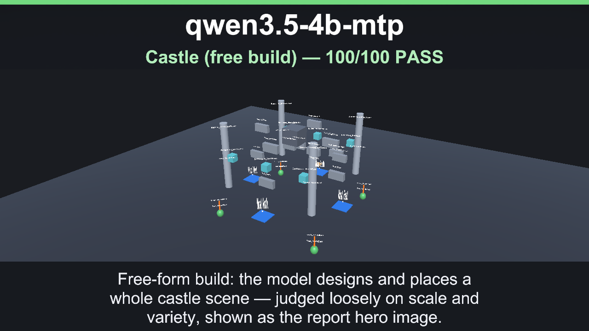
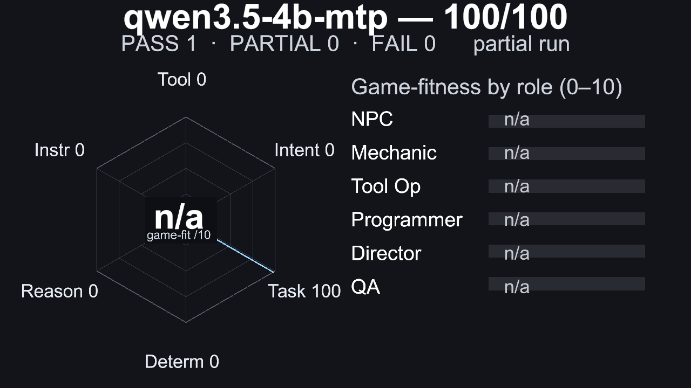
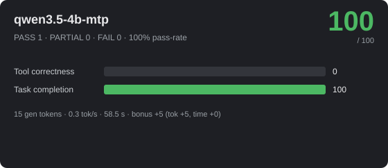
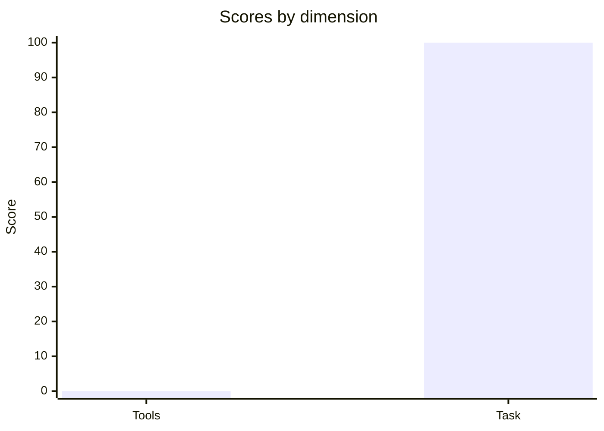

# 🎮 qwen3.5-4b-mtp — 100/100



_Hero: G6 Castle free-build scene, preserving the model-authored layout._







> **Excellent** · PASS 1 / PARTIAL 0 / FAIL 0 · pass-rate 100% · mean bonus 5 · reps 1

- **By group:** G6 100/100 (1/1 pass)
- **Best:** Castle (free build) (100) · **Worst:** Castle (free build) (100)
- **Cost of run:** 677 tokens (15 generated) · 0.3 tok/s decode (effective 0.3 across the agentic session) · $0 · 58.5 s total
- **Speed/efficiency bonus:** mean +5 (fewer tokens +5, less time +0)
- **Model setup:** backend `OpenAiCompatibleHttp` · native-tools True · streaming True · temp 0.1 · reps 1 · parallel-tools 4
- **Run:** `20260630_070722` (2026-06-30T07:07:22.3764248Z) · Unity 6000.3.14f1 · suite 1.6

## 📐 Summary by dimension

<svg xmlns="http://www.w3.org/2000/svg" width="640" height="132" viewBox="0 0 640 132" font-family="Segoe UI, Arial, sans-serif"><rect width="640" height="132" rx="10" fill="#1e1f24"/><text x="20" y="39" fill="#c8ccd0" font-size="12">Tool correctness</text><rect x="174" y="24" width="340" height="16" rx="4" fill="#33353b"/><rect x="174" y="24" width="0" height="16" rx="4" fill="#dc5c57"/><text x="528" y="37" fill="#e8e8ea" font-size="12">0/100</text><text x="20" y="67" fill="#c8ccd0" font-size="12">Task completion</text><rect x="174" y="52" width="340" height="16" rx="4" fill="#33353b"/><rect x="174" y="52" width="340" height="16" rx="4" fill="#4cb863"/><text x="528" y="65" fill="#e8e8ea" font-size="12">100/100</text><text x="20" y="95" fill="#c8ccd0" font-size="12">Efficiency bonus</text><rect x="174" y="80" width="340" height="16" rx="4" fill="#33353b"/><rect x="174" y="80" width="85" height="16" rx="4" fill="#dc5c57"/><text x="528" y="93" fill="#e8e8ea" font-size="12">5/20</text></svg>




## 🎯 Game-fitness — n/a (partial run)

> ⚠ **Not suitable for agentic game-dev roles** — tool correctness is below the minimum a model needs to drive tools reliably.

> ℹ Run the full suite (all groups) for a complete role assessment — this run only measured some dimensions, so each role's score is left unrated below.

| Role | Fit | Verdict | Why |
|---|---:|---|---|
| NPC / Dialogue | — | ⚪ Not assessed | partial run — instruction adherence not measured. simple in-character turns with occasional tool use. |
| Mechanic / GameMaster | — | ⚪ Not assessed | partial run — instruction adherence, intent/sequence not measured. drives runtime gameplay — needs strict instructions, valid tools, and speed. |
| Scene / Tool Operator | — | ⚪ Not assessed | partial run — intent/sequence, instruction adherence, determinism not measured. builds/edits scenes — fails fast when tool calls or ordering are unreliable. |
| Programmer / Logic Author | — | ⚪ Not assessed | partial run — reasoning, instruction adherence, determinism not measured. authors game logic — needs reasoning plus reliable tool use, not speed. |
| Orchestrator / Director | — | ⚪ Not assessed | partial run — reasoning, intent/sequence, instruction adherence, determinism not measured. multi-step control — needs high reasoning, sequencing, and instruction-following. |
| QA / Regression Judge | — | ⚪ Not assessed | partial run — determinism, instruction adherence, reasoning not measured. validation — needs stable, rule-following judgments. |

## 🔧 Tool-call statistics

- **Total tool calls:** 40 · failed 0 · invalid world commands 0 · error-rate 0%

| Scenario | Group | Turns | Tool calls | Failed | Invalid | Tokens |
|---|---|---:|---:|---:|---:|---:|
| Castle (free build) | G6 | 1 | 40 | 0 | 0 | ~677 |

## 🏁 Scenario scores

| Scenario | Group | Base | Bonus (eff) | Total | Verdict | s |
|---|---|---:|---:|---:|---|---:|
| Castle (free build) | G6 | 100 | 5 (5) | 105 | ✅ PASS | 58.5 |

_Base 0..100; Bonus = correctness + efficiency (fewer tokens & less time than budget), capped 20. `~tokens` = BPE estimate (provider usage unavailable)._

## Failed checkpoints

_None — every checkpoint passed._

---
## Full model session

### G6 · Castle (free build)

```text
GOAL: Build the most impressive castle you can — full creative freedom over its shape and details. Use the world_command tool only, action='spawn', prefabKey='Cube', a DISTINCT targetName for every object, and explicit x,y,z coordinates kept within the -9..9 range so the whole castle fits in one screenshot (y is height, larger y = higher).

Make it read like a real castle and pack in as much detail as you can manage. Use names that hint at what each object is so the scene is colourful and legible:
- tall corner Towers placed so the walls between them form a real enclosed perimeter;
- Walls connecting the towers, with a Gate or Door gap at the front;
- a central Keep (or Castle) block in the middle;
- Flags high on the towers (use a larger y);
- then add as many extras as you like for grandeur: battlements, a Bridge, a Moat/Water ring, Trees and Torches outside, banners, courtyard props, stairs, or roofs.

Aim for AT LEAST 24 objects — the bigger, more detailed, and better-arranged, the better. Choose your own coordinates, but place walls so the towers actually connect into a perimeter and put the keep in the centre. Keep every targetName distinct.

--- turn 1 ---
ASSISTANT: Agent stopped: exceeded maximum of 10 tool-call roundtrips.
TOOL: world_command (ok, 48ms, native) — {"Success":true,"Message":"World command 'spawn' executed successfully","Action":"spawn"}
TOOL: world_command (ok, 41ms, native) — {"Success":true,"Message":"World command 'spawn' executed successfully","Action":"spawn"}
TOOL: world_command (ok, 38ms, native) — {"Success":true,"Message":"World command 'spawn' executed successfully","Action":"spawn"}
TOOL: world_command (ok, 38ms, native) — {"Success":true,"Message":"World command 'spawn' executed successfully","Action":"spawn"}
TOOL: world_command (ok, 3ms, native) — {"Success":true,"Message":"World command 'spawn' executed successfully","Action":"spawn"}
TOOL: world_command (ok, 3ms, native) — {"Success":true,"Message":"World command 'spawn' executed successfully","Action":"spawn"}
TOOL: world_command (ok, 3ms, native) — {"Success":true,"Message":"World command 'spawn' executed successfully","Action":"spawn"}
TOOL: world_command (ok, 3ms, native) — {"Success":true,"Message":"World command 'spawn' executed successfully","Action":"spawn"}
TOOL: world_command (ok, 2ms, native) — {"Success":true,"Message":"World command 'spawn' executed successfully","Action":"spawn"}
TOOL: world_command (ok, 3ms, native) — {"Success":true,"Message":"World command 'spawn' executed successfully","Action":"spawn"}
TOOL: world_command (ok, 3ms, native) — {"Success":true,"Message":"World command 'spawn' executed successfully","Action":"spawn"}
TOOL: world_command (ok, 2ms, native) — {"Success":true,"Message":"World command 'spawn' executed successfully","Action":"spawn"}
TOOL: world_command (ok, 16ms, native) — {"Success":true,"Message":"World command 'spawn' executed successfully","Action":"spawn"}
TOOL: world_command (ok, 12ms, native) — {"Success":true,"Message":"World command 'spawn' executed successfully","Action":"spawn"}
TOOL: world_command (ok, 10ms, native) — {"Success":true,"Message":"World command 'spawn' executed successfully","Action":"spawn"}
TOOL: world_command (ok, 9ms, native) — {"Success":true,"Message":"World command 'spawn' executed successfully","Action":"spawn"}
TOOL: world_command (ok, 3ms, native) — {"Success":true,"Message":"World command 'spawn' executed successfully","Action":"spawn"}
TOOL: world_command (ok, 4ms, native) — {"Success":true,"Message":"World command 'spawn' executed successfully","Action":"spawn"}
TOOL: world_command (ok, 4ms, native) — {"Success":true,"Message":"World command 'spawn' executed successfully","Action":"spawn"}
TOOL: world_command (ok, 4ms, native) — {"Success":true,"Message":"World command 'spawn' executed successfully","Action":"spawn"}
TOOL: world_command (ok, 2ms, native) — {"Success":true,"Message":"World command 'spawn' executed successfully","Action":"spawn"}
TOOL: world_command (ok, 2ms, native) — {"Success":true,"Message":"World command 'spawn' executed successfully","Action":"spawn"}
TOOL: world_command (ok, 2ms, native) — {"Success":true,"Message":"World command 'spawn' executed successfully","Action":"spawn"}
TOOL: world_command (ok, 7ms, native) — {"Success":true,"Message":"World command 'spawn' executed successfully","Action":"spawn"}
TOOL: world_command (ok, 2ms, native) — {"Success":true,"Message":"World command 'spawn' executed successfully","Action":"spawn"}
TOOL: world_command (ok, 2ms, native) — {"Success":true,"Message":"World command 'spawn' executed successfully","Action":"spawn"}
TOOL: world_command (ok, 2ms, native) — {"Success":true,"Message":"World command 'spawn' executed successfully","Action":"spawn"}
TOOL: world_command (ok, 3ms, native) — {"Success":true,"Message":"World command 'spawn' executed successfully","Action":"spawn"}
TOOL: world_command (ok, 4ms, native) — {"Success":true,"Message":"World command 'spawn' executed successfully","Action":"spawn"}
TOOL: world_command (ok, 5ms, native) — {"Success":true,"Message":"World command 'spawn' executed successfully","Action":"spawn"}
TOOL: world_command (ok, 5ms, native) — {"Success":true,"Message":"World command 'spawn' executed successfully","Action":"spawn"}
TOOL: world_command (ok, 5ms, native) — {"Success":true,"Message":"World command 'spawn' executed successfully","Action":"spawn"}
TOOL: world_command (ok, 4ms, native) — {"Success":true,"Message":"World command 'spawn' executed successfully","Action":"spawn"}
TOOL: world_command (ok, 4ms, native) — {"Success":true,"Message":"World command 'spawn' executed successfully","Action":"spawn"}
TOOL: world_command (ok, 4ms, native) — {"Success":true,"Message":"World command 'spawn' executed successfully","Action":"spawn"}
TOOL: world_command (ok, 5ms, native) — {"Success":true,"Message":"World command 'spawn' executed successfully","Action":"spawn"}
TOOL: world_command (ok, 30ms, native) — {"Success":true,"Message":"World command 'spawn' executed successfully","Action":"spawn"}
TOOL: world_command (ok, 30ms, native) — {"Success":true,"Message":"World command 'spawn' executed successfully","Action":"spawn"}
TOOL: world_command (ok, 31ms, native) — {"Success":true,"Message":"World command 'spawn' executed successfully","Action":"spawn"}
TOOL: world_command (ok, 31ms, native) — {"Success":true,"Message":"World command 'spawn' executed successfully","Action":"spawn"}
```
