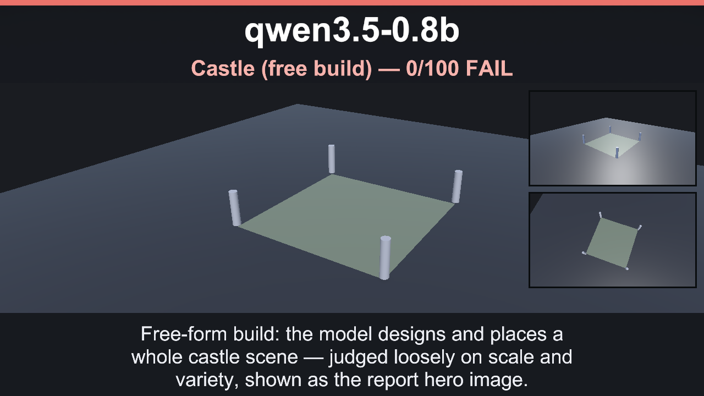
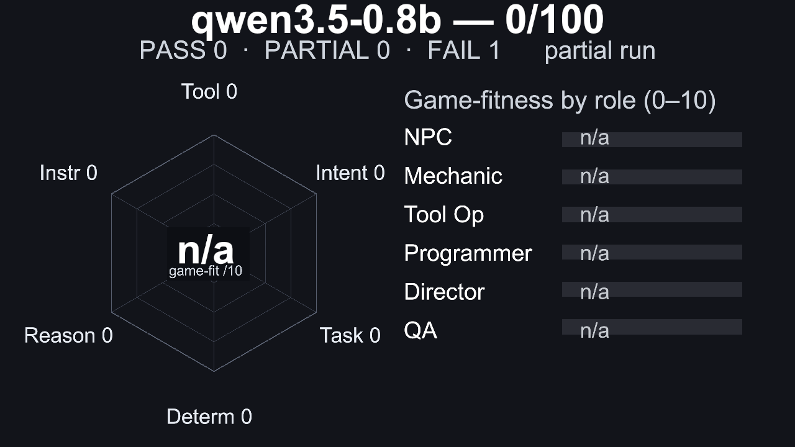
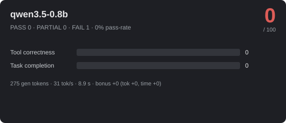
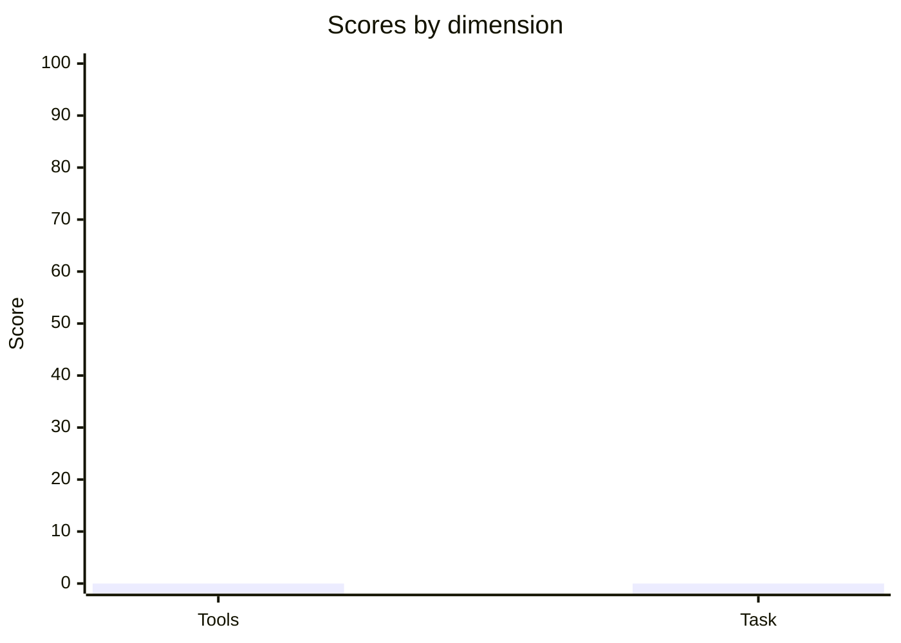

# 🎮 qwen3.5-0.8b — 0/100



_Hero: G6 Castle free-build scene, preserving the model-authored layout._







> **Failing** · PASS 0 / PARTIAL 0 / FAIL 1 · pass-rate 0% · mean bonus 0 · reps 1 · CoreAI Game-Creation Benchmark v1

- **By group:** G6 0/100 (0/1 pass)
- **Best:** Castle (free build) (0) · **Worst:** Castle (free build) (0)
- **Cost of run:** 1176 tokens (275 generated) · 31 tok/s decode (effective 30.9 across the agentic session) · $0 · 8.9 s total
- **Speed/efficiency bonus:** mean +0 (fewer tokens +0, less time +0)
- **Model setup:** backend `OpenAiCompatibleHttp` · native-tools True · streaming True · temp 0.1 · reps 1 · parallel-tools 4
- **Run:** `20260630_162939` (2026-06-30T11:29:39.1341129Z) · Unity 6000.3.14f1 · suite 1.6

## 📐 Summary by dimension

<svg xmlns="http://www.w3.org/2000/svg" width="640" height="132" viewBox="0 0 640 132" font-family="Segoe UI, Arial, sans-serif"><rect width="640" height="132" rx="10" fill="#1e1f24"/><text x="20" y="39" fill="#c8ccd0" font-size="12">Tool correctness</text><rect x="174" y="24" width="340" height="16" rx="4" fill="#33353b"/><rect x="174" y="24" width="0" height="16" rx="4" fill="#dc5c57"/><text x="528" y="37" fill="#e8e8ea" font-size="12">0/100</text><text x="20" y="67" fill="#c8ccd0" font-size="12">Task completion</text><rect x="174" y="52" width="340" height="16" rx="4" fill="#33353b"/><rect x="174" y="52" width="0" height="16" rx="4" fill="#dc5c57"/><text x="528" y="65" fill="#e8e8ea" font-size="12">0/100</text><text x="20" y="95" fill="#c8ccd0" font-size="12">Efficiency bonus</text><rect x="174" y="80" width="340" height="16" rx="4" fill="#33353b"/><rect x="174" y="80" width="0" height="16" rx="4" fill="#dc5c57"/><text x="528" y="93" fill="#e8e8ea" font-size="12">0/20</text></svg>




## 🎯 Game-fitness — n/a (partial run)

> ⚠ **Not suitable for agentic game-dev roles** — tool correctness is below the minimum a model needs to drive tools reliably.

> ℹ Run the full suite (all groups) for a complete role assessment — this run only measured some dimensions, so each role's score is left unrated below.

| Role | Fit | Verdict | Why |
|---|---:|---|---|
| NPC / Dialogue | — | ⚪ Not assessed | partial run — instruction adherence not measured. simple in-character turns with occasional tool use. |
| Mechanic / GameMaster | — | ⚪ Not assessed | partial run — instruction adherence, intent/sequence not measured. drives runtime gameplay — needs strict instructions, valid tools, and speed. |
| Scene / Tool Operator | — | ⚪ Not assessed | partial run — intent/sequence, instruction adherence, determinism not measured. builds/edits scenes — fails fast when tool calls or ordering are unreliable. |
| Programmer / Logic Author | — | ⚪ Not assessed | partial run — reasoning, instruction adherence, determinism not measured. authors game logic — needs reasoning plus reliable tool use, not speed. |
| Orchestrator / Director | — | ⚪ Not assessed | partial run — reasoning, intent/sequence, instruction adherence, determinism not measured. multi-step control — needs high reasoning, sequencing, and instruction-following. |
| QA / Regression Judge | — | ⚪ Not assessed | partial run — determinism, instruction adherence, reasoning not measured. validation — needs stable, rule-following judgments. |

## 🔧 Tool-call statistics

- **Total tool calls:** 10 · failed 0 · invalid world commands 0 · error-rate 0%

| Scenario | Group | Turns | Tool calls | Failed | Invalid | Tokens |
|---|---|---:|---:|---:|---:|---:|
| Castle (free build) | G6 | 1 | 10 | 0 | 0 | ~1176 |

## 🏁 Scenario scores

| Scenario | Group | Base | Bonus (eff) | Total | Verdict | s |
|---|---|---:|---:|---:|---|---:|
| Castle (free build) | G6 | 0 | 0 (0) | 0 | ❌ FAIL | 8.9 |

_Base 0..100; Bonus = correctness + efficiency (fewer tokens & less time than budget), capped 20. `~tokens` = BPE estimate (provider usage unavailable)._

## Failed checkpoints

### Castle (free build)
- [MANDATORY] built a substantial scene (w60) — 10 spawn commands
- [opt] rich variety/scale (w40) — 10 spawn commands

---
## Full model session

### G6 · Castle (free build)

```text
GOAL: Build the most impressive castle you can. This is a showcase of your 3D spatial reasoning: the more complete, structured and detailed the castle, the better you score. Use the world_command tool only, action='spawn', a DISTINCT targetName for every object, and explicit x,y,z coordinates within the -9..9 range so the whole castle fits in one screenshot (y is height, larger y = higher; the ground is at y=0).

Pick the primitive that best fits each part via prefabKey — one of: cube, sphere, cylinder, capsule, plane, quad. For example cylinders for round towers and flag poles, cubes for walls/keep/battlements, spheres for domes/treetops, a plane for the ground.

A castle MUST have, at minimum: four corner towers, walls connecting them into a closed perimeter, a gate gap at the front, and a central keep. Then add grandeur: battlements along the walls, flags on top of the towers, roofs, a bridge, a moat ring, trees and torches outside.

If you are unsure how to lay it out, follow this proven skeleton and then EXTEND it with more detail:
- Ground: prefabKey='plane' at (0,0,0).
- Four corner towers: prefabKey='cylinder' at (-6,1.5,-6), (6,1.5,-6), (-6,1.5,6), (6,1.5,6).
- Walls (cubes) spaced every ~2 units along each of the four edges connecting the towers, e.g. the back wall at z=-6 with x = -4,-2,0,2,4 (leave the front edge z=6 open in the middle for the gate).
- Keep: a few stacked cubes near (0,1,0).
- Flags: prefabKey='cylinder' on top of each tower at y=4.
- Battlements: small cubes at y=3 along the wall tops; torches (cylinders) flanking the gate.

Aim for AT LEAST 24 objects — ideally 30+. Place walls so the towers actually connect into a perimeter and keep every targetName distinct. Do not stop early: keep emitting spawn calls until the castle is full and detailed — quantity and structure come first.

For natural variety you may resize parts with action='set_scale' (a uniform 'scale', e.g. taller towers, a bigger keep) and turn pieces with action='rotate' (fx/fy/fz degrees). Only do this after you have spawned plenty of objects — never let it reduce how many objects you build.

--- turn 1 ---
ASSISTANT: Agent stopped: exceeded maximum of 10 tool-call roundtrips.
TOOL: world_command (ok, 50ms, native) — {"Success":true,"Message":"World command 'spawn' executed successfully","Action":"spawn"}
TOOL: world_command (ok, 5ms, native) — {"Success":true,"Message":"World command 'spawn' executed successfully","Action":"spawn"}
TOOL: world_command (ok, 2ms, native) — {"Success":true,"Message":"World command 'spawn' executed successfully","Action":"spawn"}
TOOL: world_command (ok, 2ms, native) — {"Success":true,"Message":"World command 'spawn' executed successfully","Action":"spawn"}
TOOL: world_command (ok, 2ms, native) — {"Success":true,"Message":"World command 'spawn' executed successfully","Action":"spawn"}
TOOL: world_command (ok, 1ms, native) — {"Success":true,"Message":"World command 'spawn' executed successfully","Action":"spawn"}
TOOL: world_command (ok, 2ms, native) — {"Success":true,"Message":"World command 'spawn' executed successfully","Action":"spawn"}
TOOL: world_command (ok, 1ms, native) — {"Success":true,"Message":"World command 'spawn' executed successfully","Action":"spawn"}
TOOL: world_command (ok, 2ms, native) — {"Success":true,"Message":"World command 'spawn' executed successfully","Action":"spawn"}
TOOL: world_command (ok, 2ms, native) — {"Success":true,"Message":"World command 'spawn' executed successfully","Action":"spawn"}
```
