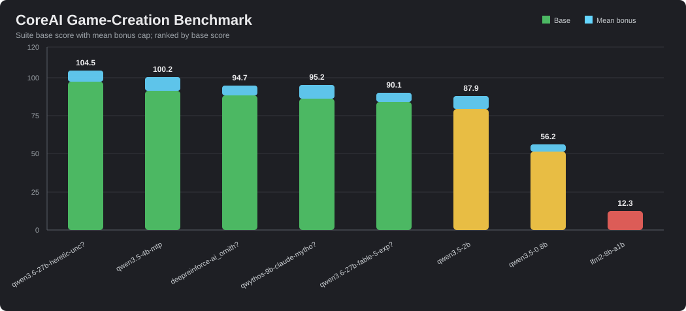
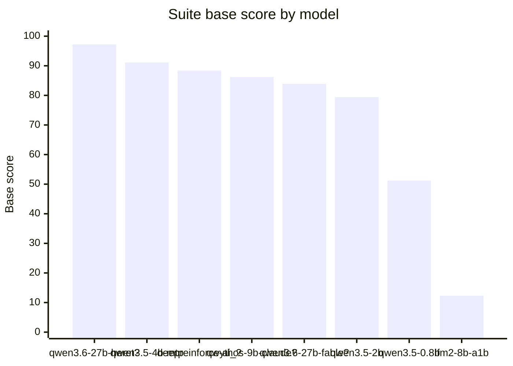
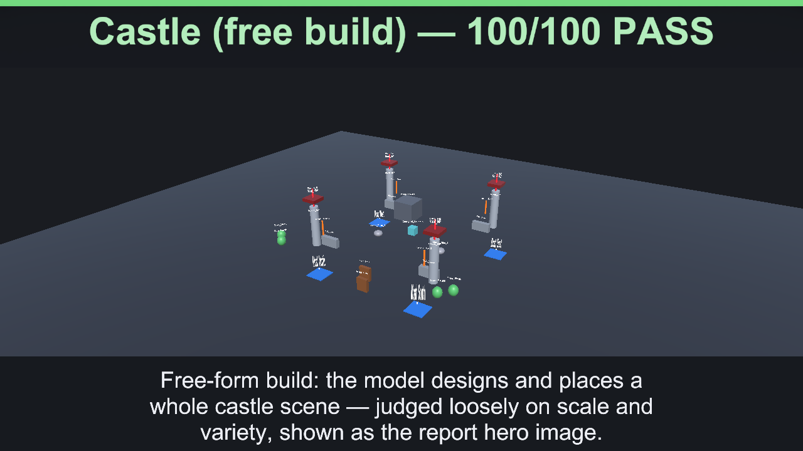
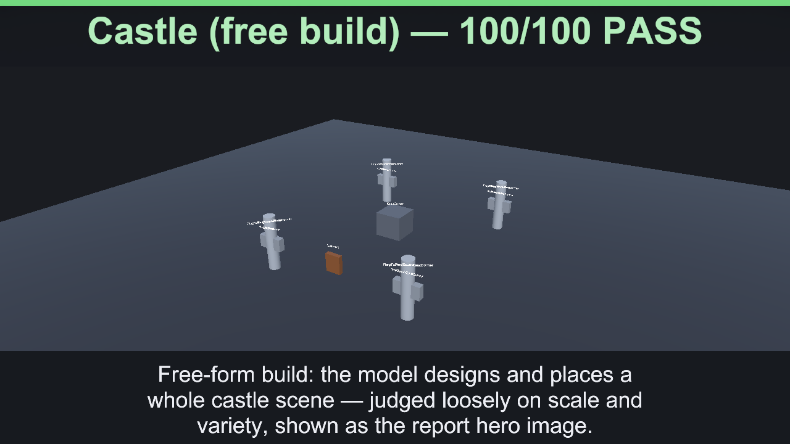
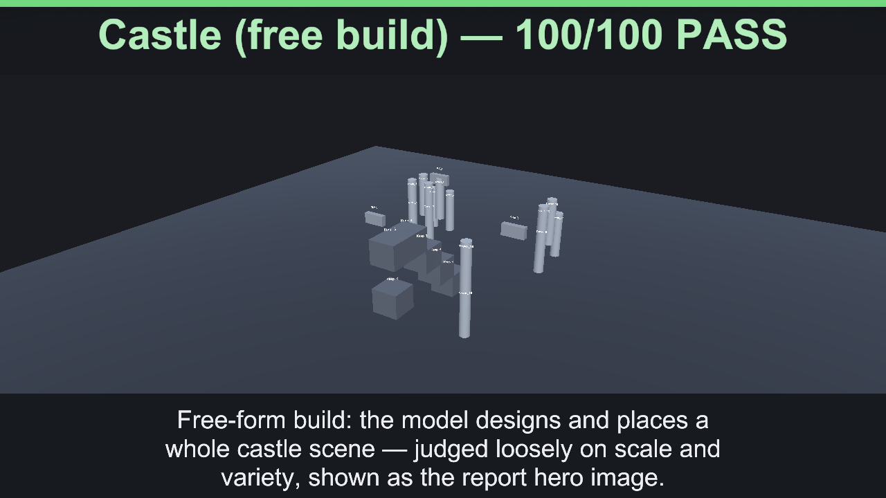

# ?? CoreAI Benchmark ? Game-Creation Benchmark

8 model(s), ranked by suite base score. Bonus is the report mean bonus; Total = Base + Bonus.

| # | Model | Base | Bonus | Total | Pass-rate | P/PA/F | Tools | Intent | Task | Determ | Reason | Instr | Eff | Tool-err | Tokens | Run |
|---:|---|---:|---:|---:|---:|---|---:|---:|---:|---:|---:|---:|---:|---:|---:|---|
| 1 | `qwen3.6-27b-heretic-uncensored-finetune-neo-code-di-imatrix-max` | **97.2** | 7.4 | **104.5** | 91.7% | 22/2/0 | 90.7 | 97.5 | 100 | 100 | 100 | 96.3 | 2.6 | 12.9% | 106463 | [`20260630_015516`](BENCHMARK_20260630_015516_qwen3.6-27b-heretic-uncensored-finetune-neo-code-di-imatrix-.md) |
| 2 | `qwen3.5-4b-mtp` | **91.1** | 9 | **100.2** | 79.2% | 19/3/2 | 88 | 98 | 94.2 | 100 | 96.3 | 77.8 | 4.8 | 24.7% | 111193 | [`20260630_000446`](BENCHMARK_20260630_000446_qwen3.5-4b-mtp.md) |
| 3 | `deepreinforce-ai_ornith-1.0-9b` | **88.4** | 6.3 | **94.7** | 62.5% | 15/7/2 | 74.1 | 100 | 93.8 | 100 | 88.9 | 88.9 | 3.1 | 54.7% | 97583 | [`20260630_001730`](BENCHMARK_20260630_001730_deepreinforce-ai_ornith-1.0-9b.md) |
| 4 | `qwythos-9b-claude-mythos-5-1m` | **86.2** | 9 | **95.2** | 75% | 18/3/3 | 82.4 | 89 | 89.3 | 83.3 | 77.8 | 88.9 | 4.9 | 18.3% | 117850 | [`20260630_004250`](BENCHMARK_20260630_004250_qwythos-9b-claude-mythos-5-1m.md) |
| 5 | `qwen3.6-27b-fable-5-experimental` | **83.9** | 6.2 | **90.1** | 70.8% | 17/3/4 | 78.7 | 80.4 | 84.7 | 50 | 81.5 | 94.4 | 2.5 | 19.1% | 126110 | [`20260630_012400`](BENCHMARK_20260630_012400_qwen3.6-27b-fable-5-experimental.md) |
| 6 | `qwen3.5-2b` | **79.4** | 8.5 | **87.9** | 70.8% | 17/1/6 | 88.9 | 86.3 | 78.6 | 50 | 50.6 | 91.7 | 4.9 | 22.7% | 97549 | [`20260629_235827`](BENCHMARK_20260629_235827_qwen3.5-2b.md) |
| 7 | `qwen3.5-0.8b` | **51.2** | 5 | **56.2** | 33.3% | 8/4/12 | 83.3 | 61 | 70.6 | 50 | 37.3 | 55.6 | 3.2 | 12.1% | 52315 | [`20260629_235214`](BENCHMARK_20260629_235214_qwen3.5-0.8b.md) |
| 8 | `lfm2-8b-a1b` | **12.3** | 0 | **12.3** | 0% | 0/0/24 | 50 | 2.2 | 0 | 0 | 0 | 72.2 | 0 | 0% | 87038 | [`20260630_000238`](BENCHMARK_20260630_000238_lfm2-8b-a1b.md) |

## Best per dimension

- **Tools:** `qwen3.6-27b-heretic-uncensored-finetune-neo-code-di-imatrix-max` (90.7/100)
- **Intent:** `deepreinforce-ai_ornith-1.0-9b` (100/100)
- **Task:** `qwen3.6-27b-heretic-uncensored-finetune-neo-code-di-imatrix-max` (100/100)
- **Determ:** `qwen3.6-27b-heretic-uncensored-finetune-neo-code-di-imatrix-max` (100/100)
- **Reason:** `qwen3.6-27b-heretic-uncensored-finetune-neo-code-di-imatrix-max` (100/100)
- **Instr:** `qwen3.6-27b-heretic-uncensored-finetune-neo-code-di-imatrix-max` (96.3/100)

## Hero Gallery

| Model | Run | Hero |
|---|---|---|
| `qwen3.6-27b-heretic-uncensored-finetune-neo-code-di-imatrix-max` | [`20260630_015516`](BENCHMARK_20260630_015516_qwen3.6-27b-heretic-uncensored-finetune-neo-code-di-imatrix-.md) |  |
| `qwen3.5-4b-mtp` | [`20260630_000446`](BENCHMARK_20260630_000446_qwen3.5-4b-mtp.md) |  |
| `deepreinforce-ai_ornith-1.0-9b` | [`20260630_001730`](BENCHMARK_20260630_001730_deepreinforce-ai_ornith-1.0-9b.md) |  |
| `qwythos-9b-claude-mythos-5-1m` | [`20260630_004250`](BENCHMARK_20260630_004250_qwythos-9b-claude-mythos-5-1m.md) |  |
| `qwen3.6-27b-fable-5-experimental` | [`20260630_012400`](BENCHMARK_20260630_012400_qwen3.6-27b-fable-5-experimental.md) |  |
| `qwen3.5-2b` | [`20260629_235827`](BENCHMARK_20260629_235827_qwen3.5-2b.md) |  |
| `qwen3.5-0.8b` | [`20260629_235214`](BENCHMARK_20260629_235214_qwen3.5-0.8b.md) |  |
